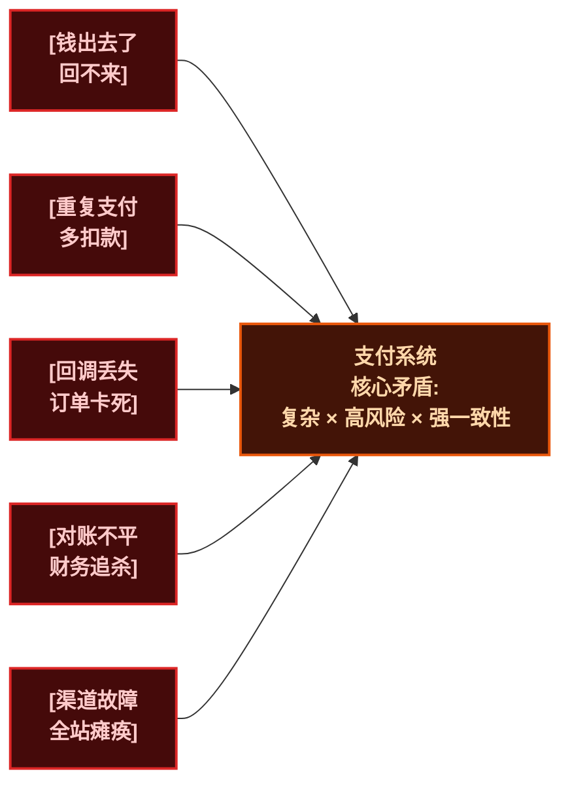
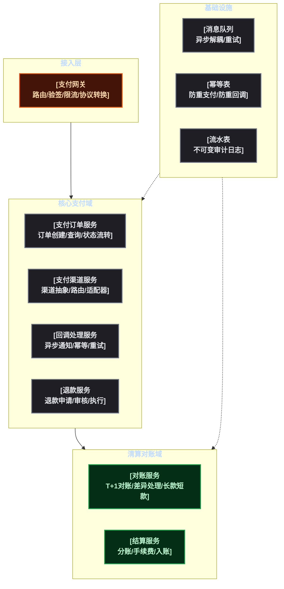
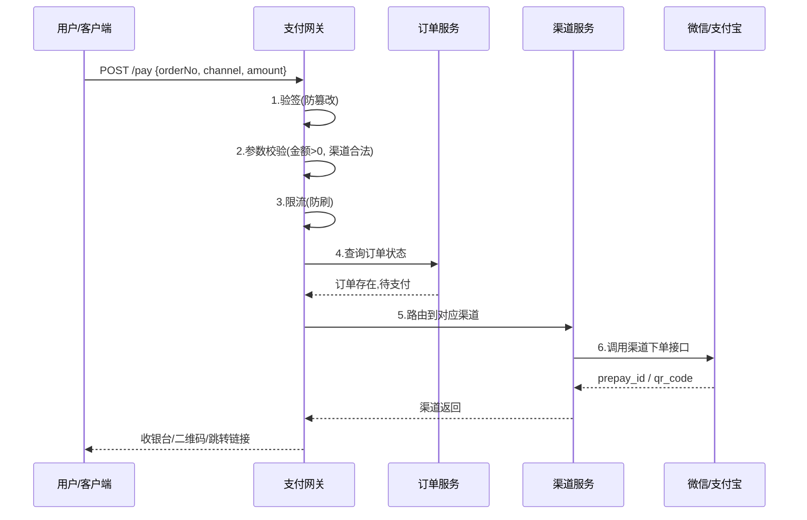
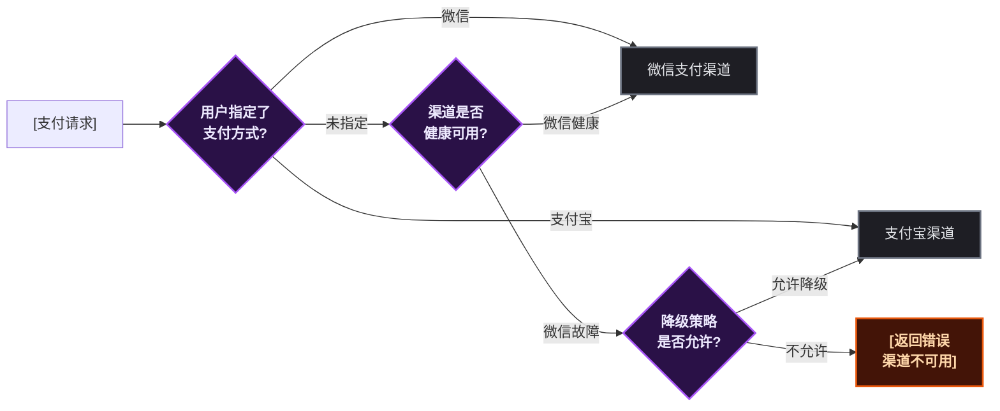
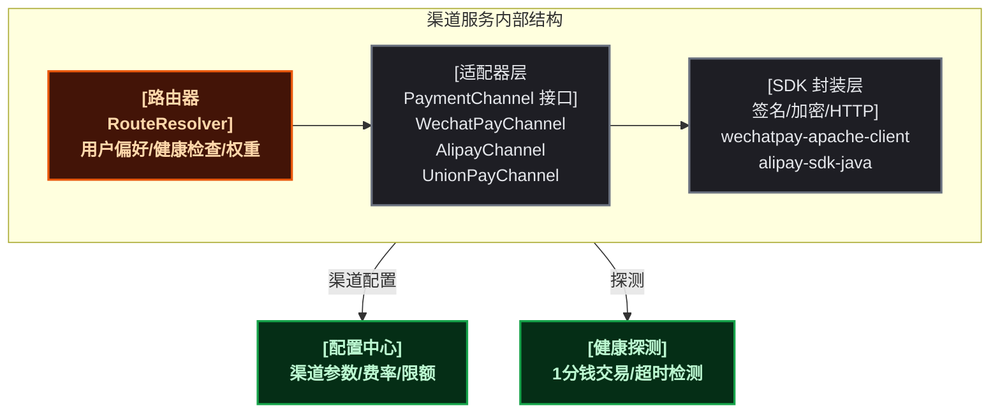
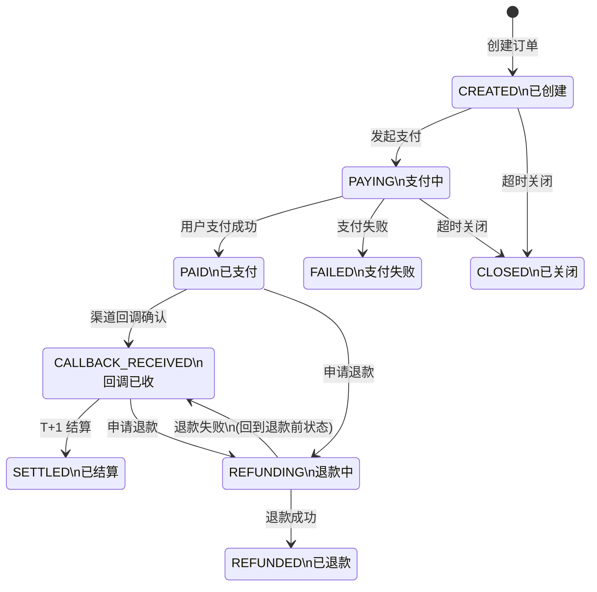
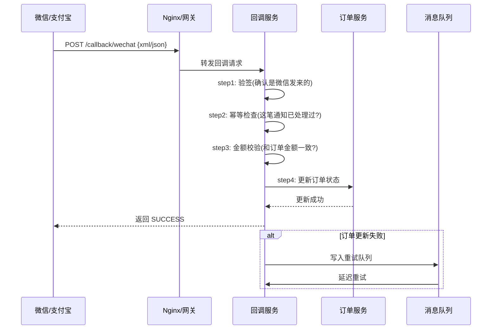
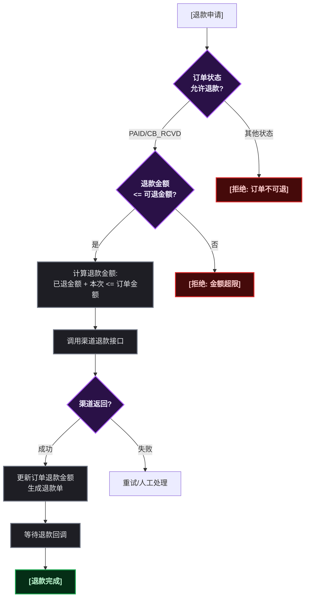
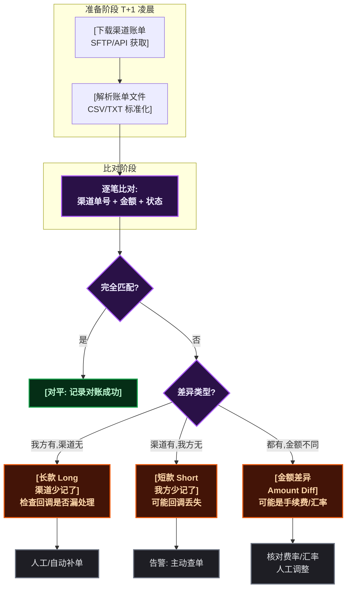
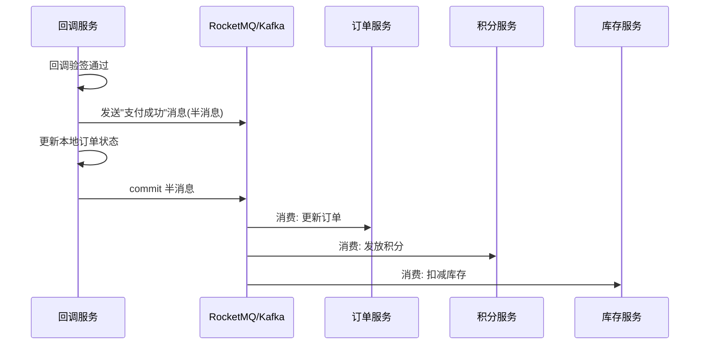

# 一笔钱在微服务里到底怎么走的

## 为什么支付是微服务里最难啃的骨头

做业务开发，碰到的最常见代码可能就是 CRUD。增删改查写熟了，觉得微服务也不过如此——直到某天被分配了支付模块。

支付和普通业务有本质区别：<strong>普通业务操作的是"信息"，支付操作的是"钱"</strong>。写错一行代码，信息可以修，钱出去了就是真金白银的损失。更麻烦的是，支付不是自己一个服务就能搞定的事——要接微信、要接支付宝、可能还要接银联、接 Stripe。每家渠道的接口风格不同，回调机制不同，对账方式也不同。上游还有订单系统在等支付结果，下游有会计系统等着入账。



把这些复杂度拆开来看，一个支付系统本质上要解决五个问题：

1. <strong>怎么收</strong>——对接各种支付渠道，屏蔽渠道差异
2. <strong>怎么记</strong>——每笔钱的来龙去脉都要有据可查
3. <strong>怎么验</strong>——回调确认钱真的到了，不是"用户说付了就算付了"
4. <strong>怎么对</strong>——自己的账和渠道的账对得上
5. <strong>怎么退</strong>——钱能收就能退，但不能退多了，也不能重复退

下面逐个拆解。

## 支付系统的"五脏六腑"：模块全景图

在动手写代码之前，先搞清楚一笔钱在系统里要经过哪些模块。



每个模块解决一类问题：

| 模块 | 核心职责 | 搞砸了会怎样 |
|------|---------|------------|
| <strong>支付网关</strong> | 统一入口、验签、路由、协议转换 | 全站支付不可用 |
| <strong>支付订单</strong> | 订单生命周期管理、状态流转 | 订单卡死，用户钱扣了但订单不成功 |
| <strong>支付渠道</strong> | 对接微信/支付宝/银联，屏蔽差异 | 渠道切换时要改所有上层代码 |
| <strong>回调处理</strong> | 接收异步通知、幂等校验、更新订单 | 钱到了但订单没更新，用户投诉 |
| <strong>退款服务</strong> | 退款申请→审核→执行→回调 | 退了两次，或者退多了 |
| <strong>对账服务</strong> | T+1 比对渠道账单和内部流水 | 账不平，财务没法关账 |
| <strong>消息队列</strong> | 异步解耦、回调重试 | 同步调用链过长，一个超时全链路卡死 |

## 支付网关：流量的第一道闸门

支付网关不是 Spring Cloud Gateway 那种 HTTP 网关——<strong>它是支付域的业务网关</strong>，负责站在"支付"的边界上做纵向切面。

### 网关到底在做什么



每一步都是一道防线：

<strong>验签</strong>：请求有没有被中间人篡改？网关拿到请求第一件事就是验签。和生产环境相关的另一个要点是——签名的 key 绝对不能硬编码在代码里，要用配置中心（Nacos/Apollo）动态下发的密钥，并且定期轮换。

<strong>参数校验</strong>：金额不能为 0，不能为负数，不能超过单笔上限。渠道编码必须在白名单里。这些看似废话的校验在线上真有人绕过——比如抓包改了金额字段。

<strong>限流</strong>：如果某个用户短时间内发起几百笔支付请求，大概率是在撞库或者刷单。网关层做一层粗暴的 IP+用户维度的令牌桶限流，挡掉 90% 的恶意流量。

### 渠道路由：怎么决定走微信还是支付宝



渠道路由不能简单写死 `if-else` ，需要考虑几点：

- <strong>健康检查</strong>：渠道服务定期探测第三方接口（比如每分钟发一笔 1 分钱的探测交易），如果连续失败 N 次就把该渠道标记为不可用
- <strong>降级策略</strong>：微信挂了能不能自动切支付宝？不能的话需要多久能止损？（答案是：代码需要支持，且提前配置好降级开关）
- <strong>权重分配</strong>：在正常状态下，某些场景可能按比例分配（比如小程序内默认微信），但不是简单的轮询——业务场景决定了支付方式的优先级

## 支付渠道：与微信/支付宝打交道的"翻译官"

每接入一个新渠道，就多一个 SDK、多一套回调格式、多一份对账文件。渠道服务存在的价值就是 <strong>把这些差异封装在一个统一的抽象后面</strong> 。

### 为什么渠道抽象是必须的

假设没有渠道抽象，订单服务直接调用微信 SDK：

```
// 如果没有渠道抽象
if (channel == "WECHAT") {
    wechatPayService.unifiedOrder(...);  // 微信参数格式
} else if (channel == "ALIPAY") {
    alipayService.tradeCreate(...);      // 支付宝参数格式
} else if (channel == "UNIONPAY") {
    unionPayService.frontTransReq(...);  // 银联参数格式
}
```

每接入一个新渠道，所有调用支付的地方都要改一遍代码，然后部署，然后祈祷别出事。渠道抽象就是把这种痛苦压到一个地方：

```java
// 有渠道抽象之后
public interface PaymentChannel {
    ChannelResponse pay(PayRequest request);      // 统一下单
    ChannelResponse query(String channelOrderNo);  // 查询订单
    ChannelResponse refund(RefundRequest request); // 退款
    boolean verifyCallback(String body, String signature); // 验签回调
}

// 新渠道只需要实现这个接口，上层代码零改动
@Component
public class WechatPayChannel implements PaymentChannel { ... }

@Component
public class AlipayChannel implements PaymentChannel { ... }
```

### 渠道服务的内部结构



渠道适配其实还有更恶心的问题——<strong>同一渠道的不同支付方式</strong>。微信的 JSAPI 支付（公众号内）、NATIVE 支付（扫码）、H5 支付（移动端网页）、APP 支付——它们在微信内部是不同的接口路径、不同的签名方式。更别提微信支付 API V2 和 V3 的 JSON 格式完全不同。渠道抽象要能处理这种"同一渠道的多态"。

## 支付订单：一笔钱的一生

支付订单是整个支付系统的核心聚合根。所有操作都围绕着它展开。

### 状态机：比普通订单多一倍的状态



状态流转有两条关键约束：

1. <strong>不可逆的终态</strong>—— `SETTLED` （已结算）、 `REFUNDED` （已退款）、 `CLOSED` （已关闭）这三个是终态，到了这里就不能再流转了
2. <strong>PAID 不等于 CALLBACK_RECEIVED</strong>——用户扫了码、输了密码、微信扣了钱，这时候订单还是 `PAYING` ；只有等渠道的异步回调到达、验签通过、幂等校验通过后，才变为 `CALLBACK_RECEIVED` 。<span style="color:red">很多新手把 PAID 当成终态，然后发现"用户付了钱但订单超时关了"的惨案。</span>

### 订单表的核心字段

| 字段 | 类型 | 说明 |
|------|------|------|
| `order_no` | varchar(32) | 内部订单号，全局唯一 |
| `channel_order_no` | varchar(64) | 渠道返回的订单号（微信/支付宝的交易号） |
| `channel` | varchar(16) | 支付渠道：WECHAT / ALIPAY / UNIONPAY |
| `pay_method` | varchar(16) | 支付方式：JSAPI / NATIVE / H5 / APP |
| `amount` | decimal(12,2) | 订单金额（元） |
| `currency` | varchar(8) | 币种，默认 CNY |
| `status` | varchar(24) | 订单状态：CREATED / PAYING / PAID / CB_RCVD ... |
| `callback_status` | varchar(16) | 回调处理状态：PENDING / SUCCESS / FAILED |
| `refund_amount` | decimal(12,2) | 累计退款金额 |
| `refund_status` | varchar(16) | 退款状态：NONE / PARTIAL / FULL |
| `version` | int | 乐观锁版本号，防并发冲突 |
| `created_at / updated_at` | datetime | 时间戳 |

> ⚠️ `amount` 类型用 `decimal(12,2)` 而不是 `float` 或 `double` 。浮点数算钱有精度问题——0.1 + 0.2 != 0.3 这种经典问题在支付里就是生产事故。

## 回调处理：最容易被忽略的惊险一跃

支付和普通 CRUD 最大的区别是：<strong>不是调用完接口就结束了</strong>。用户扫码付完钱，微信不会同步告诉你"他付了"——而是异步回调你的 `notify_url` 。

### 回调处理的核心流程



### 五个回调必须处理的坑

<strong>1. 幂等</strong>——微信可能因为网络超时重复发回调。如果不做幂等，同一个支付可能触发两次"支付成功"的业务逻辑（比如发了两次货）。做法：回调到达时先查 `channel_order_no` + `callback_status` ，如果已经 `SUCCESS` 了就直接返回 "OK" 给渠道。

<strong>2. 金额校验</strong>——回调里带的金额必须和本地订单金额一致。如果真的不一致（比如微信说你付了 100 但我订单是 99），这笔订单要标记为"异常订单"人工介入。

<strong>3. appid / mchid 校验</strong>——回调里的 appid 必须和你自己的 appid 一致。防止别人拿别的商户号的回调来撞你的接口。

<strong>4. 回调超时</strong>——用户付完钱但回调一直没来怎么办？需要主动查询：定时任务每隔 N 分钟批量扫描 `PAYING` 状态超过一定时间的订单，调用渠道的 `queryOrder` 接口主动查询状态。

<strong>5. 返回格式</strong>——微信 V2 回调返回 `<xml><return_code>SUCCESS</return_code></xml>` ，支付宝返回 `success` 字符串。返回格式写错了，渠道会认为你没有成功接收，不断重推回调，把服务打崩。

## 退款：比支付复杂三倍的逆向流程

支付是单向的钱流，退款则是双向的——钱要退还用户，订单金额要扣减，优惠券/积分要回退，会计凭证要冲正。



退款的几个关键约束：

- <strong>部分退款</strong>：100 元的订单可以退 30 元，剩下的 70 还能再退。要维护 `refund_amount` 累加字段
- <strong>总额不超</strong>：所有退款加起来不能超过订单原金额。这个校验必须加行级锁或者乐观锁，不然并发退款可能突破总额限制
- <strong>退款也有回调</strong>：渠道退款也是异步的——调用退款接口成功 ≠ 钱真的退到用户账户了，要等退款回调

## 对账：月底财务追杀令的源头

"你们的账和微信的对不上，差 3 块钱，查一下。"——每个做过支付的人都收过这样的消息。

### 对账的完整流程



对账的核心概念：

| 术语 | 含义 | 常见原因 |
|------|------|---------|
| <strong>长款</strong> | 本地有记录，渠道账单没有 | 回调漏处理、定时查询补偿还没执行 |
| <strong>短款</strong> | 渠道有记录，本地没记录 | 回调丢了、订单没创建成功但用户确实付了钱 |
| <strong>金额差异</strong> | 两边都有但金额不一致 | 手续费没扣除、汇率折算差异、退款部分差异 |

对账文件通常是 T+1 提供的——今天的交易明天凌晨才能拿到账单。所以对账是个离线批处理任务，不需要实时性。但要处理好以下几点：

- <strong>文件下载</strong>：微信的账单通过 API 下载（需要证书），支付宝通过 SFTP。两种方式都要支持
- <strong>大文件处理</strong>：日交易量大的话账单可能有几十万行，需要分片并行处理
- <strong>差异处理自动化</strong>：短款差异如果能自动修复（比如主动查询渠道确认已支付），就不要堆到人工处理

## 生产环境避坑指南

前面讲的都是"应该怎么做"，下面说"不这么做会怎么死"。

### 1. 回调外网可达性

渠道回调打的是你的公网地址。如果域名证书过期、Nginx 挂了、或者安全组把回调 IP 封了——<strong>所有支付都无法确认成功</strong>。建议：

- 回调入口的域名单独做证书监控（过期前 30 天告警）
- 回调健康检查定时任务：每分钟模拟回调验签请求确认链路畅通
- Nginx 上给回调路径单独的日志和监控

### 2. 金额单位

微信支付 API V2 的金额单位是 <strong>分</strong> ，支付宝是 <strong>元</strong> 。搞混了就是 100 倍差——收 1 块钱结果扣了 100 块。渠道适配器里统一折算为"分"作为内部单位，数据库存整数（bigint），只在展示层转为元。用整数存金额杜绝了浮点精度的所有问题。

### 3. 分布式事务

支付成功之后的业务处理——比如支付成功后更新订单、发积分、扣库存——不能靠一个本地事务完成。<strong>支付系统通常不直接调用下游业务，而是发一条可靠的 MQ 消息</strong>。下游消费这条消息去执行各自的业务逻辑。这就是事务消息（Transactional Message）的核心理念。



> 📌 前置知识：事务消息（半消息）的细节可参考 `TransactionalMessageHalfMessageAndCheckback.md` ——核心思想是先发半消息、执行本地事务、再 commit，如果 commit 失败则由回查机制补偿。

### 4. 费率

支付渠道要收手续费的。微信支付通常 0.6%，支付宝类似。100 块钱的订单，实际到账是 99.4 元。如果用户的订单金额是 100，退款时退全额 100，平台就亏了 0.6 元手续费。所以退款策略里要明确：<strong>退用户全额还是退扣除手续费后的金额</strong>——这是个业务决策，但代码要能区分。

### 5. 定时补偿

定时任务扫描所有超过 N 分钟仍在 `PAYING` 状态的订单，主动调用渠道查询接口确认状态。不是所有用户付完钱都能等到回调——网络波动、渠道故障、Nginx 重启都可能导致回调丢失。这个补偿机制 <strong>是防止订单卡死的最后一道防线</strong> 。

## 总结


| 核心问题 | 答案 |
|---------|------|
| 支付网关做什么 | 验签、参数校验、限流、路由——支付域的业务防火墙 |
| 为什么需要渠道抽象 | 屏蔽微信/支付宝/银联的接口差异，新增渠道不改上层代码 |
| 回调为什么这么重要 | 支付是异步的——用户付完钱不等于系统知道你付了钱，回调才是"确认" |
| 对账怎么对 | T+1 下载渠道账单，逐笔比对，差异分长款/短款/金额差三种 |
| 生产环境最大坑 | 回调不通、金额单位搞混、缺少定时补偿、没有幂等 |
| 分布式事务怎么做 | 不用强一致性两阶段——用事务消息异步驱动下游，回调成功发消息 |

支付系统的本质不复杂——<strong>就是一个状态机，从"待支付"到"已支付"再到"已结算"，加上退款和异常处理</strong>。但每个状态转换的边界条件、每个异常路径的兜底、每个渠道的差异适配——这些才是真正花时间的地方。而且这些经验不踩一遍很难真正体会到"为什么这样设计"。

下次财务找你查那 3 块钱的差异时，不要慌——先查是不是长款（自己多），然后看回调日志，最后查定时补偿任务有没有跑。

## 参考

- [微信支付 API V3 开发者文档](https://pay.weixin.qq.com/wiki/doc/apiv3/) —— 微信支付商户平台官方文档，涵盖 JSAPI / Native / H5 / App 全场景接入、支付通知（回调）验签流程、账单下载接口
- [支付宝开放平台 API 文档](https://opendocs.alipay.com/open/194/105072) —— 支付宝当面付 / 手机网站 / 电脑网站支付接口，异步通知（notify_url）签名与验签机制
- [Stripe — Idempotent Requests](https://stripe.com/docs/api/idempotent_requests) —— Stripe 的幂等键设计：通过 `Idempotency-Key` 请求头保证同一笔支付只执行一次，业界标杆
- [RocketMQ — 事务消息](https://rocketmq.apache.org/docs/4.x/producer/06message05) —— Apache RocketMQ 事务消息（半消息 + 回查）机制，支付系统异步驱动下游的常见方案
- [Martin Fowler — Patterns of Enterprise Application Architecture](https://martinfowler.com/eaaCatalog/) —— 企业应用架构模式目录，支付系统的订单状态机、渠道抽象层都对应了其中的 Domain Model / Strategy / State 模式
- [《凤凰架构》— 分布式事务章节](https://icyfenix.cn/architect-perspective/general-architecture/transaction/) —— 周志明著，从 ACID 到 CAP 到 BASE，把分布式事务的各种实现方案（XA / TCC / Saga / 事务消息）讲透了
- [支付系统设计总结（美团技术团队）](https://tech.meituan.com/tags/支付.html) —— 美团支付技术博客系列，涵盖渠道网关、对账系统、资金安全等生产环境实战经验
