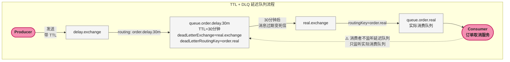
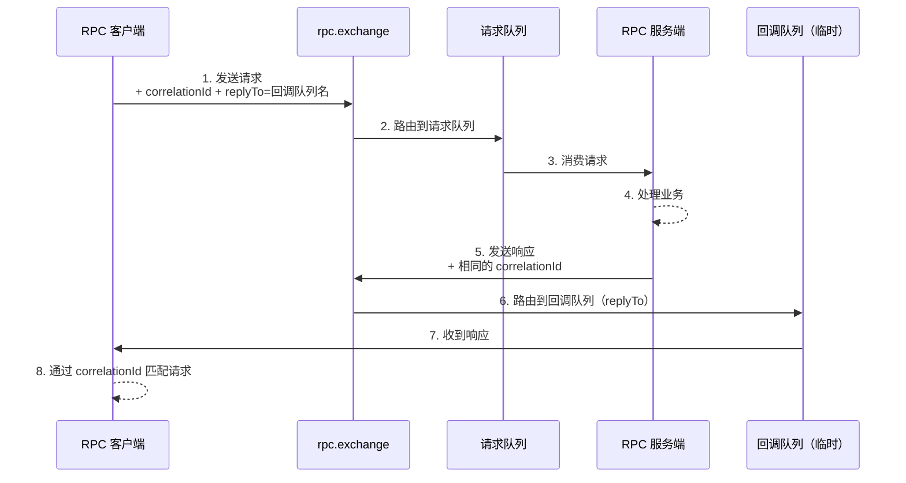

# 延迟队列与高级特性

> 📖 <strong>前置阅读</strong>：本文假设读者已掌握 RabbitMQ 的基础操作（Exchange/Queue/Binding/手动ACK）和 SpringBoot 集成。如果还不熟悉，建议先阅读前三篇。

## 一、⚡ 问题切入：有些事不能现在做

看几个每天都在发生的业务需求：

- 用户下单后 <strong>30 分钟</strong>未支付，自动取消订单
- 用户注册后 <strong>7 天</strong>未登录，发一封"想你了"邮件
- 优惠券<strong>到期前 3 小时</strong>，发短信提醒用户使用
- 支付成功后<strong>立即</strong>通知商家，但每封邮件<strong>间隔 5 秒</strong>（防被邮箱限流）

这些需求的共同点：<strong>消息不能发出去就被立刻消费，需要在未来某个时间点才能被消费</strong>。

普通队列是"发了就收"——消息一进队就被消费者拿走。延迟队列是"发了先等着，时间到了再收"。

RabbitMQ 没有原生的延迟队列类型，但有两种方式可以实现。

## 二、延迟队列方案一：TTL + 死信队列

### 2.1 原理

这是利用已有的机制组合而成的"曲线救国"方案：

```
Producer → 普通 Exchange → 死信队列(当"延迟缓冲区") → TTL 到期 → 死信 Exchange → 实际消费队列 → Consumer
                                                                       ↑
                                                                消息过期变死信自动转入
```

<strong>核心思想</strong>：创建一个<strong>没有消费者</strong>的队列，设置 TTL。消息在这个队列中"等"TTL 时间后过期变成死信，被自动转发到真正的消费队列——消费者只监听消费队列。消费者感知不到延迟的存在。



### 2.2 配置代码

每段延迟时间需要一个独立的队列——每个队列有固定的 TTL：

```java
@Configuration
public class DelayQueueConfig {

    // ========== 实际消费的 Exchange + Queue ==========
    @Bean
    public DirectExchange realExchange() {
        return new DirectExchange("order.real.exchange", true, false);
    }

    @Bean
    public Queue realOrderQueue() {
        return QueueBuilder.durable("queue.order.real").build();
    }

    @Bean
    public Binding realOrderBinding() {
        return BindingBuilder
                .bind(realOrderQueue())
                .to(realExchange())
                .with("order.real");
    }

    // ========== 三个延迟队列（30分钟 / 60分钟 / 24小时） ==========

    // 30 分钟延迟
    @Bean
    public Queue delay30mQueue() {
        return QueueBuilder.durable("queue.order.delay.30m")
                .ttl(30 * 60 * 1000)               // 消息 30 分钟后过期
                .deadLetterExchange("order.real.exchange")   // 过期后发到这里
                .deadLetterRoutingKey("order.real")
                .build();
    }

    // 60 分钟延迟
    @Bean
    public Queue delay60mQueue() {
        return QueueBuilder.durable("queue.order.delay.60m")
                .ttl(60 * 60 * 1000)
                .deadLetterExchange("order.real.exchange")
                .deadLetterRoutingKey("order.real")
                .build();
    }

    // 24 小时延迟
    @Bean
    public Queue delay24hQueue() {
        return QueueBuilder.durable("queue.order.delay.24h")
                .ttl(24 * 60 * 60 * 1000)
                .deadLetterExchange("order.real.exchange")
                .deadLetterRoutingKey("order.real")
                .build();
    }

    // 三个延迟队列绑定到 delay Exchange
    @Bean
    public DirectExchange delayExchange() {
        return new DirectExchange("order.delay.exchange", true, false);
    }

    @Bean
    public Binding delay30mBinding() {
        return BindingBuilder.bind(delay30mQueue())
                .to(delayExchange()).with("order.delay.30m");
    }
    @Bean
    public Binding delay60mBinding() {
        return BindingBuilder.bind(delay60mQueue())
                .to(delayExchange()).with("order.delay.60m");
    }
    @Bean
    public Binding delay24hBinding() {
        return BindingBuilder.bind(delay24hQueue())
                .to(delayExchange()).with("order.delay.24h");
    }
}
```

> ⚠️ 新手提示：TTL + DLQ 方案中，<strong>死信队列上不能有消费者监听</strong>。因为消息一到死信队列就立刻被消费了，达不到延迟效果。这里的"死信队列"只是把消息"困住"一段时间，本质是拿死信机制当定时器用。

### 2.3 发送与消费

```java
// 发送：下单后 30 分钟未支付 → 发到 30 分钟延迟队列
@Service
public class OrderDelaySender {

    public void scheduleCancelCheck(Long orderId) {
        OrderMessage msg = new OrderMessage();
        msg.setOrderId(orderId);
        msg.setAction("timeout.cancel");

        // 发到 30 分钟延迟队列
        rabbitTemplate.convertAndSend(
            "order.delay.exchange",
            "order.delay.30m",
            msg
        );
        log.info("订单 {} 已排入 30 分钟取消检查", orderId);
    }
}

// 消费：30 分钟后收到消息，检查是否已支付
@Component
public class OrderCancelListener {

    @RabbitListener(queues = "queue.order.real")
    public void handleTimeout(OrderMessage msg) {
        Order order = orderMapper.selectById(msg.getOrderId());
        if (order == null) return;

        // 如果订单还是"待支付"状态 → 取消
        if ("PENDING_PAY".equals(order.getStatus())) {
            orderService.cancel(order.getId());
            log.info("订单 {} 超时未支付，已自动取消", msg.getOrderId());
        }
        // 如果已支付 → 什么都不做
    }
}
```

### 2.4 TTL + DLQ 的致命缺陷

| 缺陷 | 说明 |
|------|------|
| <strong>消息时序问题</strong> | 队列是 FIFO——先入队的消息先出去。如果两条消息同时进队列，一条 TTL=30分钟、一条 TTL=1分钟，TTL=1分钟的消息被 TTL=30分钟的消息堵在后面，无法提前出队。 |
| <strong>延迟粒度固定</strong> | 队列 TTL 是固定的——要支持 5 分钟/10 分钟/30 分钟三种延迟，就需要三个队列。上百种延迟？不敢想。 |
| <strong>无法动态指定延迟时间</strong> | 队列建好后 TTL 不可变。每条消息不能有不同的延迟。 |

<strong>第一条（时序问题）是致命的</strong>——不同 TTL 的消息必须放不同队列。TTL + DLQ 方案只能用于<strong>所有消息延迟时间相同</strong>的场景（如固定 30 分钟订单取消）。

要解决动态延迟时间的问题，需要第二种方案。

## 三、延迟队列方案二：rabbitmq-delayed-message-exchange 插件

### 3.1 原理

RabbitMQ 官方提供了 <strong>Delayed Message 插件</strong>——安装后在声明 Exchange 时可以指定类型为 `x-delayed-message`。消息发送时通过 Header `x-delay` 指定延迟时间（毫秒）。插件内部用一个定时器在到期前不投递消息。

```
Producer → Delayed Exchange (插件) → 等待 x-delay 毫秒 → 投递到目标队列 → Consumer
```

<strong>不需要死信队列</strong>——插件直接管理延迟。

### 3.2 安装插件

```bash
# 进入 RabbitMQ 容器
docker exec -it rabbitmq bash

# 启用延迟消息插件
rabbitmq-plugins enable rabbitmq_delayed_message_exchange

# 退出容器，重启 RabbitMQ
docker restart rabbitmq

# 验证——管理界面 Exchanges 页面的 type 下拉框中应出现 x-delayed-message
```

### 3.3 SpringBoot 配置

```java
@Configuration
public class DelayedExchangeConfig {

    // 延迟 Exchange——类型是 x-delayed-message
    @Bean
    public CustomExchange delayedExchange() {
        Map<String, Object> args = new HashMap<>();
        // 延迟消息插件要求指定"消息用哪种 Exchange 类型的路由规则"
        // 这里用 direct——即 RoutingKey 精确匹配
        args.put("x-delayed-type", "direct");

        return new CustomExchange(
            "order.delayed.exchange",     // 名称
            "x-delayed-message",          // 类型（插件提供的自定义类型）
            true,                         // 持久化
            false,                        // 不自动删除
            args
        );
    }

    @Bean
    public Queue delayedOrderQueue() {
        return QueueBuilder.durable("queue.order.delayed").build();
    }

    @Bean
    public Binding delayedOrderBinding() {
        return BindingBuilder
                .bind(delayedOrderQueue())
                .to(delayedExchange())        // 注意：绑定到 CustomExchange
                .with("order.delayed")
                .noargs();                    // CustomExchange 不能用 .with() 参数
    }
}
```

注意 `CustomExchange` 不能用 `BindingBuilder.bind(queue).to(exchange).with(routingKey)` 的标准方式——`CustomExchange` 不是 `AbstractExchange` 的子类。需要用 `BindingBuilder.bind(queue).to(exchange).with(routingKey).noargs()`，或者直接用 `new Binding(...)` 构造。

实际上更简洁的写法：

```java
@Bean
public Binding delayedOrderBinding() {
    return new Binding(
        "queue.order.delayed",
        Binding.DestinationType.QUEUE,
        "order.delayed.exchange",
        "order.delayed",
        null
    );
}
```

### 3.4 动态指定延迟时间——这才是正确用法

```java
@Service
public class DelayedOrderSender {

    public void sendWithDelay(OrderMessage msg, long delayMillis) {
        rabbitTemplate.convertAndSend(
            "order.delayed.exchange",
            "order.delayed",
            msg,
            message -> {
                // 通过 Header x-delay 指定延迟时间（毫秒）
                message.getMessageProperties()
                       .setHeader("x-delay", delayMillis);
                return message;
            }
        );
        log.info("延迟消息已发送: orderId={}, 延迟={}ms", msg.getOrderId(), delayMillis);
    }

    // 30 分钟取消
    public void scheduleCancel(Long orderId) {
        OrderMessage msg = new OrderMessage();
        msg.setOrderId(orderId);
        msg.setAction("timeout.cancel");
        sendWithDelay(msg, 30 * 60 * 1000);  // 每条消息独立延迟
    }

    // 7 天后召回邮件
    public void scheduleRecallEmail(Long userId) {
        OrderMessage msg = new OrderMessage();
        msg.setUserId(userId);
        msg.setAction("recall.email");
        sendWithDelay(msg, 7 * 24 * 3600 * 1000);  // 每条都可以不同
    }
}
```

<strong>这和 TTL + DLQ 方案的本质区别</strong>：每条消息可以携带自己的 `x-delay`，不用为每种延迟时间创建一个队列。

### 3.5 两种方案选型

| 维度 | TTL + DLQ | Delayed Message 插件 |
|------|:---:|:---:|
| <strong>动态延迟时间</strong> | 不支持（除非每条消息设 expiration） | 原生支持（`x-delay` Header） |
| <strong>额外依赖</strong> | 无（RabbitMQ 内置机制） | 需安装插件 |
| <strong>消息时序</strong> | 会被不同 TTL 的消息阻塞 | 插件内部排序，不受 FIFO 影响 |
| <strong>可靠性</strong> | 利用 DLX 机制，可靠 | 插件成熟度低于内核功能 |
| <strong>运维复杂度</strong> | 高（一种延迟一个队列） | 低（一个 Exchange 搞定） |
| <strong>推荐场景</strong> | 固定延迟时间（如一分钟后重试） | 动态延迟（订单取消/定时通知） |

<strong>生产建议</strong>：优先用 Delayed Message 插件。只有在无法安装插件（如使用云厂商托管 RabbitMQ 且不开放插件安装）时才用 TTL + DLQ。

## 四、优先级队列 —— 重要的消息先处理

### 4.1 问题

一个订单处理系统同时处理普通订单和 VIP 订单。消息默认是 FIFO——先来的先处理。VIP 用户的订单排在 1000 条普通订单后面，等了几十秒才被处理。

<strong>优先级队列</strong>让高优先级消息插队到队头。

### 4.2 配置

```java
@Bean
public Queue priorityOrderQueue() {
    return QueueBuilder.durable("queue.order.priority")
            .maxPriority(10)    // 最大优先级 10（数字越大优先级越高）
            .build();
}
```

### 4.3 发送时指定优先级

```java
public void sendOrder(OrderMessage msg, int priority) {
    rabbitTemplate.convertAndSend(
        "order.exchange",
        "order.created",
        msg,
        message -> {
            message.getMessageProperties().setPriority(priority);
            return message;
        }
    );
}

// 使用
sendOrder(vipOrder, 10);      // VIP 订单优先级 10——插队
sendOrder(normalOrder, 0);    // 普通订单优先级 0——排队（默认）
```

<strong>优先级队列的性能代价</strong>：RabbitMQ 内部需要维护一个优先堆，入队复杂度 O(log n)。建议只在的确需要插队的场景（如 VIP 优先级、告警消息优先发送）使用此特性，普通业务用默认的 FIFO 队列。

## 五、惰性队列 —— 队列积压 10 万条时的救星

### 5.1 问题

消费者暂时下线或处理速度跟不上——消息在队列中积压。默认情况下消息存在内存中，10 万条积压 → 内存占用飙升 → RabbitMQ 触发内存告警 → 阻塞生产者。

<strong>惰性队列（Lazy Queue）</strong>将消息<strong>尽可能存磁盘</strong>，只在消费者请求时才加载到内存。牺牲延迟，换取稳定性。

### 5.2 配置

```java
@Bean
public Queue lazyOrderQueue() {
    return QueueBuilder.durable("queue.order.lazy")
            .withArgument("x-queue-mode", "lazy")
            .build();
}
```

也可以对已存在的队列通过 Policy 动态设置：

```bash
# 管理界面 → Admin → Policies → Add Policy
# Pattern: ^queue\.
# Definition: queue-mode = lazy
```

### 5.3 适用场景

| 场景 | 推荐队列类型 |
|------|:---:|
| 消费速度稳定，积压小 | 默认队列（内存） |
| 消费者可能下线，积压不可控 | 惰性队列 |
| 需要低延迟 | 默认队列（惰性队列有磁盘 I/O 开销） |
| 批量数据处理（百万级消息） | 惰性队列 |

> ⚠️ 新手提示：惰性队列的延迟比默认队列高 10 ~ 100 倍（从内存访问变成磁盘 I/O）。不是所有队列都设成惰性就好——对延迟敏感的消息（如实时通知）不要开这个模式。

## 六、RPC 模式 —— 用 RabbitMQ 做请求-响应

### 6.1 问题

MQ 的默认模式是<strong>单向异步</strong>——生产者发完就走，不等结果。但有时需要<strong>同步等待远端结果</strong>：

- 图片处理服务：发一张图片过去，等它处理完拿结果
- 风控引擎：发一个风险评估请求，等它打分回来

这可以用 RabbitMQ 实现 RPC（Remote Procedure Call，远程过程调用）。

### 6.2 RPC 流程



<strong>核心要素</strong>：

| 要素 | 作用 |
|------|------|
| `replyTo` | 服务端把响应发到哪个队列——客户端声明一个临时专属队列 |
| `correlationId` | 请求和响应通过相同 ID 关联——客户端并发多个请求时不混淆 |

### 6.3 SpringBoot 实现

<strong>服务端（处理请求并响应）</strong>：

```java
@Component
public class RpcServer {

    @RabbitListener(queues = "queue.rpc.request")
    public Message handleRequest(Message request, Channel channel,
                                  @Header(AmqpHeaders.DELIVERY_TAG) long tag)
                                  throws IOException {

        // 1. 解析请求
        String requestBody = new String(request.getBody());
        String replyTo = request.getMessageProperties().getReplyTo();
        String correlationId = request.getMessageProperties().getCorrelationId();

        log.info("收到 RPC 请求: body={}, correlationId={}", requestBody, correlationId);

        // 2. 处理业务
        String responseBody = processRequest(requestBody);

        // 3. 发送响应——发到 replyTo 队列，带上相同的 correlationId
        Message response = MessageBuilder
                .withBody(responseBody.getBytes())
                .setCorrelationId(correlationId)
                .build();

        // 发到默认 Exchange，routingKey = replyTo 队列名
        rabbitTemplate.send("", replyTo, response);

        // 4. 确认请求消息
        channel.basicAck(tag, false);
        return response;
    }
}
```

<strong>客户端（发请求并等待响应）</strong>：

```java
@Service
public class RpcClient {

    @Autowired
    private RabbitTemplate rabbitTemplate;

    public String call(String requestBody) throws Exception {
        // 1. 声明一个临时回调队列（独占、自动删除）
        String callbackQueue = rabbitTemplate.execute(channel -> {
            String queueName = channel.queueDeclare().getQueue();
            return queueName;
        });

        // 2. 带上 correlationId 和 replyTo
        String correlationId = UUID.randomUUID().toString();

        Message request = MessageBuilder
                .withBody(requestBody.getBytes())
                .setCorrelationId(correlationId)
                .setReplyTo(callbackQueue)
                .build();

        // 3. 发送请求
        rabbitTemplate.send("rpc.exchange", "rpc.request", request);

        // 4. 同步等待响应——从回调队列中取响应
        //    用 RabbitTemplate 的 receive 方法（阻塞等待）
        Message response = rabbitTemplate.receive(callbackQueue, 30000);  // 30s 超时

        if (response == null) {
            throw new RuntimeException("RPC 超时，无响应");
        }

        // 5. 校验 correlationId（防止拿到别人的响应）
        String responseCorrelationId = response.getMessageProperties().getCorrelationId();
        if (!correlationId.equals(responseCorrelationId)) {
            throw new RuntimeException("RPC correlationId 不匹配");
        }

        return new String(response.getBody());
    }
}
```

<strong>备注</strong>：Spring 提供了更简便的 `RabbitTemplate.convertSendAndReceive()` 方法自动处理 RPC 模式——它会自动创建临时回调队列、设置 correlationId 和 replyTo、等待并返回响应。上面的手写版本用于理解原理，实际项目中直接用 `convertSendAndReceive`：

```java
// Spring 一行代码实现 RPC
String response = (String) rabbitTemplate.convertSendAndReceive(
    "rpc.exchange", "rpc.request", "请求内容"
);
```

## 七、🎯 四种特性的选型速查

| 需求 | 用什么 | 关键配置 |
|------|--------|---------|
| "30 分钟后取消订单" | 延迟队列（Delayed Message 插件） | `x-delayed-message` Exchange + `x-delay` Header |
| "VIP 消息先处理" | 优先级队列 | `maxPriority(10)` + `setPriority(n)` |
| "队列可能积压 100 万条" | 惰性队列 | `x-queue-mode: lazy` |
| "发请求等结果回来" | RPC（`convertSendAndReceive`） | 一行代码搞定 |

## 🎯 总结

本文覆盖了四个 RabbitMQ 高级特性，每个对应一种真实的业务瓶颈：

1. <strong>延迟队列</strong>：两种方案——TTL+DLX（固定延迟）和 Delayed Message 插件（动态延迟）。<strong>优先用插件</strong>——每个消息可以独立指定延迟时间，不需要为每种延迟建一个队列。

2. <strong>优先级队列</strong>：`maxPriority(10)` + `setPriority(n)` 让高优先级消息插队。性能有代价，非必要不用。

3. <strong>惰性队列</strong>：`x-queue-mode: lazy` 消息存磁盘。消费者可能长时间离线或积压量不可控时才开——延迟会显著增加。

4. <strong>RPC 模式</strong>：通过 `replyTo` + `correlationId` 实现请求-响应。Spring 提供了 `convertSendAndReceive()` 一行代码完成。

> 📖 <strong>下一步阅读</strong>：前面五篇把 RabbitMQ 的核心概念、四种交换机、SpringBoot 集成、消息可靠性和高级特性都讲完了。最后一步是把这一切放到生产环境中——集群、仲裁队列、监控和故障排查。继续阅读 [<strong>生产环境部署与调优</strong>]()。
