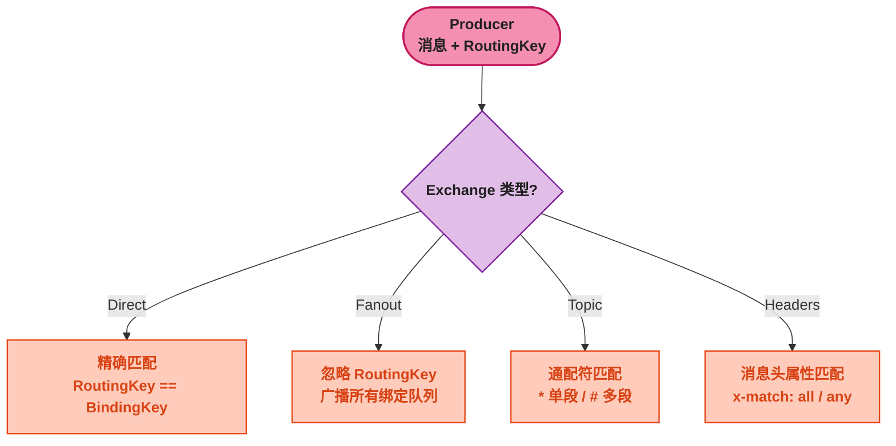
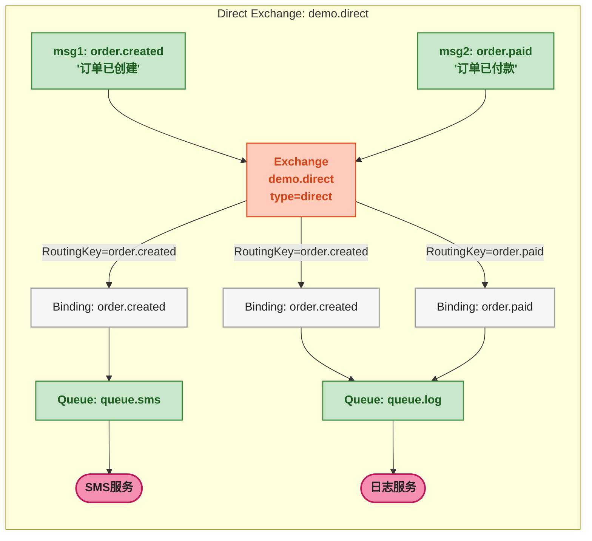
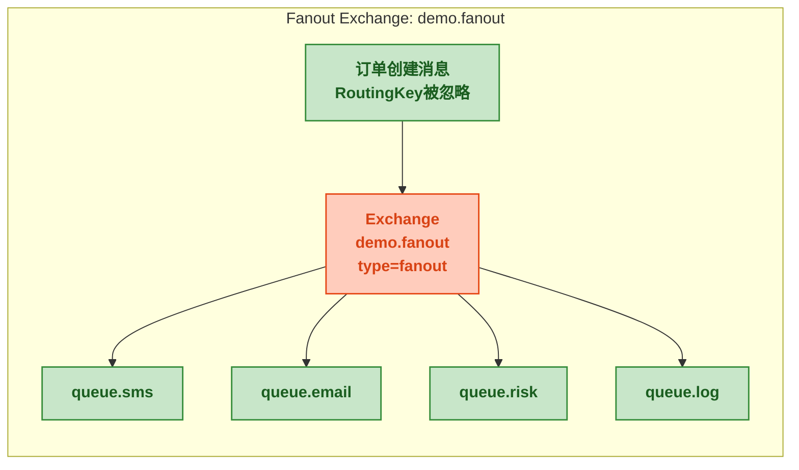
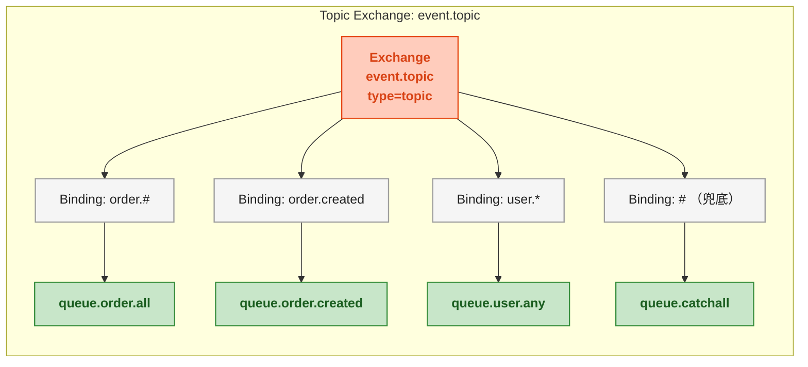

# 四种交换机：路由机制完全解析

> 📖 <strong>前置阅读</strong>：本文假设读者已理解上一篇中 Exchange、Queue、Binding、RoutingKey 的概念。如果还不清楚，建议先阅读 [<strong>RabbitMQ 核心概念与 AMQP 协议</strong>]()。

## 一、⚡ 问题切入：同一条消息，为什么有人收到有人收不到？

上一篇结尾发了第一条 RabbitMQ 消息——消息发出去，消费者收到了。但实际业务远比这个复杂：

- 订单创建后，<strong>所有</strong>下游服务（短信、邮件、风控、日志）都要收到通知
- 商品价格变更后，<strong>只有</strong>关注了这个商品的搜索服务需要重建索引
- 用户行为日志中，<strong>一部分</strong>是购买行为（需要发优惠券），一部分是浏览行为（只需要统计）

这些需求的本质是<strong>路由</strong>——同一批消息，不同消费者按不同规则接收不同子集。RabbitMQ 用 Exchange（交换机）来承担这个角色。

Exchange 有四种类型。它们唯一的不同是<strong>如何匹配 RoutingKey 和 BindingKey</strong>：



去管理界面 `Exchanges` 页面点开一个 Exchange，看到 `type` 字段的值就是这四种之一。

## 二、📋 实验环境准备：可执行的验证代码

每介绍一种类型，都附上可直接运行的 Java 代码。先准备一组通用的基类：

```java
// 所有实验共用这个连接创建方法
public class RabbitMQTestBase {

    protected static final String HOST = "localhost";
    protected static final int PORT = 5672;
    protected static final String USER = "admin";
    protected static final String PASS = "admin123";
    protected static final String VHOST = "/";

    protected static Connection newConnection() throws Exception {
        ConnectionFactory factory = new ConnectionFactory();
        factory.setHost(HOST);
        factory.setPort(PORT);
        factory.setUsername(USER);
        factory.setPassword(PASS);
        factory.setVirtualHost(VHOST);
        return factory.newConnection();
    }

    // 一个消费者监听一个队列，打印收到的消息然后 ACK
    protected static void startConsumer(String queueName, String consumerName) throws Exception {
        Connection conn = newConnection();
        Channel channel = conn.createChannel();

        // 声明队列（幂等）
        channel.queueDeclare(queueName, true, false, false, null);

        DeliverCallback callback = (consumerTag, delivery) -> {
            String msg = new String(delivery.getBody(), "UTF-8");
            System.out.println("[" + consumerName + "] 收到消息: " + msg
                    + " (RoutingKey=" + delivery.getEnvelope().getRoutingKey() + ")");
            channel.basicAck(delivery.getEnvelope().getDeliveryTag(), false);
        };

        channel.basicConsume(queueName, false, callback, consumerTag -> {});
        System.out.println("消费者[" + consumerName + "] 已启动，监听队列: " + queueName);
    }
}
```

> 📌 前置知识：上述代码使用 RabbitMQ Java Client（`com.rabbitmq:amqp-client:5.20.0`），不是 Spring AMQP。这里的 `Channel`、`Connection`、`DeliverCallback` 都是 Java Client 的类。下一篇才引入 Spring。

## 三、Direct Exchange —— 精确匹配

### 3.1 路由规则

<strong>Direct Exchange 将消息的 RoutingKey 与 Binding 的 BindingKey 精确比较，完全相等则路由到该队列。</strong>

```
RoutingKey "order.created"
    ↓ 精确匹配
Binding → Queue
  "order.created" → queue.order.create       ✅ 匹配，路由
  "order.paid"    → queue.order.paid         ❌ 不匹配
  "order.*"       → queue.order.all          ❌ 不匹配（* 在这里只是普通字符，不是通配符）
```

<strong>重点</strong>：Direct Exchange 不认通配符。`*` 和 `#` 在这里就是普通字符，没有特殊含义。一个键叫 `order.*` 就是字面意义上的 `order.*`。

### 3.2 验证代码

场景：订单创建消息发给两个队列——`queue.sms`、`queue.log`，但订单支付消息只发给 `queue.log`。

```java
public class DirectExchangeTest extends RabbitMQTestBase {

    public static void main(String[] args) throws Exception {
        String EXCHANGE = "demo.direct";
        String QUEUE_SMS = "queue.sms";
        String QUEUE_LOG = "queue.log";

        // ---- 声明 Exchange ----
        Connection conn = newConnection();
        Channel channel = conn.createChannel();
        channel.exchangeDeclare(EXCHANGE, "direct", true);
        //        参数:  名称,     类型,      持久化

        // ---- 声明队列 ----
        channel.queueDeclare(QUEUE_SMS, true, false, false, null);
        channel.queueDeclare(QUEUE_LOG, true, false, false, null);

        // ---- 绑定：queue.sms 只收 order.created ----
        channel.queueBind(QUEUE_SMS, EXCHANGE, "order.created");
        // ---- 绑定：queue.log 收两条——order.created 和 order.paid ----
        channel.queueBind(QUEUE_LOG, EXCHANGE, "order.created");
        channel.queueBind(QUEUE_LOG, EXCHANGE, "order.paid");

        // ---- 发送消息 ----
        channel.basicPublish(EXCHANGE, "order.created", null,
                "订单已创建".getBytes());
        channel.basicPublish(EXCHANGE, "order.paid", null,
                "订单已付款".getBytes());

        System.out.println("消息已发送！切换到消费者终端查看结果...");
        channel.close();
        conn.close();
    }
}
```

消费者用两个线程分别监听两个队列：

```java
public class DirectExchangeConsumer extends RabbitMQTestBase {

    public static void main(String[] args) throws Exception {
        new Thread(() -> {
            try { startConsumer("queue.sms", "SMS服务"); }
            catch (Exception e) { e.printStackTrace(); }
        }).start();

        new Thread(() -> {
            try { startConsumer("queue.log", "日志服务"); }
            catch (Exception e) { e.printStackTrace(); }
        }).start();

        // 主线程不退出，等待消费
        Thread.sleep(60000);
    }
}
```

先运行消费者，再运行生产者。预期输出：

```
[SMS服务] 收到消息: 订单已创建 (RoutingKey=order.created)
[日志服务] 收到消息: 订单已创建 (RoutingKey=order.created)
[日志服务] 收到消息: 订单已付款 (RoutingKey=order.paid)
```

SMS 服务只收到 `order.created`，日志服务两条都收到。这就是精确匹配。



### 3.3 Direct Exchange 的特殊用法：同一个队列多次绑定

同一个队列可以多次绑定到同一个 Exchange，每次用不同的 BindingKey：

```java
// queue.log 绑了两次——两条不同 routingKey 的消息都进同一个队列
channel.queueBind("queue.log", "demo.direct", "order.created");
channel.queueBind("queue.log", "demo.direct", "order.paid");
```

这和声明两个队列各绑一个 BindingKey 的区别是：<strong>同一个队列只被一个消费者消费</strong>。两个绑定让两条不相关的消息进了同一个消费通道。

## 四、Fanout Exchange —— 广播

### 4.1 路由规则

<strong>Fanout Exchange 忽略 RoutingKey</strong>——消息绑定到此 Exchange 时，RoutingKey 填什么都行（甚至空字符串），消息都会被路由到<strong>所有绑定队列</strong>。

一句话：绑定到这个 Exchange 的所有队列，每条消息都能收到。

### 4.2 验证代码

场景：订单创建时，SMS、邮件、风控、日志四个服务都要收到通知。

```java
public class FanoutExchangeTest extends RabbitMQTestBase {

    public static void main(String[] args) throws Exception {
        String EXCHANGE = "demo.fanout";
        Connection conn = newConnection();
        Channel channel = conn.createChannel();

        // Fanout Exchange
        channel.exchangeDeclare(EXCHANGE, "fanout", true);

        // 四个队列
        channel.queueDeclare("queue.sms", true, false, false, null);
        channel.queueDeclare("queue.email", true, false, false, null);
        channel.queueDeclare("queue.risk", true, false, false, null);
        channel.queueDeclare("queue.log", true, false, false, null);

        // 四个队列全部绑定到同一个 Fanout Exchange
        // RoutingKey 在 Fanout 下被忽略，写什么都行
        channel.queueBind("queue.sms", EXCHANGE, "");
        channel.queueBind("queue.email", EXCHANGE, "");
        channel.queueBind("queue.risk", EXCHANGE, "");
        channel.queueBind("queue.log", EXCHANGE, "");

        // 发一条消息——四个队列都收到
        channel.basicPublish(EXCHANGE, "anything.here.ignored", null,
                "订单 10001 已创建".getBytes());

        System.out.println("消息已发送！");
        channel.close();
        conn.close();
    }
}
```

验证结果：四个消费者各收到一条。RoutingKey 填 `"anything.here.ignored"`——丝毫不影响路由。

### 4.3 Fanout 的应用场景

| 场景 | 说明 |
|------|------|
| <strong>配置刷新通知</strong> | 所有微服务都需重新加载配置，一条广播通知全量刷新 |
| <strong>缓存清除通知</strong> | 文章更新后需要通知所有缓存实例删除该文章缓存 |
| <strong>状态变更广播</strong> | 订单状态变更，所有关注订单的下游系统都收到通知 |
| <strong>实时推送</strong> | 需要给所有连接的 WebSocket 用户推送同一条系统消息 |



## 五、Topic Exchange —— 通配符路由

### 5.1 路由规则

<strong>Topic Exchange 是最灵活的类型</strong>——BindingKey 支持通配符，实现模式匹配：

| 通配符 | 含义 | 示例 |
|--------|------|------|
| `*` | 匹配<strong>正好一个</strong>用 `.` 分隔的单词 | `order.*` 匹配 `order.created`，不匹配 `order.created.v2` |
| `#` | 匹配<strong>零个或多个</strong>用 `.` 分隔的单词 | `order.#` 匹配 `order.created`、`order.created.v2`、`order` |

<strong>约定</strong>：RoutingKey 和 BindingKey 都由点号 `.` 分隔单词，如 `order.created.v2`。分隔符 `.` 才是通配符的分段基础——不是 RabbitMQ 的硬性要求，是业界约定。

### 5.2 BindingKey 匹配实验

给定以下 Binding 规则：

```
BindingKey 1: order.#         → queue.all      （匹配所有 order 前缀的消息）
BindingKey 2: order.*         → queue.order     （只匹配 order.单段）
BindingKey 3: *.payment       → queue.payment   （匹配任意前缀的 payment）
BindingKey 4: order.created.* → queue.create     （匹配 order.created 下的子事件）
```

| RoutingKey | 匹配的 Binding | 投递到哪个队列 |
|------------|---------------|---------------|
| `order.created` | 1️⃣ `order.#` 2️⃣ `order.*` | `queue.all`, `queue.order` |
| `order.created.v2` | 1️⃣ `order.#` 4️⃣ `order.created.*` | `queue.all`, `queue.create` |
| `order` | 1️⃣ `order.#`（`#` 匹配零个） | `queue.all` |
| `user.payment` | 3️⃣ `*.payment` | `queue.payment` |
| `stock.deduct` | 无 | <strong>消息被丢弃</strong> |

> ⚠️ 新手提示：Topic Exchange 中，没有匹配到任何 Binding 的消息会<strong>被丢弃</strong>。这和 Fanout 不同——Fanout 不会出现"没匹配"的情况（所有绑定队列都收到）。如果不想丢消息，可以放一个兜底队列用 `#` 绑定，所有未匹配的消息全收进去。

### 5.3 验证代码

```java
public class TopicExchangeTest extends RabbitMQTestBase {

    public static void main(String[] args) throws Exception {
        String EXCHANGE = "demo.topic";
        Connection conn = newConnection();
        Channel channel = conn.createChannel();

        channel.exchangeDeclare(EXCHANGE, "topic", true);

        // 创建 4 个队列
        String[] queues = {"queue.all", "queue.order", "queue.payment", "queue.create"};
        for (String q : queues) {
            channel.queueDeclare(q, true, false, false, null);
        }

        // Binding
        channel.queueBind("queue.all",     EXCHANGE, "order.#");          // 1️⃣
        channel.queueBind("queue.order",   EXCHANGE, "order.*");          // 2️⃣
        channel.queueBind("queue.payment", EXCHANGE, "*.payment");        // 3️⃣
        channel.queueBind("queue.create",  EXCHANGE, "order.created.*");  // 4️⃣

        // 发送 5 条测试消息
        String[][] tests = {
            {"order.created",     "1️⃣ order.# + 2️⃣ order.*"},
            {"order.created.v2",  "1️⃣ order.# + 4️⃣ order.created.*"},
            {"order",             "1️⃣ order.#（# 匹配零个单词）"},
            {"user.payment",      "3️⃣ *.payment"},
            {"stock.deduct",      "无匹配——消息被丢弃"},
        };

        for (String[] test : tests) {
            channel.basicPublish(EXCHANGE, test[0], null,
                    test[1].getBytes());
        }

        System.out.println("5 条消息已发送！");
        channel.close();
        conn.close();
    }
}
```

开四个消费者分别监听四个队列，可以看到每条消息到了哪些队列、没到哪些队列。

### 5.4 Topic Exchange 的实战模式

电商系统中 Topic Exchange 的经典用法：

```
系统事件 RoutingKey 命名规范：
    {领域}.{实体}.{操作}

Exchange: event.topic (type=topic)

Queue 与 Binding：
    queue.order.all      → Binding: order.#              收所有订单事件
    queue.order.created  → Binding: order.created         只收创建事件
    queue.user.any       → Binding: user.*                收所有单层用户事件
    queue.catchall       → Binding: #                     兜底队列——所有未匹配的都进来

Producer：
    order.created        → 进入 queue.order.all + queue.order.created
    order.paid           → 进入 queue.order.all （被 order.# 匹配）
    order.shipped        → 进入 queue.order.all
    user.registered      → 进入 queue.user.any + queue.catchall
    stock.deduct         → 进入 queue.catchall（没有其他 Binding 匹配）
```

<strong>建议：Topic Exchange 的 RoutingKey 命名规范要在项目早期定好</strong>。用 `{领域}.{实体}.{操作}` 三层点号分隔足够覆盖大多数场景。一旦后期乱用，`*.` 和 `#` 的匹配结果会变得不可预测。



## 六、Headers Exchange —— 消息头属性匹配

### 6.1 路由规则

<strong>Headers Exchange 不看 RoutingKey，只看消息的 Headers 属性。</strong> 在 Binding 时可以指定一个或多个 Header 键值对，并指定匹配模式：

- `x-match: all`（默认）—— 所有 Header 都匹配才路由
- `x-match: any` —— 任一个 Header 匹配就路由

Headers Exchange 用得最少，因为 Topic Exchange 已经覆盖了绝大多数路由需求。但在<strong>需要多维度属性匹配</strong>的场景（如按地区 + 语言 + 渠道匹配不同的通知模板），Headers 更直接。

### 6.2 验证代码

```java
public class HeadersExchangeTest extends RabbitMQTestBase {

    public static void main(String[] args) throws Exception {
        String EXCHANGE = "demo.headers";
        Connection conn = newConnection();
        Channel channel = conn.createChannel();

        channel.exchangeDeclare(EXCHANGE, "headers", true);

        channel.queueDeclare("queue.cn.sms", true, false, false, null);
        channel.queueDeclare("queue.en.sms", true, false, false, null);
        channel.queueDeclare("queue.cn.wechat", true, false, false, null);

        // ---- Binding with x-match:all ----
        // 队列 queue.cn.sms: 只收 lang=cn 且 channel=sms 的消息
        Map<String, Object> args1 = new HashMap<>();
        args1.put("x-match", "all");
        args1.put("lang", "cn");
        args1.put("channel", "sms");
        channel.queueBind("queue.cn.sms", EXCHANGE, "", args1);

        // ---- Binding with x-match:any ----
        // 队列 queue.cn.wechat: lang=cn 或 channel=wechat 都收
        Map<String, Object> args2 = new HashMap<>();
        args2.put("x-match", "any");
        args2.put("lang", "cn");
        args2.put("channel", "wechat");
        channel.queueBind("queue.cn.wechat", EXCHANGE, "", args2);

        // ---- 发送消息 1：lang=cn, channel=sms ----
        AMQP.BasicProperties props1 = new AMQP.BasicProperties.Builder()
                .headers(Map.of("lang", "cn", "channel", "sms"))
                .build();
        channel.basicPublish(EXCHANGE, "", props1,
                "用户下单——中文短信通知模板".getBytes());

        // ---- 发送消息 2：lang=cn, channel=email ----
        AMQP.BasicProperties props2 = new AMQP.BasicProperties.Builder()
                .headers(Map.of("lang", "cn", "channel", "email"))
                .build();
        channel.basicPublish(EXCHANGE, "", props2,
                "用户下单——中文邮件通知模板".getBytes());

        System.out.println("消息已发送！");
        channel.close();
        conn.close();
    }
}
```

验证结果：
- 消息 1（`lang=cn, channel=sms`）：`queue.cn.sms` 收到（all 匹配），`queue.cn.wechat` 收到（any 匹配中 `lang=cn`）
- 消息 2（`lang=cn, channel=email`）：只有 `queue.cn.wechat` 收到（any 匹配中 `lang=cn`），`queue.cn.sms` 收不到（all 匹配要求 channel=sms，但这里是 email）

### 6.3 Headers Exchange 使用场景

Topic Exchange 的路由规则依附在 RoutingKey 这个字符串上，本质是单维度模式匹配。Headers Exchange 允许绑定任意数量的 Header 属性，适合<strong>多维度组合路由</strong>：

| 场景 | Headers 条件 | 说明 |
|------|-------------|------|
| 多语言通知 | `lang=cn`, `channel=sms` | 中文短信模板 |
| AB 实验 | `experiment=groupA`, `version=v2` | 灰度消息分流 |
| 按地区 | `region=cn-north`, `priority=high` | 华北高优先级通知 |

> ⚠️ 新手提示：Headers Exchange 的性能比 Topic Exchange 差，因为每次路由都要遍历所有 Header 键值对做比较。能用一个 Topic Exchange 解决的场景，不要用 Headers。

## 七、🎯 四种 Exchange 对比

| 维度 | Direct | Fanout | Topic | Headers |
|------|:---:|:---:|:---:|:---:|
| <strong>匹配依据</strong> | RoutingKey == BindingKey | 无（全匹配） | RoutingKey 模式匹配 | Headers 键值对 |
| <strong>通配符</strong> | 不支持 | 不需要 | `*`（单段）`#`（多段） | 不需要 |
| <strong>路由精度</strong> | 高（一对一） | 无（一对全） | 最高（灵活模式） | 中（属性组合） |
| <strong>性能</strong> | 最快 | 快 | 快（略慢于 Direct） | 最慢 |
| <strong>使用频率</strong> | ⭐⭐⭐⭐⭐ 最高 | ⭐⭐⭐ | ⭐⭐⭐⭐ | ⭐ 极少 |
| <strong>典型场景</strong> | 点对点命令 | 广播通知 | 按业务规则分发 | 多维度属性路由 |

## 八、🔍 管理界面观察消息路由

发消息后立即到管理界面观察效果：

1. `http://localhost:15672` → <strong>Exchanges</strong> → 找到你创建的 Exchange
2. 点击 Exchange 名称，看 <strong>Bindings</strong>：列出所有绑定的队列和 BindingKey
3. 切换到 <strong>Queues</strong>，看每个队列的 <strong>Ready</strong> 列——未消费的消息数
4. 点队列名进去，<strong>Get Message(s)</strong> 可以直接从队列里取一条消息出来查看内容

管理界面上能看到：

| 指标 | 含义 |
|------|------|
| `Message rates: publish` | 每秒发布到该 Exchange 的消息数 |
| `Message rates: deliver/get` | 每秒投递给消费者的消息数 |
| `Bindings` | 这个 Exchange 绑定了哪些队列及 BindingKey |
| `Ready` | 队列中等待消费的消息数 |
| `Unacked` | 已推给消费者但还没收到 ACK 的消息数 |

## 九、📋 默认 Exchange —— 不声明也能用

RabbitMQ 启动后自带一个<strong>默认 Exchange</strong>，名称是空字符串 `""`，类型是 Direct。它有一个特殊规则：<strong>每个队列自动被绑定到默认 Exchange，BindingKey = 队列名</strong>。

这就是为什么上一篇的 Hello World 里可以直接写：

```java
channel.basicPublish("", "hello.queue", null, message.getBytes());
//                    ↑空字符串=默认Exchange  ↑routingKey直接用队列名
```

<strong>默认 Exchange 只适用于最简单的行为——一个队列对应一个 RoutingKey</strong>。需要多队列分发、通配符路由、广播时，还是要自己声明 Exchange。

## 十、🎯 总结

本文逐一拆解了 RabbitMQ 的四种 Exchange 类型，并给出每种的完整 Java 验证代码：

1. <strong>Direct</strong>：RoutingKey 与 BindingKey 精确匹配。最常用——"订单创建消息发给订单处理队列"这种精确路由就用它。

2. <strong>Fanout</strong>：忽略 RoutingKey，广播到所有绑定的队列。最适合配置刷新、缓存清除、状态广播。

3. <strong>Topic</strong>：`*` 匹配单段、`#` 匹配多段。最灵活——"所有订单相关消息都给我"（`order.#`）或"只看订单创建"（`order.created`）。建议项目早期约定 `{领域}.{实体}.{操作}` 命名规范。

4. <strong>Headers</strong>：根据消息 Headers 属性匹配，`x-match: all/any`。性能最差，能不用就不用。

5. <strong>默认 Exchange</strong>：空字符串 `""`，每个队列自动绑定，BindingKey=队列名。最简单的 Direct 路由。

下一篇将把这些概念整合进 SpringBoot 中——用 `RabbitTemplate` 替代 `channel.basicPublish`，用 `@RabbitListener` 替代手写的 `DeliverCallback`，让代码真正写到项目里。

> 📖 <strong>下一步阅读</strong>：四种 Exchange 和 RoutingKey / BindingKey 已经在纯 Java 客户端下验证过了。现在轮到 SpringBoot 整合——一篇覆盖 `RabbitTemplate`、`@RabbitListener`、消息转换、批量配置的实战教程。继续阅读 [<strong>SpringBoot RabbitMQ 全操作指南</strong>]()。
