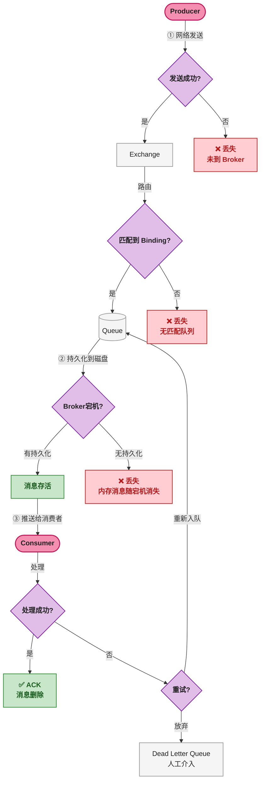
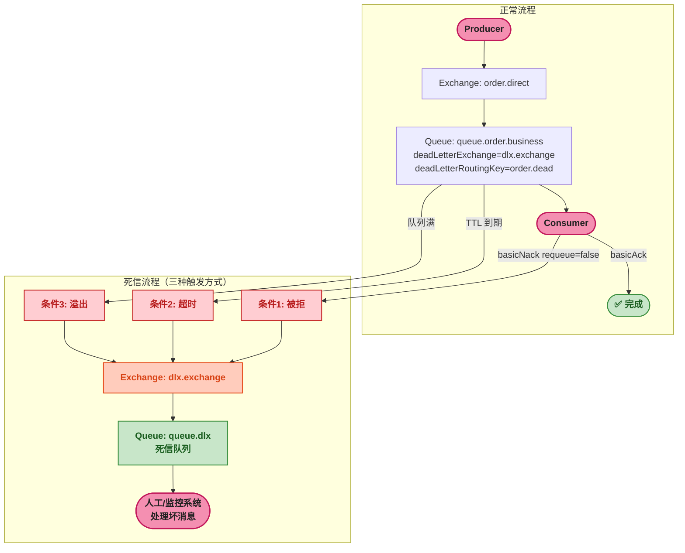

# RabbitMQ 消息可靠性保障

> 📖 <strong>前置阅读</strong>：本文假设读者已掌握 SpringBoot RabbitMQ 的基本操作（`RabbitTemplate` 发送、`@RabbitListener` 消费、手动 ACK）。如果还不熟悉，建议先阅读 [<strong>SpringBoot RabbitMQ 全操作指南</strong>]()。

## 一、⚡ 问题切入：消息去哪儿了？

先看一段日常的订单处理代码：

```java
// 下单成功后发消息
@Service
public class OrderService {

    @Transactional
    public void createOrder(OrderRequest req) {
        orderMapper.insert(req.toOrder());           // 1. 写 MySQL
        rabbitTemplate.convertAndSend(                // 2. 发消息
            "order.exchange", "order.created", req);
    }
}
```

表面看起来没问题。但消息真的被消费了吗？在以下任何一个环节都可能丢：

```
Producer  →  [网络]  →  RabbitMQ  →  [网络]  →  Consumer
   ① 发送丢失      ② Broker 宕机丢失      ③ 消费失败丢失
```

| 环节 | 丢失原因 | 后果 |
|------|---------|------|
| <strong>① 生产者 → Broker</strong> | 网络断连、Exchange 不存在、消息路由失败 | 消息根本没进队列 |
| <strong>② Broker 存储</strong> | RabbitMQ 进程崩溃、服务器断电 | 内存中的消息全部丢失 |
| <strong>③ Consumer 消费</strong> | 消费者处理到一半挂了、代码异常没 ACK | 消息被取走但实际没处理完 |

这三个环节必须<strong>逐一设防</strong>——RabbitMQ 提供了完整的机制，但需要生产者、Broker、消费者三端配合。



这张图就是消息可靠性保障的完整地图。下面按 ① → ② → ③ 的顺序逐一解决。

## 二、① 生产者端：Publisher Confirm

### 2.1 问题：`convertAndSend` 返回 void

```java
rabbitTemplate.convertAndSend("order.exchange", "order.created", msg);
// 这一行执行完，消息真的到 RabbitMQ 了吗？不一定。
// 网络抖动、Exchange 不存在——这行代码不抛异常也不报错。
```

RabbitMQ 提供了一个机制叫 <strong>Publisher Confirm（发布者确认）</strong>——Broker 收到消息后向生产者发送一个确认（ACK）或否定确认（NACK）。只有收到 ACK，生产者才能确定消息已到达 Broker。

### 2.2 SpringBoot 配置 Publisher Confirm

```yaml
spring:
  rabbitmq:
    # 开启发送端确认
    publisher-confirm-type: correlated
    # 开启发送端回退——当消息没有路由到任何队列时通知生产者
    publisher-returns: true
```

`publisher-confirm-type` 有三个值：

| 值 | 含义 |
|------|------|
| `none` | 不开启 Confirm（默认） |
| `simple` | 开启 Confirm，`rabbitTemplate.waitForConfirms()` 同步等待 |
| `correlated` | 开启 Confirm，通过异步回调通知（推荐） |

### 2.3 异步 Confirm + Return 回调

```java
@Configuration
public class RabbitConfirmConfig {

    @Bean
    public RabbitTemplate rabbitTemplate(
            ConnectionFactory factory,
            Jackson2JsonMessageConverter converter) {

        RabbitTemplate template = new RabbitTemplate(factory);
        template.setMessageConverter(converter);

        // ===== 1. Confirm 回调：消息是否到达 Exchange =====
        template.setConfirmCallback((correlationData, ack, cause) -> {
            if (ack) {
                // Broker 确认收到消息
                String msgId = correlationData != null ? correlationData.getId() : "null";
                log.info("消息已到达 Broker，消息ID: {}", msgId);
            } else {
                // Broker 拒绝（Exchange 不存在等）
                log.error("消息发送失败！原因: {}", cause);
                // 补偿逻辑：写 DB 重试表、发告警...
            }
        });

        // ===== 2. Return 回调：消息到达 Exchange 但没路由到任何队列 =====
        template.setReturnsCallback(returned -> {
            String msg = new String(returned.getMessage().getBody());
            log.error("消息路由失败！exchange={}, routingKey={}, body={}",
                    returned.getExchange(), returned.getRoutingKey(), msg);
            // 补偿逻辑...
        });

        return template;
    }
}
```

<strong>Confirm 和 Return 的区别</strong>：

| 回调 | 触发条件 | 说明 |
|------|---------|------|
| `ConfirmCallback` | 消息到达 Exchange 后 | ACK = 到达；NACK = 没到达（Exchange 不存在等） |
| `ReturnsCallback` | 消息到达 Exchange 但<strong>没有路由到任何队列</strong> | 只有在 `mandatory=true` 时才触发 |

发送时带上 `CorrelationData`，用于标识消息：

```java
@Service
public class ReliableOrderSender {

    @Autowired
    private RabbitTemplate rabbitTemplate;

    public void sendOrderCreated(OrderMessage msg) {
        // CorrelationData 关联业务 ID，Confirm 回调中可以拿到
        CorrelationData correlationData = new CorrelationData(
                "order:" + msg.getOrderId() + ":" + UUID.randomUUID()
        );

        rabbitTemplate.convertAndSend(
            "order.direct",
            "order.created",
            msg,
            correlationData       // ← 带上这个，回调中能拿到
        );
    }
}
```

> ⚠️ 新手提示：Confirm 只保证消息到了 Exchange，<strong>不保证到了队列</strong>。如果一个 Topic Exchange 的 RoutingKey 没匹配到任何 Binding，Confirm 返回 ACK（Exchange 收到了），但消息被丢弃——这就是 Return 回调的用武之地。

### 2.4 生产级的发送方法

把 Confirm 和重试结合起来：

```java
public void sendReliable(OrderMessage msg) {
    CorrelationData cd = new CorrelationData("order:" + msg.getOrderId());
    // 三次重试
    for (int i = 0; i < 3; i++) {
        rabbitTemplate.convertAndSend("order.direct", "order.created", msg, cd);
        try {
            // 同步等待确认（超时 5s）
            Confirm confirm = rabbitTemplate.waitForConfirms(5000);
            if (confirm != null && confirm.isAck()) {
                return;  // 成功，退出
            }
        } catch (Exception e) {
            log.warn("第{}次发送失败: {}", i + 1, e.getMessage());
        }
    }
    // 三次都失败 → 写 DB 重试表，定时任务补偿
    saveToRetryTable(msg);
}
```

> 📌 前置知识：`waitForConfirms` 是同步等待——会阻塞当前线程。高吞吐场景下用异步 `ConfirmCallback`，低吞吐的可靠发送场景用同步等待。

## 三、② Broker 端：消息持久化

### 3.1 不持久化时会发生什么

RabbitMQ 的消息默认存在内存中。如果 RabbitMQ 进程崩溃或服务器断电，<strong>所有未被消费的消息全部丢失</strong>。

持久化需要<strong>三样东西同时设为持久</strong>——缺一个都丢消息：

| 持久化对象 | 配置方式 | 不持久化的后果 |
|-----------|---------|---------------|
| <strong>Exchange</strong> | `new DirectExchange(name, true, false)` 第二个参数 | Exchange 元数据丢失 → 所有绑定失效 |
| <strong>Queue</strong> | `QueueBuilder.durable(name)` 或 `new Queue(name, true)` | 队列元数据丢失 → 队列中的消息全丢 |
| <strong>Message</strong> | `deliveryMode=2`（`MessageProperties.PERSISTENT_TEXT_PLAIN`） | Exchange 和 Queue 在，但消息没了 |

### 3.2 配置全链路持久化

```java
@Configuration
public class DurableConfig {

    // Exchange 持久化
    @Bean
    public DirectExchange durableExchange() {
        return new DirectExchange("order.durable", true, false);
        //                         名称,              durable, autoDelete
    }

    // Queue 持久化
    @Bean
    public Queue durableQueue() {
        return QueueBuilder.durable("queue.durable").build();
    }

    // Binding 持久化（随 Queue 和 Exchange 自动持久化）
    @Bean
    public Binding durableBinding() {
        return BindingBuilder
                .bind(durableQueue())
                .to(durableExchange())
                .with("order.created");
    }
}
```

消息持久化通过设置 `deliveryMode`：

```java
// 方式一：发送时指定
rabbitTemplate.convertAndSend("order.durable", "order.created", msg,
    message -> {
        // deliveryMode=2 即 PERSISTENT
        message.getMessageProperties().setDeliveryMode(
                MessageDeliveryMode.PERSISTENT);
        return message;
    }
);

// 方式二：RabbitTemplate 全局默认持久化
@Bean
public RabbitTemplate rabbitTemplate(ConnectionFactory factory) {
    RabbitTemplate template = new RabbitTemplate(factory);
    // 所有消息默认持久化——但会降低吞吐量
    template.setMessageConverter(new Jackson2JsonMessageConverter());
    return template;
}
```

<strong>持久化的性能代价</strong>：消息写入磁盘的 I/O 操作比内存操作慢 100 ~ 1000 倍。不是所有消息都需要持久化——日志采集消息丢几条无所谓，订单支付消息一条都不能丢。按消息重要性分级处理。

### 3.3 RabbitMQ 的持久化机制不是"每条消息立刻刷盘"

`deliveryMode=2` 标记的消息<strong>并非每条都实时 fsync 到磁盘</strong>。RabbitMQ 将消息写入一个持久化日志（类似 WAL），定期批量 fsync。这意味着在两次 fsync 之间宕机，依然可能丢失一小批消息。

真正的数据安全性还需要配合<strong>镜像队列</strong>（Mirrored Queue）或<strong>仲裁队列</strong>（Quorum Queue）——消息同时写入多个节点后才确认。集群相关留在第六篇展开。

## 四、③ 消费者端：手动 ACK 与死信队列

### 4.1 自动 ACK vs 手动 ACK

```java
// ❌ 自动 ACK：消息推给消费者后立即从队列中删除
//    消费者处理到一半 JVM 崩了 → 消息丢了
@RabbitListener(queues = "queue.order.create", ackMode = "AUTO")
public void handle(OrderMessage msg) { ... }

// ✅ 手动 ACK：消费者处理完显式确认
@RabbitListener(queues = "queue.order.create", ackMode = "MANUAL")
public void handle(OrderMessage msg, Channel channel,
                   @Header(AmqpHeaders.DELIVERY_TAG) long tag) throws IOException {
    try {
        processOrder(msg);
        channel.basicAck(tag, false);   // 处理成功 → 确认
    } catch (Exception e) {
        channel.basicNack(tag, false, true);  // 处理失败 → 重新入队
    }
}
```

`ackMode` 的四种值：

| 值 | 行为 | 适用场景 |
|------|------|------|
| `MANUAL` | 必须代码显式调用 `basicAck` / `basicNack` | 生产环境（推荐） |
| `AUTO` | Spring 根据方法是否抛异常自动 ACK/NACK | 简单业务（抛异常就重新入队） |
| `NONE` | 等价于 RabbitMQ 的 `autoAck=true`——消息推给消费者立刻删除 | <strong>永远别用</strong> |

### 4.2 死信队列 —— 坏消息的最终归宿

`basicNack(tag, false, true)` 让消息重新入队——但如果代码逻辑有 bug（比如反序列化抛出 `NullPointerException`），重试一万次也成功不了。RabbitMQ 的解决方案是<strong>死信队列（Dead Letter Queue, DLQ）</strong>——消息变成死信（Dead Letter）后自动转入一个专门的队列，等待人工介入。

一条消息变成死信的三个条件：

| 条件 | 触发方式 | 说明 |
|------|---------|------|
| <strong>被消费者拒绝</strong> | `basicNack(tag, false, false)` 或 `basicReject(tag, false)` | `requeue=false` |
| <strong>消息 TTL 到期</strong> | 队列设 `x-message-ttl` 或消息设 `expiration` | 消息在队列中过期 |
| <strong>队列达到最大长度</strong> | 队列设 `x-max-length` 或 `x-max-length-bytes` | 队列溢出 |

### 4.3 死信队列的完整配置

需要一个<strong>普通业务队列</strong>、一个<strong>死信交换机</strong>、一个<strong>死信队列</strong>：

```java
@Configuration
public class DeadLetterConfig {

    // ========== 死信交换机 + 死信队列 ==========
    @Bean
    public DirectExchange deadLetterExchange() {
        return new DirectExchange("dlx.exchange", true, false);
    }

    @Bean
    public Queue deadLetterQueue() {
        return QueueBuilder.durable("queue.dlx").build();
    }

    @Bean
    public Binding deadLetterBinding() {
        return BindingBuilder
                .bind(deadLetterQueue())
                .to(deadLetterExchange())
                .with("order.dead");
    }

    // ========== 业务队列 —— 指定死信交换机 ==========
    @Bean
    public Queue orderBusinessQueue() {
        return QueueBuilder.durable("queue.order.business")
                // 死信交换机——这个队列中的消息变成死信后发给 dlx.exchange
                .deadLetterExchange("dlx.exchange")
                // 死信 RoutingKey——发到 dlx.exchange 时使用的 RoutingKey
                .deadLetterRoutingKey("order.dead")
                // 消息在队列中的 TTL（30 分钟——超时未消费也进死信）
                .ttl(30 * 60 * 1000)
                // 队列最大长度（防积压爆内存）
                .maxLength(10000)
                .build();
    }

    // 绑定业务队列到普通的 Direct Exchange
    @Bean
    public Binding orderBusinessBinding() {
        return BindingBuilder
                .bind(orderBusinessQueue())
                .to(new DirectExchange("order.direct", true, false))
                .with("order.created");
    }
}
```

核心是业务队列的 `deadLetterExchange` 和 `deadLetterRoutingKey` 两个参数——告诉 RabbitMQ："这个队列的消息变成死信后，发给哪个 Exchange，用哪个 RoutingKey。"



### 4.4 消费者端配合——处理 N 次失败后扔进死信

手动 ACK 模式下，常见做法是<strong>重试 N 次，N 次都失败就拒绝并放弃重入队</strong>：

```java
@Component
public class OrderBusinessListener {

    @RabbitListener(queues = "queue.order.business", ackMode = "MANUAL")
    public void handle(OrderMessage msg, Channel channel,
                       @Header(AmqpHeaders.DELIVERY_TAG) long tag) throws IOException {

        // 从消息头中拿重试次数（需要发送时设置或利用 RabbitMQ 的 x-death header）
        int maxRetries = 3;

        try {
            log.info("处理订单消息: orderId={}", msg.getOrderId());
            // 业务处理...
            processOrder(msg);

            // 成功 → ACK
            channel.basicAck(tag, false);

        } catch (Exception e) {
            log.error("处理消息失败: orderId={}, error={}", msg.getOrderId(), e.getMessage());

            // 检查重试次数
            Integer retryCount = getRetryCount(msg);  // 从消息头或 Redis 中取

            if (retryCount < maxRetries) {
                // 还没到上限 → 重新入队重试
                incrementRetryCount(msg, retryCount + 1);
                channel.basicNack(tag, false, true);
                log.info("重新入队, 重试次数: {}/{}", retryCount + 1, maxRetries);
            } else {
                // 达到上限 → 不重新入队，消息变成死信进入 DLQ
                channel.basicNack(tag, false, false);
                log.warn("已达最大重试次数, 消息进入死信队列: orderId={}", msg.getOrderId());
                // 同时发告警
                alertService.sendAlert("消息处理失败进死信: " + msg.getOrderId());
            }
        }
    }
}
```

> ⚠️ 新手提示：用 Redis 或数据库记录重试次数，不要存在消息体内。因为每次 `basicNack` 重新入队后，RabbitMQ 会在消息头加一个 `x-death` 记录（死信来源信息），重新入队的消息的 `deliveryTag` 会变，直接靠 deliveryTag 追踪重试不可靠。

### 4.5 死信队列的监控与告警

死信队列不是"消息放进去就完了"——它需要被监控和消费：

```java
@Component
public class DeadLetterMonitor {

    @RabbitListener(queues = "queue.dlx")
    public void handleDeadLetter(Message message, Channel channel,
                                  @Header(AmqpHeaders.DELIVERY_TAG) long tag) {
        String body = new String(message.getBody());
        Map<String, Object> headers = message.getMessageProperties().getHeaders();

        // x-death 是 RabbitMQ 自动添加的 header，记录死信来源
        List<Map<String, Object>> deathInfo = (List<Map<String, Object>>)
                headers.get("x-death");

        if (deathInfo != null && !deathInfo.isEmpty()) {
            Map<String, Object> death = deathInfo.get(0);
            log.error("死信消息: body={}, 来源队列={}, 原因={}, 原始RoutingKey={}",
                    body,
                    death.get("queue"),       // 从哪个队列来的
                    death.get("reason"),      // 为什么变成死信（rejected/expired/maxlen）
                    death.get("routing-keys") // 原始 RoutingKey
            );
        }

        // 手动 ACK——不要让死信消息永远留在死信队列里
        try {
            channel.basicAck(tag, false);
        } catch (IOException e) {
            log.error("ACK 死信消息失败", e);
        }
    }
}
```

也可以不消费死信，直接用管理界面或 Prometheus 监控死信队列的消息数——只要 `queue.dlx` 里有消息就说明出了问题。

## 五、消息幂等 —— 消息可能被消费多次

### 5.1 为什么会重复消费

即使配置了手动 ACK，消息仍然可能被消费多次：

| 场景 | 原因 |
|------|------|
| 消费者 ACK 超时 | 消费者处理完但 ACK 在网络中丢失，Broker 超时后重新投递 |
| 消费者宕机 | 消费者取到消息但没来得及 ACK 就挂了，Broker 重新投递给另一个消费者 |
| Producer 重发 | Confirm 超时但消息实际已到达 Broker，Producer 重发了一条 |

> ⚠️ 新手提示：RabbitMQ 保证的是<strong>消息不丢（at-least-once delivery）</strong>，不保证<strong>消息不重复（exactly-once delivery）</strong>。Exactly-once 在分布式系统中基本不可能实现——需要在消费者端自己做幂等。

### 5.2 消费者幂等方案

<strong>核心思路</strong>：每条消息带上一个唯一 ID（如 `orderId + operation`），消费前先检查这个 ID 是否已处理过。

```java
@Component
public class IdempotentOrderListener {

    @Autowired
    private RedisTemplate<String, String> redisTemplate;

    @RabbitListener(queues = "queue.order.business", ackMode = "MANUAL")
    public void handle(OrderMessage msg, Channel channel,
                       @Header(AmqpHeaders.DELIVERY_TAG) long tag) throws IOException {

        // 幂等 Key：订单ID + 操作类型
        String idempotentKey = "consumed:order:" + msg.getOrderId() + ":" + msg.getAction();

        // 尝试写入 Redis——SETNX，成功返回 true 表示第一次处理
        Boolean firstTime = redisTemplate.opsForValue()
                .setIfAbsent(idempotentKey, "1", Duration.ofHours(24));

        if (Boolean.FALSE.equals(firstTime)) {
            log.warn("重复消息，跳过: orderId={}, action={}",
                    msg.getOrderId(), msg.getAction());
            // 直接 ACK，不处理
            channel.basicAck(tag, false);
            return;
        }

        try {
            // 真正的业务处理
            processOrder(msg);
            channel.basicAck(tag, false);
        } catch (Exception e) {
            // 处理失败 → 删除幂等标记，让消息可以重试
            redisTemplate.delete(idempotentKey);
            channel.basicNack(tag, false, true);
        }
    }
}
```

## 六、🎯 三个环节防护总结

```
                    Broker 端
                    ② 持久化
        ┌────────┐  durable exchange     ┌──────────┐
生产者端 │ ①       │  + durable queue       │  ③       │ 消费者端
Confirm ─┤Producer├──→ + persistent msg  ──→│Consumer ├── 手动ACK
 Return  └────────┘                        └──────────┘    幂等检查
                                                            死信队列
```

| 环节 | 机制 | 配置方式 |
|------|------|---------|
| ① 生产者 → Broker | Publisher Confirm + Return | `publisher-confirm-type: correlated` + `setConfirmCallback` + `setReturnsCallback` |
| ② Broker 存储 | 全链路持久化 | Exchange/Queue 声明时 `durable=true` + 消息 `deliveryMode=PERSISTENT` |
| ③ Consumer 消费 | 手动 ACK + 死信队列 + 幂等 | `ackMode=MANUAL` + `basicAck`/`basicNack` + DLQ + 唯一 ID 去重 |

<strong>三个环节缺一不可</strong>。只配持久化不配 Confirm——消息可能根本没发到 Broker；只配 ACK 不配 DLQ——坏消息永远在队列里循环；只配 DLQ 不配幂等——消息被消费两次导致重复扣款。

## 🎯 总结

本文沿着"消息在哪个环节可能丢"的线索，逐一布防：

1. <strong>Publisher Confirm + Return</strong>：异步回调通知消息是否到达 Exchange、是否路由到队列。`correlationData` 关联业务 ID 用于补偿。

2. <strong>全链路持久化</strong>：Exchange、Queue、Message 三者必须同时设置持久化。但 `deliveryMode=2` 不是实时 fsync——真正的数据安全还需要镜像/仲裁队列。

3. <strong>手动 ACK + 死信队列</strong>：处理成功 `basicAck`，临时失败 `basicNack(requeue=true)`，永久失败 `basicNack(requeue=false)` 进 DLQ。死信队列需要被监控——有消息进去就是告警。

4. <strong>幂等</strong>：RabbitMQ 只保证 at-least-once——消费者端必须自己做幂等。`SETNX` 到 Redis 是常用方案。

> 📖 <strong>下一步阅读</strong>：常规的消息发送和消费已经搞定了可靠性。但有些场景需要更特殊的消息处理——"下单 30 分钟后未支付自动取消"怎么实现？继续阅读 [<strong>延迟队列与高级特性</strong>]()，一篇讲透延迟队列、优先级队列和 RPC 模式。
