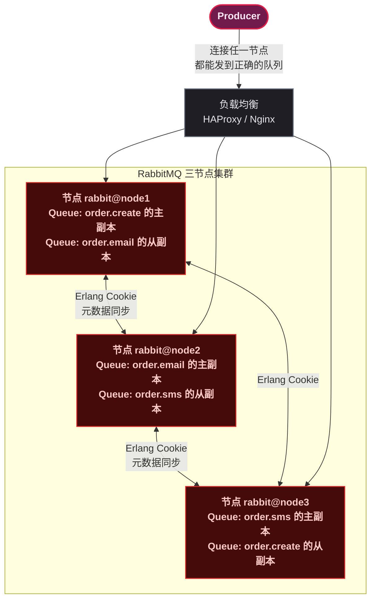

# 生产环境部署与调优

> 📖 <strong>前置阅读</strong>：本文是 RabbitMQ 系列的终篇，假设读者已经掌握前五篇的全部内容（核心概念、交换机类型、SpringBoot 集成、消息可靠性、高级特性）。

## 一、⚡ 问题切入：单机 RabbitMQ 什么时候扛不住？

前三篇代码都在本地单机 RabbitMQ 上跑的——一个 Docker 容器，内存 1G，磁盘 10G。跑到生产环境会发生什么？

| 场景 | 单机 RabbitMQ 的后果 |
|------|---------------------|
| 服务器宕机 | <strong>整个 MQ 服务中断</strong>——所有生产者阻塞、消费者闲置 |
| 消息积压 50 万条 | 内存打满 → RabbitMQ 触发<strong>内存告警</strong> → 阻塞所有生产者（flow control） |
| 磁盘写满 | RabbitMQ <strong>拒绝所有写入</strong>→ 消息丢失 |
| 每秒 2 万条消息 | 单机 CPU 100%，消息延迟从 1ms 飙升到 500ms |

<strong>单机不是不能用，但要知道它的边界</strong>。以下场景<strong>必须</strong>上集群：

- 消息不能丢（金融交易、订单处理）
- 服务不能停（7×24 在线业务）
- 吞吐量超过单机极限（> 5 万 msg/s）

## 二、RabbitMQ 集群架构

### 2.1 集群的基本原理

RabbitMQ 集群是多个 Erlang 节点组成的对等网络——每个节点运行一个 RabbitMQ 实例。

<strong>集群中共享的东西</strong>：

- Exchange、Queue、Binding 的<strong>元数据</strong>（定义信息）——在所有节点上自动同步
- 用户、vhost、权限——自动同步

<strong>集群中不共享的东西</strong>：

- <strong>消息内容</strong>——队列在哪个节点上声明，消息就存在哪个节点



> 📌 前置知识：Erlang 节点的集群通过 Erlang Cookie（一个随机字符串）验证身份。集群中所有节点必须有<strong>相同的 Erlang Cookie</strong>。

### 2.2 Docker Compose 三节点集群

```yaml
# docker-compose.yml
version: '3.8'
services:
  rabbit1:
    image: rabbitmq:3.12-management-alpine
    hostname: rabbit1
    environment:
      - RABBITMQ_DEFAULT_USER=admin
      - RABBITMQ_DEFAULT_PASS=admin123
      - RABBITMQ_ERLANG_COOKIE=secret-cookie-for-cluster
    ports:
      - "5672:5672"
      - "15672:15672"
    volumes:
      - ./data/rabbit1:/var/lib/rabbitmq

  rabbit2:
    image: rabbitmq:3.12-management-alpine
    hostname: rabbit2
    environment:
      - RABBITMQ_ERLANG_COOKIE=secret-cookie-for-cluster
    ports:
      - "5673:5672"
      - "15673:15672"
    volumes:
      - ./data/rabbit2:/var/lib/rabbitmq

  rabbit3:
    image: rabbitmq:3.12-management-alpine
    hostname: rabbit3
    environment:
      - RABBITMQ_ERLANG_COOKIE=secret-cookie-for-cluster
    ports:
      - "5674:5672"
      - "15674:15672"
    volumes:
      - ./data/rabbit3:/var/lib/rabbitmq
```

集群加入操作（rabbit2 和 rabbit3 加入 rabbit1）：

```bash
# 启动三个容器
docker-compose up -d

# 在 rabbit2 上执行：加入集群
docker exec -it rabbit2 rabbitmqctl stop_app
docker exec -it rabbit2 rabbitmqctl reset
docker exec -it rabbit2 rabbitmqctl join_cluster rabbit@rabbit1
docker exec -it rabbit2 rabbitmqctl start_app

# 在 rabbit3 上同样操作
docker exec -it rabbit3 rabbitmqctl stop_app
docker exec -it rabbit3 rabbitmqctl reset
docker exec -it rabbit3 rabbitmqctl join_cluster rabbit@rabbit1
docker exec -it rabbit3 rabbitmqctl start_app

# 验证集群状态
docker exec -it rabbit1 rabbitmqctl cluster_status
# 预期输出：三个 running 节点（disc 类型）
```

### 2.3 磁盘节点 vs 内存节点

| 类型 | 元数据存储 | 重启后 | 适用 |
|------|:---:|------|------|
| <strong>磁盘节点（disc）</strong> | 磁盘和内存 | 元数据不丢 | 至少保持 2 个 |
| <strong>内存节点（RAM）</strong> | 仅内存 | 元数据丢失（从其他节点同步） | 对延迟敏感的节点 |

> ⚠️ 新手提示：集群中<strong>至少有一个磁盘节点</strong>，否则所有节点重启后元数据全部丢失（Exchange/Queue/Binding 定义消失）。生产环境建议<strong>全部用磁盘节点</strong>——现代硬件下内存节点的性能优势几乎不可感知。

### 2.4 负载均衡 —— 客户端连接哪个节点？

客户端应该连接<strong>一个统一的地址</strong>，由负载均衡器分发到各节点。最小方案是直接配置多个地址：

```yaml
spring:
  rabbitmq:
    addresses: rabbit1:5672,rabbit2:5672,rabbit3:5672
```

生产环境用 HAProxy 或 Nginx 作为 TCP 负载均衡：

```bash
# HAProxy 配置片段
listen rabbitmq_cluster
    bind *:5670
    mode tcp
    balance roundrobin
    server rabbit1 rabbit1:5672 check inter 5s rise 2 fall 3
    server rabbit2 rabbit2:5672 check inter 5s rise 2 fall 3
    server rabbit3 rabbit3:5672 check inter 5s rise 2 fall 3
```

## 三、仲裁队列 —— 消息高可用的正确方案

### 3.1 镜像队列已经过时

RabbitMQ 3.8 之前用<strong>镜像队列（Mirrored Queue）</strong>保证消息高可用——一个 Master + 多个 Mirror，消息同步写入多个节点。但镜像队列有两个严重问题：

| 问题 | 说明 |
|------|------|
| 脑裂 | 网络分区时可能出现两个 Master 同时接收消息 |
| 同步阻塞 | 慢的 Mirror 会拖慢整个队列的写入速度 |

<strong>RabbitMQ 3.8 引入了仲裁队列（Quorum Queue）</strong>——基于 Raft 共识协议，彻底解决镜像队列的问题。

### 3.2 仲裁队列的原理（概括）

仲裁队列使用 <strong>Raft 协议</strong>管理多个副本。消息写入时，必须等待<strong>超过半数</strong>的节点确认后，写入才算完成。

```
Quorum Queue (3 节点，需要 2 个节点确认)
    Node 1 [Leader]  ← 接收写入
    Node 2 [Follower] ← 同步副本
    Node 3 [Follower] ← 同步副本

写入流程：
    1. Leader 接收消息
    2. Leader 复制到 Follower（至少 1 个）
    3. 收到 1 个 Follower 确认 → 写入成功 → 告知生产者 ACK
    4. Leader 挂了 → 剩余 Follower 自动选主 → 服务不中断
```

<strong>不需要理解 Raft 的完整算法</strong>——只需要知道仲裁队列解决了脑裂问题，且性能更好。

### 3.3 仲裁队列的配置

```java
@Bean
public Queue quorumOrderQueue() {
    return QueueBuilder.durable("queue.order.quorum")
            // 声明为 Quorum Queue
            .quorum()
            .build();
}
```

也可以通过 Policy 统一设置：

```bash
# 管理界面 → Admin → Policies → Add Policy
# Pattern: ^queue\.order\.    （匹配所有 order 相关队列）
# Definition:
#   queue-mode = quorum
#   initial-cluster-size = 3
```

### 3.4 经典队列 vs 仲裁队列

| 维度 | 经典队列（Classic） | 仲裁队列（Quorum） |
|------|:---:|:---:|
| <strong>引入版本</strong> | RabbitMQ 3.0 之前 | RabbitMQ 3.8 |
| <strong>数据安全</strong> | 镜像队列才有冗余 | 内置 Raft 多副本 |
| <strong>脑裂风险</strong> | 有（镜像队列） | 无（Raft 共识） |
| <strong>性能</strong> | 高（不等待副本确认） | 中（需等待半数节点确认） |
| <strong>延迟</strong> | 低 | 稍高（Raft 协议开销） |
| <strong>内存占用</strong> | 中 | 低（消息主要存磁盘） |
| <strong>适用场景</strong> | 可容忍少量丢失的高吞吐场景 | 数据安全性要求高的关键业务 |

<strong>生产建议</strong>：核心业务队列（订单、支付、库存扣减）用仲裁队列，日志、通知等可丢失消息用经典队列。

## 四、SpringBoot 客户端性能调优

### 4.1 连接池配置

Spring AMQP 的连接是通过 `CachingConnectionFactory` 管理——它维护一个 Connection，在上面创建/回收 Channel：

```yaml
spring:
  rabbitmq:
    host: localhost
    port: 5672
    # Connection 级别的缓存 Channel 数（不是连接数）
    cache:
      channel:
        size: 25              # 最多缓存 25 个 Channel
        checkout-timeout: 1000ms  # 获取 Channel 超时
      connection:
        mode: channel         # 只缓存 Channel（默认）
```

> ⚠️ 新手提示：Spring AMQP 默认只维护<strong>一个 TCP 连接</strong>。并发通过在这个连接上创建大量 Channel 实现。如果单个连接不够（吞吐量瓶颈），可以创建多个连接：

```java
@Bean
public RabbitTemplate rabbitTemplate() {
    // 创建多个独立连接
    SimpleRoutingConnectionFactory routingFactory =
            new SimpleRoutingConnectionFactory();
    // ... 配置多个连接
}
```

但对于大多数场景（< 5 万 msg/s），一个连接 + 合理 Channel 数就够了。

### 4.2 消费者并发

```yaml
spring:
  rabbitmq:
    listener:
      simple:
        concurrency: 5           # 最少 5 个消费者线程
        max-concurrency: 20      # 最多 20 个（随消息积压自动增加）
        prefetch: 50             # 每个消费者一次取 50 条消息
```

这三个参数决定了消费吞吐量：

| 参数 | 作用 | 调大 | 调小 |
|------|------|------|------|
| `concurrency` | 消费者线程数 | 提高并发消费能力 | 减少内存占用 |
| `prefetch` | 每个消费者的未确认消息上限 | 提高吞吐（减少网络往返） | 提高公平性（消息平均分配） |
| `max-concurrency` | 自动扩容上限 | 应对突发流量 | 限制资源消耗 |

<strong>调优经验</strong>：消费逻辑简单（如纯内存计算）→ `prefetch` 设 200 ~ 500，一次取一批，减少网络往返。消费逻辑重（如调用外部 API）→ `prefetch` 设 1 ~ 10，确保"能者多劳"，快的消费者多处理。

### 4.3 生产者确认的性能影响

Publisher Confirm 是有代价的——每发一条消息都要等 Broker 回一个 ACK。同步确认时尤其明显：

```java
// 同步确认——吞吐量最低，但最安全
rabbitTemplate.convertAndSend(exchange, routingKey, msg);
rabbitTemplate.waitForConfirmsOrDie(5000); // 阻塞等 ACK

// 异步确认——吞吐量高
rabbitTemplate.setConfirmCallback((cd, ack, cause) -> { ... });

// 批量确认——吞吐量最高，但确认粒度粗
rabbitTemplate.setConfirmCallback(...);
// ... 发一批 ...
rabbitTemplate.waitForConfirmsOrDie(5000);
```

| 确认方式 | 吞吐量 | 确认粒度 |
|----------|:---:|:---:|
| 不开启 Confirm | 最高 | 无保障 |
| 异步 Confirm | 高（推荐） | 每条消息 |
| 同步确认 | 低 | 每条消息 |

## 五、监控 —— 必须盯住的指标

### 5.1 Prometheus + Grafana

RabbitMQ 3.8+ 内置 Prometheus 支持：

```bash
# 启用 Prometheus 插件
docker exec -it rabbitmq rabbitmq-plugins enable rabbitmq_prometheus

# 访问 metrics 端点
curl http://localhost:15692/metrics
```

在 Grafana 中导入 RabbitMQ 官方 Dashboard（ID: 10991），可以直接看到以下核心指标：

| 指标类别 | 关键指标 | 含义 |
|----------|---------|------|
| <strong>消息速率</strong> | `rabbitmq_queue_messages_published_total` | 入队速率 |
| | `rabbitmq_queue_messages_consumed_total` | 消费速率 |
| <strong>队列积压</strong> | `rabbitmq_queue_messages_ready` | 未被消费的消息数 |
| | `rabbitmq_queue_messages_unacked` | 已分发但未被 ACK 的消息数 |
| <strong>连接与通道</strong> | `rabbitmq_connections` | 当前连接数 |
| | `rabbitmq_channels` | 当前 Channel 数 |
| <strong>内存与磁盘</strong> | `rabbitmq_node_mem_used` | 节点内存使用 |
| | `rabbitmq_node_disk_space_available` | 磁盘剩余空间 |
| <strong>垃圾回收</strong> | `erlang_vm_gc_collection_count` | GC 次数（Erlang VM） |

### 5.2 管理界面 API

管理界面本身是 HTTP API——可以写脚本定期抓取：

```bash
# 获取所有队列的状态
curl -u admin:admin123 http://localhost:15672/api/queues

# 获取单个队列的详细信息
curl -u admin:admin123 http://localhost:15672/api/queues/%2F/queue.order.create

# 检查节点健康
curl -u admin:admin123 http://localhost:15672/api/health/checks/alarms
```

### 5.3 SpringBoot 应用侧——用 Actuator 暴露 RabbitMQ 指标

```xml
<dependency>
    <groupId>org.springframework.boot</groupId>
    <artifactId>spring-boot-starter-actuator</artifactId>
</dependency>
<dependency>
    <groupId>io.micrometer</groupId>
    <artifactId>micrometer-registry-prometheus</artifactId>
</dependency>
```

```yaml
management:
  endpoints:
    web:
      exposure:
        include: health,metrics,prometheus
  metrics:
    export:
      prometheus:
        enabled: true
```

访问 `/actuator/metrics/rabbitmq` 可以看到当前 RabbitMQ 连接状态、Channel 数、确认数等。

## 六、常见生产故障与排查

| 故障 | 现象 | 排查步骤 |
|------|------|---------|
| <strong>消息积压</strong> | 某个队列 Ready 消息持续增长 | ① 检查消费者是否还在 ② 消费速度是否 < 生产速度 ③ 调大 `concurrency` / `prefetch` |
| <strong>内存告警</strong> | RabbitMQ 日志出现 `memory alarm`，生产者被阻塞 | ① 降低 `prefetch`（减少未 ACK 消息占用） ② 用惰性队列 ③ 加机器 |
| <strong>磁盘告警</strong> | RabbitMQ 日志出现 `disk free alarm` | ① 清理积压队列 ② 扩大磁盘或设置队列 TTL/最大长度 ③ 迁移到磁盘更大的节点 |
| <strong>网络分区</strong> | 集群节点之间断开，各自认为自己是主节点 | ① 检查网络连通性 ② 配置 `cluster_partition_handling: pause_minority` |
| <strong>消费者无响应</strong> | `rabbitmqctl list_queues` 显示有消费者但消息没有被消费 | ① 消费者线程是否卡死 ② 消费者 GC 停顿 ③ 消费者客户端和 Broker 网络是否正常 |
| <strong>"no queue found" 错误</strong> | 生产者发送报错 | ① 队列是不是没声明 ② vhost 对不对 ③ 权限够不够 |

### 内存告警的解决

RabbitMQ 默认在内存使用达到 <strong>40%</strong>（`vm_memory_high_watermark`）时触发流控——阻塞所有发布消息的连接，直到内存降下来。

```bash
# 查看当前内存限制
docker exec rabbitmq rabbitmqctl status | grep vm_memory_high_watermark

# 调整内存阈值到 60%（需重启生效）
docker exec rabbitmq rabbitmqctl set_vm_memory_high_watermark 0.6
```

## 七、上线前 10 项检查清单

| # | 检查项 | 为什么 |
|:--:|--------|------|
| 1 | Exchange / Queue 都声明为 `durable=true` | 重启后元数据不丢 |
| 2 | 关键消息设置 `deliveryMode=PERSISTENT` | 消息不随重启丢失 |
| 3 | 消费者 `ackMode=MANUAL` | 消费失败不丢消息 |
| 4 | 配置死信队列 `deadLetterExchange` | 坏消息不阻塞队列 |
| 5 | `prefetch` 设为合理值（不是默认 250） | 公平分发 vs 吞吐量平衡 |
| 6 | 开启 `publisher-confirm-type: correlated` | 确认消息到达 Broker |
| 7 | 关键业务队列用仲裁队列 | 单节点宕机不影响 |
| 8 | 配置虚拟主机（不要所有业务挤在 `/`） | 隔离互不影响 |
| 9 | 管理界面不要暴露公网 | 安全（有人删队列清消息不是闹着玩的） |
| 10 | 接上监控（Prometheus + Grafana） | 出问题第一时间知道，不是用户告诉的 |

## 八、🎯 总结

RabbitMQ 从单机到生产的跨越，核心在三点：

1. <strong>集群 + 仲裁队列</strong>：三节点集群 + 仲裁队列保证节点宕机不影响业务。仲裁队列基于 Raft 协议，没有镜像队列的脑裂问题。

2. <strong>客户端调优</strong>：`concurrency` 控制消费线程数，`prefetch` 平衡吞吐量和公平性，Publisher Confirm 选择异步模式。`prefetch` 的默认值 250 在生产中通常偏高——设为 1 ~ 50，由消费逻辑决定。

3. <strong>监控兜底</strong>：Prometheus + Grafana 盯住消息积压量（`messages_ready`）和未确认数（`messages_unacked`）。积压持续增长就是告警信号。

---

## 📖 系列总览

RabbitMQ 六篇系列到此结束。回顾整个学习路径：

| # | 篇 | 核心收获 |
|:--:|------|---------|
| 1 | [<strong>核心概念与 AMQP 协议</strong>]() | 理解 Exchange → Binding → Queue 三元路由，Connection vs Channel |
| 2 | [<strong>交换机类型完全指南</strong>]() | Direct/Fanout/Topic/Headers 逐个验证，知道每种用在什么场景 |
| 3 | [<strong>SpringBoot 全操作指南</strong>]() | RabbitTemplate 发送，@RabbitListener 消费，声明式配置 |
| 4 | [<strong>消息可靠性保障</strong>]() | Confirm + 持久化 + 手动 ACK + DLQ + 幂等，三个环节逐一设防 |
| 5 | [<strong>延迟队列与高级特性</strong>]() | Delayed Message 插件、优先级队列、惰性队列、RPC 模式 |
| 6 | [<strong>生产环境部署与调优</strong>]() | 集群 + 仲裁队列 + 监控 + 10 项上线检查清单 |

<strong>建议的阅读顺序就是从 1 到 6</strong>，每篇都以前一篇为前置知识。整套系列的目标是让一个从没接触过消息队列的开发者，在读完六篇后能独立完成 RabbitMQ 的接入、配置、可靠性设计和上线部署。
