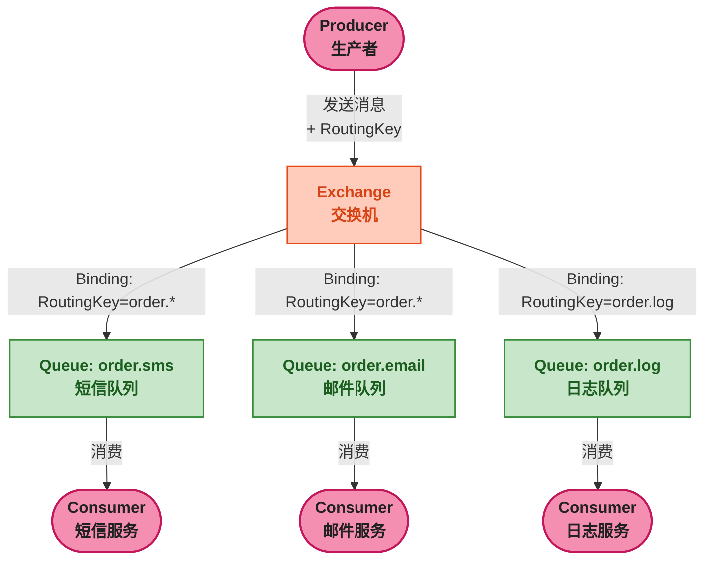
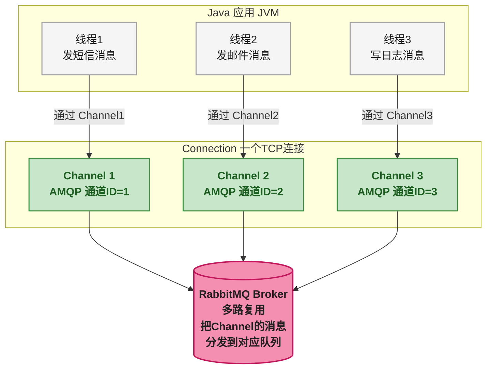
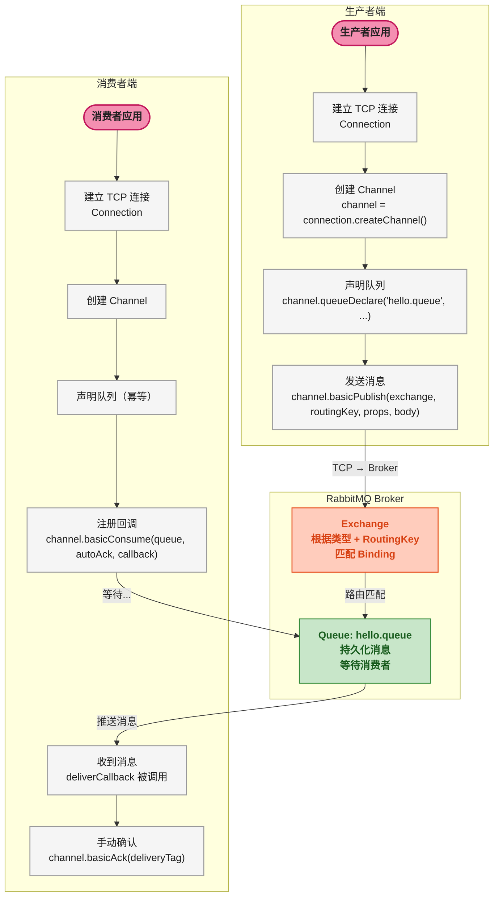

# RabbitMQ 核心概念与 AMQP 协议

## 一、⚡ 问题切入：同步处理为什么不行？

先看一个电商系统里最常见的下单流程：

```java
@Service
public class OrderService {

    @Transactional
    public Order createOrder(CreateOrderRequest request) {
        // 1. 扣减库存
        inventoryService.deduct(request.getProductId(), request.getQuantity());
        // 2. 创建订单
        Order order = orderMapper.insert(request);
        // 3. 发送下单成功短信——这一步是同步的
        smsService.sendOrderConfirm(request.getUserId(), order.getId());
        // 4. 发送下单成功邮件——这一步也是同步的
        emailService.sendOrderConfirm(request.getUserId(), order.getId());
        // 5. 写入操作日志
        operationLogService.record("CREATE_ORDER", order.getId());

        return order;
    }
}
```

一次下单请求，用户要等库存扣减、订单入库、短信发送、邮件发送、日志写入<strong>全部完成</strong>才能收到响应。短信调用运营商接口，邮件走 SMTP，日志写入数据库——这三步加起来可能要 500ms ~ 2s。用户在前端点完"提交订单"后盯着屏幕转圈，体验糟糕。

有人会说："那简单，开个线程异步执行不就行了？"

```java
// 线程池异步——似乎解决了问题
executorService.submit(() -> smsService.sendOrderConfirm(userId, orderId));
executorService.submit(() -> emailService.sendOrderConfirm(userId, orderId));
```

但这引入了一连串新问题：

| 问题 | 具体表现 |
|------|---------|
| <strong>任务丢失</strong> | JVM 重启或崩溃，线程池里排队的任务直接消失——短信没发、邮件没发 |
| <strong>重试困难</strong> | 短信发送失败了，什么时机重试？重试几次？这些逻辑要手写 |
| <strong>业务耦合</strong> | 下单服务直接依赖短信服务、邮件服务的 API。短信服务挂了，下单也受影响 |
| <strong>无法削峰</strong> | 秒杀时瞬间 5000 笔订单，线程池立马打满，拒绝策略一触发任务照样丢 |
| <strong>横向扩展受限</strong> | 如果短信服务想独立部署到另一台机器，线程池方案做不到 |

这就是消息队列（Message Queue）的用武之地。

## 二、🧬 消息队列解决什么问题？

消息队列将<strong>同步的、耦合的直接调用</strong>变成<strong>异步的、解耦的消息传递</strong>。上面三行异步代码可以替换为：

```java
// 下单完成后，只发一条消息
rabbitTemplate.convertAndSend("order.exchange", "order.created", orderMessage);
// 短信服务、邮件服务、日志服务各自订阅这条消息，独立消费
```

从"下单服务调短信服务"变成"下单服务发消息，短信服务收消息"——中间隔着一个 Broker（消息代理）。这就是<strong>解耦</strong>。

完整的消息队列提供三个核心能力：

```
异步          →  让主流程快速返回，非关键操作异步处理
解耦          →  生产者和消费者只依赖消息格式，不依赖彼此的实现
削峰填谷      →  突发流量先进入队列缓冲，消费者按自己节奏慢慢处理
```

<strong>削峰填谷</strong>是最容易被低估的价值。假设秒杀时每秒 5000 笔订单，短信服务每秒只能处理 100 条。没有消息队列时，短信服务直接被压垮。有了消息队列，5000 条消息先进队列，短信服务按 100 条/秒的速度从容消费——队尾消息的处理延迟增加了，但<strong>系统没挂</strong>。



```mermaid
flowchart TD
    classDef startEnd fill:#F48FB1,stroke:#C2185B,stroke-width:2px,color:#212121,font-weight:bold;
    classDef condition fill:#E1BEE7,stroke:#7B1FA2,stroke-width:1.5px,color:#212121,font-weight:bold;
    classDef process fill:#F5F5F5,stroke:#9E9E9E,stroke-width:1.5px,color:#212121;
    classDef data fill:#C8E6C9,stroke:#388E3C,stroke-width:1.5px,color:#1B5E20,font-weight:bold;
    classDef highlight fill:#FFCCBC,stroke:#E64A19,stroke-width:1.5px,color:#D84315,font-weight:bold;

    subgraph NO_MQ ["没有消息队列"]
        N1[下单请求 5000/s] --> N2[短信服务 100/s]
        N2 --> N3[服务崩溃]
    end

    subgraph WITH_MQ ["有消息队列"]
        W1[下单请求 5000/s] --> W2[消息队列 缓冲]
        W2 --> W3[短信服务 100/s]
        W3 --> W4[稳定消费]
    end

    class N1,W1 startEnd;
    class N2,W2,W3 process;
    class N3 highlight;
    class W4 data;
```

### 为什么选 RabbitMQ？

市面上主流的消息队列包括 RabbitMQ、Kafka、RocketMQ、ActiveMQ。它们不是互相替代的关系——各有侧重的场景：

| | RabbitMQ | Kafka | RocketMQ |
|------|:---:|:---:|:---:|
| <strong>协议</strong> | AMQP 0-9-1 | 自定义 TCP 协议 | 自定义（类似 Kafka） |
| <strong>路由能力</strong> | Exchange + Binding，极灵活 | 基于 Topic 分区 | 基于 Topic/Tag |
| <strong>消息优先级</strong> | 支持 | 不支持 | 不支持 |
| <strong>延迟队列</strong> | 插件或 TTL+DLX | 不支持（需额外实现） | 原生支持 |
| <strong>吞吐量</strong> | 万 ~ 十万/秒 | 百万/秒 | 十万 ~ 百万/秒 |
| <strong>典型场景</strong> | 业务异步、订单处理、通知 | 日志收集、流处理、大数 | 电商交易、金融通知 |
| <strong>学习曲线</strong> | 中 | 低（但深入后不简单） | 高 |

<strong>RabbitMQ 的核心优势是路由灵活</strong>——Exchange 和 Binding 的组合让消息可以按各种规则分发到不同队列，这在业务系统里远比"把所有消息灌进一个 Topic"实用。而且基于 AMQP 开放协议，不受特定语言绑定。

## 三、🧬 AMQP 0-9-1：RabbitMQ 的底层协议

RabbitMQ 是最早实现 AMQP（Advanced Message Queuing Protocol）的中间件之一。理解 RabbitMQ 之前，先理解 AMQP 的角色。

在 AMQP 之前，每个 MQ 中间件有自己的专有协议——客户端库不通用，切换中间件成本极高。AMQP 定义了一套<strong>语言无关、平台无关的消息传递标准</strong>，规定了消息的格式、路由机制、确认机制。RabbitMQ 实现了 AMQP 0-9-1，意味着用 AMQP 客户端库连 RabbitMQ 的行为是确定的、有规范可查的。

AMQP 0-9-1 规定了三个核心角色：

```
Producer（生产者）          Broker（消息代理/中间件）         Consumer（消费者）
    发消息                         存储+路由                       收消息
```

重点在 Broker 这端。AMQP 在 Broker 内部定义了一套精细的消息路由模型：

```
Producer → Exchange → [Binding] → Queue → Consumer
```

消息不直接发到队列——<strong>消息先到 Exchange（交换机），Exchange 根据 Binding（绑定规则）决定消息放到哪些 Queue（队列）</strong>。这个"Exchange → Binding → Queue"的三元关系是 RabbitMQ 区别于其他 MQ 最核心的特征。



图中可以看出一条消息被三个消费者消费——短信、邮件、日志各自拿到一份。这是 Exchange 类型为 `fanout`（广播）或 `topic` 时的行为。不同 Exchange 类型的路由规则会在下一篇展开。

## 四、🗺️ 核心组件逐一拆解

### 4.1 Broker —— RabbitMQ 服务器实例

Broker 就是 RabbitMQ 服务进程本身。一个 Broker 是一个 Erlang 虚拟机节点，负责接收连接、管理 Exchange/Queue/Binding 元数据、存储消息、分发消息。可以单机部署，也可以组成集群。

### 4.2 Virtual Host —— 逻辑隔离的"迷你 Broker"

Virtual Host（vhost）是 RabbitMQ 中<strong>最容易被新手忽略但最重要的隔离机制</strong>。一个 Broker 内部可以创建多个 vhost，每个 vhost 拥有独立的 Exchange、Queue、Binding 和权限控制。

```
RabbitMQ Broker
├── vhost: / (默认)
│   ├── Exchange: order.exchange
│   ├── Queue: order.sms
│   └── Binding: order.exchange → order.sms
├── vhost: /dev
│   ├── Exchange: order.exchange  ← 和 / 下的 exchange 同名但互不影响
│   └── Queue: order.sms
└── vhost: /prod
    ├── Exchange: order.exchange
    └── Queue: order.sms
```

<strong>一个连接只能绑定到一个 vhost</strong>。这意味着：
- 开发环境和测试环境可以用同一个 RabbitMQ 的不同 vhost，完全隔离
- 不同业务线用不同 vhost，互不干扰
- vhost 级别的权限控制：哪些用户可以访问某个 vhost

> ⚠️ 新手提示：RabbitMQ 安装后有一个默认 vhost `/`。初学时都在 `/` 下操作没问题，但生产环境一定要创建独立的 vhost。`/` 是特殊标识，创建时写成 `%2F`（URL 编码）。

### 4.3 Exchange —— 消息的第一站

Exchange 是消息进入 Broker 后的第一个目的地。它<strong>不存储消息</strong>——只负责根据 Binding 规则把消息路由到正确的队列。

接收消息时需要指定两个参数：

```java
// exchangeName: 交换机名称
// routingKey: 路由键，用于匹配 Binding
channel.basicPublish("order.exchange", "order.created", null, messageBody);
```

Exchange 有四种类型，决定了 RoutingKey 如何匹配 Binding：

| 类型 | 路由逻辑 | 典型场景 |
|------|---------|---------|
| <strong>Direct</strong> | RoutingKey 与 BindingKey 完全相等 | 一对一精确路由 |
| <strong>Fanout</strong> | 忽略 RoutingKey，广播到所有绑定的队列 | 广播通知 |
| <strong>Topic</strong> | RoutingKey 与 BindingKey 按通配符匹配 | 按业务规则多路分发 |
| <strong>Headers</strong> | 不根据 RoutingKey，根据消息的 Headers 属性匹配 | 复杂的属性匹配路由 |

每种类型的详细用法和代码演示在下一篇[<strong>交换机类型完全指南</strong>] 中展开。第一篇只建立概念——知道 Exchange 是一个"路由器"即可。

### 4.4 Queue —— 消息真正的存放处

Queue 是 RabbitMQ 中实际<strong>存储消息</strong>的地方。消费者从队列取消息，不是从 Exchange 取。

Queue 的重要属性：

```bash
# 声明一个持久化、非排他的队列
# durable=true:   RabbitMQ 重启后队列依然存在
# exclusive=false: 不只属于当前连接
# auto-delete=false: 没有消费者时不自动删除
```

| 属性 | 含义 | 默认值 |
|------|------|:---:|
| `durable` | 队列元数据是否持久化（重启后队列还在不在） | `true`（生产） |
| `exclusive` | 是否只属于声明它的连接（连接断开队列删除） | `false` |
| `auto-delete` | 最后一个消费者断开后是否自动删除队列 | `false` |
| `arguments` | 扩展参数（TTL、最大长度、死信设置等） | 无 |

> ⚠️ 新手提示：`durable=true` 只保证<strong>队列定义</strong>在重启后还在，不保证<strong>队列里的消息</strong>不丢。消息的持久化需要在发送时额外设置 `MessageProperties.PERSISTENT_TEXT_PLAIN`，这篇第四节会细讲。

### 4.5 Binding —— Exchange 和 Queue 之间的"接线"

Binding 是一条规则，连接一个 Exchange 和一个 Queue。规则的内容是<strong>Binding Key</strong>。Exchange 拿到消息的 RoutingKey 后，遍历所有 Binding，找到匹配的 Binding，把消息投递到对应的 Queue。

```java
// 将队列 order.sms 绑定到 Exchange order.exchange
// Binding Key = "order.created"
channel.queueBind("order.sms", "order.exchange", "order.created");

// 同一个队列可以绑定多次（不同 Binding Key）
channel.queueBind("order.sms", "order.exchange", "order.paid");
```

一个 Exchange 可以绑多个 Queue，一个 Queue 也可以绑到多个 Exchange。Binding 是 RabbitMQ 灵活路由的基础。

### 4.6 RoutingKey —— 消息的"地址标签"

RoutingKey 是生产者在发送消息时指定的字符串，长度限制 255 字节。它本身没有语义——完全由 Exchange 和 Binding 的匹配规则赋予意义。

```java
// RoutingKey 命名惯例：业务.操作，用 '.' 分隔
"order.created"      // 订单创建
"order.paid"         // 订单付款
"user.registered"    // 用户注册
"stock.deduct.fail"  // 库存扣减失败
```

### 4.7 Connection 与 Channel —— 为什么需要两层？

这是另一个新手容易疑惑的点。连 RabbitMQ 时，代码是这样写的：

```java
ConnectionFactory factory = new ConnectionFactory();
factory.setHost("localhost");
Connection connection = factory.newConnection();   // 一个 TCP 连接

Channel channel = connection.createChannel();      // 在连接上创建一个通道
channel.basicPublish(...);                         // 通过通道发消息
```

为什么不直接用 Connection 发消息，而要再多一层 Channel？

| | Connection | Channel |
|------|:---:|:---:|
| <strong>本质</strong> | 一个 TCP 连接 | TCP 连接上的一个虚拟通道（逻辑连接） |
| <strong>资源开销</strong> | 大（TCP 三次握手、操作系统文件描述符） | 极小（只是一个整数 ID） |
| <strong>数量</strong> | 一个应用通常 1 个 | 一个 Connection 上可以开成百上千个 |
| <strong>隔离性</strong> | 物理隔离 | Channel 之间互不影响 |

<strong>核心原因：TCP 连接太少不够用（需要并发），太多则资源吃紧。Channel 在一个 TCP 连接上多路复用，用最小的开销支持并发操作。</strong>



<strong>多线程不能共享同一个 Channel</strong>——每个线程应该用独立的 Channel，确保线程安全。这也是 Channel 存在的意义之一：给每个线程一个独立的通信通道，但共享底层的 TCP 连接。

## 五、🔧 环境搭建

### 5.1 Docker 安装 RabbitMQ（推荐）

```bash
# 拉取带管理界面的版本（management 标签包含 Web 管理插件）
docker run -d \
  --name rabbitmq \
  -p 5672:5672 \      # AMQP 协议端口（程序连接用）
  -p 15672:15672 \    # HTTP 管理界面端口（浏览器访问）
  -e RABBITMQ_DEFAULT_USER=admin \
  -e RABBITMQ_DEFAULT_PASS=admin123 \
  rabbitmq:3.12-management-alpine
```

端口说明：
- <strong>5672</strong>：AMQP 协议端口，Java 客户端连接这个端口
- <strong>15672</strong>：管理界面 HTTP 端口，浏览器访问 `http://localhost:15672`

验证是否启动成功：

```bash
# 检查容器状态
docker ps | grep rabbitmq
# 预期输出：Up 状态

# 检查端口
docker port rabbitmq
# 预期输出：5672/tcp, 15672/tcp
```

### 5.2 管理界面初探

浏览器打开 `http://localhost:15672`，用 `admin / admin123` 登录。

管理界面六个核心 Tab：

| Tab | 作用 |
|-----|------|
| <strong>Overview</strong> | 总览：消息速率、连接数、队列数、节点状态 |
| <strong>Connections</strong> | 当前所有客户端连接列表 |
| <strong>Channels</strong> | 当前所有 Channel 列表（一个连接下有多个 Channel） |
| <strong>Exchanges</strong> | 所有交换机列表（包括系统自带的 7 个 AMQP 默认交换机） |
| <strong>Queues</strong> | 所有队列列表，可以查看消息积压量、消费者数 |
| <strong>Admin</strong> | 用户管理、vhost 管理、策略配置 |

先看一眼 `Exchanges` 页面——你会看到 RabbitMQ 自带的一批交换机（名称以 `amq.` 开头）。这些是 AMQP 协议定义的系统默认交换机，实际项目中通常自定义 Exchange。

## 六、👋 第一个 RabbitMQ 消息

不用 Spring，先用最原始的 RabbitMQ Java Client 发一条消息。这有助于理解底层发生了什么。

### 6.1 依赖

```xml
<dependency>
    <groupId>com.rabbitmq</groupId>
    <artifactId>amqp-client</artifactId>
    <version>5.20.0</version>
</dependency>
```

### 6.2 生产者：发送消息

```java
import com.rabbitmq.client.Channel;
import com.rabbitmq.client.Connection;
import com.rabbitmq.client.ConnectionFactory;

public class HelloProducer {
    public static void main(String[] args) throws Exception {
        // 1. 创建连接工厂
        ConnectionFactory factory = new ConnectionFactory();
        factory.setHost("localhost");
        factory.setPort(5672);
        factory.setUsername("admin");
        factory.setPassword("admin123");
        factory.setVirtualHost("/");   // 使用默认 vhost

        // 2. 创建连接
        Connection connection = factory.newConnection();

        // 3. 创建 Channel——所有操作都通过 Channel 执行
        Channel channel = connection.createChannel();

        // 4. 声明队列（如果队列已存在则什么都不做，幂等）
        //    参数: queue名, durable, exclusive, autoDelete, arguments
        channel.queueDeclare("hello.queue", true, false, false, null);

        // 5. 发送消息
        String message = "Hello RabbitMQ! 第一条消息";
        channel.basicPublish(
            "",              // exchange: 空字符串 = 默认交换机（AMQP default）
            "hello.queue",   // routingKey: 在默认交换机下，routingKey = 队列名
            null,            // props: 消息属性（持久化标记、TTL 等）
            message.getBytes() // body: 消息内容
        );

        System.out.println("消息已发送：" + message);

        // 6. 关闭资源
        channel.close();
        connection.close();
    }
}
```

<strong>逐行解释</strong>：

| 行号 | 代码 | 解释 |
|------|------|------|
| 1 ~ 5 | `factory.setXxx(...)` | 配置连接参数。生产环境这些值从配置文件读取 |
| 2 | `factory.newConnection()` | 建立 TCP 连接。这一步有网络开销 |
| 3 | `connection.createChannel()` | 在连接上新建一个 Channel。Channel 是轻量级的，可以频繁创建 |
| 4 | `channel.queueDeclare(...)` | 声明一个队列。`true` 表示持久化队列——RabbitMQ 重启后队列还在 |
| 5 | `channel.basicPublish(...)` | 发消息。`""` 表示使用默认交换机——一种特殊的 Direct Exchange，它把消息直接路由到名为 routingKey 的队列 |
| 6 | `channel.close()` / `connection.close()` | 释放资源。每次操作完都关闭是 Demo 写法；生产中用长连接 |

> ⚠️ 新手提示：`queueDeclare` 是<strong>幂等</strong>的——如果队列已存在且参数一致，什么都不会发生。这很重要：生产者和消费者都可以调用 `queueDeclare`，最先启动的一方会创建队列。两边都声明可以保证不管谁先启动，队列一定存在。

### 6.3 消费者：接收消息

```java
import com.rabbitmq.client.*;

public class HelloConsumer {
    public static void main(String[] args) throws Exception {
        ConnectionFactory factory = new ConnectionFactory();
        factory.setHost("localhost");
        factory.setPort(5672);
        factory.setUsername("admin");
        factory.setPassword("admin123");

        Connection connection = factory.newConnection();
        Channel channel = connection.createChannel();

        // 声明同一个队列（幂等，队列存在则无事发生）
        channel.queueDeclare("hello.queue", true, false, false, null);

        // 回调函数：收到消息时执行
        DeliverCallback deliverCallback = (consumerTag, delivery) -> {
            String message = new String(delivery.getBody(), "UTF-8");
            System.out.println("收到消息: " + message);

            // 手动确认（acknowledge）
            channel.basicAck(delivery.getEnvelope().getDeliveryTag(), false);
        };

        // 开始消费
        // autoAck=false: 关闭自动确认，需要手动 basicAck
        channel.basicConsume("hello.queue", false, deliverCallback, consumerTag -> {});

        System.out.println("消费者已启动，等待消息...");
        // 不关闭连接，持续监听
    }
}
```

<strong>关键点</strong>：

- `deliverCallback` 是一个回调函数，每次收到消息时被调用。它运行在<strong>一个独立的线程</strong>上（由 RabbitMQ 客户端维护的线程池）
- `basicAck` 是手动确认——告诉 RabbitMQ "这条消息我已经处理完了，你可以从队列中删掉了"。如果消费者处理到一半崩溃了，没有发 ACK，RabbitMQ 会把这条消息重新发给其他消费者。这是消息可靠性的基础
- `autoAck=false` 关闭自动确认。如果设 `true`，RabbitMQ 把消息发给消费者后立刻删除，不管消费者是否处理成功。生产环境<strong>永远不用 autoAck</strong>

### 6.4 跑起来看效果

```bash
# 终端1：先启动消费者
mvn exec:java -Dexec.mainClass="HelloConsumer"
# 输出: 消费者已启动，等待消息...

# 终端2：启动生产者
mvn exec:java -Dexec.mainClass="HelloProducer"
# 输出: 消息已发送：Hello RabbitMQ! 第一条消息

# 切回终端1，消费者输出：
# 收到消息: Hello RabbitMQ! 第一条消息
```

切换到管理界面 `http://localhost:15672` → Queues 标签，可以看到 `hello.queue`，点进去查看消息状态——消息已被消费，队列为空。

## 七、🗺️ 完整消息流程

把上面所有概念串起来，一条消息从生产者到消费者的完整路径：



每一步做了什么，前面都拆解过了。这四十四条的文字描述，本质就是这幅图。

## 八、📋 常见误区与排错

| 现象 | 原因 | 解决 |
|------|------|------|
| 消息发出去但消费者收不到 | Exchange 和队列的 Binding 没配置或 BindingKey 不匹配 | 检查管理界面 Exchange → Bindings |
| `channel error: NOT_FOUND - no queue` | 发送时队列不存在，且 `mandatory` 为默认 `false` | 先启动消费者声明队列，或生产者声明 |
| 消费者收到消息但又被其他人收到 | 两个消费者绑定了同一个队列（默认轮询分发） | 确认是否误绑了同一个队列 |
| 管理界面打不开 | 容器没有 `management` 标签 | 重新拉取 `management-alpine` 版本 |
| `ACCESS_REFUSED` | vhost 权限不足 | 管理界面 → Admin → 给用户在目标 vhost 上配置权限 |

## 九、📝 概念速查表

| 概念 | 一句话定义 | 类比理解（仅此一处，后续不再用） |
|------|-----------|------|
| <strong>Broker</strong> | RabbitMQ 服务进程本身 | 邮局 |
| <strong>Virtual Host</strong> | Broker 内的逻辑隔离单元，有自己的 Exchange/Queue/权限 | 邮局里的不同邮箱区域 |
| <strong>Exchange</strong> | 接收消息并根据 Binding 规则路由 | 分拣机 |
| <strong>Queue</strong> | 实际存储消息的地方 | 收件人信箱 |
| <strong>Binding</strong> | 连接 Exchange 和 Queue 的规则（BindingKey） | 分拣规则 |
| <strong>RoutingKey</strong> | 消息自带的标签，被 Exchange 用于匹配 Binding | 邮件上的地址 |
| <strong>Connection</strong> | TCP 连接 | 通往邮局的公路 |
| <strong>Channel</strong> | Connection 上的虚拟通道，消息收发都通过它 | 公路上的车道 |
| <strong>Producer</strong> | 发送消息的应用 | 寄信人 |
| <strong>Consumer</strong> | 接收处理消息的应用 | 收信人 |

## 十、🎯 总结

本文从一个下单场景的同步阻塞问题切入，解释了消息队列的三个核心价值——<strong>异步、解耦、削峰填谷</strong>——并聚焦 RabbitMQ 的 AMQP 协议模型：

1. <strong>Exchange → Binding → Queue 三元路由</strong>：消息不直接发到队列，而是经过 Exchange 路由。这是 RabbitMQ 区别于 Kafka/RocketMQ 最核心的特征。

2. <strong>Virtual Host 隔离</strong>：一个 Broker 内可以有多个 vhost，各自独立的 Exchange/Queue/权限。生产环境务必创建独立 vhost。

3. <strong>Connection 与 Channel 的分离</strong>：一个 TCP 连接上复用多个 Channel，兼顾连接开销和并发能力。每个线程独占一个 Channel。

4. <strong>手动 ACK</strong>：`autoAck=false` + `basicAck` 是消息不丢失的基础。消费完才确认，处理失败不确认让 RabbitMQ 重新投递。

Docker 安装 + 第一个 `basicPublish` / `basicConsume` 示例已经跑通，管理界面也认识了一遍。接下来需要深入理解 Exchange 的四种类型——这是 RabbitMQ 灵活路由能力的核心。

> 📖 <strong>下一步阅读</strong>：Exchange 的四种类型（Direct / Fanout / Topic / Headers）每种都有完全不同的路由行为。继续阅读[<strong>交换机类型完全指南</strong>]()，一篇带你用 Java 代码逐一验证每种类型的路由结果。
