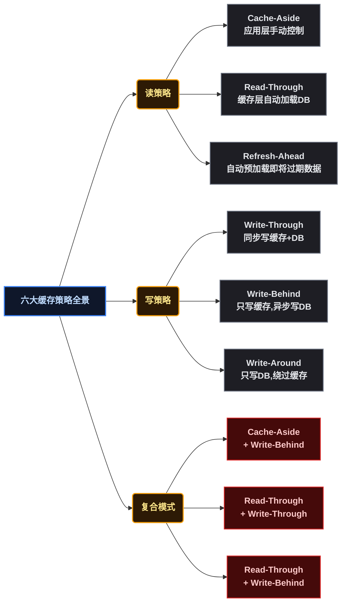
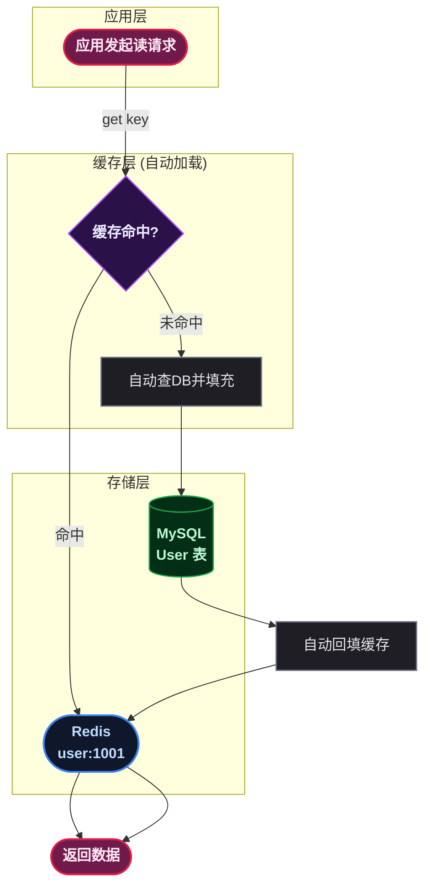
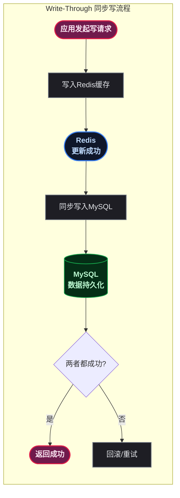
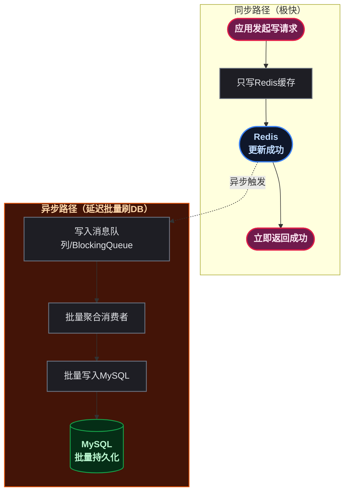
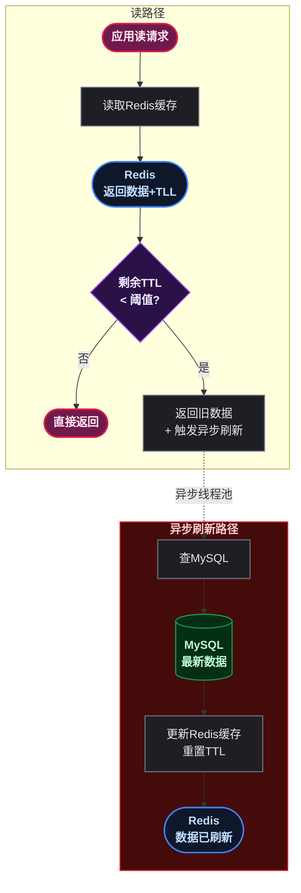
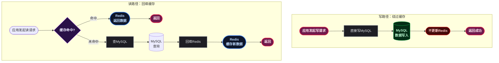
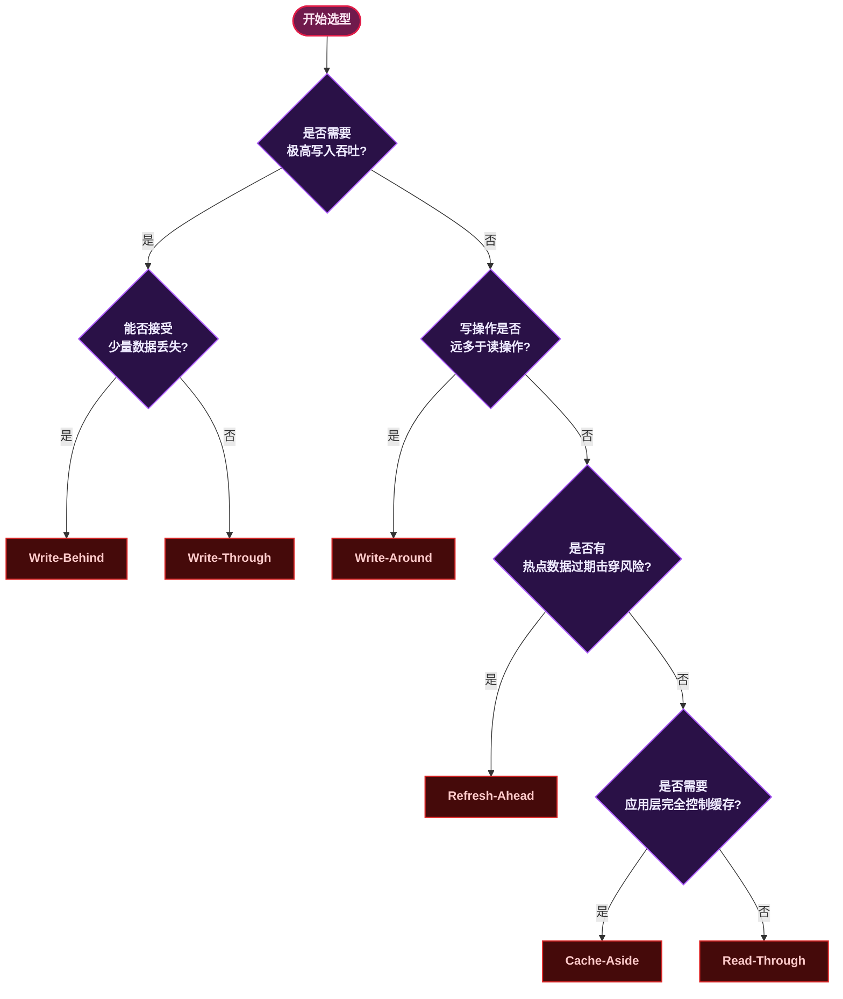

# 🚀 Redis 缓存策略进阶：六大模式全解析

> 📖 <strong>前置阅读</strong>：本文是 SpringBoot Redis 系列的<strong>进阶篇</strong>，假设读者已经掌握了 Redis 的基本数据结构和 SpringBoot 环境下的 RedisTemplate 操作。如果还没有，建议先阅读前两篇：
> - [<strong>Redis 核心架构：五大数据结构与常用命令全解析</strong>]() —— 介绍篇
> - [<strong>SpringBoot Redis 全操作指南</strong>]() —— 实战篇

## 一、⚡ 问题切入：没有缓存策略会怎样？

先看一段日常开发中常见的业务代码：

```java
// 一个典型的"查缓存 → 查 DB → 写缓存"逻辑
public User getUserById(Long userId) {
    String cacheKey = "user:" + userId;
    // 1. 先查 Redis 缓存
    User user = (User) redisTemplate.opsForValue().get(cacheKey);
    if (user != null) {
        return user;
    }
    // 2. 缓存未命中，查 MySQL
    user = userMapper.selectById(userId);
    if (user != null) {
        // 3. 写入 Redis 缓存，设置 30 分钟过期
        redisTemplate.opsForValue().set(cacheKey, user, 30, TimeUnit.MINUTES);
    }
    return user;
}

public void updateUser(User user) {
    // 更新 DB
    userMapper.updateById(user);
    // 删除缓存（而非更新缓存）
    redisTemplate.delete("user:" + user.getId());
}
```

这段代码隐含了一个被广泛使用的模式——  **Cache-Aside（旁路缓存）** 。但这就是全部吗？当业务场景从"普通查询"扩展到"秒杀库存扣减"、"热点榜单刷新"、"写多读少日志落盘"时，上面这段代码会暴露出以下问题：

- **缓存与 DB 双写不一致** ：先更新 DB 后删缓存，中间窗口期读到旧数据
- **缓存穿透** ：大量不存在的 key 直接打穿到 DB
- **写入延迟不可控** ：每次更新都要同步写 DB + 删缓存，高并发下性能瓶颈明显
- **热点数据集中过期** ：批量缓存同时过期，瞬间流量打到 DB（缓存雪崩）

不同的业务场景需要不同的 **缓存策略（Cache Strategy）** ——即应用、缓存中间件（Redis）和数据库（MySQL）三者之间关于"何时读缓存、何时写缓存、何时同步 DB"的协作模式。

本文将逐一拆解六大缓存策略： **Cache-Aside** 、 **Read-Through** 、 **Write-Through** 、 **Write-Behind** 、 **Refresh-Ahead** 、 **Write-Around** 。每个策略都附带 Mermaid 图解（数据库与缓存放用不同形状区分）、完整的 RedisTemplate 代码模板，以及可直接落地的实战示例。

## 二、🗺️ 缓存策略全景图

在深入每个策略之前，先用一张全景图建立全局认知。六大策略的本质区别在于 **谁负责维护缓存与 DB 的一致性** （应用层 vs 缓存层）以及 **写入时缓存与 DB 的同步方式** （同步 vs 异步）。



**读策略** 决定"缓存未命中时谁来加载数据"， **写策略** 决定"数据更新时如何同步缓存与 DB"。实际项目中，读策略和写策略通常组合使用。下表给出六种策略的核心定义：

| 策略 | 读路径 | 写路径 | 一致性 | 适用场景 |
|------|--------|--------|:------:|---------|
|  **Cache-Aside** | 应用查缓存→未命中则查 DB→写缓存 | 应用写 DB→删缓存 | 最终一致性 | 普通业务 CRUD |
| **Read-Through** | 缓存层自动查 DB 并填充 | 同 Cache-Aside（写由配套策略决定） | 最终一致性 | Spring Cache 等自动缓存层 |
| **Write-Through** | 同 Read-Through | 同步写缓存 + 同步写 DB | 强一致性 | 低延迟且需较强一致性 |
| **Write-Behind** | 同 Read-Through | 只写缓存，异步批量写 DB | 最终一致性 | 大促秒杀、计数、高并发写入 |
| **Refresh-Ahead** | 即将过期时自动预加载 | 同配套写策略 | 最终一致性 | 热点数据自动刷新 |
| **Write-Around** | 同 Cache-Aside / Read-Through | 只写 DB，不写缓存 | 最终一致性 | 大量写入、避免缓存污染 |

## 三、⚙️ 通用基础设施：RedisTemplate 配置模板

在进入各策略的具体实现之前，先搭建一套通用的 Redis 基础设施。后续所有策略的代码模板都基于此配置。

```java
@Configuration
public class RedisConfig {

    @Bean
    public RedisTemplate<String, Object> redisTemplate(RedisConnectionFactory factory) {
        RedisTemplate<String, Object> template = new RedisTemplate<>();
        template.setConnectionFactory(factory);

        // Key 序列化：String，可读性好
        StringRedisSerializer stringSerializer = new StringRedisSerializer();
        template.setKeySerializer(stringSerializer);
        template.setHashKeySerializer(stringSerializer);

        // Value 序列化：Jackson JSON，支持复杂对象
        Jackson2JsonRedisSerializer<Object> jsonSerializer =
                new Jackson2JsonRedisSerializer<>(Object.class);
        ObjectMapper mapper = new ObjectMapper();
        mapper.setVisibility(PropertyAccessor.ALL, JsonAutoDetect.Visibility.ANY);
        mapper.activateDefaultTyping(
                LaissezFaireSubTypeValidator.instance,
                DefaultTyping.NON_FINAL
        );
        jsonSerializer.setObjectMapper(mapper);

        template.setValueSerializer(jsonSerializer);
        template.setHashValueSerializer(jsonSerializer);
        template.afterPropertiesSet();
        return template;
    }

    @Bean
    public CacheManager cacheManager(RedisConnectionFactory factory) {
        RedisCacheConfiguration config = RedisCacheConfiguration.defaultCacheConfig()
                .entryTtl(Duration.ofMinutes(30))
                .serializeKeysWith(RedisSerializationContext.SerializationPair
                        .fromSerializer(new StringRedisSerializer()))
                .serializeValuesWith(RedisSerializationContext.SerializationPair
                        .fromSerializer(new GenericJackson2JsonRedisSerializer()))
                .disableCachingNullValues();
        return RedisCacheManager.builder(factory)
                .cacheDefaults(config)
                .build();
    }
}
```

配置要点说明：

- **Key 序列化** 使用 `StringRedisSerializer` ，保证 Redis 中 key 可读、可排查
- **Value 序列化** 使用 `Jackson2JsonRedisSerializer` ，支持任意 Java 对象与 JSON 互转
- **CacheManager** （Spring Cache 注解驱动缓存的 Bean）设置默认 TTL 30 分钟，且禁用 null 值缓存（防止缓存穿透）

## 四、🗄️ Cache-Aside（旁路缓存）—— 最通用的手动控制模式

### 4.1 💡 核心定义

**Cache-Aside（旁路缓存）** 是应用层代码手动控制缓存读写，缓存与 DB 之间没有自动同步机制。读的时候先查缓存，未命中再查 DB 并回填缓存；写的时候先更新 DB，然后删除（或更新）缓存。

**关键特征** ：缓存系统不主动与 DB 交互，一切由应用代码控制。

### 4.2 📊 读 / 写流程 Mermaid 图解

```mermaid
flowchart TD
classDef startEnd fill:#701a4c,stroke:#e11d48,stroke-width:2px,color:#fce7f3,font-weight:bold;
classDef condition fill:#2a1147,stroke:#a855f7,stroke-width:1.5px,color:#ede9fe,font-weight:bold;
classDef process fill:#1e1e24,stroke:#6b7280,stroke-width:1.5px,color:#e5e7eb;
classDef data fill:#052e16,stroke:#16a34a,stroke-width:1.5px,color:#bbf7d0,font-weight:bold;
classDef cache fill:#0f172a,stroke:#3b82f6,stroke-width:2px,color:#bfdbfe,font-weight:bold;

    subgraph READ_FLOW ["读路径：Cache-Aside"]
        R1([应用层发起读请求]) --> R2{缓存命中?}
        R2 -- 命中 --> R3([返回缓存数据])
        R2 -- 未命中 --> R4[查MySQL]
        R4 --> R5[(MySQL\nUser 表)]
        R5 --> R6[回填Redis缓存]
        R6 --> R7([Redis\nuser:1001])
        R7 --> R8([返回数据])
    end

    subgraph WRITE_FLOW ["写路径：Cache-Aside"]
        W1([应用层发起写请求]) --> W2[更新MySQL]
        W2 --> W3[(MySQL\nUser 表)]
        W3 --> W4[删除Redis缓存]
        W4 --> W5([Redis\n删除user:1001])
        W5 --> W6([返回成功])
    end

    class R1,R3,R8,W1,W6 startEnd;
    class R2 condition;
    class R4,R6,W2,W4 process;
    class R5,W3 data;
    class R7,W5 cache;
```



图中 **圆柱形节点（ `[( )]` ）代表关系型数据库（MySQL）** ， **圆角矩形节点（ `([ ])` ）代表缓存（Redis）** 。后续所有 Mermaid 图均遵循此约定。

### 4.3 📥 读路径：RedisTemplate 代码模板

```java
/**
 * Cache-Aside 读模板：查缓存 → 未命中查 DB → 回填缓存
 *
 * @param cacheKey   缓存 key
 * @param ttl        缓存过期时间
 * @param timeUnit   时间单位
 * @param dbLoader   DB 查询回调（缓存未命中时调用）
 * @param <T>        返回值类型
 * @return 查询结果
 */
public <T> T cacheAsideRead(
        String cacheKey,
        long ttl,
        TimeUnit timeUnit,
        Class<T> clazz,
        Supplier<T> dbLoader) {

    // 1. 查缓存
    T cachedValue = (T) redisTemplate.opsForValue().get(cacheKey);
    if (cachedValue != null) {
        return cachedValue;
    }

    // 2. 缓存未命中，加分布式锁防止缓存击穿（可选）
    String lockKey = "lock:" + cacheKey;
    Boolean locked = redisTemplate.opsForValue()
            .setIfAbsent(lockKey, "1", 10, TimeUnit.SECONDS);
    if (Boolean.TRUE.equals(locked)) {
        try {
            // 双重检查：获取锁后再次查缓存
            cachedValue = (T) redisTemplate.opsForValue().get(cacheKey);
            if (cachedValue != null) {
                return cachedValue;
            }
            // 3. 查 DB
            T dbValue = dbLoader.get();
            if (dbValue != null) {
                // 4. 回填缓存
                redisTemplate.opsForValue().set(cacheKey, dbValue, ttl, timeUnit);
            }
            return dbValue;
        } finally {
            redisTemplate.delete(lockKey);
        }
    } else {
        // 未获取到锁，短暂等待后递归重试
        try {
            Thread.sleep(50);
        } catch (InterruptedException e) {
            Thread.currentThread().interrupt();
        }
        return cacheAsideRead(cacheKey, ttl, timeUnit, clazz, dbLoader);
    }
}
```

**关键设计点** ：

- **分布式锁** ：使用 `SETNX` 实现轻量级锁，防止热点 key 过期瞬间大量请求击穿到 DB
- **双重检查** ：获取锁后再次查缓存，因为前一个持锁线程可能已经回填了缓存
- **递归重试** ：未获取锁的线程短暂等待后重试，重试可能命中前一个线程刚写入的缓存

### 4.4 📤 写路径：先更新 DB，再删除缓存

```java
/**
 * Cache-Aside 写模板：先更新 DB → 再删除缓存
 * 采用"删缓存"而非"更新缓存"：避免双写并发导致的数据不一致
 *
 * @param cacheKey   缓存 key
 * @param dbUpdater  DB 更新回调
 */
public void cacheAsideWrite(String cacheKey, Runnable dbUpdater) {
    // 1. 先更新 DB
    dbUpdater.run();

    // 2. 再删除缓存（延迟双删增强一致性）
    redisTemplate.delete(cacheKey);

    // 3. 延迟双删：异步再次删除，覆盖"读请求在删缓存前读到旧值并回填"的窗口
    CompletableFuture.runAsync(() -> {
        try {
            Thread.sleep(500);
        } catch (InterruptedException e) {
            Thread.currentThread().interrupt();
        }
        redisTemplate.delete(cacheKey);
    });
}
```

**为什么删缓存而不是更新缓存** ：

- **场景** ：线程 A 先更新 DB 为值 v1，线程 B 随后更新 DB 为值 v2；但线程 B 更新缓存先于线程 A，导致缓存中存的是 v1（旧值），DB 中是 v2（新值），出现不一致
- **删缓存** 规避了此问题：删完后下一个读请求会从 DB 加载最新值回填

**延迟双删** ：在主删（第 1 次 delete）之后，异步延迟 500ms 再删一次（第 2 次 delete），覆盖如下窗口期：

1. 线程 A 删缓存
2. 线程 B 读缓存未命中 → 查 DB（旧值）→ 回填缓存（旧值）
3. 线程 A 更新 DB（新值）
4. → 此时缓存中是旧值，DB 中是 **新值** ，不一致
5. 延迟双删：500ms 后再次删除，清理掉步骤 2 写入的旧值

### 4.5 ⚠️ 实际场景与局限性

| 适用 | 不适用 |
|------|--------|
| 普通 CRUD 业务 | 高并发写入（删缓存频繁，命中率低） |
| 读多写少 | 强一致性要求（存在双写窗口期） |
| 允许短暂不一致 | 写后立即读（可能读到旧缓存） |

## 五、📖 Read-Through（读穿透）—— 缓存层自动加载 DB

### 5.1 💡 核心定义

**Read-Through（读穿透）** 将"查 DB 并回填缓存"的逻辑从应用代码下沉到缓存层。应用只与缓存交互，缓存层在未命中时自动查 DB 并填充，对应用完全透明。
**关键特征** ：应用代码只调 `cache.get(key)` ，不需要写 `if null then queryDB and setCache` 。

### 5.2 📊 流程 Mermaid 图解



与 Cache-Aside 的核心差异：Cache-Aside 中"查 DB → 回填缓存"发生在应用代码里；Read-Through 中这步发生在缓存层内部，应用完全无感知。

### 5.3 🛠️ RedisTemplate 实现：基于 CacheLoader 的自动加载层

Redis 本身不提供原生的 Read-Through 机制，需要在应用层封装一个带 **CacheLoader（缓存加载器）** 的读写层来模拟：

```java
/**
 * Read-Through 缓存读取器 —— 缓存层自动加载 DB
 * 应用只调 get()，缓存未命中时由 CacheLoader 自动查 DB 并填充
 */
public class ReadThroughCache {

    private final RedisTemplate<String, Object> redisTemplate;

    /**
     * CacheLoader 映射表：每种数据类型注册一个加载函数
     * key 前缀 → DB 加载函数
     */
    private final Map<String, Function<String, Object>> loaders = new ConcurrentHashMap<>();

    public ReadThroughCache(RedisTemplate<String, Object> redisTemplate) {
        this.redisTemplate = redisTemplate;
    }

    /**
     * 注册 CacheLoader：告诉缓存层"未命中时怎样查 DB"
     *
     * @param prefix 缓存 key 前缀，用于路由到对应的 loader
     * @param loader 数据库加载函数，入参是去掉前缀后的业务 ID，返回 DB 数据
     */
    public void registerLoader(String prefix, Function<String, Object> loader) {
        loaders.put(prefix, loader);
    }

    /**
     * Read-Through 读操作 —— 应用只需调这一个方法
     *
     * @param key      完整缓存 key（如 "user:1001"）
     * @param ttl      过期时间（秒）
     * @param clazz    返回值类型
     * @param <T>      泛型
     * @return 数据（来自缓存或 DB）
     */
    @SuppressWarnings("unchecked")
    public <T> T get(String key, long ttl, Class<T> clazz) {
        // 1. 查缓存
        T cached = (T) redisTemplate.opsForValue().get(key);
        if (cached != null) {
            return cached;
        }

        // 2. 根据 key 前缀查找对应的 CacheLoader
        String prefix = extractPrefix(key);
        Function<String, Object> loader = loaders.get(prefix);
        if (loader == null) {
            throw new IllegalStateException(
                    "No CacheLoader registered for prefix: " + prefix);
        }

        // 3. 缓存层自动查 DB 并回填（这一步对应用透明）
        String bizId = extractBizId(key);
        Object dbValue = loader.apply(bizId);
        if (dbValue != null) {
            redisTemplate.opsForValue().set(key, dbValue, ttl, TimeUnit.SECONDS);
        }
        return (T) dbValue;
    }

    private String extractPrefix(String key) {
        int idx = key.indexOf(':');
        return idx > 0 ? key.substring(0, idx) : key;
    }

    private String extractBizId(String key) {
        int idx = key.indexOf(':');
        return idx > 0 ? key.substring(idx + 1) : key;
    }
}
```

### 5.4 ✍️ 使用示例

```java
// 1. 初始化 ReadThroughCache 并注册 CacheLoader
ReadThroughCache cache = new ReadThroughCache(redisTemplate);

// 注册 user 前缀的 CacheLoader：告诉缓存层如何查 DB
cache.registerLoader("user", bizId -> {
    Long userId = Long.valueOf(bizId);
    return userMapper.selectById(userId);
});

// 注册 product 前缀的 CacheLoader
cache.registerLoader("product", bizId -> {
    Long productId = Long.valueOf(bizId);
    return productMapper.selectById(productId);
});

// 2. 业务代码：只调 get()，不关心缓存命中/未命中/回填逻辑
User user = cache.get("user:1001", 1800, User.class);
Product product = cache.get("product:5001", 3600, Product.class);
```

### 5.5 🌱 Spring Cache 注解方式（声明式 Read-Through）

Spring Cache 抽象层天然实现了 Read-Through 模式。应用只需加注解，缓存未命中时自动调用方法体并缓存结果：

```java
@Service
public class UserService {

    // Read-Through：缓存未命中 → 自动执行方法体查 DB → 自动缓存结果
    @Cacheable(value = "user", key = "#userId", unless = "#result == null")
    public User getUserById(Long userId) {
        return userMapper.selectById(userId);
    }

    // 缓存更新：方法执行后自动更新缓存（Write-Through 语义）
    @CachePut(value = "user", key = "#user.id")
    public User updateUser(User user) {
        userMapper.updateById(user);
        return user;
    }

    // 缓存删除：方法执行后自动删缓存（Cache-Aside 语义）
    @CacheEvict(value = "user", key = "#userId")
    public void deleteUser(Long userId) {
        userMapper.deleteById(userId);
    }
}
```

### 5.6 📊 与 Cache-Aside 的对比

| 维度 | Cache-Aside | Read-Through |
|------|:-----------:|:------------:|
| 缓存控制权 | 应用代码 | 缓存层 |
| 代码耦合度 | 高（到处是 if null + set cache） | 低（只调 get） |
| 遗漏回填风险 | 有（开发者忘记写 set） | 无（缓存层自动处理） |
| 灵活性 | 高（可自定义加载逻辑） | 中（受限于注册的 loader） |
| 实现成本 | 低（直接调 RedisTemplate） | 中（需封装 loader 层） |

## 六、✍️ Write-Through（写穿透）—— 同步写缓存 + DB

### 6.1 💡 核心定义

**Write-Through（写穿透）** 要求每次写操作同时更新缓存和 DB，两者在同一个同步调用中完成。应用只与缓存层交互，缓存层负责将数据同步写入 DB。

**关键特征** ：缓存和 DB 中的数据始终保持一致（强一致性），但写入延迟 = 缓存写入延迟 + DB 写入延迟。

### 6.2 📊 写流程 Mermaid 图解



**注意** ：图中是先写缓存再写 DB 的顺序，实际实现中也可以是先写 DB 再写缓存。顺序取决于业务侧重点——先写缓存（读立即生效，但 DB 失败需回滚），先写 DB（数据持久性优先，但缓存可能滞后）。

### 6.3 🛠️ RedisTemplate 实现

```java
/**
 * Write-Through 写模板：同步写缓存 + DB，保证强一致性
 * 使用 Redis 事务（MULTI/EXEC）或 Lua 脚本保证原子性
 */
public class WriteThroughCache {

    private final RedisTemplate<String, Object> redisTemplate;

    public WriteThroughCache(RedisTemplate<String, Object> redisTemplate) {
        this.redisTemplate = redisTemplate;
    }

    /**
     * Write-Through 写操作
     *
     * @param key        缓存 key
     * @param value      待写入的值
     * @param ttl        过期时间（秒）
     * @param dbWriter   DB 写入回调
     * @param <T>        值类型
     */
    public <T> void writeThrough(String key, T value, long ttl, Consumer<T> dbWriter) {
        try {
            // 1. 先写缓存（读请求立即生效）
            redisTemplate.opsForValue().set(key, value, ttl, TimeUnit.SECONDS);

            // 2. 同步写 DB
            dbWriter.accept(value);

            // 3. 两者都成功：返回
        } catch (Exception e) {
            // 4. DB 写入失败：回滚缓存
            redisTemplate.delete(key);
            throw new RuntimeException("Write-Through failed, cache rolled back", e);
        }
    }

    /**
     * 使用 Lua 脚本保证"写缓存 + 写 DB 标记"的原子性
     * 写 DB 本身无法与 Redis 事务绑定，这里用 Lua 脚本保证缓存侧的原子操作
     */
    public <T> void writeThroughWithLog(String key, T value, long ttl,
                                         Consumer<T> dbWriter) {
        // 先在缓存中设置数据 + 一个"持久化中"标记
        String logKey = key + ":pending";
        redisTemplate.opsForValue().set(key, value, ttl, TimeUnit.SECONDS);
        redisTemplate.opsForValue().set(logKey, "1", 60, TimeUnit.SECONDS);

        try {
            dbWriter.accept(value);
            // DB 写入成功，清除 pending 标记
            redisTemplate.delete(logKey);
        } catch (Exception e) {
            // DB 写入失败：清除数据和标记，由补偿任务重试
            redisTemplate.delete(key);
            redisTemplate.delete(logKey);
            throw e;
        }
    }
}
```

### 6.4 ✍️ 使用示例

```java
WriteThroughCache writeThroughCache = new WriteThroughCache(redisTemplate);

// 商品库存扣减：需要缓存和 DB 同时反映最新库存
writeThroughCache.writeThrough("product:stock:5001", 99, 3600, newStock -> {
    productStockMapper.updateStock(5001L, (Integer) newStock);
});
```

### 6.5 ⚠️ 适用场景与局限

| 优点 | 缺点 |
|------|------|
| 缓存和 DB 数据始终一致 | 写入延迟 = 缓存延迟 + DB 延迟 |
| 读请求总能命中最新数据（缓存总是最新的） | 不适合高并发写入（每次写都要等 DB） |
| 无缓存过期后的不一致窗口 | DB 失败需要回滚缓存，实现复杂度高 |

## 七、⚡ Write-Behind（写回 / 异步写）—— 高性能写入首选

### 7.1 💡 核心定义

**Write-Behind（写回，也称 Write-Back）** 只将数据写入缓存，立即返回成功；缓存层异步批量将数据刷入 DB。这是六大策略中写入性能最高的模式。

**关键特征** ：写入延迟仅等于 Redis 写入延迟（亚毫秒级），DB 写入被延后且可批量合并，大幅提升吞吐量。代价是 Redis 宕机可能导致未刷入 DB 的数据丢失。

### 7.2 📊 写流程 Mermaid 图解



**核心要点** ：同步路径（实线箭头）只涉及 Redis 写入；异步路径（虚线箭头）负责将变更刷入 MySQL。两条路径完全解耦，应用线程不等待 DB 写入完成。

### 7.3 🛠️ RedisTemplate 实现：基于 BlockingQueue + 批量刷盘

```java
/**
 * Write-Behind 异步写缓存引擎
 *
 * 核心设计：
 * 1. 写请求只写 Redis，同时将变更记录放入内存队列
 * 2. 后台线程批量从队列取出变更，聚合后批量写 DB
 * 3. Redis Sorted Set 做兜底：防止内存队列丢失导致数据永久不同步
 */
public class WriteBehindEngine {

    private final RedisTemplate<String, Object> redisTemplate;
    private final BlockingQueue<WriteCommand> pendingQueue;
    private final ScheduledExecutorService flushScheduler;
    private final int batchSize;
    private final long flushIntervalMs;

    public WriteBehindEngine(RedisTemplate<String, Object> redisTemplate,
                              int batchSize, long flushIntervalMs) {
        this.redisTemplate = redisTemplate;
        this.batchSize = batchSize;
        this.flushIntervalMs = flushIntervalMs;
        this.pendingQueue = new LinkedBlockingQueue<>(10000);
        this.flushScheduler = Executors.newSingleThreadScheduledExecutor(r -> {
            Thread t = new Thread(r, "write-behind-flush");
            t.setDaemon(true);
            return t;
        });
        startFlushTask();
    }

    /**
     * 应用调用入口：只写 Redis，立即返回
     */
    public <T> void writeBehind(String key, T value, long ttl,
                                 Consumer<T> dbWriter) {
        // 1. 写 Redis（亚毫秒级）
        redisTemplate.opsForValue().set(key, value, ttl, TimeUnit.SECONDS);

        // 2. 将变更命令放入内存队列（不阻塞）
        WriteCommand cmd = new WriteCommand(key, value, dbWriter,
                                             System.currentTimeMillis());
        if (!pendingQueue.offer(cmd)) {
            // 队列满：写入 Redis 的"待刷盘 Sorted Set"做兜底
            redisTemplate.opsForZSet().add(
                    "write-behind:pending", key, System.currentTimeMillis());
        }
    }

    /**
     * 后台定时批量刷盘
     */
    private void startFlushTask() {
        flushScheduler.scheduleWithFixedDelay(() -> {
            List<WriteCommand> batch = new ArrayList<>(batchSize);
            pendingQueue.drainTo(batch, batchSize);
            if (batch.isEmpty()) return;

            // 按 DB 写入函数分组，同组可批量合并
            Map<Consumer, List<WriteCommand>> groups = batch.stream()
                    .collect(Collectors.groupingBy(cmd -> cmd.dbWriter));

            for (Map.Entry<Consumer, List<WriteCommand>> entry : groups.entrySet()) {
                try {
                    for (WriteCommand cmd : entry.getValue()) {
                        entry.getKey().accept(cmd.value);
                    }
                } catch (Exception e) {
                    // 刷盘失败：重新放回 Redis Sorted Set 兜底
                    for (WriteCommand cmd : entry.getValue()) {
                        redisTemplate.opsForZSet().add(
                                "write-behind:pending",
                                cmd.key,
                                cmd.timestamp);
                    }
                }
            }
        }, flushIntervalMs, flushIntervalMs, TimeUnit.MILLISECONDS);
    }

    @Data
    @AllArgsConstructor
    private static class WriteCommand {
        private String key;
        private Object value;
        private Consumer dbWriter;
        private long timestamp;
    }
}
```

### 7.4 🎯 使用示例：秒杀库存扣减

```java
WriteBehindEngine engine = new WriteBehindEngine(redisTemplate, 100, 200);

// 秒杀场景：扣减库存请求只写 Redis，200ms 后批量刷入 DB
engine.writeBehind("seckill:stock:10001", 99, 7200, newStock -> {
    productStockMapper.updateStock(10001L, (Integer) newStock);
});

// 秒杀场景：更新计数也只写 Redis
engine.writeBehind("seckill:count:10001", 1500, 7200, count -> {
    seckillMapper.updateCount(10001L, (Integer) count);
});
```

### 7.5 🛡️ 数据丢失风险与兜底方案

| 风险 | 兜底方案 |
|------|---------|
| 进程崩溃，内存队列数据丢失 | Redis Sorted Set 做持久化的待刷盘队列，按时间戳排序 |
| Redis 宕机 | Redis 持久化（RDB + AOF），重启后从 Sorted Set 恢复未刷盘数据 |
| DB 刷盘失败 | 失败记录留在 Sorted Set 中，下次定时任务重试 |

## 八、🔄 Refresh-Ahead（提前刷新）—— 热点数据自动续期

### 8.1 💡 核心定义

**Refresh-Ahead（提前刷新）** 在缓存数据即将过期时， **异步提前** 从 DB 加载最新数据并刷新缓存，确保热点数据不会因为过期而突然消失，避免缓存击穿。

**关键特征** ：缓存系统监控每个 key 的剩余 TTL（存活时间），当剩余时间低于阈值时，自动触发异步刷新，不等数据真正过期。

### 8.2 📊 流程 Mermaid 图解



**核心机制** ：读请求在返回数据的同时，检查 TTL 剩余时间。如果 TTL 低于阈值（如总过期时间的 20%），则 **异步** 触发 DB 查询 + 缓存刷新。用户本次请求直接返回旧数据，不阻塞等待刷新完成。

### 8.3 🛠️ RedisTemplate 实现

```java
/**
 * Refresh-Ahead 缓存读取器：热度数据自动预刷新
 *
 * 核心机制：
 * 1. 将数据 + 过期时间戳（expireAt）一起存入缓存
 * 2. 读取时检查距离过期还有多久
 * 3. 剩余时间低于阈值 → 异步刷新
 */
public class RefreshAheadCache {

    private final RedisTemplate<String, Object> redisTemplate;
    private final ThreadPoolExecutor refreshPool;
    private final double refreshThreshold; // 如 0.2 表示剩余 TTL < 20% 时触发刷新

    public RefreshAheadCache(RedisTemplate<String, Object> redisTemplate,
                              double refreshThreshold) {
        this.redisTemplate = redisTemplate;
        this.refreshThreshold = refreshThreshold;
        this.refreshPool = new ThreadPoolExecutor(
                2, 4, 60, TimeUnit.SECONDS,
                new LinkedBlockingQueue<>(100),
                r -> new Thread(r, "refresh-ahead"),
                new ThreadPoolExecutor.CallerRunsPolicy());
    }

    /**
     * Refresh-Ahead 读操作
     */
    @SuppressWarnings("unchecked")
    public <T> T get(String key, long ttl, Class<T> clazz,
                      Function<String, T> dbLoader) {
        // 1. 查缓存
        T cached = (T) redisTemplate.opsForValue().get(key);
        if (cached != null) {
            // 2. 检查剩余 TTL
            Long remainTtl = redisTemplate.getExpire(key, TimeUnit.MILLISECONDS);
            if (remainTtl != null && remainTtl > 0) {
                long thresholdMillis = (long) (ttl * 1000 * refreshThreshold);
                if (remainTtl < thresholdMillis) {
                    // 3. TTL 低于阈值：异步刷新
                    asyncRefresh(key, ttl, dbLoader);
                }
            }
            return cached;
        }

        // 4. 缓存未命中：同步加载
        T dbValue = dbLoader.apply(extractBizId(key));
        if (dbValue != null) {
            redisTemplate.opsForValue().set(key, dbValue, ttl, TimeUnit.SECONDS);
        }
        return dbValue;
    }

    private <T> void asyncRefresh(String key, long ttl,
                                   Function<String, T> dbLoader) {
        // 使用 SETNX 防止多个线程同时刷新同一个 key
        String refreshLockKey = "refresh:" + key;
        Boolean locked = redisTemplate.opsForValue()
                .setIfAbsent(refreshLockKey, "1", 30, TimeUnit.SECONDS);
        if (!Boolean.TRUE.equals(locked)) {
            return; // 已有其他线程在刷新
        }

        refreshPool.execute(() -> {
            try {
                T dbValue = dbLoader.apply(extractBizId(key));
                if (dbValue != null) {
                    redisTemplate.opsForValue().set(key, dbValue, ttl, TimeUnit.SECONDS);
                }
            } finally {
                redisTemplate.delete(refreshLockKey);
            }
        });
    }

    private String extractBizId(String key) {
        int idx = key.indexOf(':');
        return idx > 0 ? key.substring(idx + 1) : key;
    }
}
```

### 8.4 🎯 使用示例：热点商品详情自动刷新

```java
RefreshAheadCache cache = new RefreshAheadCache(redisTemplate, 0.2);

// 热点商品：TTL 30 分钟，剩余不足 6 分钟时自动异步刷新
Product product = cache.get("product:hot:5001", 1800, Product.class, bizId -> {
    return productMapper.selectById(Long.valueOf(bizId));
});
```

### 8.5 🧩 与 Write-Behind / Cache-Aside 的组合

| 读策略 | 写策略 | 典型场景 |
|--------|--------|---------|
| Refresh-Ahead | Write-Behind | 秒杀商品页：读自动刷新 + 写异步批量落库 |
| Refresh-Ahead | Cache-Aside | 热门文章：读自动续期 + 写手动删缓存 |
| Read-Through | Write-Through | 配置中心：自动读写穿透，强一致性 |

## 九、🔄 Write-Around（绕写）—— 大量写入场景的缓存保护

### 9.1 💡 核心定义

**Write-Around（绕写）** 在写入数据时 ** 只写 DB，不写缓存** 。缓存仅在读请求触发时才回填。这避免了大量写入操作污染缓存（将不常读的数据写入缓存，挤掉真正的热点数据）。

**关键特征** ：写操作完全绕过缓存，缓存空间留给真正的热点读数据。适合"写多读少"或"写入的数据很少被读取"的场景。

### 9.2 📊 流程 Mermaid 图解



**核心要点** ：写路径中缓存节点被标记为红色（绕过的路径），表示写操作完全不会触达缓存。数据只通过读路径进入缓存。

### 9.3 🛠️ RedisTemplate 实现

```java
/**
 * Write-Around 策略：写只写 DB，读走 Cache-Aside
 */
public class WriteAroundCache {

    private final RedisTemplate<String, Object> redisTemplate;

    public WriteAroundCache(RedisTemplate<String, Object> redisTemplate) {
        this.redisTemplate = redisTemplate;
    }

    /**
     * 写操作：只写 DB，不写缓存
     */
    public void write(String key, Object value, Consumer<Object> dbWriter) {
        // 只写 DB，不写缓存
        dbWriter.accept(value);
        // 注意：连"删缓存"都不做——因为写的数据可能根本不在缓存中
        // 如果业务要求写的 key 之前碰巧在缓存里，可以选择性删除：
        // redisTemplate.delete(key);
    }

    /**
     * 读操作：标准 Cache-Aside 逻辑
     */
    @SuppressWarnings("unchecked")
    public <T> T read(String key, long ttl, Class<T> clazz,
                       Supplier<T> dbLoader) {
        T cached = (T) redisTemplate.opsForValue().get(key);
        if (cached != null) {
            return cached;
        }
        T dbValue = dbLoader.get();
        if (dbValue != null) {
            redisTemplate.opsForValue().set(key, dbValue, ttl, TimeUnit.SECONDS);
        }
        return dbValue;
    }
}
```

### 9.4 ✍️ 使用示例：日志写入 + 日志查询

```java
WriteAroundCache cache = new WriteAroundCache(redisTemplate);

// 日志写入：只写 MySQL，不污染 Redis 缓存
cache.write("log:2024-01-15:ops", logEntry, val -> {
    logMapper.insert((LogEntry) val);
});

// 日志查询（极少）：查缓存 → 未命中 → 查 DB → 回填
LogEntry log = cache.read("log:2024-01-15:ops", 600, LogEntry.class, () -> {
    return logMapper.selectByDate("2024-01-15");
});
```

### 9.5 ⚠️ 适用场景

| 适用 | 不适用 |
|------|--------|
| 日志/审计数据（写多读少） | 写后立即读的场景 |
| 批量数据导入 | 写操作数据是热点数据 |
| 数据归档 | 需要缓存加速写的场景 |

## 十、📊 六大策略对比总览

### 10.1 📋 核心维度对比表

| 维度 | Cache-Aside | Read-Through | Write-Through | Write-Behind | Refresh-Ahead | Write-Around |
|------|:-----------:|:------------:|:-------------:|:------------:|:-------------:|:------------:|
| **控制权** | 应用层 | 缓存层 | 缓存层 | 缓存层 | 缓存层 | 应用层 |
| **读延迟** | 低（命中）/ 高（未命中） | 低（命中）/ 高（未命中） | 低（始终命中） | 低（始终命中） | 低（命中+自动续期） | 低（命中）/ 高（未命中） |
| **写延迟** | DB 延迟 | DB 延迟 | 缓存+DB 延迟 | 仅缓存延迟 | 取决于写策略 | DB 延迟 |
| **一致性** | 最终一致 | 最终一致 | 强一致 | 最终一致 | 最终一致 | 最终一致 |
| **写入吞吐** | 中 | 中 | 低 | **极高** | 取决于写策略 | 高 |
| **实现复杂度** | 低 | 中 | 中 | 高 | 高 | 低 |
| **数据丢失风险** | 低 | 低 | 低 | **中** （Redis 宕机） | 低 | 低 |
| **缓存污染风险** | 中 | 中 | 中 | 低 | 低 | **极低** |

### 10.2 🌳 决策选型流程图



### 10.3 🎯 业务场景推荐速查表

| 业务场景 | 推荐读策略 | 推荐写策略 | 理由 |
|---------|:---------:|:---------:|------|
| 用户信息 CRUD | Cache-Aside | Cache-Aside | 实现简单，灵活性高 |
| 商品详情页 | Refresh-Ahead | Cache-Aside | 热点自动续期，普通写删缓存 |
| 秒杀库存扣减 | Read-Through | **Write-Behind** | 写入只写 Redis 极速返回，异步批量落库 |
| 实时排行榜 | Cache-Aside | Write-Behind | 高频计数更新，异步批量持久化 |
| 配置中心 | Read-Through | **Write-Through** | 配置变更需要立即对所有节点生效 |
| 日志/埋点写入 | Read-Through | **Write-Around** | 写操作巨量且很少被读取 |
| 订单状态流转 | Cache-Aside | Cache-Aside | 写后可能立即读，需要强控 |
| 内容审核系统 | Cache-Aside | Write-Around | 大量写入待审内容，审核通过后才被读取 |

## 十一、🏗️ 实际项目中的组合实战

### 11.1 ⚡ 场景一：秒杀系统（Refresh-Ahead + Write-Behind）

```java
@Component
public class SeckillService {

    @Autowired
    private RedisTemplate<String, Object> redisTemplate;
    @Autowired
    private RefreshAheadCache refreshAheadCache;
    @Autowired
    private WriteBehindEngine writeBehindEngine;

    /**
     * 读：商品详情 — Refresh-Ahead 自动续期，保证热点商品缓存永不过期
     */
    public Product getProduct(Long productId) {
        return refreshAheadCache.get(
                "seckill:product:" + productId,
                1800,
                Product.class,
                bizId -> productMapper.selectById(Long.valueOf(bizId)));
    }

    /**
     * 写：扣减库存 — Write-Behind 只写 Redis，异步批量刷 DB
     */
    public void deductStock(Long productId, int quantity) {
        String stockKey = "seckill:stock:" + productId;

        // Lua 脚本保证 Redis 原子扣减
        String lua = "local stock = redis.call('get', KEYS[1]) " +
                     "if stock and tonumber(stock) >= tonumber(ARGV[1]) then " +
                     "  redis.call('decrby', KEYS[1], ARGV[1]) " +
                     "  return 1 " +
                     "else " +
                     "  return 0 " +
                     "end";
        Long result = redisTemplate.execute(
                new DefaultRedisScript<>(lua, Long.class),
                Collections.singletonList(stockKey),
                String.valueOf(quantity));

        if (result != null && result == 1) {
            // 扣减成功：异步刷 DB
            writeBehindEngine.writeBehind(stockKey,
                    redisTemplate.opsForValue().get(stockKey),
                    7200,
                    newStock -> productStockMapper.updateStock(
                            productId, Integer.parseInt(newStock.toString())));
        } else {
            throw new RuntimeException("库存不足");
        }
    }
}
```

### 11.2 🔧 场景二：配置中心（Read-Through + Write-Through）

```java
@Component
public class ConfigService {

    @Autowired
    private WriteThroughCache writeThroughCache;
    @Autowired
    private ReadThroughCache readThroughCache;

    @PostConstruct
    public void init() {
        readThroughCache.registerLoader("config", bizId ->
                configMapper.selectByKey(bizId));
    }

    /**
     * 读配置：Read-Through，缓存未命中自动加载
     */
    public Config getConfig(String configKey) {
        return readThroughCache.get("config:" + configKey, 3600, Config.class);
    }

    /**
     * 写配置：Write-Through，缓存和 DB 同步更新
     */
    public void updateConfig(String configKey, Config newConfig) {
        writeThroughCache.writeThrough(
                "config:" + configKey,
                newConfig,
                3600,
                val -> configMapper.updateByKey(configKey, (Config) val));
    }
}
```

### 11.3 📝 场景三：日志收集系统（Read-Through + Write-Around）

```java
@Component
public class LogService {

    @Autowired
    private WriteAroundCache writeAroundCache;

    /**
     * 日志写入：Write-Around，只写 DB，不污染缓存
     */
    public void appendLog(LogEntry entry) {
        writeAroundCache.write("log:recent:" + entry.getTraceId(), entry,
                val -> logMapper.insert((LogEntry) val));
    }

    /**
     * 日志查询：极少发生，走了缓存也合理
     */
    public LogEntry queryLog(String traceId) {
        return writeAroundCache.read("log:recent:" + traceId, 600,
                LogEntry.class,
                () -> logMapper.selectByTraceId(traceId));
    }
}
```

## 十二、🎯 总结

本文从一段日常的"查缓存 → 查 DB → 回填缓存"代码出发，逐一拆解了六大缓存策略的 **原理、流程、代码模板和选型决策** 。核心要点回顾：

1.  **Cache-Aside** 是最通用的模式，应用层手动控制缓存的读写，适合 80% 的普通 CRUD 业务。关键技巧是"写 DB 后删缓存 + 延迟双删"。

2. **Read-Through** 将缓存加载逻辑下沉到缓存层，减少业务代码中的模板化 `if null` 判断。Spring Cache 的 `@Cacheable` 是其声明式实现。

3. **Write-Through** 保证缓存和 DB 的强一致性，以牺牲写入延迟为代价，适合配置中心等一致性敏感场景。

4. **Write-Behind** 是写入性能最高的模式——只写 Redis 立即返回，异步批量落库。秒杀、计数等超高并发写入场景的首选。代价是需要兜底机制应对数据丢失风险。

5. **Refresh-Ahead** 解决热点数据过期击穿问题，在 TTL 低于阈值时异步预刷新。通常与 Write-Behind 或 Cache-Aside 组合使用。

6. **Write-Around** 保护缓存不被大量写入污染，写操作只写 DB 绕过缓存。适合日志、埋点等"写多读少"场景。

实际项目中 **读策略和写策略自由组合** 才能适配具体业务需求。选择策略时优先考虑：读写比例 → 一致性要求 → 可接受的数据丢失风险 → 实现复杂度，按此顺序依次筛选即可找到最适合的组合。

文中所有代码模板（ `CacheAsideRead` 、 `ReadThroughCache` 、 `WriteThroughCache` 、 `WriteBehindEngine` 、 `RefreshAheadCache` 、 `WriteAroundCache` ）均可直接复制到项目中使用，仅需替换 `dbLoader`/`dbWriter` 回调中的具体 MyBatis/JPA 查询逻辑。
