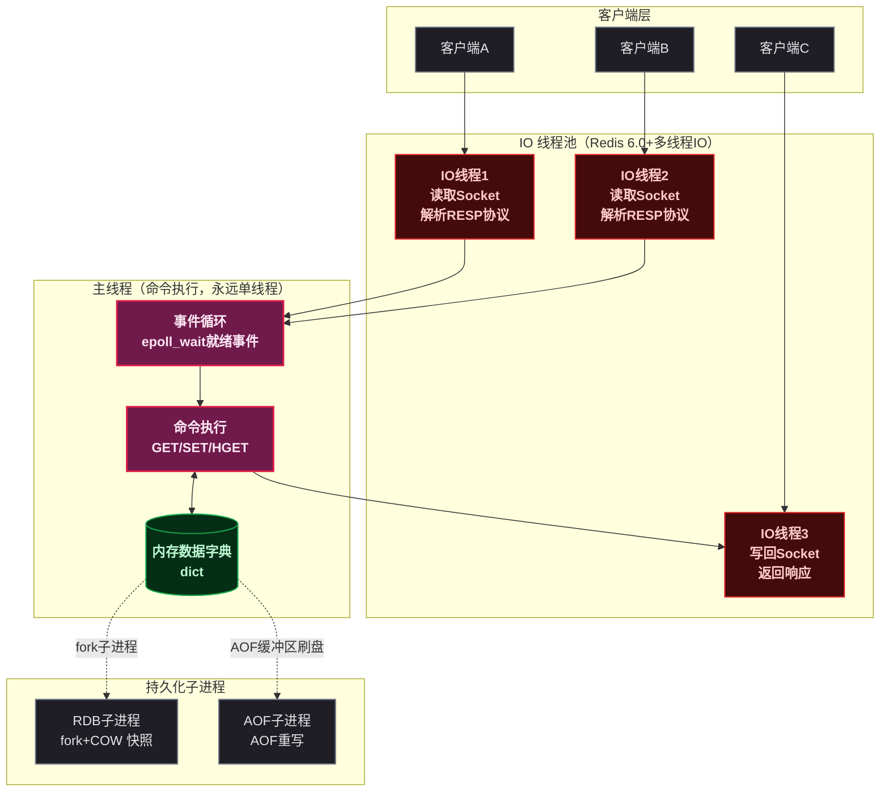
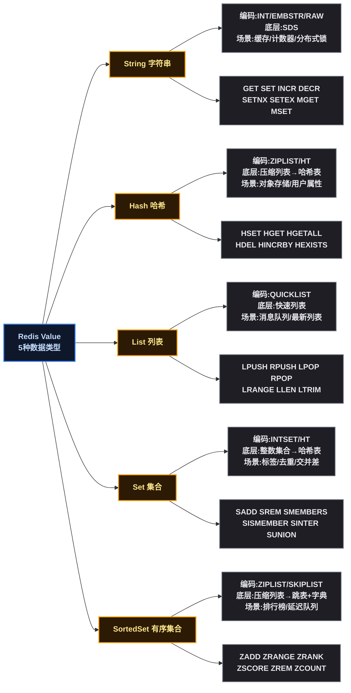
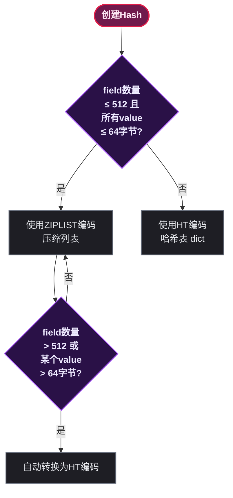
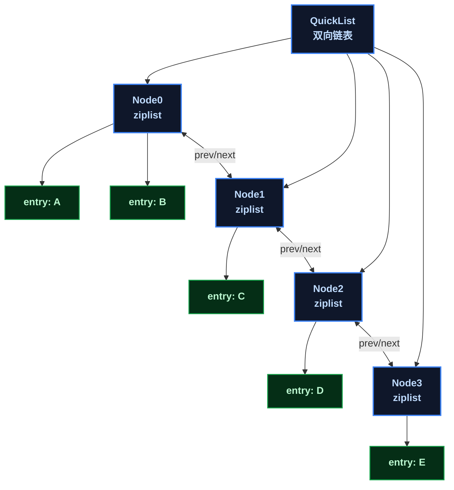
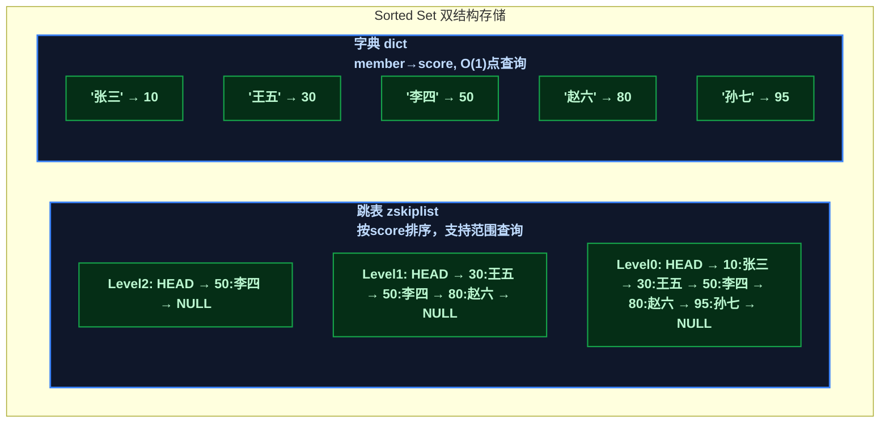
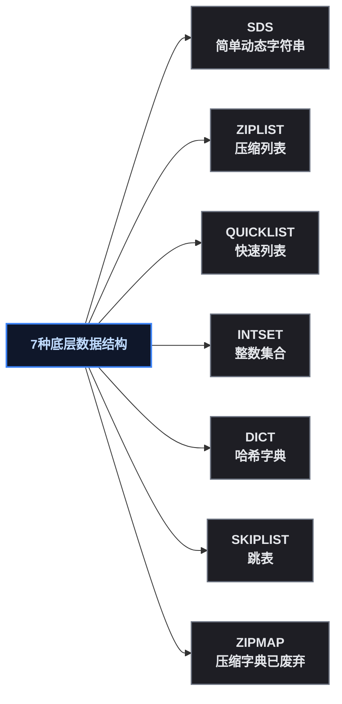
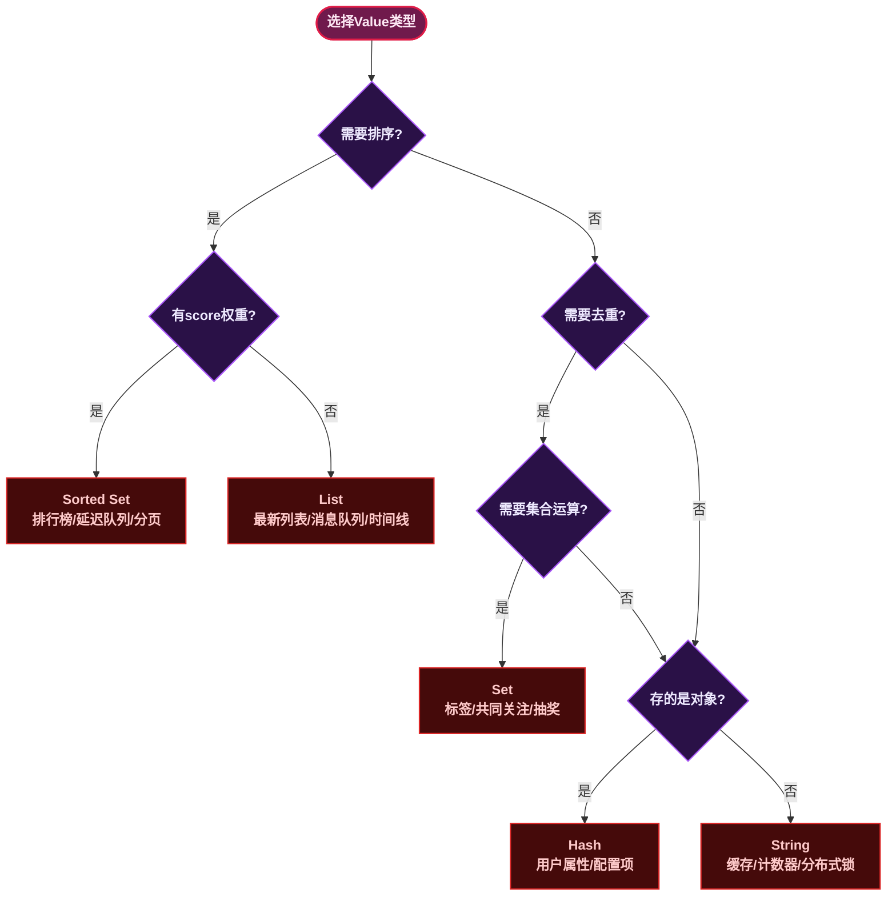

# Redis 核心架构：五大数据结构与常用命令全解析

## 一、⚡ 问题切入：MySQL 为什么不够？

先看一个典型的电商场景。商品详情页的 QPS（每秒请求数）在促销期间达到 5000，每个请求需要执行以下 SQL：

```sql
-- 商品基本信息
SELECT * FROM product WHERE id = 10001;
-- 商品 SKU 列表
SELECT * FROM product_sku WHERE product_id = 10001;
-- 商品评价统计
SELECT COUNT(*), AVG(rating) FROM review WHERE product_id = 10001;
```

MySQL 单机在简单查询下约能支撑 2000 ~ 3000 QPS，5000 QPS 直接打到数据库会导致连接池耗尽、响应超时，最终服务雪崩。

有人会说"加读写分离、分库分表"，但这些方案在数据到达 MySQL 之前就有一个更直接的思路： **把热点数据放在内存里** 。

这就是 Redis 存在的根本原因——将频繁访问的数据从磁盘（MySQL）迁移到内存，用空间换时间。一条 Redis `GET` 命令的延迟通常在 0.1ms 以内，而 MySQL 单条查询即使在索引命中、Buffer Pool 热数据全缓存的情况下，延迟也在 1ms ~ 5ms 之间。差距来自 **存储介质** （内存 vs 磁盘）和 **数据访问路径** （直接内存寻址 vs B+Tree 遍历）。

```bash
# MySQL: 3ms
mysql> SELECT * FROM product WHERE id = 10001;
1 row in set (0.003 sec)

# Redis: 0.05ms
127.0.0.1:6379> GET product:10001
"{\"name\":\"iPhone 15\",\"price\":6999}"
```

50 倍 ~ 100 倍的延迟差距，就是 Redis 作为 **缓存层** 存在的核心价值。

## 二、🧬 Redis 的本质：基于内存的单线程键值数据库

### 2.1 📋 官方定义

Redis（Remote Dictionary Server）是一个 **基于内存的、单线程事件驱动的键值对（Key-Value）存储系统** 。每一个词都是核心特征：

| 特征 | 含义 |
|------|------|
| **基于内存** | 所有数据存在 RAM 中，读写速度达到微秒级。断电丢失，需持久化机制（RDB / AOF）兜底 |
| **单线程** | 所有命令在一个线程中串行执行，天然无竞争条件（race condition），不需要加锁 |
| **事件驱动** | 使用 I/O 多路复用（epoll / kqueue / select）同时监听多个客户端连接，一个线程处理成千上万个并发连接 |
| **键值对** | 数据模型是 Key → Value 的映射。Key 是 String，Value 可以是多种数据结构 |

### 2.2 ⚡ 单线程为什么快？

这是一个容易误解的点。单线程不是"只能同时做一件事所以慢"，而是在 **内存操作足够快** 的前提下，单线程避免了多线程的上下文切换开销和锁竞争开销。Redis 的瓶颈从来不是 CPU，而是 **网络 I/O** 和 **内存带宽** 。

Redis 6.0 之后引入了 **多线程 I/O** ——网络数据的读写交给多个 I/O 线程并行处理，但 **命令执行仍然在单线程中串行** 。读取 socket 缓冲区、解析 RESP 协议这些工作可以由多个线程分担，但 `SET key value` 这个操作本身只在主线程中执行。



### 2.3 📖 内存数据字典：dict

Redis 内部有一个全局的 **dict（哈希字典）** ，存储所有的 Key-Value 对。dict 本质上是一个 **哈希表数组 + 链地址法解决冲突** 的结构。每个键值对在 dict 中以 `dictEntry` 形式存在：

```c
// Redis 源码 src/dict.h
typedef struct dictEntry {
    void *key;                // Key：SDS 字符串
    union {
        void *val;            // Value：redisObject 指针
        uint64_t u64;
        int64_t s64;
        double d;
    } v;
    struct dictEntry *next;   // 链表指针，解决哈希冲突（链地址法）
} dictEntry;

typedef struct dictht {
    dictEntry **table;        // 哈希表数组
    unsigned long size;       // 哈希表大小（始终为2的幂）
    unsigned long sizemask;   // 哈希表大小掩码 = size - 1，用于计算索引
    unsigned long used;       // 已有节点数量
} dictht;

typedef struct dict {
    dictType *type;           // 类型特定函数（哈希函数、key比较等）
    void *privdata;           // 私有数据
    dictht ht[2];             // 两张哈希表，用于渐进式rehash
    long rehashidx;           // rehash进度，-1表示未进行rehash
    int16_t pauserehash;      // rehash暂停计数器
} dict;
```

**关键设计点** ：

- `ht[2]` 两张表：正常用 `ht[0]`，扩容时 `ht[1]` 是新表。Redis 采用 **渐进式 rehash** （Incremental Rehashing），每次对 dict 的增删改查操作顺带搬几个 key 从旧表到新表，避免一次性 rehash 阻塞服务
- `size` 始终为 2 的幂：计算索引时用 `hash & sizemask` 替代 `hash % size`，位运算比取模运算快一个数量级
- `rehashidx`：标记 rehash 进度。`-1` 表示未进行，`0 ~ size-1` 表示正在将 `ht[0]` 的第 `rehashidx` 个槽位迁移到 `ht[1]`

### 2.4 📦 RedisObject：所有 Value 的通用外壳

Redis 中的每个 Value 都被封装在一个 `redisObject` 结构体中：

```c
// Redis 源码 src/server.h
typedef struct redisObject {
    unsigned type:4;       // 数据类型：STRING/LIST/HASH/SET/ZSET（5种）
    unsigned encoding:4;   // 底层编码：INT/EMBSTR/RAW/ZIPLIST/LINKEDLIST/HT/SKIPLIST/INTSET
    unsigned lru:24;       // LRU 时钟，用于淘汰策略（24位存Unix时间戳秒数的低24位）
    int refcount;          // 引用计数，用于内存共享（如小整数0~9999）
    void *ptr;             // 指向实际数据结构的指针
} robj;
```

这个 16 字节的结构体是 Redis 内存模型的核心。`type` 决定用户看到的数据类型，`encoding` 决定底层用什么数据结构存储。两者 **不是一一对应** 的——同一个 `type`（如 Hash）在不同数据量下会使用不同的 `encoding`（ziplist 或 hashtable），这是 Redis 实现内存效率优化的关键手段。

## 三、🔑 Key：不只是"名字"

### 3.1 🧬 Key 的本质

Key 在 Redis 中是一个 **二进制安全的字符串（Binary Safe String）** 。二进制安全意味着 Key 中可以包含任意字节（包括 `\0` 空字符），Redis 不会对其做任何编码转换或截断。Key 最大长度 512MB（实际上没有业务会用这么长的 Key）。

Key 内部使用 **SDS（Simple Dynamic String，简单动态字符串）** 存储：

```c
// Redis 源码 src/sds.h
struct __attribute__ ((__packed__)) sdshdr8 {
    uint8_t len;         // 已使用长度（不含'\0'）
    uint8_t alloc;       // 分配的总长度（不含'\0'头）
    unsigned char flags; // 低3位表示SDS类型（sdshdr5/8/16/32/64）
    char buf[];          // 实际字符串数据，末尾自动追加'\0'兼容C字符串函数
};
```

**SDS 对比 C 原生字符串（`char*`）的优势** ：

| 特性 | C 字符串 `char*` | Redis SDS |
|------|:---:|:---:|
| 获取长度 | `strlen(s)` 遍历 O(n) | 读 `len` 字段 O(1) |
| 二进制安全 | 否，遇 `\0` 截断 | 是，用 `len` 判断结束 |
| 缓冲区溢出 | 容易（`strcat` 无边界检查） | 不会，自动扩容 |
| 内存重分配 | 每次修改都重新分配 | 预分配 + 惰性释放，减少重分配次数 |
| 追加操作复杂度 | O(n)（每次都要 realloc） | 最多 O(n)，预分配策略使均摊接近 O(1) |

### 3.2 📐 Key 命名规范

实际开发中 Key 的命名直接影响可维护性和内存占用：

```bash
# 推荐：业务前缀:标识:子属性，冒号分隔
user:10001:profile
product:5001:stock
order:20240115:seq

# 不推荐：无意义短名、过长、无分隔
u1001
user_profile_info_for_user_id_10001_created_at_2024
user.10001.profile   # 语义不清，用点还是冒号？
```

命名原则： **可读 > 可管理 > 可检索 > 省内存** 。冒号在 Redis 客户端工具中会自动形成树形分组，便于可视化查看。

### 3.3 ⏳ TTL 与过期机制

每个 Key 可以设置 TTL（Time To Live，存活时间），到期后自动删除：

```bash
# 设置 Key 并指定过期时间
SET product:hot:10001 '{"name":"热销商品"}' EX 3600   # 3600秒后过期

# 对已有 Key 设置过期
EXPIRE product:hot:10001 1800   # 重置为1800秒

# 查看剩余存活时间
TTL product:hot:10001   # 返回剩余秒数，-1表示永不过期，-2表示Key不存在

# 移除过期时间（变为永久Key）
PERSIST product:hot:10001
```

Redis 采用 **惰性删除 + 定期删除** 两种策略结合来清理过期 Key：

| 策略 | 触发条件 | 优点 | 缺点 |
|------|---------|------|------|
| **惰性删除** | 访问 Key 时检查是否过期 | 对 CPU 友好 | 过期 Key 未被访问时占用内存 |
| **定期删除** | 每 100ms 随机抽取一批 Key 检查 | 平衡 CPU 和内存 | 每次检查数量和频率需要调优 |

### 3.4 📋 Key 相关常用命令

```bash
# 查找匹配的 Key（生产环境慎用，会阻塞）
KEYS user:*              # 阻塞式遍历，Key多时卡死。仅供调试，生产禁用

# 生产环境用 SCAN 游标式迭代（非阻塞）
SCAN 0 MATCH user:* COUNT 100   # 返回下一游标 + 一批Key，不会阻塞

# 判断 Key 是否存在
EXISTS user:10001        # 返回1存在，0不存在

# 查看 Key 类型
TYPE user:10001          # 返回 string/hash/list/set/zset

# 删除 Key
DEL user:10001           # 同步删除，大Key会阻塞

# 异步删除（Redis 4.0+）
UNLINK user:10001        # 标记删除，后台线程异步释放内存

# 重命名
RENAME user:10001 user:10001:old   # 覆盖式重命名
RENAMENX user:10001 user:10001:old # 仅当目标Key不存在时才重命名
```

## 四、🗺️ Value 五大数据结构全景图



这张图的每一列将在后续章节逐一展开。

## 五、📝 String —— 最基础的类型

### 5.1 ❓ 定义

String 是 Redis 中最基本的 Value 类型，一个 Key 对应一个字符串。但这个"字符串"的含义很宽泛——可以存普通文本、JSON、序列化后的对象、二进制数据（图片、文件），甚至是 **数值** （Redis 会自动识别数字字符串并进行原子加减）。

### 5.2 🔍 底层编码

String 有三种内部编码（encoding），由 Redis 根据值的内容自动选择：

| 编码 | 触发条件 | 内存布局 |
|------|---------|---------|
| `INT` | 值是整数且在 `long` 范围内 | `redisObject.ptr` 直接存整数，不分配额外内存 |
| `EMBSTR` | 值是字符串且长度 ≤ 44 字节 | `redisObject` 和 `SDS` 分配在同一块连续内存中，一次 malloc |
| `RAW` | 值是字符串且长度 > 44 字节 | `redisObject` 和 `SDS` 分别分配内存，两次 malloc |

```bash
# 查看编码
SET count 100
OBJECT ENCODING count   # "int"

SET name "zhangsan"
OBJECT ENCODING name    # "embstr"

SET longtext "这是一段超过44字节的较长文本内容..."
OBJECT ENCODING longtext # "raw"
```

`EMBSTR` 的设计目的是 **减少内存碎片和 malloc 次数** ——小块字符串的 `redisObject`（16 字节）和 `SDS` 一起分配在 64 字节的 jemalloc 内存块中，一次分配一次释放。44 字节的阈值来源于：64（jemalloc 最小块） - 16（redisObject） - 3（SDS header） - 1（`\0`）= 44。

### 5.3 📋 常用命令详解

```bash
# ===== 基础读写 =====
SET key value [EX seconds] [PX milliseconds] [NX|XX]
# EX: 秒级过期  PX: 毫秒级过期
# NX: 仅Key不存在时设置（分布式锁核心）
# XX: 仅Key已存在时设置

GET key                      # 获取值，Key不存在返回nil

# ===== 原子计数器 =====
INCR user:10001:followers    # 自增1，无Key时从0开始→1。原子操作，无竞争
INCRBY product:5001:stock -3 # 自增指定值（负数即自减）
DECR user:10001:followers    # 自减1
INCRBYFLOAT price 0.5       # 浮点自增

# ===== 分布式锁核心 =====
SETNX lock:order:10001 1     # SET if Not eXists，旧式分布式锁（不推荐，无法设过期）
SET lock:order:10001 1 EX 30 NX  # 现代分布式锁：加锁+设过期 原子执行

# ===== 批量操作 =====
MSET user:1:name "张三" user:1:age "25"  # 批量设置，原子操作
MGET user:1:name user:1:age              # 批量获取，减少网络往返

# ===== 其他 =====
STRLEN key                   # 字符串长度
APPEND key "追加内容"        # 追加字符串
GETRANGE key 0 4             # 截取子串
SETEX key 60 "value"         # SET + EXPIRE 原子操作
```

### 5.4 🎯 实际场景

```bash
# 场景1：分布式锁
SET lock:order:10001 "unique-token" EX 30 NX
# ... 执行业务逻辑 ...
# 释放锁时用 Lua 脚本校验 token，防止误删
if redis.call("GET", KEYS[1]) == ARGV[1] then
    return redis.call("DEL", KEYS[1])
else
    return 0
end

# 场景2：文章阅读计数（INCR 原子自增）
INCR article:5001:views      # 每次阅读 +1，高并发下无竞争

# 场景3：缓存 JSON 对象
SET user:10001 '{"id":10001,"name":"张三","age":25}' EX 1800
```

## 六、🗂️ Hash —— 存储对象的首选

### 6.1 ❓ 定义

Hash 类型是一个 **String 类型的 field-value 映射表** ，适合存储对象。一个 Hash Key 下面可以有多个 field（字段），每个 field 有自己的 value。相比把整个对象序列化成 JSON String 存，Hash 可以 **按字段读写** ，减少网络传输。

### 6.2 🔍 底层编码

Hash 有两种底层编码，根据数据量自动切换：



**ZIPLIST（压缩列表）** 是一个连续内存块，结构如下：

```
<zlbytes><zltail><zllen><entry1><entry2>...<entryN><zlend>
```

| 字段 | 大小 | 说明 |
|------|------|------|
| `zlbytes` | 4 字节 | 整个 ziplist 占用的字节数 |
| `zltail` | 4 字节 | 最后一个 entry 的偏移量，用于快速定位尾部 |
| `zllen` | 2 字节 | entry 节点数量（超过 65535 时需遍历获取真实数量） |
| `entry` | 变长 | 数据节点，每个 entry 包含前一个节点长度、编码、数据 |
| `zlend` | 1 字节 | 结束标记 `0xFF` |

**ZIPLIST 的问题** ：每个 entry 记录了前一个 entry 的长度。当某个 entry 内容从 253 字节以下扩容到 254 字节以上时，前一个 entry 的"前节点长度"字段会从 1 字节膨胀到 5 字节，引发 **连锁更新** （Cascade Update）——后续所有 entry 逐一遍历调整，最坏时间复杂度 O(n²)。

因此当 field 数量超过 `hash-max-ziplist-entries`（默认 512）或某个 value 超过 `hash-max-ziplist-value`（默认 64 字节）时，Hash 自动转为 **hashtable（dict）** 编码，即前面 2.3 节介绍的 dict 结构。

### 6.3 📋 常用命令详解

```bash
# ===== 基础读写 =====
HSET user:10001 name "张三" age "25" city "北京"   # 设置多个field
HGET user:10001 name      # 获取单个field值
HMGET user:10001 name age # 批量获取多个field
HGETALL user:10001        # 获取所有field-value（大Key慎用，阻塞）
HKEYS user:10001          # 获取所有field名
HVALS user:10001          # 获取所有value
HLEN user:10001           # field数量

# ===== 存在性判断 =====
HEXISTS user:10001 name   # 判断field是否存在
HDEL user:10001 age       # 删除指定field

# ===== 原子操作 =====
HINCRBY user:10001 login_count 1    # field 值原子自增
HINCRBYFLOAT product:5001 price -0.5 # 浮点自增

# ===== 渐进遍历（大Key用，不阻塞） =====
HSCAN user:10001 0 MATCH * COUNT 100
```

### 6.4 📊 与 String 存储对象的对比

```bash
# 方式一：String 存 JSON
SET user:10001 '{"name":"张三","age":25,"city":"北京"}'
# 修改年龄：需要GET→反序列化→修改→序列化→SET，传输整个JSON

# 方式二：Hash 存字段
HSET user:10001 name "张三" age 25 city "北京"
# 修改年龄：只传一个field
HINCRBY user:10001 age 1   # 甚至可以直接原子自增
```

| 维度 | String (JSON) | Hash |
|------|:---:|:---:|
| 修改单字段 | 需全量读写 | 只传目标 field |
| 原子自增 | 不支持（需读→改→写） | HINCRBY 原子操作 |
| 内存效率 | 整个 JSON 大小 | 每个 field 单独存储 |
| 适用场景 | 整体读写、不改字段 | 频繁改个别字段 |

## 七、📋 List —— 有序可重复的队列

### 7.1 ❓ 定义

List 是一个 **有序、可重复** 的字符串列表。可以在头部（左）或尾部（右）插入、弹出元素。List 的最大长度是 2³² - 1 个元素。

### 7.2 🔍 底层编码：QuickList

Redis 3.2 之前，List 在元素少时用 ziplist、元素多时用 linkedlist（双向链表）。但 linkedlist 内存碎片严重（每个节点独立分配内存），ziplist 又有连锁更新风险。Redis 3.2 引入了 **QuickList（快速列表）** ——一个 **ziplist 组成的双向链表** ：



**设计思想** ：每个 ziplist 节点存多个元素，节点之间用双向指针连接。这样既减少了 linkedlist 的节点指针开销（每个指针 8 字节 × 2 方向），又控制了单个 ziplist 的大小（默认每个节点最多 8KB），避免了连锁更新的极端影响。

配置参数：
```
list-max-ziplist-size  -2   # -2表示每个节点8KB，-1表示4KB
list-compress-depth    0     # 0=不压缩，1=两端各1个节点不压缩中间全压缩...
```

### 7.3 📋 常用命令详解

```bash
# ===== 两端压入/弹出 =====
LPUSH queue:tasks "task1" "task2"   # 左侧压入，返回列表长度
RPUSH queue:tasks "task3"           # 右侧压入
LPOP queue:tasks                    # 左侧弹出（FIFO队列）
RPOP queue:tasks                    # 右侧弹出（栈）

# ===== 阻塞弹出（消息队列核心） =====
BLPOP queue:tasks 10                # 左侧阻塞弹出，等待最多10秒
BRPOP queue:tasks 0                 # 右侧阻塞弹出，0=永久等待

# ===== 范围操作 =====
LRANGE queue:tasks 0 -1             # 获取所有元素（-1=最后一个）
LRANGE queue:tasks 0 9              # 获取前10个
LINDEX queue:tasks 0                # 按下标获取元素（O(n)，慎用）
LLEN queue:tasks                    # 列表长度

# ===== 修剪/移除 =====
LTRIM queue:tasks 0 99              # 只保留前100个元素
LREM queue:tasks 0 "task1"          # 移除所有值为"task1"的元素
```

### 7.4 🎯 实际场景

```bash
# 场景1：简单消息队列（FIFO）
# 生产者
RPUSH mq:order:pending '{"orderId":10001}'
# 消费者
BLPOP mq:order:pending 30   # 阻塞等待30秒

# 场景2：最新动态列表（修剪防止无限增长）
LPUSH feed:user:10001 "动态内容1"
LPUSH feed:user:10001 "动态内容2"
LTRIM feed:user:10001 0 99   # 只保留最近100条

# 场景3：栈（LIFO 后进先出）
LPUSH stack:tasks "task1"
LPUSH stack:tasks "task2"
LPOP stack:tasks   # 弹出"task2"
```

## 八、🎯 Set —— 无序不重复的集合

### 8.1 ❓ 定义

Set 是一个 **无序、不重复** 的字符串集合。核心操作是判断元素是否存在（`SISMEMBER`）和集合间运算（交/并/差集）。

### 8.2 🔍 底层编码

Set 也有两种编码，自动切换：

| 编码 | 触发条件 | 底层数据结构 |
|------|---------|------------|
| `INTSET` | 所有元素都是整数 且 元素数 ≤ 512 | 整数集合（有序数组） |
| `HT` | 存在非整数元素 或 元素数 > 512 | 哈希表 dict（value 全为 NULL） |

**INTSET（整数集合）** 是一个紧凑的整数有序数组：

```c
// Redis 源码 src/intset.h
typedef struct intset {
    uint32_t encoding;  // 编码格式：INTSET_ENC_INT16/INT32/INT64
    uint32_t length;    // 元素个数
    int8_t contents[];  // 实际数据，按编码类型存储
} intset;
```

当插入一个超出当前编码范围的整数时（如原为 INT16，插入了一个 32768），整个 intset 会 **升级编码** （如 INT16 → INT32），所有元素重新分配内存。编码升级是 **不可逆** 的，降回不会自动降级。

### 8.3 📋 常用命令详解

```bash
# ===== 基础操作 =====
SADD tags:article:5001 "Redis" "缓存" "数据库"   # 添加元素
SREM tags:article:5001 "数据库"                  # 移除元素
SMEMBERS tags:article:5001                        # 获取所有元素
SISMEMBER tags:article:5001 "Redis"               # 判断元素是否存在 O(1)
SCARD tags:article:5001                           # 元素个数

# ===== 集合运算（核心价值） =====
SINTER tags:article:5001 tags:article:5002        # 交集：两篇文章共同的标签
SUNION tags:article:5001 tags:article:5002        # 并集：两篇文章标签的合集
SDIFF tags:article:5001 tags:article:5002         # 差集：文章1有但文章2没有的标签

# 运算结果可存入新集合
SINTERSTORE common:tags tags:article:5001 tags:article:5002

# ===== 随机操作 =====
SRANDMEMBER users:online 3     # 随机取3个元素（不删除）
SPOP users:online 3            # 随机弹出3个元素（删除）
```

### 8.4 🎯 实际场景

```bash
# 场景1：文章标签
SADD article:5001:tags "Redis" "缓存" "后端"
# 查询同时有"Redis"和"缓存"标签的文章
SINTER article:5001:tags article:5002:tags

# 场景2：共同关注
SADD user:10001:following "20001" "20002" "20003"
SADD user:10002:following "20001" "20003" "20005"
# 查询两人的共同关注
SINTER user:10001:following user:10002:following  # 返回 ["20001","20003"]

# 场景3：抽奖（随机弹出）
SPOP lottery:pool 1   # 随机弹出一个中奖用户

# 场景4：UV 去重（独立访客统计）
SADD uv:20240115 "192.168.1.100"
SADD uv:20240115 "192.168.1.101"
SCARD uv:20240115     # 今日UV数
```

## 九、📊 Sorted Set —— 带权重的有序集合

### 9.1 ❓ 定义

Sorted Set（有序集合，简称 ZSet）是 Redis 中最复杂也最强大的数据类型。它在 Set 的基础上给每个元素（member）绑定了一个 **分值（score）** ，所有 member 按 score 从小到大排序。score 可以是重复的，但 member 必须唯一。

### 9.2 🔍 底层编码

ZSet 同样有两种编码，自动切换：

| 编码 | 触发条件 | 底层数据结构 |
|------|---------|------------|
| `ZIPLIST` | 元素数 ≤ 128 且 所有 member ≤ 64 字节 | 压缩列表 |
| `SKIPLIST` | 元素数 > 128 或 有 member > 64 字节 | 跳表（skiplist）+ 字典（dict）双结构 |

SKIPLIST 编码下，ZSet 使用 **两套数据结构维护同一份数据** ：



**为什么用跳表而不是红黑树？** 跳表（Skip List）是一种 **多层有序链表** ，通过在每个节点随机生成层数（level）实现 O(log n) 的查找。Redis 选择跳表的原因：

1. **跳表的范围查询（ZRANGE）是 O(log n + m）** ，m 是返回元素数——找到起点后顺序遍历即可。红黑树需要中序遍历，代码更复杂
2. **跳表实现更简单** ，代码量少，容易维护和调试
3. **跳表天然适合范围操作** ，链表结构使范围查询只需向后遍历

跳表节点结构：

```c
// Redis 源码 src/server.h
typedef struct zskiplistNode {
    sds ele;                            // member（SDS 字符串）
    double score;                       // 分值
    struct zskiplistNode *backward;     // 后退指针（用于逆序范围查询）
    struct zskiplistLevel {
        struct zskiplistNode *forward;  // 前进指针
        unsigned long span;            // 跨度：本节点到下一个同层节点间跨越的节点数
    } level[];                          // 柔性数组，每个节点的层数随机生成（1~32）
} zskiplistNode;

typedef struct zskiplist {
    struct zskiplistNode *header, *tail; // 头尾节点
    unsigned long length;               // 节点总数
    int level;                          // 当前最大层数
} zskiplist;
```

**`span` 字段的作用** ：记录每一层上本节点到下一个节点"跨越"了几个 Level0 节点。`ZRANK` 命令（查排名）只需在查找过程中累加 `span` 值即可得到元素排名，O(log n)。

### 9.3 📋 常用命令详解

```bash
# ===== 添加/移除 =====
ZADD leaderboard 100 "张三" 95 "李四" 88 "王五"   # 添加member和score
ZADD leaderboard NX 90 "张三"                      # NX: 仅新增，不更新已有
ZADD leaderboard XX CH INCR 5 "张三"                # XX: 仅更新已有
ZREM leaderboard "王五"                             # 移除member

# ===== 查询 =====
ZRANGE leaderboard 0 -1                            # 按score升序返回所有member
ZRANGE leaderboard 0 -1 WITHSCORES                 # 带score一起返回
ZREVRANGE leaderboard 0 9                          # 按score降序返回前10
ZRANK leaderboard "张三"                           # 获取排名（升序，从0开始）
ZREVRANK leaderboard "张三"                        # 获取排名（降序）
ZSCORE leaderboard "张三"                          # 获取score
ZCOUNT leaderboard 80 100                          # 统计score在80~100之间的数量

# ===== 范围操作（按score） =====
ZRANGEBYSCORE leaderboard 80 100                   # 按score范围查询
ZREMRANGEBYRANK leaderboard 0 9                    # 按排名删除
ZREMRANGEBYSCORE leaderboard 0 60                  # 按score范围删除

# ===== 原子增量 =====
ZINCRBY leaderboard 5 "张三"                        # score原子增加5

# ===== 集合运算 =====
ZINTERSTORE result 2 set1 set2 WEIGHTS 1 2         # 交集，set2的score×2
ZUNIONSTORE result 2 set1 set2 AGGREGATE MAX       # 并集，相同member取最大score
```

### 9.4 🎯 实际场景

```bash
# 场景1：实时排行榜
ZADD game:rank 1500 "player:A" 1480 "player:B"
ZINCRBY game:rank 20 "player:A"                  # 加分
ZREVRANGE game:rank 0 9 WITHSCORES               # Top10

# 场景2：延迟队列（按时间戳排序）
# score = 任务执行时间的Unix时间戳
ZADD delay:queue 1705312800 "task:order:10001"   # 预定1月15日12:00执行
ZADD delay:queue 1705312860 "task:order:10002"   # 预定1月15日12:01执行
# 消费者定期取出到期的任务（score ≤ 当前时间戳）
ZRANGEBYSCORE delay:queue 0 1705312800 LIMIT 0 10

# 场景3：分页查询（按score排序）
ZADD posts:hot 1560 "post:5001"
ZADD posts:hot 1480 "post:5002"
ZREVRANGE posts:hot 0 9 WITHSCORES               # 热门文章第一页
ZREVRANGE posts:hot 10 19 WITHSCORES             # 热门文章第二页
```

## 十、🗺️ 底层数据结构总览

Redis 的 5 种 Value 类型之下，实际复用了 7 种底层数据结构：



| 底层结构 | 被哪些 Value 类型使用 | 核心特点 | 适用场景 |
|---------|---------------------|---------|---------|
| **SDS** | String | 二进制安全、O(1) 取长度、预分配防溢出 | 所有 String 操作 |
| **ZIPLIST** | Hash、ZSet（小数据） | 连续内存、省内存、但连锁更新风险 | 小数据量时的 Hash、ZSet |
| **QUICKLIST** | List | ziplist 组成的双向链表，平衡内存与性能 | 所有 List 操作 |
| **INTSET** | Set（纯整数小集合） | 有序整数数组、二分查找、编码自动升级 | 纯整数的小规模 Set |
| **DICT** | Hash、Set、ZSet（大数据），全局键空间 | O(1) 查找、渐进式 rehash | 大数据量 Hash/Set、所有 Key |
| **SKIPLIST** | ZSet（大数据） | 多层有序链表、O(log n) 范围查询 | 排行榜、延迟队列 |

## 十一、📋 通用命令速查

以下命令不限于特定 Value 类型，全局可用：

| 命令 | 用途 | 频率 |
|------|------|:--:|
| `KEYS pattern` | 按模式匹配查找 Key（生产禁用） | 低（仅调试） |
| `SCAN cursor MATCH pattern COUNT n` | 非阻塞游标迭代 Key | 中 |
| `EXISTS key` | 判断 Key 是否存在 | 高 |
| `TYPE key` | 查看 Key 的 Value 类型 | 中 |
| `DEL key` | 同步删除 Key（大 Key 会阻塞） | 高 |
| `UNLINK key` | 异步删除 Key（Redis 4.0+） | 高 |
| `EXPIRE key seconds` | 设置 Key 过期时间 | 高 |
| `TTL key` | 查看 Key 剩余存活时间 | 高 |
| `PERSIST key` | 移除 Key 过期时间 | 中 |
| `RENAME key newkey` | 重命名 Key | 低 |
| `DUMP key` / `RESTORE key ttl value` | 序列化/反序列化 Key | 低 |
| `OBJECT ENCODING key` | 查看 Value 底层编码 | 低（调试用） |
| `INFO memory` | 查看 Redis 内存使用情况 | 中 |

## 十二、🌳 数据类型选择决策树



## 十三、🎯 总结

本文从 Redis 的 **单线程事件驱动架构** 出发，逐层拆解了 Key 的 SDS 实现、Value 的五大数据类型及其底层数据结构切换机制：

1. **String** ：最基础，底层 SDS 三种编码（INT/EMBSTR/RAW）。核心场景是缓存、计数器、分布式锁。`INCR` 的原子性来自单线程模型。

2. **Hash** ：存对象的最优选择。小数据用 ZIPLIST 省内存，大数据自动转 DICT。`HINCRBY` 支持字段级原子自增。

3. **List** ：底层 QUICKLIST = ziplist 组成的双向链表。`BLPOP`/`BRPOP` 的阻塞弹出是简单消息队列的基础。

4. **Set** ：去重 + 集合运算。小规模纯整数用 INTSET 紧凑存储，其他用 DICT。`SINTER`/`SUNION`/`SDIFF` 是社交关系的核心运算。

5. **Sorted Set** ：最复杂也最强大。大数据下 SKIPLIST + DICT 双结构，跳表提供 O(log n) 的范围查询和排名计算。排行榜、延迟队列、分页查询的首选。

理解 Redis 的关键不是记住每个命令，而是理解 " **什么场景下用哪种 Value 类型，以及为什么这种类型的底层编码会随数据规模自动切换** "。这才是 Redis 高性能、低内存占用的根源。

> 📖 <strong>下一步阅读</strong>：掌握了 Redis 的核心概念和命令后，下一步是在 SpringBoot 项目中实际使用它们。继续阅读 [<strong>SpringBoot Redis 全操作指南</strong>]()，一篇覆盖 RedisTemplate / Spring Cache / Redisson / Pipeline 的完整实战教程。
