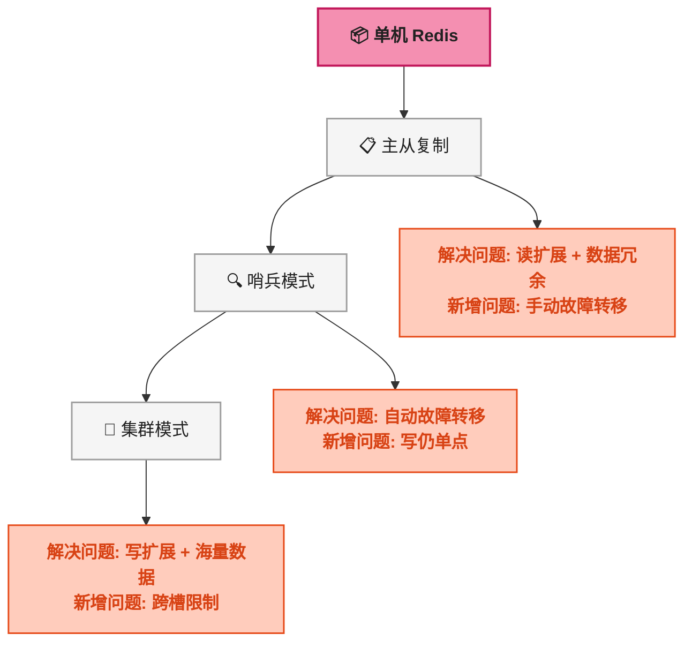
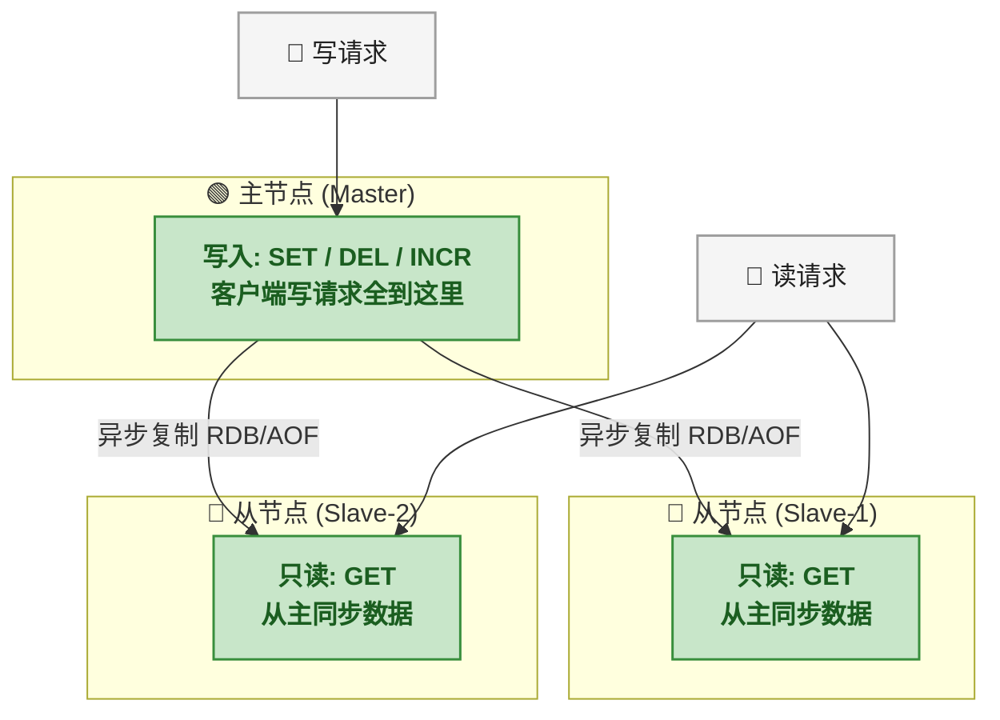
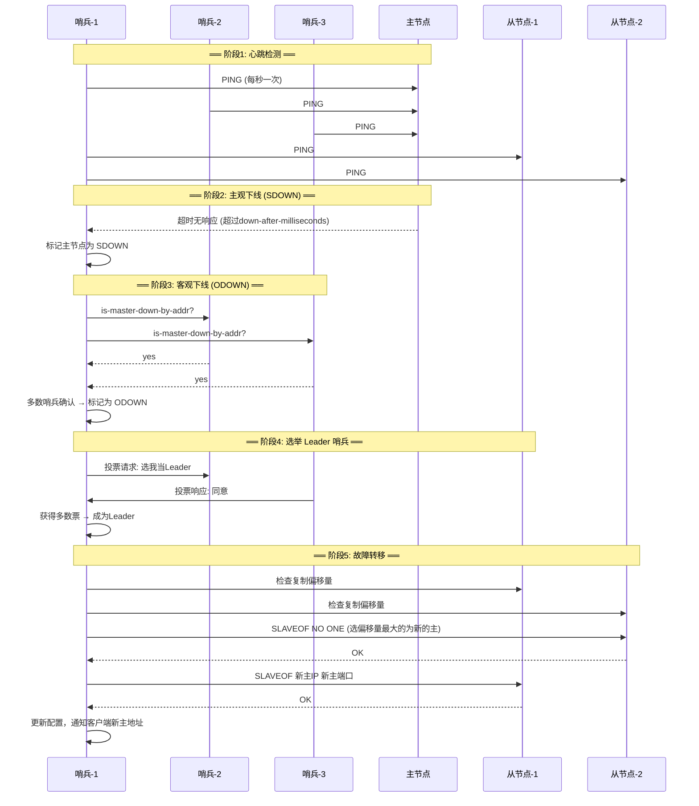
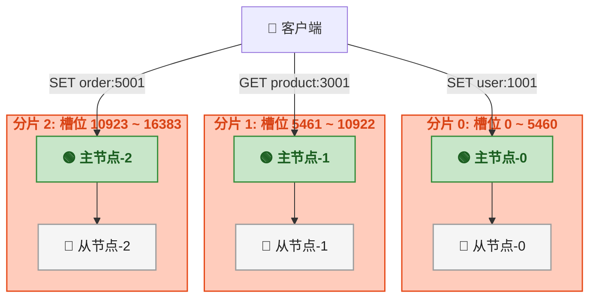
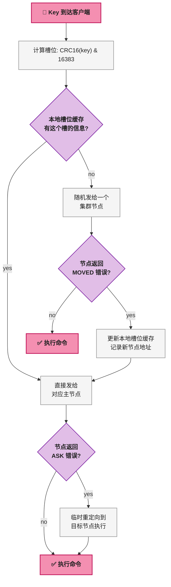
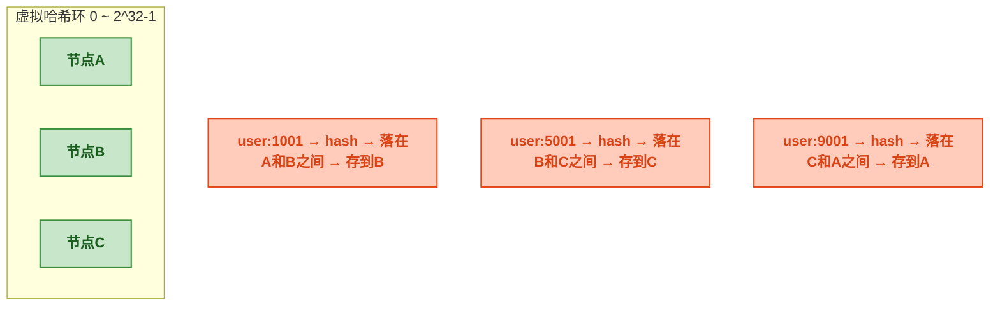
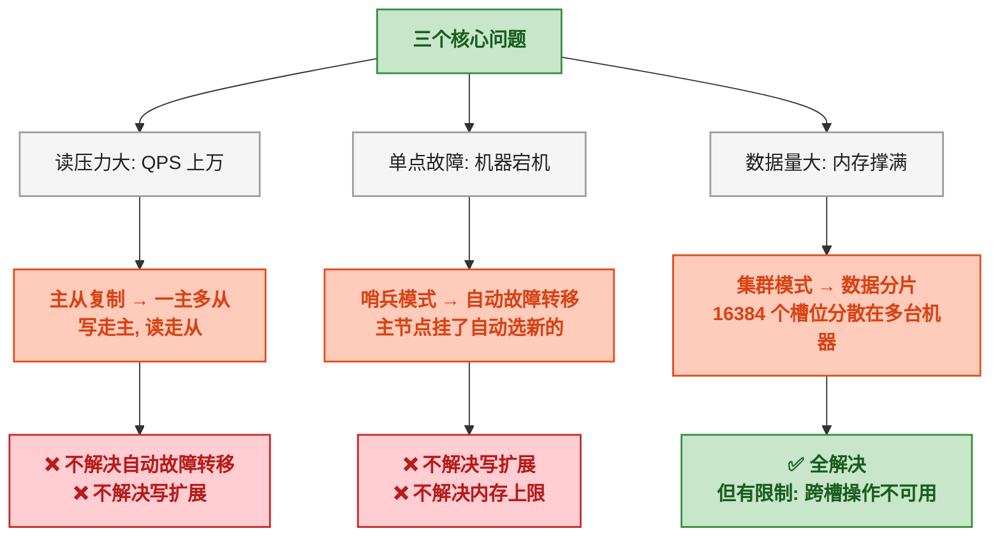

# Redis 高可用架构：主从、哨兵、集群与分片

## 一、问题切入：单机 Redis 能走多远

开发环境启动一个 Redis 实例，`redis-cli` 连上去，`SET` / `GET` 一切正常。然后某天线上出了问题：

- 促销活动期间，Redis 内存飙到 32GB 上限，新的写入被拒绝
- 服务器宕机，缓存全丢，所有请求直接穿透到 MySQL，服务雪崩
- 同一个 Key 被几百个并发请求同时修改，客户端频繁收到 `READONLY` 错误

这些问题指向同一个根因：<strong>单机 Redis 有三个硬伤</strong>。

| 硬伤 | 表现 | 后果 |
|------|------|------|
| <strong>内存上限</strong> | 一台机器最多几百 GB 内存，存不下全量数据 | 频繁淘汰 / OOM |
| <strong>单点故障</strong> | 进程挂掉 → 整个缓存层不可用 | 请求穿透到 DB，服务雪崩 |
| <strong>写吞吐瓶颈</strong> | 单机只能处理几万 QPS 的写入，核心在主线程串行执行 | 促销期间扛不住 |

Redis 为了解决这三个问题，依次演进出了三种架构模式——<strong>主从复制、哨兵模式、集群模式</strong>。理解这三者之间的关系，是开发者对接云 Redis 服务的前提。



<strong>这张演进路线图的含义</strong>：后一层架构不是替代前一层，而是叠加。集群模式内置了主从复制和哨兵的部分能力，但三者解决的问题域并不完全相同。下面逐一展开。

> ⚠️ 新手提示：如果你用的是阿里云 Redis / AWS ElastiCache / 腾讯云 Redis，三个模式都是下拉菜单里的选项，选一个就行。本文目的不是教怎么搭——是教你<strong>选哪个、为什么、出了问题怎么看</strong>。

---

## 二、主从复制：读扩展和数据冗余

### 2.1 解决了什么问题

单机 Redis 挂了，数据全没。主从复制的核心思想是<strong>一台写（主节点），多台读（从节点），数据从主异步同步到从</strong>。



### 2.2 主从复制的过程

主从复制分两个阶段：<strong>全量同步</strong>和<strong>增量同步</strong>。

| 阶段 | 触发条件 | 做了什么 | 对业务的影响 |
|------|----------|----------|:---:|
| <strong>全量同步</strong> | 从节点首次连接 / 复制偏移量差距过大 | 主节点执行 `BGSAVE` 生成 RDB 快照 → 发送给从节点 → 从节点清空自身数据 → 加载 RDB → 主节点再把积压缓冲区里的后续写命令发给从节点 | 主节点 fork 子进程生成 RDB，CPU 和内存开销较大，从节点加载 RDB 期间不可读 |
| <strong>增量同步</strong> | 全量同步完成后 | 主节点每执行一条写命令，就把命令同时发给所有从节点。从节点执行同样的命令，保持数据一致 | 主节点的写操作有额外的网络带宽开销 |

整个过程在 Redis 内部通过以下几个关键字段来追踪状态：

| 字段 | 位置 | 含义 |
|------|------|------|
| `replid` | 主节点生成 | 复制 ID，标识一次复制会话。主从实例的 `replid` 相同说明属于同一次复制 |
| `repl_offset` | 主节点维护 | 复制偏移量，主节点每发送 N 字节数据就 +N |
| `repl_backlog` | 主节点维护 | 复制积压缓冲区，环形的固定大小队列，存最近的写命令。从节点断开后重连，如果偏移量还在 backlog 范围内，可以增量同步而不用全量 |

可以用 `INFO replication` 命令查看主从状态：

```bash
# 在主节点执行
redis-cli INFO replication
# role:master
# connected_slaves:2
# master_replid:8371445c8d...
# master_repl_offset:4826193
# repl_backlog_active:1
# repl_backlog_size:1048576

# 在从节点执行
redis-cli INFO replication
# role:slave
# master_host:192.168.1.100
# master_port:6379
# master_link_status:up           ← 关键：up = 连接正常，down = 断了
# slave_repl_offset:4826150
```

### 2.3 开发必须知道的三件事

<strong>① 从节点默认只读</strong>

从节点默认 `slave-read-only yes`，写操作会返回 `READONLY You can't write against a read only replica`。如果代码里不小心把写请求路由到了从节点，就会看到这个错误。

<strong>② 主从延迟是常态</strong>

异步复制意味着从节点的数据永远比主节点慢一点——通常是毫秒级，网络抖动时可能到秒级。这意味着<strong>刚写入主节点后立刻去从节点读，可能读不到最新数据</strong>。

常见的处理方式有两种：
- <strong>强制走主库</strong>：写入后的关键读操作（如订单支付后立刻查订单状态）走主节点
- <strong>能接受延迟</strong>：大部分读操作（如商品详情、用户信息）走从节点，几十毫秒的延迟不影响用户体验

<strong>③ 主节点挂了怎么办</strong>

主从复制本身<strong>不处理自动故障转移</strong>。主节点宕机后，从节点还是从节点，不会自动升级为主节点。手动操作的方式是执行 `SLAVEOF NO ONE` 将一个从节点提升为主节点，然后改代码里的连接地址。

这显然不现实——于是有了哨兵。

> ⚠️ 新手提示：Spring Boot 配置里 `spring.redis.host` 只能填一个地址。如果用了主从架构但不配哨兵，需要自己写一个读写分离的数据源路由，否则所有请求都打到一个节点上。如果不想折腾，<strong>直接用云服务的哨兵版，连 sentinel 地址就行</strong>。

---

## 三、哨兵模式：自动故障转移

### 3.1 解决了什么问题

主从复制能做到读扩展和数据冗余，但主节点挂掉之后需要人工介入。哨兵（Sentinel）在<strong>主从复制之上</strong>叠加了自动故障转移能力——主节点宕机后，哨兵自动选一个从节点提升为新主节点，并把新主节点的地址通知给客户端。

> 📌 前置知识：哨兵<strong>不是独立的存储服务</strong>。它本身不存业务数据，只是若干个哨兵进程，持续监控主从节点的健康状态。哨兵节点通常部署 3 ~ 5 个（奇数个），以便在多数派投票中达成一致。

### 3.2 哨兵如何发现并处理主节点故障



哨兵判断故障要经过<strong>两个关键状态</strong>：

| 状态 | 全称 | 含义 | 触发条件 |
|------|------|------|----------|
| <strong>SDOWN</strong> | Subjective Down（主观下线） | 单个哨兵认为节点挂了 | 该哨兵的 PING 超时（`down-after-milliseconds`，默认 30 秒） |
| <strong>ODOWN</strong> | Objective Down（客观下线） | 多数哨兵都认为节点挂了 | `quorum` 个哨兵（通常设为 N/2+1）都报告 SDOWN |

<strong>只有主节点才会进入 ODOWN 判断</strong>。从节点挂了最多是 SDOWN，哨兵不会为它发起故障转移——因为从节点挂了不影响写入。

选择新主节点的优先级：

```
1. 排除不健康的从节点（断连超过 down-after-milliseconds * 10）
2. 选 replica-priority 最小的（数字越小优先级越高，0 = 永远不选为主）
3. 选复制偏移量最大的（数据最新）
4. 选 runid 最小的（runid 是 Redis 实例启动时生成的随机 ID，取最小作为最终裁决）
```

### 3.3 开发必须知道的三件事

<strong>① 客户端怎么知道新主节点是谁</strong>

Java 客户端（Jedis / Lettuce）连接哨兵时，<strong>不是直连 Redis 节点，而是连哨兵</strong>。哨兵告诉客户端当前主节点地址，主节点切换后哨兵会推送新地址。Spring Boot 配置中把 `spring.redis.host` 换成 `spring.redis.sentinel`：

```yaml
spring:
  redis:
    sentinel:
      master: mymaster              # 哨兵监控的主节点名称
      nodes:
        - 192.168.1.10:26379
        - 192.168.1.11:26379
        - 192.168.1.12:26379
```

<strong>② 主从切换期间的写入会失败</strong>

从 ODOWN 判定到新主节点就绪，这个过程大约需要 10 ~ 30 秒。这期间写入操作会失败。开发侧不建议在代码里死循环重试——建议用<strong>快速失败 + 上层重试</strong>（如消息队列补偿）。

<strong>③ 哨兵本身也可能挂</strong>

哨兵挂了 1 个没关系（还有 2 个能形成多数派）。挂了 2 个就糟了——只剩 1 个哨兵无法形成多数派，无法判定 ODOWN，故障转移就卡住了。这也是为什么生产环境哨兵至少部署 3 个，且分布在不同物理机上。

> ⚠️ 新手提示：云厂商的哨兵版 Redis 通常对外暴露的就是哨兵地址，读写分离和故障转移对客户端透明。开发只需要知道<strong>故障转移期间会有短暂的写入不可用</strong>，做好重试和降级就行。

---

## 四、集群模式：解决写扩展和海量数据

### 4.1 主从和哨兵解决不了的问题

哨兵解决了自动故障转移，但有一个根深蒂固的问题没解决：<strong>写入只能走主节点，只有一个主节点</strong>。单机的写入吞吐和内存容量是有上限的——哪怕从节点加到 10 个，写入还是只能靠那一台主节点。

集群模式（Redis Cluster）的核心思路是<strong>把数据拆到多台机器上，每台机器只负责一部分数据</strong>——这就是分片（Sharding）。每个分片内部可以有自己的一主多从，相当于多个小的主从架构拼在一起。



### 4.2 槽位机制：一个 Key 怎么决定去哪个节点

集群模式把整个键空间分成了 <strong>16384 个槽位（Slots）</strong>。每个主节点负责一部分槽位。一个 Key 来了之后，通过以下算法决定它属于哪个槽：

```
槽位编号 = CRC16(key) & 16383
```

也就是对 Key 做 CRC16 校验和，然后取模 16384。`CRC16` 是一种循环冗余校验算法（Cyclic Redundancy Check），比 MD5/SHA1 快得多，适合对每个 Key 做实时哈希计算。

> ⚠️ 新手提示：如果 Key 包含 `{}`（哈希标签，Hash Tag），则只对 `{}` 中间的部分做 CRC16。比如 `order:{1001}:status` 和 `order:{1001}:amount` 会落在同一个槽——因为只计算 `1001` 的 CRC16。这是把相关 Key 约束在同一个分片上的重要技巧。

具体路由过程：



两个关键错误的区别：

| 错误 | 全称 | 含义 | 客户端行为 |
|------|------|------|-----------|
| <strong>MOVED</strong> | 槽位永久迁移 | "这个槽我已经不管了，移到了节点 X" | 更新本地槽位表，以后直接发给新节点 |
| <strong>ASK</strong> | 槽位正在迁移中 | "这个槽正在迁移，这条 Key 暂时在节点 X" | 仅对本次请求重定向，不更新槽位表 |

> 📌 前置知识：MOVED 和 ASK 的差异源于集群的<strong>在线扩容机制</strong>。Redis Cluster 支持在不停止服务的情况下增加或删除节点，槽位数据会从旧节点逐步迁移到新节点。迁移过程中，单个槽位的部分 Key 还在旧节点，部分已经到了新节点——这时就会出现 ASK 重定向。

### 4.3 集群模式的限制

不是所有 Redis 命令在集群模式下都能用。<strong>核心限制：跨 Key 的操作必须保证所有 Key 在同一个槽位</strong>。

| 能不能用 | 示例 | 原因 |
|:---:|------|------|
| ✅ 能用 | `GET user:1001` | 单 Key 操作，直接路由到对应分片 |
| ✅ 能用 | `MSET order:{1001}:status paid order:{1001}:amount 99` | 用 `{}` 确保同一个槽 |
| ❌ 不能用 | `MSET user:1 Zhang user:2 Li` | 两个 Key 可能在不同分片上，`MSET` 要求原子性 |
| ❌ 不能用 | `SUNION user:tags:1 user:tags:2` | 两个 Set 的 Key 不在同一个分片 |
| ❌ 不能用 | `KEYS *` | 扫描全部分片再合并——数据量大时慢到怀疑人生 |
| ❌ 不能用 | 事务 `MULTI/EXEC` 跨槽 | 事务操作的 Key 必须在同一个分片 |

<strong>生产上最常踩的坑是事务和 Lua 脚本</strong>：写了一个 Lua 脚本操作两个 Key，单机模式下完全正常，一切到集群模式直接报错 `CROSSSLOT Keys in request don't hash to the same slot`。

<strong>解决方法</strong>：把相关的 Key 用 `{}` 约束到同一个哈希标签内。比如用 `{userId}` 作为标签，同一个用户的所有相关 Key 都在同一个分片上。

### 4.4 集群内的故障转移

集群模式的每个分片内部自带<strong>主从 + 故障转移</strong>——不需要额外部署哨兵。集群节点之间通过 Gossip 协议互相通信，某个分片的主节点宕机后，该分片的从节点会自动发起选举，成为新主节点。

<strong>Gossip 协议的核心思想</strong>：每个节点定期随机选几个其他节点发送自己知道的信息（节点列表、槽位分配、节点状态），收到消息的节点再随机传播给其他节点。和哨兵的集中式监控（所有哨兵盯着所有节点）不同，Gossip 是去中心化的，适合集群节点数量大（比如几十个节点）的场景。

---

## 五、分布式分片键：数据怎么分布才能均匀

### 5.1 槽位计算的局限性

Redis Cluster 内置的 `CRC16(key) & 16383` 算法很高效，但有三个缺陷：

1. <strong>热点 Key 无法分散</strong>：如果 `hot:item` 这个 Key 被几百万请求同时访问，它始终只能在一个分片上——即使有 32 个分片，压力也只落在 1 个分片上。
2. <strong>大 Key 无法拆分</strong>：一个 Hash 里存了几百万个字段，`HGETALL` 直接阻塞整个分片。集群的槽位机制帮不了这种场景。
3. <strong>数据倾斜不可控</strong>：CRC16 的分布理论上是均匀的，但业务 Key 的分布不一定均匀。比如 Key 是 `order:20240101:xxx`，所有订单都落在同一天的 Key 前缀下，CRC16 不会集中，但如果某些 Key 天然访问频率更高（如热卖商品），就无法避免倾斜。

### 5.2 业务层的分片策略

当 Redis Cluster 内置的槽位分配不够精准时，可以在<strong>业务层自己做分片</strong>——也就是不止依赖一个 Redis Cluster 端点，而是维护多个 Redis 实例，由业务代码决定数据放在哪个实例。

| 策略 | 做法 | 适用场景 | 缺点 |
|------|------|----------|------|
| <strong>哈希取模</strong> | `hash(key) % N` | Key 分布均匀，实例数量固定 | 加机器时数据全部重新分布 |
| <strong>一致性哈希</strong> | Key 映射到哈希环，顺时针找最近节点 | 实例数量会变化 | 实现复杂，节点较少时分布不均 |
| <strong>按业务维度分片</strong> | 用户 ID 尾号 / 地区 / 业务线 | 业务天然有隔离边界 | 某类业务数据量暴增时单分片撑不住 |
| <strong>范围分片</strong> | 0 ~ 1000 在实例 A，1001 ~ 2000 在实例 B | 按时间范围归档的场景 | 容易出现冷热不均 |

一致性哈希的环状结构：



一致性哈希的好处是<strong>加节点时只需要迁移一小部分数据</strong>（原本落在新节点范围的数据），不需要全部重新分布。但目前 Redis Cluster 内置的 16384 槽位架构已经足够大部分业务场景，业务层额外做分片的复杂度较高，建议先评估是否真的需要。

### 5.3 开发侧怎么对接

如果用的是云 Redis 集群版，JDK 客户端（Lettuce）会自动处理槽位路由和 MOVED/ASK 重定向——只需要把 `spring.redis.cluster.nodes` 配好：

```yaml
spring:
  redis:
    cluster:
      nodes:
        - 192.168.1.10:6379
        - 192.168.1.11:6379
        - 192.168.1.12:6379
```

如果用的是<strong>代理模式</strong>（云厂商如阿里云的 Proxy 架构），上面加了一层代理——客户端连的是代理地址，代理帮做路由——代码里完全不需要感知槽位，当单机 Redis 用就行。

---

## 六、总结：三种架构对照



| 维度 | 主从复制 | 哨兵模式 | 集群模式 |
|------|:---:|:---:|:---:|
| <strong>解决什么问题</strong> | 读扩展 + 数据冗余 | 自动故障转移 | 写扩展 + 海量数据 |
| <strong>写入节点数</strong> | 1 个主节点 | 1 个主节点 | 多个主节点（每个分片一个） |
| <strong>故障转移</strong> | 手动 | 自动（哨兵选主） | 自动（分片内选举） |
| <strong>客户端连接</strong> | 直连节点 | 连哨兵地址 | 连集群任一节点 |
| <strong>数据分布</strong> | 全量数据在每台机器 | 同主从 | 16384 个槽位分散在各分片 |
| <strong>典型规模</strong> | 1 主 + 2 ~ 3 从 | 3 哨兵 + 1 主 + N 从 | 3 主 3 从起步，可扩展至几十节点 |
| <strong>跨 Key 限制</strong> | 无 | 无 | 有（同槽位才能用 MSET / 事务 / Lua） |
| <strong>云服务对应</strong> | Redis 标准版 | Redis 标准版 + 哨兵 | Redis 集群版 |

<strong>选型速查</strong>：

- 数据量 < 16GB，QPS < 5 万 → <strong>主从版</strong>（或带哨兵的主从版），简单够用
- 数据量在几十 GB，QPS 几十万 → <strong>集群版</strong>（注意跨槽限制）
- 如果用了集群版，Key 设计时就用 `{hash_tag}` 把相关 Key 约束到同一个槽位，省去后续迁移的麻烦

<strong>开发日常最需要关注的</strong>：

1. <strong>主从延迟</strong>：写入后立刻读、结果读不到，这种场景要走主库
2. <strong>MOVED 错误</strong>：集群版 Redis 切换主从时可能出现，Lettuce 客户端会自动处理——但自定义的 RedisTemplate 如果没配好 ClusterTopologyRefresh 也会偶发报错
3. <strong>CROSSSLOT 错误</strong>：MSET、Lua 脚本、事务跨槽了——加上 `{}` 哈希标签
4. <strong>热点 Key</strong>：某个 Key 被几百万并发请求同时访问，单个分片扛不住——需要业务层做本地缓存或 Key 拆分

这些就是开发者面对 Redis 高可用架构最需要理解的核心概念。至于怎么给集群加节点、怎么调整 `cluster-node-timeout`、怎么配置 `repl-backlog-size`——那是 DBA 和运维的事。开发侧的核心判断力在于：<strong>知道什么场景选什么模式，知道自己的代码在哪一层会出问题。</strong>
