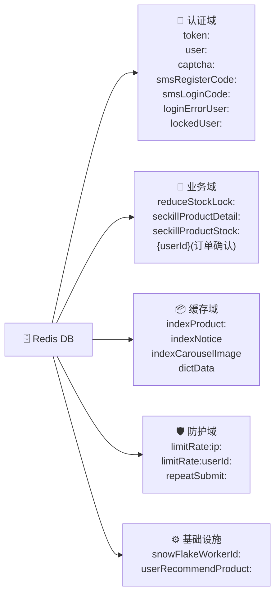
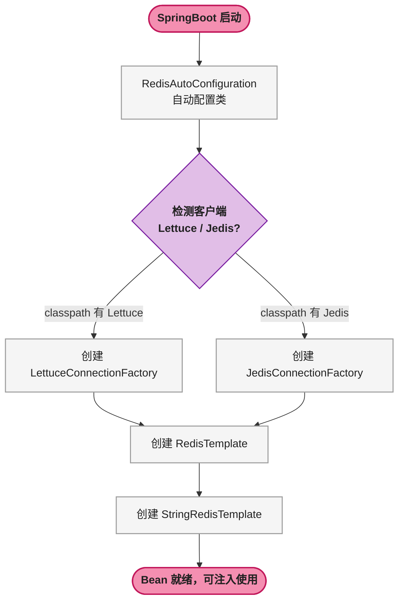

# 🚀 SpringBoot Redis 全操作指南

> 📖 <strong>前置阅读</strong>：本文假设读者已了解 Redis 的五种核心数据结构（String / Hash / List / Set / ZSet）和基本命令。如果还不熟悉，建议先阅读 [<strong>Redis 核心架构：五大数据结构与常用命令全解析</strong>]()。

## 🎯 第一步：目标说明

这篇文章的目标很明确：让读者在<strong>一篇文章</strong>内学会 SpringBoot 项目中所有常用的 Redis 操作，读完就能直接写到项目里。

具体来说，读完这篇文章会掌握：

- 用 <strong>StringRedisTemplate</strong> 和 <strong>RedisTemplate</strong> 操作 Redis 五种数据结构
- 用 <strong>Spring Cache 注解</strong>（`@Cacheable`、`@CachePut`、`@CacheEvict`）无侵入地加缓存
- 用 <strong>Redisson</strong> 实现分布式锁
- <strong>Pipeline</strong> 批量操作和<strong>发布订阅</strong>
- 排行榜、计数器、消息队列等<strong>真实业务场景</strong>的完整代码

文中的所有代码都可以直接复制粘贴到项目里，只需要改包名和类名。

## 📋 第二步：前置条件

开始之前，确认以下知识储备和环境就绪：

| 前置项 | 具体要求 | 验证命令 |
|--------|----------|----------|
| JDK | 17+（文中用 17，8+ 均兼容） | `java -version` |
| Maven | 3.6+ | `mvn -v` |
| SpringBoot | 3.x（文中用 3.2.0） | `mvn dependency:tree \| grep spring-boot` |
| Redis | 7.x（6.x 也兼容文中所有操作） | `redis-cli --version` |
| IDE | IntelliJ IDEA / VS Code / Eclipse 均可 | — |
| 前置知识 | SpringBoot 基础（依赖注入、`application.yml`）、SQL 基础、Linux 命令行基础 | — |

> 📌 前置知识：读者需要了解 SpringBoot 的 `@Configuration`、`@Bean`、`@Autowired` 基本用法，以及 `application.yml` 配置文件的写法。如果不熟悉 Maven 的 `pom.xml` 依赖管理，建议先补一下 SpringBoot 入门。

如果 Redis 还没装好，下一节会给出完整安装步骤。

## 🔧 第三步：环境搭建

### 📦 安装 Redis（已安装可跳过）

Windows 环境推荐用 Docker 或直接下载 Windows 版 Redis：

```bash
# Docker 方式（推荐）
docker run -d --name redis -p 6379:6379 redis:7.2-alpine

# 验证
docker exec -it redis redis-cli PING
# 预期输出: PONG
```

Linux/macOS：

```bash
# Ubuntu/Debian
sudo apt install redis-server -y

# macOS
brew install redis && brew services start redis

# 验证
redis-cli PING
# 预期输出: PONG
```

### 🏗️ 创建 SpringBoot 项目

在 `pom.xml` 中添加以下依赖：

```xml
<!-- Spring Data Redis（内置 Lettuce 连接池） -->
<dependency>
    <groupId>org.springframework.boot</groupId>
    <artifactId>spring-boot-starter-data-redis</artifactId>
</dependency>

<!-- Redisson 分布式锁 -->
<dependency>
    <groupId>org.redisson</groupId>
    <artifactId>redisson-spring-boot-starter</artifactId>
    <version>3.27.2</version>
</dependency>

<!-- 连接池（spring-boot-starter-data-redis 默认不带 commons-pool2） -->
<dependency>
    <groupId>org.apache.commons</groupId>
    <artifactId>commons-pool2</artifactId>
</dependency>

<!-- 以下依赖按项目需要添加 -->
<dependency>
    <groupId>org.springframework.boot</groupId>
    <artifactId>spring-boot-starter-web</artifactId>
</dependency>
<dependency>
    <groupId>org.projectlombok</groupId>
    <artifactId>lombok</artifactId>
    <optional>true</optional>
</dependency>
```

> ⚠️ 新手提示：`spring-boot-starter-data-redis` 默认使用 <strong>Lettuce</strong> 作为 Redis 客户端。不要同时引入 Jedis，二者会冲突。Lettuce 基于 Netty，天然支持异步和响应式，是 SpringBoot 2.x 之后的默认选择。

## 🏗️ 第四步：分步实践

### 🔌 4.1 配置 Redis 连接

在 `application.yml` 中写入：

```yaml
spring:
  data:
    redis:
      host: localhost
      port: 6379
      password:          # 没有密码就留空
      database: 0        # 默认选 db0
      timeout: 3000ms    # 连接超时
      lettuce:
        pool:
          max-active: 8      # 最大连接数
          max-idle: 8        # 最大空闲连接
          min-idle: 2        # 最小空闲连接
          max-wait: 1000ms   # 获取连接最大等待时间
```

连接问题排错：

| 错误信息 | 原因 | 解决 |
|----------|------|------|
| `Connection refused` | Redis 没启动或端口不对 | `redis-cli PING` 确认服务是否在跑 |
| `NOAUTH Authentication required` | Redis 有密码但配置文件没写 | 填上 `password` 字段 |
| `Unable to connect to localhost:6379` | 防火墙 / Docker 端口映射问题 | Docker 用户检查 `-p 6379:6379` |
| 连接池耗尽 | `max-active` 太小 | 调大或检查是否有连接泄漏 |

### ⚙️ 4.2 创建 Redis 配置类

```java
import org.springframework.context.annotation.Bean;
import org.springframework.context.annotation.Configuration;
import org.springframework.data.redis.connection.RedisConnectionFactory;
import org.springframework.data.redis.core.RedisTemplate;
import org.springframework.data.redis.core.StringRedisTemplate;
import org.springframework.data.redis.serializer.GenericJackson2JsonRedisSerializer;
import org.springframework.data.redis.serializer.StringRedisSerializer;

@Configuration
public class RedisConfig {

    @Bean
    public RedisTemplate<String, Object> redisTemplate(RedisConnectionFactory factory) {
        RedisTemplate<String, Object> template = new RedisTemplate<>();
        template.setConnectionFactory(factory);

        // key 用字符串序列化，避免出现乱码
        StringRedisSerializer stringSerializer = new StringRedisSerializer();
        template.setKeySerializer(stringSerializer);
        template.setHashKeySerializer(stringSerializer);

        // value 用 JSON 序列化，方便在 redis-cli 中查看
        GenericJackson2JsonRedisSerializer jsonSerializer =
                new GenericJackson2JsonRedisSerializer();
        template.setValueSerializer(jsonSerializer);
        template.setHashValueSerializer(jsonSerializer);

        template.afterPropertiesSet();
        return template;
    }
}
```

> ⚠️ 新手提示：如果不配置序列化，`RedisTemplate` 默认用 JDK 序列化。存进 Redis 的 key 会变成 `\xAC\xED\x00\x05...` 这样的字节流，在 `redis-cli` 里完全没法看。<strong>生产环境一定配置序列化</strong>。

`StringRedisTemplate` 是 Spring 已经配置好的，直接注入即可，不用手动配：

```java
@Autowired
private StringRedisTemplate stringRedisTemplate;  // key 和 value 都是 String
```

两种 Template 的分工：
- <strong>StringRedisTemplate</strong>：存字符串，适合计数器、分布式锁、简单的 JSON 字符串缓存
- <strong>RedisTemplate</strong>：存对象，适合直接存取 Java 对象（自动序列化/反序列化）

#### 🧰 附：封装 RedisUtil 工具类

真实项目中不建议在每个业务类里直接注入 `StringRedisTemplate` 然后到处 `try-catch`。下面是一个生产级的封装，后面的真实项目案例都会用这个工具类：

```java
import lombok.extern.slf4j.Slf4j;
import org.springframework.beans.factory.annotation.Autowired;
import org.springframework.data.redis.core.StringRedisTemplate;
import org.springframework.stereotype.Component;
import org.springframework.util.StringUtils;

import java.util.Map;
import java.util.concurrent.TimeUnit;

/**
 * Redis 工具类 —— 封装 StringRedisTemplate 全部常用操作 + 统一异常处理
 */
@Slf4j
@Component
public class RedisUtil {

    @Autowired
    private StringRedisTemplate stringRedisTemplate;

    // ==================== Hash 操作 ====================

    /** 批量保存 Hash */
    public void putHashMap(String key, Map<Object, Object> map) {
        try {
            stringRedisTemplate.opsForHash().putAll(key, map);
        } catch (Exception e) {
            log.error("Redis保存数据失败, key={}", key, e);
            throw new RuntimeException("Redis操作失败", e);
        }
    }

    /** 保存单个 Hash 字段 */
    public void putHashValue(String key, Object hashKey, Object value) {
        try {
            stringRedisTemplate.opsForHash().put(key, hashKey, value);
        } catch (Exception e) {
            log.error("Redis保存数据失败, key={}, hashKey={}", key, hashKey, e);
            throw new RuntimeException("Redis操作失败", e);
        }
    }

    /** 读取 Hash 字段 */
    public Object getHashValue(String key, Object hashKey) {
        if (key == null || hashKey == null) return null;
        try {
            return stringRedisTemplate.opsForHash().get(key, hashKey);
        } catch (Exception e) {
            log.error("Redis获取数据失败, key={}, hashKey={}", key, hashKey, e);
            throw new RuntimeException("Redis操作失败", e);
        }
    }

    // ==================== String 操作 ====================

    /** 设值 + 过期时间（秒） */
    public void set(String key, String value, long expireSeconds) {
        try {
            stringRedisTemplate.opsForValue().set(key, value, expireSeconds, TimeUnit.SECONDS);
        } catch (Exception e) {
            log.error("Redis保存数据失败, key={}", key, e);
            throw new RuntimeException("Redis操作失败", e);
        }
    }

    /** 设值（永不过期） */
    public void set(String key, String value) {
        try {
            stringRedisTemplate.opsForValue().set(key, value);
        } catch (Exception e) {
            log.error("Redis保存数据失败, key={}", key, e);
            throw new RuntimeException("Redis操作失败", e);
        }
    }

    /** 仅当 key 不存在时设值（SETNX） */
    public boolean setIfAbsent(String key, String value) {
        try {
            return Boolean.TRUE.equals(
                    stringRedisTemplate.opsForValue().setIfAbsent(key, value));
        } catch (Exception e) {
            log.error("Redis保存数据失败, key={}", key, e);
            throw new RuntimeException("Redis操作失败", e);
        }
    }

    /** 读取 */
    public String get(String key) {
        if (key == null) return null;
        try {
            return stringRedisTemplate.opsForValue().get(key);
        } catch (Exception e) {
            log.error("Redis获取数据失败, key={}", key, e);
            throw new RuntimeException("Redis操作失败", e);
        }
    }

    // ==================== 计数器操作 ====================

    /** INCRBY — 增加指定数值 */
    public Long increment(String key, long value) {
        try {
            return stringRedisTemplate.opsForValue().increment(key, value);
        } catch (Exception e) {
            log.error("Redis increment操作失败, key={}, value={}", key, value, e);
            throw new RuntimeException("Redis操作失败", e);
        }
    }

    /** INCR — 原子 +1 */
    public Long increment(String key) {
        try {
            return stringRedisTemplate.opsForValue().increment(key, 1);
        } catch (Exception e) {
            log.error("Redis increment操作失败, key={}", key, e);
            throw new RuntimeException("Redis操作失败", e);
        }
    }

    /** DECR — 原子 -1 */
    public Long decrement(String key) {
        try {
            return stringRedisTemplate.opsForValue().increment(key, -1);
        } catch (Exception e) {
            log.error("Redis decrement操作失败, key={}", key, e);
            throw new RuntimeException("Redis操作失败", e);
        }
    }

    // ==================== 通用操作 ====================

    /** 设置过期时间（秒） */
    public Boolean expire(String key, long expireSeconds) {
        try {
            return stringRedisTemplate.expire(key, expireSeconds, TimeUnit.SECONDS);
        } catch (Exception e) {
            log.error("Redis expire操作失败, key={}", key, e);
            throw new RuntimeException("Redis操作失败", e);
        }
    }

    /** 删除 key */
    public void del(String key) {
        try {
            if (StringUtils.hasLength(key)) {
                stringRedisTemplate.delete(key);
            }
        } catch (Exception e) {
            log.error("Redis删除数据失败, key={}", key, e);
            throw new RuntimeException("Redis操作失败", e);
        }
    }
}
```

这个类只有 150 行，三个设计点值得注意：

1. **统一异常处理**：每个方法都有 `try-catch`，Redis 挂了不会吞异常——`log.error` 记录现场 + `throw RuntimeException` 触发 Spring 全局异常处理，上层业务代码不用到处写 try-catch
2. **空值保护**：`get()` 和 `getHashValue()` 在 key 为 null 时直接返回 null，防止 NPE（`del()` 同理，空 key 直接跳过）
3. **只选 StringRedisTemplate**：项目中绝大多数 Redis 操作都是字符串级别（计数器、分布式锁、验证码），对象序列化走 JSON 字符串即可。没必要再引入 `RedisTemplate` 让工程变复杂

下面所有真实项目案例中的 `redisUtil.xxx()` 都是调的这个类。

### 📝 4.3 String 类型操作

String 是最基础的类型，一个 key 对应一个 value。但"String"这个名字有误导性——value 不仅是文本，还可以是整数、浮点数、二进制数据。

<strong>基础 CRUD</strong>：

```java
@Autowired
private StringRedisTemplate stringRedisTemplate;

// 增/改
stringRedisTemplate.opsForValue().set("user:1:name", "张三");

// 查
String name = stringRedisTemplate.opsForValue().get("user:1:name");

// 增/改 + 过期时间（重点）
stringRedisTemplate.opsForValue()
        .set("sms:code:13800138000", "123456", Duration.ofMinutes(5));

// 删
stringRedisTemplate.delete("user:1:name");

// 判断 key 是否存在
Boolean exists = stringRedisTemplate.hasKey("user:1:name");

// 查看剩余过期时间（秒）
Long ttl = stringRedisTemplate.getExpire("user:1:name");
```

<strong>计数器（INCR / DECR）</strong>：

```java
// 文章阅读量 +1
Long count = stringRedisTemplate.opsForValue().increment("article:1001:views");

// 库存扣减（原子操作，不会超卖）
Long stock = stringRedisTemplate.opsForValue().decrement("goods:5001:stock");

// 一次性加减指定数值
stringRedisTemplate.opsForValue().increment("user:1:score", 50);
```

> ⚠️ 新手提示：`increment` 是<strong>原子操作</strong>。多线程并发场景下，用 `increment` 替代"先 get 再 set"的模式，后者在高并发下有竞态条件（Read-Modify-Write 问题）。

<strong>真实项目案例：登录错误计数 + 账号锁定</strong>

下面这段代码来自一个真实商城项目的登录安全模块。场景：同一个用户名连续输错密码 5 次，锁定 24 小时。

```java
private static final String LOGIN_ERROR_USER_PREFIX = "loginErrorUser:";
private static final String LOCKED_USER_PREFIX     = "lockedUser:";

private void recordLoginErrorUser(String username) {
    String errorKey = LOGIN_ERROR_USER_PREFIX + username;
    // ① INCR 原子自增，并发下不会漏计
    Long count = redisUtil.increment(errorKey);
    // ② 第一次出错时设过期时间（24h），避免计数器永久占用内存
    if (count == 1) {
        redisUtil.expire(errorKey, 86400);  // 24 小时
    }
    // ③ 超过阈值则锁定
    if (count > 5) {
        redisUtil.set(LOCKED_USER_PREFIX + username, "true", 86400);
        throw new BusinessException("该用户已被锁定");
    }
}
```

修复前的旧代码是 `GET → parseInt → ++ → SET` 四步非原子操作——并发场景下两个请求同时 GET 到 count=4，各自 +1 后 SET count=5，谁也不会触发锁定。改成 `INCR` 后一条命令搞定，不存在竞态。

关键设计点：
- `count == 1` 时才设 `EXPIRE`——只在第一次出错设过期，后续自增不重置 TTL（否则连续输错会让计数器永远不过期）
- 计数器 key `loginErrorUser:admin` 和锁定标记 key `lockedUser:admin` **分开**——计数器用于逐步累加判断阈值，锁定标记用于登录前快速检查。锁定后计数器 TTL 到期自动清理

<strong>真实项目案例：短信验证码的存储与校验</strong>

短信验证码是 String 类型最常见的业务场景——设值、过期、读取、校验、删除。

```java
// 发送验证码——存 Redis，key 中包含手机号和业务类型
String key = String.format("%s%s", "smsRegisterCode:", phone);
// ① 先检查 60 秒内是否发过（防刷）
if (StringUtils.hasLength(redisUtil.get(key))) {
    throw new BusinessException("验证码已发送，请60秒后再试");
}
// ② 生成 6 位随机码，60 秒过期
String code = RandomUtil.getSixBitRandom();
redisUtil.set(key, code, 60);

// 登录时校验——读出来比对，匹配后删除（一次性消费）
String cachedCode = redisUtil.get("smsLoginCode:" + phone);
if (cachedCode == null || !cachedCode.equals(inputCode)) {
    throw new BusinessException("验证码错误或已过期");
}
redisUtil.del("smsLoginCode:" + phone);  // 验证后立即删除
```

注意两个细节：`smsRegisterCode:` 和 `smsLoginCode:` 是两个**独立的前缀**——注册验证码和登录验证码不共用同一个 key，否则注册流程发的码可能被登录接口误消费。另外，发送前先检查 key 是否存在，天然实现了 60 秒内不允许重复发送的频控。

<strong>分布式 ID 生成器</strong>：

```java
public long nextId(String bizType) {
    return stringRedisTemplate.opsForValue()
            .increment("id:generator:" + bizType);
}
```

`INCR` 天生线程安全，比数据库自增 ID 快得多，适合生成订单号、流水号。

<strong>批量操作</strong>：

```java
// 批量查
List<String> keys = Arrays.asList("user:1:name", "user:2:name", "user:3:name");
List<String> values = stringRedisTemplate.opsForValue().multiGet(keys);

// 批量设
Map<String, String> map = new HashMap<>();
map.put("key1", "v1");
map.put("key2", "v2");
stringRedisTemplate.opsForValue().multiSet(map);
```

<style>
table { width: 100%; border-collapse: collapse; }
th { background: #1E88E5; color: #FFFFFF; padding: 8px 12px; text-align: left; }
td { padding: 8px 12px; border-bottom: 1px solid #E0E0E0; }
tr:nth-child(even) { background: #F5F5F5; }
</style>

String 类型常用方法速查：

| 方法 | 说明 | 典型场景 |
|------|------|----------|
| `set(k, v)` | 设值 | 缓存字符串 |
| `set(k, v, timeout)` | 设值+过期 | 验证码、token |
| `get(k)` | 取值 | 读取缓存 |
| `increment(k)` | 原子+1 | 计数器、分布式ID |
| `decrement(k)` | 原子-1 | 库存扣减 |
| `multiGet(keys)` | 批量取 | 批量查缓存 |
| `setIfAbsent(k, v, timeout)` | key不存在才设 | 分布式锁（简易版） |

### 🗂️ 4.4 Hash 类型操作

Hash 适合存储<strong>单个对象</strong>，一个 key 下可以存多个 field-value 对。比 String 存 JSON 省内存，且可以<strong>局部更新</strong>单个字段，不需要整对象序列化。

<strong>基础操作</strong>：

```java
@Autowired
private RedisTemplate<String, Object> redisTemplate;

String key = "user:1001";

// 存入整个对象
Map<String, Object> userMap = new HashMap<>();
userMap.put("name", "张三");
userMap.put("age", 28);
userMap.put("email", "zhangsan@example.com");
redisTemplate.opsForHash().putAll(key, userMap);

// 读取单个字段
Object name = redisTemplate.opsForHash().get(key, "name");

// 局部更新（不改动其他字段）
redisTemplate.opsForHash().put(key, "age", 29);

// 批量读多个字段
List<Object> fields = redisTemplate.opsForHash()
        .multiGet(key, Arrays.asList("name", "email"));

// 读取全部字段
Map<Object, Object> all = redisTemplate.opsForHash().entries(key);

// 删除单个字段
redisTemplate.opsForHash().delete(key, "email");
```

<strong>计数器（Hash 内的数值字段）</strong>：

```java
// 文章点赞数 +1
redisTemplate.opsForHash().increment("article:1001", "likes", 1);
```

<strong>检查字段是否存在</strong>：

```java
Boolean hasField = redisTemplate.opsForHash().hasKey("user:1001", "email");
```

Hash 常用方法速查：

| 方法 | 说明 | 典型场景 |
|------|------|----------|
| `put(k, field, v)` | 设单个字段 | 局部更新 |
| `putAll(k, map)` | 设全部字段 | 首次缓存对象 |
| `get(k, field)` | 取单个字段 | 读取某个属性 |
| `multiGet(k, fields)` | 批量取字段 | 只取需要的字段 |
| `entries(k)` | 取全部字段 | 读取完整对象 |
| `increment(k, field, n)` | 某字段+n | 点赞数、浏览数 |
| `hasKey(k, field)` | 判断字段存在 | 检查属性是否设过值 |

<strong>选 Hash 还是 String 存 JSON？</strong>

Hash：字段独立存取、局部更新频繁、字段数不多（＜50个）。省网络开销，但存大量字段时内存占用更高。
String 存 JSON：一次读整个对象、字段很少变动。方便整体缓存，序列化开销小。

### 📋 4.5 List 类型操作

List 是<strong>有序、可重复</strong>的字符串链表。底层是双向链表（ziplist/quicklist），两端操作 O(1)，中间操作 O(n)。

<strong>基础操作</strong>：

```java
// 从左边插入（头部）
stringRedisTemplate.opsForList().leftPush("queue:task", "task1");
stringRedisTemplate.opsForList().leftPushAll("queue:task", "task2", "task3");

// 从右边插入（尾部）
stringRedisTemplate.opsForList().rightPush("queue:task", "task4");

// 范围查询（start=0 表示第一个，end=-1 表示最后一个）
List<String> all = stringRedisTemplate.opsForList()
        .range("queue:task", 0, -1);

// 从左边弹出（取出并删除）
String task = stringRedisTemplate.opsForList().leftPop("queue:task");

// 从右边弹出——阻塞等待（等 10 秒，没数据返回 null）
String task2 = stringRedisTemplate.opsForList()
        .rightPop("queue:task", 10, TimeUnit.SECONDS);
```

<strong>真实场景：简单消息队列</strong>：

```java
// 生产者
public void produce(String msg) {
    stringRedisTemplate.opsForList().leftPush("mq:order", msg);
}

// 消费者（阻塞式）
public void consume() {
    while (true) {
        String msg = stringRedisTemplate.opsForList()
                .rightPop("mq:order", 0, TimeUnit.SECONDS); // 0 = 一直等
        processMsg(msg);
    }
}
```

> ⚠️ 新手提示：Redis List 做消息队列适合<strong>小型项目或开发环境</strong>。生产环境消息量大的话，还是用 RabbitMQ / RocketMQ / Kafka。另外 `rightPop` 的阻塞版本每次只能等一个队列，不支持同时监听多个队列。

<strong>真实场景：最新 N 条评论</strong>：

```java
// 添加评论——从头部插入
stringRedisTemplate.opsForList().leftPush("article:1001:comments", commentJson);
// 只保留最近 50 条——截断
stringRedisTemplate.opsForList().trim("article:1001:comments", 0, 49);
```

<strong>按索引取值和修改</strong>：

```java
// 取指定下标
String item = stringRedisTemplate.opsForList().index("queue:task", 2);

// 修改指定下标
stringRedisTemplate.opsForList().set("queue:task", 0, "newValue");

// 获取 List 长度
Long size = stringRedisTemplate.opsForList().size("queue:task");
```

List 常用方法速查：

| 方法 | 说明 | 典型场景 |
|------|------|----------|
| `leftPush(k, v)` | 头部插入 | 最新消息靠前 |
| `rightPush(k, v)` | 尾部插入 | 队列追加 |
| `leftPop(k)` | 头部弹出 | 消费消息 |
| `rightPop(k, timeout)` | 阻塞尾部弹出 | 阻塞消费 |
| `range(k, 0, -1)` | 范围查询 | 读取全部 |
| `trim(k, 0, N)` | 保留前N+1条 | 最新N条 |
| `size(k)` | 获取长度 | 判断队列深度 |

### 🔖 4.6 Set 类型操作

Set 是<strong>无序、不重复</strong>的字符串集合。底层是哈希表，增删查都是 O(1)。核心价值在<strong>集合运算</strong>（交集、并集、差集）。

<strong>基础操作</strong>：

```java
// 添加
stringRedisTemplate.opsForSet().add("article:1001:tags", "Java", "Redis", "SpringBoot");
// 重复添加"Java"不会生效，Set 自动去重

// 查询所有成员
Set<String> tags = stringRedisTemplate.opsForSet().members("article:1001:tags");

// 判断是否存在
Boolean isMember = stringRedisTemplate.opsForSet().isMember("article:1001:tags", "Java");

// 删除
stringRedisTemplate.opsForSet().remove("article:1001:tags", "Redis");

// 获取大小
Long size = stringRedisTemplate.opsForSet().size("article:1001:tags");
```

<strong>集合运算（核心价值）</strong>：

```java
String user1 = "user:likes:1001"; // 用户1喜欢的文章
String user2 = "user:likes:1002"; // 用户2喜欢的文章

// 共同喜欢（交集）
Set<String> common = stringRedisTemplate.opsForSet()
        .intersect(user1, user2);

// 喜欢的所有文章（并集）
Set<String> union = stringRedisTemplate.opsForSet()
        .union(user1, user2);

// 用户1独有的喜欢（差集）
Set<String> diff = stringRedisTemplate.opsForSet()
        .difference(user1, user2);
```

<strong>真实场景：共同好友</strong>：

```java
// 给用户推荐文章：取用户尚未看过的文章
Set<String> recommended = stringRedisTemplate.opsForSet()
        .difference("article:all:ids", "user:1001:viewed");
```

<strong>随机操作（抽奖）</strong>：

```java
// 随机取一个（不删除）
String lucky = stringRedisTemplate.opsForSet().randomMember("lottery:pool");

// 随机取3个（不重复，不删除）
List<String> lucky3 = stringRedisTemplate.opsForSet()
        .randomMembers("lottery:pool", 3);

// 随机弹出一个（取出并删除）——真正的抽奖
String winner = stringRedisTemplate.opsForSet().pop("lottery:pool");
```

Set 常用方法速查：

| 方法 | 说明 | 典型场景 |
|------|------|----------|
| `add(k, v1, v2, ...)` | 添加成员 | 添加标签 |
| `members(k)` | 取全部成员 | 读取标签列表 |
| `isMember(k, v)` | 判断存在 | 检查是否已点赞 |
| `remove(k, v)` | 删除成员 | 移除标签 |
| `intersect(k1, k2)` | 交集 | 共同好友 |
| `union(k1, k2)` | 并集 | 合并集合 |
| `difference(k1, k2)` | 差集 | 未读推荐 |
| `randomMember(k)` | 随机取一个 | 随机展示 |
| `pop(k)` | 随机弹出 | 抽奖 |

### 🏆 4.7 ZSet（Sorted Set）类型操作

ZSet 是 Set 的加强版——每个成员带一个 <strong>score</strong>（分值），按分值排序。<strong>这是 Redis 五种数据结构里用的最多的类型之一</strong>，排行榜、延迟队列、优先级队列都靠它。

<strong>基础操作</strong>：

```java
// 添加（成员 + 分值）
stringRedisTemplate.opsForZSet().add("game:rank", "player1", 9850);
stringRedisTemplate.opsForZSet().add("game:rank", "player2", 10200);
stringRedisTemplate.opsForZSet().add("game:rank", "player3", 8700);

// 取某个成员的分值
Double score = stringRedisTemplate.opsForZSet().score("game:rank", "player1");

// 分值增加
stringRedisTemplate.opsForZSet().incrementScore("game:rank", "player1", 100);

// 取排名（从小到大，默认 0 表示最低分）
Long rank = stringRedisTemplate.opsForZSet().rank("game:rank", "player1");

// 取排名（从大到小——排行榜常用）
Long reverseRank = stringRedisTemplate.opsForZSet()
        .reverseRank("game:rank", "player1");
```

<strong>真实场景：排行榜</strong>：

```java
// Top 10 排行榜（从高到低）
Set<ZSetOperations.TypedTuple<String>> top10 = stringRedisTemplate
        .opsForZSet().reverseRangeWithScores("game:rank", 0, 9);
for (ZSetOperations.TypedTuple<String> tuple : top10) {
    System.out.println(tuple.getValue() + " : " + tuple.getScore());
}

// 分值区间查询：取 9000 ~ 11000 分的玩家
Set<String> midPlayers = stringRedisTemplate.opsForZSet()
        .rangeByScore("game:rank", 9000, 11000);
```

<strong>真实场景：延迟队列</strong>：

```java
// 添加延迟任务（score = 执行时间的时间戳）
stringRedisTemplate.opsForZSet()
        .add("delay:queue", "order:1001:cancel", System.currentTimeMillis() + 1800_000);

// 定时任务：拉取到期的任务（score ≤ 当前时间戳）
long now = System.currentTimeMillis();
Set<String> dueTasks = stringRedisTemplate.opsForZSet()
        .rangeByScore("delay:queue", 0, now);
// 执行任务后删除
for (String task : dueTasks) {
    stringRedisTemplate.opsForZSet().remove("delay:queue", task);
    executeTask(task);
}
```

ZSet 常用方法速查：

| 方法 | 说明 | 典型场景 |
|------|------|----------|
| `add(k, v, score)` | 添加成员 | 初始化排名 |
| `incrementScore(k, v, delta)` | 增加分值 | 加分、加积分 |
| `reverseRangeWithScores(k, 0, N)` | Top N（倒序+分值） | 排行榜 |
| `rank(k, v)` | 升序排名 | 获取名次 |
| `reverseRank(k, v)` | 降序排名 | 排行榜名次 |
| `rangeByScore(k, min, max)` | 分值区间查询 | 延迟队列 |
| `remove(k, v)` | 删除成员 | 踢出排行榜 |
| `score(k, v)` | 获取单个分值 | 查询积分 |
| `size(k)` | 成员总数 | 参与人数 |

### 🪄 4.8 Spring Cache 注解：无侵入加缓存

前面的操作都需要手动写 `redisTemplate.opsForXxx()` 的代码。Spring Cache 提供了注解级缓存——在方法上加个注解，返回值自动存入 Redis，下次调用直接走缓存。

> 📌 前置知识：Spring Cache 基于 AOP 代理实现。`@Cacheable` 等方法需要在<strong>不同类之间调用</strong>才能触发代理。同一个类里 A 方法调 B 方法，B 上的 `@Cacheable` 不会生效（this 调用不走代理）。

<strong>开启 Spring Cache</strong>：

```java
@Configuration
@EnableCaching  // 开启缓存注解
public class CacheConfig {

    @Bean
    public RedisCacheManager cacheManager(RedisConnectionFactory factory) {
        RedisCacheConfiguration config = RedisCacheConfiguration
                .defaultCacheConfig()
                .entryTtl(Duration.ofMinutes(30))      // 默认过期 30 分钟
                .serializeKeysWith(
                        RedisSerializationContext.SerializationPair
                                .fromSerializer(new StringRedisSerializer()))
                .serializeValuesWith(
                        RedisSerializationContext.SerializationPair
                                .fromSerializer(new GenericJackson2JsonRedisSerializer()))
                .disableCachingNullValues();            // 不缓存 null

        return RedisCacheManager.builder(factory)
                .cacheDefaults(config)
                .build();
    }
}
```

<strong>@Cacheable：先查缓存，有就返回，没有就执行方法并存入缓存</strong>：

```java
@Service
public class UserService {

    @Cacheable(value = "user", key = "#id")
    public User getUserById(Long id) {
        // 第一次调用：查数据库，结果存入 Redis
        // 后续调用：直接从 Redis 拿，不走到这里
        return userMapper.selectById(id);
    }

    @Cacheable(value = "user", key = "#id", unless = "#result == null")
    public User getUserSafe(Long id) {
        // unless 条件：结果为 null 时不缓存（避免缓存穿透）
        return userMapper.selectById(id);
    }

    @Cacheable(value = "users", key = "#page + ':' + #size",
               condition = "#page < 10")
    public List<User> listUsers(int page, int size) {
        // condition：只有 page < 10 时才走缓存
        return userMapper.selectPage(page, size);
    }
}
```

<strong>@CachePut：总是执行方法，把结果存入缓存（更新缓存用）</strong>：

```java
@CachePut(value = "user", key = "#user.id")
public User updateUser(User user) {
    userMapper.updateById(user);
    return user; // 返回值会覆盖 Redis 中的缓存
}
```

<strong>@CacheEvict：删除缓存</strong>：

```java
@CacheEvict(value = "user", key = "#id")
public void deleteUser(Long id) {
    userMapper.deleteById(id);
    // 方法执行后自动删除 Redis 中对应的缓存
}

// 删除整个缓存分组
@CacheEvict(value = "user", allEntries = true)
public void clearAllUserCache() {
}
```

<strong>@Caching：组合多个缓存操作</strong>：

```java
@Caching(
    cacheable = @Cacheable(value = "user", key = "#id"),
    evict = { @CacheEvict(value = "users", allEntries = true) }
)
public User getUserAndRefreshList(Long id) {
    return userMapper.selectById(id);
}
```

<strong>SpEL 常用表达式速查</strong>：

| 表达式 | 说明 | 示例 |
|--------|------|------|
| `#id` | 参数名 | `key = "#id"` |
| `#p0` / `#a0` | 第 0 个参数 | `key = "#p0"` |
| `#result` | 返回值 | `unless = "#result == null"` |
| `#root.methodName` | 方法名 | `key = "#root.methodName"` |
| `#user.id` | 参数属性 | `key = "#user.id"` |

<strong>Spring Cache 和手动 RedisTemplate 怎么选？</strong>

用 `@Cacheable`：读多写少、缓存逻辑简单、不想改业务代码。适合"把数据库查询结果缓存起来"这种标准场景。
用 `RedisTemplate`：需要精确控制过期时间、需要操作复杂数据结构（排行榜、队列）、需要操作多个缓存 key 联动。适合有复杂缓存策略的场景。

实际项目中通常是<strong>混用</strong>：普通查询用 `@Cacheable`，排行榜/计数器/分布式锁用 `RedisTemplate`。

<strong>真实项目案例：Caffeine L1 + Redis Hash L2 字典缓存</strong>

商城项目的数据字典（国家、省市、商品分类等）变更极少但查询极频繁。直接用 `@Cacheable` 加 Spring Cache，配置 Caffeine 作为一级缓存、Redis 作为二级缓存：

```java
// ① CacheManager 配置：Caffeine + Redis 双级
spring.cache.cache-names: dict_data
spring.cache.type: caffeine
spring.cache.caffeine.spec: initialCapacity=50,maximumSize=500,expireAfterWrite=60s

// ② Service 层：@Cacheable 兜底 + Redis Hash 精确查
@Cacheable(value = "dict_data", keyGenerator = "dictCacheKeyGenerator")
public List<DictDetailEntity> queryDictDetailEntity(String dictName) {
    // 只有 Caffeine 未命中时才走到这里
    Object cached = redisUtil.getHashValue("dictData", dictName);
    if (cached != null) {
        return JSON.parseArray(cached.toString(), DictDetailEntity.class);
    }
    // Redis 也未命中，查 DB 并回写 Redis Hash
    List<DictDetailEntity> entities = dictMapper.selectByDictName(dictName);
    redisUtil.putHashValue("dictData", dictName, JSON.toJSONString(entities));
    return entities;
}
```

为什么用 Hash 而不是 String 存整个对象？字典有几十种类型——用 Hash 一个 `dictData` key 下存所有类型，`HGET dictData country` 只返回国家字典，不用整 JSON 反序列化。加上 Caffeine 60 秒本地缓存，查询字典几乎没有网络开销。


### 🔒 4.9 Redisson 分布式锁

单机项目用 `synchronized` 或 `ReentrantLock` 就能搞定线程安全。但是多实例部署后，JVM 级别的锁管不到其他实例。此时需要一个跨 JVM 的锁——<strong>分布式锁</strong>。

> 📌 前置知识：理解分布式锁之前，先了解 `synchronized` 和 `ReentrantLock` 的基本用法（`lock()` / `unlock()` / `tryLock()`）。分布式锁的基本思想是：用一个所有实例都能访问的外部服务（Redis、ZooKeeper）来协调"谁先进来"。

<strong>为什么不自己用 setIfAbsent 实现分布式锁？</strong>

写过的都懂——要考虑死锁（设置过期时间）、误删（锁别人的锁被自己删了）、锁续期（业务没执行完锁过期了）、可重入、Redis 主从切换时的锁丢失……每一个都是坑。Redisson 帮把这些都解决好了，别自己造轮子。

<strong>基础用法</strong>：

```java
@Autowired
private RedissonClient redissonClient;

public void doSomethingSecurely() {
    RLock lock = redissonClient.getLock("lock:order:1001");
    try {
        // 尝试加锁，最多等 10 秒，锁自动过期时间 30 秒
        if (lock.tryLock(10, 30, TimeUnit.SECONDS)) {
            // 执行业务逻辑
            processOrder(1001);
        } else {
            throw new RuntimeException("获取锁失败，请稍后重试");
        }
    } catch (InterruptedException e) {
        Thread.currentThread().interrupt();
    } finally {
        // 判断是当前线程持有才解锁（防止误删）
        if (lock.isHeldByCurrentThread()) {
            lock.unlock();
        }
    }
}
```

<strong>真实项目案例：库存扣减 RedissonMultiLock（联锁）</strong>

下面是一个商城项目下单扣库存的真实逻辑。一个订单包含多个商品，需要对每个商品分别加锁——但多锁场景有一个致命陷阱：如果先锁商品A成功、再锁商品B失败，商品A的库存已经扣了，商品B没扣成，数据不一致。

正确的做法是 <strong>RedissonMultiLock（联锁）</strong>——所有锁**全部获取成功**才算成功，任一失败则全部释放：

```java
private static final String REDUCE_STOCK_LOCK_PREFIX = "reduceStockLock:";

// 为订单中的每个商品构造锁 key
private List<String> getLockKey(TradeEntity tradeEntity) {
    return tradeEntity.getTradeItemEntityList().stream()
            .map(item -> REDUCE_STOCK_LOCK_PREFIX + item.getProductId())
            .collect(Collectors.toList());
}

public TradeEntity reduceStock(TradeEntity tradeEntity) {
    List<String> keys = getLockKey(tradeEntity);
    // RedissonMultiLock：所有锁同时获取，任一失败全部放弃
    redissonUtil.tryMultiLock(keys, 20, 20, () -> {
        // 锁内：二次校验库存 → 事务内批量更新
        checkProductAndStock(tradeEntity);
        transactionTemplate.execute(status -> {
            for (TradeItemEntity item : tradeEntity.getTradeItemEntityList()) {
                productMapper.reduceStock(item.getProductId(), item.getQuantity());
            }
            return Boolean.TRUE;
        });
        return tradeEntity;
    });
    return tradeEntity;
}
```

这个案例中调用的 `redissonUtil.tryMultiLock()` 来自下面这个封装类。跟 `RedisUtil` 一样，真实项目中不应该在业务代码里到处写 `redissonClient.getLock()` + `try-finally` —— 样本代码一多就容易出现加锁忘解锁、中断不处理等问题。统一封装后业务代码只需传 key 和一个 Lambda：

```java
import com.mall.common.exception.BusinessException;
import lombok.extern.slf4j.Slf4j;
import org.redisson.RedissonMultiLock;
import org.redisson.api.RLock;
import org.redisson.api.RedissonClient;
import org.springframework.beans.factory.annotation.Autowired;
import org.springframework.stereotype.Component;
import org.springframework.util.StringUtils;

import java.util.List;
import java.util.concurrent.TimeUnit;
import java.util.function.Supplier;
import java.util.stream.Collectors;

/**
 * Redisson 工具类 —— 封装 tryLock / tryMultiLock + 统一异常处理
 */
@Component
@Slf4j
public class RedissonUtil {

    @Autowired
    private RedissonClient redissonClient;

    /**
     * 尝试锁定单个资源
     *
     * @param key       锁 key
     * @param waitTime  加锁等待时间（秒）
     * @param leaseTime 锁持有时间（秒）
     * @param supplier  业务操作（Lambda）
     */
    public <T> T tryLock(String key, long waitTime, long leaseTime, Supplier<T> supplier) {
        if (!StringUtils.hasLength(key)) {
            throw new IllegalArgumentException("key不能为空");
        }
        RLock rLock = redissonClient.getLock(key);
        return doTryLock(rLock, key, waitTime, leaseTime, supplier);
    }

    /**
     * 尝试锁定多个资源（联锁）—— 全部成功才算成功，任一失败全部释放
     *
     * @param keys      锁 key 列表
     * @param waitTime  加锁等待时间（秒）
     * @param leaseTime 锁持有时间（秒）
     * @param supplier  业务操作（Lambda）
     */
    public <T> T tryMultiLock(List<String> keys, long waitTime, long leaseTime,
                               Supplier<T> supplier) {
        if (keys == null || keys.isEmpty()) {
            throw new IllegalArgumentException("keys不能为空");
        }
        RLock[] rLocks = new RLock[keys.size()];
        for (int i = 0; i < keys.size(); i++) {
            rLocks[i] = redissonClient.getLock(keys.get(i));
        }
        RedissonMultiLock multiLock = new RedissonMultiLock(rLocks);
        String collectKey = keys.stream().collect(Collectors.joining());
        return doTryLock(multiLock, collectKey, waitTime, leaseTime, supplier);
    }

    /** 统一加锁逻辑 —— try-finally 保证释放 + 中断处理 */
    private <T> T doTryLock(RLock rLock, String key, long waitTime,
                            long leaseTime, Supplier<T> supplier) {
        try {
            if (rLock.tryLock(waitTime, leaseTime, TimeUnit.SECONDS)) {
                try {
                    return supplier.get();
                } finally {
                    rLock.unlock();
                }
            } else {
                log.info("分布式锁加锁失败, key:{}", key);
                throw new BusinessException("服务器内部错误");
            }
        } catch (InterruptedException e) {
            log.info("获取分布式锁请求被中断, key:{}", key);
            throw new BusinessException("服务器内部错误");
        }
    }
}
```

四个关键设计点：
- **Supplier 模式**：用 `Supplier<T>` 接口接收业务 Lambda，`RedissonUtil` 统一处理加锁/解锁/异常，上层的库存扣减代码只需要关心 `() -> { ... return result; }`
- **单锁和多锁两套接口**：`tryLock` 用于普通场景，`tryMultiLock` 用于多商品下单——联锁确保所有商品锁**全部获取成功**才算成功，任一失败全部释放，杜绝部分扣库存的一致性 bug
- **锁内 finally-unlock**：`doTryLock` 的嵌套 try-finally 保证只要加锁成功，无论业务逻辑抛不抛异常，锁一定释放。加锁失败（`tryLock=false`）则直接抛异常，不走 finally
- **锁粒度是商品级别**（`reduceStockLock:{productId}`）——只有买同一个商品的两个订单才互斥，买不同商品可以并行扣。锁等待时间和持有时间都设了 20 秒，配合 `TransactionTemplate` 在锁内手动开启 DB 事务

<strong>看门狗（Watchdog）机制</strong>：

Redisson 有一个很贴心的设计：如果在 `tryLock` 时不指定 `leaseTime`（或传 -1），Redisson 会自动启动一个"看门狗"后台线程，每 10 秒检查锁是否还被当前线程持有，如果持有就自动续期到 30 秒。这样即使业务逻辑执行时间不确定，锁也不会过期。

```java
// 不指定 leaseTime，启用看门狗自动续期
lock.tryLock(10, -1, TimeUnit.SECONDS);
// 或者直接用无参的 lock()
lock.lock();  // 看门狗自动续期
```

> ⚠️ 新手提示：手动指定了 `leaseTime`（如 30 秒），看门狗<strong>不会启动</strong>。锁到期就释放。业务执行超过 30 秒的话，锁就没了。不确定执行多久时，用 `lock()` 让看门狗自动续期。

Redisson 锁常用方法：

| 方法 | 说明 |
|------|------|
| `lock()` | 一直等，拿不到就阻塞，看门狗自动续期 |
| `tryLock(waitT, leaseT, unit)` | 等 waitT 时间，拿不到返回 false |
| `unlock()` | 释放锁（自动判断是否当前线程持有） |
| `isHeldByCurrentThread()` | 判断当前线程是否持有 |
| `isLocked()` | 判断锁是否被任意线程持有 |
| `forceUnlock()` | 强制释放（不管谁持有的） |

### ⚡ 4.10 Pipeline 批量操作

假设要往 Redis 写入 1000 条数据，逐条写入就是 1000 次网络来回，耗时可想而知。Pipeline 把多条命令打包<strong>一次发过去、一次收回来</strong>，网络开销从 N 次变成 1 次。

```java
// 不用 Pipeline：N 次网络往返
List<String> result1 = new ArrayList<>();
for (int i = 0; i < 1000; i++) {
    result1.add(stringRedisTemplate.opsForValue()
            .get("key:" + i));  // 每次都是一次网络请求
}

// 用 Pipeline：1 次网络往返
List<Object> result2 = stringRedisTemplate.executePipelined(
        (RedisCallback<Object>) connection -> {
            for (int i = 0; i < 1000; i++) {
                connection.stringCommands()
                        .get(("key:" + i).getBytes());
            }
            return null; // 返回值通过 executePipelined 收集
        });
```

> ⚠️ 新手提示：Pipeline 里的命令之间没有原子性保证——中间某条命令失败了，其他命令照样执行。<strong>和 Redis 事务（MULTI/EXEC）不一样</strong>。另外 Pipeline 不会减少 Redis 单线程的执行开销，只是减少了网络 RTT。

Pipeline 适合的场景：批量初始加载数据、批量查询缓存预热、日志批量写入。

### 📡 4.11 发布订阅（Pub/Sub）

Redis 内置了发布订阅功能——一个频道（Channel）上发布消息，所有订阅该频道的客户端都能收到。适合做<strong>进程间通知</strong>，比如清除本地缓存、配置热更新。

<strong>配置消息监听器</strong>：

```java
// 消息监听器
@Component
public class CacheClearListener implements MessageListener {
    @Override
    public void onMessage(Message message, byte[] pattern) {
        String channel = new String(message.getChannel());
        String body = new String(message.getBody());
        System.out.println("收到消息: channel=" + channel + ", body=" + body);
        // 执行本地缓存清理...
    }
}
```

<strong>配置容器</strong>：

```java
@Configuration
public class PubSubConfig {

    @Bean
    public RedisMessageListenerContainer container(
            RedisConnectionFactory factory,
            CacheClearListener listener) {
        RedisMessageListenerContainer container =
                new RedisMessageListenerContainer();
        container.setConnectionFactory(factory);
        // 订阅 "cache:clear" 频道
        container.addMessageListener(listener,
                new ChannelTopic("cache:clear"));
        return container;
    }
}
```

<strong>发布消息</strong>：

```java
@Autowired
private StringRedisTemplate stringRedisTemplate;

// 发布消息
stringRedisTemplate.convertAndSend("cache:clear", "user:1001");
```

> ⚠️ 新手提示：Redis Pub/Sub 是<strong>即发即忘（fire-and-forget）</strong>——发布时订阅者不在线，消息就直接丢了。没有消息持久化、没有重试、没有消费确认。如果需要可靠的消息投递，请用专业的消息队列（RabbitMQ / RocketMQ / Kafka）。

### 🏷️ 4.12 Redis Key 命名规范 — 冒号的秘密

前面所有的示例 key 都用了这样的格式：`reduceStockLock:{productId}`、`loginErrorUser:{username}`、`smsRegisterCode:{phone}`。这不是随手写的，背后有明确的规范。

#### 为什么用冒号而不是下划线或驼峰？

Redis 的 `KEYS` 和 `SCAN` 命令支持**通配符**——冒号天然作为层级分隔符：

```bash
# 开发环境排错：查所有短信相关的 key
redis-cli KEYS "sms*"
# → smsRegisterCode:13800138000
# → smsLoginCode:13900139000

# 查某用户的全部 token 相关数据
redis-cli KEYS "token:*"

# 清理某类型缓存（生产慎用 KEYS，用 SCAN）
redis-cli --scan --pattern "captcha:*"
```

如果 key 是 `smsRegisterCode_13800138000`，虽然也能 `KEYS sms*`，但冒号分隔的 `smsRegisterCode:13800138000` 在 Redis 客户端 UI 中会自动展示为树形层级结构，一眼就能看出命名空间。

#### 一个商城项目的真实 Redis Key 清单

以下是某个生产级商城项目实际使用的全部 Redis key 前缀，每个都是冒号分隔：

| 命名空间 | Key 格式 | 数据类型 | TTL | 用途 |
|----------|----------|:---:|-----|------|
| `token:` | `token:{username}` | String | 1h | JWT token 缓存 |
| `user:` | `user:{username}` | String | 1h | 用户信息 JSON |
| `captcha:` | `captcha:{uuid}` | String | 60s | 算术验证码答案 |
| `smsRegisterCode:` | `smsRegisterCode:{phone}` | String | 60s | 注册短信码 |
| `smsLoginCode:` | `smsLoginCode:{phone}` | String | 60s | 登录短信码 |
| `loginErrorUser:` | `loginErrorUser:{username}` | String（INCR） | 24h | 登录失败计数 |
| `lockedUser:` | `lockedUser:{username}` | String | 24h | 账号锁定标记 |
| `limitRate:ip:` | `limitRate:ip:{method}_{ip}` | String（Lua INCR） | 60s | 接口限流计数 |
| `reduceStockLock:` | `reduceStockLock:{productId}` | Redisson RLock | 20s | 库存扣减锁 |
| `seckillProductDetail:` | `seckillProductDetail:{id}` | String（JSON） | 永久 | 秒杀商品缓存 |
| `seckillProductStock:` | `seckillProductStock:{id}` | String（DECR） | 永久 | 秒杀库存计数 |
| `userRecommendProduct:` | `userRecommendProduct:{userId}` | String（JSON） | 永久 | 推荐结果缓存 |
| `indexProduct:` | `indexProduct:{type}` | String（JSON） | 永久 | 首页商品列表 |
| `dictData` | `dictData` | Hash | 永久 | 数据字典（手动刷新） |
| `snowFlakeWorkerId:` | `snowFlakeWorkerId:{app}-{host}-{w}` | String | 1h（心跳续期） | 雪花 Worker ID 租约 |

#### 规则总结

| 规则 | 正确示例 | 错误示例 | 说明 |
|------|----------|----------|------|
| 前缀用业务语义 | `token:admin` | `t:admin` | 谁都能看懂 |
| 冒号分隔层级 | `limitRate:ip:login_1.2.3.4` | `limitRate_ip_login_1.2.3.4` | Redis 桌面客户端自动树形展示 |
| 避免裸 key | `token:admin` | `admin` | 同名 key 冲突，且无法批量管理 |
| key 中不存单词 | `reduceStockLock:123` | `reduce_stock_lock:123` | 和 Java 驼峰对齐 |
| 常量定义集中管理 | `KeyConstant.java` | 字符串硬编码散落各处 | 重构改名时只需改一处 |
| 注册码和登录码分前缀 | `smsRegisterCode:` / `smsLoginCode:` | 共用 `smsCode:` | 注册和登录两种流程不应互串 |

其中最关键的一条是**前缀 + 冒号**。同一类数据的 key 有了统一前缀，就具备了三个能力：

1. **运维可管理**：`KEYS loginErrorUser:*` 列出所有被锁定用户的计数器，`KEYS lockedUser:*` 列出所有锁定标记，一键查看当前多少账号被锁
2. **代码可追踪**：全局搜索 `loginErrorUser:` 找到所有引用位置，谁在对这个 key 做操作一目了然
3. **监控可告警**：监控系统可以对 `DEL seckillProductStock:*` 之类危险操作单独配置告警

下面这个图总结了真实项目中 Redis key 的命名空间全景：



> ⚠️ **新手提示**：上面图中的 `{userId}`（订单确认缓存）是真实项目中的一个反面案例——它直接用用户 ID 数字作为 key，没有前缀。运维排查时看到 `KEYS *` 结果里一个裸数字 `1001`，完全不知道它是什么。后来重构时改成了 `orderConfirm:{userId}`。

---

## ✅ 第五步：部署验证

### 🧪 本地测试

写完代码后，启动项目，用以下方式验证：

```bash
# 1. 确认 Redis 连接
curl http://localhost:8080/actuator/health  # 需要引入 actuator 依赖

# 2. 用 redis-cli 直接查看
redis-cli KEYS "*"       # 查看所有 key
redis-cli GET "user:1"   # 查看某个 key
redis-cli TYPE "game:rank"  # 查看 key 的类型

# 3. 看排行榜数据
redis-cli ZREVRANGE game:rank 0 9 WITHSCORES
```

### 🩺 常见线上问题排查

| 现象 | 可能原因 | 排查命令 |
|------|----------|----------|
| 缓存没生效 | 注解没走代理（同类调用） | 检查调用链，抽取独立 Service |
| 序列化乱码 | 没配 StringRedisSerializer | 检查 `RedisConfig` 配置类 |
| 内存爆满 | 没设过期时间 | `redis-cli INFO memory`；检查是否有 key 用 `TTL key` 看 |
| 缓存和数据库不一致 | 更新 DB 后没删缓存 | 确保 `@CacheEvict` 或手动 `.delete()` |
| 分布式锁死锁 | 没设过期时间 / try-finally 没执行 unlock | `TTL lock:xxx` 看锁是否过期 |
| 连接池耗尽 | 连接未正确归还 / 并发量过大 | `INFO clients` 检查当前连接数 |

## 🔬 第六步：原理简述

### 🧩 Spring Data Redis 自动配置

SpringBoot 的 `RedisAutoConfiguration` 会探测 classpath 上有 Lettuce 或 Jedis 时就自动创建 `RedisConnectionFactory`。然后再自动创建 `RedisTemplate` 和 `StringRedisTemplate`。



核心原理：SpringBoot 通过 `@ConditionalOnClass` 检测 Lettuce 类在 classpath 上，就自动装配 Lettuce 连接工厂。接着通过 `@ConditionalOnMissingBean` 检查：如果用户没有自定义 `RedisTemplate`，就创建一个默认的。这就是为什么只需要配 `application.yml` 就能直接用 `@Autowired StringRedisTemplate`。

### ⚡ Redis 单线程快的原因

Redis 用<strong>单线程</strong>处理命令——所有客户端发来的命令排成一个队列，Redis 一条一条地执行。单线程反而快，原因有三：

1. <strong>纯内存操作</strong>：没有磁盘 I/O（RDB/AOF 是后台线程异步做的，不阻塞主线程）
2. <strong>非阻塞 I/O 多路复用</strong>：一个线程同时监听多个客户端连接，谁发来完整命令就处理谁
3. <strong>没有多线程的切换开销和锁竞争</strong>：不需要 CAS、不需要锁，简单的 `++count` 直接就是原子的

> 📌 前置知识：理解 I/O 多路复用前，建议了解 Unix 网络编程的基本概念——epoll（Linux）、kqueue（macOS）等系统调用。基础知识："阻塞 I/O vs 非阻塞 I/O"的区别。

## 🎁 第七步：总结与下一步

<strong>这篇覆盖的全部内容</strong>：

- <strong>String</strong>：缓存文本/JSON、计数器、分布式 ID、`setIfAbsent`
- <strong>Hash</strong>：缓存对象、局部更新字段
- <strong>List</strong>：消息队列、最新 N 条
- <strong>Set</strong>：标签去重、共同好友（交集/并集/差集）、随机抽奖
- <strong>ZSet</strong>：排行榜、延迟队列
- <strong>Spring Cache 注解</strong>：`@Cacheable` / `@CachePut` / `@CacheEvict` / `@Caching`
- <strong>Redisson 分布式锁</strong>：锁自动续期、可重入
- <strong>Pipeline</strong>：批量操作减少网络 RTT
- <strong>Pub/Sub</strong>：进程间通知

<strong>下一步建议</strong>：

1. 把文中的示例代码拷到项目里跑一遍，改改参数看看效果
2. 继续阅读 [<strong>Redis 缓存策略进阶：六大模式全解析</strong>]()，掌握 Cache-Aside / Read-Through / Write-Through / Write-Behind / Refresh-Ahead / Write-Around 的完整选型与应用
3. 学习 Redis 持久化（RDB/AOF）和主从+哨兵/Cluster 的运维知识

把 Redis 用好，项目能省掉大量数据库压力。多练，多踩坑，慢慢就熟练了。
