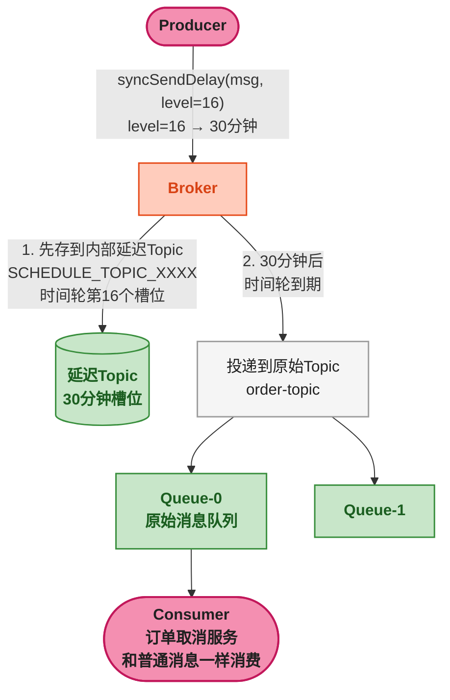
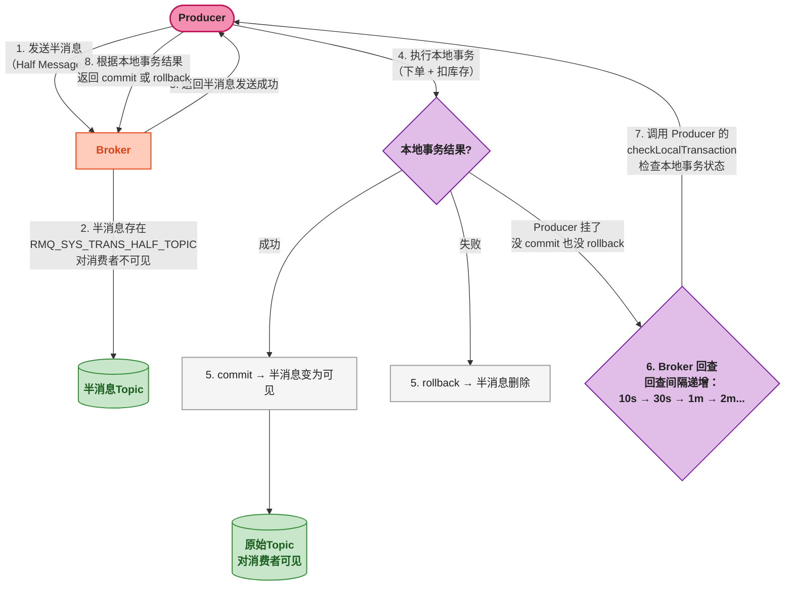

# RocketMQ 顺序消息、延迟消息与事务消息

> 📖 <strong>前置阅读</strong>：本文假设读者已掌握 SpringBoot RocketMQ 的基本操作（`RocketMQTemplate`、`@RocketMQMessageListener`）。如果还不熟悉，建议先阅读 [<strong>SpringBoot RocketMQ 全操作指南</strong>]()。

## 一、⚡ 问题切入：三种 RabbitMQ 做不到或做不好的事

RabbitMQ 六篇系列学完时留了几个坑——有些场景 RabbitMQ 不是不能用，而是做起来别扭：

| 需求 | RabbitMQ 方案 | 痛点 |
|------|--------------|------|
| 订单创建→支付→发货<strong>严格按序</strong> | 单队列 + 单消费者，关并发 | 吞吐量压到一条线；一旦重试入队顺序全乱 |
| <strong>30 分钟后</strong>自动取消 | Delayed Message 插件或 TTL+DLX | 插件生产不可靠；TTL+DLX 有消息时序问题 |
| <strong>下单 + 扣库存 + 发消息</strong>三件事原子执行 | 自己实现本地消息表 + 定时补偿 | 代码量大，维护麻烦 |

RocketMQ 对这三种场景都有<strong>原生支持</strong>——不是插件，不是 workaround，是设计时就考虑进去了。

## 二、顺序消息 —— 深度篇

### 2.1 上一篇回顾 + 补充

上一篇讲了基本用法：`syncSendOrderly` 用 `orderId` 哈希选 Queue，同一个 orderId 进同一个 Queue → 该 Queue 内 FIFO。消费端 `consumeMode = ConsumeMode.ORDERLY`。

但这只讲了正常流程。<strong>重试会破坏顺序</strong>——这是最容易踩的坑。

### 2.2 顺序消费的重试机制：挂起而非重入队

并发消费中，失败的消息通过 `RECONSUME_LATER` 进入重试 Topic，然后延迟重新投递。但顺序消费<strong>不能这么干</strong>——如果第 2 条消息失败后进了重试队列，第 3 条消息先被消费，顺序就乱了。

RocketMQ 的顺序消费对失败有特殊处理——<strong>挂起（suspend）而非重新入队</strong>：

```
同一个 Queue 的三条消息按序消费：
    [msg-1: 创建] → SUCCESS → [msg-2: 支付] → FAIL → 线程挂起 3s → [msg-2: 支付] 重试
                                                        ↓
                                                     [msg-3: 发货] 在原地等待
```

```java
@Component
@RocketMQMessageListener(
    topic = "order-topic",
    consumerGroup = "order-orderly-group",
    consumeMode = ConsumeMode.ORDERLY
)
public class OrderlyRetryListener
        implements RocketMQListener<OrderMessage> {

    @Override
    public void onMessage(OrderMessage msg) {
        try {
            processMessage(msg);
            // 成功 → 自动返回 CONSUME_SUCCESS
        } catch (Exception e) {
            log.error("顺序消费失败: orderId={}", msg.getOrderId(), e);
            // ⚠️ 关键：抛异常而非返回 RECONSUME_LATER
            // RocketMQ 会挂起当前 Queue 的消费 3 秒，然后重试同一条
            throw new RuntimeException("消费失败，挂起重试", e);
        }
    }
}
```

<strong>顺序消费模式下的几个硬性约束</strong>：

| 约束 | 原因 |
|------|------|
| <strong>不能开多线程并发处理</strong> | 同一个 Queue 只有一个消费线程 |
| <strong>不能把消息丢到线程池异步处理</strong> | 处理完才能拉下一条，异步会导致顺序乱 |
| <strong>失败后只能阻塞重试（挂起）</strong> | 不能跳过去处理后面的消息 |
| <strong>一个 Queue 对应一个消费线程</strong> | 不是全局单线程——不同 Queue 的消费线程是独立的 |

> ⚠️ 新手提示：顺序消费的<strong>失败重试没有上限</strong>——如果消息逻辑有 bug（如 NPE），它会一直挂起 → 重试 → 挂起，永远卡死这条 Queue。生产环境务必<strong>设置最大重试次数</strong>，超过后记录到死信表并手动跳过。

### 2.3 顺序消息的吞吐量瓶颈

顺序消费的吞吐量 = <strong>单个 Queue 的处理速度 × Queue 数量</strong>。

```
Topic: order (8 个 Queue)
ConsumerGroup: order-orderly-group (8 个消费者实例)

每个实例只负责 1 个 Queue，单线程消费：
    实例 1 → Queue-0 → 100 msg/s
    实例 2 → Queue-1 → 100 msg/s
    ...
    实例 8 → Queue-7 → 100 msg/s
    总吞吐量：800 msg/s
```

要提升吞吐量，<strong>增加 Queue 数量</strong>——但 Queue 创建后只能增加不能减少，且 Rebalance 会导致短暂消息重复。所以<strong>创建 Topic 时 Queue 数量要一步到位估算好</strong>。

## 三、延迟消息 —— 原生 18 级时间轮

### 3.1 RabbitMQ 延迟消息的遗留问题

快速回顾 RabbitMQ 的两种方案：

- <strong>TTL + DLX</strong>：不同 TTL 的消息在同一队列中会产生 head-of-line 阻塞——TTL=1分钟的消息被 TTL=30分钟的消息堵在队尾，1分钟后出不来
- <strong>Delayed Message 插件</strong>：可用，但非内核功能，云厂商托管版大多不支持

RocketMQ 的延迟消息是<strong>内核功能</strong>——不需要插件，不需要 DLX。原理是一条消息<strong>先存在一个延迟 Topic（SCHEDULE_TOPIC_XXXX）中</strong>，由内部的定时任务轮询——时间到了再投递到原始 Topic。

### 3.2 18 个固定延迟级别

<strong>关键限制</strong>：RocketMQ 不支持任意延迟时间（如"187 秒后就发"），只支持<strong> 18 个预设级别</strong>：

```
Level 1  →  1s
Level 2  →  5s
Level 3  →  10s
Level 4  →  30s
Level 5  →  1m
Level 6  →  2m
Level 7  →  3m
Level 8  →  4m
Level 9  →  5m
Level 10 →  6m
Level 11 →  7m
Level 12 →  8m
Level 13 →  9m
Level 14 →  10m
Level 15 →  20m
Level 16 →  30m
Level 17 →  1h
Level 18 →  2h
```

<strong>为什么是固定级别而不是任意时间？</strong> RocketMQ 内部用一个时间轮（TimerWheel）管理延迟消息。18 个级意味着只需要 18 个槽位，定时精度可控。如果支持毫秒级任意延迟，时间轮复杂度急剧上升。对绝大多数业务场景来说，"30 分钟后取消订单"用 Level 16，"5 分钟后发提醒"用 Level 9——足够用了。

### 3.3 发送延迟消息

```java
@Service
public class DelayMessageService {

    @Autowired
    private RocketMQTemplate rocketMQTemplate;

    // 下单后 30 分钟检查支付状态（Level 16 = 30m）
    public void scheduleCancelCheck(Long orderId) {
        OrderMessage msg = new OrderMessage();
        msg.setOrderId(orderId);
        msg.setAction("timeout.cancel");

        // syncSendDelay——指定延迟级别
        SendResult result = rocketMQTemplate.syncSendDelay(
            "order-topic:timeout.cancel",
            msg,
            16   // ← Level 16 = 30 分钟延迟
        );
        System.out.printf("延迟消息已发送: orderId=%d, level=16(30m)%n", orderId);
    }

    // 5 分钟后发提醒（Level 9 = 5m）
    public void scheduleReminder(Long orderId) {
        OrderMessage msg = new OrderMessage();
        msg.setOrderId(orderId);
        msg.setAction("reminder");

        rocketMQTemplate.syncSendDelay(
            "order-topic:reminder", msg, 9
        );
    }

    // 1 小时后检查退款（Level 17 = 1h）
    public void scheduleRefundCheck(Long orderId) {
        OrderMessage msg = new OrderMessage();
        msg.setOrderId(orderId);
        msg.setAction("refund.check");

        rocketMQTemplate.syncSendDelay(
            "order-topic:refund.check", msg, 17
        );
    }
}
```

消费者和普通消息完全一样——<strong>消费者感知不到延迟</strong>：

```java
@Component
@RocketMQMessageListener(
    topic = "order-topic",
    consumerGroup = "order-timeout-group",
    selectorExpression = "timeout.cancel"
)
public class OrderTimeoutListener
        implements RocketMQListener<OrderMessage> {

    @Override
    public void onMessage(OrderMessage msg) {
        // 30 分钟后才收到这条消息——消费者无感知
        Order order = orderMapper.selectById(msg.getOrderId());
        if ("PENDING_PAY".equals(order.getStatus())) {
            orderService.cancel(order.getId());
            log.info("订单 {} 超时未支付，已自动取消", msg.getOrderId());
        }
    }
}
```



### 3.4 自定义延迟级别

如果 18 级不够用（比如需要 15 分钟、45 分钟），可以在 Broker 配置中调整：

```properties
# broker.conf——自定义延迟级别（空格分隔的毫秒数×级别）
messageDelayLevel = 1s 5s 10s 30s 1m 2m 3m 4m 5m 6m 7m 8m 9m 10m 15m 20m 30m 45m 1h 2h
```

> ⚠️ 新手提示：修改 `messageDelayLevel` 后需要<strong>重启 Broker</strong>。支持最多定义到毫秒——但增加级别会增加时间轮扫描开销，建议控制在 30 级以内。

## 四、事务消息 —— RocketMQ 的最强差异化能力

### 4.1 问题：这个需求为什么这么难？

```
业务：下单 → 扣库存 → 发消息通知物流系统启动发货流程

要求：这三件事要么全成功，要么全失败。
      - 如果下单成功但发消息失败 → 物流系统不知道有新订单 → 永远不会发货
      - 如果发消息成功但下单失败 → 物流收到一个不存在的订单
```

常规方案——<strong>本地消息表</strong>：

```
1. 开启 DB 事务
2. 下单 + 扣库存 + 插入一条消息记录（都在同一事务中）
3. 提交事务
4. 定时任务扫描未发送的消息记录 → 发送到 MQ → 标记已发送
```

这个方案<strong>确实可行</strong>，但需要：
- 一张额外的消息表
- 一个定时任务 + 扫描逻辑
- 处理消息重复发送 + 消费者幂等
- 消息失败重试的指数退避逻辑

代码量轻松上 500 行，而且每个需要事务消息的业务都要抄一遍。

RocketMQ 把这件事做进了<strong>内核</strong>——事务消息不需要额外表、不需要定时任务。

### 4.2 半消息（Half Message）原理

RocketMQ 的事务消息基于<strong>两阶段提交 + 回查</strong>：



<strong>流程分步解释</strong>：

| 阶段 | 发生了什么 | 消费者看得到吗 |
|------|-----------|:---:|
| <strong>1 ~ 3: 半消息</strong> | Producer 发一条"半消息"到 Broker。Broker 存下来，但消息处于"对消费者不可见"状态 | 看不到 |
| <strong>4: 本地事务</strong> | Producer 执行本地业务（下单 + 扣库存） | — |
| <strong>5: commit / rollback</strong> | 本地事务成功 → commit，半消息变为可见；失败 → rollback，Broker 删除半消息 | commit 后可见 |
| <strong>6 ~ 8: 回查（兜底）</strong> | 如果 Producer 在 commit/rollback 之前挂了，Broker 会定期主动回查 Producer——"你那个半消息对应的本地事务到底成功了没有？" | — |

<strong>回查是关键兜底</strong>：Producer 崩溃、网络断连、Broker 没收到 commit/rollback——回查机制保证了消息最终要么被提交（消费者可见）要么被回滚（删除）。

### 4.3 SpringBoot 事务消息完整实现

<strong>发送端</strong>——实现 `RocketMQLocalTransactionListener`：

```java
@Service
public class OrderTransactionService {

    @Autowired
    private RocketMQTemplate rocketMQTemplate;
    @Autowired
    private OrderMapper orderMapper;
    @Autowired
    private InventoryMapper inventoryMapper;

    // ----- 发送事务消息（下单 + 扣库存） -----
    public SendResult createOrderWithTransaction(OrderMessage msg) {
        // 构建消息
        Message<String> message = MessageBuilder
                .withPayload(JSON.toJSONString(msg))
                .build();

        // sendMessageInTransaction：发送半消息 + 执行本地事务
        // 参数1：Topic:Tag
        // 参数2：Message
        // 参数3：额外参数（传给 executeLocalTransaction，可为 null）
        TransactionSendResult result = rocketMQTemplate.sendMessageInTransaction(
            "order-topic:created",
            message,
            msg.getOrderId()    // 传给 executeLocalTransaction 的 arg
        );

        System.out.printf("事务消息发送: msgId=%s, status=%s%n",
                result.getMsgId(), result.getLocalTransactionState());
        return result;
    }
}

// ----- 本地事务监听器 —— 执行本地事务 + 回查 -----
@RocketMQTransactionListener
public class OrderTransactionListener
        implements RocketMQLocalTransactionListener {

    @Autowired
    private OrderMapper orderMapper;
    @Autowired
    private InventoryMapper inventoryMapper;

    @Override
    public RocketMQLocalTransactionState executeLocalTransaction(
            Message msg, Object arg) {

        Long orderId = (Long) arg;
        OrderMessage orderMsg = JSON.parseObject(
                new String((byte[]) msg.getPayload()), OrderMessage.class);

        try {
            // 本地事务：下单 + 扣库存
            orderMapper.insert(orderMsg.toOrder());
            inventoryMapper.deduct(orderMsg.getProductId(),
                                   orderMsg.getQuantity());

            // 本地事务成功 → 提交半消息 → 消费者可见
            return RocketMQLocalTransactionState.COMMIT;

        } catch (Exception e) {
            log.error("本地事务失败: orderId={}", orderId, e);
            // 本地事务失败 → 回滚半消息 → Broker 删除
            return RocketMQLocalTransactionState.ROLLBACK;
        }
        // ⚠️ 注意：不要返回 UNKNOWN——
        // 返回 UNKNOWN 会触发回查，但本地事务已经失败了，
        // 回查查到的还是失败，浪费一次回查调用
    }

    @Override
    public RocketMQLocalTransactionState checkLocalTransaction(
            MessageExt msg) {

        // Broker 回查——检查本地事务是否真的执行了
        String body = new String(msg.getBody());
        OrderMessage orderMsg = JSON.parseObject(body, OrderMessage.class);

        // 查 DB：订单存不存在？
        Order order = orderMapper.selectById(orderMsg.getOrderId());

        if (order != null) {
            // 订单存在 → 本地事务已提交 → commit
            return RocketMQLocalTransactionState.COMMIT;
        } else {
            // 订单不存在 → 本地事务失败/未执行 → rollback
            return RocketMQLocalTransactionState.ROLLBACK;
        }
    }
}
```

<strong>逐行解释关键回调</strong>：

| 方法 | 调用时机 | 职责 | 返回值 |
|------|---------|------|------|
| `executeLocalTransaction` | 半消息发送成功后立即调用 | 执行本地事务（下单+扣库存） | `COMMIT` → 消息对消费者可见；`ROLLBACK` → 消息删除；`UNKNOWN` → 触发回查 |
| `checkLocalTransaction` | Producer 一段时间未响应 commit/rollback | 检查 DB 中本地事务的状态 | `COMMIT` 或 `ROLLBACK`——必须返回明确结果 |

> ⚠️ 新手提示：`checkLocalTransaction` 可能被<strong>多次调用</strong>——第一次回查返回 `UNKNOWN` 时，Broker 会间隔递增地继续回查（10s → 30s → 1m → 2m → ...），总共最多 15 次。所以回查逻辑必须做幂等——反复查 DB 的同一个订单 ID，结果应该一致。

### 4.4 事务消息的几个硬约束

| 约束 | 说明 |
|------|------|
| <strong>超时时间 6 秒</strong> | `executeLocalTransaction` 默认 6 秒超时，超时返回 `UNKNOWN`，触发回查。如果本地事务需要更长时间，通过 `setSendMsgTimeout` 调整 |
| <strong>回查最多 15 次</strong> | 15 次后如果仍返回 `UNKNOWN`，Broker 丢弃这条消息 |
| <strong>不能用于超大事务</strong> | 本地事务执行时间越短越好——分布式事务的本质是尽快在本地完成，只把最终通知交给 MQ |
| <strong>消费者仍然需要幂等</strong> | 半消息 commit 后消费者才看到——但回查期间的重复 commit 可能导致消息被投递多次 |

## 五、🎯 总结

本文深入了 RocketMQ 最区别于 RabbitMQ 的三大特性：

1. <strong>顺序消息</strong>：同一个 orderId 哈希到同一个 Queue，该 Queue 内严格 FIFO。消费失败后挂起重试而非重新入队——保证顺序不被打乱。代价是吞吐量受限：单 Queue 单线程。

2. <strong>延迟消息</strong>：18 个固定级别，通过 `syncSendDelay` 第二个参数指定。内部使用时间轮——消息先存到 `SCHEDULE_TOPIC_XXXX`，到期后投递到原始 Topic。不需要插件，不需要 DLX。可自定义级别但需重启 Broker。

3. <strong>事务消息</strong>：半消息 + 两阶段提交 + 回查。`executeLocalTransaction` 执行本地事务，`checkLocalTransaction` 作兜底回查。不需要额外的消息表或定时任务——RocketMQ 内核完成所有协调工作。这是 RocketMQ 最强的差异化能力。

> 📖 <strong>下一步阅读</strong>：消息发出去了，但生产者挂了怎么办？消费者处理失败怎么重试？继续阅读 [<strong>消息可靠性与容错</strong>]()，一篇讲透 ACK、重试、死信队列、主从同步和消息幂等。
