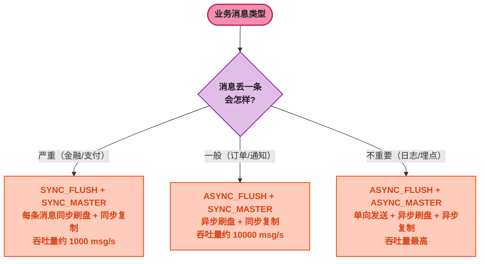

# RocketMQ 消息可靠性与容错

> 📖 <strong>前置阅读</strong>：本文假设读者已掌握 SpringBoot RocketMQ 的发送和消费操作。如果还不熟悉，建议先阅读 [<strong>SpringBoot RocketMQ 全操作指南</strong>]()。

## 一、⚡ 消息可能丢在哪？

和 RabbitMQ 一样，RocketMQ 的消息丢失也分三个环节：

```
Producer  →  [网络]  →  Broker  →  [网络]  →  Consumer
   ① 发送丢失      ② Broker 宕机丢失      ③ 消费失败丢失
```

在 RocketMQ 中，生产者端没有 RabbitMQ 的 Publisher Confirm——替代方案是<strong>同步发送 + 返回值判断</strong>。Broker 端的持久化取决于<strong>刷盘策略</strong>和<strong>主从同步</strong>。消费端靠<strong>消费状态返回 + 重试 + 死信</strong>。

## 二、① 生产者端：同步发送判断返回值

RocketMQ 没有 RabbitMQ 的 `ConfirmCallback` 异步通知机制，但 `syncSend` 本身就是同步等待 Broker 确认——返回 `SEND_OK` 说明消息已写入 CommitLog：

```java
@Service
public class ReliableProducer {

    @Autowired
    private RocketMQTemplate rocketMQTemplate;

    public void sendReliably(OrderMessage msg) {
        // syncSend 是同步阻塞的——返回 SEND_OK 才说明 Broker 已接收
        SendResult result = rocketMQTemplate.syncSend(
            "order-topic:created", msg);

        if (SendStatus.SEND_OK.equals(result.getSendStatus())) {
            log.info("消息已确认到达 Broker: msgId={}", result.getMsgId());
        } else {
            // 只有 SEND_OK 才认为成功——FLUSH_DISK_TIMEOUT 等状态说明刷盘超时
            log.error("消息发送未确认: status={}", result.getSendStatus());
            // 补偿：写入 DB 重试表
            saveToRetryTable(msg);
        }
    }
}
```

`SendStatus` 的四种返回值：

| 状态 | 含义 | 可靠性 |
|------|------|:---:|
| `SEND_OK` | Broker 已收到消息并写入 CommitLog | 高 |
| `FLUSH_DISK_TIMEOUT` | Broker 收到但刷盘超时（仅 `flushDiskType=SYNC_FLUSH` 时可能） | 中（在内存中，宕机丢失） |
| `FLUSH_SLAVE_TIMEOUT` | Master 收到但同步到 Slave 超时（仅 `brokerRole=SYNC_MASTER` 时可能） | 中（Slave 无副本） |
| `SLAVE_NOT_AVAILABLE` | Master 收到但 Slave 不可用 | 低（无备份） |

<strong>生产建议</strong>：判断 `SEND_OK` 才认为消息可靠到达。其他状态一律走补偿逻辑——写入重试表或直接告警。

## 三、② Broker 端：刷盘策略与主从同步

### 3.1 同步刷盘 vs 异步刷盘

RocketMQ 的消息先写入内存的 CommitLog，然后<strong>异步或同步</strong>刷到磁盘：

| 刷盘模式 | Broker 配置 | 行为 | 性能 | 可靠性 |
|----------|------------|------|:---:|:---:|
| <strong>ASYNC_FLUSH</strong>（默认） | `flushDiskType=ASYNC_FLUSH` | 消息写入 OS PageCache 后立即返回 ACK，后台线程定期刷盘（默认 500ms） | 最高 | 宕机可能丢失 500ms 内的消息 |
| <strong>SYNC_FLUSH</strong> | `flushDiskType=SYNC_FLUSH` | 消息写入磁盘后才返回 ACK | 低（约 1/10） | 最高——写入磁盘后才确认 |

```properties
# broker.conf——同步刷盘
flushDiskType = SYNC_FLUSH
```

<strong>绝大多数业务用 ASYNC_FLUSH 足够</strong>——配合主从同步，Master 宕机后 Slave 上也有消息副本。只有金融交易、支付确认这类"一条都不能丢"的场景才开 SYNC_FLUSH。

### 3.2 主从同步——刷盘只保证单机不丢，主从保证节点宕机不丢

CommitLog 刷盘只保证<strong>写入该 Broker 的磁盘</strong>。如果整台机器宕机（磁盘坏了、电源炸了），需要<strong>另一个节点有副本</strong>。

| 主从模式 | Broker 配置 | 行为 | 可靠性 |
|----------|------------|------|:---:|
| <strong>ASYNC_MASTER</strong> | `brokerRole=ASYNC_MASTER` | Master 写入后立即返回 ACK，后台异步复制到 Slave | 宕机可能丢失少量未同步的消息 |
| <strong>SYNC_MASTER</strong> | `brokerRole=SYNC_MASTER` | Master 等待 Slave 确认收到后才返回 ACK | 最高——Master 宕机 Slave 有完整副本 |

```properties
# broker.conf——同步主从
brokerRole = SYNC_MASTER
```

<strong>生产建议</strong>：关键业务的 Master 配 `SYNC_MASTER` + 至少一台 Slave。非关键业务（日志）用 `ASYNC_MASTER`。`SYNC_FLUSH` 和 `SYNC_MASTER` 通常不同时开——前者拖慢单机吞吐，后者保证跨节点冗余。

### 3.3 可靠性配置组合



## 四、③ 消费者端：重试与死信队列

### 4.1 消费重试机制

消费者返回 `RECONSUME_LATER` 或抛异常时，RocketMQ 自动将消息送入重试队列——<strong>不需要手动调用任何 NACK 方法</strong>，这和 RabbitMQ 的 `basicNack(requeue=true)` 完全不同。

```java
@Component
@RocketMQMessageListener(
    topic = "order-topic",
    consumerGroup = "order-consumer-group"
)
public class OrderRetryListener
        implements RocketMQListener<OrderMessage> {

    @Override
    public void onMessage(OrderMessage msg) {
        try {
            processOrder(msg);
            // 正常返回 → 消费成功 → offset 推进
        } catch (RetryableException e) {
            // 可重试异常 → 抛出去 → RocketMQ 自动重试
            throw new RuntimeException("临时失败，重试", e);
        } catch (NonRetryableException e) {
            // 不可重试异常（数据格式错误等）→ 记录日志并吞掉
            log.error("消息格式错误，跳过: orderId={}", msg.getOrderId(), e);
            // 正常返回 → 消费成功 → 这条坏消息被消费掉（不再重试）
        }
    }
}
```

重试间隔是<strong>递增的</strong>：

```
重试次数     等待时间
第 1 次  →   10s
第 2 次  →   30s
第 3 次  →   1m
第 4 次  →   2m
第 5 次  →   3m
第 6 次  →   4m
第 7 次  →   5m
第 8 次  →   6m
第 9 次  →   7m
第 10 次 →   8m
第 11 次 →   9m
第 12 次 →   10m
第 13 次 →   20m
第 14 次 →   30m
第 15 次 →   1h
第 16 次 →   2h   ← 默认最大重试 16 次
```

> ⚠️ 新手提示：RocketMQ 的重试消息实际发送到了一个特殊的 Topic——`%RETRY%{consumerGroup}`。Broker 在这个 Topic 上设置了延迟级别（对应上表的等待时间）。消费者<strong>无感知</strong>——重试消息和正常消息一样进入 `onMessage`。

### 4.2 死信队列 —— 重试 16 次后的归宿

重试 16 次仍然失败时，消息不再投递——进入<strong>死信 Topic</strong>：`%DLQ%{consumerGroup}`。

<strong>不需要手动配置死信队列</strong>——RocketMQ 自动创建。但需要编写消费者监听死信 Topic 来发现问题：

```java
@Component
@RocketMQMessageListener(
    topic = "%DLQ%order-consumer-group",   // ← 死信 Topic
    consumerGroup = "order-dlq-consumer-group"
)
public class OrderDLQListener
        implements RocketMQListener<MessageExt> {

    @Override
    public void onMessage(MessageExt msg) {
        // MessageExt 包含原始消息的全部信息
        log.error("死信消息: msgId={}, topic={}, tag={}, body={}, reconsumeTimes={}",
                msg.getMsgId(),
                msg.getTopic(),      // 原始 Topic
                msg.getTags(),       // 原始 Tag
                new String(msg.getBody()),
                msg.getReconsumeTimes()  // 重试次数
        );
        // 发告警、记录 DB、通知人工处理...
    }
}
```

### 4.3 与 RabbitMQ 的可靠性机制对比

| 机制 | RabbitMQ | RocketMQ |
|------|---------|---------|
| <strong>生产者确认</strong> | Publisher Confirm（NACK → 重新发送） | 同步发送后判断 `SendStatus` |
| <strong>Broker 持久化</strong> | 消息 + Exchange + Queue 三者持久化 | CommitLog 顺序写 + 刷盘策略 |
| <strong>消费确认</strong> | 手动 `basicAck` / `basicNack` | 返回 `CONSUME_SUCCESS` 或抛异常 |
| <strong>重试机制</strong> | 手动 `basicNack(requeue=true)` | 自动进 `%RETRY%` Topic，16 次递增间隔 |
| <strong>死信</strong> | 手动配置 DLX + DLQ | 自动进入 `%DLQ%` Topic |
| <strong>跨节点冗余</strong> | 镜像队列 / 仲裁队列 | 主从同步（SYNC_MASTER / ASYNC_MASTER） |

## 五、消息幂等 —— 重复消费的防线

### 5.1 RocketMQ 什么情况下会重复

| 场景 | 原因 |
|------|------|
| Producer 超时重发 | `syncSend` 超时但 Broker 实际已写入——Producer 重发同一条 |
| Consumer Rebalance | 消费者实例增减时，Queue 重新分配——正在处理的 offset 可能回退 |
| 主从切换 | Master 宕机 → Slave 提升为新 Master，offset 可能回退 |

RocketMQ <strong>不保证 exactly-once</strong>——消费者端必须自己做幂等。

### 5.2 幂等实现

核心思路和 RabbitMQ 一样——用消息的唯一 Key 去重：

```java
@Component
@RocketMQMessageListener(
    topic = "order-topic",
    consumerGroup = "order-consumer-group"
)
public class IdempotentOrderListener
        implements RocketMQListener<MessageExt> {  // 注意：泛型是 MessageExt 以获取 msgId

    @Autowired
    private RedisTemplate<String, String> redisTemplate;

    @Override
    public void onMessage(MessageExt msg) {
        // RocketMQ 每条消息有全局唯一的 msgId
        String msgId = msg.getMsgId();
        String orderId = msg.getKeys();    // 发送时 setKeys 设置的业务 Key
        String idempotentKey = orderId != null ? orderId : msgId;

        // SETNX 原子判重
        Boolean firstTime = redisTemplate.opsForValue()
                .setIfAbsent("rocketmq:consumed:" + idempotentKey,
                        "1", Duration.ofHours(24));

        if (Boolean.FALSE.equals(firstTime)) {
            log.warn("重复消息，跳过: msgId={}, keys={}", msgId, orderId);
            return;  // 正常返回 → offset 推进
        }

        try {
            OrderMessage orderMsg = JSON.parseObject(
                    new String(msg.getBody()), OrderMessage.class);
            processOrder(orderMsg);
        } catch (Exception e) {
            // 处理失败 → 删除幂等标记，让重试时可以重新处理
            redisTemplate.delete("rocketmq:consumed:" + idempotentKey);
            throw new RuntimeException("消费失败，回滚幂等标记", e);
        }
    }
}
```

<strong>建议用业务 Key 而非 msgId</strong>：

```java
// 发送时设置业务 Key
Message<String> message = MessageBuilder
        .withPayload(JSON.toJSONString(orderMsg))
        .setHeader(MessageConst.PROPERTY_KEYS, "order:10001:created")
        .build();
rocketMQTemplate.syncSend("order-topic:created", message);
```

因为 Producer 超时重发时，两条消息的 `msgId` 不同但业务相同——用 `msgId` 去重就无效了。用业务 Key（`order:10001:created`）去重更可靠。

## 六、🎯 三个防线总结

```
生产者端                          Broker端                          消费者端
① 同步发送                ② 刷盘 + 主从同步                   ③ 重试 + 死信 + 幂等
syncSend                    ASYNC/SYNC_FLUSH                   抛异常自动重试
判断 SEND_OK                + ASYNC/SYNC_MASTER                16次后进%DLQ%
失败写重试表                按业务重要性选配置                    SETNX去重
```

| 防线 | 机制 | 配置 |
|------|------|------|
| ① 生产者 | 同步发送 + 判断 `SendStatus` | `syncSend`，判断 `SEND_OK` |
| ② Broker | CommitLog 刷盘 + 主从同步 | `flushDiskType` + `brokerRole` |
| ③ 消费者 | 抛异常自动重试 + 死信 Topic + 幂等去重 | 16 次递增重试，`%DLQ%` 自动创建，业务 Key 去重 |

> 📖 <strong>下一步阅读</strong>：消费端的可靠性搞定了，但"集群消费还是广播消费"、"消息什么时候推什么时候拉"、"100 种 Tag 怎么过滤"这些问题还没讲。继续阅读 [<strong>消费者模式与过滤器</strong>]()，一篇覆盖集群/广播、Push/PULL、Tag/SQL 过滤和 Rebalance 机制。
