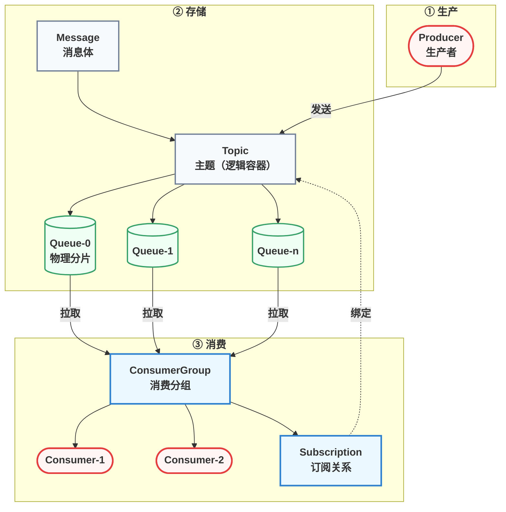
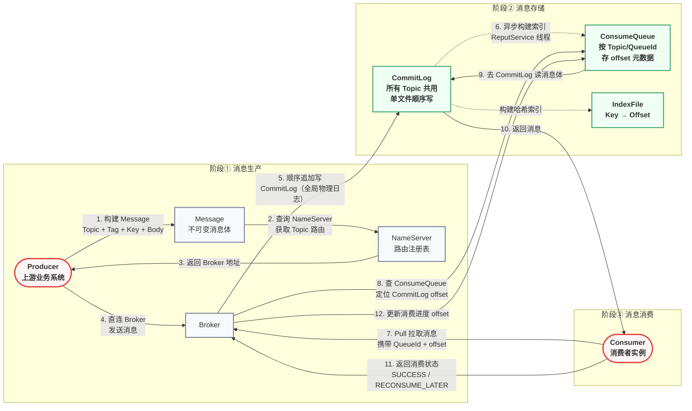
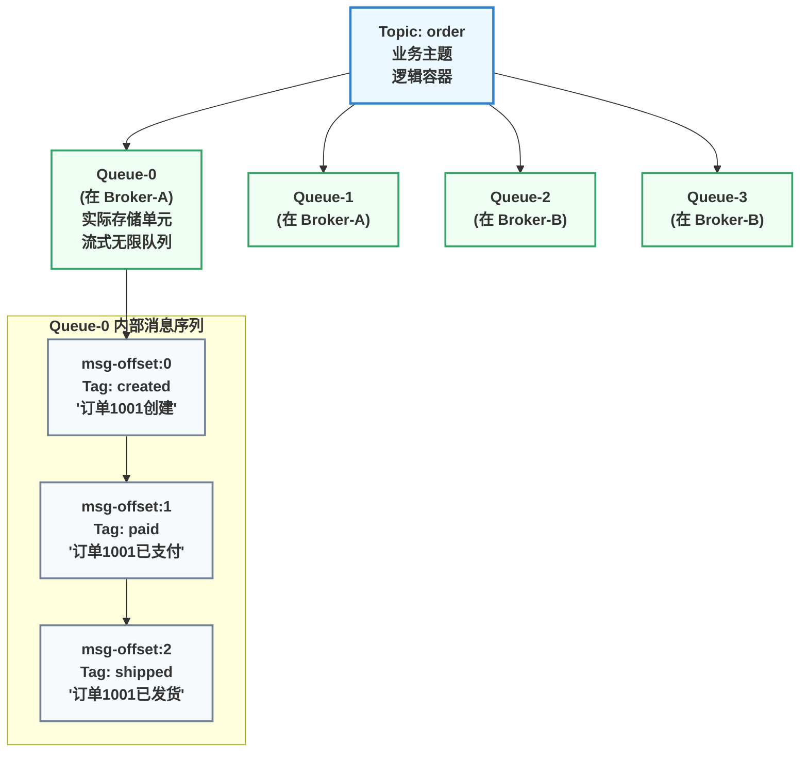
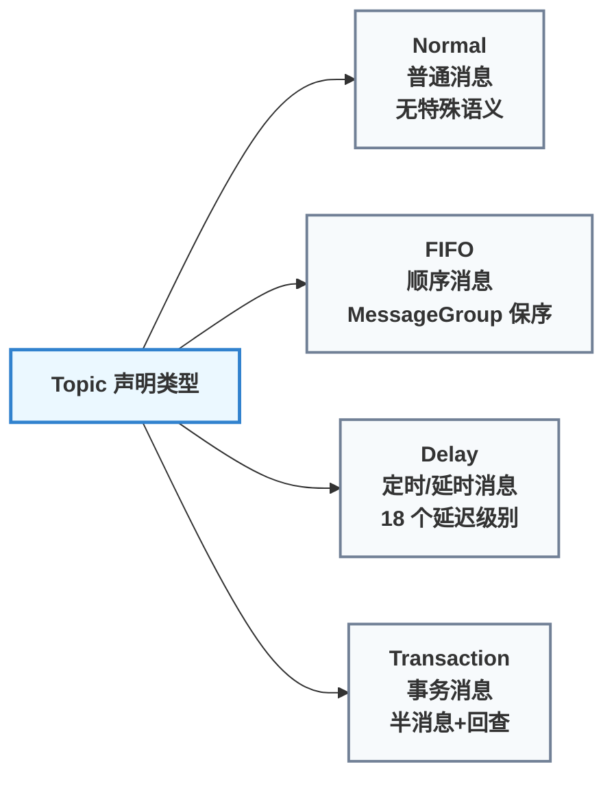
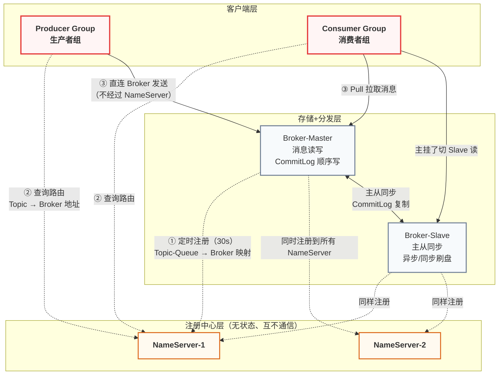
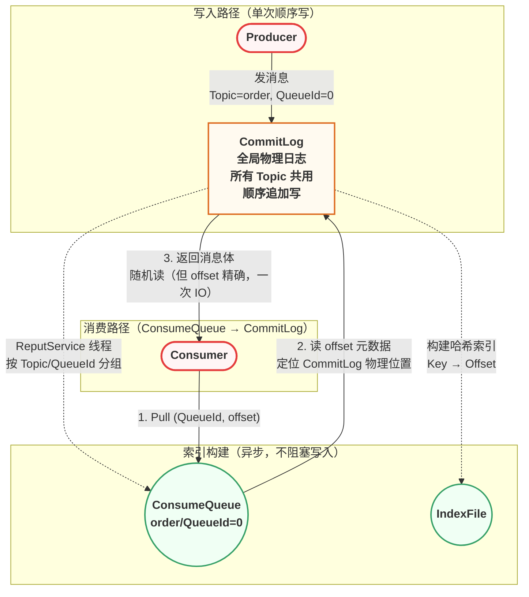
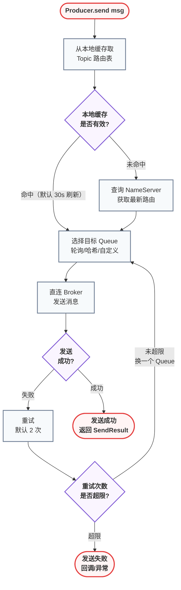
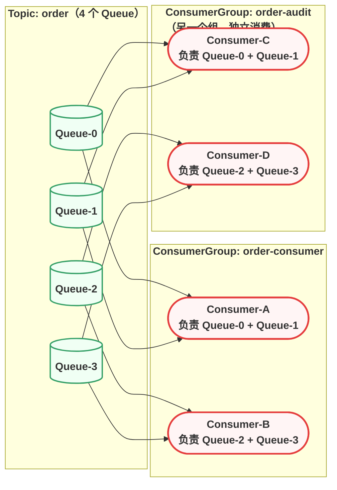
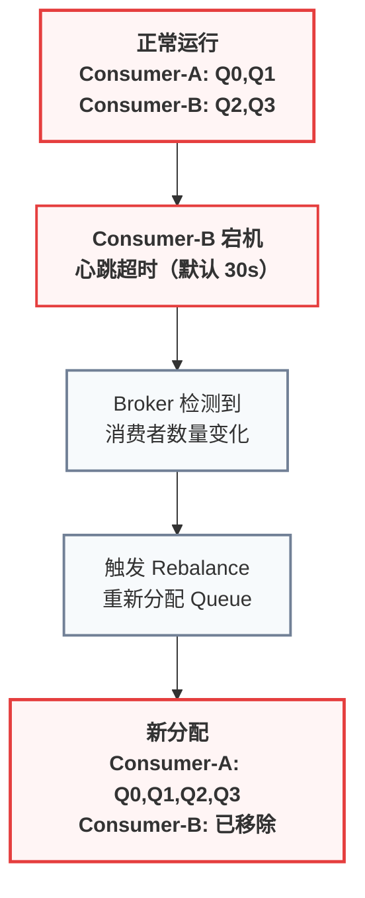
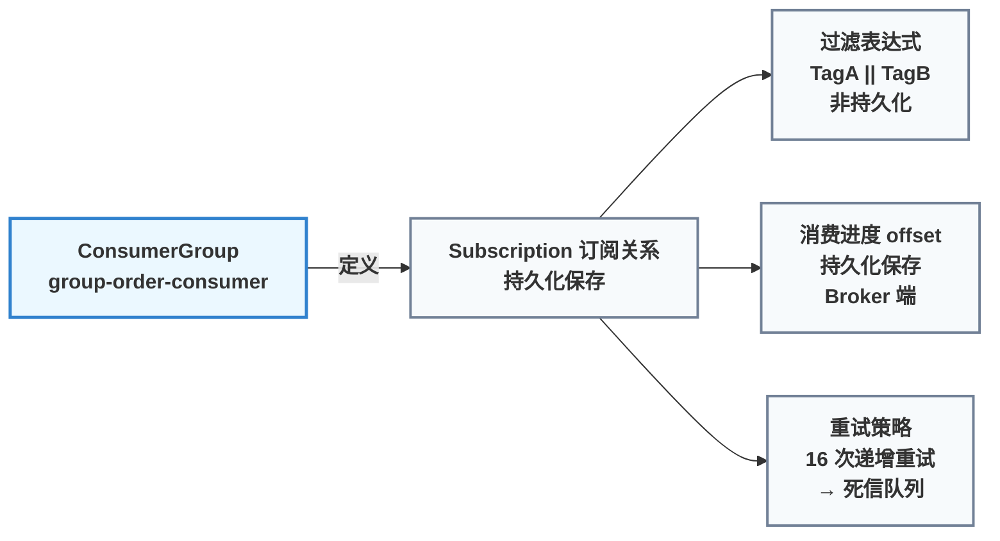

# 领域模型与存储引擎

> 📖 <strong>前置阅读</strong>：本文假设读者已理解消息队列的基本价值（异步、解耦、削峰填谷）。如果还不熟悉消息队列，建议先阅读 [<strong>RabbitMQ 核心概念与 AMQP 协议</strong>]()。

---

## 一、问题切入：为什么 RocketMQ 的概念比 RabbitMQ 多？

RabbitMQ 学完六篇，Exchange / Binding / Queue 的路由模型印象深刻——概念不多，全靠灵活组合。翻开 RocketMQ 的文档，一眼扫过去：Producer、Consumer、Topic、Queue、ConsumerGroup、Subscription、Broker、NameServer……光领域概念就七个，外加两个部署组件。

**这不是设计过度，而是 RocketMQ 把"谁负责发、谁负责收、怎么分组、怎么扩容、消息存哪里、谁管路由"全部显式拆开了。** RabbitMQ 用少数概念的组合来表达这些维度，RocketMQ 选择每件事都定义一个独立概念。

好处是每个概念职责单一，坏处是初学者一看就晕——概念之间谁包谁、谁管谁、谁和谁是平等的，不看图根本理不清。

所以这篇不讲"先记住七个概念"——先看一张全景图，把七者的层级关系钉在脑子里。

---

## 二、领域模型全景：一张图串起七个概念

Apache RocketMQ 官方把领域模型定义为七个核心概念。这是一张按**层级包含关系**组织的全景图：



这张图的阅读顺序：从左到右，**消息从 Producer 出发 → 经过 Topic → 落入 Queue → 被 ConsumerGroup 内的 Consumer 拉取**。关键层级关系：

| 包含关系 | 说明 |
|----------|------|
| Topic 包含 Queue | Topic 是逻辑容器，Queue 是实际存储实体。一个 Topic 至少一个 Queue |
| ConsumerGroup 包含 Consumer | 同一个组内的多个 Consumer 共同分担消息，实现水平扩展 |
| ConsumerGroup 定义 Subscription | 订阅关系以消费分组为粒度——过滤规则、重试策略、消费进度都在这里 |

> ⚠️ 新手提示：记住两个"不等于"—— Producer 不等于一个线程（它是个逻辑名，背后可有多个连接），ConsumerGroup 不等于一个进程（它是多个 Consumer 实例组成的逻辑分组）。

---

## 三、消息的生命周期：三阶段全景

理解了七个概念的位置，再看一条消息走完一生的三个阶段：



三个阶段的核心要点：

| 阶段 | 最关键的决策 | 为什么 |
|------|-------------|--------|
| **生产** | NameServer 只存路由，消息不经过它 | 避免注册中心成为流量瓶颈——这也是和 ZooKeeper 方案的本质区别 |
| **存储** | 所有 Topic 的消息写入同一个 CommitLog | 把随机写变顺序写——这是吞吐量比 RabbitMQ 高 1 ~ 2 个数量级的根源 |
| **消费** | Consumer 主动 Pull，不是 Broker Push | 消费者按自己的处理能力拉取——慢消费者不会被打崩 |

---

## 四、Topic 与 Queue：逻辑容器与物理分片

官方文档对 Topic 的定义是"消息传输和存储的顶层容器"，对 Queue 的定义是"消息传输和存储的实际单元容器"。两者的层级关系：



Queue 的几个硬约束必须记住：

| 约束 | 说明 | 实践含义 |
|------|------|---------|
| **Queue 内严格有序** | 同一 Queue 内的消息按写入顺序消费 | 需要顺序消费时，把同类消息发到同一 Queue |
| **跨 Queue 无序** | Queue-0 的消息可能比 Queue-1 先写但后消费 | 不关心顺序时无所谓，关心顺序时必须用 MessageGroup |
| **Queue 数量只增不减** | 创建 Topic 后 Queue 数可以加但不能减 | 初期别设太大——Queue 数量决定最大并发消费者数 |
| **至少一个 Queue** | 每个 Topic 至少分配一个 Queue | — |

> ⚠️ 新手提示：Queue 的数量直接决定了消费端的最大并发度。4 个 Queue 意味着同一个 ConsumerGroup 内最多 4 个消费者实例真正干活——第 5 个实例分不到 Queue，会在旁边待着不动。扩容前先看 Queue 数够不够。

### 消息类型：一个 Topic 只能是一种类型

RocketMQ 5.x 起强制校验消息类型——发到 Topic 的消息类型必须和 Topic 声明的一致：



| 类型 | 适用场景 | 关键技术点 |
|------|---------|-----------|
| **Normal** | 绝大多数业务消息 | 无特殊处理，吞吐最高 |
| **FIFO** | 订单状态变更、流水记录 | 消息携带 MessageGroup，同一 Group 内严格有序 |
| **Delay** | 超时关单、延迟通知 | 18 个延迟级别（1s ~ 2h），不用额外插件 |
| **Transaction** | 下单+扣库存+发消息原子性 | 半消息 + 本地事务 + 回查——RocketMQ 最强特性 |

> ⚠️ 新手提示：如果向一个声明为 FIFO 类型的 Topic 发送 Normal 消息，5.x 服务端会直接拒绝并抛异常。这和 RabbitMQ 的"什么都往 Queue 里塞"不一样——RocketMQ 对类型更严格。

---

## 五、NameServer 与 Broker：为什么不需要 ZooKeeper

RocketMQ 的架构是**星型拓扑**——Producer 和 Consumer 不与对方直连，统一通过 Broker 通信。路由信息靠 NameServer。



NameServer 的本质——内存里的一张 HashMap：

```java
// NameServer 路由表的逻辑结构（伪代码，数据结构还原）
Map<String, List<QueueData>> topicQueueTable = new HashMap<>();
// "TopicA" → [
//   { brokerName: "broker-a", readQueueNums: 8, writeQueueNums: 8 },
//   { brokerName: "broker-b", readQueueNums: 8, writeQueueNums: 8 }
// ]

Map<String, BrokerData> brokerAddrTable = new HashMap<>();
// "broker-a" → {
//   cluster: "DefaultCluster",
//   brokerAddrs: { 0: "192.168.1.10:10911" },
//   brokerAddrsSlave: { 1: "192.168.1.11:10911" }
// }
```

| 维度 | RocketMQ NameServer | Kafka ZooKeeper |
|------|:---:|:---:|
| **一致性** | 最终一致（心跳驱动） | 强一致（ZAB 协议） |
| **节点通信** | 互不通信，各管各 | 集群模式，Leader 选举 |
| **部署复杂度** | 一个 jar，无外部依赖 | 需独立部署 ZK 集群 |
| **故障影响** | 一个 NameServer 挂了换另一个 | ZK 集群半数以上存活才可用 |

NameServer 之间**互不通信**——每个 Broker 向**所有** NameServer 独立注册。代价是路由数据可能短暂不一致（Broker 刚注册到 NS-1 还没注册到 NS-2），但对消息中间件来说，毫秒级的最终一致性完全不是问题。

---

## 六、存储引擎：CommitLog + ConsumeQueue + IndexFile

这是 RocketMQ 性能最高的设计——**把随机写变成顺序写**。



三种存储文件的分工：

| 文件 | 存什么 | 写模式 | 位置 |
|------|--------|--------|------|
| **CommitLog** | 所有消息的原始内容（全量） | 顺序追加写 | `$HOME/store/commitlog/` |
| **ConsumeQueue** | 每条消息的 commitLogOffset + size + tag hash | 顺序追加写（异步） | `$HOME/store/consumequeue/{topic}/{queueId}/` |
| **IndexFile** | Key → CommitLog offset 的哈希索引 | 顺序追加写（异步） | `$HOME/store/index/` |

CommitLog 是核心，ConsumeQueue 是索引。这个设计的精髓：

```text
CommitLog（全局物理日志，顺序写）
├── offset: 0          → Topic=order, QueueId=0, body="订单1001创建"...
├── offset: 1024       → Topic=stock, QueueId=2, body="库存扣减5件"...
├── offset: 2048       → Topic=order, QueueId=1, body="订单1002创建"...
├── offset: 3072       → Topic=user,  QueueId=0, body="用户注册"...
└── offset: 4096       → Topic=order, QueueId=0, body="订单1001已支付"...

ConsumeQueue（逻辑索引，按 Topic/QueueId 分文件）
order/QueueId=0:  [(offset=0, size=512), (offset=4096, size=512), ...]
order/QueueId=1:  [(offset=2048, size=512), ...]
stock/QueueId=2:  [(offset=1024, size=512), ...]
```

不管有多少个 Topic、多少个 Queue，Broker 只做**一次顺序写磁盘**。RabbitMQ 每个 Queue 独立写文件——队列数一多，磁盘 I/O 退化为随机写。这是 RocketMQ 吞吐量碾压 RabbitMQ 的物理基础。

---

## 七、Producer：路由发现与发送

Producer 发一条消息的完整路径：



三种发送方式的区别：

| 方式 | 代码 | 等待确认 | 场景 |
|------|------|:---:|------|
| **同步发送** | `producer.send(msg)` | 等待 Broker 确认 | 关键通知、对可靠性要求高 |
| **异步发送** | `producer.send(msg, callback)` | 不等待，回调通知 | 高吞吐、可容忍短暂未知 |
| **单向发送** | `producer.sendOneway(msg)` | 不等待，不关心结果 | 日志上报、性能优先 |

---

## 八、ConsumerGroup 与 Subscription：消费的"组队模型"

ConsumerGroup 是 RocketMQ 消费模型的灵魂。同一个 Group 下的多个消费者实例**协作消费**同一个 Topic——每个 Queue 只被**一个**实例消费。



关键点：**不同 ConsumerGroup 之间完全独立**——同一条 order 消息会被 `order-consumer` 和 `order-audit` 两个组各消费一次。这是发布订阅模型的精髓——一个 Topic 的消息被多个消费组独立消费，互不影响。

### Rebalance：Consumer 挂了怎么办



两种消费模式对比：

| 模式 | 行为 | 消费进度 | 场景 |
|------|------|---------|------|
| **集群消费（CLUSTERING）** | 每条消息只被 Group 内**一个**实例消费 | Broker 端维护 | 订单处理——一条订单不能被两个服务处理 |
| **广播消费（BROADCASTING）** | 每条消息被 Group 内**所有**实例消费 | Consumer 端自己维护 | 缓存刷新——所有缓存实例都要知道数据变了 |

### 订阅关系

订阅关系是 ConsumerGroup 粒度的持久化配置：



> ⚠️ 新手提示：同一个 ConsumerGroup 内的所有 Consumer 实例的订阅关系**必须完全一致**。实例 A 订阅 `TagA` 而实例 B 订阅 `TagB` ——这是不允许的，会直接抛错。这是和 RabbitMQ（每个消费者可以绑不同 RoutingKey）的一个重要区别。

---

## 九、RocketMQ vs RabbitMQ 概念速查

| 概念 | RabbitMQ | RocketMQ |
|------|---------|---------|
| **消息路由** | Producer → Exchange → [Binding] → Queue | Producer → Topic → Queue → ConsumerGroup |
| **注册中心** | Erlang 节点间通信（无独立注册中心） | NameServer（极简路由表，无状态） |
| **存储模型** | 每个 Queue 独立存储文件 | 所有 Topic 消息顺序写 CommitLog + ConsumeQueue 索引 |
| **消息有序** | 单 Queue FIFO，但重试会破坏顺序 | 同一 Queue 内严格有序，配合 MessageGroup 实现全局顺序 |
| **延迟消息** | Delayed Message 插件 | 原生支持，18 个延迟级别 |
| **事务消息** | 不支持（需自建本地消息表） | 原生半消息 + 回查 |
| **消费者模型** | Push（Broker 推送） | Pull 长轮询（消费者主动拉取） |
| **协议** | AMQP 0-9-1（开放标准） | 自定义协议（基于 Netty） |
| **集群扩展** | RabbitMQ 集群（镜像队列） | Broker 主从 + NameServer 多节点 |

---

## 十、Docker 快速安装

```bash
# 1. 创建 NameServer
docker run -d \
  --name rocketmq-namesrv \
  -p 9876:9876 \
  -e "JAVA_OPT_EXT=-Xms512m -Xmx512m" \
  apache/rocketmq:5.1.4 \
  sh mqnamesrv

# 2. 创建 Broker
mkdir -p ~/rocketmq/conf
cat > ~/rocketmq/conf/broker.conf << 'EOF'
brokerClusterName = DefaultCluster
brokerName = broker-a
brokerId = 0
deleteWhen = 04
fileReservedTime = 48
brokerRole = ASYNC_MASTER
flushDiskType = ASYNC_FLUSH
namesrvAddr = 192.168.1.100:9876
autoCreateTopicEnable = true
EOF

docker run -d \
  --name rocketmq-broker \
  -p 10911:10911 -p 10909:10909 \
  -v ~/rocketmq/conf/broker.conf:/home/rocketmq/rocketmq-5.1.4/conf/broker.conf \
  -e "JAVA_OPT_EXT=-Xms1g -Xmx1g" \
  apache/rocketmq:5.1.4 \
  sh mqbroker -c /home/rocketmq/rocketmq-5.1.4/conf/broker.conf

# 3. 验证
docker logs -f rocketmq-broker | grep "boot success"
# 预期输出：The broker[broker-a, 192.168.1.100:10911] boot success
```

端口说明：

| 端口 | 用途 |
|------|------|
| **9876** | NameServer 端口——客户端连这个端口获取路由 |
| **10911** | Broker 端口——客户端拿到路由后直连此端口收发消息 |
| **10909** | Broker VIP Channel（内部通信，一般无需关注） |

---

## 十一、第一个 RocketMQ 消息（纯 Java Client）

### 依赖

```xml
<dependency>
    <groupId>org.apache.rocketmq</groupId>
    <artifactId>rocketmq-client</artifactId>
    <version>5.1.4</version>
</dependency>
```

### 生产者

```java
import org.apache.rocketmq.client.producer.DefaultMQProducer;
import org.apache.rocketmq.client.producer.SendResult;
import org.apache.rocketmq.common.message.Message;

public class FirstProducer {
    public static void main(String[] args) throws Exception {
        // 1. 创建生产者，指定生产者组名
        DefaultMQProducer producer = new DefaultMQProducer("first-producer-group");
        // 2. 指定 NameServer 地址
        producer.setNamesrvAddr("192.168.1.100:9876");
        // 3. 启动——内部初始化 Netty 客户端、拉取路由表、启动心跳
        producer.start();

        // 4. 构建消息：Topic + Tag + Body
        Message msg = new Message(
            "TopicTest",            // Topic——顶层逻辑分类
            "TagA",                 // Tag——二级标签（可选过滤条件）
            "Hello RocketMQ！第一条消息".getBytes("UTF-8")
        );

        // 5. 同步发送——线程阻塞直到 Broker 写入 CommitLog 并返回
        SendResult result = producer.send(msg);
        System.out.printf("发送结果: %s%n", result);
        // SendResult [sendStatus=SEND_OK, msgId=7F0000010A18..., offsetMsgId=...]

        // 6. 关闭
        producer.shutdown();
    }
}
```

| 步骤 | 代码 | 背后发生了什么 |
|------|------|---------------|
| `new DefaultMQProducer` | 指定生产者组名 | 同组 Producer 视为等价——事务消息必须指定生产组 |
| `setNamesrvAddr` | 设置 NameServer 地址 | Producer 启动后从这拉 Topic 路由表并缓存本地 |
| `producer.start()` | 启动客户端 | 初始化 Netty、拉路由、启动 30s 定时刷新路由的线程 |
| `new Message(Topic, Tag, body)` | 构建消息 | 三级分类体系：Topic（业务）→ Tag（二级标签）→ Key（可选唯一键） |
| `producer.send(msg)` | 同步发送 | 阻塞等 Broker 刷盘确认——默认超时 3000ms |

### 消费者

```java
import org.apache.rocketmq.client.consumer.DefaultMQPushConsumer;
import org.apache.rocketmq.client.consumer.listener.*;
import org.apache.rocketmq.common.message.MessageExt;
import java.util.List;

public class FirstConsumer {
    public static void main(String[] args) throws Exception {
        // 1. 创建消费者，指定消费者组名
        DefaultMQPushConsumer consumer =
            new DefaultMQPushConsumer("first-consumer-group");
        // 2. 指定 NameServer
        consumer.setNamesrvAddr("192.168.1.100:9876");
        // 3. 订阅：Topic + Tag 过滤表达式（* 表示所有 Tag，|| 表示或）
        consumer.subscribe("TopicTest", "TagA || TagB");

        // 4. 注册消息监听器——并发消费模式
        consumer.registerMessageListener(
            (MessageListenerConcurrently) (msgs, context) -> {
                for (MessageExt msg : msgs) {
                    System.out.printf("收到: %s | Topic=%s, Tag=%s, QueueId=%d%n",
                        new String(msg.getBody()),
                        msg.getTopic(), msg.getTags(), msg.getQueueId()
                    );
                }
                // 返回 SUCCESS → Broker 更新此 Queue 的消费进度 offset
                // 返回 RECONSUME_LATER → 消息进入重试队列
                return ConsumeConcurrentlyStatus.CONSUME_SUCCESS;
            }
        );

        // 5. 启动
        consumer.start();
        System.out.println("消费者已启动，等待消息...");
    }
}
```

和 RabbitMQ 的体感差异：

| 细节 | RabbitMQ | RocketMQ |
|------|---------|---------|
| 发消息 | `channel.basicPublish(exchange, routingKey, body)` | `producer.send(new Message(topic, tag, body))` |
| 收消息 | Broker Push + 手动 `basicAck` | 默认 Push（底层 Pull 长轮询），返回 `CONSUME_SUCCESS` |
| 路由 | Exchange + Binding + RoutingKey | Topic + Tag（无 Exchange 概念） |
| Queue | 逻辑存储，手动声明 | 物理分片，Topic 创建时自动分配 |
| 确认 | 每条消息独立 ACK | 批量确认——返回消费状态即确认 |

---

## 十二、总结

本文从 Apache RocketMQ 官方领域模型出发，用 8 张结构图串起了整个消息生命周期：

1. **七个核心概念的层级**：Producer → Message → Topic → Queue → ConsumerGroup → Consumer → Subscription。记住这张图就记住了 RocketMQ 的全部。
2. **Topic 是逻辑容器，Queue 是物理实体**。Queue 数量决定最大并发度——只增不减，初期不要设太大。
3. **四种消息类型各有所属**：Normal 是默认，FIFO 靠 MessageGroup 保序，Delay 原生 18 级延迟，Transaction 是 RocketMQ 的杀手特性。
4. **NameServer 是极简路由表**——无状态、互不通信、消息不经过它。和 ZooKeeper 方案相比，牺牲强一致性换取极低运维成本。
5. **CommitLog 顺序写是性能根基**——所有 Topic 的消息写同一个文件，把随机写变顺序写。ConsumeQueue 是索引，全量缓存。
6. **ConsumerGroup 是消费模型的灵魂**——组内分担 Queue、组间独立消费。Cluster 模式一条消息只被消费一次，Broadcast 模式全组都收到。

Docker 单机跑通 + 纯 Java Client 第一条消息已经就绪。下一篇上 SpringBoot——用 `rocketmq-spring-boot-starter` 把上面十几行代码变成一行注解。

> 📖 <strong>下一步阅读</strong>：[<strong>SpringBoot RocketMQ 全操作指南</strong>]()，一篇覆盖同步/异步/单向发送、并发/顺序消费、消息转换的完整实战教程。
