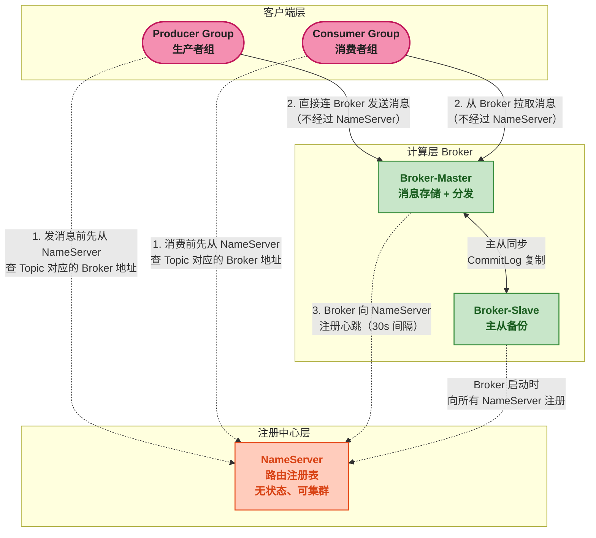
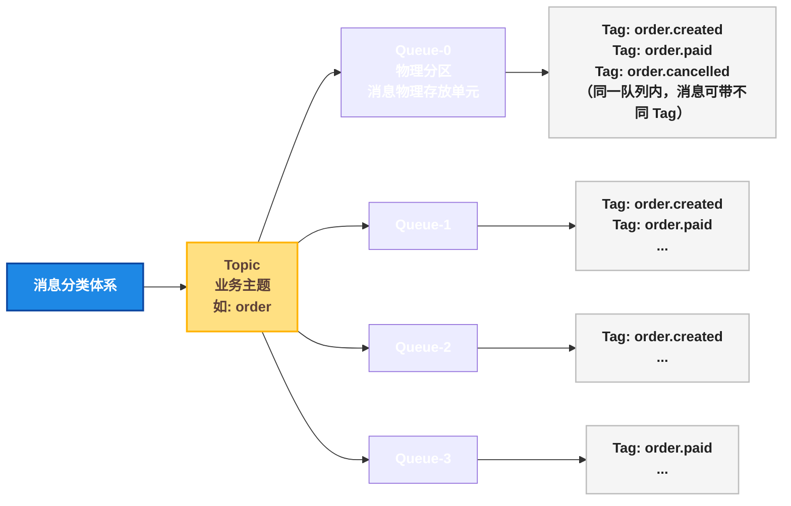

# RocketMQ 核心架构与消息模型

> 📖 <strong>前置阅读</strong>：本文假设读者已理解消息队列的基本价值（异步、解耦、削峰填谷），以及 RabbitMQ 的核心概念。如果还不熟悉消息队列，建议先阅读 [<strong>RabbitMQ 核心概念与 AMQP 协议</strong>]()。

## 一、⚡ 问题切入：RabbitMQ 用得好好的，为什么还要学 RocketMQ？

RabbitMQ 六篇系列刚刚学完——Exchange/Binding/Queue 的路由模型很灵活，延迟队列插件也顺手。但回到真实业务场景，RabbitMQ 有它的边界：

| 场景 | RabbitMQ 的表现 |
|------|-----------------|
| <strong>10 万 QPS 的订单系统</strong> | 单机 RabbitMQ 在 2 ~ 5 万 msg/s，需要多节点 + 镜像队列——但集群水平扩展能力弱 |
| <strong>消息必须严格按顺序消费</strong> | RabbitMQ 本身是 FIFO——但消费者并发 + 重试入队会破坏顺序，需要自己额外保证 |
| <strong>分布式事务："下单 + 扣库存 + 发消息"三件事要么全成功要么全失败</strong> | RabbitMQ 没有原生事务消息支持——需要自己实现本地消息表 + 定时补偿 |
| <strong>延迟时间精确到秒级</strong> | Delayed Message 插件能解决，但 RabbitMQ 的延迟消息插件在大规模下性能不可靠 |
| <strong>阿里云 / 腾讯云托管</strong> | 云厂商的托管版 RabbitMQ 大多不支持插件（Delayed Message / Priority Queue 等特性用不了） |
| <strong>依赖 Erlang</strong> | RabbitMQ 的运维门槛高——Erlang 栈少有人懂，出了问题排查困难 |

这些不是 RabbitMQ 的缺点——它设计时就不是为了应对这些场景。它是 AMQP 协议的优秀实现，<strong>路由灵活性</strong>是它的最强项。

RocketMQ 来自另一个血脉——阿里为<strong>海量消息传递</strong>和<strong>分布式事务</strong>场景设计的 Java 原生消息中间件。2012 年开源，2017 年成为 Apache 顶级项目。

<strong>核心差异一句话</strong>：RabbitMQ 强在路由灵活，RocketMQ 强在海量吞吐和事务消息。

## 二、🧬 RocketMQ 的架构：四个角色、一个注册中心

### 2.1 架构全景

RocketMQ 的架构比 RabbitMQ 更"分布式原生"。RabbitMQ 是 Erlang 节点的松耦合集群，RocketMQ 则是<strong>天生分离式架构</strong>——计算和存储拆分：



<strong>四个核心角色</strong>：

| 角色 | 一句话定义 | 类比理解（仅此一处，后续不再用） |
|------|-----------|------|
| <strong>NameServer</strong> | 轻量级注册中心——维护"哪个 Topic 存在哪个 Broker 上"的路由表 | 通信录——查了地址后直接打电话，不经过通信录 |
| <strong>Broker</strong> | 消息存储和分发的核心进程——Master 负责读写，Slave 负责备份 | 实际干活的人 |
| <strong>Producer</strong> | 生产者——发消息前先问 NameServer 要 Broker 地址，然后直连 Broker 发送 | — |
| <strong>Consumer</strong> | 消费者——消费前先问 NameServer 要 Broker 地址，然后从 Broker 拉取消息 | — |

<strong>关键区别</strong>：RocketMQ 的 NameServer 不像 RabbitMQ 的 Broker 自己就是服务端。<strong>消息不经过 NameServer</strong>——NameServer 只提供路由信息，客户拿到 Broker 地址后直连 Broker 收发消息。这和 Zookeeper 之于 Kafka 的角色类似，但 NameServer 远比 Zookeeper 轻量——没有选举、没有分布式锁，就是一个<strong>内存路由表 + 定时心跳</strong>。

### 2.2 NameServer —— 为什么不需要 Zookeeper？

RabbitMQ 用 Erlang 内置的集群机制，Kafka 用 Zookeeper（或 KRaft），RocketMQ 自己实现了一个极简的 NameServer。

```java
// NameServer 的本质——一个路由注册表
// 存储在内存中的 HashMap
// 伪代码（不是源码，是数据结构还原）
Map<String, List<QueueData>> topicQueueTable = new HashMap<>();
//  "TopicA" → [
//    { brokerName: "broker-a", readQueueNums: 8, writeQueueNums: 8 },
//    { brokerName: "broker-b", readQueueNums: 8, writeQueueNums: 8 }
//  ]

Map<String, BrokerData> brokerAddrTable = new HashMap<>();
//  "broker-a" → {
//    cluster: "DefaultCluster",
//    brokerAddrs: { 0: "192.168.1.10:10911" },
//    brokerAddrsSlave: { 1: "192.168.1.11:10911" }
//  }
```

| 维度 | RocketMQ NameServer | Kafka Zookeeper |
|------|:---:|:---:|
| <strong>数据一致性</strong> | 最终一致（心跳驱动） | 强一致（ZAB 协议） |
| <strong>单点故障</strong> | 多节点独立部署，互不通信 | 集群模式，Leader 选举 |
| <strong>部署复杂度</strong> | 极低（一个 jar，无依赖） | 高（需额外部署 ZK 集群） |
| <strong>适用规模</strong> | 十亿级消息 | 百亿级消息 |

NameServer 之间互相<strong>不通信</strong>——Broker 向每个 NameServer 独立注册。这简化了运维，代价是 NameServer 间路由数据可能短暂不一致（Broker 刚注册但还没注册到第二个 NameServer）。但对消息中间件来说，毫秒级的最终一致性完全可以接受。

### 2.3 Broker —— 消息存储的核心

Broker 是实际存储消息并分发给消费者的进程。和 RabbitMQ 的 Broker 是同一个概念，但 RocketMQ 的 Broker 做得更重——<strong>它承担了 RabbitMQ 中 Exchange + Queue + 持久化存储的所有职责</strong>。

关键设计：

<strong>存储模型</strong>：RocketMQ 把<strong>所有 Topic 的消息顺序写入同一个 CommitLog 文件</strong>——不像 RabbitMQ 每个队列独立存储。

```
CommitLog（全局物理日志，顺序写）
├── offset: 0          → Topic=order, QueueId=0, body=...
├── offset: 1024       → Topic=stock, QueueId=2, body=...
├── offset: 2048       → Topic=order, QueueId=1, body=...
├── offset: 3072       → Topic=user,  QueueId=0, body=...
└── offset: 4096       → Topic=order, QueueId=0, body=...

ConsumeQueue（逻辑队列，按 Topic+QueueId 分别构建）
order/QueueId=0:  [0, 2048, 4096, ...]    ← 只存 CommitLog offset + size + tag hash
order/QueueId=1:  [3072, ...]
stock/QueueId=2:  [1024, ...]
```

<strong>顺序写的好处</strong>：CommitLog 是单文件顺序追加写入——这是磁盘最快的写入方式（接近内存写速度）。ConsumerQueue 只存元数据，体积小，可以全部缓存在内存中。消费者根据 ConsumerQueue 的 offset 信息去 CommitLog 读消息体。

```mermaid
flowchart TD
    classDef startEnd fill:#F48FB1,stroke:#C2185B,stroke-width:2px,color:#212121,font-weight:bold;
    classDef process fill:#F5F5F5,stroke:#9E9E9E,stroke-width:1.5px,color:#212121;
    classDef data fill:#C8E6C9,stroke:#388E3C,stroke-width:1.5px,color:#1B5E20,font-weight:bold;
    classDef highlight fill:#FFCCBC,stroke:#E64A19,stroke-width:1.5px,color:#D84315,font-weight:bold;

    subgraph WRITE ["写入路径（Producer → CommitLog）"]
        P([Producer]) -->|"发送消息<br/>Topic=order, QueueId=0"| COMMIT[CommitLog<br/>顺序追加写入<br/>物理日志文件]
    end

    subgraph INDEX ["索引构建（异步）"]
        COMMIT -.->|"ReputService 线程<br/>异步构建消费队列"| CQ[ConsumeQueue<br/>order/QueueId=0<br/>[offset0, offset2048, ...]]
        COMMIT -.->|"构建索引"| IDX[IndexFile<br/>key→offset 哈希索引]
    end

    subgraph READ ["消费路径（Consumer ← ConsumeQueue → CommitLog）"]
        C([Consumer]) -->|"根据 ConsumeQueue<br/>获取 offset 列表"| CQ
        CQ -->|"定位到 CommitLog<br/>精确偏移量"| COMMIT
        COMMIT -->|"返回消息体"| C
    end

    class P,C startEnd;
    class COMMIT highlight;
    class CQ,IDX data;
```

<strong>这种存储模型的核心优势</strong>：不管有多少个 Topic、多少个 Queue，Broker 只做<strong>一次顺序写磁盘</strong>。RabbitMQ 每个队列独立写文件——队列数一多（比如 1000 个），磁盘 I/O 变成随机写，吞吐量急剧下降。RocketMQ 的 CommitLog 顺序写没有这个瓶颈——这是它吞吐量比 RabbitMQ 高 1 ~ 2 个数量级的根本原因。

### 2.4 Topic、Queue、Tag —— 消息的三级分类

RocketMQ 用<strong>三级分类</strong>组织消息，比 RabbitMQ 的 Exchange+RoutingKey 体系更立体：



| 层级 | 含义 | 对应 RabbitMQ | 物理本质 |
|------|------|:---:|------|
| <strong>Topic</strong> | 业务主题——"订单消息"、"用户注册" | Exchange | 一组逻辑相关的消息 |
| <strong>Queue</strong> | 物理分区——一个 Topic 下可以有多个 Queue，分布在不同的 Broker 上 | Queue（但 RabbitMQ 的 Queue 是逻辑的，RocketMQ 的 Queue 是物理分片） | CommitLog 上的逻辑分区，通过 ConsumeQueue 定位 |
| <strong>Tag</strong> | 消息标签——同一个 Queue 内的二级分类 | RoutingKey | 消息业务属性的字符串标记 |

<strong>Queue 的数量很重要</strong>——RocketMQ 中一个 Topic 的 Queue 数量决定了这个 Topic <strong>最多能被多少个消费者实例并发消费</strong>。Queue 是消息顺序的最小单位：同一个 Queue 内的消息天然有序（FIFO），跨 Queue 的消息无序。

```
Topic: order  (8 个 Queue)

Broker-A:
    order/Queue-0 []  ← 消费者实例 1 负责
    order/Queue-1 []  ← 消费者实例 2 负责
    order/Queue-2 []  ← 消费者实例 3 负责
    order/Queue-3 []  ← 消费者实例 4 负责

Broker-B:
    order/Queue-4 []  ← 消费者实例 5 负责
    order/Queue-5 []  ← 消费者实例 6 负责
    order/Queue-6 []  ← 消费者实例 7 负责
    order/Queue-7 []  ← 消费者实例 8 负责
```

> ⚠️ 新手提示：Queue 数量在 Topic 创建后就基本固定了——可以增加但<strong>不能减少</strong>。Queue 数量直接决定了最大并发消费能力——4 个 Queue 意味着最多 4 个消费者实例真正并发工作，第 5 个实例分不到队列会在旁边闲着。

### 2.5 ConsumerGroup —— 消费者集群的核心抽象

ConsumerGroup 是多个消费者实例的<strong>逻辑组</strong>。同一个 ConsumerGroup 下的多个消费者实例<strong>协作消费</strong>同一个 Topic——每个 Queue 只被组内的<strong>一个</strong>消费者实例消费。

```
ConsumerGroup: order-consumer-group
    消费者实例 A → 负责 Queue-0, Queue-1
    消费者实例 B → 负责 Queue-2, Queue-3
    消费者实例 C → 负责 Queue-4, Queue-5

# 如果实例 C 挂了 → Rebalance
ConsumerGroup: order-consumer-group
    消费者实例 A → 负责 Queue-0, Queue-1, Queue-4
    消费者实例 B → 负责 Queue-2, Queue-3, Queue-5
```

<strong>集群消费 vs 广播消费</strong>：

| 模式 | 行为 | 场景 |
|------|------|------|
| <strong>集群消费 (CLUSTERING)</strong> | 每条消息只被 ConsumerGroup 内的<strong>一个</strong>实例消费 | 订单处理（一个订单不能被两个服务处理） |
| <strong>广播消费 (BROADCASTING)</strong> | 每条消息被 ConsumerGroup 内的<strong>所有</strong>实例消费 | 缓存刷新（所有缓存实例都需要知道数据变了） |

### 2.6 RocketMQ vs RabbitMQ 概念速查

对于刚学完 RabbitMQ 的读者，下表可以快速建立概念对应：

| 概念 | RabbitMQ | RocketMQ |
|------|---------|---------|
| <strong>消息路由</strong> | Producer → Exchange → [Binding] → Queue | Producer → Topic(Queue) → ConsumerGroup |
| <strong>消息有序</strong> | 单队列 FIFO，但并发消费 + 重试会乱序 | 同一个 Queue 内的消息严格有序（顺序消息） |
| <strong>延迟消息</strong> | Delayed Message 插件 | 原生支持，18 个延迟级别 |
| <strong>事务消息</strong> | 不支持（需自己实现） | 原生支持半消息 + 回查 |
| <strong>注册中心</strong> | Erlang 节点间通信（无独立注册中心） | NameServer |
| <strong>协议</strong> | AMQP 0-9-1（开放标准） | 自定义协议（基于 Netty） |
| <strong>存储模型</strong> | 每个队列独立存储 | 全部消息顺序写 CommitLog + ConsumeQueue 索引 |
| <strong>消费者模型</strong> | Push（Broker 推送） | Push/PULL 两种模式 |

## 三、🔧 Docker 快速安装

RocketMQ 各组件独立部署——一次启动 NameServer 和 Broker：

```bash
# 1. 创建 NameServer
docker run -d \
  --name rocketmq-namesrv \
  -p 9876:9876 \
  -e "JAVA_OPT_EXT=-Xms512m -Xmx512m" \
  apache/rocketmq:5.1.4 \
  sh mqnamesrv

# 2. 创建 Broker（需要挂载配置文件）
mkdir -p ~/rocketmq/conf
cat > ~/rocketmq/conf/broker.conf << 'EOF'
brokerClusterName = DefaultCluster
brokerName = broker-a
brokerId = 0
deleteWhen = 04
fileReservedTime = 48
brokerRole = ASYNC_MASTER
flushDiskType = ASYNC_FLUSH

# 关键：告诉 Broker NameServer 在哪里
namesrvAddr = 192.168.1.100:9876

# 自动创建 Topic（开发环境方便，生产建议关闭）
autoCreateTopicEnable = true
EOF

docker run -d \
  --name rocketmq-broker \
  -p 10911:10911 -p 10909:10909 \
  -v ~/rocketmq/conf/broker.conf:/home/rocketmq/rocketmq-5.1.4/conf/broker.conf \
  -e "JAVA_OPT_EXT=-Xms1g -Xmx1g" \
  apache/rocketmq:5.1.4 \
  sh mqbroker -c /home/rocketmq/rocketmq-5.1.4/conf/broker.conf

# 3. 验证
docker logs -f rocketmq-broker | grep "boot success"
# 预期输出：The broker[broker-a, 192.168.1.100:10911] boot success
```

端口说明：

| 端口 | 用途 |
|------|------|
| <strong>9876</strong> | NameServer 端口——Producer 和 Consumer 连接这个端口获取路由信息 |
| <strong>10911</strong> | Broker 端口——Producer 和 Consumer 拿到路由后直连这个端口收发消息 |
| <strong>10909</strong> | Broker 内部通信端口（VIP Channel，一般不需要了解） |

## 四、👋 第一个 RocketMQ 消息（纯 Java Client）

不用 Spring，先用原始 RocketMQ Client 跑通一条消息。底层流程搞清楚了，下一篇上 Spring。

### 4.1 依赖

```xml
<dependency>
    <groupId>org.apache.rocketmq</groupId>
    <artifactId>rocketmq-client</artifactId>
    <version>5.1.4</version>
</dependency>
```

### 4.2 生产者

```java
import org.apache.rocketmq.client.producer.DefaultMQProducer;
import org.apache.rocketmq.client.producer.SendResult;
import org.apache.rocketmq.common.message.Message;

public class FirstProducer {
    public static void main(String[] args) throws Exception {
        // 1. 创建生产者，指定生产者组名
        DefaultMQProducer producer = new DefaultMQProducer("first-producer-group");
        // 2. 指定 NameServer 地址
        producer.setNamesrvAddr("192.168.1.100:9876");
        // 3. 启动
        producer.start();

        // 4. 构建消息
        Message msg = new Message(
            "TopicTest",            // Topic
            "TagA",                 // Tag（二级分类）
            "Hello RocketMQ！第一条消息".getBytes("UTF-8")  // Body
        );

        // 5. 同步发送——等待 Broker 确认后才返回
        SendResult result = producer.send(msg);
        System.out.printf("发送结果: %s%n", result);
        // 输出：SendResult [sendStatus=SEND_OK, msgId=7F0000010A18..., offsetMsgId=...]

        // 6. 关闭
        producer.shutdown();
    }
}
```

<strong>逐行解释</strong>：

| 步骤 | 代码 | 解释 |
|------|------|------|
| 1 | `new DefaultMQProducer("first-producer-group")` | 生产者组名——同一个组的多个 Producer 实例被视为等价。<strong>事务消息必须指定生产者组</strong> |
| 2 | `setNamesrvAddr(...)` | NameServer 地址——Producer 启动时从这里拉取 Topic 路由表 |
| 3 | `producer.start()` | 启动内部的 Netty 客户端、拉取路由表、启动心跳线程 |
| 4 | `new Message(Topic, Tag, body)` | 消息有三级分类——Topic + Tag + 可选的 Key |
| 5 | `producer.send(msg)` | 同步发送——线程阻塞直到 Broker 返回结果。还有异步和单向发送，下篇展开 |
| 6 | `producer.shutdown()` | 关闭连接，释放资源 |

> ⚠️ 新手提示：`send(msg)` 是<strong>同步发送</strong>——生产者的线程会等待 Broker 确认写入 CommitLog 后才返回。如果 Broker 无响应，默认超时时间 3000ms 后抛异常。这和 RabbitMQ 的 `convertAndSend` 不一样——后者默认是 fire-and-forget（不确认是否到达）。

### 4.3 消费者

```java
import org.apache.rocketmq.client.consumer.DefaultMQPushConsumer;
import org.apache.rocketmq.client.consumer.listener.*;
import org.apache.rocketmq.common.message.MessageExt;
import java.util.List;

public class FirstConsumer {
    public static void main(String[] args) throws Exception {
        // 1. 创建消费者，指定消费者组名
        DefaultMQPushConsumer consumer = new DefaultMQPushConsumer("first-consumer-group");
        // 2. 指定 NameServer
        consumer.setNamesrvAddr("192.168.1.100:9876");
        // 3. 订阅 Topic + Tag
        consumer.subscribe("TopicTest", "TagA || TagB");
        //            Topic名称,      Tag过滤表达式（支持 ||）

        // 4. 注册消息监听器
        consumer.registerMessageListener((MessageListenerConcurrently) (msgs, context) -> {
            // msgs: 一批消息（默认一次最多拉 32 条）
            for (MessageExt msg : msgs) {
                System.out.printf("收到消息: %s | Topic=%s, Tag=%s, QueueId=%d%n",
                    new String(msg.getBody()),
                    msg.getTopic(),
                    msg.getTags(),
                    msg.getQueueId()
                );
            }
            // 返回消费状态——CONSUME_SUCCESS 表示成功，Broker 更新消费进度
            return ConsumeConcurrentlyStatus.CONSUME_SUCCESS;
        });

        // 5. 启动消费者
        consumer.start();
        System.out.println("消费者已启动，等待消息...");
    }
}
```

<strong>关键点</strong>：

- <strong>subscribe(Topic, Tag)</strong>：不像 RabbitMQ 的 Binding 把 Exchange 连到 Queue——RocketMQ 的消费者直接订阅 Topic 和 Tag。Tag 过滤表达式支持 `\|\|`（或），例如 `"TagA \|\| TagB"` 表示收 Tag 为 TagA 或 TagB 的消息。用 `*` 表示收所有 Tag。
- <strong>`MessageListenerConcurrently`</strong>：并发消费监听器——多线程并发处理。还有一个 `MessageListenerOrderly` 用于单线程顺序消费。
- <strong>`CONSUME_SUCCESS`</strong>：返回成功，Broker 更新该 ConsumerGroup 在此 Queue 的消费进度（offset）。如果返回 `RECONSUME_LATER`，消息会进入重试队列。
- <strong>消费者组</strong>：同一个 ConsumerGroup 下的多个实例自动 Rebalance 分配 Queue。

### 4.4 几个和 RabbitMQ 不一样的感觉

| 细节 | RabbitMQ | RocketMQ |
|------|---------|---------|
| 发消息 | `channel.basicPublish(exchange, routingKey, ...)` | `producer.send(new Message(topic, tag, body))` |
| 收消息 | Broker 推送，手动 `basicAck` 确认 | 默认 Push（实则底层 PULL），返回 `CONSUME_SUCCESS` 确认 |
| 路由 | Exchange + Binding + RoutingKey | Topic + Tag（无 Exchange 概念） |
| 队列 | Queue 是逻辑存储，手动声明 | Queue 是物理分片，Topic 创建时自动分配 |
| 确认机制 | 每条消息独立 ACK | 批量确认——返回消费状态即可 |

## 五、🎯 总结

本文从 RabbitMQ 的局限性切入，拆解了 RocketMQ 的核心架构：

1. <strong>NameServer 去中心化注册</strong>：极简路由表，无状态、互不通信。消息不经过 NameServer——Producer/Consumer 拿到 Broker 地址后直连。这是和 Zookeeper 方案的根本区别。

2. <strong>CommitLog 顺序写 + ConsumeQueue 索引</strong>：所有 Topic 的消息写同一个 CommitLog——单文件顺序追加写，磁盘利用率最大化。ConsumeQueue 只存 offset 元数据，可全量缓存。这是 RocketMQ 吞吐量比 RabbitMQ 高 1 ~ 2 个数量级的根源。

3. <strong>三级分类体系</strong>：Topic（业务主题）→ Queue（物理分片，决定并发度）→ Tag（二级标签）。Queue 数量决定最大并发消费实例数，创建后只增不减。

4. <strong>ConsumerGroup 协作消费</strong>：组内实例自动 Rebalance 分配 Queue。集群消费（一条消息只被一个实例消费）和广播消费（所有实例都收到）。

Docker 单机安装 + 纯 Java Client 的第一条消息已经跑通。下一篇上 SpringBoot——用 `rocketmq-spring-boot-starter` 把上面十几行代码变成一行注解。

> 📖 <strong>下一步阅读</strong>：RocketMQ 的纯 Java Client 已能跑通，但真实项目里用 SpringBoot 整合。继续阅读 [<strong>SpringBoot RocketMQ 全操作指南</strong>]()，一篇覆盖同步/异步/单向发送、并发/顺序消费、消息转换的完整实战教程。
