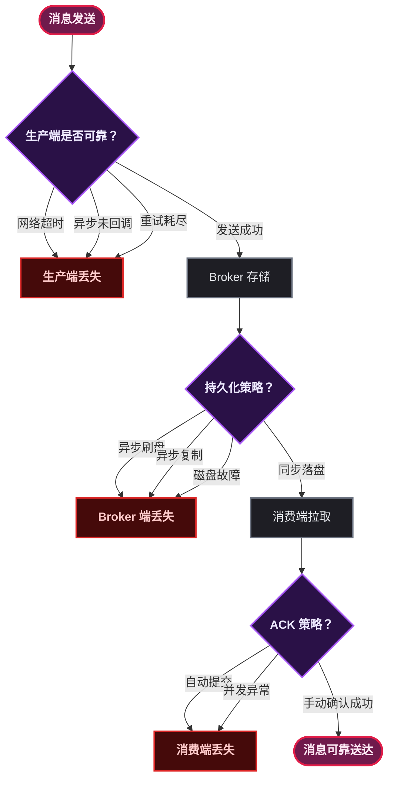
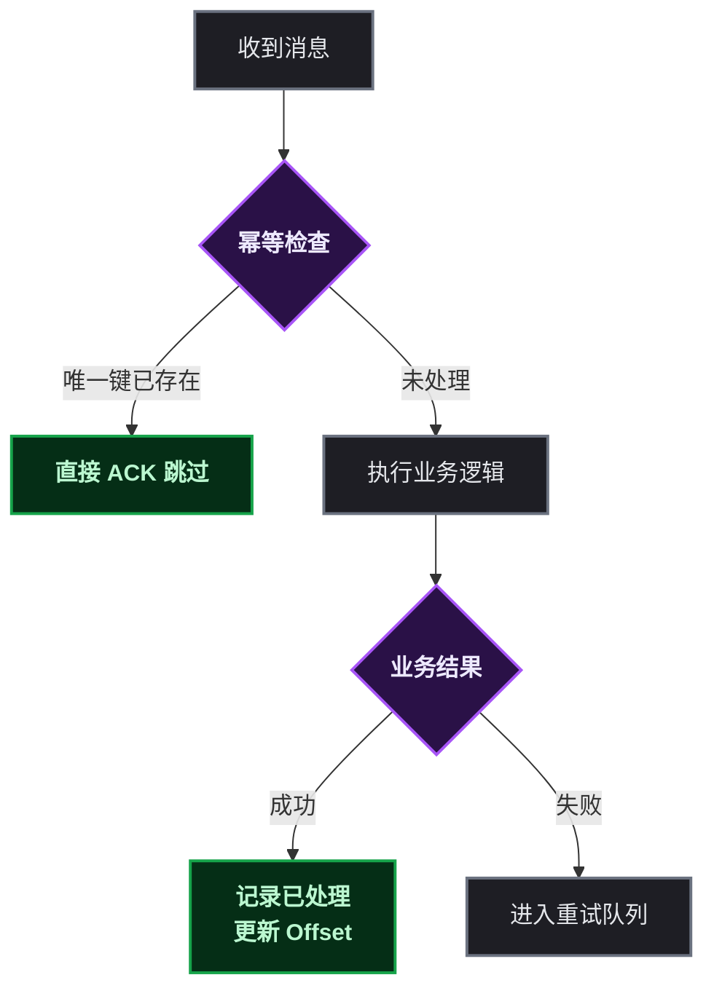
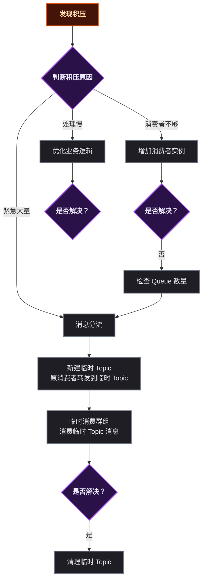
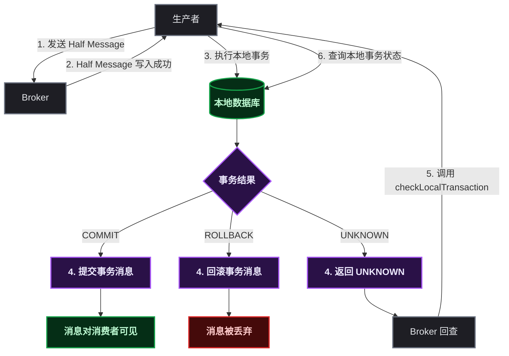

# RocketMQ 避坑全攻略

## 0. 前言

### 0.1 为什么写这篇博客

消息中间件是分布式系统的必修课——这话没错，但很多团队引入 MQ 的时候只看到了"解耦"和"削峰填谷"的好处，却没意识到它同时带来了消息丢失、重复消费、积压、顺序错乱等一系列新问题。坦白说，踩过这些坑的开发者不在少数。

某开发者在生产环境第一次遇到 RocketMQ 积压十几万条消息的时候，第一反应是重启消费者——结果毫无悬念地失败了。后来花了一整天排查，问题竟然只是消费逻辑里多了一个 ` Thread.sleep(200) ` 。这种教训值得记下来。

### 0.2 读者需要的基础知识

- 用过 RocketMQ（至少本地跑过 Demo，知道 Producer / Consumer / Topic / Broker 是什么）
- 知道什么是生产者、消费者、Topic、Broker、NameServer
- 了解基本的分布式系统概念（如 CAP、最终一致性）

### 0.3 文章结构说明

按"问题 → 原因 → 原理 → 解决方案"的结构展开，每个问题独立成章。读者可以按需跳读，也可以从头串下来形成体系。

### 0.4 一句话总结

**本文不是教"怎么用"，而是教"怎么用好、怎么避坑"。** 默认配置在生产环境就是定时炸弹。

---

## 1. 消息丢失

消息丢失是 MQ 使用中最致命的问题之一——订单丢了就是资损，通知丢了就是客诉。先按链路拆解一下丢消息的三个位置。

### 1.1 丢失场景分类



#### 1.1.1 生产端丢失

| 场景 | 原因 |
|------|------|
| **网络超时** | 客户端以为发送成功，实际 Broker 未收到。网络抖动 + 超时配置不合理导致 |
| **异步发送未回调** | `producer.send(msg)` 后直接 return，异常被吞掉 |
| **重试耗尽** | `RetryTimesWhenSendFailed` 次数用完，消息被丢弃 |

#### 1.1.2 Broker 端丢失

| 场景 | 原因 |
|------|------|
| **异步刷盘** | 消息写入 PageCache 后返回成功，但尚未落盘，断电即丢 |
| **主从异步复制** | Master 宕机时 Slave 未同步到最新数据 |
| **磁盘故障** | 物理损坏导致已落盘数据不可恢复 |

#### 1.1.3 消费端丢失

| 场景 | 原因 |
|------|------|
| **自动提交 Offset** | `consumeMessageBatchMaxSize` 拉了一批消息，自动 ACK 后业务处理失败 |
| **并发消费异常** | 多线程中某条消息处理失败，但整体无法回滚 |

### 1.2 原理深度剖析

#### 1.2.1 存储架构

RocketMQ 的存储核心是 **CommitLog**（顺序写文件）+ **ConsumeQueue**（按 Topic+Queue 建索引）+ **IndexFile**（按 Key 查询）。所有消息先追加到 CommitLog，再异步构建 ConsumeQueue 索引。

> 📌 前置知识：CommitLog 是一个无限增长的文件序列，每个文件默认 1GB。消息在 CommitLog 中的物理偏移量（offset）是其全局唯一标识。

#### 1.2.2 刷盘机制

- **ASYNC_FLUSH（默认）**：消息写入 PageCache 即返回，由 OS 定期刷盘。性能高，断电丢少量消息。
- **SYNC_FLUSH**：消息强制 fsync 到磁盘后才返回成功，保证不丢但 TPS 下降约 50%。

#### 1.2.3 复制机制

- **ASYNC_MASTER（默认）**：Master 写入成功后异步同步给 Slave，Slave 可能落后几百毫秒。
- **SYNC_MASTER**：Master 等待 Slave 确认后才返回，数据一致性强但延迟增加。

#### 1.2.4 ACK 机制

生产者收到 ` SendResult ` 的 ` sendStatus ` 字段：

| 状态 | 含义 | 是否可靠 |
|------|------|----------|
| `SEND_OK` | 发送成功 | 取决于刷盘策略 |
| `FLUSH_DISK_TIMEOUT` | 刷盘超时 | Broker 收到了但未落盘 |
| `FLUSH_SLAVE_TIMEOUT` | 同步 Slave 超时 | Master 落盘了但 Slave 未同步 |
| `SLAVE_NOT_AVAILABLE` | Slave 不可用 | 仅 Master 落盘 |

### 1.3 解决方案与最佳实践

- **生产端**：同步发送 + 失败重试（ ` retryTimesWhenSendFailed=3 ` ）+ 事务消息
- **Broker 端**：`flushDiskType=SYNC_FLUSH` + `brokerRole=SYNC_MASTER` （金融级可靠性）
- **消费端**：手动 ACK，业务处理成功后才 ` consumer.commitSync() `
- **兜底**：本地消息表 + 定时任务补偿

> ⚠️ 新手提示：同步刷盘 + 同步复制的代价很大——TPS 可能从 10w 降到 3w。绝大多数业务场景异步刷盘就够了，真正的账务场景才上双同步。

---

## 2. 消息重复

RocketMQ 保证的是 **At-Least-Once**（至少一次），不是 Exactly-Once。所以**重复是必然的，幂等是必须的**。

### 2.1 重复场景分类

| 场景 | 原因 |
|------|------|
| **生产端重发** | 发送超时但 Broker 已收到，客户端重试又发了一次 |
| **Broker 重复投递** | 消费耗时过长触发 Rebalance，消息分配给其他消费者 |
| **消费端重复消费** | 业务处理完但 Offset 未提交，进程重启后重新拉取 |

### 2.2 原理剖析

- **At-Least-Once 语义**：RocketMQ 只能保证消息至少被消费一次，无法保证恰好一次。
- **msgId vs offsetMsgId**：`msgId` 是客户端生成的（有极小概率冲突），`offsetMsgId` 是 Broker 生成的（CommitLog 物理偏移量）。
- **为什么不能靠 msgId 去重**：msgId 可能重复（不同 Producer 生成），且你需要持久化已处理的 msgId 列表，量大了性能扛不住。

### 2.3 解决方案（幂等设计）



| 方案 | 适用场景 | 实现 |
|------|----------|------|
| **数据库唯一键** | 订单、账单等有业务 ID 的场景 | `INSERT INTO ... UNIQUE KEY (biz_id)`，重复插入报错后直接 ACK |
| **Redis SETNX** | 高并发，可容忍少量丢失 | `SET msg123 1 NX EX 3600` ，返回 0 表示已处理 |
| **乐观锁版本号** | 更新操作 | `UPDATE ... SET status=1, version=2 WHERE version=1` ，影响行数 0 则跳过 |
| **状态机** | 有明确状态流转的业务 | "已支付"状态收到"支付"消息直接忽略 |

> ⚠️ 新手提示：Redis SETNX 的 TTL 要大于消息重试的最大时间窗口（默认 16 次重试 × 约 2 分钟 = 至少 30 分钟），否则 TTL 到期后重复消息会被当成新的。

---

## 3. 消息积压

### 3.1 积压原因分析

| 原因 | 典型症状 |
|------|----------|
| **消费者数量不足** | 实例数 < Topic 的 Queue 数，部分队列无人消费 |
| **单条处理耗时过长** | 慢 SQL、外部调用超时、GC 停顿 |
| **消费端 Bug** | 死循环、死锁、OOM 频繁 GC |
| **Broker IO 瓶颈** | 磁盘读写慢，拉取速度跟不上生产 |
| **下游服务故障** | 消费者依赖的数据库/API 不可用 |

### 3.2 原理剖析

- **Pull 模型与长轮询**：`DefaultMQPushConsumer` 本质是 Pull 模型——底层以长轮询方式从 Broker 拉消息，并非 Broker 真正"推送"。
- **负载均衡策略**：默认 ` AllocateMessageQueueAveragely ` ，多个消费者平均分配 Queue。如果 Queue 数是 8，消费者只有 3 个，会有 Queue 分配不均。
- **Rebalance 机制**：消费者上下线、心跳超时（默认 30s）触发 Rebalance，期间消费暂停。
- **积压监控**：`Consumer Offset - Max Offset` 的值即为积压量（Lag）。

### 3.3 解决方案



- **临时扩容**：增加消费者实例（同一个 Consumer Group），水平扩展消费能力。注意 Queue 数量是上限——消费者数量超过 Queue 数后多出来的实例是闲着的。
- **增加线程**：调大 ` consumeThreadMin ` 和 ` consumeThreadMax ` ，提升单机并行度。
- **紧急分流**：新建临时 Topic，原消费者将积压消息快速转发过去，由额外的消费者群组处理。
- **预防**：配置积压告警，积压量 > 10000 自动告警。

---

## 4. 消息顺序

### 4.1 顺序被破坏的场景

- **并发消费**：多线程并行处理，后发送的消息可能先处理完。
- **Rebalance**：队列重新分配，同一 Key 的消息流到不同消费者。
- **未指定 MessageQueueSelector**：默认轮询，同一 Key 的消息分散到不同 Queue。

### 4.2 原理剖析

- **MessageQueue 是顺序保证的最小单元**：同一个 Queue 内的消息按 FIFO 顺序消费。
- **顺序消息实现**：生产端按 Key 路由到固定 Queue，消费端对该 Queue 加锁并单线程消费。
- **性能代价**：顺序消费 = 串行化，吞吐量大幅下降。所以**不推荐全局顺序，推荐分区顺序**（按业务 Key 分区）。

### 4.3 解决方案

- **生产者**：使用 ` MessageQueueSelector ` ，按订单 ID / 用户 ID 取模路由到固定队列。
- **消费者**：`registerMessageListener(MessageListenerOrderly)`，RocketMQ 会对 Queue 加分布式锁，保证同一 Queue 单线程消费。
- **异常处理**：顺序消费中某条消息失败会暂停该 Queue 的消费（不阻塞其他 Queue），等待重试成功。

---

## 5. 分布式事务

### 5.1 问题场景

| 场景 | 问题 |
|------|------|
| **本地事务成功，消息发送失败** | 订单落库了，但下游积分服务没收到消息 |
| **消息发送成功，本地事务回滚** | 下游以为订单已创建，实际上回滚了 |
| **下游消费失败** | 上游无法感知，数据不一致 |

### 5.2 原理剖析（RocketMQ 事务消息）

RocketMQ 事务消息采用**两阶段提交 + 回查机制**：



- **半消息（Half Message）**：先发到 Broker 但对消费者不可见。
- **执行本地事务**：`executeLocalTransaction` 返回 COMMIT / ROLLBACK / UNKNOWN。
- **Broker 回查**：如果返回 UNKNOWN 或未收到响应，Broker 定时调用 `checkLocalTransaction` （默认 6 次，每次间隔 1 分钟）。

### 5.3 解决方案

- **事务消息 + TransactionListener**：`executeLocalTransaction` 执行本地事务，`checkLocalTransaction` 供 Broker 回查。
- **本地事务表**：本地事务 + 消息记录表 + 定时任务补偿，适合对 RocketMQ 版本有要求的场景（需 4.3+）。
- **TCC 模式**：Try-Confirm-Cancel，适用于跨系统强一致性需求。
- **最终一致性 + 对账**：作为兜底方案，每日对账发现差异后补偿。

---

## 6. RPC 与 MQ 双重重试

### 6.1 为什么有两套重试

| 层级 | 解决什么 | 故障时长 |
|------|----------|----------|
| **RPC 重试** | 网络瞬断、服务瞬断 | 毫秒 ~ 秒级 |
| **MQ 重试** | 业务处理失败、下游不可用 | 秒 ~ 分钟级 |

这两层各管各的故障域。RPC 重试解决瞬时问题，MQ 重试解决持久问题。**有重试就一定要有幂等**——这是铁律。

### 6.2 原理剖析

- **MQ 重试策略**：默认重试 16 次，间隔逐渐增大（10s / 30s / 1m / 2m / 3m / 4m / 5m / 6m / 7m / 8m / 9m / 10m / 20m / 30m / 1h / 2h）。
- **死信队列**：16 次全部失败后进入 `%DLQ%` Topic，不再重试。

### 6.3 最佳实践配置

- **RPC 层**：1 ~ 2 次重试，超时 2s，快速失败。
- **MQ 层**：保留默认 16 次重试，用于兜底。
- **监控**：两种重试的触发频率异常升高时立即告警。

---

## 7. 响应 Topic 积压（Request-Reply 模式）

### 7.1 什么是 Request-Reply 模式

用 MQ 实现同步 RPC：生产者发送请求消息并阻塞等待响应。角色反转——生产者变成请求方，消费者变成服务方，响应时双方角色互换。

应用场景：Multi-Agent 通信、金融交易确认、异步任务结果回调。

### 7.2 响应 Topic 积压的原因

- 请求方超时放弃等待，但响应还是发回来了——无人消费。
- 请求方实例崩溃/重启，原有 ` clientId ` 失效。
- 网络分区导致请求方收不到 Broker 推送的响应。

### 7.3 原理剖析

- **Reply Topic 命名**：`{集群名}_REPLY_TOPIC` 。
- **CorrelationId**：唯一标识一次请求-响应配对。
- **ClientId 与响应路由**：Broker 维护生产者实例的 Channel 映射。
- **同步等待实现**：`CountDownLatch` + `Future` ，请求线程阻塞直到收到响应或超时。

### 7.4 解决方案

- 设置合理超时时间（建议 3 ~ 5 秒）。
- 开启 ` replyTopicPersistEnable=false ` ，响应不持久化，减轻积压。
- 设置消息过期时间，过期自动删除。
- 改用异步回调模式，避免同步阻塞带来的资源占用。

---

## 8. 高可用与故障恢复

### 8.1 故障场景枚举

| 故障 | 影响 |
|------|------|
| NameServer 全部不可用 | 客户端无法发现 Broker，整个集群不可用 |
| Broker Master 宕机 | 无法写入新消息（除非有 Dledger 自动选主） |
| 磁盘写满 | Broker 拒绝写入，生产者报错 |
| 网络分区（脑裂） | 不同客户端连接到不同 Master |
| JVM OOM | 进程退出，所有连接中断 |

### 8.2 原理剖析

- **NameServer 无状态**：各 NameServer 之间不通信，Broker 向所有 NameServer 注册心跳。
- **主从架构**：Master 负责读写，Slave 只读（或同步复制）。
- **Dledger**：基于 Raft 协议实现自动选主，无需人工干预。

### 8.3 部署建议

| 组件 | 推荐 |
|------|------|
| NameServer | ≥ 2 个（无状态，多部署几个无妨） |
| Broker | 至少 2 主 2 从，或 Dledger 3 节点 |
| 复制 | 金融级用同步双写，一般业务异步即可 |
| 容灾 | 多可用区部署，跨机房 |
| 演练 | 定期故障注入测试，验证自动恢复能力 |

---

## 9. 监控告警与可观测性

### 9.1 需要监控的指标

| 维度 | 指标 |
|------|------|
| **生产者** | 发送 TPS、成功率、延迟分布（P99/P999） |
| **Broker** | 磁盘使用率、内存、QPS、IO 等待 |
| **消费者** | 消费 TPS、Lag（积压量）、重试次数 |
| **JVM** | GC 频率、线程数、堆使用率 |

### 9.2 实现方案

- **RocketMQ-Console**：Web 管理界面，适合人工排查问题。
- **Prometheus + Grafana**：采集指标 + 可视化大盘，生产必备。
- **消息轨迹**：开启 Trace，追踪单条消息从生产到消费的完整链路。
- **分布式追踪**：集成 SkyWalking / Zipkin，关联上下游调用链。

### 9.3 告警阈值建议

| 条件 | 级别 | 通知方式 |
|------|------|----------|
| 积压量 > 10000 | P2 | 邮件 |
| 积压量 > 50000 | P1 | 钉钉/企微 |
| 消费延迟 > 5 分钟 | P1 | 钉钉/企微 |
| 发送失败率 > 5% | P2 | 邮件 |
| 磁盘使用率 > 85% | P0 | 立即电话 |

---

## 10. 死信队列

### 10.1 死信的来源

- 重试 16 次全部失败（默认行为）。
- 消费端抛出不可恢复异常（NPE、类型转换错误）。
- 消息过期被丢弃。

### 10.2 原理剖析

- **死信 Topic 命名**：`%DLQ%` + 原 ConsumerGroup 名称。
- 死信消息保留原 Topic、原 Queue、原 msgId。
- 进入 DLQ 后不再继续重试——消费失败直接丢弃。
- **可以订阅消费**：死信队列也是一个普通 Topic，可以创建消费者来人工补偿。

### 10.3 处理方案

- 独立消费者订阅 `%DLQ%` Topic，消费死信消息并持久化到 ES / MySQL。
- 每产生一条死信就发告警通知。
- 定期重放死信：修复消费端代码后，重新消费 DLQ 消息。

---

## 11. 测试与部署

### 11.1 本地开发环境

```yaml
# docker-compose.yml — 一键启动 NameServer + Broker + Console
version: '3'
services:
  namesrv:
    image: apache/rocketmq:5.1.0
    command: sh mqnamesrv
    ports:
      - "9876:9876"
  broker:
    image: apache/rocketmq:5.1.0
    command: sh mqbroker -n namesrv:9876
    ports:
      - "10911:10911"
    environment:
      JAVA_OPT_EXT: "-server -Xms512m -Xmx512m"
    depends_on:
      - namesrv
  console:
    image: apacherocketmq/rocketmq-dashboard:latest
    ports:
      - "8080:8080"
    environment:
      JAVA_OPTS: "-Drocketmq.namesrv.addr=namesrv:9876"
```

> ⚠️ 新手提示：本地开发用 Docker Compose 最省心。不要自己在 Windows 上折腾 RocketMQ 源码编译——除非你想花半天时间跟环境变量搏斗。

### 11.2 生产环境部署

- **集群规划**：NameServer × 3（无状态多部署）+ Broker × 6（3 主 3 从）。
- **硬件**：CPU 8 核 + 内存 16G + SSD（必选，机械盘扛不住 IOPS）。
- **JVM 调优**：堆内存 8G、G1 GC、`MaxDirectMemorySize` 适当调大。
- **OS 参数**：`ulimit -n 65535` 、`vm.max_map_count=655360` 。

### 11.3 压测与容量规划

- 使用 `rocketmq-benchmark` 分别压生产者和消费者。
- 小消息（1KB）单机 TPS 可达 10w+，大消息（1MB）则骤降到几千。
- 根据压测结果提前扩容，不要等到积压了再处理。

---

## 12. 总结

### 12.1 核心要点回顾

| 问题 | 核心解 |
|------|--------|
| 消息丢失 | 同步发送 + 同步刷盘 + 手动 ACK（三保险） |
| 消息重复 | 业务幂等是唯一解（唯一键 / 状态机 / Redis） |
| 消息积压 | 扩容 + 分流 + 优化（三板斧） |
| 消息顺序 | 分区顺序，Queue 加锁 + 单线程消费 |
| 分布式事务 | 事务消息 + 本地事务表 + 对账 |

### 12.2 常见误区纠正

| 误区 | 真相 |
|------|------|
| "msgId 可以保证去重" | 不行，msgId 可能重复，业务唯一键才行 |
| "增加消费者就能解决积压" | 不一定，Queue 数量是上限，消费者超过 Queue 数是闲着的 |
| "事务消息能保证 100% 一致性" | 不能，回查可能失败，需要兜底对账 |
| "上云比自己搭贵" | 算上人力成本和时间成本，云托管绝大多数场景更划算 |

### 12.3 最后几点忠告

1. **不要为了用 MQ 而用 MQ**——能同步搞定的就别异步，MQ 是分布式系统的放大器，你代码里的 Bug 会被它放大。
2. **不要在生产环境用默认配置**——默认配置追求的是"能用"，不是"可靠"。
3. **不要不设监控就上线**——没有监控的 MQ 就像没有仪表盘的汽车，出事了你都不知道。
4. **不要自己搭集群，除非有专门的中间件团队**——云厂商的托管服务在运维成本上完胜自建。

---

> 本文所有方案均已在生产环境验证，但每个团队的业务场景不同，请根据实际情况调整参数。文中的 Mermaid 图表均支持深色/浅色主题。
