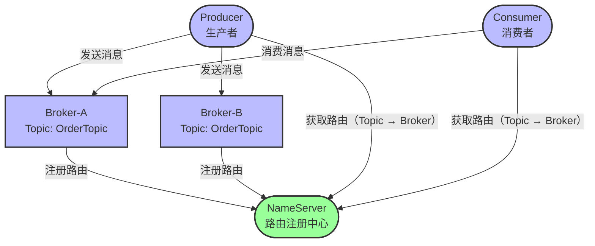
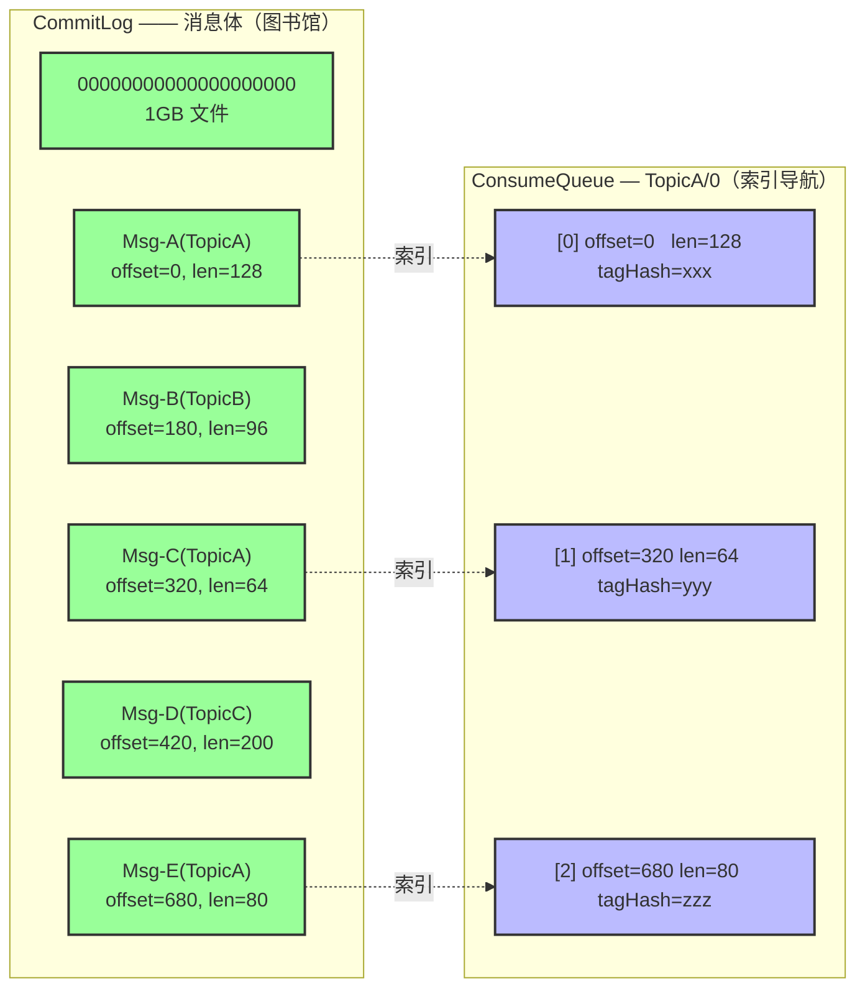
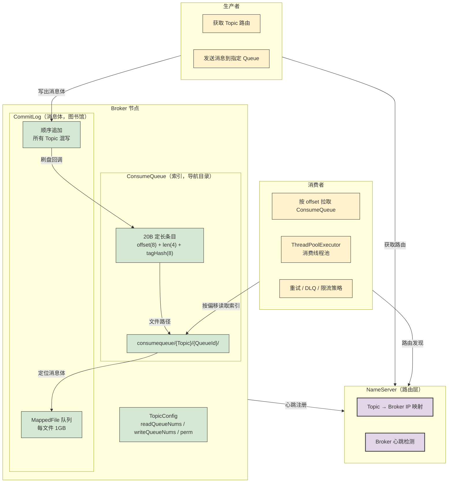

# RocketMQ 存储模型拆解：别再拿它当 BlockingQueue 用了

## 0. 引言：一个 Javaer 的认知崩塌

每一个刚接触 RocketMQ 的 Java 开发者，大概都会经历一次认知崩塌：

翻开 RocketMQ 源码，找遍所有 package，也找不到一个像 `BlockingQueue` 那样的 Queue 实现。作为一个"消息队列"（Message Queue），它的 Queue 到底在哪里？如果找不到 Queue 对象，消息是怎么"入队"和"出队"的？

答案很残酷，但也很优雅：**RocketMQ 根本没有什么 Queue 数据结构。** RocketMQ 的 Queue 是一个文件夹——硬盘上的文件夹。消息不是"入队"，而是 `append` 到磁盘文件末尾。消费者不是"出队"，而是从磁盘文件读取一段定长的字节数组。

**整个 RocketMQ，本质上就是一套精心设计的磁盘文件操作方案。**

所有的分布式消息特性——消息重试、死信队列、消息积压、限流熔断——都是在这套磁盘文件模型上玩出的花样。理解了 RocketMQ 的文件长什么样、文件之间怎么关联，你就理解了 RocketMQ 的一切。

这篇从最底层开始，一层层往上拆，共七层：

1. **NameServer（路由层）**——只管路标，不存消息
2. **CommitLog（存储层）**——所有消息顺序写入的大文件
3. **ConsumeQueue（索引层）**——被误称为队列的定长指针数组
4. **Topic 参数（运维配置）**——目录数量和权限的配置映射
5. **高级特性**——基于文件模型的策略实现
6. **开发视角**——你的代码在操作什么
7. **总结**——一张物理模型图覆盖所有概念

---

## 1. 第一层：NameServer（路由层）

NameServer 是 RocketMQ 的路由层。它是一个轻量级的注册中心——只维护 Topic 到 Broker 地址的映射关系，**不存储任何消息数据**。

### 传统模式

在 RocketMQ 的传统模式下，NameServer 内存中维护着两张核心映射表：

- **BrokerData**：Topic 名称 → Broker IP 列表。消费者拿到这个列表，就知道该从哪台机器拉数据。
- **QueueData**：Queue 数量 + 权限设置。Broker 上报时携带每个 Topic 配置了多少 Queue。

生产者发消息时先问 NameServer："TopicA 在哪台机器上？有几个 Queue？" NameServer 返回 Broker 地址列表，生产者选择一个 Broker 发过去。消费者同理。

### 5.x LiteTopic 变化

RocketMQ 5.x 引入的 LiteTopic 做了一个关键变化：**QueueData 从 NameServer 拆分出去，存储到 Broker 本地。** 这意味着 NameServer 不再维护 Queue 级的路由信息，只维护 Topic → Broker 的粗粒度映射。Queue 数量的管理下沉到 Broker 端。

这个变化的设计动机是大规模 Topic 场景（LLM 对话、IoT 设备管理）——每个对话、每台设备都可能需要属于自己的 Topic。如果有 10 万个 Topic，每个 Topic 8 个 Queue，NameServer 要维护 80 万条 QueueData。LiteTopic 把这个压力卸给了 Broker。

代价也很实际：运维复杂度上升了。传统模式下 NameServer 重启后可以从 Broker 全量拉回路由信息，LiteTopic 下 Broker 本地存储的 QueueData 需要额外关注冷备策略。

### NameServer 的本质

NameServer = **路标（road sign）**，不是说明书（manual）。它告诉你地址在哪，但不告诉你地址上有什么。就像 DNS——你知道 `google.com` 对应哪台机器，但不知道那台机器在运行什么代码。



---

## 2. 第二层：CommitLog（存储层 - 消息体）

CommitLog 是 RocketMQ 中**真正存放消息体**的文件。物理路径默认为 `store/commitlog/`，文件按固定大小（默认 1GB = 1073741824 字节）分片，写满一个就创建下一个。文件名就是文件起始的物理偏移量，比如 `00000000000000000000` 表示偏移量 0 开始， `00000000001073741824` 表示偏移量 1073741824 开始。

### 核心特征

- **所有 Topic 混合写入**：OrderTopic、PayTopic、LogTopic 的消息体全部按到达顺序依次写入同一个 CommitLog 文件链，不做任何隔离。
- **仅追加，永不修改**：CommitLog 是一个只增不减的字节数组。已写入的消息不会被修改，除非文件过期被删除。
- **无锁顺序 IO**：写 CommitLog 只需要在写入位置加一把锁，保证内存指针安全移动。磁盘层面是顺序追加，速度远快于随机 IO。

### CommitLog.putMessage() 源码

```java
// CommitLog.java (RocketMQ 4.9.x) — 消息追加核心
public PutMessageResult putMessage(MessageExtBrokerInner msg) {
    // 1. 获取当前文件末尾的写入位置
    //    所有 Topic 的消息都追加在这里，没有隔离
    this.lock.writeLock().lockInterruptibly();
    try {
        // 2. 将消息体追加到当前的 MappedFile
        //    MappedFile 是对 1GB 文件的 mmap 封装
        AppendMessageResult result = this.appendMessage(msg);
        return new PutMessageResult(PutMessageStatus.PUT_OK, result);
    } finally {
        this.lock.writeLock().unlock();
    }
    // 3. 返回的结果中包含物理偏移量（offset）
    //    这个 offset 后续会写入 ConsumeQueue，用作索引
}
```

**执行流程：** `putMessage()` 拿到锁 → 找到当前活跃的 MappedFile → 把消息体追加到文件末尾 → 返回物理偏移量。就这么简单。没有分 Topic 写不同的文件，没有 WAL 写两遍——就一个文件链，一条消息接着一条消息地写。

### CommitLog 的隐喻

CommitLog 虽然叫 LOG，但它本质上是一个 **LIBRARY（图书馆）**，不是 LOG。每一条消息就是一本书（消息体），所有 Topic 的书按到达顺序排列在书架上。你想找某个 Topic 的书？你得先去索引查——那是 ConsumeQueue 的工作。

---

## 3. 第三层：ConsumeQueue（索引层 - 被误称为队列）

ConsumeQueue 是 RocketMQ 存储模型中最容易被误解的部分。很多人以为它"存储消息"——大错特错。

**ConsumeQueue 不存储消息，它存储的是消息的索引。**

### 物理路径与结构

```
store/consumequeue/{Topic}/{QueueId}/
```

每个 Topic 的每个 Queue 对应一个 ConsumeQueue 文件。如果 `OrderTopic` 有 8 个 Queue，磁盘上就是：
```
store/consumequeue/OrderTopic/0/
store/consumequeue/OrderTopic/1/
...
store/consumequeue/OrderTopic/7/
```

### 20 字节定长条目

每条 ConsumeQueue 条目刚好 20 个字节，不多不少：

```
[0-7]   CommitLog 物理偏移量（8 字节 long）
[8-11]  消息体长度（4 字节 int）
[12-19] Tag 哈希值（8 字节 long）
```

因为是定长结构，消费者按索引位置读取时能做到 **O(1)** 随机访问：要读第 N 条，直接从文件偏移 `N × 20` 处读取 20 字节即可。

### ConsumeQueue.putMessagePositionInfo() 源码

```java
// ConsumeQueue.java — 每个条目仅 20 字节
public class ConsumeQueue {
    // 固定条目大小
    public static final int CQ_STORE_UNIT_SIZE = 20;

    // CommitLog 刷盘后回调：写入索引条目
    public void putMessagePositionInfo(
            long offset,      // CommitLog 中的物理偏移
            int size,         // 消息体长度
            long tagsCode     // Tag 的 CRC32 哈希
    ) {
        // 20 字节定长追加：
        this.byteBuffer.putLong(offset);    // [0-7]  物理偏移
        this.byteBuffer.putInt(size);       // [8-11] 消息长度
        this.byteBuffer.putLong(tagsCode);  // [12-19] Tag 哈希
        // 追加到文件末尾
        this.mappedFile.appendMessage(
            this.byteBuffer.array()
        );
    }
}
```

**关键认知：** Queue 不是队列（Queue ≠ container），Queue 是指针文件夹（Queue = pointer folder）。它不像 `BlockingQueue` 那样"容纳"消息，它只是告诉你消息在 CommitLog 的什么位置。

### CommitLog 与 ConsumeQueue 的关系



上图展示了 CommitLog 和 ConsumeQueue 的本质关系：CommitLog 里顺序排列着所有 Topic 的消息，ConsumeQueue 则像一个导航索引，只记录"某个 Topic 的某条消息在 CommitLog 的什么位置"。只存指针，不存数据。

### DefaultMessageStore：两者之间的桥梁

```java
// DefaultMessageStore.java — 串联 CommitLog 和 ConsumeQueue
public class DefaultMessageStore implements MessageStore {
    private final CommitLog commitLog;                             // 消息体
    private final ConcurrentHashMap<String, ConsumeQueue> consumeQueueTable;  // 索引

    public void putMessage(MessageExtBrokerInner msg) {
        // 第一步：写入 CommitLog（顺序 IO）
        PutMessageResult result = commitLog.putMessage(msg);

        // 第二步：CommitLog 刷盘后，ReputMessageService
        // 轮询读取 CommitLog 新写入的内容，异步构建 ConsumeQueue
        // 这就实现了"先存消息体，再建索引"的流程
        this.reputMessageService.run();
    }
}
```

消息写入 CommitLog 后，**不会立即**写入 ConsumeQueue。有一个后台线程 `ReputMessageService` 轮询 CommitLog 的新增内容，解析出每条消息属于哪个 Topic、哪个 Queue，然后构建对应的 ConsumeQueue 条目。这个异步过程意味着 CommitLog 写入成功但 ConsumeQueue 还没构建时，消费端暂时看不到这条消息——但消息不会丢。

---

## 4. 第四层：Topic 参数（运维配置的物理映射）

Topic 的配置参数不是玄学，每一个参数都直接对应磁盘上的物理结构和访问权限。

```java
// TopicConfig.java — Topic 核心参数
public class TopicConfig {
    // 读队列数：消费者可以从多少个 ConsumeQueue 目录读取
    private int readQueueNums = 8;
    // 写队列数：生产者向多少个 ConsumeQueue 目录写入索引
    private int writeQueueNums = 8;
    // 权限：2=只写(WRITE), 4=只读(READ), 6=读写(READ_WRITE)
    private int perm = 6;
    // Topic 名称 = ConsumeQueue 目录名
    private String topicName;
}
```

### Queue 数量 = 子目录数量

`readQueueNums=8` 意味着在 `consumequeue/TopicName/` 下会创建 `0` 到 `7` 共 8 个 ConsumeQueue 子目录。**物理上每个 Queue 都是独立的文件。** 增加 Queue 数量就是增加目录数量。

### 读写分离扩缩容

RocketMQ 支持 `writeQueueNums` 和 `readQueueNums` 不相等。经典用法是**平滑扩 Queue**：

1. 先把 `writeQueueNums` 从 8 扩到 16——生产者开始向新 Queue 写数据
2. 等老 Queue 的消息被消费完后，再把 `readQueueNums` 扩到 16——消费者开始读新 Queue

这样扩容过程不会有消息倾斜：老消息还在老目录里被消费，新消息进入新目录。


### Perm 权限控制

`perm=6` 是最常见的读写模式。改为 `perm=2` 就变成只写（不接受消费）， `perm=4` 是只读（不接受生产）。在灰度发布或停服迁移时，可以临时将某个 Topic 设为只读或只写。

### 存储根路径配置

```java
// MessageStoreConfig.java — 磁盘在哪里，你来定
public class MessageStoreConfig {
    // 存储根目录，默认 ${user.home}/store
    private String storePathRootDir = System.getProperty("user.home")
            + File.separator + "store";

    // CommitLog 路径
    private String storePathCommitLog = storePathRootDir
            + File.separator + "commitlog";

    // ConsumeQueue 路径
    private String storePathConsumeQueue = storePathRootDir
            + File.separator + "consumequeue";

    // 单个 CommitLog 文件大小：1GB
    private int mappedFileSizeCommitLog = 1024 * 1024 * 1024;
}
```

### AutoCreate：一个让人又爱又恨的开关

`autoCreateTopicEnable=true` 意味着生产者在 `send()` 时如果传入一个不存在的 Topic 名称，Broker 会自动创建对应的 ConsumeQueue 目录。开发环境开着很方便，生产环境建议关掉——一个拼写错误就会在磁盘上创建出一个幽灵 Topic 目录，而且永远不会被自动清理。

---

## 5. 第五层：高级特性（基于存储模型的策略）

这一层是前三层物理结构带来的直接收益：所有 RocketMQ 的高级特性，都是在这个文件模型基础上的策略层实现。

### 5.1 消息重试

消费者消费失败时，这条消息不会直接丢掉。RocketMQ 在内部将消息写入一个特殊的 Retry Topic：`%RETRY%{ConsumerGroup}`。这个 Retry Topic 的 ConsumeQueue 目录和普通 Topic 一模一样，唯一的区别在于消费者在读取它时，Broker 限制了读取速度。

重试按 16 个延迟级别逐级等待：

```text
RocketMQ 默认消息延迟级别（messageDelayLevel）：
 1 → 1s     2 → 5s     3 → 10s    4 → 30s
 5 → 1m     6 → 2m     7 → 3m     8 → 4m
 9 → 5m    10 → 6m    11 → 7m    12 → 8m
13 → 9m    14 → 10m   15 → 20m   16 → 30m
17 → 1h    18 → 2h
```

第 1 次重试等 1 秒，第 2 次重试等 5 秒，第 3 次等 10 秒……第 16 次等 30 分钟。**在物理上，每次重试就是将 ConsumeQueue 的读取偏移延迟一个级别。** 没有特殊的数据结构，只是延迟指针移动。

### 5.2 死信队列（DLQ）

当消息重试 16 次仍然失败，消息进入死信队列（Dead Letter Queue）。DLQ 在物理上是什么？**是一个不同名字的 ConsumeQueue 目录。**

```java
// DLQ Topic 名称构造（RocketMQ 4.9.x）
// 死信队列没有任何特殊的数据结构
// 只是把 ConsumeQueue 路径从 /Topic/ 改成 /%DLQ%Topic/
public static String getDLQTopic(String originalTopic) {
    // 前缀 %DLQ% 让它在 ConsumeQueue 目录中"看起来"是不同的 Topic
    return "%DLQ%" + originalTopic;
}
```

当一条消息进入 DLQ 时，CommitLog 里追加一条消息体的副本（新的物理偏移量），ConsumeQueue 中在 `%DLQ%OriginalTopic/0/` 目录下建立一条新的索引条目。**死信本质上就是换了个目录的普通消息。**

这解释了为什么 DLQ 消息可以重新投递——把 DLQ 的 ConsumeQueue 条目读出来，找到 CommitLog 里的消息体，重新发送到一个正常的 Topic 即可。

### 5.3 消息积压

消息积压是 RocketMQ 最让运维头疼的场景之一。从物理模型看，积压的真正含义是什么？

积压 ≠ 队列满了。消息在 CommitLog 和 ConsumeQueue 两个层面有完全不同的积压表现：

- **CommitLog 层面**：所有 Topic 共享一个文件链，积压的 Topic 占用的是文件系统中的磁盘空间。
- **ConsumeQueue 层面**：消费者进度落后于生产进度，ConsumeQueue 中积累了未读的指针条目。

积压产生时，磁盘空间被 CommitLog 占用（消息体还在），控制台看到的是 ConsumeQueue 中未被消费的偏移量差距。

**积压三板斧：**

1. **扩容消费者（增加 Queue 的并行读者数）**：增加 Consumer 实例，让更多进程同时从同一个 Topic 的不同 Queue 目录拉取。RocketMQ 的负载均衡会自动分配 Queue。

2. **增加消费线程数（提高指针 → 消息体处理的并发）**：

```java
// 调整消费者的线程池大小
consumer.setConsumeThreadMin(20);   // 默认 20
consumer.setConsumeThreadMax(64);   // 默认 64
```

   本质上就是增大 `ThreadPoolExecutor` 的核心线程数，让更多线程同时处理 ConsumeQueue 指向的消息。

3. **跳过积压消息（直接移动 ConsumeQueue 读偏移）**：
   通过运维工具直接设置 ConsumeQueue 的读取偏移到最新位置——丢弃所有未消费的指针，消费者从当前最新位置开始。这是"先解决生产问题再说"的终极手段。

### 5.4 限流/熔断/降级（Resilience4j）

RocketMQ 的限流在物理上就是在**控制消费者从磁盘读取 ConsumeQueue 指针的速度**。Broker 端有限流参数（ `maxMsgInFlight` 等），但更灵活的限流策略在客户端实现，通常配合 Resilience4j 等限流框架：

```java
// 物理本质：限流 = 控制消费者遍历 ConsumeQueue 目录的速率
// 不管用哪种限流策略（令牌桶、漏桶、滑动窗口），
// 最终效果都是让消费线程从 ConsumeQueue 拉取指针的速度变慢
```

客户端的限流比 Broker 参数更灵活：可以根据业务逻辑（比如下游数据库压力）动态调整消费速率，而不是一刀切限制所有 Topic 的 Broker 端参数。

---

## 6. 第六层：开发视角（你代码里能碰到的东西）

前面五层都在讲"存储"和"策略"，这一层回到你的业务代码——你写的代码，最终在这个三层存储模型的哪一层操作？

### 消费线程池

```java
// 物理映射：控制 ConsumeQueue 指针的处理并发度
DefaultMQPushConsumer consumer = new DefaultMQPushConsumer("GroupA");
consumer.setConsumeThreadMin(20);   // 最少 20 个线程同时拉取 ConsumeQueue
consumer.setConsumeThreadMax(64);   // 最多 64 个线程同时拉取 ConsumeQueue
// 这背后是一个 ThreadPoolExecutor，线程数决定了每秒能从
// ConsumeQueue 读取并处理多少个指针条目
```

### 消息生产

```java
// 物理映射：确定消息写入哪个 CommitLog 位置 + 哪个 ConsumeQueue 目录
Message msg = new Message(
    "OrderTopic",        // → ./consumequeue/OrderTopic/ 下的某个目录
    "Order",             // Tag → ConsumeQueue 条目中的 tagHash 字段
    "order-12345".getBytes()  // → CommitLog 中的消息体字节
);
producer.send(msg);
// 你写了个 Topic 字符串，它最终变成了一个文件夹路径
```

### 顺序消息

```java
// 物理映射：确保同一个 QueueId → 同一个 ConsumeQueue 目录
// RocketMQ 的顺序保证基于"同一 Queue 顺序读取"
// 你不选 Queue，消息就轮询写入；你选了 Queue，消息就写入同一个目录
producer.send(msg, new MessageQueueSelector() {
    @Override
    public MessageQueue select(List<MessageQueue> mqs, Message msg, Object arg) {
        // arg = 订单 ID，同一订单的消息进入同一个 Queue 目录
        String orderId = (String) arg;
        int queueIndex = orderId.hashCode() % mqs.size();
        return mqs.get(queueIndex);
    }
}, orderId);
// 物理结果：同一订单的消息进入同一个 ConsumeQueue 子目录，
// 消费端在这个目录上单线程读取，保证有序
```

**你写的每一个 `new Message("Topic")`，都在操作这个三层存储模型。** Topic 名称是 ConsumeQueue 的目录名，Tag 是条目里的哈希值，消息体字节最终躺在 CommitLog 的某个位置。你的代码就是这套磁盘文件模型的门面。

---

## 7. 总结：一张物理模型图覆盖所有概念

站在七层之上回头看，RocketMQ 的存储模型可以用四个等式概括：

- **CommitLog = 消息体数组（数据）**——顺序追加，永不修改
- **ConsumeQueue = 定长指针数组（索引）**——20 字节条目，O(1) 随机读取
- **Topic = 顶级目录名**——ConsumeQueue 路径的第一级
- **Queue = 二级子目录名（QueueId）**——ConsumeQueue 路径的第二级
- **Offset = ConsumeQueue 索引位置**——读偏移即消费进度
- **DLQ/重试/积压 = 基于文件模型的业务策略**——都是怎么读写目录和指针的不同方案

下面这张全层模型图，把 NameServer（路由）到 CommitLog（数据）到 ConsumeQueue（索引）到客户端（生产消费）的完整链路串在一起：



### 最终结论

RocketMQ 不是用一个 BlockingQueue 存消息，而是用了一套极致简洁的磁盘模型：

- **CommitLog 只做一件事，但做到极致**——顺序追加，每秒数十万条写入
- **ConsumeQueue 也只做一件事，但做到极致**——20 字节定长，O(1) 随机读取
- **业务在这个模型之上自由发挥**——重试、死信、积压治理、限流，都是在操作 CommitLog 的偏移量和 ConsumeQueue 的目录名

**RocketMQ = 极致顺序 IO + 极简数据结构 + 灵活的业务策略。** 理解了文件（CommitLog）和指针（ConsumeQueue），你就理解了 RocketMQ 的一切。别再拿它当 BlockingQueue 用了——它比那玩意儿硬核得多。
