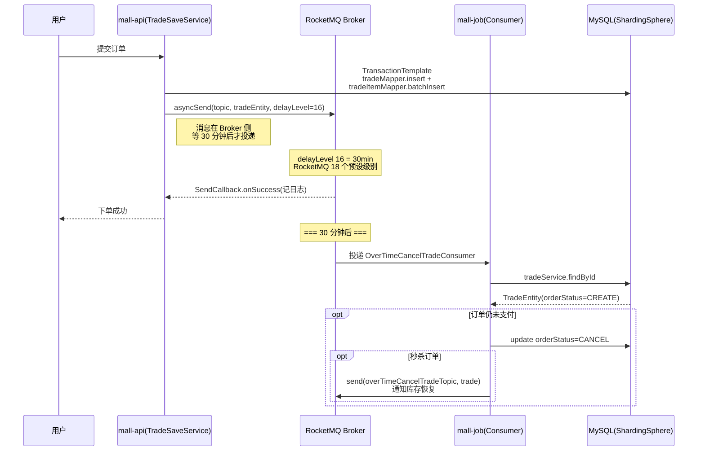

# SpringBoot RocketMQ 全操作指南

> 📖 <strong>前置阅读</strong>：本文假设读者已理解 RocketMQ 的核心概念（NameServer、Broker、Topic、Queue、ConsumerGroup）。如果还不熟悉，建议先阅读 [<strong>RocketMQ 核心架构与消息模型</strong>]()。

## 🎯 第一步：目标说明

上一篇用原版 RocketMQ Java Client 写了 `DefaultMQProducer` + `DefaultMQPushConsumer`。真实的 SpringBoot 项目里不需要那么多样板代码——`rocketmq-spring-boot-starter` 帮你处理了 NameServer 连接、Producer 启动、Consumer 注册。

读完这篇会掌握：

- <strong>MqHelper 封装</strong>——为什么要在 `RocketMQTemplate` 上再包一层，asyncSend + SendCallback 的真实用法
- <strong>30 分钟延迟取消订单</strong>——RocketMQ 内置 delayLevel 的完整实战流程，和 RabbitMQ 方案的对比
- <strong>@RocketMQMessageListener 消费者</strong>——MessageExt 手动反序列化 vs 泛型自动解析，以及三个真实业务消费者
- <strong>Domain Entity 直传</strong>——为什么不做 DTO 转换，以及什么情况下不能这样做
- <strong>双 MQ 基础设施先行</strong>——RabbitMQ 拓扑已就绪但全用 RocketMQ 的设计决策

## 📋 第二步：前置条件

| 前置项 | 具体要求 | 验证命令 |
|--------|----------|----------|
| JDK | 17+（8+ 也兼容） | `java -version` |
| SpringBoot | 3.x（文中用 3.2） | `mvn dependency:tree \| grep spring-boot` |
| RocketMQ | 5.1.4（NameServer + Broker 都在运行） | `docker ps \| grep rocketmq` |
| 前置知识 | NameServer/Broker/Topic/Queue 概念 | — |

确认 RocketMQ 在跑：

```bash
# 确认 NameServer
docker logs rocketmq-namesrv | tail -5
# 预期：The Name Server boot success

# 确认 Broker
docker logs rocketmq-broker | grep "boot success"
# 预期：The broker[broker-a, ...] boot success
```

## 🔧 第三步：环境搭建

### 3.1 依赖

```xml
<dependency>
    <groupId>org.apache.rocketmq</groupId>
    <artifactId>rocketmq-spring-boot-starter</artifactId>
    <version>2.3.0</version>
</dependency>
<dependency>
    <groupId>org.springframework.boot</groupId>
    <artifactId>spring-boot-starter-web</artifactId>
</dependency>
<dependency>
    <groupId>org.projectlombok</groupId>
    <artifactId>lombok</artifactId>
    <optional>true</optional>
</dependency>
```

> ⚠️ 新手提示：`rocketmq-spring-boot-starter` 版本和 RocketMQ Server 版本不要求完全一致——2.3.0 的 starter 连接 5.x 的 Broker 完全没问题。但 Client 协议需要兼容——5.x 的 starter 不能用 `rocketmq-client` 4.x。

### 3.2 配置文件

<strong>真实项目 dev 环境</strong>（mall-api）：

```yaml
rocketmq:
  name-server: 117.72.88.11:9876
  producer:
    group: susan-mall-mgt-group
    send-message-timeout: 3000
```

<strong>真实项目 prod 环境</strong>——敏感信息全部走环境变量注入：

```yaml
rocketmq:
  name-server: ${ROCKETMQ_NAME_SERVER}
  producer:
    group: ${ROCKETMQ_PRODUCER_GROUP:susan-mall-mgt-group}
    send-message-timeout: 3000
```

<strong>两个设计决策值得留意</strong>：

1. <strong>配置极简</strong>——只配了 `name-server`、`group`、`send-message-timeout` 三项。其余参数如 `retry-times-when-send-failed`、`max-message-size` 等全部用 Starter 默认值。真实项目中，默认值在大多数场景下够用，不需要把配置项全部搬出来。

2. <strong>dev 直连 vs prod 环境变量</strong>——dev 写死内网 IP 方便本地联调；prod 用 `${}` 占位，部署时通过 K8s ConfigMap 或启动参数注入。`susan-mall-mgt-group` 作为 `group` 的默认值兜底，保证即使运维忘记配环境变量也不会启动失败。

3. <strong>依赖版本</strong>：`rocketmq-spring-boot-starter 2.1.1`，不是最新的 2.3.0——stabilization 优先，`2.1.1` 已经在生产环境跑通，没必要追新。

## 🏗️ 第四步：分步实践

### 4.1 消息对象——直接用 Domain Entity，不做 DTO 转换

教程中通常会定义一个 `XxxMessage` 作为消息载体，但真实项目中往往<strong>直接把 Domain Entity 扔进消息队列</strong>：

```java
// 超时取消订单消息 —— 直接发 TradeEntity
// TradeSaveService.java:80
mqHelper.send(overTimeCancelTradeTopic, tradeEntity, OVER_TIME_CANCEL_TRADE_DELAY_LEVEL);

// Excel导出通知消息 —— 直接发 CommonNotifyEntity
// ExcelExportTask.java:106
mqHelper.send(excelExportTopic, commonNotifyEntity);

// 动态定时任务消息 —— 直接发 CommonJobEntity
// CommonJobService.java:141
mqHelper.send(commonJobTopic, commonJobEntity);
```

三个真实消息载体：

```java
// 1. 订单实体 (TradeEntity) —— 包含订单全部字段
@Data
public class TradeEntity implements Serializable {
    private Long id;
    private String code;          // 订单编号
    private Long userId;
    private Integer orderStatus;  // OrderStatusEnum: CREATE/PAY/CANCEL...
    private Integer payStatus;    // PayStatusEnum: WAIT_PAY/PAID...
    private BigDecimal tradeAmount;
    private String orderType;     // NORMAL / SECKILL_PRODUCT
    // ... 省略收货地址、商品明细等字段
}

// 2. 通知实体 (CommonNotifyEntity) —— 站内通知
@Data
public class CommonNotifyEntity implements Serializable {
    private String title;
    private String content;       // HTML 格式的通知内容
    private Long toUserId;        // 接收通知的用户 ID
    private Integer isPush;       // 0=未推送 1=已推送
    private Integer readStatus;   // 0=未读 1=已读
}

// 3. 动态任务实体 (CommonJobEntity) —— Quartz 任务描述
@Data
public class CommonJobEntity implements Serializable {
    private String beanName;      // Spring Bean 名称
    private String cronExpression;
    private CommonJobOperateTypeEnum operateTypeEnum; // NEW/UPDATE/DELETE/RUN_NOW/PAUSE/RESUME
    private Boolean pauseStatus;
}
```

<strong>为什么不做 DTO 转换？</strong>

| 做法 | 优点 | 缺点 |
|------|------|------|
| 定义 XxxMessage DTO | 接口解耦，消息格式独立于 DB 表变更 | 多一层转换，字段变更时两端都要改 |
| <strong>直接发 Domain Entity</strong> | 零转换成本，消费者拿到的对象和 DB 一致 | 消息大小随表字段膨胀，改表可能影响消息兼容性 |

该项目的做法有一个看不见的约束支撑：<strong>同一业务模块的发送端和消费端在同一个项目内，共享同一套 Domain 类</strong>。所以不存在"消息格式与消费者不兼容"的问题。

> ⚠️ 新手提示：如果消息的发送方和消费方<strong>分属不同的微服务</strong>，就不要这样干了——应该定义独立的 DTO 类，保证消息契约的独立性。

### 4.2 RocketMQTemplate —— 项目里加了一层 MqHelper

教程里通常直接注入 `RocketMQTemplate`，一行代码搞定。真实项目里多了一层抽象——`MqHelper` 统一包装了 RabbitMQ 和 RocketMQ 的发送逻辑。

<strong>为什么需要 MqHelper？</strong> 这个项目里 RabbitMQ 和 RocketMQ 是同时使用的（RabbitMQ 有完整的基础设施配置，只是当前全部业务跑在 RocketMQ 上）。如果每个业务 Service 都同时注入 `RabbitTemplate` 和 `RocketMQTemplate`，切换成本很高。`MqHelper` 把两种 MQ 的发送逻辑收拢到一起，哪天需要从 RocketMQ 迁到 RabbitMQ，只需改 `MqHelper` 内部实现，业务代码不受影响。

<strong>MqHelper 中 RocketMQ 相关的两个核心方法</strong>：

```java
@Slf4j
@Component
public class MqHelper {

    @Autowired
    private RocketMQTemplate rocketMQTemplate;
    @Autowired
    private RabbitTemplate rabbitTemplate;

    /**
     * 发送 RocketMQ 延迟消息
     * @param topic       Topic 名称
     * @param data        消息体（直接传 Domain Entity）
     * @param delayLevel  RocketMQ 延迟级别（1~18）
     */
    public void send(String topic, Object data, int delayLevel) {
        try {
            MessageHeaders headers = new MessageHeaders(
                    Collections.singletonMap(
                            MessageConst.PROPERTY_DELAY_TIME_LEVEL,
                            String.valueOf(delayLevel)
                    )
            );
            org.springframework.messaging.Message<Object> message =
                    MessageBuilder.createMessage(data, headers);
            rocketMQTemplate.asyncSend(topic, message,
                new SendCallback() {
                    @Override
                    public void onSuccess(SendResult sendResult) {
                        log.info("延迟消息发送成功, topic:{},message:{}",
                                topic, data);
                    }
                    @Override
                    public void onException(Throwable throwable) {
                        log.error("延迟消息发送失败, topic:{}", topic, throwable);
                    }
                }, 3000, delayLevel);
        } catch (Exception e) {
            log.error("延迟消息发送失败, topic={}", topic, e);
            throw new BusinessException("消息发送失败，请重试");
        }
    }

    /**
     * 发送 RocketMQ 普通消息（异步）
     * @param topic   Topic 名称
     * @param message 消息体
     */
    public void send(String topic, Object message) {
        try {
            rocketMQTemplate.asyncSend(topic, message,
                new SendCallback() {
                    @Override
                    public void onSuccess(SendResult sendResult) {
                        log.info("消息发送成功, topic:{},message:{}",
                                topic, message);
                    }
                    @Override
                    public void onException(Throwable throwable) {
                        log.error("消息发送失败, topic:{}", topic, throwable);
                    }
                });
        } catch (Exception e) {
            log.error("消息发送失败, topic={}", topic, e);
            throw new BusinessException("消息发送失败，请重试");
        }
    }
}
```

<strong>五个设计决策</strong>：

1. <strong>全部用 asyncSend，不用 syncSend</strong>——syncSend 要等 Broker 返回 `SendResult`，阻塞业务线程。asyncSend 通过 `SendCallback` 回调通知结果，主业务路径不被 MQ 拖累。失败时写日志就够了——三个业务场景（超时取消、通知、定时任务同步）都不需要同步确认。

2. <strong>延迟消息不走 RocketMQ 的 `syncSendDelay`</strong>（那是同步阻塞的），而是通过 `MessageHeaders` 注入 `PROPERTY_DELAY_TIME_LEVEL` 再用 asyncSend——异步 + 延迟的组合做法。

3. <strong>统一 try-catch 兜底</strong>——不管是什么原因（NameServer 连不上、Topic 不存在、消息体序列化失败），全部 catch 并抛 `BusinessException("消息发送失败，请重试")`，让上层 ControllerAdvice 统一处理。不会出现"MQ 挂了整个请求挂掉但日志里只有一句 NullPointerException"的搞笑场面。

4. <strong>Topic 名称从 `@Value` 注入</strong>——`@Value("${mall.mgt.excelExportTopic:EXCEL_EXPORT_TOPIC}")`，而不是代码里写死字符串。好处是改 Topic 名只需要改配置，甚至可以通过环境变量覆盖。

5. <strong>不用 `Topic:Tag` 拼接格式</strong>——`rocketMQTemplate.asyncSend(topic, message)` 而不是 `asyncSend("topic:tag", message)`。这个项目的消息过滤需求简单，不需要 Tag 细分；如果真的需要 Tag，后续在 message 的 header 里添加即可，不影响方法签名。

| 模式 | MqHelper 对应 | 底层方法 | 项目是否使用 |
|------|:---:|------|:---:|
| <strong>同步发送</strong> | — | `syncSend` | ❌ 不使用 |
| <strong>异步发送</strong> | `send(topic, data)` | `asyncSend` + `SendCallback` | ✅ Excel导出通知、动态任务同步 |
| <strong>异步延迟</strong> | `send(topic, data, delayLevel)` | `asyncSend` + header | ✅ 超时取消订单 |
| <strong>单向发送</strong> | — | `sendOneWay` | ❌ 不使用 |

### 4.3 消费者 —— 三个真实的 @RocketMQMessageListener

该项目的消费者全部在 `mall-job` 模块中（独立部署的 Job 服务），每个消费者解决一个真实的业务问题。三个消费者有一个共同模式——<strong>接收 `MessageExt` 并用 Hutool JSONUtil 手动解析</strong>，不用泛型自动反序列化。

为什么不用 `RocketMQListener<TradeEntity>` 泛型自动解析？两个原因：

1. <strong>消息体不是纯 JSON</strong>——`RocketMQTemplate.asyncSend` 发送 Java 对象时，底层用的是 RocketMQ 的 `MessagePayloadConverter`，序列化格式依赖 Starter 版本。直接收 `MessageExt` 然后 `new String(body)` + `JSONUtil.toBean` 更可控。
2. <strong>泛型解析失败时异常信息很差</strong>——"类型转换异常: can not cast ..." 不如手动解析写清楚日志 "接收到消息：{content}" 再反序列化，排查快得多。

#### 4.3.1 超时取消订单消费者——延迟消息 + 业务补偿

```java
@RocketMQMessageListener(
    topic = "${mall.mgt.overTimeCancelTradeTopic:OVER_TIME_CANCEL_TRADE_TOPIC}",
    consumerGroup = "${mall.mgt.overTimeCancelTradeGroup:OVER_TIME_CANCEL_TRADE_GROUP}")
@Slf4j
@Component
public class OverTimeCancelTradeConsumer
        implements RocketMQListener<MessageExt> {

    @Autowired
    private TradeService tradeService;

    @Override
    public void onMessage(MessageExt message) {
        byte[] body = message.getBody();
        String content = new String(body);
        log.info("OverTimeCancelTradeConsumer接收到消息：{}", content);
        TradeEntity tradeEntity = JSONUtil.toBean(content, TradeEntity.class);
        tradeService.handleOverTimeCancelTrade(tradeEntity);
    }
}
```

`handleOverTimeCancelTrade` 的业务逻辑：查询数据库确认订单状态 → 如果还是 `CREATE`（未支付）→ 更新为 `CANCEL`；如果是秒杀订单，还会<strong>再发一条消息通知库存恢复</strong>。

SpEL 形式的 topic 和 consumerGroup：`${mall.mgt.overTimeCancelTradeTopic:OVER_TIME_CANCEL_TRADE_TOPIC}`——优先读配置，读不到用默认值兜底。

#### 4.3.2 Excel导出通知消费者——WebSocket 推送

```java
@RocketMQMessageListener(
    topic = "${mall.mgt.excelExportTopic:EXCEL_EXPORT_TOPIC}",
    consumerGroup = "${mall.mgt.excelExportGroup:EXCEL_EXPORT_GROUP}")
@Slf4j
@Component
public class ExcelExportConsumer implements RocketMQListener<MessageExt> {

    @Autowired
    private CommonNotifyMapper commonNotifyMapper;

    @Override
    public void onMessage(MessageExt message) {
        byte[] body = message.getBody();
        String content = new String(body);
        log.info("ExcelExportConsumer接收到消息：{}", content);
        CommonNotifyEntity commonTaskEntity =
                JSONUtil.toBean(content, CommonNotifyEntity.class);
        pushNotify(commonTaskEntity);
    }

    private void pushNotify(CommonNotifyEntity commonNotifyEntity) {
        try {
            // WebSocket 推送到目标用户浏览器
            WebSocketServer.sendMessage(commonNotifyEntity);
            // 标记已推送
            commonNotifyEntity.setIsPush(1);
            FillUserUtil.mockCurrentUser();
            commonNotifyMapper.update(commonNotifyEntity);
        } catch (IOException e) {
            log.error("WebSocket通知推送失败，原因：", e);
        } finally {
            FillUserUtil.clearCurrentUser();
        }
    }
}
```

这个消费者的特别之处：<strong>消息消费 + WebSocket 推送 + DB 状态回写</strong>三步在同一个方法中完成。但注意 <strong>它不是事务性的</strong>——WebSocket 推送失败后 DB 更新不会回滚，只记日志。这是有意为之：Excel 导出通知允许偶尔推送失败（用户刷新页面也能看到），但 push 失败的记录不会标记为"已推送"，下次可重试。

#### 4.3.3 动态定时任务消费者——枚举驱动的操作分发

```java
@RocketMQMessageListener(
    topic = "${mall.mgt.commonJobTopic:COMMON_JOB_TOPIC}",
    consumerGroup = "${mall.mgt.commonJobGroup:COMMON_JOB_GROUP}")
@Slf4j
@Component
public class DynamicJobConsumer implements RocketMQListener<MessageExt> {

    @Autowired
    private QuartzManage quartzManage;

    @Override
    public void onMessage(MessageExt message) {
        byte[] body = message.getBody();
        String content = new String(body);
        log.info("DynamicJobConsumer接收到消息：{}", content);
        CommonJobEntity commonJobEntity =
                JSONUtil.toBean(content, CommonJobEntity.class);
        handleDynamicJobMessage(commonJobEntity);
    }

    private void handleDynamicJobMessage(CommonJobEntity commonJobEntity) {
        CommonJobOperateTypeEnum operateTypeEnum =
                commonJobEntity.getOperateTypeEnum();
        switch (operateTypeEnum) {
            case NEW:     quartzManage.addJob(commonJobEntity);      break;
            case UPDATE:  quartzManage.updateJobCron(commonJobEntity); break;
            case DELETE:  quartzManage.deleteJob(commonJobEntity);   break;
            case RUN_NOW: quartzManage.runJobNow(commonJobEntity);   break;
            case PAUSE:   quartzManage.pauseJob(commonJobEntity);    break;
            case RESUME:  quartzManage.resumeJob(commonJobEntity);   break;
            default:
                throw new BusinessException("动态定时任务操作类型错误");
        }
    }
}
```

这个设计是典型的<strong>"命令消息"模式</strong>——消息体里有 `operateTypeEnum` 枚举字段，消费者根据枚举值 dispatch 到不同的 Quartz 操作。<strong>为什么不拆成 6 个 Consumer？</strong>因为操作类型是消息的一部分，拆 Consumer 要 6 个类、6 个注解、6 个 ConsumerGroup，维护成本和 Topic 数量都翻倍。一个 Consumer 一个 switch 足够清晰。

<strong>注解参数速查</strong>：

| 参数 | 含义 | 项目实际值示例 |
|------|------|------|
| `topic` | 订阅的 Topic（SpEL 可读配置） | `${mall.mgt.commonJobTopic:COMMON_JOB_TOPIC}` |
| `consumerGroup` | ConsumerGroup 名称 | `${mall.mgt.overTimeCancelTradeGroup:...}` |
| `selectorExpression` | 过滤表达式（项目未设=默认 `*`） | 未设置 |
| `consumeMode` | 并发/顺序（项目未设=默认并发） | 未设置 |
| `consumeThreadNumber` | 消费线程数（项目未设=默认 20） | 未设置 |

> ⚠️ 新手提示：`topic` 和 `consumerGroup` 用 SpEL 读配置是项目里非常实用的做法——同一个消费者在 dev 和 prod 可以用不同的 Topic 名，避免 dev 环境的消息被 prod 消费者意外消费。

### 4.4 顺序消息 —— RocketMQ 的原生杀手锏

<strong>需求</strong>：订单创建 → 支付 → 发货 三条消息必须按顺序消费。如果发货消息在支付消息之前被处理，业务就乱了。

RabbitMQ 要保证顺序很麻烦——需要关掉所有并发、限制一个消费者。RocketMQ 原生支持：<strong>同一个 Queue 内的消息严格有序</strong>。

<strong>发送端</strong>——用 `syncSendOrderly`，指定选择 Queue 的 key：

```java
// 同一个 orderId 的消息进同一个 Queue → 这个 Queue 内消息天然有序
public void sendOrderly(OrderMessage msg) {
    rocketMQTemplate.syncSendOrderly(
        "order-topic",       // Topic（不含 Tag）
        msg,
        msg.getOrderId().toString()   // 根据 orderId 哈希 → 选 Queue
        //  同一个 orderId → 同一个哈希 → 同一个 Queue → 消息有序！
    );
}
```

<strong>消费端</strong>——消费模式设为 `CONSUME.ORDERLY`：

```java
@Component
@RocketMQMessageListener(
    topic = "order-topic",
    consumerGroup = "order-orderly-consumer",
    consumeMode = ConsumeMode.ORDERLY   // ← 顺序消费模式
)
public class OrderOrderlyListener
        implements RocketMQListener<OrderMessage> {

    @Override
    public void onMessage(OrderMessage msg) {
        System.out.printf("顺序消费: orderId=%d, action=%s, queueId=%d%n",
                msg.getOrderId(), msg.getAction(),
                // 同一订单的三条消息在同一个 Queue
                msg.getQueueId());
        // 处理业务...
        // 注意：顺序模式下，前一条消息返回 CONSUME_SUCCESS 后，
        //       消费者才会拉取下一条——不能在这里开异步线程
    }
}
```

<strong>`syncSendOrderly` 的哈希原理</strong>：

```
hash = messageQueueSelector.select(messageQueueList, message, hashKey)
// hashKey = orderId.toString()

假设 8 个 Queue：
    "10001" → hash("10001") % 8 = 3 → Queue-3
    "10002" → hash("10002") % 8 = 5 → Queue-5
    "10001" 的另一条消息 → hash("10001") % 8 = 3 → Queue-3  ✅ 和之前的订单在同一个 Queue
```

> ⚠️ 新手提示：顺序消息是 RocketMQ 的强项，但<strong>不能滥用</strong>。顺序消费的吞吐量远低于并发消费——因为同一个 Queue 只能被一个线程消费，且前一条 ACK 后才能拉下一条。只对确实需要顺序的业务（如订单状态流转）使用顺序消息。普通的通知、日志不需要。

### 4.5 Tag 过滤与 SQL 过滤

<strong>Tag 过滤</strong>（`selectorType = TAG`，默认）：

```java
@Component
@RocketMQMessageListener(
    topic = "order-topic",
    consumerGroup = "order-payment-consumer",
    selectorExpression = "paid",  // 只收 Tag=paid 的消息
    selectorType = SelectorType.TAG
)
public class OrderPaymentListener
        implements RocketMQListener<OrderMessage> {
    // ...
}
```

Tag 表达式支持 `||`：

```java
selectorExpression = "created || paid"           // 收 created 或 paid
selectorExpression = "*"                          // 收所有 Tag
selectorExpression = "paid || cancelled || refund" // 收三个 Tag
```

<strong>SQL92 过滤</strong>（`selectorType = SQL92`）——更强大的过滤：

```java
@Component
@RocketMQMessageListener(
    topic = "order-topic",
    consumerGroup = "order-important-consumer",
    // SQL92 表达式——只收金额 > 1000 的高价值订单
    selectorExpression = "amount > 1000",
    selectorType = SelectorType.SQL92
)
public class ImportantOrderListener
        implements RocketMQListener<OrderMessage> {
    // ...
}
```

SQL92 过滤支持：

```sql
-- 比较
amount > 1000 AND action = 'created'

-- IS NULL / IS NOT NULL
productName IS NOT NULL

-- IN
action IN ('created', 'paid')

-- 范围
(amount >= 500 AND amount <= 5000)
```

启用 SQL92 过滤需要在 Broker 配置中加上：

```properties
# broker.conf
enablePropertyFilter = true
```

> ⚠️ 新手提示：SQL92 过滤是在 Broker 端执行的——不符合条件的消息<strong>根本不会被传输到消费者</strong>，节省了网络带宽。但启动时需要在 Broker 配置 `enablePropertyFilter=true`，否则消费者会报错连不上。

### 4.6 真实业务全景——三个流程串起来

前面分别看了 MqHelper 的发送端和三个消费者的接收端，现在把它们串起来看完整的业务流。

#### 4.6.1 核心流程：下单 → 延迟消息 → 30 分钟后自动取消

这是 RocketMQ 在该项目里<strong>最关键的使命</strong>——"下单 30 分钟未支付自动取消"。



`TradeSaveService.createTrade` 的关键代码：

```java
@DS("sharding")
public void createTrade(JwtUserEntity currentUserInfo, TradeEntity tradeEntity) {
    tradeEntity.setId(idGenerateHelper.nextId());
    tradeEntity.setOrderStatus(OrderStatusEnum.CREATE.getValue());
    tradeEntity.setPayStatus(PayStatusEnum.WAIT_PAY.getValue());

    // TransactionTemplate 而非 @Transactional——
    // ShardingSphere 分库分表下声明式事务不生效
    transactionTemplate.execute((status) -> {
                tradeMapper.insert(tradeEntity);
                tradeEntity.getTradeItemEntityList().forEach(x -> {
                    x.setTradeId(tradeEntity.getId());
                });
                tradeItemMapper.batchInsert(tradeEntity.getTradeItemEntityList());
                return Boolean.TRUE;
            }
    );

    // 发送延迟消息：30 分钟后检查，未支付则自动取消
    sendOvertimeCancelTradeMessage(tradeEntity);
}

private void sendOvertimeCancelTradeMessage(TradeEntity tradeEntity) {
    mqHelper.send(overTimeCancelTradeTopic,
            tradeEntity,
            OVER_TIME_CANCEL_TRADE_DELAY_LEVEL);  // delayLevel = 16
}
```

<strong>为什么用 RocketMQ 做延迟取消而不是 RabbitMQ？</strong>

| 方案 | 延迟实现 | 精度 | 可靠性 |
|------|----------|:---:|:---:|
| <strong>RocketMQ delayLevel</strong> | Broker 内置 18 个延迟级别，原生支持 | 分钟级（预设级别） | 高——Broker 端消息持久化 |
| RabbitMQ x-message-ttl + DLX | 队列 TTL 过期 → 死信队列 | 毫秒级 | 中——消息在 TTL 期间无法被其他消费者看到 |
| RabbitMQ delayed-message-exchange | 插件实现（非官方） | 毫秒级 | 低——插件可能不兼容新版 Broker |
| Redis 过期回调 + 定时扫表 | keyspace notification + 定时任务 | 秒级 | 低——过期回调不可靠，可能丢 |

项目选了 RocketMQ 延迟消息做超时取消，看中的就是<strong>Broker 原生支持、不需要额外插件、消息持久化可靠</strong>。30 分钟正好是 delayLevel=16（预设的 18 个级别之一），不需要精确到秒。

#### 4.6.2 通知流程：Excel 导出 → MQ → WebSocket 推送

后台管理导出 Excel → 生成文件 → 写通知记录 → 发 RocketMQ → 消费者通过 WebSocket 推到用户浏览器。

这是一个典型的<strong>"解耦异步通知"模式</strong>——导出操作和通知推送是两个独立的物理节点（mall-api 和 mall-job），RocketMQ 在中间做桥梁。

```java
// ExcelExportTask.java —— 导出完成后
CommonNotifyEntity commonNotifyEntity =
    transactionTemplate.execute((status) -> {
        commonTaskMapper.update(commonTaskEntity);  // 更新任务状态
        return saveNotifyMessage(commonTaskEntity);  // 写通知记录
    });

// 通过 RocketMQ 异步通知，不阻塞导出线程
mqHelper.send(excelExportTopic, commonNotifyEntity);
```

选择 `asyncSend` 的原因：导出本身已经完成、文件 URL 已经入库，<strong>通知推送是"锦上添花"的事</strong>，没必要用 syncSend 阻塞等 Broker 确认。push 失败用户刷新页面也能看到通知。

#### 4.6.3 一致性流程：多节点 Quartz 动态任务同步

当管理员在后台新增/修改/删除/暂停/恢复一个定时任务时，<strong>所有 mall-job 节点都需要感知到这个变化</strong>——RocketMQ 在这里的角色是"分布式事件总线"。

```java
// CommonJobService.java
public int insert(CommonJobEntity commonJobEntity) {
    checkParam(commonJobEntity);
    commonJobEntity.setPauseStatus(false);
    int insert = commonJobMapper.insert(commonJobEntity);  // 先落库

    // 通过 MQ 广播到所有 Job 节点
    commonJobEntity.setOperateTypeEnum(CommonJobOperateTypeEnum.NEW);
    sendDynamicJobMessage(commonJobEntity);
    return insert;
}

private void sendDynamicJobMessage(CommonJobEntity commonJobEntity) {
    mqHelper.send(commonJobTopic, commonJobEntity);
}
```

消息内容和 Consumer 的分发逻辑在 4.3.3 已经见过——`switch (operateTypeEnum)` 六路分发。这里有意思的点是：<strong>先落库、再发消息</strong>——Consumer 收到消息后从内存里的 `QuartzManage` 直接操作，但 DB 记录已经在发送端写好了。如果消息丢失（asyncSend 的场景），至少 DB 是准的，后续可以通过定时全量同步来修复。

#### 4.6.4 为什么 RabbitMQ 基础设施也配好了却没用？

在 `RabbitConfig` 里可以看到 4 组 Exchange/Queue/Binding 全配好了——`excel_export_exchange`、`over_time_cancel_trade_exchange`、`trade_status_change_exchange`、`dynamic_job_exchange`，对应 RocketMQ 的三个业务场景。但 `MqHelper` 里所有业务代码调用的都是 `send(String topic, ...)`  → RocketMQ。

这是典型<strong>"基础设施先行"策略</strong>：RabbitMQ 的拓扑结构已经声明，MqHelper 的 RabbitMQ 相关方法（`send(exchange, routingKey, data)`、`sendDelayMessage(...)`）也已经就绪。哪天需要从 RocketMQ 切到 RabbitMQ，操作步骤非常明确：

1. `application.yml` 添加 `spring.rabbitmq` 配置
2. 把 `mqHelper.send(topic, data)` 改成 `mqHelper.send(exchange, routingKey, data)`（用对应的 RabbitConfig 常量）
3. 消费者端把 `@RocketMQMessageListener` 改成 `@RabbitListener`

不需要重新设计拓扑，不需要重新定义消息格式，<strong>切换成本被 MqHelper 层控制在 3 步以内</strong>。

## 第五步：FAQ —— 项目实战踩坑记录

| 问题 | 原因 | 解决 |
|------|------|------|
| `MQClientException: No route info of this topic` | Topic 不存在——Broker 自动创建关闭或生产者没权限 | 首次发送前手动创建 Topic：`mqadmin updateTopic -n namesrv:9876 -t OVER_TIME_CANCEL_TRADE_TOPIC`。生产环境关闭 `autoCreateTopicEnable` 是安全要求 |
| 延迟消息没按预期 30 分钟后投递 | RocketMQ 的 delayLevel 和实际时间的映射记错了 | RocketMQ 不支持自定义延迟时间！只有 18 个预设级别：`1=1s, 2=5s, 3=10s, 4=30s, 5=1m, 6=2m, 7=3m, 8=4m, 9=5m, 10=6m, 11=7m, 12=8m, 13=9m, 14=10m, 15=20m, 16=30m, 17=1h, 18=2h`。如果需要 15 分钟延迟，没有对应的级别——只能选接近的或用定时任务兜底 |
| `asyncSend` 回调里抛异常，调用方感知不到 | asyncSend 的 `SendCallback.onException` 只记日志 | 项目里 MqHelper 的 `SendCallback.onException` 只打 `log.error`。对于关键业务（如超时取消），建议额外加监控——比如 `onException` 里写一个 Redis key 或发告警 Webhook |
| 消费者收到消息但反序列化报错 | 发送端和消费端用了不同的 JSON 库或实体类版本不一致 | 项目用 `MessageExt.getBody()` + Hutool `JSONUtil.toBean` 手动反序列化，比泛型自动反序列化更可控。如果字段对不上，Hutool 不会抛异常，只会忽略多余字段或给不存在的字段填 null——注意检查 null |
| Topic 名称的 SpEL 表达式没解析，直接当字符串用了 | 忘记在 `@Value` 里配对应的配置 key | `@RocketMQMessageListener(topic = "${mall.mgt.excelExportTopic:EXCEL_EXPORT_TOPIC}")` 要求 `application.yml` 或环境变量中有 `mall.mgt.excelExportTopic`。如果没配，走默认值 `EXCEL_EXPORT_TOPIC`——确认发送端和消费端用了一致的 Topic 名 |
| 消费者重复消费同一条消息 | RocketMQ 消费超时后 Broker 重新投递 | 消费者方法里尽量做幂等：超时取消消费者先查订单状态（已取消就不重复操作），Excel 通知消费者用 `isPush=1` 做去重标记 |
| RabbitMQ 的 `RabbitConfig` 里配了 4 组 Exchange/Queue，但消费者全是 RocketMQ 的 | 项目做了双 MQ 基础设施准备，RabbitMQ 拓扑已声明但未启用 | 不是 bug——这是"基础设施先行"策略。想切到 RabbitMQ 时参考 4.6.4 的切换步骤 |

## 🎯 总结

本文从理论到实战，把 RocketMQ 在 SpringBoot 项目中的真实用法讲了一遍：

1. <strong>MqHelper 统一封装</strong>：不直接注入 `RocketMQTemplate`，而是通过 `MqHelper` 收拢发送逻辑。asyncSend + SendCallback 日志记录、统一 try-catch 兜底转 BusinessException、Topic 名从配置注入。同时预留 RabbitMQ 发送方法，为双 MQ 切换做准备。

2. <strong>延迟消息——RocketMQ 的核心价值</strong>：利用内置 18 个 delayLevel 实现"下单 30 分钟未支付自动取消"。不需要额外插件、不需要死信队列，比 RabbitMQ 的 `x-message-ttl` + DLX 方案更简洁可靠。delayLevel=16 正好对应 30 分钟。

3. <strong>三个真实消费者</strong>：超时取消（延迟消息 + 业务补偿）、Excel 通知（MQ → WebSocket → DB 状态回写）、动态任务同步（枚举驱动六路操作分发）。全部接收 `MessageExt` 手动反序列化，不用泛型自动解析。

4. <strong>Domain Entity 直传</strong>：不做 DTO 转换，`TradeEntity`、`CommonNotifyEntity`、`CommonJobEntity` 直接扔进消息队列。前提是发送端和消费端共享同一套 Domain 类——这是单体多模块项目的优势。

5. <strong>RabbitMQ 基础设施先行</strong>：虽然当前全部业务跑在 RocketMQ 上，但 RabbitMQ 的 4 组 Exchange/Queue/Binding 已经在 `RabbitConfig` 中就绪。`MqHelper` 的抽象层让将来切换只需改 3 步，不需要重新设计拓扑。

> 📖 <strong>下一步阅读</strong>：延迟消息搞定了"30 分钟自动取消"，但怎么保证"下单 + 扣库存 + 发消息"这三个操作的原子性？继续阅读 [<strong>顺序消息、延迟消息与事务消息</strong>]()，一篇掌握 RocketMQ 最独特的三大高级特性。
