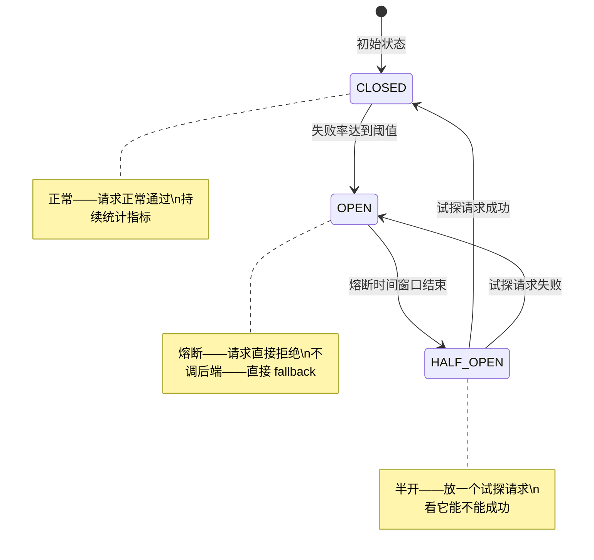
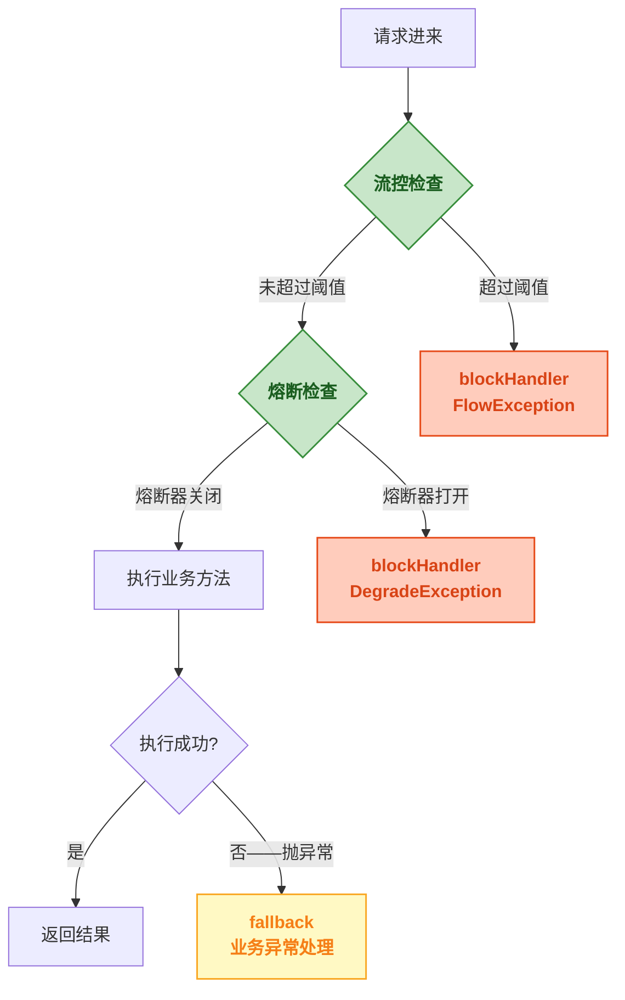

# Sentinel 熔断降级规则

> 📖 <strong>前置阅读</strong>：本文假设读者已掌握 Sentinel 流控规则和 blockHandler/fallback 的基本用法。如果还不熟悉，建议先阅读 [<strong>Sentinel 核心概念与快速上手</strong>]() 和 [<strong>Sentinel 流控规则全解</strong>]()。

## 一、⚡ 限流是自己控制的——但接口突然变慢是意外

你给 `getUser` 接口配了 QPS 限流 = 100——这是主动控制。但有一天数据库查询从 50ms 涨到了 5s——不是流量大，是<strong>接口本身出问题了</strong>。

这 5s 的查询会带来一连串的后果：

```
getUser 每次耗时 5s
  → 调它的 100 个请求都在等——线程池 100 个线程全占满
  → 其他接口没线程可用——跟着一起 502
  → 上游调 getUser 的 10 个服务全超时——各自线程池也满
  → 整个系统雪崩
```

限流解决不了这个问题——100 QPS 还是 100 QPS，只是每个请求都慢到 5s。<strong>熔断降级解决的就是"接口自己出问题"</strong>——检测到异常主动切断对故障接口的调用——等它恢复了再放行。

## 二、🔄 熔断器状态机——每个熔断器都一样

不管是 Sentinel、Hystrix 还是 Resilience4j，熔断器的状态机都是一样的——三个状态：



| 状态 | 行为 | 进入条件 |
|------|------|------|
| <strong>CLOSED（关闭）</strong> | 正常通过——统计指标 | 初始状态——或 HALF_OPEN 试探成功 |
| <strong>OPEN（打开）</strong> | 直接拒绝——不走后端——直接调 fallback | 指标达到阈值 |
| <strong>HALF_OPEN（半开）</strong> | 放一个试探请求——其他拒绝 | OPEN 持续一段时间后自动进入 |

## 三、🧬 Sentinel 的三种熔断策略

Sentinel 支持三种熔断策略——比 Hystrix（只支持异常比例）更精细：

### 3.1 慢调用比例（SLOW_REQUEST_RATIO）

<strong>如果一定比例的请求耗时过长——熔断</strong>：

```java
DegradeRule rule = new DegradeRule();
rule.setResource("getUser");
rule.setGrade(CircuitBreakerStrategy.SLOW_REQUEST_RATIO.getType());
rule.setCount(200);                    // 慢调用阈值——耗时 > 200ms 算"慢"
rule.setSlowRatioThreshold(0.5);      // 慢调用比例——50% 的请求都是慢调用
rule.setMinRequestAmount(10);         // 最少 10 个请求——防止"就 1 个请求刚好慢了"的误判
rule.setStatIntervalMs(1000);         // 统计窗口——1s
rule.setTimeWindow(10);               // 熔断持续时间——10s
```

这条规则的意思：
```
统计 1 秒内的请求：
  最少有 10 个请求（minRequestAmount）
  其中 50% 的请求耗时 > 200ms（slowRatioThreshold + count）
  → 触发熔断——10 秒内所有请求直接拒绝
  → 10 秒后进入半开
```

### 3.2 异常比例（ERROR_RATIO）

<strong>如果一定比例的请求抛异常——熔断</strong>：

```java
DegradeRule rule = new DegradeRule();
rule.setResource("getUser");
rule.setGrade(CircuitBreakerStrategy.ERROR_RATIO.getType());
rule.setCount(0.3);                    // 异常比例——30% 的请求抛异常
rule.setMinRequestAmount(10);          // 最少 10 个请求
rule.setStatIntervalMs(1000);          // 统计窗口——1s
rule.setTimeWindow(10);                // 熔断 10s
```

```
统计 1 秒内的请求：
  最少 10 个请求
  其中 30% 抛异常（BlockException 除外——BlockException 是 Sentinel 自己抛的不算）
  → 熔断
```

<strong>注意</strong>：`BlockException`（被限流时抛的异常）不算在异常比例中——只统计业务异常。

### 3.3 异常数（ERROR_COUNT）

<strong>如果一分钟内的异常数超过阈值——熔断</strong>：

```java
DegradeRule rule = new DegradeRule();
rule.setResource("getUser");
rule.setGrade(CircuitBreakerStrategy.ERROR_COUNT.getType());
rule.setCount(5);                      // 异常数——只要有 5 个异常就熔断
rule.setMinRequestAmount(5);           // 最少 5 个请求
rule.setStatIntervalMs(1000);          // 统计窗口——1s
rule.setTimeWindow(10);                // 熔断 10s
```

<strong>适用场景</strong>：接口流量很低——不能用比例（1 个请求出错就 100% 异常率）。用异常数——"连续 5 个失败就直接熔断"。

## 四、📊 三种策略对比——什么时候用哪个

| 策略 | 统计指标 | 适用场景 | 不适用场景 |
|------|------|------|------|
| <strong>慢调用比例</strong> | RT（响应时间） | 接口本身慢——数据库慢查询、RPC 超时 | 接口本来就很慢——如报表导出 10s 是正常的 |
| <strong>异常比例</strong> | 异常数量 / 总请求 | 流量稳定——大多数场景 | 流量太低——1 个错误就是 100% |
| <strong>异常数</strong> | 异常数量 | 低流量接口——或对少量错误零容忍 | 高流量——10 个错误可能只是因网络抖动触发了不必要的熔断 |

### 实战中的推荐组合

```
高频接口（QPS > 100）：
  → 用"慢调用比例"——多数问题都是"变慢"而不是"报错"
  → 如果数据库连接池满了——查询不会报错而是等——慢调用能抓到这种问题

低频接口（QPS < 10）：
  → 用"异常数"——异常比例在低流量下不稳定
  → 连续 3 个失败——基本可以确定是出问题了

关键接口（支付/转账）：
  → 用"异常比例"——对错误特别敏感
  → 20% 就熔断——宁可熔断也不能少扣/多扣钱
```

## 五、🔧 熔断与限流配合——处理流程全链路

一个请求进来——先经过流控、再经过熔断、最后执行业务。如果业务出错——走 fallback：

```java
@Service
public class OrderService {

    // 这个资源同时有限流和熔断规则保护
    // 限流规则：QPS > 200 → 拒绝
    // 熔断规则：50% 慢调用 → 熔断 10s
    @SentinelResource(
        value = "createOrder",
        blockHandler = "createOrderBlockHandler",   // ① 限流/熔断触发
        fallback = "createOrderFallback"            // ② 业务异常触发
    )
    public Order createOrder(CreateOrderRequest request) {
        // 业务逻辑——可能抛异常
        validateOrder(request);                     // 可能抛 IllegalArgumentException
        inventoryService.deduct(request.getItems()); // 可能抛 RpcException
        return orderRepository.save(buildOrder(request));
    }

    // 限流和熔断走这里——BlockException 是 Sentinel 的子类
    public Order createOrderBlockHandler(CreateOrderRequest request,
                                          BlockException e) {
        if (e instanceof FlowException) {
            System.out.println("被限流了——当前 QPS 过高");
            throw new BusinessException("系统繁忙，请稍后重试");
        } else if (e instanceof DegradeException) {
            System.out.println("被熔断了——接口异常过多");
            throw new BusinessException("服务暂时不可用，请稍后重试");
        }
        throw new BusinessException("系统繁忙");
    }

    // 业务异常走这里
    public Order createOrderFallback(CreateOrderRequest request, Throwable t) {
        System.out.println("业务出错——" + t.getClass().getSimpleName());
        // 记录到数据库或消息队列——后续补偿
        return null;
    }
}
```

### 请求处理全链路



## 六、🖥️ Dashboard 中配置熔断规则

```
Dashboard → 服务列表 → 点你的服务 → 簇点链路 → 找到资源 → +降级

配置项对应：
  "资源名"            → 和 @SentinelResource 的 value 一致
  "降级策略"          → 慢调用比例 / 异常比例 / 异常数
  "RT"               → count（慢调用阈值——ms）
  "比例阈值"          → slowRatioThreshold（0.0~1.0）
  "熔断时长"          → timeWindow（单位 s）
  "最小请求数"        → minRequestAmount
  "统计时长"          → statIntervalMs（单位 ms）
```

## 七、⚖️ Sentinel 熔断 vs Hystrix vs Resilience4j

| 维度 | Hystrix | Resilience4j | Sentinel |
|------|:---:|:---:|:---:|
| <strong>慢调用熔断</strong> | ❌ 不支持——只有异常比例 | ✅ 支持——和 Sentinel 一样 | ✅ <strong>支持</strong>——慢调用比例 |
| <strong>异常比例</strong> | ✅ | ✅ | ✅ |
| <strong>异常数</strong> | ❌ | ✅ | ✅ |
| <strong>半开状态</strong> | 支持——但不够灵活 | ✅ 支持——可以配置试探请求数 | ✅ 支持——一次放一个试探请求 |
| <strong>熔断时长</strong> | 固定——无法动态调整 | 固定 | ✅ <strong>可以设为 -1——永远不自动恢复</strong> |
| <strong>Dashboard</strong> | Hystrix Dashboard——已过时 | 需要集成第三方 | ✅ <strong>原生 Dashboard</strong>——规则实时管理 |

Sentinel 的独特之处：<strong>熔断时间长可以设为 -1</strong>——熔断后不自动恢复——需要手动从 Dashboard 恢复。适合"确认后端修好了才恢复"的场景——如数据库切主从。

## 八、🔑 熔断规则的最佳实践

### 8.1 先配熔断再配限流

```
顺序很重要：
  ① 先配熔断——保护接口不受"自身故障"影响
  ② 再配限流——保护接口不受"流量峰值"影响
  ③ 最后配系统规则——全局兜底

如果只配限流不配熔断——接口慢了不会触发限流——但会拖慢整个系统
```

### 8.2 慢调用阈值怎么定

```
规则：正常 RT + 50% = 慢调用阈值

例子：
  getUser 正常 RT = 50ms → 慢调用阈值 = 75ms
  createOrder 正常 RT = 200ms → 慢调用阈值 = 300ms

不要把阈值设得太接近正常 RT——网络抖动 10ms 就会误熔断
也不要把阈值设得太大——5000ms——都等了 5s 了还不熔断还有什么意义
```

### 8.3 熔断时长按接口重要性分档

| 接口类型 | 熔断时长 | 理由 |
|------|:---:|------|
| 非关键接口（日志上报） | 30s | 熔断时间长一点——反正不重要 |
| 普通接口（用户查询） | 5~10s | 快速恢复——REST API 默认值 |
| 关键接口（支付） | 3~5s | 快速恢复 + 更敏感的阈值 |
| 需要人工排查 | <strong>-1</strong> | 不自动恢复——从 Dashboard 手动恢复 |

## 🎯 总结

1. <strong>熔断和限流解决不同的问题</strong>：限流管"流量太大"——你自己定义的阈值；熔断管"接口出问题"——慢调用/异常比例自动触发。两种规则可以（也应该）同时作用于同一个资源。

2. <strong>三种熔断策略按场景选</strong>：高流量接口用慢调用比例（多数问题都是慢不是报错），低流量接口用异常数（比例在低流量下不稳定），关键接口用异常比例（对错误敏感）。

3. <strong>blockHandler 处理熔断/限流，fallback 处理业务异常</strong>：熔断触发时抛 `DegradeException`（是 `BlockException` 的子类），走 blockHandler。业务异常（如 NPE）走 fallback。两者不混用。

4. <strong>熔断时长 -1 = 不自动恢复</strong>：这是 Sentinel 独有的——适合需要人工排查确认后才恢复的场景。

> 📖 <strong>下一步阅读</strong>：流控和熔断都配好了——但系统整体的 Load/CPU 怎么保护？Gateway 上怎么集成 Sentinel？规则怎么持久化到 Nacos 保证重启不丢失？继续阅读 [<strong>Sentinel 系统规则与生产部署</strong>]()。
