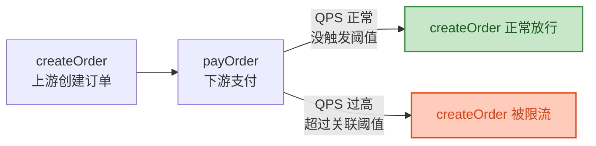

# Sentinel 流控规则

> 📖 <strong>前置阅读</strong>：本文假设读者已掌握 Sentinel 的核心概念——资源/规则/Entry 类型。如果还不熟悉，建议先阅读 [<strong>Sentinel 核心概念与快速上手</strong>]()。

## 一、⚡ "每秒 100 个 QPS"只是流控的冰山一角

上一篇说了 `FlowRule` —— "QPS 超过 100 就拒绝"。但真实的需求远比这复杂：

```
场景 ①：新服务刚启动——JIT 还没热身——扛不住满负荷流量
  → 需要"预热"——先 10 QPS，逐步升到 100 QPS

场景 ②：不想直接拒绝请求——让请求排队等着
  → 需要"排队等待"——请求等 500ms 能排上就处理，超时就拒绝

场景 ③：支付接口出问题——我不想限流它——但我想限流"调用了支付接口"的接口
  → 需要"关联限流"——支付接口 QPS 高了——限流订单创建接口（让压力源头降流量）

场景 ④：同一个 URL 被两个入口调用——我只想限流其中一个入口
  → 需要"链路限流"——只限制从某个入口进来的流量
```

这四个场景对应 Sentinel 流控的<strong>三种效果 × 三种策略</strong>：

```
每条 FlowRule 有两个关键选择：
  ① 效果（ControlBehavior）——超过阈值后怎么办？
  ② 策略（Strategy）——针对谁来限流？
```

## 二、📊 两种 Grade —— 限制了"什么"

### 2.1 QPS 模式（FLOW_GRADE_QPS）

<strong>每秒请求次数</strong>——最常用：

```java
FlowRule rule = new FlowRule();
rule.setResource("getUser");
rule.setGrade(RuleConstant.FLOW_GRADE_QPS);  // 基于 QPS
rule.setCount(100);                           // 阈值：每秒 100 个
```

```
时间线（1 秒内）：
  第 1~100 个请求 → 通过
  第 101 个请求   → 被拒绝（BlockException）
  下一秒重新计数
```

QPS 限流的核心是<strong>滑动窗口计数器</strong>——统计最近 1 秒（可配）的请求数。

### 2.2 线程数模式（FLOW_GRADE_THREAD）

<strong>并发线程数</strong>——适合耗时不稳定的场景：

```java
FlowRule rule = new FlowRule();
rule.setResource("getUser");
rule.setGrade(RuleConstant.FLOW_GRADE_THREAD);  // 基于线程数
rule.setCount(10);                                // 阈值：同时最多 10 个线程
```

```
请求进来 → 开一个线程处理
  第 1~10 个请求 → 10 个线程在处理
  第 11 个请求   → 没有多余线程——直接拒绝
  第 1 个请求处理完 → 线程释放
  第 11 个请求来的时候如果已经有线程释放 → 就通过了
```

<strong>QPS 模式 vs 线程数模式</strong>：

| 维度 | QPS 模式 | 线程数模式 |
|------|------|------|
| 统计对象 | 每秒请求次数 | 当前正在执行的线程数 |
| 适用场景 | <strong>接口响应快且稳定</strong>（< 10ms） | 接口响应慢或不稳定（> 100ms） |
| 为什么 | 响应快时——线程不会堆积——QPS 就是并发量 | 慢接口——线程在等数据库——100 QPS 可能占用 100 个线程 |
| 例子 | `GET /api/users/{id}` 直接查 Redis | `POST /api/orders` 需要调 3 个 RPC + 写库 |

<strong>线程数模式保护的是线程池</strong>——防止慢请求把线程池占满了导致所有接口都不可用。

## 三、🎯 三种流控效果 —— "超了阈值怎么办"

### 3.1 快速失败（CONTROL_BEHAVIOR_DEFAULT）

<strong>默认效果</strong>——超了直接抛 `BlockException`：

```java
FlowRule rule = new FlowRule();
rule.setResource("getUser");
rule.setGrade(RuleConstant.FLOW_GRADE_QPS);
rule.setCount(100);
rule.setControlBehavior(RuleConstant.CONTROL_BEHAVIOR_DEFAULT); // 默认——可以不写
```

```java
// 使用效果
@GetMapping("/{userId}")
@SentinelResource(value = "getUser",
                  blockHandler = "getUserBlockHandler")
public User getUser(@PathVariable Long userId) {
    return userService.getUser(userId);
}

// 被限流时——快速失败——立刻返回错误
public User getUserBlockHandler(Long userId, BlockException e) {
    System.out.println("限流了——快速失败");
    throw new RuntimeException("系统繁忙，请稍后重试");
}
```

### 3.2 WarmUp 预热（CONTROL_BEHAVIOR_WARM_UP）

服务刚启动——线程池还没建立、JIT 还没优化、数据库连接池还没满——<strong>扛不住满负荷</strong>。WarmUp 让系统有一个"热身期"：

```java
FlowRule rule = new FlowRule();
rule.setResource("getUser");
rule.setGrade(RuleConstant.FLOW_GRADE_QPS);
rule.setCount(100);                                    // 预热后的最终阈值
rule.setControlBehavior(RuleConstant.CONTROL_BEHAVIOR_WARM_UP);
rule.setWarmUpPeriodSec(10);                           // 预热时长：10 秒
```

<strong>WarmUp 的效果</strong>：

```
阈值变化曲线（默认斜率 = 3，不容易改）：
  第 0 秒：阈值 = 100 / 3 ≈ 33 QPS
  第 5 秒：阈值 ≈ 66 QPS
  第 10 秒：阈值 = 100 QPS（满负荷）
  第 10 秒之后：一直保持 100 QPS

这个过程中——如果流量突然涨到 100 QPS 也不怕
  → Sentinel 会自动在预热期内拒绝多余的请求
  系统不会因为突然的高流量而崩——温水煮青蛙一样加到满负荷
```

```java
// 典型应用场景——秒杀预热
// 秒杀服务提前 10 分钟启动——预热 5 分钟——等到秒杀开始时——系统已完全热身
```

### 3.3 排队等待（CONTROL_BEHAVIOR_RATE_LIMITER）

<strong>不拒绝请求——让请求排队等待</strong>。以恒定速率（阈值 QPS）处理：

```java
FlowRule rule = new FlowRule();
rule.setResource("getUser");
rule.setGrade(RuleConstant.FLOW_GRADE_QPS);
rule.setCount(10);                                       // 每秒处理 10 个——即 100ms 一个
rule.setControlBehavior(RuleConstant.CONTROL_BEHAVIOR_RATE_LIMITER);
rule.setMaxQueueingTimeMs(500);                          // 排队最多等 500ms——超了就拒绝
```

<strong>排队等待的工作原理</strong>——漏桶算法：

```
场景：QPS 阈值 = 10（100ms 处理一个），排队最多 500ms

请求到达时刻：
  0ms:   第 1 个 → 立即处理（无人排队）
  10ms:  第 2 个 → 等 90ms 到 100ms 时刻
  50ms:  第 3 个 → 等 150ms 到 200ms 时刻
  100ms: 第 4 个 → 等 200ms 到 300ms 时刻
  ...
  某时刻：第 N 个 → 等 600ms → 超过 500ms 排队上限 → 拒绝
```

<strong>适用场景</strong>——处理速度不均匀但不想丢失请求：

```
消息中台——上游每秒推送 1000 条消息——但下游每次只能处理 100 条
  不用丢弃——排队等 500ms 能排上就处理——排不上就返回"稍后重试"
```

> ⚠️ 新手提示：排队等待 <strong>只适用于 QPS 模式</strong>——线程数模式不能用排队（它完全没有"排"的概念）。如果用线程数模式——`setControlBehavior(RATE_LIMITER)` 会被忽略。

## 四、🧭 三种流控策略 —— "针对谁来限流"

### 4.1 直接限流（STRATEGY_DIRECT）

<strong>默认策略</strong>——限流当前资源本身：

```java
FlowRule rule = new FlowRule();
rule.setResource("getUser");
rule.setStrategy(RuleConstant.STRATEGY_DIRECT);  // 默认——可以不写
rule.setCount(100);
// 意思：getUser 这个资源本身——QPS 超过 100 就限流
```

### 4.2 关联限流（STRATEGY_RELATE）

<strong>资源 A 达到阈值 → 限流资源 B</strong>。A 和 B 有依赖关系——A 出问题时让 B 降量：

```java
// 场景：支付接口（payOrder）慢了——让创建订单接口（createOrder）降流
// 因为订单创建的压力会传递到支付——先限流源头——给支付喘气空间
FlowRule rule = new FlowRule();
rule.setResource("createOrder");                       // 我要限流的是 createOrder
rule.setStrategy(RuleConstant.STRATEGY_RELATE);        // 关联策略
rule.setRefResource("payOrder");                       // 关联的资源 = 支付接口
rule.setGrade(RuleConstant.FLOW_GRADE_QPS);
rule.setCount(50);                                     // payOrder 的 QPS 超过 50 时——
                                                       // 限流 createOrder
```

<strong>这个规则的执行逻辑</strong>：

```
时刻 1：payOrder QPS = 20 → 没超过 50 → createOrder 正常
时刻 2：payOrder QPS = 80 → 超过 50 → createOrder 被限流
时刻 3：payOrder QPS = 30 → 恢复 50 以下 → createOrder 恢复

createOrder 被限流的原因是"payOrder 的压力太大了——控制上游流量"
```



### 4.3 链路限流（STRATEGY_CHAIN）

<strong>同一个资源可以被多条调用链路进入——只限制其中一条链路</strong>：

```
资源 = placeOrder（下订单入口——OrderService.placeOrder 方法）

调用链路 A：/api/checkout → CartService → OrderService.placeOrder()
调用链路 B：/api/quick-buy → QuickBuyService → OrderService.placeOrder()
调用链路 C：/api/admin/batch-order → AdminService → OrderService.placeOrder()

需求：限流从 /api/quick-buy 进来的请求（秒杀入口——限制抢购）
      但 /api/checkout（正常购物）和 /api/admin/batch-order（管理员）不受影响
```

```java
// 链路限流——只限流从 /api/quick-buy 进来的 placeOrder

// ① 先配置链路——在入口 Controller 上声明
@RestController
public class QuickBuyController {

    @PostMapping("/api/quick-buy")
    @SentinelResource(value = "quickBuyEntry")  // 入口资源——标记这个入口
    public Order quickBuy(@RequestBody BuyRequest request) {
        return orderService.placeOrder(request);  // 调用 placeOrder
    }
}

// ② placeOrder 上声明资源——但要小心
@Service
public class OrderService {

    @SentinelResource(value = "placeOrder")
    public Order placeOrder(BuyRequest request) {
        // 业务逻辑
    }
}

// ③ 配置链路限流规则
FlowRule rule = new FlowRule();
rule.setResource("placeOrder");                      // 对 placeOrder 限流
rule.setStrategy(RuleConstant.STRATEGY_CHAIN);       // 链路策略
rule.setRefResource("quickBuyEntry");                // 只限从 quickBuyEntry 入口进来的
rule.setGrade(RuleConstant.FLOW_GRADE_QPS);
rule.setCount(10);                                    // 每秒 10 个
```

<strong>关键</strong>：链路限流需要入口和资源<strong>都在 @SentinelResource 中声明</strong>。如果入口没有 `@SentinelResource`——Sentinel 不知道这条链路——链路限流失效。

## 五、🖥️ Dashboard 中配置流控规则

相比代码——Dashboard 中操作更直观。在生产中也是用 Dashboard 管理规则（不需要改代码）：

```
Dashboard → 服务列表 → 点你的服务 → 簇点链路 → 找到资源 → +流控

配置项对应：
  "来源应用"        → limitApp（default = 所有调用方）
  "阈值类型"        → QPS / 线程数
  "流控模式"        → 直接 / 关联 / 链路
  "流控效果"        → 快速失败 / Warm Up / 排队等待
  "QPS 阈值"        → count
  "预热时长"        → warmUpPeriodSec（只有 Warm Up 时才有效）
  "超时时间"        → maxQueueingTimeMs（只有排队等待时才有效）
```

## 六、📋 流控规则速查表

| 需求 | Grade | Strategy | ControlBehavior | 关键参数 |
|------|:---:|:---:|:---:|------|
| "这个接口每秒最多 100 个请求" | QPS | DIRECT | DEFAULT | `count=100` |
| "这个接口同时最多 5 个线程" | THREAD | DIRECT | DEFAULT | `count=5` |
| "新服务刚启动——先 20 QPS，10 秒升到 100" | QPS | DIRECT | WARM_UP | `count=100, warmUpPeriodSec=10` |
| "每秒处理 50 个——多余排队等 500ms" | QPS | DIRECT | RATE_LIMITER | `count=50, maxQueueingTimeMs=500` |
| "支付接口 QPS>50 → 限流创建订单" | QPS | RELATE | DEFAULT | `refResource="payOrder", count=50` |
| "只限流从秒杀入口进来的下订单" | QPS | CHAIN | DEFAULT | `refResource="quickBuyEntry", count=10` |

## 七、🐛 流控规则调试指南

| 问题 | 现象 | 原因 | 解决 |
|------|------|------|------|
| 配了规则没生效 | 超了阈值请求还是通过了 | 资源名和 `@SentinelResource` 的 `value` 不一致 | 检查资源名是否完全一致——区分大小写 |
| 链路限流不生效 | 所有入口过来的都被限了 | 入口没声明 `@SentinelResource`——Sentinel 看不到入口 | 在入口 Controller 上加注解 |
| WarmUp 不像预期 | 刚启动阈值就很低 | 曲线因子默认 = 3——冷阈值 = count/3 | 调整曲线因子——或接受冷启动低吞吐 |
| 排队等待导致延迟 | 接口变慢了——不是变快了 | 排队等 500ms + 处理时间——响应变长但不会丢请求 | 这是预期行为——排队是"不丢"不是"更快" |

## 🎯 总结

1. <strong>两种 Grade、三种效果、三种策略——组合起来覆盖所有限流场景</strong>。QPS 模式最通用——线程数模式适合慢接口。快速失败最常用——WarmUp 预热保护新服务——排队等待适合不丢数据的场景。

2. <strong>关联限流保护下游</strong>——支付接口 QPS 高了 → 限流创建订单——控制压力源头。链路限流做灰度——同一个接口不同入口不同限制——管理员的入口不受限。

3. <strong>Dashboard 中改规则不需要重启</strong>——实时生效。排查限流问题第一步——检查资源名是否和代码中的一致。

> 📖 <strong>下一步阅读</strong>：限流是"主动控制"——你知道什么时候该限。但接口慢、出错这些"意外"怎么办？继续阅读 [<strong>Sentinel 熔断降级规则</strong>]()。
