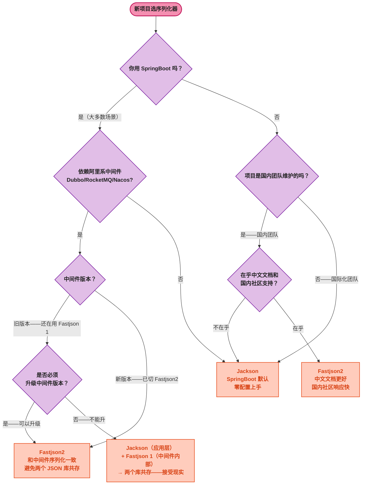

# Jackson vs Fastjson2 终极对比

> 📖 <strong>前置阅读</strong>：本文假设读者已经阅读过前两篇——如果还不熟悉 Jackson 或 Fastjson2，建议先阅读 [<strong>序列化本质与 Jackson 全操作指南</strong>]() 和 [<strong>Fastjson 进化史：从 1.x 漏洞到 Fastjson2</strong>]()。

## 一、⚡ 同一个对象，两种写法

先在同一个 `Order` 类上对比两套注解——直观感受差异：

```java
// ===== Jackson 写法 =====
@JsonPropertyOrder({"order_id", "user_id", "product_name", "amount", "create_time"})
@JsonIgnoreProperties(ignoreUnknown = true)
@JsonInclude(JsonInclude.Include.NON_NULL)
public class Order {

    @JsonProperty("order_id")               // Jackson: 改字段名
    private Long orderId;

    @JsonProperty("user_id")
    private Long userId;

    @JsonProperty("product_name")
    private String productName;

    @JsonFormat(shape = JsonFormat.Shape.STRING)   // Jackson: 金额用字符串
    private BigDecimal amount;

    @JsonIgnore                                 // Jackson: 忽略字段
    private String internalNote;

    @JsonFormat(pattern = "yyyy-MM-dd HH:mm:ss") // Jackson: 日期格式
    private LocalDateTime createTime;
}

// ===== Fastjson2 写法 =====
@JSONType(orders = {"order_id", "user_id", "product_name", "amount", "create_time"})
public class Order {

    @JSONField(name = "order_id")              // Fastjson2: 改字段名
    private Long orderId;

    @JSONField(name = "user_id")
    private Long userId;

    @JSONField(name = "product_name")
    private String productName;

    @JSONField(serializeFeatures = JSONWriter.Feature.WriteBigDecimalAsPlain)
    private BigDecimal amount;                  // Fastjson2: 金额不用科学计数法

    @JSONField(serialize = false)               // Fastjson2: 忽略字段
    private String internalNote;

    @JSONField(format = "yyyy-MM-dd HH:mm:ss") // Fastjson2: 日期格式
    private LocalDateTime createTime;
}
```

<strong>Facjson2 不需要 `@JsonIgnoreProperties`</strong>——它默认忽略未知字段。Jackson 必须在每个类上加这个注解或全局配置。对于有 50+ 个 DTO 类的项目来说，这少写不少样板。

## 二、注解对照速查表

| 功能 | Jackson | Fastjson2 | 差异 |
|------|------|------|------|
| 改字段名 | `@JsonProperty("xxx")` | `@JSONField(name="xxx")` | 无 |
| 隐藏字段 | `@JsonIgnore` | `@JSONField(serialize=false)` | 无 |
| 日期格式 | `@JsonFormat(pattern="...")` | `@JSONField(format="...")` | 无 |
| 数字格式 | `@JsonFormat(shape=STRING)` | `@JSONField(serializeFeatures=WriteBigDecimalAsPlain)` | Jackson 更简洁 |
| 字段顺序 | `@JsonPropertyOrder({...})` | `@JSONType(orders={...})` | 无 |
| 过滤 null | `@JsonInclude(NON_NULL)` | 全局 `JSON.config(SkipNullValues)` | Jackson 支持字段级，Fastjson2 仅全局 |
| 忽略未知字段 | `@JsonIgnoreProperties(ignoreUnknown=true)` | <strong>默认忽略——不需要注解</strong> | Fastjson2 更省心 |
| 别名 | `@JsonAlias({"a","b"})` | `@JSONField(alternateNames={"a","b"})` | 无 |
| 自定义序列化器 | `@JsonSerialize(using=X.class)` | `@JSONField(serializeUsing=X.class)` | 无 |
| 自定义反序列化器 | `@JsonDeserialize(using=X.class)` | `@JSONField(deserializeUsing=X.class)` | 无 |
| 只序列化不反序列化 | `@JsonProperty(access=WRITE_ONLY)` | `@JSONField(deserialize=false)` | Jackson 的 access 枚举更丰富 |
| 只反序列化不序列化 | `@JsonProperty(access=READ_ONLY)` | `@JSONField(serialize=false)` | 同上 |

## 三、API 设计哲学差异

### 3.1 核心类设计

```java
// Jackson——面向对象，所有操作通过 ObjectMapper 实例
ObjectMapper mapper = new ObjectMapper();  // 创建实例（可配置）
String json = mapper.writeValueAsString(obj);
Order order = mapper.readValue(json, Order.class);

// Fastjson2——静态方法，操作通过 JSON 工具类
String json = JSON.toJSONString(obj);      // 静态——不需要实例
Order order = JSON.parseObject(json, Order.class);
```

| 设计维度 | Jackson | Fastjson2 |
|------|------|------|
| <strong>API 风格</strong> | Builder 模式 + 实例方法 | 静态工具类方法 |
| <strong>线程安全</strong> | ObjectMapper 线程安全——全局共享一个实例 | 静态方法天然线程安全 |
| <strong>配置方式</strong> | 链式调用 `.configure(feature, true)` | `JSON.config(feature)` 或 Builder |
| <strong>最佳实践</strong> | 全局一个 ObjectMapper Bean | 直接调 `JSON.` 静态方法 |
| <strong>学习曲线</strong> | 稍高——需要理解 ObjectMapper 的配置链 | <strong>更低</strong>——`JSON.toJSONString` 一句话 |

### 3.2 代码即对比

```java
// ===== 场景一：普通序列化 =====
// Jackson
String json = mapper.writeValueAsString(order);
// Fastjson2
String json = JSON.toJSONString(order);

// ===== 场景二：美化输出 =====
// Jackson
String json = mapper.writerWithDefaultPrettyPrinter().writeValueAsString(order);
// Fastjson2
String json = JSON.toJSONString(order, JSONWriter.Feature.PrettyFormat);

// ===== 场景三：null 字段不输出 =====
// Jackson
String json = mapper.setSerializationInclusion(JsonInclude.Include.NON_NULL)
                   .writeValueAsString(order);
// Fastjson2
String json = JSON.toJSONString(order, JSONWriter.Feature.SkipNullValues);

// ===== 场景四：泛型反序列化 =====
// Jackson
List<Order> orders = mapper.readValue(json,
    new TypeReference<List<Order>>() {});
// Fastjson2
List<Order> orders = JSON.parseObject(json,
    new TypeReference<List<Order>>() {});

// ===== 场景五：Tree Model（不定义类，层级取值）=====
// Jackson
JsonNode root = mapper.readTree(json);
String productName = root.get("data").get("productName").asText();
// Fastjson2
JSONObject root = JSON.parseObject(json);
String productName = root.getJSONObject("data").getString("productName");
```

### 3.3 配置方式对比

```java
// Jackson——一切通过 ObjectMapper 实例
ObjectMapper mapper = new ObjectMapper();
mapper.setSerializationInclusion(JsonInclude.Include.NON_NULL);
mapper.configure(DeserializationFeature.FAIL_ON_UNKNOWN_PROPERTIES, false);
mapper.configure(SerializationFeature.WRITE_DATES_AS_TIMESTAMPS, false);
mapper.registerModule(new JavaTimeModule());
String json = mapper.writeValueAsString(order);

// Fastjson2——全局一次性配置
JSON.config(
    JSONWriter.Feature.SkipNullValues,
    JSONWriter.Feature.WriteDateTimeUseDateFormat,
    JSONWriter.Feature.WriteBigDecimalAsPlain);
String json = JSON.toJSONString(order);
// 注意：Fastjson2 的 JSON.config() 影响所有后续调用——全局生效
```

> ⚠️ 新手提示：`JSON.config()` 是<strong>全局的、不可逆的</strong>——设置后这个 JVM 内所有 `JSON.toJSONString()` 都受影响。如果应用内不同场景需要不同的配置——用 `JSON.toJSONString(obj, feature1, feature2)` 局部覆盖。

## 四、性能

### 4.1 官方基准测试结论

Fastjson2 官方给出的对比数据：

| 场景 | Jackson | Fastjson 1.x | Fastjson2 | Fastjson2 优势 |
|------|------|------|------|------|
| 序列化（小对象） | 1x | 0.8x | <strong>3x</strong> | 3 倍 |
| 反序列化（小对象） | 1x | 1.2x | <strong>6x</strong> | 6 倍 |
| 大 JSON 文档解析 | 1x | 0.9x | <strong>2x</strong> | 2 倍 |

但<strong>这些数据的参考意义有限</strong>——

### 4.2 为什么"性能差距"在生产中不重要

1. <strong>真实瓶颈不在序列化</strong>：HTTP API 的延迟瓶颈 90% 在数据库查询、网络 I/O、业务逻辑。序列化只占总耗时的 1%~5%。3 倍差距听起来很大——但如果是 100ms 总耗时的 5%（5ms），变成 3 倍也就是 15ms——用户感知不到。

2. <strong>微基准测试不代表真实场景</strong>：官方测试通常是最理想情况——同一个对象反复序列化，JIT 编译器已经优化了所有热点路径。真实项目中的消息各不相同——JIT 没那么有效。

3. <strong>Jackson 的 Afterburner 模块</strong>：用字节码生成替换反射——大幅缩小性能差距。但需要额外依赖。

4. <strong>SpringBoot 默认就是 Jackson</strong>：只要你用 SpringBoot，Jackson 已经在你项目里了。切 Fastjson2 意味着多引入一个库 + 替换 HttpMessageConverter——收益可能抵不上维护成本。

### 4.3 什么场景下 Fastjson2 的性能优势有意义

只有一类场景：<strong>高吞吐量、消息量大、序列化占比显著</strong>——比如网关、消息中台、日志采集：

```
Gateway 每秒处理 10 万请求：
  每个请求序列化耗时 0.1ms → 10 万次 = 10s CPU 时间
  Jackson 1x → Fastjson2 3x → 0.033ms → 3.3s CPU 时间 → 省了 6.7s CPU

普通 Web 应用每秒处理 100 请求：
  每个请求序列化耗时 0.1ms → 100 次 = 10ms CPU 时间
  3 倍节省 = 6.7ms——约等于 0
```

<strong>一句话：你不是在做网关或者中间件，性能差距不值得成为选型因素。</strong>

## 五、生态整合对比

| 维度 | Jackson | Fastjson2 |
|------|:---:|:---:|
| <strong>SpringBoot 默认</strong> | ✅——`spring-boot-starter-web` 自带了 Jackson | ✗——需要手动配 HttpMessageConverter |
| <strong>Spring 生态工具</strong> | ✅——Spring Cloud、Spring Data、Spring Security 全用 Jackson | ✗——需要 Spring 额外适配 |
| <strong>阿里中间件</strong> | ✗——Dubbo 2.x 默认 Fastjson（3.x 切 Hessian2） | ✅——Fastjson2 是阿里生态的推荐序列化器 |
| <strong>Kafka/Elasticsearch</strong> | ✅——Spring Kafka + Spring Data ES 默认 Jackson | ✗——需要手动配 |
| <strong>社区活跃度</strong> | 极高——GitHub 9k+ Stars、Commit 频繁 | 中——GitHub 3.5k+ Stars、活跃维护 |
| <strong>文档质量</strong> | 优秀——英文文档完善 | <strong>中文文档更好</strong>——但英文文档较少 |
| <strong>跨语言</strong> | ✅——Jackson 有 Python/JS/Rust 等移植版 | ✗——只有 Java |

## 六、安全对比

| 维度 | Jackson | Fastjson2 |
|------|:---:|:---:|
| <strong>默认安全性</strong> | 安全——`@JsonTypeInfo` 需手动声明 | <strong>安全</strong>——autoType 默认关闭 |
| <strong>历史漏洞</strong> | 少量 CVE——主要是多态反序列化相关 | <strong>Fastjson 1.x 漏洞一长串</strong>——Fastjson2 没有继承 |
| <strong>安全模型</strong> | 无 autoType——子类声明由注解控制 | 白名单——不在白名单的类直接拒绝 |

<strong>Fastjson2 更安全不是因为"比 Jackson 更安全"，而是因为 Fastjson 1.x 太不安全了——Fastjson2 从零设计就是为了修复安全问题。</strong>

## 七、选型决策树



## 八、场景选型表

| 你的情况 | 选谁 | 理由 |
|------|:---:|------|
| <strong>标准 SpringBoot 项目——没有特殊序列化需求</strong> | <strong>Jackson</strong> | SpringBoot 默认——零配置、生态最好、团队学习成本最低 |
| <strong>老项目升级——目前用 Fastjson 1.x</strong> | <strong>Fastjson2</strong> | 最低迁移成本——API 不变、就换一个 JAR |
| <strong>新项目——但团队从阿里技术栈转过来</strong> | Fastjson2 | 团队已经熟悉 Fastjson API——换 Jackson 有学习成本 |
| <strong>高吞吐量中间件（RPC 框架、网关、消息中台）</strong> | Fastjson2 | 序列化成为瓶颈的场景——性能优势有价值 |
| <strong>国际化团队——需要英文文档和社区支持</strong> | <strong>Jackson</strong> | 英文文档最完善、Stack Overflow 答案最多 |
| <strong>微服务——Dubbo/RocketMQ/Nacos 全用阿里系</strong> | Fastjson2 | 整个技术栈序列化一致——一种 API 走天下 |
| <strong>数据管道——Kafka + Elasticsearch + Spark</strong> | <strong>Jackson</strong> | 大数据生态的标准选择——Spring Kafka + Spring Data ES 已集成 |

## 🎯 总结

1. <strong>默认选 Jackson——不会错</strong>：SpringBoot 自带、零配置、生态最广、文档最全。90% 的 Java Web 项目的正确选择。你其实已经在用它了——只是不知道。

2. <strong>以下三个情况选 Fastjson2</strong>：① 老项目用 Fastjson 1.x 想安全升级（最小改动）；② 团队全是阿里技术栈——Dubbo/RocketMQ/Nacos 内部都在用 Fastjson；③ 在高吞吐量场景——序列化已是可测量的瓶颈。

3. <strong>性能不是选型因素</strong>：除非你是网关、消息中台——每秒处理 10 万+ 次序列化。普通 Web 项目省的那几毫秒——数据库一次慢查询就全还回去了。

4. <strong>最差的情况是引入两个 JSON 库</strong>：你的代码用 Jackson，中间件内部用 Fastjson 1.x——两个 JSON 库共存。排查问题时你可能搞不清是哪个库抛的异常。好在 Fastjson2 比 1.x 体积更小、性能更好——把中间件自带的 Fastjson 1.x 通过依赖管理统一到 Fastjson2 会有改善。

---

## 📖 系列总览

序列化三篇系列到此结束：

| # | 篇 | 核心收获 |
|:--:|------|---------|
| 1 | [<strong>序列化本质与 Jackson 全操作指南</strong>]() | 序列化本质、Jackson 作为 SpringBoot 默认序列化器、ObjectMapper 全操作、9 个常用注解 |
| 2 | [<strong>Fastjson 进化史：从 1.x 漏洞到 Fastjson2</strong>]() | autoType 设计缺陷与 CVE 链条、哪些中间件还在依赖 Fastjson、Fastjson2 安全性重构与用法 |
| 3 | [<strong>Jackson vs Fastjson2 终极对比</strong>]() | 注解对照表、API 设计哲学差异、性能/生态/安全三维对比、选型决策树 |
