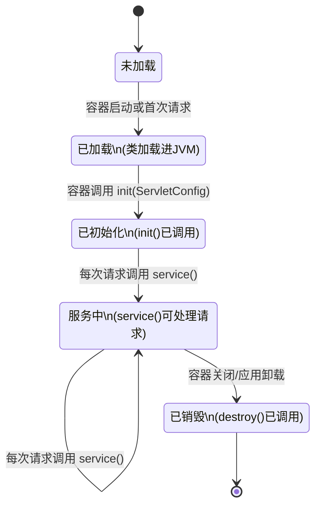
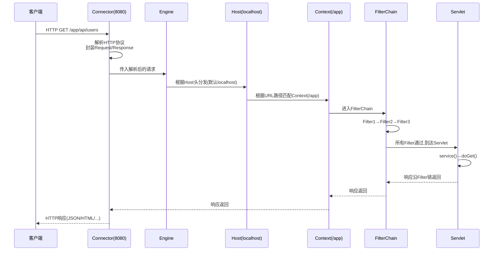
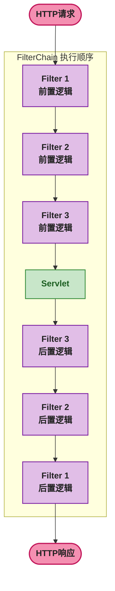
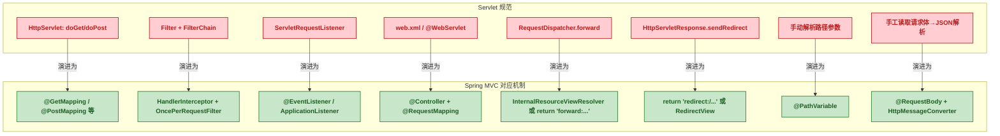

# 🌐 Servlet 网络编程：从 HTTP 协议到 RESTful API、过滤器链、监听器与 Tomcat 部署全解析

## 1. 问题切入：不用 Spring，如何写一个 HTTP API？

假设你要开发一个用户管理的 RESTful API，要求：

- 支持 JSON 格式的增删改查
- 对每个请求打印访问日志
- 校验请求头中的认证 Token
- 处理跨域请求

如果使用 Spring Boot，一个 `@RestController` 就解决了。但 Spring MVC 的底层是什么？`DispatcherServlet`、`FilterChain`、`HandlerInterceptor` 这些概念是怎么来的？

这篇博客将用**纯 Servlet** 实现上述所有需求，让你理解 Spring MVC 底层的每一块砖。

在开始之前，先看最终效果 —— 一个纯 Servlet 实现的用户 API：

```java
// GET    /api/users         → 查询所有用户(JSON)
// GET    /api/users/1       → 查询单个用户(JSON)
// POST   /api/users         → 创建用户(JSON请求体)
// PUT    /api/users/1       → 更新用户(JSON请求体)
// DELETE /api/users/1       → 删除用户
```

## 2. Servlet 是什么

Servlet（Server Applet，服务端小程序）是 Java EE 规范中定义的一套 **服务器端 HTTP 处理接口**。它不是独立运行的程序，而是运行在 **Servlet 容器**（如 Tomcat）中，由容器管理其生命周期，并调用其方法来处理 HTTP 请求。

### ☕ 2.1 Servlet 核心接口

```java
// javax.servlet.Servlet 接口(Java EE / Jakarta EE)
public interface Servlet {
    void init(ServletConfig config);     // 初始化
    ServletConfig getServletConfig();    // 获取配置
    void service(ServletRequest req,     // 处理请求
                 ServletResponse res);
    String getServletInfo();             // 元信息
    void destroy();                      // 销毁
}
```

**关键点**：`service()` 方法是所有请求的入口。`HttpServlet`（抽象类）重写了此方法，根据 HTTP 方法（GET/POST/PUT/DELETE）分发到不同的处理方法（`doGet`/`doPost`/`doPut`/`doDelete`）。

### ☕ 2.2 Servlet 生命周期



| 阶段 | 触发时机 | 调用方法 | 执行次数 |
|------|---------|---------|:---:|
| 加载 | 容器启动 或 首次请求（取决于 `load-on-startup`） | 类加载器加载 .class | 1 次 |
| 初始化 | 加载完成后 | `init(ServletConfig)` | 1 次 |
| 服务 | 每次 HTTP 请求 | `service()` → `doGet()`/`doPost()` 等 | 多次（每次请求） |
| 销毁 | 容器关闭 / 应用卸载 | `destroy()` | 1 次 |

### ☕ 2.3 ServletConfig 与 ServletContext

| 对象 | 作用范围 | 用途 |
|------|---------|------|
| `ServletConfig` | 单个 Servlet | 获取 `web.xml` 中该 Servlet 的 `<init-param>` 配置 |
| `ServletContext` | 整个 Web 应用 | 获取全局配置、设置/获取属性（跨 Servlet 共享数据）、获取资源路径 |

```java
// 在 init() 中获取配置
public void init(ServletConfig config) throws ServletException {
    String dbUrl = config.getInitParameter("db.url");  // web.xml 中的 <init-param>
    ServletContext ctx = config.getServletContext();
    String appName = ctx.getInitParameter("app.name");  // web.xml 中的 <context-param>
    ctx.setAttribute("db.pool", createDataSource());     // 全局共享数据
}
```

## 3. Tomcat 与 Servlet 容器层级

Tomcat 是最流行的 Servlet 容器实现。它同时也是一个 HTTP 服务器，内部结构分为多个嵌套容器。


### 🔢 3.1 各组件职责

| 组件 | 对应配置 | 职责 |
|------|---------|------|
| **Server** | `server.xml` 顶级元素 | 代表整个 Tomcat 实例，管理所有 Service |
| **Service** | `<Service>` | 包含一个 Engine 和多个 Connector |
| **Connector** | `<Connector>` | 监听端口（如 8080），解析 HTTP 协议，包装 `HttpServletRequest` / `HttpServletResponse` |
| **Executor** | `<Executor>` | 线程池，处理 Connector 接收的请求 |
| **Engine** | `<Engine>` | 接收 Connector 传来的请求，分发给对应的 Host |
| **Host** | `<Host>` | 虚拟主机（如 `localhost`），一个 Engine 下可有多个 Host |
| **Context** | `<Context>` | 一个 Web 应用（一个 WAR），对应一个 `ServletContext` |
| **Wrapper** | (无直接配置) | 包装单个 Servlet，是最小的容器单元 |
| **FilterChain** | `<filter-mapping>` | 按顺序调用匹配的 Filter，最后到达 Servlet |

### 📨 3.2 一次请求在 Tomcat 中的完整流转



## 4. HttpServletRequest 与 HttpServletResponse

Servlet 的核心操作就是读取 `HttpServletRequest` 中的所有信息，然后向 `HttpServletResponse` 中写入输出。

### 📨 4.1 获取请求数据（HttpServletRequest）

```java
@Override
protected void doGet(HttpServletRequest req, HttpServletResponse resp) {
    // 1. 获取请求行信息
    String method = req.getMethod();          // GET
    String uri = req.getRequestURI();         // /api/users/1
    String query = req.getQueryString();      // ?keyword=test

    // 2. 获取请求头
    String token = req.getHeader("Authorization");
    String contentType = req.getContentType();

    // 3. 获取请求参数(查询参数或表单参数)
    String keyword = req.getParameter("keyword");
    String[] ids = req.getParameterValues("ids");  // 多值参数

    // 4. 获取路径信息
    String pathInfo = req.getPathInfo();      // /1 (如果 Servlet 映射为 /api/users/*)

    // 5. 读取请求体(JSON/XML)
    StringBuilder body = new StringBuilder();
    try (BufferedReader reader = req.getReader()) {
        String line;
        while ((line = reader.readLine()) != null) {
            body.append(line);
        }
    }
    // 用 Jackson/Gson 反序列化
    UserRequest request = objectMapper.readValue(body.toString(), UserRequest.class);
}
```

### 📤 4.2 设置响应（HttpServletResponse）

```java
@Override
protected void doGet(HttpServletRequest req, HttpServletResponse resp) {
    // 1. 设置状态码
    resp.setStatus(HttpServletResponse.SC_OK);          // 200
    resp.setStatus(HttpServletResponse.SC_CREATED);      // 201
    resp.setStatus(HttpServletResponse.SC_NO_CONTENT);   // 204
    resp.setStatus(HttpServletResponse.SC_BAD_REQUEST);  // 400
    resp.setStatus(HttpServletResponse.SC_NOT_FOUND);    // 404

    // 2. 设置响应头
    resp.setHeader("X-Custom-Header", "value");
    resp.setContentType("application/json");
    resp.setCharacterEncoding("UTF-8");

    // 3. 写响应体
    String json = objectMapper.writeValueAsString(userList);
    resp.getWriter().write(json);
}
```

## 5. 用 Servlet 写一个完整的 RESTful API

下面是一个完整的用户 CRUD API，纯 Servlet 实现，前后端分离，返回 JSON：

```java
// ============ 实体类 ============
public class User {
    private Long id;
    private String name;
    private String email;
    // getter / setter 省略(或用 Lombok @Data)
}

// ============ 数据访问层(简化,实际用数据库) ============
public class UserRepository {
    private static final ConcurrentHashMap<Long, User> store = new ConcurrentHashMap<>();
    private static final AtomicLong idGen = new AtomicLong(1);

    public List<User> findAll() { return new ArrayList<>(store.values()); }

    public User findById(Long id) { return store.get(id); }

    public User save(User user) {
        if (user.getId() == null) {
            user.setId(idGen.getAndIncrement());
        }
        store.put(user.getId(), user);
        return user;
    }

    public void deleteById(Long id) { store.remove(id); }
}

// ============ RESTful Servlet ============
public class UserApiServlet extends HttpServlet {

    private final ObjectMapper objectMapper = new ObjectMapper();
    private UserRepository repository;

    @Override
    public void init() throws ServletException {
        repository = new UserRepository();
        objectMapper.registerModule(new JavaTimeModule());
    }

    @Override
    protected void service(HttpServletRequest req, HttpServletResponse resp)
            throws ServletException, IOException {
        // 生产环境: 设置 CORS 头
        resp.setHeader("Access-Control-Allow-Origin", "*");
        resp.setHeader("Access-Control-Allow-Methods", "GET, POST, PUT, DELETE, OPTIONS");
        resp.setHeader("Access-Control-Allow-Headers", "Content-Type, Authorization");
        resp.setContentType("application/json");
        resp.setCharacterEncoding("UTF-8");

        // 处理预检请求
        if ("OPTIONS".equalsIgnoreCase(req.getMethod())) {
            resp.setStatus(HttpServletResponse.SC_OK);
            return;
        }
        super.service(req, resp);
    }

    @Override
    protected void doGet(HttpServletRequest req, HttpServletResponse resp)
            throws IOException {
        // 解析路径: /api/users/1 → id=1
        Long id = extractId(req);

        if (id != null) {
            User user = repository.findById(id);
            if (user == null) {
                writeJson(resp, HttpServletResponse.SC_NOT_FOUND,
                    Map.of("error", "User not found"));
                return;
            }
            writeJson(resp, HttpServletResponse.SC_OK, user);
        } else {
            List<User> users = repository.findAll();
            writeJson(resp, HttpServletResponse.SC_OK, users);
        }
    }

    @Override
    protected void doPost(HttpServletRequest req, HttpServletResponse resp)
            throws IOException {
        User user = objectMapper.readValue(req.getReader(), User.class);
        User saved = repository.save(user);
        resp.setHeader("Location", req.getRequestURI() + "/" + saved.getId());
        writeJson(resp, HttpServletResponse.SC_CREATED, saved);
    }

    @Override
    protected void doPut(HttpServletRequest req, HttpServletResponse resp)
            throws IOException {
        Long id = extractId(req);
        if (id == null) {
            writeJson(resp, HttpServletResponse.SC_BAD_REQUEST,
                Map.of("error", "Missing user ID"));
            return;
        }
        User existing = repository.findById(id);
        if (existing == null) {
            writeJson(resp, HttpServletResponse.SC_NOT_FOUND,
                Map.of("error", "User not found"));
            return;
        }
        User update = objectMapper.readValue(req.getReader(), User.class);
        update.setId(id);
        repository.save(update);
        writeJson(resp, HttpServletResponse.SC_OK, update);
    }

    @Override
    protected void doDelete(HttpServletRequest req, HttpServletResponse resp)
            throws IOException {
        Long id = extractId(req);
        if (id == null) {
            writeJson(resp, HttpServletResponse.SC_BAD_REQUEST,
                Map.of("error", "Missing user ID"));
            return;
        }
        repository.deleteById(id);
        resp.setStatus(HttpServletResponse.SC_NO_CONTENT);
    }

    // 从 /api/users/1 中提取 id=1
    private Long extractId(HttpServletRequest req) {
        String pathInfo = req.getPathInfo();  // /1
        if (pathInfo != null && pathInfo.length() > 1) {
            try {
                return Long.parseLong(pathInfo.substring(1));
            } catch (NumberFormatException e) {
                return null;
            }
        }
        return null;
    }

    private void writeJson(HttpServletResponse resp, int status, Object data)
            throws IOException {
        resp.setStatus(status);
        objectMapper.writeValue(resp.getWriter(), data);
    }
}
```

**注册 Servlet**（二选一）：

```java
// 方式一: 注解注册 (Servlet 3.0+,推荐)
@WebServlet(name = "userApi", urlPatterns = "/api/users/*",
            loadOnStartup = 1)
public class UserApiServlet extends HttpServlet { }

// 方式二: web.xml 注册 (传统方式)
// <web-app>
//     <servlet>
//         <servlet-name>userApi</servlet-name>
//         <servlet-class>com.example.UserApiServlet</servlet-class>
//         <load-on-startup>1</load-on-startup>
//     </servlet>
//     <servlet-mapping>
//         <servlet-name>userApi</servlet-name>
//         <url-pattern>/api/users/*</url-pattern>
//     </servlet-mapping>
// </web-app>
```

## 6. 重定向与转发

### ↪️ 6.1 Forward（服务端转发）

Forward（转发）在**服务端内部**将请求转发给另一个 Servlet 处理，客户端无感知，URL 不变。

```java
// 场景: 根据版本号转发到不同的 Servlet
@WebServlet("/api/users")
public class UserDispatcherServlet extends HttpServlet {
    @Override
    protected void doGet(HttpServletRequest req, HttpServletResponse resp)
            throws ServletException, IOException {
        String version = req.getParameter("version");

        if ("v2".equals(version)) {
            // 转发到 V2 Servlet(服务端内部,URL不变)
            req.getRequestDispatcher("/api/v2/users").forward(req, resp);
        } else {
            // RequestDispatcher 也支持 include(将目标内容包含到当前响应)
            req.getRequestDispatcher("/api/v1/users").forward(req, resp);
        }
    }
}
```

### ↪️ 6.2 Redirect（客户端重定向）

Redirect（重定向）通过 `302` 或 `301` 状态码告诉客户端重新发起请求，**URL 会改变**。

```java
@WebServlet("/login")
public class LoginServlet extends HttpServlet {
    @Override
    protected void doPost(HttpServletRequest req, HttpServletResponse resp)
            throws IOException {
        // 登录逻辑...
        boolean success = authenticate(req);

        if (success) {
            // 临时重定向 (302)
            resp.sendRedirect("/dashboard");
        } else {
            // 也可以手动设置状态码和 Location 头
            resp.setStatus(HttpServletResponse.SC_MOVED_TEMPORARILY); // 302
            resp.setHeader("Location", "/login?error=invalid");
        }
    }
}
```

### ↪️ 6.3 Forward vs Redirect 对比

| 对比维度 | Forward（转发） | Redirect（重定向） |
|---------|:---:|:---:|
| 发起位置 | 服务端内部 | 客户端(浏览器) |
| 请求次数 | 1 次 | 2 次（第一次返回 302，第二次请求新 URL） |
| URL 是否改变 | 不变 | 改变 |
| 能否跨域/跨应用 | 不能（同一 Web 应用内） | 能 |
| `request` 中属性是否保留 | 保留 | 丢失（两次独立请求） |
| HTTP 状态码 | 200（原状态） | 301（永久）/ 302（临时） |
| 典型场景 | 根据参数分发到不同处理器 | 登录后跳转首页、短链接跳转 |

## 7. Filter（过滤器）

Filter（过滤器）是 Servlet 规范中的**拦截器机制**，在请求到达 Servlet 之前和响应返回客户端之前执行过滤逻辑。Filter 可以形成**过滤器链**，按顺序逐个执行。

### 🔍 7.1 Filter 接口

```java
public interface Filter {
    // 初始化(容器启动时调用一次)
    default void init(FilterConfig filterConfig) throws ServletException { }

    // 核心过滤方法
    void doFilter(ServletRequest request, ServletResponse response,
                  FilterChain chain) throws IOException, ServletException;

    // 销毁(容器关闭时调用一次)
    default void destroy() { }
}
```

**`FilterChain.doFilter()`** 是关键：调用它意味着"我放行了，交给下一个 Filter 或最终的目标 Servlet"。



### 🔍 7.2 Filter 注册方式

```java
// 方式一: 注解注册 (Servlet 3.0+)
@WebFilter(urlPatterns = "/api/*",
           filterName = "authFilter",
           initParams = {
               @WebInitParam(name = "excludePaths", value = "/api/public")
           })
public class AuthFilter implements Filter { }

// 方式二: web.xml 注册
// <filter>
//     <filter-name>authFilter</filter-name>
//     <filter-class>com.example.AuthFilter</filter-class>
// </filter>
// <filter-mapping>
//     <filter-name>authFilter</filter-name>
//     <url-pattern>/api/*</url-pattern>
//     <dispatcher>REQUEST</dispatcher>   ← 对直接请求生效
//     <dispatcher>FORWARD</dispatcher>   ← 对转发请求也生效
// </filter-mapping>
```

`<dispatcher>` 控制 Filter 在哪些场景下触发：

| 值 | 触发场景 |
|------|------|
| `REQUEST`（默认） | 客户端直接请求 |
| `FORWARD` | 通过 `RequestDispatcher.forward()` 转发的请求 |
| `INCLUDE` | 通过 `RequestDispatcher.include()` 包含的请求 |
| `ERROR` | 错误页面转发 |
| `ASYNC` | 异步请求 |

### 🔍 7.3 Filter 实战：认证过滤器

```java
@WebFilter(urlPatterns = "/api/*")
public class AuthFilter implements Filter {

    // 白名单(不需要认证的路径)
    private static final Set<String> WHITE_LIST = Set.of("/api/public", "/api/login");

    @Override
    public void doFilter(ServletRequest request, ServletResponse response,
                         FilterChain chain) throws IOException, ServletException {
        HttpServletRequest req = (HttpServletRequest) request;
        HttpServletResponse resp = (HttpServletResponse) response;

        String path = req.getRequestURI().substring(req.getContextPath().length());

        // 白名单直接放行
        if (WHITE_LIST.contains(path)) {
            chain.doFilter(request, response);
            return;
        }

        // 校验 Authorization 头
        String authHeader = req.getHeader("Authorization");
        if (authHeader == null || !authHeader.startsWith("Bearer ")) {
            resp.setStatus(HttpServletResponse.SC_UNAUTHORIZED);
            resp.setContentType("application/json");
            resp.getWriter().write("{\"error\":\"Missing or invalid token\"}");
            return;  // 不调用 chain.doFilter → 请求被拦截,不会到达 Servlet
        }

        try {
            String token = authHeader.substring(7);
            Long userId = JwtUtil.parseUserId(token);
            req.setAttribute("userId", userId);  // 传递给后续 Filter/Servlet
            chain.doFilter(request, response);   // 放行
        } catch (Exception e) {
            resp.setStatus(HttpServletResponse.SC_UNAUTHORIZED);
            resp.getWriter().write("{\"error\":\"Token expired or invalid\"}");
        }
    }
}
```

### 🔍 7.4 Filter 实战：访问日志 + 耗时统计

```java
@WebFilter(urlPatterns = "/*")
public class AccessLogFilter implements Filter {

    private static final Logger log = LoggerFactory.getLogger(AccessLogFilter.class);

    @Override
    public void doFilter(ServletRequest request, ServletResponse response,
                         FilterChain chain) throws IOException, ServletException {
        HttpServletRequest req = (HttpServletRequest) request;
        long start = System.currentTimeMillis();

        // 包装 Response 以便读取响应状态码
        HttpServletResponse resp = (HttpServletResponse) response;

        try {
            chain.doFilter(request, response);
        } finally {
            long elapsed = System.currentTimeMillis() - start;
            log.info("{} {} → {} ({}ms)",
                req.getMethod(),
                req.getRequestURI(),
                resp.getStatus(),
                elapsed);
        }
    }
}
```

### 🔍 7.5 Filter 执行顺序控制

当多个 Filter 匹配同一 URL 时，执行顺序规则：

| 注册方式 | 顺序规则 |
|---------|---------|
| `web.xml` | 按 `<filter-mapping>` 出现的顺序 |
| `@WebFilter` 注解 | 按 Filter 类名的**字典序**（不可靠，不建议依赖） |
| 混合使用 | `web.xml` 的 Filter 先于注解 Filter |

**推荐做法**：需要严格控制顺序时，用 `web.xml` 配置 Filter 顺序；或合并为一个 Filter 中按顺序调用子逻辑。

## 8. Listener（监听器）

Listener（监听器）用于监听 Servlet 容器中的**生命周期事件**，在特定事件发生时执行自定义逻辑。

### 👂 8.1 常用 Listener 类型

| 接口 | 监听的事件 | 触发时机 |
|------|---------|---------|
| `ServletContextListener` | Web 应用启动 / 销毁 | `contextInitialized()` / `contextDestroyed()` |
| `ServletRequestListener` | 请求创建 / 销毁 | `requestInitialized()` / `requestDestroyed()` |
| `HttpSessionListener` | Session 创建 / 销毁 | `sessionCreated()` / `sessionDestroyed()` |
| `ServletContextAttributeListener` | `ServletContext` 属性增删改 | `attributeAdded()` / `attributeRemoved()` / `attributeReplaced()` |

### ☕ 8.2 实战：应用启动初始化

```java
@WebListener
public class AppStartupListener implements ServletContextListener {

    @Override
    public void contextInitialized(ServletContextEvent sce) {
        ServletContext ctx = sce.getServletContext();
        System.out.println("=== 应用启动: " + ctx.getContextPath() + " ===");

        // 初始化数据库连接池
        HikariConfig config = new HikariConfig();
        config.setJdbcUrl(ctx.getInitParameter("db.url"));
        config.setUsername(ctx.getInitParameter("db.username"));
        HikariDataSource ds = new HikariDataSource(config);

        // 注册为全局属性,所有 Servlet 可通过 getServletContext() 访问
        ctx.setAttribute("dataSource", ds);
    }

    @Override
    public void contextDestroyed(ServletContextEvent sce) {
        // 关闭连接池
        HikariDataSource ds = (HikariDataSource)
            sce.getServletContext().getAttribute("dataSource");
        if (ds != null) ds.close();
        System.out.println("=== 应用关闭 ===");
    }
}
```

### 📨 8.3 实战：请求统计

```java
@WebListener
public class RequestStatsListener implements ServletRequestListener {

    private static final AtomicLong requestCount = new AtomicLong(0);

    @Override
    public void requestInitialized(ServletRequestEvent sre) {
        requestCount.incrementAndGet();
    }

    public static long getRequestCount() {
        return requestCount.get();
    }
}
```

### ⚙️ 8.4 完整 web.xml 配置示例

```xml
<?xml version="1.0" encoding="UTF-8"?>
<web-app xmlns="http://xmlns.jcp.org/xml/ns/javaee"
         xmlns:xsi="http://www.w3.org/2001/XMLSchema-instance"
         xsi:schemaLocation="http://xmlns.jcp.org/xml/ns/javaee
         http://xmlns.jcp.org/xml/ns/javaee/web-app_3_1.xsd"
         version="3.1">

    <!-- 全局参数(通过 ServletContext.getInitParameter() 获取) -->
    <context-param>
        <param-name>app.name</param-name>
        <param-value>UserManagementAPI</param-value>
    </context-param>
    <context-param>
        <param-name>db.url</param-name>
        <param-value>jdbc:mysql://localhost:3306/mydb</param-value>
    </context-param>

    <!-- Listener -->
    <listener>
        <listener-class>com.example.AppStartupListener</listener-class>
    </listener>
    <listener>
        <listener-class>com.example.RequestStatsListener</listener-class>
    </listener>

    <!-- Filter(按 mapping 出现顺序执行) -->
    <filter>
        <filter-name>accessLogFilter</filter-name>
        <filter-class>com.example.AccessLogFilter</filter-class>
    </filter>
    <filter-mapping>
        <filter-name>accessLogFilter</filter-name>
        <url-pattern>/*</url-pattern>
    </filter-mapping>

    <filter>
        <filter-name>authFilter</filter-name>
        <filter-class>com.example.AuthFilter</filter-class>
    </filter>
    <filter-mapping>
        <filter-name>authFilter</filter-name>
        <url-pattern>/api/*</url-pattern>
    </filter-mapping>

    <!-- Servlet -->
    <servlet>
        <servlet-name>userApi</servlet-name>
        <servlet-class>com.example.UserApiServlet</servlet-class>
        <load-on-startup>1</load-on-startup>
    </servlet>
    <servlet-mapping>
        <servlet-name>userApi</servlet-name>
        <url-pattern>/api/users/*</url-pattern>
    </servlet-mapping>

    <!-- 默认错误页面 -->
    <error-page>
        <error-code>404</error-code>
        <location>/api/errors/404</location>
    </error-page>
</web-app>
```

## 9. WAR 打包与 Tomcat 部署

### 🔢 9.1 Maven 打包 WAR

```xml
<!-- pom.xml -->
<packaging>war</packaging>

<dependencies>
    <dependency>
        <groupId>jakarta.servlet</groupId>
        <artifactId>jakarta.servlet-api</artifactId>
        <version>5.0.0</version>
        <scope>provided</scope>  <!-- Tomcat自带,不打入WAR -->
    </dependency>
    <dependency>
        <groupId>com.fasterxml.jackson.core</groupId>
        <artifactId>jackson-databind</artifactId>
        <version>2.15.0</version>
    </dependency>
    <dependency>
        <groupId>org.slf4j</groupId>
        <artifactId>slf4j-api</artifactId>
        <version>2.0.7</version>
    </dependency>
</dependencies>

<build>
    <finalName>user-api</finalName>  <!-- 生成的WAR文件名: user-api.war -->
</build>
```

```bash
#  打包
mvn clean package

#  输出:
#  target/user-api.war           ← 完整 WAR 包
#  target/user-api/              ← 解压后的目录(等于 WAR 内容)
```

### 🔢 9.2 WAR 包内部结构

```
user-api.war
├── META-INF/
│   └── MANIFEST.MF
├── WEB-INF/
│   ├── web.xml                 ← 部署描述符
│   ├── classes/                ← Java 类文件
│   │   └── com/example/
│   │       ├── UserApiServlet.class
│   │       ├── AuthFilter.class
│   │       └── ...
│   └── lib/                    ← 依赖 JAR 包
│       ├── jackson-databind-2.15.0.jar
│       ├── slf4j-api-2.0.7.jar
│       └── ...
└── (static/ 静态资源可选)
```

### 🐱 9.3 Tomcat 目录结构

```
${CATALINA_HOME}/               ← 即 TOMCAT_HOME 环境变量
├── bin/
│   ├── startup.sh / startup.bat   ← 启动脚本
│   ├── shutdown.sh / shutdown.bat ← 关闭脚本
│   └── catalina.sh / catalina.bat ← 核心脚本
├── conf/
│   ├── server.xml              ← Tomcat 主配置(端口、Host等)
│   ├── web.xml                 ← 全局 web.xml(所有应用共享)
│   ├── context.xml             ← Context 默认配置
│   └── tomcat-users.xml        ← 管理用户
├── lib/                        ← Tomcat 全局库(JSP/Servlet API等)
├── logs/                       ← 日志目录(catalina.out等)
├── webapps/                    ← 应用部署目录 ← 核心!
│   ├── ROOT/                   ← 根应用(http://localhost:8080/)
│   ├── user-api.war            ← 放 WAR 包到此目录
│   ├── user-api/               ← (Tomcat会自动解压WAR到此目录)
│   └── manager/                ← Tomcat管理应用
├── work/                       ← JSP编译后的Servlet(此处不涉及JSP)
└── temp/                       ← 临时文件
```

### 🔢 9.4 部署操作步骤

```bash
#  1. 编译打包
cd /path/to/project
mvn clean package

#  2. 停止 Tomcat
cd ${CATALINA_HOME}/bin
./shutdown.sh

#  3. 部署 WAR 包
cp target/user-api.war ${CATALINA_HOME}/webapps/

#  4. 启动 Tomcat
cd ${CATALINA_HOME}/bin
./startup.sh

#  5. 查看启动日志
tail -f ${CATALINA_HOME}/logs/catalina.out

#  6. 测试 API
curl http://localhost:8080/user-api/api/users
```

**访问路径规则**：`http://localhost:8080/{WAR文件名}/{Servlet路径}`。例如 WAR 文件名为 `user-api.war`，则 Context 路径为 `/user-api`。

如果需要去掉 Context 路径前缀（即用 `http://localhost:8080/api/users`），将 WAR 命名为 `ROOT.war` 替换 `webapps/ROOT/`。

### ⚙️ 9.5 context.xml 自定义配置

在 `META-INF/context.xml` 中定义数据源等 JNDI 资源：

```xml
<Context>
    <Resource name="jdbc/MyDB"
              auth="Container"
              type="javax.sql.DataSource"
              driverClassName="com.mysql.cj.jdbc.Driver"
              url="jdbc:mysql://localhost:3306/mydb"
              username="root"
              password="secret"
              maxTotal="20"
              maxIdle="10" />
</Context>
```

Servlet 中通过 JNDI 获取：

```java
Context initCtx = new InitialContext();
DataSource ds = (DataSource) initCtx.lookup("java:comp/env/jdbc/MyDB");
```

## 10. 总结

### ☕ 10.1 Servlet → Spring MVC 演进对照



### 🔢 10.2 核心概念速查

| Servlet 概念 | 核心接口/类 | 在 Spring MVC 中的对应物 |
|-------------|-----------|----------------------|
| Controller | `HttpServlet` | `@Controller` / `@RestController` |
| 请求路径映射 | `@WebServlet(urlPatterns)` / `web.xml` | `@RequestMapping` |
| 请求参数 | `req.getParameter()` / `req.getReader()` | `@RequestParam` / `@RequestBody` |
| 路径变量 | 手动解析 `req.getPathInfo()` | `@PathVariable` |
| 过滤器 | `javax.servlet.Filter` + `FilterChain` | `HandlerInterceptor` / `OncePerRequestFilter` |
| 全局前置处理 | `ServletRequestListener` | `@ControllerAdvice` / `WebMvcConfigurer` |
| 应用生命周期 | `ServletContextListener` | `ApplicationListener<ContextRefreshedEvent>` |
| 转发 | `req.getRequestDispatcher(path).forward()` | `return "forward:/path"` |
| 重定向 | `resp.sendRedirect(url)` | `return "redirect:/url"` |
| 部署单元 | WAR 文件 → `webapps/` | Spring Boot Fat JAR / WAR |

### 🔢 10.3 完整项目结构参考

```
user-api/
├── pom.xml
├── src/
│   └── main/
│       ├── java/com/example/
│       │   ├── entity/
│       │   │   └── User.java
│       │   ├── repository/
│       │   │   └── UserRepository.java
│       │   ├── servlet/
│       │   │   └── UserApiServlet.java
│       │   ├── filter/
│       │   │   ├── AccessLogFilter.java
│       │   │   ├── AuthFilter.java
│       │   │   └── CorsFilter.java
│       │   └── listener/
│       │       ├── AppStartupListener.java
│       │       └── RequestStatsListener.java
│       └── webapp/
│           ├── WEB-INF/
│           │   └── web.xml
│           └── META-INF/
│               └── context.xml
└── target/
    └── user-api.war
```

这篇博客覆盖了 Servlet 网络编程在企业级项目中的所有核心知识点：Servlet 生命周期、RESTful API 实现、Filter 过滤器链、Listener 监听器、重定向与转发、WAR 打包与 Tomcat 部署。理解这些内容是深入 Spring MVC 源码的必要前置 —— Spring MVC 的 `DispatcherServlet` 本质上就是一个中央 Servlet，`HandlerInterceptor` 的设计直接参考了 Filter 链，`@ControllerAdvice` 则是 Listener 思想在 Spring 生态中的延伸。
