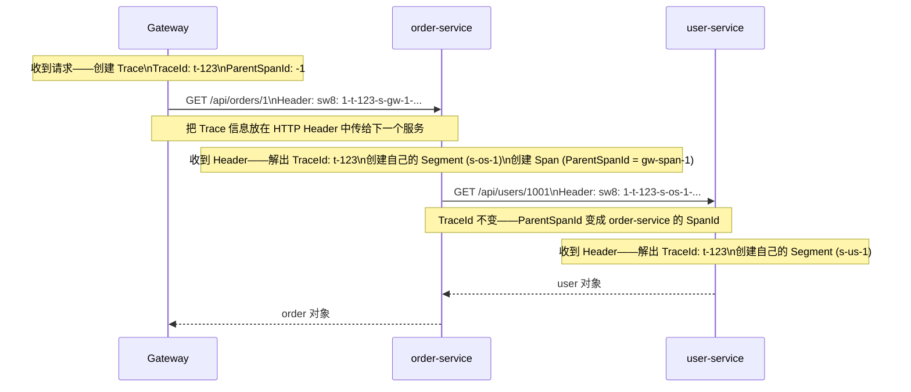

# SkyWalking 分布式链路追踪

> 📖 <strong>前置阅读</strong>：本文假设读者已了解微服务基本概念和 Docker。如果已搭建 Prometheus + Grafana，理解本文会更快——两者互补。建议先阅读 [<strong>Prometheus + Grafana 环境搭建与指标采集</strong>]()。

## 一、⚡ QPS 正常——但用户说"下单很慢"——是哪个服务慢了？

前两篇搭好了 Prometheus + Grafana——指标面板很漂亮——QPS、RT、错误率一目了然。

但凌晨 3 点的告警是这样的：

```
PagerDuty：order-service P99 延迟从 50ms 涨到 3s——错误率 2%——还没触发告警阈值（5%）
你打开 Grafana：
  ✅ order-service：QPS 正常——RT 涨了但不知道原因
  ✅ user-service：所有指标正常——没问题
  ✅ product-service：所有指标正常——没问题
  ✅ inventory-service：所有指标正常——没问题
  ✅ payment-service：所有指标正常——没问题
  → 你盯着仪表盘——所有服务看起来都"还行"——但订单就是慢了

有了 SkyWalking 链路追踪：
  ① 找到那条慢了 3s 的 /api/orders 请求的完整调用链路
  ② 看到调用链：order-service → user-service(50ms) → product-service(45ms)
                      → inventory-service(2800ms!!!)  ← 找到了
  ③ 展开 inventory-service 的 Span——MySQL SELECT 语句执行了 2.5s
  ④ 点开 SQL——SELECT * FROM inventory WHERE product_id = ?——没有索引——全表扫描
  → 2 分钟定位——加索引——P99 回到 50ms
```

<strong>Prometheus 告诉你"出问题了"——SkyWalking 告诉你"为什么出问题"。</strong>两者不是替代关系——是互补关系：

| 维度 | Prometheus + Grafana | SkyWalking |
|------|:---:|:---:|
| <strong>数据类型</strong> | 指标（Metrics）——数字、聚合 | 链路（Traces）——请求级详情 |
| <strong>能看到什么</strong> | "P99 延迟是 3s" | "这个请求在 inventory-service 花了 2.8s——因为这条 SQL" |
| <strong>数据来源</strong> | 应用暴露指标——Prometheus 拉 | Agent 自动埋点——OAP 收 |
| <strong>典型问题</strong> | "QPS 突然降了" | "这条链路中第几个服务慢了" |
| <strong>粒度</strong> | 聚合——"1分钟内的平均值" | 单次请求——"2022-12-19 03:15:22.331 那一次" |
| <strong>代码侵入</strong> | 需要手动打点（Counter/Timer） | <strong>零侵入</strong>——Agent 自动拦截 |

## 二、🧩 分布式追踪核心概念——Trace / Span / Segment

### 2.1 从单体到微服务——为什么需要 Tracing？

```
单体应用排查：
  Browser → Nginx → Tomcat → Service → DAO → MySQL
  看日志：grep "requestId=abc123" app.log → 一行一行读——请求路径一目了然

微服务排查：
  Browser → Gateway → order-service → user-service → MySQL
                                    → product-service → Redis
                                    → inventory-service → MySQL
                                    → payment-service → MQ
  看日志：去 5 个服务的 15 个实例上 grep "requestId=abc123"
  → 还要按时间排序、脑补调用图——30 分钟定位一个问题
```

分布式追踪解决的就是这个：<strong>一个 TraceId 贯穿所有服务——把一次请求的全过程串起来</strong>。

### 2.2 三个核心概念

```
┌──────────────────────────────────────────────────────────────────┐
│                          Trace                                    │
│  TraceId: t-abc123                                                │
│                                                                   │
│  ┌──────────────────────────────┐    ┌──────────────────────────┐ │
│  │ Segment (order-service)      │    │ Segment (user-service)   │ │
│  │ SegmentId: s-order-1         │    │ SegmentId: s-user-1      │ │
│  │                              │    │                          │ │
│  │  Span: POST /api/orders      │    │  Span: GET /api/users/1  │ │
│  │   ├─ Span: SELECT order      │    │   ├─ Span: SELECT user   │ │
│  │   ├─ Span: Feign/user-service│───→│   │              (50ms)  │ │
│  │   │              (52ms)      │ ←──│   └─ 返回 user 对象      │ │
│  │   ├─ Span: Feign/product-svc │    └──────────────────────────┘ │
│  │   │              (48ms)      │───→ product-service ...         │
│  │   └─ Span: INSERT order      │                                 │
│  │                (15ms)        │                                 │
│  └──────────────────────────────┘                                 │
│  总耗时: 3s                                                       │
└──────────────────────────────────────────────────────────────────┘
```

| 概念 | 一句话 | 类比 |
|------|------|------|
| <strong>Trace</strong> | 一次完整的请求——从入口到出口 | 一次完整的点餐过程——从进门到出门 |
| <strong>Segment</strong> | Trace 在每个服务中的一段——一个服务一个 Segment | 在点餐台前的一段过程 |
| <strong>Span</strong> | Segment 中的一个具体操作——HTTP 调用/DB 查询/缓存操作 | 一个具体动作——"点前菜"、"点主菜" |
| <strong>TraceId</strong> | 全局唯一——贯穿所有服务的标识 | 排号单上的号码 |
| <strong>SegmentId</strong> | 每个服务内部的标识——服务内唯一 | 在点餐台的序号 |
| <strong>SpanId</strong> | 每个操作的标识——父子关系构成调用链 | 每个菜品点的序号 |
| <strong>ParentSpanId</strong> | 指向父 Span——-1 表示根 Span（第一个操作） | 这道菜是套餐里的——主菜是父 |

### 2.3 Trace 是怎么串起来的——跨服务传播



<strong>关键机制——Trace 信息通过 HTTP Header 传播</strong>：

```
请求从 A 服务到 B 服务时：
  A 在 HTTP Header 中加上：
    sw8: 1-{TraceId}-{SegmentId}-{SpanId}-{ServiceName}-{ServiceInstance}-{Endpoint}-{Peer}
    ↑ 这就是 SkyWalking 的跨进程传播协议（Cross Process Protocol）

B 服务收到请求时：
  Agent 自动拦截——读 Header——解出 TraceId → 创建新 Segment → 关联到同一个 Trace

这样——无论经过多少服务——同一个 TraceId 串起所有调用
```

> 📖 <strong>前置知识</strong>：分布式追踪的传播协议有多种——SkyWalking 用 sw8，OpenTelemetry 用 traceparent（W3C 标准），Zipkin 用 B3。SkyWalking Agent 自动兼容——不需要手动处理。

## 三、🏗️ SkyWalking 架构——Agent → OAP → UI 三层设计

### 3.1 总体架构

```
┌──────────────┐  ┌──────────────┐  ┌──────────────┐
│  order-svc   │  │  user-svc    │  │  product-svc │
│  + Agent     │  │  + Agent     │  │  + Agent     │
│  .jar 挂载    │  │  .jar 挂载    │  │  .jar 挂载    │
└────┬─────────┘  └────┬─────────┘  └────┬─────────┘
     │ trace/日志/metrics│               │
     │      gRPC        │               │
     └──────────┬───────┴───────────────┘
                ▼
     ┌─────────────────────┐
     │   SkyWalking OAP    │  ← 核心——分析平台
     │   (可集群部署)       │
     │   ① 接收 Agent 数据  │
     │   ② 分析、聚合、存储  │
     │   ③ 计算指标（P99等）│
     │   ④ 构建拓扑图       │
     │   ⑤ 识别慢端点      │
     └──────────┬──────────┘
                │
                ▼
     ┌─────────────────────┐
     │   Storage（存储层）   │
     │   Elasticsearch 7    │  ← 生产环境用 ES——支持海量 Trace
     │   或 MySQL / H2      │
     └──────────┬──────────┘
                │
                ▼
     ┌─────────────────────┐
     │   SkyWalking UI     │
     │   :8080              │
     │   拓扑图 / 追踪 /     │
     │   性能剖析 / 日志     │
     └─────────────────────┘
```

<strong>三层设计——每层独立扩展</strong>：

| 层 | 作用 | 一句话 | 部署方式 |
|------|------|------|------|
| <strong>Agent（探针）</strong> | 拦截请求——采集 Trace 数据 | 挂载到目标 JVM——零代码 | `-javaagent:skywalking-agent.jar` |
| <strong>OAP（分析平台）</strong> | 接收、分析、聚合、存储 Trace 数据 | 大脑——接收海量数据——算出拓扑和指标 | 集群部署——可横向扩展 |
| <strong>UI（可视化）</strong> | 展示拓扑图、链路详情、指标、告警 | 界面——所有分析结果展示 | 单节点——从 OAP 拉数据 |

### 3.2 Agent 是怎么做到零侵入的？——Java Agent + 字节码增强

```
普通 Spring Boot 启动：
  java -jar order-service.jar

加了 SkyWalking Agent：
  java -javaagent:/opt/skywalking/agent/skywalking-agent.jar
       -jar order-service.jar

Agent 做了什么：
  ① JVM 启动时——Agent 先于 main() 加载
  ② Agent 中的 ClassFileTransformer 注册到 JVM
  ③ 每次加载类时——JVM 通知 Transformer——"要不要改这个类的字节码？"
  ④ SkyWalking Transformer 匹配目标类：
     → Controller：给每个方法加上"记录 HTTP 请求 Span"的逻辑
     → RestTemplate/Feign：给 execute() 方法加上"传播 Trace Header"的逻辑
     → DataSource：给 executeQuery() 方法加上"记录 DB Span"的逻辑
     → RedisTemplate：给所有操作加上"记录 Redis Span"的逻辑
  ⑤ 修改后的字节码交给 JVM——类加载完成
  → 看起来什么都没变——但所有关键方法已被"编织"了 Tracing 逻辑
```

<strong>被增强的层次</strong>：

| 框架/组件 | Agent 拦截位置 | 产生的 Span 类型 |
|------|------|------|
| Spring MVC `@RestController` | `DispatcherServlet` / `HandlerInterceptor` | HTTP Server Span |
| RestTemplate | `ClientHttpRequestInterceptor` | HTTP Client Span |
| OpenFeign | `feign.Client#execute()` | HTTP Client Span |
| Dubbo | `org.apache.dubbo.rpc.Filter` | RPC Server/Client Span |
| gRPC | `ServerInterceptor` / `ClientInterceptor` | RPC Span |
| JDBC | `java.sql.Statement#execute()` | Database Span（自动记录 SQL） |
| Redis（Jedis/Lettuce） | `redis.clients.jedis.Connection#sendCommand()` 等 | Cache Span（自动记录命令） |
| Kafka / RocketMQ | `Producer#send()` / `Consumer#poll()` | MQ Span |
| Spring Async | `@Async` 方法 | 异步任务 Span |

### 3.3 Trace 数据的采样——全量还是采样？

```
SkyWalking 默认全量采样——每个请求都追踪（和 Jaeger/OpenTelemetry 不同）

为什么全量？
  → 分布式追踪的核心价值在于"找出那条特别慢的"
  → 如果采样——那一条 3s 的请求可能刚好被跳过了——查不到

全量的成本：
  → 每个 Trace 约 1-5KB（取决于 Span 数量）
  → 10,000 QPS × 1KB = 10MB/s → 864GB/天
  → 需要 Elasticsearch 集群存储——成本可控（ES 的压缩率很高）

如果 QPS 特别高（> 50,000）：
  → 在 agent/config/agent.config 中配置采样率：
    agent.sample_n_per_3_secs=1000   # 每 3 秒最多采集 1000 条——超过的跳过
```

> ⚠️ 新手提示：采样率不要设太低——SkyWalking 的核心价值是"定位慢请求"——采样太少了可能抓不到异常值。默认全量就是最佳实践——除非 QPS > 50,000。

## 四、🔧 SkyWalking 搭建——Docker Compose 一键部署

### 4.1 Docker Compose——OAP + UI + Elasticsearch

```yaml
version: '3.8'
services:

  # ===== 存储层：Elasticsearch =====
  elasticsearch:
    image: docker.elastic.co/elasticsearch/elasticsearch:7.17.9
    container_name: es
    environment:
      - discovery.type=single-node     # 单节点模式——演示用
      - "ES_JAVA_OPTS=-Xms512m -Xmx512m"
      - xpack.security.enabled=false   # 关闭安全认证——演示用
    ports:
      - "9200:9200"
    volumes:
      - es-data:/usr/share/elasticsearch/data

  # ===== 分析平台：OAP Server =====
  oap:
    image: apache/skywalking-oap-server:9.5.0
    container_name: oap
    depends_on:
      - elasticsearch
    environment:
      SW_STORAGE: elasticsearch                        # 存储方式——生产用 ES
      SW_STORAGE_ES_CLUSTER_NODES: elasticsearch:9200  # ES 地址
      SW_HEALTH_CHECKER: default                       # 健康检查
      SW_TELEMETRY: prometheus                         # OAP 自身的指标暴露给 Prometheus
    ports:
      - "11800:11800"  # ← Agent 上报数据的 gRPC 端口——最重要
      - "12800:12800"  # ← Agent HTTP 上报端口（备用）
      - "1234:1234"    # ← Prometheus metrics 端口——Prometheus 从这里拉 OAP 自身指标

  # ===== 可视化：UI =====
  ui:
    image: apache/skywalking-ui:9.5.0
    container_name: skywalking-ui
    depends_on:
      - oap
    environment:
      SW_OAP_ADDRESS: http://oap:12800   # UI 从 OAP 的 HTTP 接口拉数据
    ports:
      - "8080:8080"   # ← 浏览器访问 http://localhost:8080

volumes:
  es-data:
```

```bash
# 启动
docker-compose up -d

# 验证——访问 UI
http://localhost:8080

# 检查 OAP Agent 接收端口是否正常
curl http://localhost:12800/receive
```

### 4.2 服务接入——加一行 JVM 参数

```bash
# 下载 Agent（和 OAP 版本一致）
wget https://dlcdn.apache.org/skywalking/java-agent/9.1.0/apache-skywalking-java-agent-9.1.0.tgz
tar -xzf apache-skywalking-java-agent-9.1.0.tgz -C /opt/skywalking/

# 修改 Agent 配置——指定 OAP 地址
vim /opt/skywalking/agent/config/agent.config
# 关键配置：
#   agent.service_name=order-service       ← 服务名——在 UI 中显示的名称
#   collector.backend_service=127.0.0.1:11800  ← OAP 的 gRPC 地址
```

```bash
# Spring Boot 启动时挂载 Agent
java -javaagent:/opt/skywalking/agent/skywalking-agent.jar \
     -Dskywalking.agent.service_name=order-service \
     -Dskywalking.collector.backend_service=127.0.0.1:11800 \
     -jar order-service.jar

# 看到这行日志——表示 Agent 已连接上 OAP：
# INFO  - SkyWalking agent connected to collector successfully
```

```bash
# Docker Compose 中——挂载 Agent 到容器
# docker-compose.yml
services:
  order-service:
    image: order-service:latest
    environment:
      JAVA_TOOL_OPTIONS: >
        -javaagent:/opt/skywalking/agent/skywalking-agent.jar
        -Dskywalking.agent.service_name=order-service
        -Dskywalking.collector.backend_service=oap:11800
    volumes:
      - /opt/skywalking/agent:/opt/skywalking/agent
```

> ⚠️ 新手提示：`agent.service_name` 必须和 Nacos 中注册的服务名一致——否则拓扑图中两个名字——对不上。建议直接用 `spring.application.name` 的值。

### 4.3 完整 Docker Compose——SkyWalking + 微服务一键启动

```yaml
# docker-compose.yml——完整的开发环境
version: '3.8'
services:

  # ===== SkyWalking 基础设施 =====
  elasticsearch:
    image: docker.elastic.co/elasticsearch/elasticsearch:7.17.9
    container_name: es
    environment:
      - discovery.type=single-node
      - "ES_JAVA_OPTS=-Xms512m -Xmx512m"
      - xpack.security.enabled=false
    ports:
      - "9200:9200"
    volumes:
      - es-data:/usr/share/elasticsearch/data

  oap:
    image: apache/skywalking-oap-server:9.5.0
    container_name: oap
    depends_on:
      - elasticsearch
    environment:
      SW_STORAGE: elasticsearch
      SW_STORAGE_ES_CLUSTER_NODES: elasticsearch:9200
      SW_TELEMETRY: prometheus
    ports:
      - "11800:11800"
      - "12800:12800"

  ui:
    image: apache/skywalking-ui:9.5.0
    container_name: skywalking-ui
    depends_on:
      - oap
    environment:
      SW_OAP_ADDRESS: http://oap:12800
    ports:
      - "8080:8080"

  # ===== 注册中心 =====
  nacos:
    image: nacos/nacos-server:v2.2.3
    container_name: nacos
    environment:
      - MODE=standalone
    ports:
      - "8848:8848"

  # ===== 微服务——都挂载 Agent =====
  order-service:
    build: ./order-service
    container_name: order-service
    ports:
      - "8081:8081"
    environment:
      - SPRING_CLOUD_NACOS_DISCOVERY_SERVER-ADDR=nacos:8848
      - JAVA_TOOL_OPTIONS=-javaagent:/agent/skywalking-agent.jar
      - SW_AGENT_NAME=order-service
      - SW_AGENT_COLLECTOR_BACKEND_SERVICES=oap:11800
    volumes:
      - ./skywalking-agent:/agent:ro
    depends_on:
      - nacos
      - oap

  user-service:
    build: ./user-service
    container_name: user-service
    ports:
      - "8082:8082"
    environment:
      - SPRING_CLOUD_NACOS_DISCOVERY_SERVER-ADDR=nacos:8848
      - JAVA_TOOL_OPTIONS=-javaagent:/agent/skywalking-agent.jar
      - SW_AGENT_NAME=user-service
      - SW_AGENT_COLLECTOR_BACKEND_SERVICES=oap:11800
    volumes:
      - ./skywalking-agent:/agent:ro
    depends_on:
      - nacos
      - oap

volumes:
  es-data:
```

```bash
# ① 下载 Agent 到项目目录
wget https://dlcdn.apache.org/skywalking/java-agent/9.1.0/apache-skywalking-java-agent-9.1.0.tgz
tar -xzf apache-skywalking-java-agent-9.1.0.tgz
mv apache-skywalking-java-agent ./skywalking-agent

# ② 启动所有容器
docker-compose up -d

# ③ 等待服务启动——大约 30 秒
# 观察 order-service 日志——确认 Agent 连接成功
docker logs order-service 2>&1 | grep "SkyWalking"
# 预期输出：INFO  - SkyWalking agent connected to collector successfully
```

### 4.4 逐步验证——确认链路追踪已经生效

```bash
# Step 1：检查 SkyWalking 基础设施
# OAP 是否正常接收
curl http://localhost:12800/receive
# 预期：返回 "SkyWalking OAP Server"

# UI 是否可访问
curl http://localhost:8080
# 预期：返回 HTML 页面

# Step 2：检查服务注册——所有服务应该出现在 Nacos 中
curl http://localhost:8848/nacos/v1/ns/service/list
# 预期：order-service, user-service

# Step 3：制造流量——调用几次接口产生 Trace 数据
curl http://localhost:8081/api/orders -H "Content-Type: application/json" \
  -d '{"userId":1001,"items":[{"productId":2001,"quantity":2}]}'

curl http://localhost:8082/api/users/1001

# 等 15 秒——Agent 是异步批量上报 Trace 的
sleep 15

# Step 4：在 SkyWalking UI 中验证
# 打开浏览器 → http://localhost:8080
# ① 顶部栏选择"服务"——应该看到 order-service 和 user-service
# ② 点击"拓扑图"——应该看到两个服务的调用关系
# ③ 点击"追踪"——选择 order-service——应该看到刚才的 Trace
# ④ 展开 Trace——应该看到 HTTP Span + MySQL Span
```

```
验证成功的标志：
  ✅ SkyWalking UI 的服务列表中出现 order-service 和 user-service
  ✅ 拓扑图中出现调用连线——order-service → user-service
  ✅ 追踪列表中能看到刚才的请求——展开有完整的 Span 树
  ✅ MySQL 查询语句自动出现在 Database Span 中

如果只有服务名没有 Trace 数据：
  → 检查 -javaagent 参数是否真的生效——看启动日志有没有 "SkyWalking agent"
  → 检查 collector.backend_service 端口——Agent 上报用 11800（gRPC），不是 12800（HTTP）
  → 等待 15 秒——Agent 不是实时上报的——有缓冲

如果连服务名都看不到：
  → Agent 没连上 OAP——检查 oap:11800 网络连通性
  → docker exec order-service curl oap:11800（容器内测试连通性）
```

## 五、📊 SkyWalking UI 全景指南——看什么？怎么看？

启动服务后——随便调几个接口——打开 `http://localhost:8080`：

### 5.1 全局拓扑图——系统整体调用关系

```
SkyWalking UI → 拓扑图 → 选择服务

效果：
  ┌──────────────┐     ┌──────────────┐
  │   Gateway    │────→│ order-service│
  │  (HTTP/200)  │     │  (HTTP/200)  │
  └──────────────┘     └──┬───┬───┬──┘
                          │   │   │
              ┌───────────┘   │   └───────────┐
              ▼               ▼               ▼
        ┌──────────┐  ┌──────────────┐  ┌──────────────┐
        │user-svc │  │product-svc  │  │inventory-svc│
        │(RPC/50ms)│  │(HTTP/45ms)  │  │(HTTP/2.8s)  │← 红色的——慢了
        └──────────┘  └──────────────┘  └──────────────┘
                            │
                            ▼
                     ┌──────────┐
                     │  MySQL   │
                     │ (DB/30ms)│
                     └──────────┘
```

<strong>拓扑图告诉你什么</strong>：
- 箭头方向 = 调用方向——谁调了谁
- 节点颜色 = 健康状态——绿色正常——黄色警告——红色异常
- 连线粗细 = 调用量——越粗 QPS 越高
- 连线延迟 = 该调用的平均耗时

### 5.2 追踪查询——找那条有问题的请求

```
SkyWalking UI → 追踪 → 选择服务 + 时间范围

查询条件：
  ① 服务名：order-service
  ② 端点：POST:/api/orders  → 只看创建订单的请求
  ③ 耗时范围：2000ms ~ 10000ms  → 只看慢的
  ④ 状态：Error  → 或者只看有异常的

结果——列出所有匹配的 Trace：
  ┌─────────────────────────────────────────────────────┐
  │ t-abc123 | 2022-12-19 03:15:22.331 | 3056ms | ✅  │
  │ t-def456 | 2022-12-19 03:15:22.441 | 2891ms | ✅  │
  │ t-ghi789 | 2022-12-19 03:15:22.551 | 3855ms | ❌  │← 这个有异常
  └─────────────────────────────────────────────────────┘

点开 t-abc123——看到完整调用树：
  POST /api/orders (3056ms)
    ├─ MySQL: SELECT * FROM orders WHERE id=? (12ms)
    ├─ Feign: user-service GET /api/users/1001 (52ms)
    │   ├─ MySQL: SELECT * FROM users WHERE id=? (8ms)
    │   └─ Redis: GET user:1001 (3ms)
    ├─ Feign: product-service GET /api/products/2001 (48ms)
    │   ├─ MySQL: SELECT * FROM products WHERE id=? (10ms)
    │   └─ Redis: GET product:2001 (4ms)
    ├─ Feign: inventory-service POST /api/inventory/check (2850ms)  ← 这里
    │   └─ MySQL: SELECT * FROM inventory WHERE product_id=? (2830ms)  ← 罪魁祸首
    │       ↑ 展开可以看到完整的 SQL 语句！
    └─ MySQL: INSERT INTO orders (...) VALUES (...) (15ms)
```

<strong>每个 Span 能看到什么</strong>：
- 具体方法——`OrderController.createOrder()`
- SQL 语句——`SELECT * FROM inventory WHERE product_id = ?`
- 参数——`product_id = 2001`
- 耗时——`2830ms`
- 状态——成功/失败/异常堆栈

### 5.3 端点详情——看接口的统计信息

```
SkyWalking UI → 端点 → 选择服务 → 选择端点

POST:/api/orders 的统计：
  平均响应时间: 320ms
  P50:  150ms
  P75:  280ms
  P90:  450ms
  P95:  800ms
  P99:  3100ms  ← P99 很高——有长尾——一定是偶尔哪次特别慢
  
  SLA（成功率）: 99.8%
  调用次数: 125,000 次/小时
  
  下面可以看：
    → 耗时分布图（直方图）
    → 哪天哪个小时慢了
    → 哪些实例慢了
```

### 5.4 数据库慢查询——自动识别

```
SkyWalking UI → 数据库 → 选择服务

MySQL 操作统计（按 SQL 去重）：
  SELECT * FROM inventory WHERE product_id = ?   平均: 2100ms  调用: 850次  ← 肯定有问题
  SELECT * FROM users WHERE id = ?               平均: 8ms     调用: 12000次
  INSERT INTO orders ...                         平均: 15ms    调用: 850次
  SELECT * FROM products WHERE id = ?            平均: 10ms    调用: 850次
```

<strong>不需要自己埋 log.info(sql, time)——Agent 自动记录每条 SQL 的耗时。</strong>

## 六、🧪 实战——用 SkyWalking 排查一次完整的性能问题

### 6.1 模拟场景

```
场景：商品服务的数据库连接池太小——高峰期请求排队等待连接——导致接口变慢

模拟：
  ① 启动 Gateway + order-service + product-service
  ② product-service 连接池故意设很小：
     spring.datasource.hikari.maximum-pool-size=3
  ③ 用 JMeter 100 并发打 POST /api/orders
```

### 6.2 问题发现

```
Grafana 仪表盘：
  P99 延迟从 80ms 涨到 2.5s  → 知道有问题了——但不知道为什么

SkyWalking 追踪——找一条慢请求：
  POST /api/orders (2580ms)
    ├─ Feign: user-service GET /api/users/1 (45ms)      ← 正常
    ├─ Feign: product-service GET /api/products/1 (2480ms) ← 这里慢
    │   └─ MySQL: SELECT * FROM products WHERE id=? (2450ms) ← SQL 本身不慢
    │       但为什么等了 2.4s 才执行？
    └─ MySQL: INSERT INTO orders ... (15ms)

点开 product-service 的 MySQL Span——看详情：
  开始时间: 03:15:22.331
  执行时间: 03:15:24.781  ← 等待了 2.45 秒才拿到连接！
  SQL 实际耗时: 10ms  ← SQL 本身很快——是等连接等了 2.45 秒

结合 Grafana HikariCP 面板：
  HikariCP Active Connections: 3/3 (100%)  ← 连接池满了
  HikariCP Pending Connections: 97  ← 97 个请求在排队等连接
  
→ 结论：HikariCP 连接池太小——增大到 20——问题解决
```

<strong>这就是 SkyWalking 和 Prometheus 的配合</strong>：Prometheus 的 HikariCP 面板告诉你"连接池满了"，SkyWalking 告诉你"这个 Span 等了 2.45 秒才拿到连接——因为连接池满了"。两者不是二选一——是一起用。

## 七、📊 SkyWalking 自身的 Prometheus 指标

SkyWalking OAP 自带 Prometheus 指标暴露——接入 Prometheus：

```yaml
# prometheus.yml——加一个 job
scrape_configs:
  - job_name: 'skywalking-oap'
    static_configs:
      - targets: ['oap:1234']  # OAP 的 Prometheus 指标端口
```

```promql
# SkyWalking OAP 的关键指标：

# ① OAP 接收的 Trace 速率（Trace/秒）
rate(sw_mesh_analysis_latency[1m])

# ② 每个服务的 P99 延迟（OAP 内部算好的——不需要 histogram_quantile）
sw_service_resp_time{service_name="order-service", quantile="99"}

# ③ 每个服务的 SLA（成功率）
sw_service_sla{service_name="order-service"}

# ④ 每个服务的 CPM（每分钟调用次数）
sw_service_cpm{service_name="order-service"}

# ⑤ OAP JVM 指标（OAP 自己也是 Java 应用）
jvm_memory_used_bytes{service="oap", area="heap"}
```

> ⚠️ 新手提示：`sw_` 前缀是 SkyWalking 9.x 新命名——8.x 及以前是 `meter_` 前缀。如果你用的是旧版本——指标名可能不同——在 Prometheus 中查询 `{__name__=~".*service.*"}` 找一下。

## 八、⚖️ SkyWalking vs Jaeger vs Zipkin vs Pinpoint

| 维度 | SkyWalking | Jaeger | Zipkin | Pinpoint |
|------|:---:|:---:|:---:|:---:|
| <strong>Java Agent 零侵入</strong> | ✅ 极强 | ✅ 有 | ✅ 有 | ✅ 极强 |
| <strong>支持语言</strong> | Java/.NET/Go/Python/Node.js/PHP | 多语言 | 多语言 | <strong>只 Java</strong> |
| <strong>自动埋点范围</strong> | <strong>极广</strong>——Spring/Dubbo/Feign/DB/Cache/MQ | 标准——HTTP/DB/MQ | 基础——HTTP/DB | 极广——但只 Java |
| <strong>拓扑图</strong> | ✅ 自动生成——美观 | ✅ 有——功能简单 | ✅ 有——简单 | ✅ 很详细 |
| <strong>SQL 记录</strong> | ✅ 自动——能看到完整 SQL | ✅ 有 | ✅ 有 | ✅ 有 |
| <strong>存储</strong> | ES/H2/MySQL/BanyanDB | ES/Cassandra/Memory | ES/MySQL/Cassandra | HBase |
| <strong>性能开销</strong> | <strong>极低</strong>——字节码增强 | 中等——SDK 埋点 | 中等 | 中等 |
| <strong>社区/生态</strong> | Apache 顶级项目——活跃 | CNCF——生态好 | CNCF——老牌 | 韩国 Naver——相对小众 |
| <strong>集成告警</strong> | ✅ 内置 | ❌——需要外部 | ❌——需要外部 | ✅ 内置 |
| <strong>日志关联</strong> | ✅ 支持——通过 TraceId 关联 | ❌ | ❌ | ❌ |
| <strong>适用场景</strong> | <strong>Java 微服务——首选</strong> | 多语言混合 | 简单易用——快速上手 | Java 大型单体/微服务 |

<strong>为什么选 SkyWalking</strong>：
1. Java Agent 零侵入——一行 JVM 参数——不用改代码
2. 自动埋点范围最广——Spring/Dubbo/Feign/DB/Cache/MQ 全自动
3. 拓扑图直观——自动构建调用关系
4. Apache 顶级项目——国内蚂蚁/华为/腾讯大规模使用——久经考验

## 🎯 总结

1. <strong>SkyWalking 和 Prometheus 是互补关系</strong>：Prometheus 告诉你"P99 延迟涨了"——SkyWalking 告诉你"这条具体请求在 inventory-service 花了 2.8s——因为这条 SQL 全表扫描"。一个是聚合指标——一个是请求级详情。

2. <strong>Trace / Segment / Span 三层模型</strong>：Trace 是一次完整请求（一个 TraceId 贯穿所有服务），Segment 是一个服务内的一段（每个服务一个 SegmentId），Span 是一个具体操作（HTTP 调用/DB 查询/缓存操作——有父子关系）。

3. <strong>Agent 零侵入——字节码增强</strong>：`-javaagent:skywalking-agent.jar` 一行 JVM 参数——Spring Controller/Dubbo/Feign/DataSource/Redis/Kafka 全部自动拦截。不需要加注解——不需要加依赖——不需要改配置。Agent 在类加载时修改字节码——织入 Tracing 逻辑。

4. <strong>排查性能问题——从拓扑图到 SQL 语句——两分钟定位</strong>：拓扑图找到哪个服务红了一→ 追踪列表按耗时排序——找最慢的那一条 → 展开调用树——找到最慢的 Span → 展开——看到完整 SQL、参数、耗时 → 定位到具体 SQL——加索引解决。

> 📖 <strong>下一步阅读</strong>：Agent 自动埋点了 HTTP/Dubbo/Feign/DB/Cache——但跨服务的自制 Span 怎么加？Gateway 和 Sentinel 如何完整追踪？日志怎么通过 TraceId 关联？继续阅读 [<strong>SkyWalking 中间件集成与链路分析实战</strong>]()。
