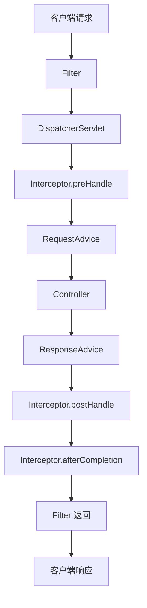
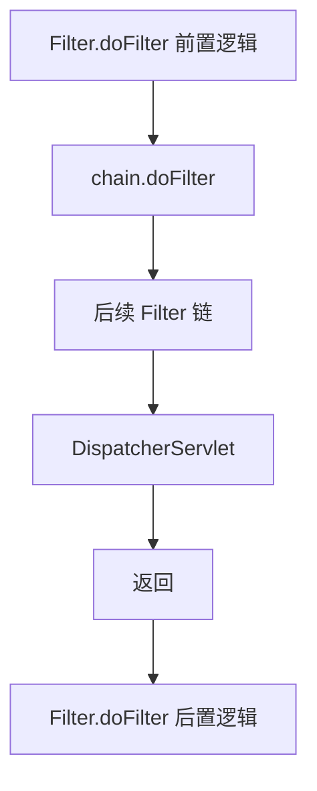
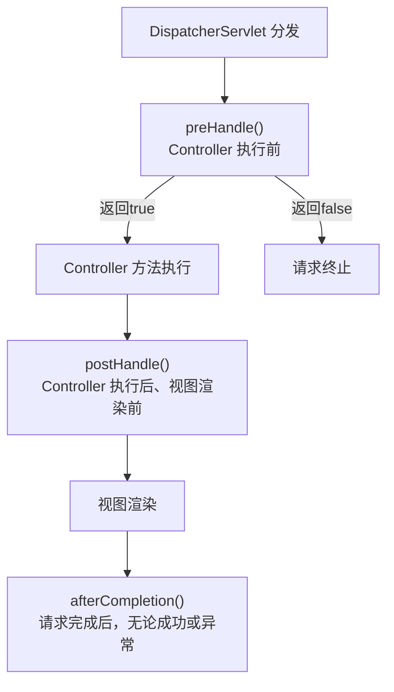
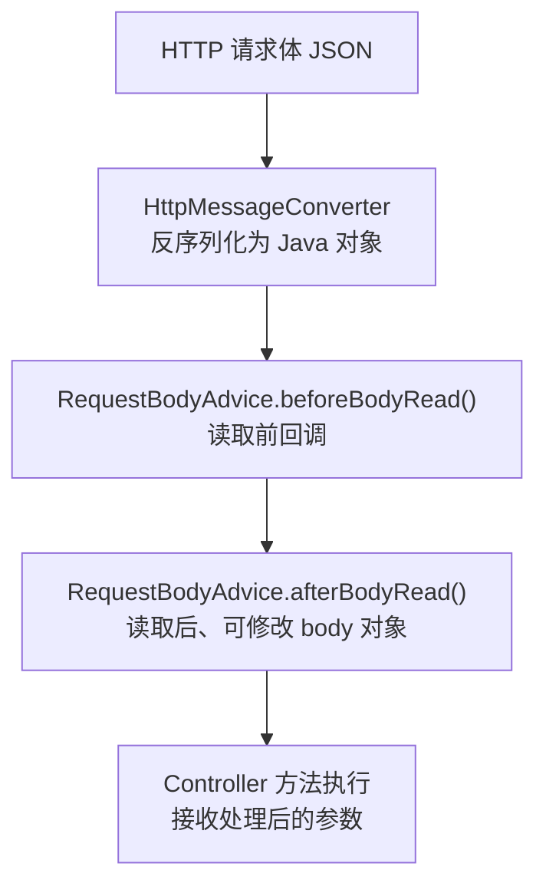
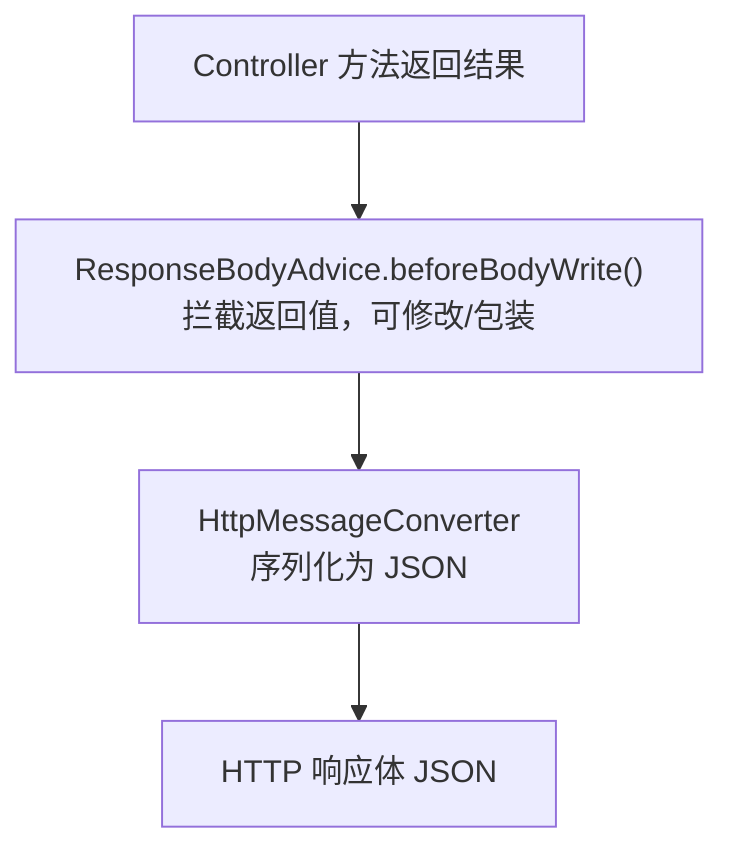
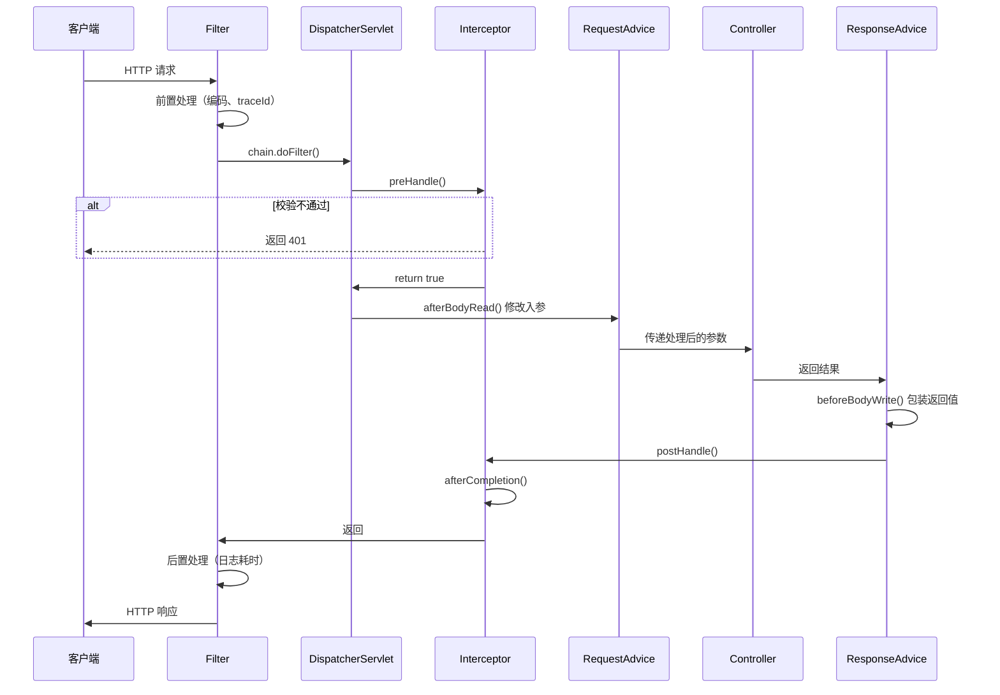

# 一次性讲明白 Filter、Interceptor、RequestAdvice、ResponseAdvice：执行顺序与实际应用

## 一、从一个常见需求说起

开发一个 Web 接口，通常需要处理以下事情：

1. 记录每个请求的耗时日志
2. 校验登录态，未登录拒绝访问
3. 对请求参数做预处理（比如解密、格式转换）
4. 对响应结果做统一封装（比如统一返回 `{code, msg, data}` 格式）

这四个需求对应的正是四个组件：

| 需求 | 对应组件 | 执行位置 |
|------|---------|---------|
| 记录请求日志 | Filter | Servlet 容器层（最外层） |
| 登录校验 | Interceptor | Spring MVC 层（Controller 前后） |
| 请求参数预处理 | RequestAdvice | Controller 方法执行前 |
| 响应统一封装 | ResponseAdvice | Controller 方法执行后 |

这四个组件在一条请求链路中各自负责不同的阶段。先看一张总览图，建立位置感：



这张图只需要记住一个核心原则： **Filter 在最外层，Interceptor 在中间层，Advice 在最内层（紧贴 Controller）。** 请求进来从外到内，响应出去从内到外。

## 二、Filter：最外层的原始请求处理

### 是什么

Filter（过滤器）是 **Servlet 规范** 定义的组件，运行在 Servlet 容器层。它在请求到达 Spring 的 `DispatcherServlet` 之前就已经执行了。这意味着 Filter 处理的不是 Spring 包装后的对象，而是最原始的 `HttpServletRequest` 和 `HttpServletResponse`。

### 执行位置

Filter 的 `doFilter` 方法将请求包裹起来，`chain.doFilter()` 之前是"请求进入"，之后是"响应出去"。



### 日常开发中能做什么

Filter 因为处于最外层，适合做 **与业务无关的全局基础处理** ：

- 字符编码设置（`request.setCharacterEncoding("UTF-8")`）
- CORS 跨域处理
- 请求/响应日志记录（包括请求路径、耗时、状态码）
- XSS 攻击防御（包装 request 对输入做转义）
- 全链路 traceId 的生成与传递

### 示例：请求日志与耗时统计

```java
@Component
public class RequestLoggingFilter implements Filter {

    @Override
    public void doFilter(ServletRequest request, ServletResponse response,
                         FilterChain chain) throws IOException, ServletException {
        HttpServletRequest req = (HttpServletRequest) request;
        long start = System.currentTimeMillis();

        // 前置：记录请求信息
        String traceId = UUID.randomUUID().toString().replace("-", "");
        MDC.put("traceId", traceId);

        chain.doFilter(request, response); // 执行后续链条

        // 后置：记录耗时
        long cost = System.currentTimeMillis() - start;
        HttpServletResponse res = (HttpServletResponse) response;
        log.info("{} {} -> {} {}ms",
                req.getMethod(), req.getRequestURI(), res.getStatus(), cost);

        MDC.clear();
    }
}
```

```java
// 跨域 Filter —— 同样是 Filter 的典型用途
@Component
public class CorsFilter implements Filter {

    @Override
    public void doFilter(ServletRequest request, ServletResponse response,
                         FilterChain chain) throws IOException, ServletException {
        HttpServletResponse res = (HttpServletResponse) response;
        res.setHeader("Access-Control-Allow-Origin", "*");
        res.setHeader("Access-Control-Allow-Methods", "GET,POST,PUT,DELETE");
        res.setHeader("Access-Control-Allow-Headers", "Content-Type,Authorization");
        chain.doFilter(request, response);
    }
}
```

### 注册方式

Filter 可以用 `@Component` 自动注册（上面的示例），也可以用 `FilterRegistrationBean` 精确控制顺序：

```java
@Configuration
public class FilterConfig {

    @Bean
    public FilterRegistrationBean<RequestLoggingFilter> loggingFilter() {
        FilterRegistrationBean<RequestLoggingFilter> bean = new FilterRegistrationBean<>();
        bean.setFilter(new RequestLoggingFilter());
        bean.setOrder(1);               // 数字越小越靠前
        bean.addUrlPatterns("/api/*");  // 只拦截指定路径
        return bean;
    }
}
```

## 三、Interceptor：业务层的请求拦截

### 是什么

Interceptor（拦截器）是 **Spring MVC 框架** 定义的组件。它在 `DispatcherServlet` 之后、Controller 之前执行，可以拿到 Spring 容器中的 Bean，也能获取到 Handler（即目标 Controller 方法）的元信息。

与 Filter 最大的区别：Filter 是 Servlet 级别的，只能拿到原始 request/response；Interceptor 是 Spring 级别的，可以知道"这个请求即将由哪个 Controller 的哪个方法处理"。

### 执行位置与三个阶段

Interceptor 有三个回调时机：



### 日常开发中能做什么

Interceptor 适合做 **与业务逻辑相关的拦截** ：

- 登录校验（从 Header/Cookie 中解析 token，验证登录态）
- 权限控制（基于注解检查用户角色）
- 请求参数预处理（如将 Header 中的用户信息注入到 Controller 参数）
- 接口限流（基于 IP / 用户 ID）
- 记录业务操作日志（操作人、操作内容、操作时间）

### 示例：登录校验 + 用户信息注入

```java
@Component
public class AuthInterceptor implements HandlerInterceptor {

    @Override
    public boolean preHandle(HttpServletRequest request,
                             HttpServletResponse response,
                             Object handler) throws Exception {
        // 从 Header 中获取 token
        String token = request.getHeader("Authorization");
        if (token == null || token.isEmpty()) {
            response.setStatus(401);
            response.getWriter().write("{\"code\":401,\"msg\":\"未登录\"}");
            return false; // 拦截，不再往下走
        }

        // 验证 token，解析用户信息
        Long userId = TokenUtils.parseUserId(token);
        if (userId == null) {
            response.setStatus(401);
            response.getWriter().write("{\"code\":401,\"msg\":\"token无效\"}");
            return false;
        }

        // 存入 request attribute，供后续 Controller 使用
        request.setAttribute("userId", userId);
        return true; // 放行
    }

    @Override
    public void afterCompletion(HttpServletRequest request,
                                HttpServletResponse response,
                                Object handler, Exception ex) {
        // 记录操作日志（不论成功与否都会执行）
        Long userId = (Long) request.getAttribute("userId");
        String uri = request.getRequestURI();
        log.info("用户 {} 访问 {} {}", userId, request.getMethod(), uri);
    }
}
```

```java
@Configuration
public class WebConfig implements WebMvcConfigurer {

    @Override
    public void addInterceptors(InterceptorRegistry registry) {
        registry.addInterceptor(new AuthInterceptor())
                .addPathPatterns("/api/**")      // 拦截路径
                .excludePathPatterns("/api/login", "/api/public/**") // 排除路径
                .order(1);
    }
}
```

### Filter vs Interceptor 关键区别

| 对比维度 | Filter | Interceptor |
|---------|--------|------------|
| 规范来源 | Servlet 规范（`javax.servlet`） | Spring MVC 框架 |
| 执行位置 | DispatcherServlet 之前/之后 | DispatcherServlet 之后、Controller 之前 |
| 能获取的信息 | 原始 `HttpServletRequest`/`HttpServletResponse` | 除原始 request 外，还能获取 `Handler`（目标方法）、`ModelAndView` |
| 能否注入 Spring Bean | 可以（通过 `@Autowired`） | 可以（本身就是 Spring Bean） |
| 能否阻止请求 | 可以（不调用 `chain.doFilter()`） | 可以（`preHandle` 返回 `false`） |
| 适用场景 | 全局基础设施（编码、跨域、traceId） | 业务拦截（登录、权限、日志） |

## 四、RequestAdvice：Controller 方法执行前处理参数

### 是什么

`RequestBodyAdvice`（请求体通知）是 Spring MVC 提供的一个扩展点。它在 Controller 方法执行 **之前** 、HTTP 消息转换器（`HttpMessageConverter`）将请求体反序列化为 Java 对象 **之后** 执行。也就是说，它能拿到已经反序列化好的 Controller 入参对象，并对其进行修改。

> 严格来说，RequestAdvice 指的是实现了 `RequestBodyAdvice` 接口的组件。它和 `ResponseBodyAdvice` 一起，是 Spring 4.1 引入的消息转换器级别的拦截机制。

### 执行位置



关键点：`afterBodyRead` 返回的 body 对象会 **替代** 原始反序列化结果，直接传给 Controller。

### 日常开发中能做什么

- 请求参数解密（前端传加密的 JSON，在 Advice 中解密）
- 请求参数统一校验（如对所有 DTO 做 JSR-303 校验）
- 请求日志记录（记录请求体内容）
- 参数默认值填充

### 示例：请求体解密 + 参数日志

```java
@ControllerAdvice
public class DecryptRequestBodyAdvice extends RequestBodyAdviceAdapter {

    @Override
    public boolean supports(MethodParameter methodParameter,
                            Type targetType,
                            Class<? extends HttpMessageConverter<?>> converterType) {
        // 只处理带有 @Decrypt 注解的方法参数
        return methodParameter.hasParameterAnnotation(Decrypt.class);
    }

    @Override
    public HttpInputMessage beforeBodyRead(HttpInputMessage inputMessage,
                                           MethodParameter parameter,
                                           Type targetType,
                                           Class<? extends HttpMessageConverter<?>> converterType)
            throws IOException {
        // 在这里可以记录原始请求体
        return inputMessage; // 返回原消息或包装后的消息
    }

    @Override
    public Object afterBodyRead(Object body, HttpInputMessage inputMessage,
                                MethodParameter parameter, Type targetType,
                                Class<? extends HttpMessageConverter<?>> converterType) {
        // body 是已经反序列化好的 Controller 入参对象
        log.info("请求体：{}", JSON.toJSONString(body));

        // 示例：如果 DTO 实现了 Decryptable 接口，则解密其中的加密字段
        if (body instanceof Decryptable) {
            ((Decryptable) body).decrypt();
        }
        return body; // 返回的 body 将作为 Controller 的最终入参
    }
}
```

```java
// 配套注解
@Target(ElementType.PARAMETER)
@Retention(RetentionPolicy.RUNTIME)
public @interface Decrypt {
}

// Controller 使用
@PostMapping("/user")
public Result createUser(@RequestBody @Decrypt UserDTO dto) {
    // dto 中的加密字段已在 RequestAdvice 中解密
    userService.save(dto);
    return Result.success();
}
```

## 五、ResponseAdvice：Controller 方法执行后封装返回

### 是什么

`ResponseBodyAdvice`（响应体通知）在 Controller 方法执行 **之后** 、HTTP 消息转换器将返回对象序列化为 JSON **之前** 执行。它能拦截 Controller 的返回值，在序列化之前进行修改或包装。

### 执行位置



### 日常开发中能做什么

- 统一响应格式封装（把 `User` 包装为 `{code:200, data: User, msg:"success"}`）
- 响应数据加密
- 响应数据脱敏（如手机号中间 4 位替换为 `****`）
- 添加统一响应头（如 `X-Response-Time`）

### 示例：统一响应封装

```java
@ControllerAdvice
public class ApiResponseAdvice implements ResponseBodyAdvice<Object> {

    @Override
    public boolean supports(MethodParameter returnType,
                            Class<? extends HttpMessageConverter<?>> converterType) {
        // 排除不需要封装的情况（如文件下载、Swagger接口等）
        return !returnType.getParameterType().equals(ResponseEntity.class);
    }

    @Override
    public Object beforeBodyWrite(Object body, MethodParameter returnType,
                                  MediaType selectedContentType,
                                  Class<? extends HttpMessageConverter<?>> selectedConverterType,
                                  ServerHttpRequest request, ServerHttpResponse response) {
        // 如果已经是 Result 类型，不再重复包装
        if (body instanceof Result) {
            return body;
        }
        // 如果是 String 类型，需要特殊处理（StringHttpMessageConverter 的限制）
        if (body instanceof String) {
            return JSON.toJSONString(Result.success(body));
        }
        return Result.success(body);
    }
}
```

```java
// 统一响应体结构
@Data
@AllArgsConstructor
public class Result<T> {
    private int code;
    private String msg;
    private T data;

    public static <T> Result<T> success(T data) {
        return new Result<>(200, "success", data);
    }

    public static <T> Result<T> error(int code, String msg) {
        return new Result<>(code, msg, null);
    }
}
```

## 六、完整执行顺序

将四个组件放在一条完整的请求链路中，时序如下：



关键规律：

- **进入方向** （从外到内）：`Filter → Interceptor.preHandle → RequestAdvice → Controller`
- **返回方向** （从内到外）：`Controller → ResponseAdvice → Interceptor.postHandle → Interceptor.afterCompletion → Filter`

## 七、四种组件对比总表

| 维度 | Filter | Interceptor | RequestAdvice | ResponseAdvice |
|------|--------|------------|:---:|:---:|
| 所属规范 | Servlet | Spring MVC | Spring MVC | Spring MVC |
| 执行时机 | 请求最外层 | Controller 前后 | Controller 执行前，反序列化后 | Controller 执行后，序列化前 |
| 操作对象 | 原始 `HttpServletRequest`/`HttpServletResponse` | `HttpServletRequest`/`HttpServletResponse` + `Handler` | Controller 入参对象（已反序列化） | Controller 返回对象（未序列化） |
| 能获取 Handler | 否 | 是 | 是（`MethodParameter`） | 是（`MethodParameter`） |
| 能修改请求体 | 是（包装 `HttpServletRequestWrapper`） | 否 | 是（修改反序列化后的 body） | N/A |
| 能修改响应体 | 是（包装 `HttpServletResponseWrapper`） | 否（`postHandle` 只能改 `ModelAndView`） | N/A | 是（修改返回值） |
| 能否阻断请求 | 是（不调 `chain.doFilter()`） | 是（`preHandle` 返回 `false`） | 否 | 否 |
| 典型场景 | 编码、跨域、traceId、请求日志 | 登录校验、权限控制、操作日志 | 参数解密、参数校验、参数日志 | 统一响应封装、数据脱敏、响应加密 |

## 八、日常开发组合实战

### 场景一：全链路 traceId 追踪

三个组件配合完成一个最常见的需求——从请求进来到响应出去，日志中始终携带同一个 `traceId`：

```java
// 1. Filter：生成 traceId，设置到 MDC
@Component
public class TraceFilter implements Filter {
    @Override
    public void doFilter(ServletRequest request, ServletResponse response,
                         FilterChain chain) throws IOException, ServletException {
        String traceId = ((HttpServletRequest) request).getHeader("X-Trace-Id");
        if (traceId == null) traceId = UUID.randomUUID().toString().replace("-", "");
        MDC.put("traceId", traceId);
        chain.doFilter(request, response);
        MDC.clear();
    }
}

// 2. Interceptor：在业务日志中记录用户 + traceId 的关联
@Component
public class TraceInterceptor implements HandlerInterceptor {
    @Override
    public boolean preHandle(HttpServletRequest request,
                             HttpServletResponse response, Object handler) {
        // traceId 已在 Filter 中设置，这里只需设置用户信息
        Long userId = (Long) request.getAttribute("userId");
        if (userId != null) MDC.put("userId", userId.toString());
        return true;
    }
    @Override
    public void afterCompletion(HttpServletRequest request,
                                HttpServletResponse response,
                                Object handler, Exception ex) {
        MDC.remove("userId");
    }
}

// 3. RequestAdvice / ResponseAdvice：在请求体/响应体日志中自带 traceId
// log.info("请求体：{}", body) 时，logback 会自动从 MDC 中取出 traceId 一并打印
```

### 场景二：敏感数据全流程保护

```java
// RequestAdvice：入参加密 → 解密
// ResponseAdvice：返回值 → 脱敏

@ControllerAdvice
public class SensitiveDataAdvice extends RequestBodyAdviceAdapter
                                  implements ResponseBodyAdvice<Object> {

    // --- RequestAdvice：解密入参 ---
    @Override
    public Object afterBodyRead(Object body, ...) {
        // 解密请求中的敏感字段
        if (body instanceof SensitiveInput) {
            ((SensitiveInput) body).decryptFields();
        }
        return body;
    }

    // --- ResponseAdvice：脱敏出参 ---
    @Override
    public Object beforeBodyWrite(Object body, ...) {
        // 脱敏响应中的手机号、身份证号
        if (body instanceof SensitiveOutput) {
            ((SensitiveOutput) body).maskFields();
        }
        return body;
    }
}
```

### 场景三：Controller 代码的"理想状态"

有了这四个组件各司其职后，Controller 应该只做一件事——调用 Service，返回结果。所有横切关注点（日志、鉴权、参数处理、响应封装）都由外围组件处理：

```java
@RestController
@RequestMapping("/api/orders")
public class OrderController {

    @PostMapping
    @Decrypt  // RequestAdvice 负责解密
    public OrderVO create(@RequestBody @Valid CreateOrderDTO dto) {
        // 不需要关心：
        // - traceId（Filter 做了）
        // - 登录态（Interceptor 做了）
        // - 参数解密（RequestAdvice 做了）
        // - 响应封装（ResponseAdvice 做了）
        // 只需要关心业务逻辑
        return orderService.create(dto);
    }
}
```

## 九、总结

四个组件的核心定位可以用一句话概括：

| 组件 | 一句话定位 |
|------|---------|
| Filter | 最外层的 **全局基础设施** ，处理与业务无关的原始请求/响应 |
| Interceptor | 中间层的 **业务守门人** ，处理登录、权限、操作日志等业务拦截 |
| RequestAdvice | 紧贴 Controller 入参的 **参数预处理** ，在数据进入业务层之前做最后加工 |
| ResponseAdvice | 紧贴 Controller 返回值的 **结果后处理** ，在数据返回客户端之前做统一封装 |

记住执行顺序： **Filter（外） → Interceptor → RequestAdvice → Controller → ResponseAdvice → Interceptor（返回） → Filter（返回）** 。
