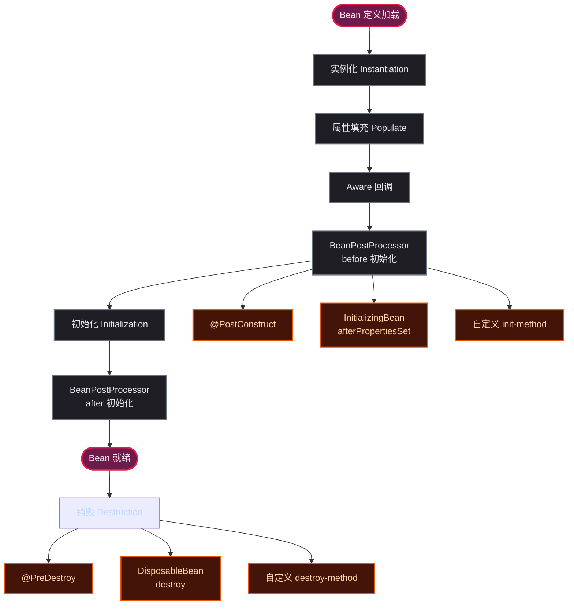
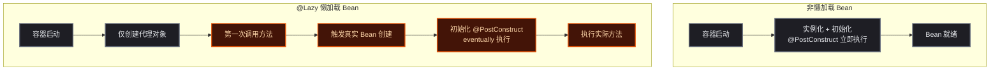
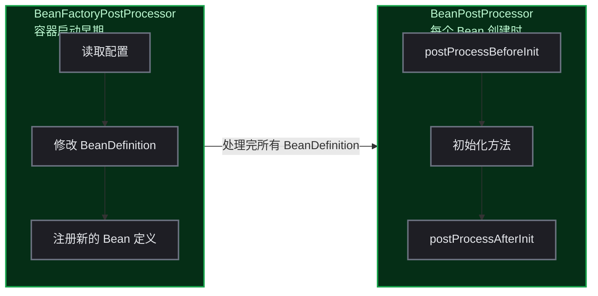

# Spring Bean 生命周期与懒加载：从一次 Starter 踩坑说起

## 起因：一个 @PostConstruct 引发的血案

封装了一个 Redis 工具类的 Spring Boot Starter，里面有个组件叫 `WorkIdAllocator `，它在 `@PostConstruct` 中做了这么一件事：

```java
@PostConstruct
public void init() {
    setNextSnowFlaskWorkerId();  // 连接 Redis，分配一个雪花算法 WorkerId
}
```

看起来没毛病——服务启动时自动分配到 WorkerId。但问题来了：**Redis 的连接参数（ `spring.data.redis.host `）放在 Nacos 配置中心**，通过 `shared-configs` 加载。而 `@PostConstruct` 在 Bean 属性注入完成后就立刻执行，那时候 Redis 配置还没加载到 Spring 的 Environment 中。

结果： `host = null` → 默认 localhost:6379 → 连不上 → 启动失败。

修复方式也很简单——加个 `@Lazy `：

```java
@Lazy
@Component
public class WorkIdAllocator {
    // 第一次被调用时才执行 @PostConstruct
}
```

问题虽然解决了，但某个开发者好奇心被勾起来了：**Spring Bean 的生命周期到底分几个阶段？扩展点在什么时候执行？`@Lazy` 到底干了什么？**

这篇文章就从源码和实验代码两个角度摸清楚。

## Spring Bean 生命周期全景图

一个 Bean 从定义到销毁，经历了完整的九道工序：



每一步都是 Spring 留给开发者的扩展点。下面逐级拆开来看。

## 第一步：实例化——Bean 是怎么 new 出来的

Spring 在什么时候决定要创建一个 Bean？在 `AbstractBeanFactory.doGetBean()` 中：

```java
// AbstractBeanFactory.java (Spring 6.x)
protected <T> T doGetBean(String name, Class<T> requiredType, Object[] args, boolean typeCheckOnly) {
    // 1. 检查单例缓存
    Object sharedInstance = getSingleton(name);
    if (sharedInstance != null && args == null) {
        bean = getObjectForBeanInstance(sharedInstance, name, ...);
        return bean;
    }

    // 2. 检查父容器
    // 3. 检查已创建的 Bean 依赖（解决循环依赖）

    // 4. 创建 Bean
    if (mbd.isSingleton()) {
        sharedInstance = getSingleton(name, () -> createBean(name, mbd, args));
        bean = getObjectForBeanInstance(sharedInstance, name, ...);
    }
}
```

`createBean()` 最终委托给 `AbstractAutowireCapableBeanFactory.createBeanInstance()`，通过反射或工厂方法创建实例。这时候 Bean 还是个"光杆司令"——所有属性都是 null。

## 第二步：属性填充——@Autowired 在这里生效

```java
// AbstractAutowireCapableBeanFactory.java
protected void populateBean(String beanName, RootBeanDefinition mbd, BeanWrapper bw) {
    // 处理 @Autowired、@Value、@Resource
    // 处理 XML 配置的 <property>
    // 处理构造函数注入的参数
    for (InstantiationAwareBeanPostProcessor bp : getBeanPostProcessors()) {
        bp.postProcessProperties(pvs, bw.getWrappedInstance(), beanName);
    }
}
```

到这里，Bean 的各种依赖已经被注入完毕了。但**初始化方法还没执行**。

## 第三步：Aware 回调——Bean 知道自己叫什么名字

```java
// AbstractAutowireCapableBeanFactory.java
private void invokeAwareMethods(String beanName, Object bean) {
    if (bean instanceof Aware) {
        if (bean instanceof BeanNameAware) {
            ((BeanNameAware) bean).setBeanName(beanName);
        }
        if (bean instanceof BeanClassLoaderAware) { ... }
        if (bean instanceof BeanFactoryAware) {
            ((BeanFactoryAware) bean).setBeanFactory(beanFactory);
        }
    }
}
```

这个阶段只处理 Spring 内部的 `Aware` 接口。 `ApplicationContextAware` 不在这一层处理，而是在后续的 `ApplicationContextAwareProcessor `（一个 `BeanPostProcessor `）中执行。

## 第四步：初始化前的 BeanPostProcessor

```java
// AbstractAutowireCapableBeanFactory.java
protected Object initializeBean(String beanName, Object bean, RootBeanDefinition mbd) {
    // 1. Aware 回调（BeanNameAware 等）
    invokeAwareMethods(beanName, bean);

    // 2. BeanPostProcessor before 初始化
    Object wrappedBean = bean;
    wrappedBean = applyBeanPostProcessorsBeforeInitialization(wrappedBean, beanName);

    // 3. 执行初始化方法
    invokeInitMethods(beanName, wrappedBean, mbd);

    // 4. BeanPostProcessor after 初始化
    wrappedBean = applyBeanPostProcessorsAfterInitialization(wrappedBean, beanName);
    return wrappedBean;
}
```

所有 `BeanPostProcessor` 的 `postProcessBeforeInitialization` 在这里被执行。开发者熟悉的 `@PostConstruct` 就是在这一步被触发的——它由 `InitDestroyAnnotationBeanPostProcessor` 处理。

跟进去看源码：

```java
// InitDestroyAnnotationBeanPostProcessor.java
public Object postProcessBeforeInitialization(Object bean, String beanName) {
    // 查找当前 Bean 中标注了 @PostConstruct 的方法
    LifecycleMetadata metadata = findLifecycleMetadata(bean.getClass());
    metadata.invokeInitMethods(bean, beanName);  // 这里调用了 @PostConstruct 方法
    return bean;
}
```

## 第五步：初始化方法——三种写法

```java
// AbstractAutowireCapableBeanFactory.java
protected void invokeInitMethods(String beanName, Object bean, RootBeanDefinition mbd) {
    // 方式一：InitializingBean 接口
    if (bean instanceof InitializingBean) {
        ((InitializingBean) bean).afterPropertiesSet();
    }

    // 方式二：自定义 init-method（@Bean(initMethod="...") 或 XML）
    if (mbd.getInitMethodName() != null) {
        invokeCustomInitMethod(beanName, bean, mbd);
    }
}
```

所以初始化阶段有三种写法，执行顺序是：

| 优先级 | 方式 | 示例 |
|:------:|------|------|
| 1 | `@PostConstruct` | `@PostConstruct public void init() { }` |
| 2 | `InitializingBean` | `implements InitializingBean → afterPropertiesSet()` |
| 3 | `@Bean(initMethod)` | `@Bean(initMethod = "init")` |

> ⚠️ 注意：`@PostConstruct` 不是在 `invokeInitMethods` 中处理的，而是在上面的 `applyBeanPostProcessorsBeforeInitialization` 中。所以它的执行时机比 `InitializingBean` 更早。

## 第六步：初始化后的 BeanPostProcessor

```java
// AbstractAutowireCapableBeanFactory.java
public Object applyBeanPostProcessorsAfterInitialization(Object existingBean, String beanName) {
    for (BeanPostProcessor processor : getBeanPostProcessors()) {
        current = processor.postProcessAfterInitialization(current, beanName);
    }
    return current;
}
```

AOP 代理就是在这里生成的。 `AbstractAutoProxyCreator` 的 `postProcessAfterInitialization` 会检查当前 Bean 是否需要被代理，如果需要，就返回一个代理对象而不是原始 Bean。

## 完整的执行顺序验证

用一个实验类来验证：

```java
@Component
@Slf4j
public class LifecycleBean implements BeanNameAware, InitializingBean {

    public LifecycleBean() {
        log.info("1. 构造方法");
    }

    @Autowired
    public void setDependency(SomeDependency dep) {
        log.info("2. 属性注入");
    }

    @Override
    public void setBeanName(String name) {
        log.info("3. BeanNameAware: {}", name);
    }

    @PostConstruct
    public void postConstruct() {
        log.info("4. @PostConstruct");
    }

    @Override
    public void afterPropertiesSet() {
        log.info("5. InitializingBean.afterPropertiesSet");
    }

    @Bean(initMethod = "customInit")
    @PostConstruct
    public void customInit() {
        log.info("6. 自定义 init-method");
    }
}
```

输出结果：

```
1. 构造方法
2. 属性注入
3. BeanNameAware: lifecycleBean
4. @PostConstruct
5. InitializingBean.afterPropertiesSet
6. 自定义 init-method
```

## @Lazy 懒加载的原理

回到开头的问题——`@Lazy` 是如何阻止 `@PostConstruct` 的？

```java
@Lazy
@Component
public class WorkIdAllocator {
    @PostConstruct
    public void init() {
        // 连接 Redis...
    }
}
```

`@Lazy` 加在 `@Component` 上时，Spring 不会在容器启动时创建这个 Bean，而是生成一个**代理对象**。第一次调用这个 Bean 的方法时，代理对象才真正创建真实的 Bean 实例并执行其初始化方法。

关键源码在 `AbstractBeanFactory` 中：

```java
// AbstractBeanFactory.java
protected <T> T doGetBean(...) {
    // 如果是懒加载的单例，或者非单例，直接创建
    if (mbd.isSingleton()) {
        if (!mbd.isLazyInit()) { // 非懒加载 → 立即创建
            sharedInstance = getSingleton(name, () -> createBean(name, mbd, args));
        }
        // 懒加载 → 不创建，交给代理
    }
}
```

而 `FactoryBeanRegistrySupport` 中有一段关键逻辑——当 `@Lazy` 的 Bean 被注入到其他非懒加载 Bean 时，Spring 会注入一个 `SmartFactoryBean` 或 JDK 动态代理，代理对象会在第一次调用时触发真实的 Bean 创建：

```java
// ContextAnnotationAutowireCandidateResolver.java
protected Object buildLazyResolutionProxy(...) {
    ProxyFactory pf = new ProxyFactory();
    pf.setTargetClass(beanClass);
    // ... 配置代理
    return pf.getProxy(beanClass.getClassLoader());
}
```



懒加载的适用场景：

| 场景 | 推荐 | 理由 |
|------|:----:|------|
| 需要远程连接的组件（Redis、RocketMQ） | `@Lazy` | 配置可能来自远程配置中心，启动时尚未就绪 |
| 非核心链路的大成本组件 | `@Lazy` | 减少启动时间 |
| 关键基础设施组件（数据源） | 不懒加载 | 启动时就应该验证可用性 |
| Feign 客户端 | `@Lazy` | 防止循环依赖 |
| `@Bean` 方法返回的对象 | `@Lazy` 或 `@Scope("prototype")` | 按需创建 |

## @PostConstruct 为什么能和 lazy 共存

`@PostConstruct` 是在 `InitDestroyAnnotationBeanPostProcessor` 中通过 `postProcessBeforeInitialization` 触发的。而 `postProcessBeforeInitialization` 只对**真实 Bean 实例**起作用。

懒加载 Bean 在创建代理对象时，代理对象本身不经过 `postProcessBeforeInitialization `，只有第一次真正实例化时才会走完整的初始化流程——那时候 `@PostConstruct` 自然也会执行。所以 `@Lazy` 推迟的不是 `@PostConstruct `，而是整个完整生命周期。

## 补充：BeanPostProcessor 和 BeanFactoryPostProcessor 的区别

这是另一个常见误区，用一张图说明：



| 接口 | 作用 | 执行时机 | 操作对象 |
|------|------|---------|---------|
| `BeanFactoryPostProcessor` | 修改 Bean 的定义（属性占位符替换等） | **所有 Bean 实例化之前** | `BeanDefinition `（配置元数据） |
| `BeanPostProcessor` | 对已实例化的 Bean 做增强 | **每个 Bean 创建过程中** | Bean 实例 |

经常有开发者把 `@Value("${xxx}")` 不生效的原因归咎于 Bean 加载顺序，其实真正的原因是 `BeanFactoryPostProcessor `（处理占位符的 `PropertySourcesPlaceholderConfigurer `）还没有执行，而 Bean 已经被创建了。

## 总结

从一个 `@PostConstruct` 的踩坑开始，走了遍 Spring Bean 生命周期的九道工序。

几个关键时间节点记清楚：

1. **`@PostConstruct `** 在 `BeanPostProcessor.beforeInit` 中执行，**早于** `InitializingBean`
2. **`@Lazy `** 推迟的是整个生命周期，不是只推迟 `@PostConstruct`
3. ** `BeanFactoryPostProcessor `** 在 Bean 实例化之前执行，操作的是 `BeanDefinition`
4. ** `BeanPostProcessor `** 在每个 Bean 创建时执行，操作的是 Bean 实例
5. 远程配置中心（Nacos、Apollo）的属性在 `Environment` 就绪后才会被注入——如果 `@PostConstruct` 依赖这些属性，一定要确保它们在初始化前到位。否则就用 `@Lazy` 推迟初始化。
