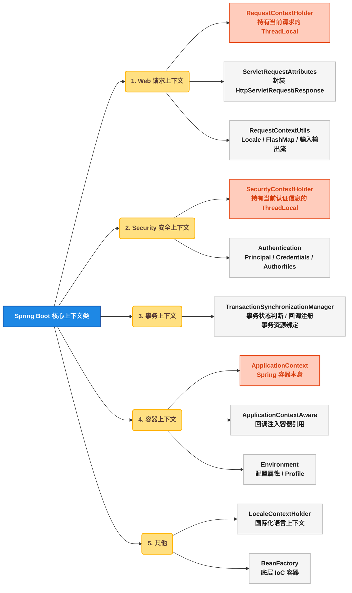
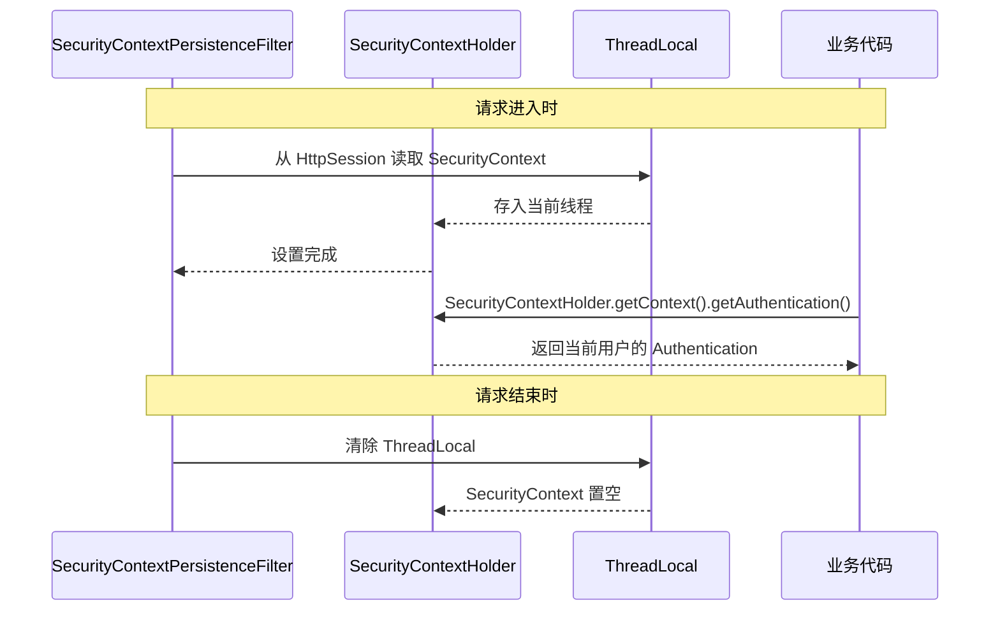
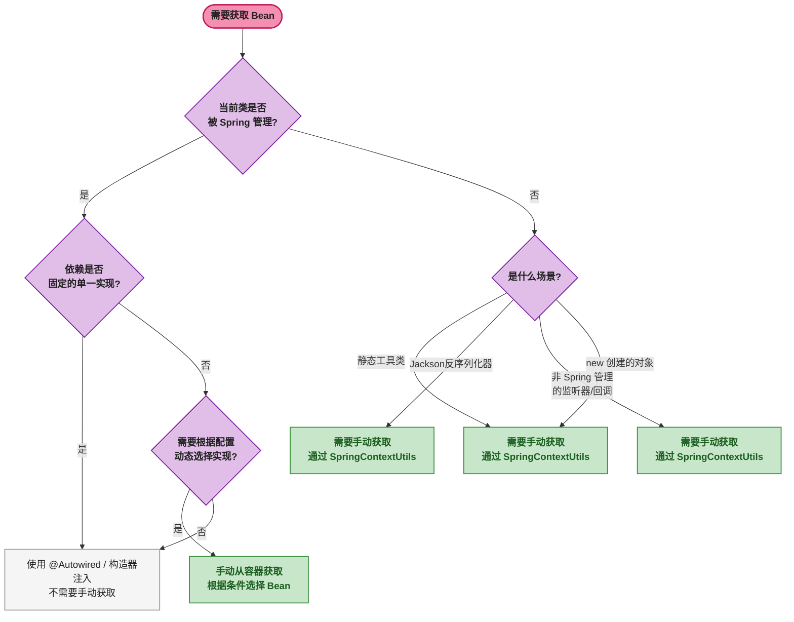
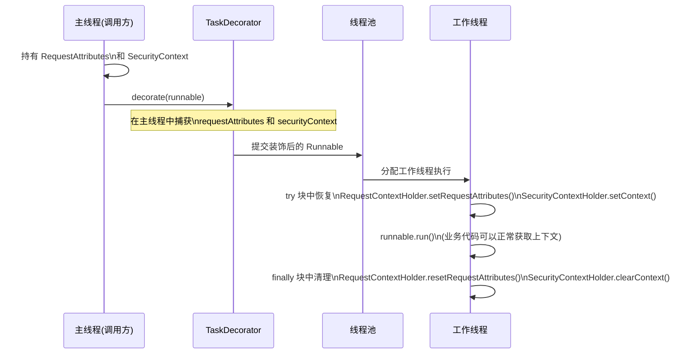
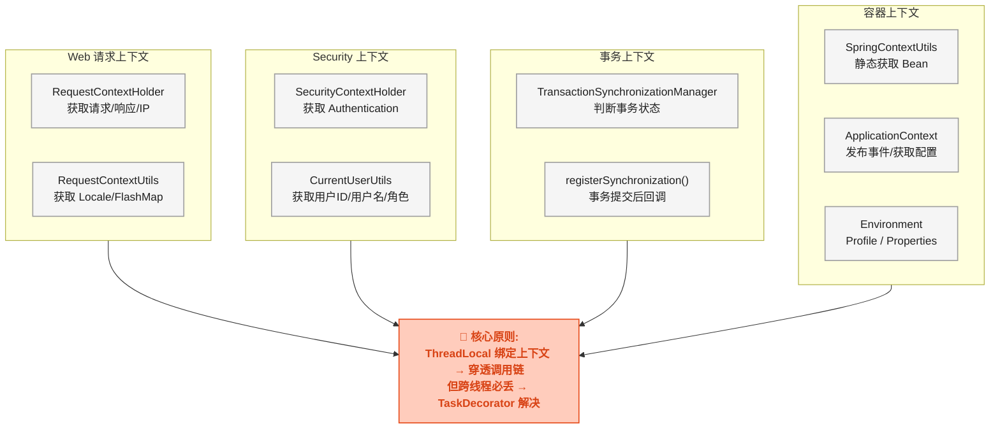

# Spring Boot 开发必知：那些高频使用的核心上下文类

## 🐛 从一个 NPE 说起

同事在 `IdUtils` 工具类里写了一个生成订单号的方法，需要调用数据库序列服务。代码部署到生产环境后，每隔几天就会抛出一个 `NullPointerException`，而且总是在凌晨 2 点左右。

排查后发现问题：生成订单号的逻辑需要从 Spring 容器中获取 `SequenceService`，但 `IdUtils` 是一个纯静态工具类，不归 Spring 管理。同事的写法是：

```java
public class IdUtils {
    // 这样永远拿不到 Bean——IdUtils 自己都没被 Spring 管理，谁来注入？
    @Autowired
    private static SequenceService sequenceService;

    public static String genOrderId() {
        return sequenceService.nextVal("order"); // NPE! sequenceService == null
    }
}
```

这是一个典型场景： **需要在不受 Spring 管理的类中获取 Spring Bean** 。解决它的钥匙就是本篇要讲的"上下文类"（Context Classes）——Spring 框架提供的一系列能让你在任何位置获取框架运行时状态的工具。



## 🌐 一、Web 请求上下文

### ⚙️ 1.1 核心类与底层原理

`RequestContextHolder`（请求上下文持有者）通过 `ThreadLocal`（线程局部变量）将当前请求的 `ServletRequestAttributes` 绑定到当前线程。DispatcherServlet（Spring MVC 的前端控制器）在处理每个请求时，会自动调用 `RequestContextHolder.setRequestAttributes()` 将请求对象"挂"到当前线程上。

```java
// Spring 源码中的核心结构（简化）
// 文件: org.springframework.web.context.request.RequestContextHolder
public abstract class RequestContextHolder {
    // 每个线程一个独立副本
    private static final ThreadLocal<RequestAttributes> requestAttributesHolder =
            new NamedThreadLocal<>("Request attributes");

    // 可继承的 ThreadLocal——子线程可继承父线程的值
    private static final ThreadLocal<RequestAttributes> inheritableRequestAttributesHolder =
            new NamedInheritableThreadLocal<>("Request context");

    // 获取当前线程绑定的请求属性
    public static RequestAttributes getRequestAttributes() {
        RequestAttributes attributes = requestAttributesHolder.get();
        if (attributes == null) {
            attributes = inheritableRequestAttributesHolder.get();
        }
        return attributes;
    }
}
```

关键点：
- `requestAttributesHolder` 是 <span style="color:red">`NamedThreadLocal`</span>，本质是 `ThreadLocal`。这意味着换一个线程就获取不到了——这是 <span style="color:red">`@Async 异步方法中无法获取请求上下文`</span> 的根本原因
- `inheritableRequestAttributesHolder` 是 `InheritableThreadLocal`，子线程可以继承。但在线程池场景下仍然失效（线程复用导致上下文错乱）
- `ServletRequestAttributes` 封装了 `HttpServletRequest`、`HttpServletResponse` 和 `HttpSession`

### 🛠️ 1.2 实战一：封装 WebUtils 工具类

日常开发中频繁需要获取请求 IP、请求路径、请求头等信息。下面封装一个可在任意位置调用的工具类：

```java
import org.springframework.web.context.request.RequestContextHolder;
import org.springframework.web.context.request.ServletRequestAttributes;

import javax.servlet.http.HttpServletRequest;
import javax.servlet.http.HttpServletResponse;
import java.util.Objects;
import java.util.Optional;

public class WebUtils {

    /** 获取当前请求对象，非 Web 环境返回 null */
    public static HttpServletRequest getRequest() {
        return Optional.ofNullable(RequestContextHolder.getRequestAttributes())
                .filter(ServletRequestAttributes.class::isInstance)
                .map(ServletRequestAttributes.class::cast)
                .map(ServletRequestAttributes::getRequest)
                .orElse(null);
    }

    /** 获取当前响应对象 */
    public static HttpServletResponse getResponse() {
        return Optional.ofNullable(RequestContextHolder.getRequestAttributes())
                .filter(ServletRequestAttributes.class::isInstance)
                .map(ServletRequestAttributes.class::cast)
                .map(ServletRequestAttributes::getResponse)
                .orElse(null);
    }

    /** 获取客户端 IP，自动处理反向代理 */
    public static String getClientIp() {
        HttpServletRequest request = getRequest();
        if (request == null) return "unknown";

        String ip = request.getHeader("X-Forwarded-For");
        if (ip == null || ip.isEmpty() || "unknown".equalsIgnoreCase(ip)) {
            ip = request.getHeader("X-Real-IP");
        }
        if (ip == null || ip.isEmpty() || "unknown".equalsIgnoreCase(ip)) {
            ip = request.getHeader("Proxy-Client-IP");
        }
        if (ip == null || ip.isEmpty() || "unknown".equalsIgnoreCase(ip)) {
            ip = request.getRemoteAddr();
        }
        // 多级代理取第一个非 unknown 的 IP
        if (ip != null && ip.contains(",")) {
            ip = ip.split(",")[0].trim();
        }
        return ip;
    }

    /** 获取完整请求路径（含 Query String） */
    public static String getFullRequestPath() {
        HttpServletRequest request = getRequest();
        if (request == null) return "";

        String uri = request.getRequestURI();
        String query = request.getQueryString();
        return query == null ? uri : uri + "?" + query;
    }
}
```

使用示例：

```java
// 在任何 Controller、Service、Utils 中使用
@GetMapping("/order/{id}")
public String getOrder(@PathVariable Long id) {
    String clientIp = WebUtils.getClientIp();
    String fullPath = WebUtils.getFullRequestPath();
    log.info("请求来自 IP: {}，完整路径: {}", clientIp, fullPath);
    return orderService.findById(id);
}
```

### 🌍 1.3 实战二：RequestContextUtils 获取 Locale 和 FlashMap

`RequestContextUtils` 是 Spring 提供的一组静态方法，用于从请求中获取特定的上下文信息：

```java
import org.springframework.web.servlet.support.RequestContextUtils;
import org.springframework.web.servlet.FlashMap;

@GetMapping("/dashboard")
public String dashboard(HttpServletRequest request) {
    // 获取当前请求的语言环境（国际化）
    Locale locale = RequestContextUtils.getLocale(request);
    String greeting = messageSource.getMessage("welcome", null, locale);

    // 获取 Flash 属性（RedirectAttributes 带过来的数据）
    Map<String, ?> flashMap = RequestContextUtils.getInputFlashMap(request);
    String successMsg = null;
    if (flashMap != null) {
        successMsg = (String) flashMap.get("successMsg");
    }

    // 获取 WebApplicationContext
    WebApplicationContext ctx = RequestContextUtils.findWebApplicationContext(request);
    // 通过 ctx 可以拿到任何 Spring 管理的 Bean

    model.addAttribute("greeting", greeting);
    model.addAttribute("successMsg", successMsg);
    return "dashboard";
}
```

| 方法 | 返回值 | 用途 |
|------|------|------|
| `getLocale(request)` | `Locale` | 获取请求的语言环境 |
| `getInputFlashMap(request)` | `Map<String, ?>` | 获取重定向前存入的 Flash 属性 |
| `getOutputFlashMap(request)` | `FlashMap` | 获取即将存入的重定向 Flash 属性 |
| `findWebApplicationContext(request)` | `WebApplicationContext` | 获取当前请求关联的 Web 容器 |

## 🔒 二、Security 安全上下文

### 🔒 2.1 核心类原理

`SecurityContextHolder`（安全上下文持有者）与 `RequestContextHolder` 的设计同出一源——用 `ThreadLocal` 绑定当前线程的认证信息。Spring Security 的 `SecurityContextPersistenceFilter` 在每次请求时将 `Authentication` 存入 `SecurityContextHolder`，请求结束时清除。



### 👤 2.2 实战：封装 CurrentUserUtils

```java
import org.springframework.security.core.Authentication;
import org.springframework.security.core.context.SecurityContextHolder;
import org.springframework.security.core.userdetails.UserDetails;

public class CurrentUserUtils {

    /** 获取当前认证信息，非登录环境返回 null */
    public static Authentication getAuthentication() {
        return SecurityContextHolder.getContext().getAuthentication();
    }

    /** 获取当前用户 ID */
    public static Long getUserId() {
        Authentication auth = getAuthentication();
        if (auth == null || !auth.isAuthenticated()) {
            return null;
        }
        Object principal = auth.getPrincipal();
        if (principal instanceof UserDetails) {
            // 如果 UserDetails 中存储了用户 ID，解析返回
            // 这里以 username 为 ID 的简化示例
            String username = ((UserDetails) principal).getUsername();
            return Long.valueOf(username);
        }
        // principal 为 "anonymousUser" 或其他字符串时返回 null
        return null;
    }

    /** 获取当前用户名 */
    public static String getUsername() {
        Authentication auth = getAuthentication();
        if (auth == null) {
            return null;
        }
        return auth.getName(); // 通常返回 username
    }

    /** 判断当前用户是否拥有某个角色 */
    public static boolean hasRole(String role) {
        Authentication auth = getAuthentication();
        if (auth == null) return false;
        return auth.getAuthorities().stream()
                .anyMatch(a -> a.getAuthority().equals("ROLE_" + role));
    }
}
```

使用方式：在 Controller 或 Service 中直接调用：

```java
@PostMapping("/order/create")
public Result createOrder(OrderDTO dto) {
    Long userId = CurrentUserUtils.getUserId();
    if (userId == null) {
        throw new BizException("未登录");
    }
    orderService.create(userId, dto);
    return Result.success();
}
```

## 🔄 三、事务上下文

### ⚙️ 3.1 核心类原理

`TransactionSynchronizationManager`（事务同步管理器）是 Spring 事务管理的基础设施，同样基于 `ThreadLocal`。它将当前事务的资源（数据库连接、事务状态）绑定到线程，并提供事务生命周期回调（事务同步）的注册机制。

| 方法 | 用途 |
|------|------|
| `isActualTransactionActive()` | 判断当前线程是否存在活跃事务 |
| `getCurrentTransactionName()` | 获取当前事务的名称 |
| `isCurrentTransactionReadOnly()` | 判断当前事务是否只读 |
| `bindResource(key, value)` | 将资源绑定到当前事务上下文 |
| `registerSynchronization(sync)` | 注册事务同步回调 |
| `getResource(key)` | 获取当前事务绑定的资源 |

### 🔄 3.2 实战：事务提交后执行回调

经典场景：在订单创建的事务提交 **之后** 发送 MQ 消息或短信通知。如果在 `@Transactional` 方法内直接发 MQ，一旦消息发送成功但事务回滚了，就会产生数据不一致。

```java
import org.springframework.transaction.support.TransactionSynchronizationAdapter;
import org.springframework.transaction.support.TransactionSynchronizationManager;

@Service
public class OrderService {

    @Transactional
    public void createOrder(OrderDTO dto) {
        // 1. 数据库操作
        orderDao.insert(order);
        inventoryDao.deduct(order.getItems());

        // 2. 注册事务提交后的回调——而不是直接发 MQ
        TransactionSynchronizationManager.registerSynchronization(
            new TransactionSynchronizationAdapter() {
                @Override
                public void afterCommit() {
                    // 事务提交成功后才发送消息
                    mqProducer.send(new OrderCreatedEvent(order.getId()));
                    // 或者发短信通知用户
                    smsService.send(order.getUserId(), "订单已创建");
                }
            }
        );
    }
}
```

核心判断逻辑——`afterCommit` 只在事务成功提交后执行。如果事务回滚，Spring 会调用 `afterCompletion(int status)`，`status` 为 `STATUS_ROLLED_BACK`，`afterCommit` 不会被触发。

### 🔍 3.3 判断当前是否在事务中

```java
// 某些场景需要确认当前操作是否被事务包裹
if (TransactionSynchronizationManager.isActualTransactionActive()) {
    log.info("当前在事务 [{}] 中, 只读={}",
        TransactionSynchronizationManager.getCurrentTransactionName(),
        TransactionSynchronizationManager.isCurrentTransactionReadOnly());
} else {
    log.warn("当前操作不在事务中, 可能存在数据一致性问题");
}
```

## 📦 四、容器上下文（重点）

容器上下文是本章最重要的内容。`ApplicationContext` 是 Spring 的 IoC 容器本身，持有所有 Bean 的定义和实例。理解何时需要手动获取 Bean 是区分初级与中高级开发者的一个标志。

### 🤔 4.1 什么时候需要手动从容器获取 Bean

通常情况下，通过 `@Autowired` 或构造器注入获取依赖是最佳实践。但在以下四种场景中，你 **必须** 或者 **最好** 手动从容器获取 Bean：



四种必须手动获取的场景：

| 场景 | 原因 | 示例 |
|------|------|------|
| 静态工具类 | 静态字段无法被 Spring 注入 | `IdUtils` 生成订单号 |
| 反序列化器 | Jackson 自行 `new` 反序列化器实例 | `OrderDeserializer` 中查数据库 |
| 动态选择实现 | 根据配置决定用哪个实现类 | 根据 `sms.provider` 选阿里云还是腾讯云 |
| 非 Spring 管理的回调 | 框架回调不由 Spring 管理生命周期 | Quartz Job、Netty Handler |

### 🛠️ 4.2 实战一：封装 SpringContextUtils

```java
import org.springframework.beans.BeansException;
import org.springframework.context.ApplicationContext;
import org.springframework.context.ApplicationContextAware;
import org.springframework.context.ApplicationEvent;
import org.springframework.core.env.Environment;
import org.springframework.stereotype.Component;

@Component
public class SpringContextUtils implements ApplicationContextAware {

    private static ApplicationContext applicationContext;

    @Override
    public void setApplicationContext(ApplicationContext ctx) throws BeansException {
        applicationContext = ctx;
    }

    /** 按类型获取单个 Bean */
    public static <T> T getBean(Class<T> clazz) {
        return applicationContext.getBean(clazz);
    }

    /** 按名称和类型获取 Bean */
    public static <T> T getBean(String name, Class<T> clazz) {
        return applicationContext.getBean(name, clazz);
    }

    /** 获取指定类型的所有 Bean（包括子类），常用于策略模式 */
    public static <T> Map<String, T> getBeansOfType(Class<T> clazz) {
        return applicationContext.getBeansOfType(clazz);
    }

    /** 获取配置属性 */
    public static String getProperty(String key) {
        return applicationContext.getBean(Environment.class).getProperty(key);
    }

    /** 获取配置属性，带默认值 */
    public static String getProperty(String key, String defaultValue) {
        return applicationContext.getBean(Environment.class).getProperty(key, defaultValue);
    }

    /** 发布 Spring 事件 */
    public static void publishEvent(ApplicationEvent event) {
        applicationContext.publishEvent(event);
    }

    /** 获取 ApplicationContext 本身 */
    public static ApplicationContext getApplicationContext() {
        return applicationContext;
    }

    /** 获取当前激活的 Profile */
    public static String[] getActiveProfiles() {
        return applicationContext.getBean(Environment.class).getActiveProfiles();
    }

    /** 判断某个 Profile 是否激活 */
    public static boolean isProfileActive(String profile) {
        return applicationContext.getBean(Environment.class)
                .acceptsProfiles(org.springframework.core.env.Profiles.of(profile));
    }
}
```

核心实现要点：
- 类本身用 `@Component` 注解，确保被 Spring 扫描并实例化
- `implements ApplicationContextAware`，Spring 会在 Bean 初始化完成后回调 `setApplicationContext` 方法，将容器引用注入
- 通过 `static` 字段保存容器引用，对外暴露 `static` 方法——这就是用"非静态类 + 静态字段"绕过 Spring 不能给 static 字段注入限制的标准手段

### 🏷️ 4.3 实战二：工具类中调用 Service 生成订单号

回到开头的问题——`IdUtils` 如何获取 `SequenceService`：

```java
@Component
public class IdUtils {

    private static SequenceService sequenceService;

    /** 构造器注入——Spring 在创建 IdUtils 这个 Bean 时完成赋值 */
    public IdUtils(SequenceService sequenceService) {
        IdUtils.sequenceService = sequenceService;
    }

    public static String genOrderId() {
        // 序列号服务生成递增序号
        long seq = sequenceService.nextVal("order_seq");
        String datePart = LocalDate.now().format(DateTimeFormatter.ofPattern("yyyyMMdd"));
        return "ORD" + datePart + String.format("%08d", seq);
    }

    // 另一种方式：延迟获取，避免循环依赖
    public static String genOrderIdV2() {
        SequenceService service = SpringContextUtils.getBean(SequenceService.class);
        long seq = service.nextVal("order_seq");
        String datePart = LocalDate.now().format(DateTimeFormatter.ofPattern("yyyyMMdd"));
        return "ORD" + datePart + String.format("%08d", seq);
    }
}
```

两种方式对比：

| 方式 | 优点 | 缺点 |
|------|------|------|
| 构造器注入 + static 赋值 | 启动时就能发现依赖缺失 | 需要 IdUtils 本身是 Bean，有循环依赖风险 |
| `SpringContextUtils.getBean()` | 无循环依赖风险，延迟加载 | 启动时发现不了依赖缺失，依赖不透明 |

### 🔄 4.4 实战三：Jackson 反序列化器中使用 Service

Jackson 在反序列化 JSON 时会通过反射 **自行 new** `JsonDeserializer` 的子类实例，这意味着 `@Autowired` 在反序列化器中完全不工作：

```java
import com.fasterxml.jackson.core.JsonParser;
import com.fasterxml.jackson.databind.DeserializationContext;
import com.fasterxml.jackson.databind.JsonDeserializer;
import com.fasterxml.jackson.databind.annotation.JsonDeserialize;

public class OrderCreateRequest {

    @JsonDeserialize(using = ProductIdDeserializer.class)
    private Long productId;
    // ...
}

// Jackson 会 new ProductIdDeserializer()，不走 Spring，@Autowired 无效
public class ProductIdDeserializer extends JsonDeserializer<Long> {

    @Override
    public Long deserialize(JsonParser p, DeserializationContext ctx) throws IOException {
        String productCode = p.getText(); // JSON 传的是 "SKU-20240001"

        // 直接用 SpringContextUtils 获取 Bean
        ProductService productService = SpringContextUtils.getBean(ProductService.class);
        return productService.resolveProductId(productCode);
    }
}
```

这是 `SpringContextUtils` 最典型的应用场景——Jackson 反序列化器、MyBatis TypeHandler、自定义 Validator 等框架自行 new 实例的组件中获取 Spring Bean。

### 🎛️ 4.5 实战四：根据配置文件动态选择 Bean 实现类

场景：短信服务有阿里云和腾讯云两种实现，通过配置文件 `sms.provider=aliyun` 或 `sms.provider=tencent` 决定使用哪一个。

```java
// 接口定义
public interface SmsProvider {
    void send(String phone, String content);
}

@Service("aliyunSms")
public class AliyunSmsProvider implements SmsProvider {
    public void send(String phone, String content) {
        // 调用阿里云短信 API
    }
}

@Service("tencentSms")
public class TencentSmsProvider implements SmsProvider {
    public void send(String phone, String content) {
        // 调用腾讯云短信 API
    }
}

// 工厂类——根据配置返回对应实现
@Component
public class SmsProviderFactory {

    public static SmsProvider get() {
        String provider = SpringContextUtils.getProperty("sms.provider", "aliyun");
        // 按名称获取 Bean
        return SpringContextUtils.getBean(provider + "Sms", SmsProvider.class);
    }
}

// 使用
@Service
public class NotificationService {
    public void sendVerifyCode(String phone, String code) {
        SmsProviderFactory.get().send(phone, "您的验证码是: " + code);
    }
}
```

更高级的写法——利用 `getBeansOfType` 构建策略模式：

```java
@Component
public class SmsRouter {

    // 获取所有 SmsProvider 实现类，Key 为 Bean 名称
    private static final Map<String, SmsProvider> PROVIDERS =
            SpringContextUtils.getBeansOfType(SmsProvider.class);

    public static SmsProvider route() {
        String provider = SpringContextUtils.getProperty("sms.provider", "aliyun");
        return PROVIDERS.get(provider + "Sms");
    }
}
```

## 💻 五、Web 开发高频实战

### 🛡️ 5.1 自定义拦截器：Token 解析并注入用户上下文

一个完整的认证拦截器，从请求头解析 JWT Token 并设置 Security 上下文：

```java
@Component
public class TokenAuthInterceptor implements HandlerInterceptor {

    private final JwtTokenService jwtTokenService;
    private final UserService userService;

    public TokenAuthInterceptor(JwtTokenService jwtTokenService, UserService userService) {
        this.jwtTokenService = jwtTokenService;
        this.userService = userService;
    }

    @Override
    public boolean preHandle(HttpServletRequest request,
                             HttpServletResponse response,
                             Object handler) {
        String token = request.getHeader("Authorization");
        if (token == null || !token.startsWith("Bearer ")) {
            // 放行，由 Security 或 Controller 层处理认证
            return true;
        }

        try {
            String jwt = token.substring(7);
            Long userId = jwtTokenService.parseUserId(jwt);
            UserDetails user = userService.loadUserById(userId);

            // 方式一：设置 Security 上下文
            UsernamePasswordAuthenticationToken auth =
                    new UsernamePasswordAuthenticationToken(
                            user, null, user.getAuthorities());
            SecurityContextHolder.getContext().setAuthentication(auth);

            // 方式二：将用户信息存入 Request 属性（如果不想依赖 Spring Security）
            request.setAttribute("currentUser", user);
            request.setAttribute("userId", userId);

        } catch (Exception e) {
            log.warn("Token 解析失败: {}", e.getMessage());
        }
        return true;
    }

    @Override
    public void afterCompletion(HttpServletRequest request,
                                HttpServletResponse response,
                                Object handler, Exception ex) {
        // 清理 ThreadLocal，防止内存泄漏
        SecurityContextHolder.clearContext();
    }
}
```

配合 `CurrentUserUtils` 使用，业务代码完全解耦认证细节：

```java
@RestController
@RequestMapping("/api/orders")
public class OrderController {

    @PostMapping
    public Result create(OrderDTO dto) {
        Long userId = CurrentUserUtils.getUserId(); // 从 SecurityContextHolder 拿到
        if (userId == null) {
            throw new UnauthorizedException("请先登录");
        }
        orderService.create(userId, dto);
        return Result.success();
    }
}
```

### 🚨 5.2 全局异常处理：用 WebUtils 记录请求上下文

```java
@RestControllerAdvice
public class GlobalExceptionHandler {

    @ExceptionHandler(Exception.class)
    public ResponseEntity<ErrorResponse> handle(Exception ex) {
        // 通过 WebUtils 获取当前请求的完整信息
        String clientIp   = WebUtils.getClientIp();
        String requestUri = WebUtils.getFullRequestPath();
        Long   userId     = CurrentUserUtils.getUserId();

        // 将关键上下文随错误日志一起输出
        log.error("全局异常 | IP: {} | URI: {} | 用户ID: {} | 异常类型: {} | 详细信息: ",
                clientIp, requestUri, userId, ex.getClass().getSimpleName(), ex);

        return ResponseEntity.status(HttpStatus.INTERNAL_SERVER_ERROR)
                .body(new ErrorResponse("SYSTEM_ERROR", "系统内部错误"));
    }
}
```

输出到日志的内容变为：

```
ERROR | 全局异常 | IP: 192.168.1.100 | URI: /api/orders/create?source=app | 用户ID: 10086 | 异常类型: DataIntegrityViolationException | 详细信息: ...
```

相比于只打印堆栈的日志，这样的日志能在 ELK 中直接过滤和聚合，排查问题的效率提升一个数量级。

### ⏳ 5.3 @Async 异步方法传递上下文

`@Async` 使用线程池执行任务，而 `RequestContextHolder` 和 `SecurityContextHolder` 都基于 `ThreadLocal`—— **线程变了，上下文就丢了** 。

看一个直观的问题案例：

```java
@Async
public CompletableFuture<String> asyncProcess() {
    // 在异步线程中，取不到任何 Web 请求信息
    HttpServletRequest req = WebUtils.getRequest();  // null!
    Long userId = CurrentUserUtils.getUserId();       // null!

    // 日志里记录的 IP 是 "N/A"，用户 ID 为空
    log.info("异步处理 | IP: {} | 用户: {}", WebUtils.getClientIp(), userId);
    return CompletableFuture.completedFuture("done");
}
```

**解决方案：自定义 `TaskDecorator`** （任务装饰器）。`TaskDecorator` 在任务提交到线程池之前，在主线程中"捕获"当前上下文，在任务执行时"恢复"到工作线程：

```java
import org.springframework.core.task.TaskDecorator;
import org.springframework.security.core.context.SecurityContext;
import org.springframework.security.core.context.SecurityContextHolder;
import org.springframework.web.context.request.RequestAttributes;
import org.springframework.web.context.request.RequestContextHolder;

public class ContextCopyingTaskDecorator implements TaskDecorator {

    @Override
    public Runnable decorate(Runnable runnable) {
        // 在主线程中捕获上下文（这是构造函数执行时的线程，即调用方线程）
        RequestAttributes requestAttributes = RequestContextHolder.getRequestAttributes();
        SecurityContext    securityContext   = SecurityContextHolder.getContext();

        return () -> {
            try {
                // 在工作线程中恢复上下文
                RequestContextHolder.setRequestAttributes(requestAttributes);
                SecurityContextHolder.setContext(securityContext);

                runnable.run();

            } finally {
                // 清理，防止线程池复用时污染下一次任务
                RequestContextHolder.resetRequestAttributes();
                SecurityContextHolder.clearContext();
            }
        };
    }
}
```

配置异步线程池使用这个 `TaskDecorator`：

```java
@Configuration
@EnableAsync
public class AsyncConfig implements AsyncConfigurer {

    @Override
    public Executor getAsyncExecutor() {
        ThreadPoolTaskExecutor executor = new ThreadPoolTaskExecutor();
        executor.setCorePoolSize(5);
        executor.setMaxPoolSize(10);
        executor.setQueueCapacity(100);
        executor.setThreadNamePrefix("async-");

        // 注入自定义 TaskDecorator
        executor.setTaskDecorator(new ContextCopyingTaskDecorator());

        executor.initialize();
        return executor;
    }
}
```

使用效果：

```java
@Async
public CompletableFuture<String> asyncProcess() {
    // 现在可以正常获取了
    HttpServletRequest req = WebUtils.getRequest();  // 有值！
    Long userId = CurrentUserUtils.getUserId();       // 有值！

    log.info("异步处理 | IP: {} | 用户: {}", WebUtils.getClientIp(), userId);
    // 输出: 异步处理 | IP: 192.168.1.100 | 用户: 10086
    return CompletableFuture.completedFuture("done");
}
```



## ⚖️ 六、显式传参 vs 隐式获取

这是使用上下文类时必须权衡的问题。

| 对比维度 | 显式传参 | 隐式获取（上下文类） |
|------|------|------|
| 可测试性 | 优——Mock 参数即可单测 | 差——需要模拟 ThreadLocal 状态 |
| 代码可读性 | 优——参数签名即契约 | 差——依赖关系隐藏在实现中 |
| 调用链复杂度 | 差——每层都要传递 | 优——穿透调用链，随处可取 |
| 适用层级 | 核心 Service 层 | 切面层（拦截器、AOP、工具类） |
| 代表场景 | `orderService.create(userId, dto)` | `CurrentUserUtils.getUserId()` |

### 👍 推荐原则

<span style="color:red">核心业务逻辑优先显式传参，横切关注点（日志、安全、监控）优先隐式获取。</span>

```java
// 正确：核心业务 Service 使用显式传参
@Service
public class OrderService {
    public void create(Long userId, OrderDTO dto) {  // userId 显式传入
        // ...
    }
}

// 正确：Controller 层使用隐式获取用户信息
@PostMapping("/order")
public Result create(OrderDTO dto) {
    Long userId = CurrentUserUtils.getUserId(); // 隐式获取
    orderService.create(userId, dto);           // 显式传递到 Service
    return Result.success();
}

// 错误：Service 层直接隐式获取
@Service
public class OrderService {
    public void create(OrderDTO dto) {
        Long userId = CurrentUserUtils.getUserId(); // 不要这样！
        // Service 的单测需要额外设置 SecurityContextHolder，
        // 而且调用方无法从方法签名看出 userId 的来源
    }
}
```

## ⚠️ 七、两个必须注意的坑

### ⚠️ 坑一：非 Web 环境返回 null

定时任务（`@Scheduled`）、MQ 消息监听器（`@RabbitListener`、`@KafkaListener`）、应用启动事件（`ApplicationRunner`）这些场景中，不存在 HttpServletRequest，`RequestContextHolder.getRequestAttributes()` 返回 `null`。

```java
@Scheduled(cron = "0 0 2 * * ?") // 每天凌晨 2 点
public void nightlyReport() {
    // 定时任务不在 Web 请求线程中
    HttpServletRequest req = WebUtils.getRequest(); // null!

    log.info("客户端 IP: {}", WebUtils.getClientIp());
    // 输出: 客户端 IP: unknown —— 因为 getClientIp() 内部做了判空保护
}
```

**必须判空** 。这也是为什么 `WebUtils` 封装中所有方法都先调用 `getRequest()` 并检查 null：

```java
public static String getClientIp() {
    HttpServletRequest request = getRequest();
    if (request == null) return "unknown"; // 这行判空救了定时任务
    // ...
}
```

### ⚠️ 坑二：异步线程上下文丢失

已在 5.3 节详述。核心原因：`ThreadLocal` 绑定到创建它的线程，线程池切换线程后上下文丢失。解决方案：`TaskDecorator` 在主线程捕获、在工作线程恢复。

**额外注意** ：如果用 `CompletableFuture.supplyAsync()` 且没有设置自定义线程池，它使用的是 `ForkJoinPool.commonPool()`，`TaskDecorator` 对该线程池无效。因此生产环境必须配置自定义线程池。

## 🎯 八、总结



### 📋 核心要点速查

| 上下文类 | 底层机制 | 常用场景 | 判空必须 |
|------|:---:|------|:---:|
| `RequestContextHolder` | ThreadLocal | 工具类获取 IP、请求路径 | 是（定时任务/MQ） |
| `SecurityContextHolder` | ThreadLocal | `CurrentUserUtils` 获取用户信息 | 是（匿名访问/定时任务） |
| `TransactionSynchronizationManager` | ThreadLocal | 事务提交后回调（发 MQ） | 是（非事务调用） |
| `ApplicationContext`（通过 SpringContextUtils） | 静态持有 | 反序列化器、工具类、动态路由 | 否（初始化即持有） |
| `Environment` | Map + PropertySource 链 | 获取配置、判断 Profile | 否 |
| `TaskDecorator` | 捕获 + 恢复 | @Async 跨线程传递上下文 | — |

### 📚 API 速查

| 方法 | 所属类 | 说明 |
|------|------|------|
| `WebUtils.getRequest()` | 自定义 | 获取当前 HttpServletRequest |
| `WebUtils.getClientIp()` | 自定义 | 获取客户端 IP，处理代理 |
| `CurrentUserUtils.getUserId()` | 自定义 | 获取当前登录用户 ID |
| `CurrentUserUtils.getUsername()` | 自定义 | 获取当前登录用户名 |
| `SpringContextUtils.getBean(Class)` | 自定义 | 按类型获取 Bean |
| `SpringContextUtils.getProperty(key)` | 自定义 | 获取配置属性值 |
| `SpringContextUtils.publishEvent(event)` | 自定义 | 发布 Spring 事件 |
| `SpringContextUtils.isProfileActive(p)` | 自定义 | 判断 Profile 是否激活 |
| `TransactionSynchronizationManager.registerSynchronization(sync)` | Spring | 注册事务同步回调 |
| `TransactionSynchronizationManager.isActualTransactionActive()` | Spring | 判断当前是否在事务中 |
