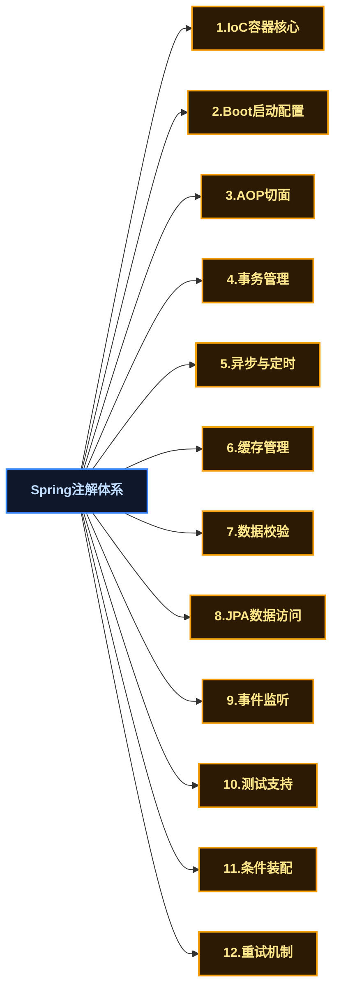
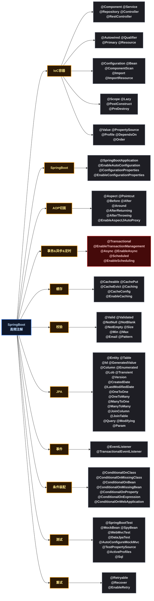

# Spring Boot企业开发高频注解完全指南：从IoC容器到数据访问全覆盖

## 🤔 一、为什么需要这份注解清单

初学 Spring Boot 时，打开官方文档会看到上百个注解。但实际企业开发中，真正高频使用的注解只有其中一部分。很多注解你可能工作三五年也用不到一次。

本文筛选出企业开发中**使用频率最高的 Spring 注解**（不含 SpringMVC 和 SpringSecurity），每个注解都配有可运行的示例代码和一句话说明它的用途。不解释底层原理，只告诉你"这是什么、怎么用、什么时候用"。

注解来源范围：**Spring Framework + Spring Boot + Spring Data JPA + Spring AOP + Spring Cache + Spring Scheduling + Spring Retry**。

> **约定**：下文所有示例均基于 Spring Boot 项目，包路径省略。示例中 `@Service`、`@Repository` 等注解未重复展示之处，默认已配合 `@ComponentScan` 自动扫描。

---

## 🗺️ 二、注解分类全景图

在实际进入每个注解之前，先用一张分类图建立全局认知：



---

## 📦 三、Spring IoC 容器核心注解

IoC（控制反转）和 DI（依赖注入）是 Spring 的根基。以下是日常开发中必用的注解。

### 🏷️ 3.1 组件声明注解

#### @Component

**作用**：将一个类标记为 Spring 管理的 Bean（组件），由 IoC 容器统一管理生命周期。

```java
@Component
public class SmsUtil {
    public void send(String phone, String message) {
        // 发送短信逻辑
    }
}
```

#### @Service

**作用**：`@Component` 的语义化特化，标记业务逻辑层组件。功能与 `@Component` 完全一致，只是增加了一层语义——告诉读代码的人"这是 Service 层"。

```java
@Service
public class OrderService {
    public Order createOrder(Long userId, List<OrderItem> items) {
        // 创建订单业务逻辑
        return new Order();
    }
}
```

#### @Repository

**作用**：`@Component` 的语义化特化，标记数据访问层组件（DAO）。额外功能：Spring 会将该层抛出的数据库相关异常自动翻译为 `DataAccessException`。

```java
@Repository
public class UserDao {
    @Autowired
    private JdbcTemplate jdbcTemplate;

    public User findById(Long id) {
        return jdbcTemplate.queryForObject(
            "SELECT * FROM t_user WHERE id = ?", User.class, id);
    }
}
```

#### @Controller

**作用**：`@Component` 的语义化特化，标记控制器层组件。是 SpringMVC 中 `@RestController` 的元注解。虽然本文不含 SpringMVC，但 `@Controller` 本身是组件注解，在非 Web 场景下也偶尔使用。

```java
@Controller
public class HealthController {
    // 可用于非REST场景，如视图渲染
}
```

> **补充说明**：实际开发中，Spring Boot 项目几乎都用 `@RestController` 替代 `@Controller`，纯 `@Controller` 在前后端分离架构中使用较少。

#### @RestController

**作用**：组合注解，等价于 `@Controller` + `@ResponseBody`。标记 RESTful 接口控制器，所有方法返回值自动序列化为 JSON。

```java
@RestController
@RequestMapping("/api/users")
public class UserController {

    @GetMapping("/{id}")
    public Result<User> getUser(@PathVariable Long id) {
        return Result.success(userService.getById(id));
    }
}
```

> **注意**：`@RestController` 本质是 `@Controller` 的组合注解，属于 SpringMVC 范畴，但因其在 Spring Boot 开发中使用频率极高，此处列出作为对照。

| 注解 | 层级定位 | 是否包含额外功能 |
|------|:---:|------|
| `@Component` | 通用组件 | 无 |
| `@Service` | 业务逻辑层 | 无，仅语义区分 |
| `@Repository` | 数据访问层 | 异常自动翻译 |
| `@Controller` / `@RestController` | Web 控制层 | `@ResponseBody` 自动序列化 |

### 💉 3.2 依赖注入注解

#### @Autowired

**作用**：Spring 最核心的注入注解。默认按类型（byType）从 IoC 容器中查找匹配的 Bean 并注入。

```java
@Service
public class OrderService {

    @Autowired                      // 按类型注入
    private UserService userService;

    @Autowired                      // 注入集合：注入所有类型匹配的Bean
    private List<PaymentStrategy> paymentStrategies;

    @Autowired                      // 注入Map：key=Bean名称, value=Bean实例
    private Map<String, PaymentStrategy> strategyMap;
}
```

#### @Qualifier

**作用**：配合 `@Autowired` 使用，当容器中存在多个同类型 Bean 时，按名称（beanName）精确指定注入哪一个。

```java
@Service
public class PaymentFacade {

    @Autowired
    @Qualifier("alipay")           // 指定注入名为"alipay"的Bean
    private PaymentStrategy paymentStrategy;
}

@Component("alipay")
class AlipayStrategy implements PaymentStrategy { }

@Component("wechat")
class WechatStrategy implements PaymentStrategy { }
```

#### @Primary

**作用**：标记一个 Bean 为"首选"。当 `@Autowired` 发现多个同类型 Bean 时，优先选择标注了 `@Primary` 的那个。与 `@Qualifier` 的区别：`@Primary` 是"默认选择"，`@Qualifier` 是"精确指定"，后者优先级更高。

```java
@Configuration
public class PaymentConfig {

    @Bean
    @Primary                       // 标记为首选
    public PaymentStrategy defaultPayment() {
        return new AlipayStrategy();
    }

    @Bean
    public PaymentStrategy wechatPayment() {
        return new WechatStrategy();
    }
}
```

#### @Resource

**作用**：JDK 原生注入注解（`javax.annotation.Resource`）。默认按名称（byName）注入，找不到名称匹配再回退到按类型（byType）。它可以替代 `@Autowired`，在不需要 Spring 特有功能时使用。

```java
@Service
public class UserService {

    @Resource(name = "userMapper") // 按名称注入，JDK原生注解
    private UserMapper userMapper;
}
```

| 特性 | `@Autowired` | `@Resource` |
|------|:---:|:---:|
| 来源 | Spring | JDK (`javax.annotation`) |
| 默认注入方式 | byType | byName |
| 是否必须存在 | `required` 参数控制（默认 true） | 默认必须存在 |
| 配合注解 | `@Qualifier` | `name` 属性 |

### ⚙️ 3.3 配置类注解

#### @Configuration

**作用**：标记一个类为配置类，等价于传统的 XML 配置文件。该类内部通常包含多个 `@Bean` 方法，Spring 会对其做 CGLIB 代理以确保 `@Bean` 方法的单例语义。

```java
@Configuration
public class AppConfig {

    @Bean
    public RestTemplate restTemplate() {
        return new RestTemplate();
    }

    @Bean
    public ObjectMapper objectMapper() {
        return new ObjectMapper()
            .setSerializationInclusion(JsonInclude.Include.NON_NULL);
    }
}
```

#### @Bean

**作用**：用在 `@Configuration` 类的方法上，将方法返回值注册为 Spring 容器中的 Bean。Bean 的名称默认是方法名，可通过 `name` 属性自定义。

```java
@Configuration
public class DataSourceConfig {

    @Bean(name = "primaryDataSource")     // 自定义Bean名称
    @Primary
    public DataSource dataSource() {
        HikariConfig config = new HikariConfig();
        config.setJdbcUrl("jdbc:mysql://localhost:3306/mall");
        config.setUsername("root");
        config.setPassword("123456");
        return new HikariDataSource(config);
    }
}
```

#### @ComponentScan

**作用**：指定 Spring 扫描组件的基础包路径。Spring Boot 项目中，`@SpringBootApplication` 已默认包含此注解，通常无需手动配置。但当你需要扫描非默认包路径下的组件时需要显式使用。

```java
@Configuration
@ComponentScan(basePackages = {
    "com.mallshop.mallbusiness",
    "com.mallshop.mallcommon"      // 扫描额外的包
})
public class AppConfig {
}
```

#### @Import

**作用**：将指定的类快速注册为 Spring Bean。常用于引入三方库中的配置类，或合并多个 `@Configuration` 类。

```java
@Configuration
@Import({RedisConfig.class, MqConfig.class})  // 合并其他配置
public class AppConfig {
}
```

#### @ImportResource

**作用**：导入传统的 Spring XML 配置文件。在遗留系统迁移或需要兼容老 XML 配置时使用。

```java
@Configuration
@ImportResource("classpath:spring-legacy.xml") // 兼容老XML配置
public class AppConfig {
}
```

### 🔄 3.4 作用域与生命周期注解

#### @Scope

**作用**：指定 Bean 的作用域（scope）。Spring 默认是**单例**（singleton），在特定场景下需要改为其他作用域。

```java
@Configuration
public class ScopeConfig {

    @Bean
    @Scope("prototype")            // 每次获取都创建新实例
    public OrderReportGenerator reportGenerator() {
        return new OrderReportGenerator();
    }

    @Bean
    @Scope(value = "request", proxyMode = ScopedProxyMode.TARGET_CLASS)
    // request作用域：每个HTTP请求一个实例（Web环境）
    public RequestContext requestContext() {
        return new RequestContext();
    }
}
```

常用作用域：

| 作用域值 | 含义 | 使用场景 |
|------|------|------|
| `singleton` | 整个容器中只有一个实例（默认） | 无状态服务、工具类、配置类 |
| `prototype` | 每次获取都创建新实例 | 有状态的业务对象、每次使用需要"干净"的实例 |
| `request` | 每个 HTTP 请求一个实例（仅 Web） | 请求级别的上下文数据 |
| `session` | 每个 HTTP Session 一个实例（仅 Web） | 用户会话级别的数据 |

#### @Lazy

**作用**：延迟 Bean 的初始化。默认情况下 Spring 容器启动时会立即创建所有单例 Bean，标注 `@Lazy` 后，该 Bean 仅在**第一次被使用时**才创建。

```java
@Service
@Lazy                            // 延迟初始化，首次使用时才创建
public class ReportService {
    public ReportService() {
        System.out.println("ReportService 被创建了");
    }
}
```

> **实际场景**：当某个 Bean 启动较慢，且并非每次启动都必须用到时，加上 `@Lazy` 可以加速应用启动。

#### @PostConstruct

**作用**：标记一个初始化方法。在 Bean 的依赖注入完成后、Bean 正式可用之前执行。常用于初始化资源、校验配置等操作。

```java
@Service
public class CacheWarmUpService {

    @Autowired
    private ProductDao productDao;

    @PostConstruct
    public void init() {
        // 依赖注入完成后执行：预热热门商品缓存
        List<Product> hotProducts = productDao.findHot(100);
        // 加载到Redis缓存...
        System.out.println("缓存预热完成，加载了 " + hotProducts.size() + " 条商品");
    }
}
```

#### @PreDestroy

**作用**：标记一个销毁方法。在 Bean 被容器销毁之前执行。常用于释放资源、关闭连接池、注销注册中心等清理操作。

```java
@Service
public class ScheduledTaskManager {

    private ScheduledExecutorService executor = Executors.newScheduledThreadPool(4);

    @PreDestroy
    public void cleanup() {
        // 容器销毁前：优雅关闭线程池
        executor.shutdown();
        System.out.println("定时任务线程池已关闭");
    }
}
```

### 📝 3.5 属性注入与配置注解

#### @Value

**作用**：将配置文件（`application.yml` / `application.properties`）中的值注入到字段中。支持 SpEL 表达式、默认值设置。

```java
@Component
public class OssConfig {

    @Value("${oss.endpoint}")
    private String endpoint;

    @Value("${oss.access-key}")
    private String accessKey;

    @Value("${oss.secret-key}")
    private String secretKey;

    @Value("${oss.max-size:10485760}")  // 带默认值：10MB
    private Long maxSize;

    @Value("#{${oss.region-map}}")       // SpEL：注入Map
    private Map<String, String> regionMap;
}
```

对应配置文件：

```yaml
oss:
  endpoint: https://oss-cn-hangzhou.aliyuncs.com
  access-key: LTAI5txxx
  secret-key: xxxxxxx
  region-map: "{'hangzhou': 'oss-cn-hangzhou', 'beijing': 'oss-cn-beijing'}"
```

#### @PropertySource

**作用**：引入额外的 `.properties` 配置文件。默认的 `application.yml` 之外，如果你有独立的配置文件（如三方 SDK 配置），用此注解引入。

```java
@Configuration
@PropertySource("classpath:wechat-sdk.properties")   // 加载额外配置
@PropertySource("classpath:alipay-sdk.properties")
public class ThirdPartyConfig {

    @Value("${wechat.app-id}")
    private String wechatAppId;

    @Value("${alipay.app-id}")
    private String alipayAppId;
}
```

### 🌍 3.6 条件与环境注解

#### @Profile

**作用**：指定 Bean 在哪个环境（profile）下生效。不同环境（dev / test / prod）可以加载不同的 Bean。

```java
@Configuration
public class EnvConfig {

    @Bean
    @Profile("dev")                // 仅在dev环境生效
    public SmsService devSmsService() {
        return new MockSmsService();    // 开发环境用Mock，不真发短信
    }

    @Bean
    @Profile("prod")               // 仅在prod环境生效
    public SmsService prodSmsService() {
        return new AliyunSmsService();  // 生产环境用阿里云短信
    }
}
```

激活方式：

```yaml
spring:
  profiles:
    active: dev
```

#### @DependsOn

**作用**：强制指定 Bean 的初始化顺序。标注此注解的 Bean 会在指定的 Bean 初始化**之后**才创建。

```java
@Service
@DependsOn("cacheInitializer")    // 确保cacheInitializer先初始化
public class CacheQueryService {
}

@Component("cacheInitializer")
class CacheInitializer {
    @PostConstruct
    public void init() {
        // 先加载缓存基础数据
    }
}
```

#### @Order

**作用**：指定 Bean 或组件的执行顺序。值越小优先级越高。常用于 `@EventListener` 监听器顺序、`Filter` 链顺序、`@Configuration` 类加载顺序等。

```java
@Configuration
@Order(1)                         // 数字越小优先级越高
public class DatabaseConfig {
}

@Configuration
@Order(2)
public class CacheConfig {
}
```

---

## 🚀 四、Spring Boot 核心注解

#### @SpringBootApplication

**作用**：Spring Boot 项目的总入口注解，是一个组合注解。等价于同时使用以下三个注解：
- `@SpringBootConfiguration`（标记配置类）
- `@EnableAutoConfiguration`（开启自动配置）
- `@ComponentScan`（组件扫描）

```java
@SpringBootApplication
public class MallApplication {
    public static void main(String[] args) {
        SpringApplication.run(MallApplication.class, args);
    }
}
```

#### @EnableAutoConfiguration

**作用**：开启 Spring Boot 的自动配置机制。Spring Boot 会根据 classpath 中的 jar 依赖自动配置相关组件（如 DataSource、Redis、RabbitMQ 等）。它是 `@SpringBootApplication` 的子注解，通常不需要单独使用。

```java
@Configuration
@EnableAutoConfiguration(exclude = {
    DataSourceAutoConfiguration.class   // 排除你不想要的自动配置
})
public class CustomAutoConfig {
}
```

---

## 🔗 五、配置属性绑定注解

#### @ConfigurationProperties

**作用**：将配置文件中的一组属性批量映射到 Java 对象中。相比 `@Value` 逐字段注入，`@ConfigurationProperties` 更适用于一组相关配置。

```java
@Component
@ConfigurationProperties(prefix = "mall.thread-pool")
public class ThreadPoolProperties {

    private Integer coreSize = 10;   // 可设默认值
    private Integer maxSize = 50;
    private Integer queueCapacity = 200;
    private String namePrefix = "mall-exec-";

    // getter / setter 必须存在
    public Integer getCoreSize() { return coreSize; }
    public void setCoreSize(Integer coreSize) { this.coreSize = coreSize; }
    // ... 其他getter/setter
}
```

对应配置文件：

```yaml
mall:
  thread-pool:
    core-size: 20
    max-size: 100
    queue-capacity: 500
    name-prefix: "biz-exec-"
```

#### @EnableConfigurationProperties

**作用**：显式启用某个 `@ConfigurationProperties` 类。当该类没有被 `@Component` 标注时（即不是 Spring Bean），用此注解让它生效。

```java
@Configuration
@EnableConfigurationProperties(ThreadPoolProperties.class) // 激活配置绑定
public class ThreadPoolConfig {

    @Bean
    public ThreadPoolExecutor bizExecutor(ThreadPoolProperties props) {
        return new ThreadPoolExecutor(
            props.getCoreSize(),
            props.getMaxSize(),
            60L, TimeUnit.SECONDS,
            new LinkedBlockingQueue<>(props.getQueueCapacity()),
            new ThreadFactoryBuilder().setNamePrefix(props.getNamePrefix()).build()
        );
    }
}
```

---

## 🔪 六、Spring AOP 注解

AOP（面向切面编程）用于将横切关注点（日志、权限、缓存）与业务逻辑分离。以下是 AOP 场景下最常用的注解。

#### @Aspect

**作用**：标记一个类为切面类。该类中可以定义多个通知（Advice）和切点（Pointcut）。

#### @Pointcut

**作用**：定义一个切点表达式。后续的通知方法可以复用这个切点，避免重复写表达式。

#### @Before / @After / @Around / @AfterReturning / @AfterThrowing

**作用**：五种通知类型，分别在不同时机执行增强逻辑。

```java
@Aspect
@Component
public class LoggingAspect {

    // 切点：匹配service包下所有类的所有方法
    @Pointcut("execution(* com.mallshop.mallbusiness.service..*.*(..))")
    public void serviceLayer() {
    }

    @Before("serviceLayer()")
    public void logBefore(JoinPoint joinPoint) {
        String method = joinPoint.getSignature().toShortString();
        Object[] args = joinPoint.getArgs();
        System.out.println(">>> 调用前：" + method + " 参数=" + Arrays.toString(args));
    }

    @AfterReturning(value = "serviceLayer()", returning = "result")
    public void logAfterReturning(JoinPoint joinPoint, Object result) {
        String method = joinPoint.getSignature().toShortString();
        System.out.println("<<< 调用成功：" + method + " 返回值=" + result);
    }

    @AfterThrowing(value = "serviceLayer()", throwing = "ex")
    public void logAfterThrowing(JoinPoint joinPoint, Exception ex) {
        String method = joinPoint.getSignature().toShortString();
        System.out.println("!!! 调用异常：" + method + " 异常=" + ex.getMessage());
    }

    @Around("serviceLayer()")
    public Object logAround(ProceedingJoinPoint joinPoint) throws Throwable {
        long start = System.currentTimeMillis();
        Object result = joinPoint.proceed();    // 执行目标方法
        long elapsed = System.currentTimeMillis() - start;
        System.out.println("方法耗时：" + elapsed + "ms");
        return result;
    }
}
```

> **实际使用频率**：`@Around` > `@Before`，`@AfterThrowing`。`@After` 和 `@AfterReturning` 使用较少。

#### @EnableAspectJAutoProxy

**作用**：开启对 `@Aspect` 注解的支持。Spring Boot 中 `@SpringBootApplication` 通过自动配置默认开启，通常无需手动添加。仅在纯 Spring（非 Boot）项目中需要显式使用。

```java
@Configuration
@EnableAspectJAutoProxy           // 显式开启AOP代理
public class AopConfig {
}
```

五种通知类型对比：

| 通知类型 | 执行时机 | 能否阻止目标方法执行 | 能否修改返回值 |
|------|:---:|:---:|:---:|
| `@Before` | 目标方法执行前 | 否（抛出异常可阻止） | 否 |
| `@AfterReturning` | 目标方法正常返回后 | 否 | 可读取，不可修改 |
| `@AfterThrowing` | 目标方法抛出异常后 | 否 | 否 |
| `@After` | 目标方法结束后（相当于 finally） | 否 | 否 |
| `@Around` | 环绕（前后都可控制） | 是 | 可读取并可替换 |

---

## 🔄 七、事务管理注解

#### @Transactional

**作用**：声明式事务注解。标注在类或方法上，表示该方法内的数据库操作在一个事务中执行。这是企业开发中**使用频率最高的注解之一**。

```java
@Service
public class OrderService {

    @Autowired
    private OrderDao orderDao;
    @Autowired
    private StockService stockService;

    @Transactional(rollbackFor = Exception.class)  // 任何异常都回滚
    public void createOrder(OrderCreateReq req) {
        // 这两步操作在同一个事务中
        orderDao.insertOrder(req.getOrder());
        stockService.deductStock(req.getSkuId(), req.getQuantity());
    }

    @Transactional(readOnly = true)                // 只读事务（性能优化）
    public Order queryOrder(Long orderId) {
        return orderDao.findById(orderId);
    }

    @Transactional(
        propagation = Propagation.REQUIRES_NEW,   // 挂起当前事务，开启新事务
        isolation = Isolation.READ_COMMITTED,     // 读已提交隔离级别
        timeout = 30                              // 超时30秒
    )
    public void createPaymentRecord(Payment payment) {
        paymentDao.insert(payment);
    }
}
```

常用属性：

| 属性 | 含义 | 常用值 |
|------|------|------|
| `rollbackFor` | 指定哪些异常触发回滚 | `Exception.class`（推荐，业务异常也回滚） |
| `propagation` | 事务传播行为 | `REQUIRED`（默认）、`REQUIRES_NEW` |
| `isolation` | 事务隔离级别 | `READ_COMMITTED`（最常见） |
| `readOnly` | 只读事务 | `true` / `false`（默认） |
| `timeout` | 事务超时时间（秒） | 正整数 |

#### @EnableTransactionManagement

**作用**：开启声明式事务支持。Spring Boot 中此注解已通过自动配置默认开启，通常不需要手动添加。仅在纯 Spring 项目中显式使用。

```java
@Configuration
@EnableTransactionManagement
public class TxConfig {
}
```

---

## ⏰ 八、异步与定时任务注解

#### @Async

**作用**：标记一个方法为异步执行。调用该方法时，调用方不会等待方法执行完成，而是立即返回。实际执行由线程池中的线程处理。

```java
@Service
public class NotificationService {

    @Async
    public void sendRegisterEmail(String email) {
        // 这个方法会在独立的线程中执行
        // 调用方不会等待
        System.out.println(Thread.currentThread().getName() + " 正在发送邮件...");
        try { Thread.sleep(3000); } catch (InterruptedException e) { }
        System.out.println("邮件发送完成：" + email);
    }
}
```

#### @EnableAsync

**作用**：开启异步方法支持。**必须添加**，否则 `@Async` 不会生效。

```java
@Configuration
@EnableAsync
public class AsyncConfig implements AsyncConfigurer {

    @Override
    public Executor getAsyncExecutor() {
        ThreadPoolTaskExecutor executor = new ThreadPoolTaskExecutor();
        executor.setCorePoolSize(10);
        executor.setMaxPoolSize(50);
        executor.setQueueCapacity(200);
        executor.setThreadNamePrefix("async-");
        executor.initialize();
        return executor;
    }

    @Override
    public AsyncUncaughtExceptionHandler getAsyncUncaughtExceptionHandler() {
        return (ex, method, params) ->
            System.err.println("异步方法异常：" + method.getName() + " " + ex.getMessage());
    }
}
```

> **常见错误**：忘记添加 `@EnableAsync`，导致 `@Async` 方法仍是同步执行，这是新手最容易踩的坑之一。

#### @Scheduled

**作用**：标记定时任务方法。支持 `cron` 表达式、固定间隔（`fixedRate`）、固定延迟（`fixedDelay`）。

```java
@Component
public class ScheduledTasks {

    @Scheduled(cron = "0 0 3 * * ?")         // 每天凌晨3:00执行
    public void dailyReport() {
        System.out.println("生成每日报表...");
    }

    @Scheduled(fixedRate = 60000)            // 每60秒执行一次（以上次开始时间计）
    public void checkOrderTimeout() {
        System.out.println("检查超时未支付订单...");
    }

    @Scheduled(fixedDelay = 30000)           // 上次执行结束后30秒再执行
    public void cleanExpiredSession() {
        System.out.println("清理过期会话...");
    }
}
```

| 属性 | 含义 | 示例 |
|------|------|------|
| `cron` | Cron 表达式（精确到秒） | `"0 0/5 * * * ?"`（每 5 分钟） |
| `fixedRate` | 固定频率（ms），从任务**开始**计时 | `fixedRate = 60000` |
| `fixedDelay` | 固定延迟（ms），从上次**结束**计时 | `fixedDelay = 30000` |
| `initialDelay` | 首次执行延迟（ms） | `initialDelay = 10000` |

#### @EnableScheduling

**作用**：开启定时任务支持。**必须添加**，否则 `@Scheduled` 不会生效。

```java
@Configuration
@EnableScheduling
public class ScheduleConfig {
}
```

---

## 💾 九、缓存注解

Spring Cache 抽象层提供了一套注解，底层可对接 Redis、Caffeine、Ehcache 等缓存实现。

#### @Cacheable

**作用**：缓存方法的结果。执行前先查缓存，命中则直接返回缓存值，不执行方法体；未命中则执行方法，并将返回值存入缓存。

```java
@Service
public class ProductService {

    @Cacheable(
        value = "product",               // 缓存名称（类似命名空间）
        key = "#productId",              // SpEL：缓存的key
        unless = "#result == null"       // 结果为null时不缓存
    )
    public Product getById(Long productId) {
        // 第一次调用走数据库，后续从缓存取
        return productDao.findById(productId);
    }

    @Cacheable(
        value = "product-list",
        key = "'category:' + #categoryId + ':page:' + #page",
        condition = "#page <= 10"        // 仅缓存前10页
    )
    public List<Product> listByCategory(Long categoryId, int page) {
        return productDao.findByCategory(categoryId, page);
    }
}
```

#### @CachePut

**作用**：**始终执行方法体**，并将返回值更新到缓存中。用于更新操作——既要把数据写入数据库，也要同步更新缓存。

```java
@Service
public class ProductService {

    @CachePut(value = "product", key = "#product.id")
    public Product update(Product product) {
        productDao.update(product);
        return product;                  // 返回值会更新缓存
    }
}
```

#### @CacheEvict

**作用**：清除缓存。用于删除操作——数据库中的数据删了，缓存也要同步清除。

```java
@Service
public class ProductService {

    @CacheEvict(value = "product", key = "#productId")
    public void delete(Long productId) {
        productDao.deleteById(productId);
    }

    @CacheEvict(value = {"product", "product-list"}, allEntries = true)
    public void clearAllCache() {
        // 清空所有product相关缓存
    }
}
```

#### @Caching

**作用**：组合多个缓存操作。当一个方法需要同时执行多种缓存行为时使用。

```java
@Service
public class ProductService {

    @Caching(
        cacheable = {
            @Cacheable(value = "product", key = "#productId")
        },
        put = {
            @CachePut(value = "product-detail", key = "#result.skuCode")
        },
        evict = {
            @CacheEvict(value = "product-hot", allEntries = true)
        }
    )
    public Product getProductFullInfo(Long productId) {
        return productDao.findFullInfo(productId);
    }
}
```

#### @CacheConfig

**作用**：标注在类上，为当前类中的所有缓存注解统一设置公共属性（如 `cacheNames`），避免每个方法重复写。

```java
@Service
@CacheConfig(cacheNames = "product")     // 统一指定缓存名称
public class ProductCacheService {

    @Cacheable(key = "#productId")       // 无需再写cacheNames
    public Product getById(Long productId) {
        return productDao.findById(productId);
    }

    @CacheEvict(key = "#productId")
    public void evict(Long productId) {
    }
}
```

#### @EnableCaching

**作用**：开启缓存注解支持。**必须添加**。

```java
@Configuration
@EnableCaching
public class CacheConfig {
}
```

缓存注解决策表：

| 操作场景 | 使用注解 | 是否执行方法体 | 缓存行为 |
|------|:---:|:---:|------|
| 查询 | `@Cacheable` | 缓存命中时不执行 | 查不到则存入 |
| 更新 | `@CachePut` | 始终执行 | 执行后更新缓存 |
| 删除 | `@CacheEvict` | 始终执行 | 执行后清除缓存 |
| 复杂组合 | `@Caching` | 视组合而定 | 多操作组合 |

---

## ✅ 十、数据校验注解

Spring 集成了 Jakarta Bean Validation（`jakarta.validation`），用于参数校验。这些注解常配合 `@Valid` / `@Validated` 使用。

#### @Valid / @Validated

**作用**：触发参数校验。`@Valid` 是 Jakarta 标准注解，`@Validated` 是 Spring 的增强版本（支持分组校验）。

```java
@RestController
@RequestMapping("/api/users")
@Validated                        // 类级别：使方法参数校验生效
public class UserController {

    @PostMapping
    public Result createUser(@Valid @RequestBody UserCreateReq req) {
        // @Valid触发对req的校验
        userService.create(req);
        return Result.success();
    }

    @GetMapping
    public Result list(@Valid @PageableDefault Pageable pageable) {
        return Result.success(userService.list(pageable));
    }
}
```

常用校验注解速查：

| 注解 | 校验规则 | 示例 |
|------|------|------|
| `@NotNull` | 不能为 null | `@NotNull Long id` |
| `@NotBlank` | 不能为 null、空字符串、纯空格 | `@NotBlank String name` |
| `@NotEmpty` | 不能为 null 或空集合/空字符串 | `@NotEmpty List<Long> ids` |
| `@Size(min, max)` | 字符串/集合长度范围 | `@Size(min=1, max=50) String username` |
| `@Min` / `@Max` | 数值最小/最大值 | `@Min(0) @Max(150) Integer age` |
| `@Email` | 邮箱格式 | `@Email String email` |
| `@Pattern` | 正则匹配 | `@Pattern(regexp="^1[3-9]\\d{9}$") String phone` |
| `@Digits` | 数字精度 | `@Digits(integer=10, fraction=2) BigDecimal price` |
| `@Positive` / `@Negative` | 正数 / 负数 | `@Positive BigDecimal amount` |
| `@Past` / `@Future` | 过去 / 未来时间 | `@Past LocalDate birthday` |

实体类示例：

```java
public class UserCreateReq {

    @NotBlank(message = "用户名不能为空")
    @Size(min = 2, max = 20, message = "用户名长度2 ~ 20位")
    private String username;

    @NotBlank(message = "密码不能为空")
    @Size(min = 6, max = 32, message = "密码长度6 ~ 32位")
    private String password;

    @NotBlank(message = "手机号不能为空")
    @Pattern(regexp = "^1[3-9]\\d{9}$", message = "手机号格式错误")
    private String phone;

    @Email(message = "邮箱格式错误")
    private String email;

    @Min(value = 0, message = "年龄不能为负数")
    @Max(value = 150, message = "年龄不能超过150")
    private Integer age;
}
```

---

## 🗄️ 十一、Spring Data JPA 高频注解

Spring Data JPA 是 Spring Boot 中访问数据库的主流方案之一。以下列出企业开发中真正高频使用的 JPA 注解。

### 🏷️ 11.1 实体映射注解

```java
@Entity
@Table(name = "t_user")                  // 映射到数据库表名
public class User {

    @Id
    @GeneratedValue(strategy = GenerationType.IDENTITY) // 主键自增
    private Long id;

    @Column(name = "username", length = 50, nullable = false, unique = true)
    private String username;

    @Column(name = "real_name", length = 20)
    private String realName;

    @Column(name = "age")
    private Integer age;

    @Enumerated(EnumType.STRING)          // 枚举存为字符串
    @Column(name = "status")
    private UserStatus status;

    @Lob                                    // 大文本
    @Column(name = "remark")
    private String remark;

    @Version                                // 乐观锁版本号
    private Integer version;

    @CreatedDate                            // 自动设置创建时间（需配合@EnableJpaAuditing）
    private LocalDateTime createTime;

    @LastModifiedDate                       // 自动设置更新时间
    private LocalDateTime updateTime;

    @Transient                              // 不映射到数据库
    private String extraInfo;

    // getter / setter 省略
}
```

### 📋 11.2 实体映射注解速查

| 注解 | 作用 | 高频属性 |
|------|------|------|
| `@Entity` | 标记 JPA 实体类 | - |
| `@Table` | 指定映射的数据库表名 | `name`、`indexes`、`uniqueConstraints` |
| `@Id` | 标记主键字段 | - |
| `@GeneratedValue` | 主键生成策略 | `strategy`：`IDENTITY`（自增）/ `SEQUENCE`（序列）/ `UUID` |
| `@Column` | 字段-列映射细节 | `name`、`length`、`nullable`、`unique`、`columnDefinition` |
| `@Enumerated` | 枚举映射方式 | `EnumType.STRING`（推荐） / `ORDINAL` |
| `@Lob` | 大对象（CLOB/BLOB） | - |
| `@Transient` | 该字段不持久化 | - |
| `@Version` | 乐观锁版本字段 | - |
| `@CreatedDate` | 自动填充创建时间（需审计支持） | - |
| `@LastModifiedDate` | 自动填充更新时间（需审计支持） | - |

### 🔗 11.3 关联关系注解

```java
@Entity
@Table(name = "t_order")
public class Order {

    @Id
    @GeneratedValue(strategy = GenerationType.IDENTITY)
    private Long id;

    // 多对一：多个订单属于一个用户
    @ManyToOne(fetch = FetchType.LAZY)
    @JoinColumn(name = "user_id", foreignKey = @ForeignKey(ConstraintMode.NO_CONSTRAINT))
    private User user;

    // 一对多：一个订单有多个订单明细
    @OneToMany(mappedBy = "order", cascade = CascadeType.ALL, orphanRemoval = true)
    private List<OrderItem> items = new ArrayList<>();
}

@Entity
@Table(name = "t_order_item")
public class OrderItem {

    @Id
    @GeneratedValue(strategy = GenerationType.IDENTITY)
    private Long id;

    @ManyToOne(fetch = FetchType.LAZY)
    @JoinColumn(name = "order_id")
    private Order order;

    // 一对一：一个订单明细对应一个商品SKU
    @OneToOne(fetch = FetchType.LAZY)
    @JoinColumn(name = "sku_id")
    private Sku sku;
}

@Entity
@Table(name = "t_role")
public class Role {

    @Id
    @GeneratedValue(strategy = GenerationType.IDENTITY)
    private Long id;

    // 多对多：一个用户可以有多个角色
    @ManyToMany
    @JoinTable(
        name = "t_user_role",
        joinColumns = @JoinColumn(name = "role_id"),
        inverseJoinColumns = @JoinColumn(name = "user_id")
    )
    private List<User> users;
}
```

关联注解速查：

| 注解 | 含义 | 关键属性 |
|------|------|------|
| `@OneToOne` | 一对一 | `fetch`、`cascade`、`mappedBy`、`orphanRemoval` |
| `@OneToMany` | 一对多 | `mappedBy`、`cascade`、`orphanRemoval`、`fetch` |
| `@ManyToOne` | 多对一 | `fetch`（默认 EAGER，**建议改为 LAZY**）、`cascade` |
| `@ManyToMany` | 多对多 | `mappedBy`、`cascade`、`fetch` |
| `@JoinColumn` | 指定外键列名 | `name`、`referencedColumnName` |
| `@JoinTable` | 指定中间表（多对多） | `name`、`joinColumns`、`inverseJoinColumns` |

> **关键提醒**：`@ManyToOne` 和 `@OneToOne` 默认 `fetch = FetchType.EAGER`（饥汉加载），**一定要显式改为 `LAZY`**，否则会引发 N+1 查询问题。

### 🔍 11.4 Repository 查询注解

```java
public interface UserRepository extends JpaRepository<User, Long> {

    // 方法命名自动解析为SQL
    List<User> findByUsernameLike(String username);

    // JPQL自定义查询
    @Query("SELECT u FROM User u WHERE u.status = :status AND u.age > :minAge")
    List<User> findActiveUsers(@Param("status") UserStatus status,
                               @Param("minAge") Integer minAge);

    // 原生SQL
    @Query(value = "SELECT * FROM t_user WHERE age > ?1 LIMIT ?2",
           nativeQuery = true)
    List<User> findTopByAge(Integer age, int limit);

    // 更新/删除操作必须加@Modifying
    @Modifying
    @Query("UPDATE User u SET u.status = :status WHERE u.id IN :ids")
    int batchUpdateStatus(@Param("status") UserStatus status,
                          @Param("ids") List<Long> ids);
}
```

| 注解 | 作用 |
|------|------|
| `@Query` | 自定义 JPQL 或原生 SQL 查询 |
| `@Modifying` | 标注 UPDATE / DELETE 操作（必须与 `@Query` 配合） |
| `@Param` | 命名参数绑定（绑在方法参数上） |
| `@Transactional` | 标注在 Repository 上，`@Modifying` 操作必须配合事务 |

---

## 👂 十二、事件监听注解

Spring 的事件机制用于组件间解耦通信。例如：用户注册成功后发送邮件、发放积分、记录日志——这些后续操作可以通过事件机制与注册主流程分离。

#### @EventListener

**作用**：标记一个方法为事件监听器。当有匹配类型的事件发布时自动触发。

```java
// 1. 定义事件
public class UserRegisterEvent extends ApplicationEvent {
    private final Long userId;
    public UserRegisterEvent(Object source, Long userId) {
        super(source);
        this.userId = userId;
    }
    public Long getUserId() { return userId; }
}

// 2. 发布事件
@Service
public class UserService {

    @Autowired
    private ApplicationEventPublisher publisher;

    @Transactional
    public void register(UserCreateReq req) {
        User user = userDao.save(req.toUser());
        publisher.publishEvent(new UserRegisterEvent(this, user.getId()));
        // 发布事件后立即返回，监听器异步执行
    }
}

// 3. 监听事件
@Component
public class UserEventListener {

    @EventListener
    public void handleRegister(UserRegisterEvent event) {
        System.out.println("用户注册成功，发送欢迎邮件：" + event.getUserId());
    }
}
```

#### @TransactionalEventListener

**作用**：事务事件监听器。与 `@EventListener` 的区别是：它会在**事务提交后**才执行。如果事务回滚，事件不会被处理。

```java
@Component
public class UserEventListener {

    @TransactionalEventListener(
        phase = TransactionPhase.AFTER_COMMIT,      // 事务提交后执行
        fallbackExecution = true                     // 无事务时也执行
    )
    public void afterRegister(UserRegisterEvent event) {
        // 只有事务提交成功后才执行
        // 如果注册失败回滚了，这里的逻辑不会触发
        sendWelcomeEmail(event.getUserId());
    }
}
```

| 特性 | `@EventListener` | `@TransactionalEventListener` |
|------|:---:|:---:|
| 执行时机 | 事件发布后立即执行 | 事务提交后执行（默认 AFTER_COMMIT） |
| 事务回滚 | 不影响（已经执行了） | 不执行（受事务保护） |
| 适用场景 | 非事务操作、日志记录 | 数据库操作后的事务后续处理 |
| 是否默认异步 | 否（同步执行） | 否（同步执行），可配合 `@Async` |

---

## 🎛️ 十三、条件装配注解（Spring Boot）

条件装配是 Spring Boot 自动配置的核心机制。这些注解在日常开发中用于"满足某条件才创建 Bean"的场景。

#### @ConditionalOnClass / @ConditionalOnMissingClass

**作用**：根据 classpath 中是否存在某个类来决定是否创建 Bean。

```java
@Configuration
public class StorageConfig {

    @Bean
    @ConditionalOnClass(name = "com.aliyun.oss.OSS")  // 有阿里云OSS依赖才创建
    public StorageService aliyunStorage() {
        return new AliyunOssStorageService();
    }

    @Bean
    @ConditionalOnMissingClass("com.aliyun.oss.OSS")  // 没有OSS依赖时创建
    public StorageService localStorage() {
        return new LocalFileStorageService();
    }
}
```

#### @ConditionalOnBean / @ConditionalOnMissingBean

**作用**：根据容器中是否存在某个类型的 Bean 来决定是否创建。

```java
@Configuration
public class CacheConfig {

    @Bean
    @ConditionalOnMissingBean(CacheManager.class)  // 用户没自定义时才自动配置
    public CacheManager defaultCacheManager() {
        return new ConcurrentMapCacheManager();
    }
}

@Configuration
@ConditionalOnBean(DataSource.class)              // 有数据源时才创建JdbcTemplate
public class JdbcConfig {

    @Bean
    public JdbcTemplate jdbcTemplate(DataSource ds) {
        return new JdbcTemplate(ds);
    }
}
```

#### @ConditionalOnProperty

**作用**：根据配置文件中的某个属性值决定是否创建 Bean。**最常用的条件注解**。

```java
@Configuration
public class FeatureFlagConfig {

    @Bean
    @ConditionalOnProperty(
        name = "mall.feature.sms.enabled",   // 配置项名称
        havingValue = "true",                // 期望的值
        matchIfMissing = false               // 配置项不存在时：不创建
    )
    public SmsService smsService() {
        return new AliyunSmsService();
    }
}
```

配置文件：

```yaml
mall:
  feature:
    sms:
      enabled: true         # 控制短信服务是否启用
```

> **典型场景**：功能开关（Feature Flag）、灰度发布、多环境差异化配置。

#### @ConditionalOnExpression

**作用**：根据 SpEL 表达式的结果决定是否创建 Bean。比 `@ConditionalOnProperty` 更灵活，支持复杂逻辑。

```java
@Configuration
public class MqConfig {

    @Bean
    @ConditionalOnExpression(
        "'${mall.env}' == 'prod' and ${mall.mq.enabled:false}"
    )
    public MessageQueueService rocketMqService() {
        return new RocketMqService();
    }
}
```

#### @ConditionalOnWebApplication / @ConditionalOnNotWebApplication

**作用**：根据当前应用是否为 Web 应用来决定是否生效。

```java
@Configuration
@ConditionalOnWebApplication               // 仅在Web应用中生效
public class WebOnlyConfig {
    // 配置拦截器等Web专有组件
}

@Configuration
@ConditionalOnNotWebApplication            // 仅在非Web应用中生效
public class NonWebConfig {
    // 批处理任务、命令行工具等
}
```

条件注解速查表：

| 注解 | 判断依据 | 使用频率 |
|------|------|:---:|
| `@ConditionalOnClass` | classpath 中是否有某个类 | 高 |
| `@ConditionalOnMissingClass` | classpath 中是否没有某个类 | 中 |
| `@ConditionalOnBean` | 容器中是否已有某个 Bean | 高 |
| `@ConditionalOnMissingBean` | 容器中是否没有某个 Bean | 高 |
| `@ConditionalOnProperty` | 配置文件中的属性值 | **极高** |
| `@ConditionalOnExpression` | SpEL 表达式结果 | 中 |
| `@ConditionalOnWebApplication` | 是否为 Web 应用 | 中 |
| `@ConditionalOnNotWebApplication` | 是否非 Web 应用 | 低 |
| `@ConditionalOnJava` | Java 版本是否满足 | 低 |
| `@ConditionalOnResource` | classpath 中是否有某个资源文件 | 低 |

---

## 🔁 十四、Spring Retry 注解

Spring Retry（`spring-retry`）提供声明式重试能力。需要额外引入依赖：

```xml
<dependency>
    <groupId>org.springframework.retry</groupId>
    <artifactId>spring-retry</artifactId>
</dependency>
```

#### @Retryable

**作用**：标记一个方法在抛出指定异常时自动重试。常用于网络调用、远程接口等不稳定操作的容错处理。

```java
@Service
public class RemotePaymentService {

    @Retryable(
        value = {HttpServerErrorException.class, TimeoutException.class},
        maxAttempts = 3,                              // 最多重试3次
        backoff = @Backoff(delay = 2000, multiplier = 2) // 重试间隔2秒，每次翻倍
    )
    public PaymentResult callRemotePay(PaymentRequest request) {
        // 调用第三方支付接口（可能超时或服务异常）
        return restTemplate.postForObject(
            "https://api.pay.com/v1/pay", request, PaymentResult.class);
    }
}
```

#### @Recover

**作用**：重试全部失败后的降级处理（fallback）。标注的方法参数列表必须与 `@Retryable` 方法一致，且多一个异常参数。

```java
@Service
public class RemotePaymentService {

    @Retryable(
        value = {HttpServerErrorException.class, TimeoutException.class},
        maxAttempts = 3,
        backoff = @Backoff(delay = 2000, multiplier = 2)
    )
    public PaymentResult callRemotePay(PaymentRequest request) {
        return restTemplate.postForObject(
            "https://api.pay.com/v1/pay", request, PaymentResult.class);
    }

    @Recover
    public PaymentResult recover(HttpServerErrorException ex,
                                  PaymentRequest request) {
        // 重试3次都失败后走降级：记录异常信息，返回降级结果
        System.err.println("支付接口调用失败，进入降级处理：" + ex.getMessage());
        return PaymentResult.fail("支付服务暂时不可用，请稍后重试");
    }
}
```

#### @EnableRetry

**作用**：开启重试功能。**必须添加**才能生效。

```java
@Configuration
@EnableRetry
public class RetryConfig {
}
```

---

## 🧪 十五、测试注解

Spring Boot 提供了丰富的测试注解，用于集成测试和单元测试。

#### @SpringBootTest

**作用**：启动完整的 Spring Boot 上下文进行集成测试。默认不启动 Web 服务器。

```java
@SpringBootTest
class OrderServiceTest {

    @Autowired
    private OrderService orderService;

    @Test
    void testCreateOrder() {
        Order order = orderService.createOrder(1L, List.of(
            new OrderItem(1001L, 2)
        ));
        assertNotNull(order.getId());
    }
}
```

#### @MockBean

**作用**：在 Spring 容器中用 Mockito Mock 替换一个真实的 Bean。用于隔离测试目标，模拟外部依赖。

#### @SpyBean

**作用**：与 `@MockBean` 类似，但创建的是 Spy（部分 Mock），即**默认走真实方法，仅指定的行为才被 Mock**。

```java
@SpringBootTest
class OrderServiceTest {

    @MockBean                        // 替换为Mock，所有方法调用都返回默认值
    private StockService stockService;

    @SpyBean                         // 替换为Spy，不指定stub时走真实方法
    private PriceService priceService;

    @Autowired
    private OrderService orderService;

    @Test
    void testCreateOrder() {
        when(stockService.deduct(anyLong(), anyInt())).thenReturn(true);
        doReturn(BigDecimal.TEN).when(priceService).getPrice(anyLong());

        Order order = orderService.createOrder(1L, List.of(
            new OrderItem(1001L, 1)
        ));
        assertNotNull(order);
    }
}
```

| 注解 | 行为 | 使用场景 |
|------|------|------|
| `@MockBean` | 完全 Mock，所有方法默认返回 null / 0 / false | 替换外部服务、数据库操作等需要完全隔离的依赖 |
| `@SpyBean` | 部分 Mock，不指定 stub 时走真实逻辑 | 需要保留部分真实行为的测试 |

#### @WebMvcTest

**作用**：仅加载 Web 层的 Controller 及相关 Bean，不加载 Service 和 Repository。用于 Controller 层的轻量测试。

```java
@WebMvcTest(UserController.class)
class UserControllerTest {

    @Autowired
    private MockMvc mockMvc;

    @MockBean
    private UserService userService;    // Service层用Mock隔离

    @Test
    void testGetUser() throws Exception {
        when(userService.getById(1L)).thenReturn(new User(1L, "张三"));

        mockMvc.perform(get("/api/users/1"))
               .andExpect(status().isOk())
               .andExpect(jsonPath("$.username").value("张三"));
    }
}
```

#### @DataJpaTest

**作用**：仅加载 JPA 相关的 Bean（EntityManager、DataSource 等），用于 Repository 层的轻量测试。默认使用内嵌数据库。

```java
@DataJpaTest
class UserRepositoryTest {

    @Autowired
    private UserRepository userRepository;

    @Test
    void testFindByUsername() {
        userRepository.save(new User("张三", "zhangsan@test.com"));
        Optional<User> user = userRepository.findByUsername("张三");
        assertTrue(user.isPresent());
    }
}
```

#### @AutoConfigureMockMvc / @AutoConfigureTestDatabase

**作用**：`@AutoConfigureMockMvc` 自动配置 MockMvc；`@AutoConfigureTestDatabase` 控制是否用内嵌数据库替换真实数据源。

```java
@SpringBootTest
@AutoConfigureMockMvc
class FullIntegrationTest {

    @Autowired
    private MockMvc mockMvc;

    @Test
    @Sql("/sql/init-test-data.sql")        // 测试前执行初始化SQL
    @Sql(scripts = "/sql/cleanup.sql",
         executionPhase = Sql.ExecutionPhase.AFTER_TEST_METHOD)
    void testFullFlow() throws Exception {
        mockMvc.perform(post("/api/orders")
               .contentType(MediaType.APPLICATION_JSON)
               .content("{\"userId\":1,\"items\":[{\"skuId\":1001,\"qty\":2}]}"))
               .andExpect(status().isOk());
    }
}
```

#### @TestPropertySource / @ActiveProfiles

**作用**：测试时指定专用的配置文件或激活的 Profile。

```java
@SpringBootTest
@TestPropertySource(properties = {
    "mall.payment.gateway=mock",      // 测试时使用Mock支付网关
    "mall.sms.enabled=false"          // 测试时关闭短信
})
@ActiveProfiles("test")               // 激活test profile
class OrderServiceTest {
}
```

#### @DirtiesContext

**作用**：标记该测试会"污染" Spring 上下文，执行后需要重新创建上下文。通常用于修改了共享状态的测试。

```java
@SpringBootTest
class SingletonStateTest {

    @Autowired
    private SomeStatefulSingleton singleton;

    @Test
    @DirtiesContext                    // 该测试修改了单例状态，其他测试需要干净上下文
    void testModifyGlobalState() {
        singleton.setValue("dirty");
    }
}
```

#### @Sql

**作用**：在测试方法执行前/后执行指定的 SQL 脚本，用于初始化或清理测试数据。

```java
@SpringBootTest
@AutoConfigureMockMvc
class UserIntegrationTest {

    @Test
    @Sql("/sql/init-user.sql")                            // 测试前插入测试数据
    void testQueryUser() { /* ... */ }

    @Test
    @Sql(scripts = "/sql/cleanup.sql",
         executionPhase = Sql.ExecutionPhase.AFTER_TEST_METHOD)  // 测试后清理
    void testDeleteUser() { /* ... */ }
}
```

测试注解速查：

| 注解 | 作用 | 使用频率 |
|------|------|:---:|
| `@SpringBootTest` | 启动完整上下文做集成测试 | 高 |
| `@MockBean` | Mock 替换容器中的 Bean | 高 |
| `@SpyBean` | Spy 替换容器中的 Bean | 中 |
| `@WebMvcTest` | 仅加载 Web 层 | 高 |
| `@DataJpaTest` | 仅加载 JPA 层 | 高 |
| `@AutoConfigureMockMvc` | 自动配置 MockMvc | 高 |
| `@AutoConfigureTestDatabase` | 控制内嵌数据库替换 | 中 |
| `@TestPropertySource` | 测试专用配置 | 中 |
| `@ActiveProfiles` | 测试激活 Profile | 高 |
| `@DirtiesContext` | 标记上下文需重建 | 低 |
| `@Sql` | 测试前/后执行 SQL | 中 |

---

## 📋 十六、完整分类总览

用一张总览图汇总本文涉及的所有高频注解及其归属：



---

## 🎯 十七、总结

本文覆盖了 Spring Boot 企业开发中最常用的 **12 大类、80+ 个注解**，按使用频率从高到低排列如下：

| 频率等级 | 注解列表 |
|:---:|------|
| **极高**（几乎每天用） | `@Service`、`@Autowired`、`@Component`、`@Repository`、`@Configuration`、`@Bean`、`@Value`、`@Transactional`、`@RestController`、`@PostConstruct`、`@Slf4j`（Lombok） |
| **高**（经常用） | `@Qualifier`、`@Primary`、`@Profile`、`@Async`、`@Scheduled`、`@Cacheable`、`@CacheEvict`、`@Entity`、`@Table`、`@Id`、`@Column`、`@GeneratedValue`、`@Query`、`@Valid`、`@Validated`、`@EventListener`、`@ConditionalOnProperty`、`@MockBean`、`@SpringBootTest`、`@ConfigurationProperties`、`@Scope` |
| **中**（定期用到） | `@Lazy`、`@DependsOn`、`@Order`、`@Import`、`@PropertySource`、`@CachePut`、`@Caching`、`@CacheConfig`、`@Around`、`@Before`、`@AfterThrowing`、`@Pointcut`、`@OneToMany`、`@ManyToOne`、`@JoinColumn`、`@Modifying`、`@TransactionalEventListener`、`@Retryable`、`@SpyBean`、`@DataJpaTest`、`@WebMvcTest`、`@ActiveProfiles`、`@Sql`、`@ConditionalOnMissingBean`、`@ConditionalOnClass` |
| **低**（按需使用） | `@Resource`、`@ImportResource`、`@ConditionalOnExpression`、`@ConditionalOnWebApplication`、`@DirtiesContext`、`@Recover`、`@Version`、`@CreatedDate`、`@LastModifiedDate` |

**给初学者的建议**：

1. 先记住"极高"和"高"频率的注解，这些是日常开发的主力
2. "中"频率的注解在遇到对应场景时知道用什么即可，不必死记
3. "低"频率的注解了解名称和用途即可，用到时再查 API
4. 不要试图一次性记住所有注解——在项目中反复使用几次自然就记住了
5. Spring 官方文档中有大量注解在实战中几乎用不到，不要花时间去"系统学习"每一个。把时间花在理解 IoC 和 AOP 的核心思想上，注解只是工具
