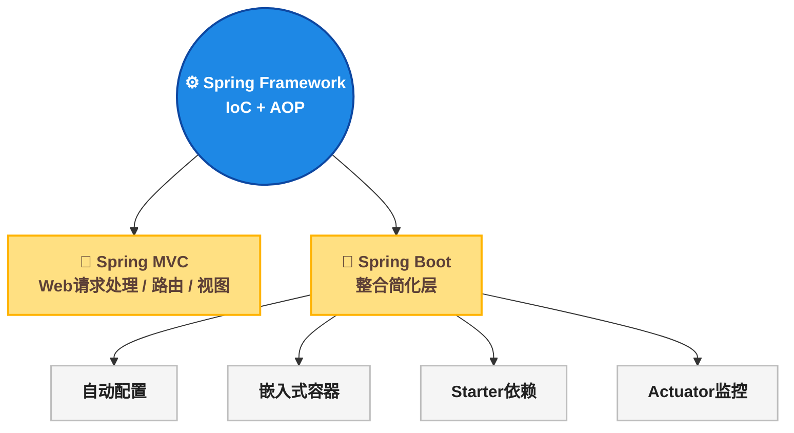
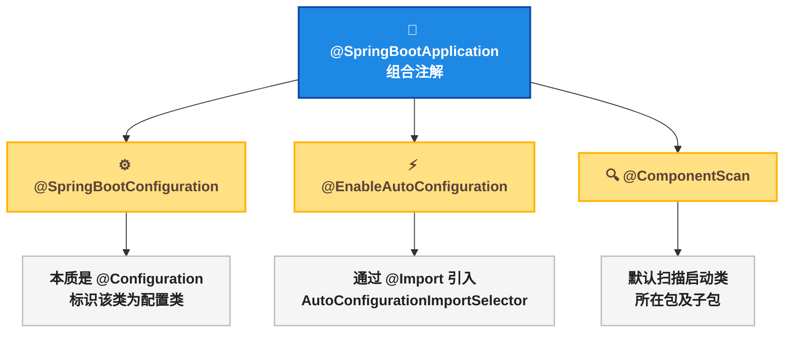
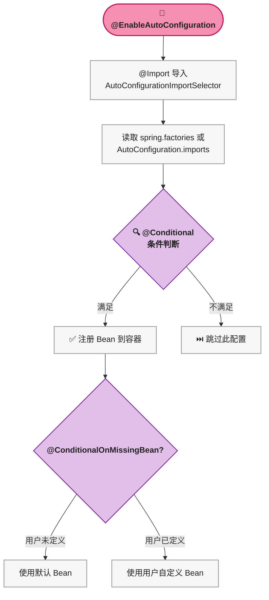
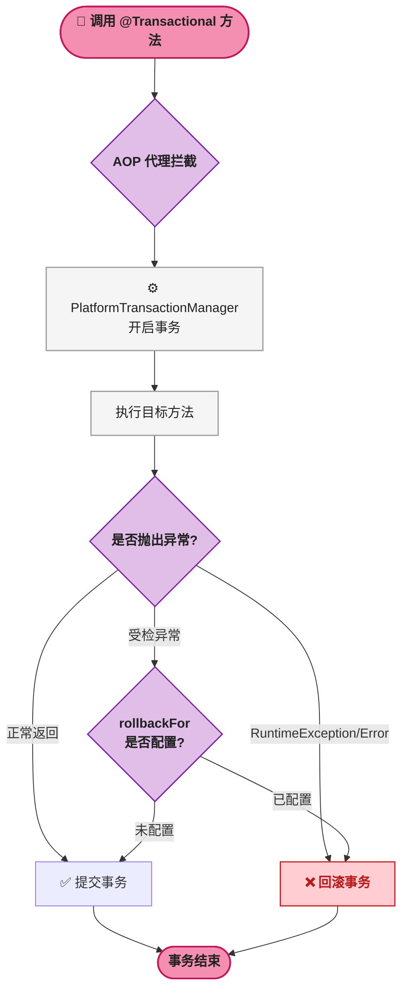
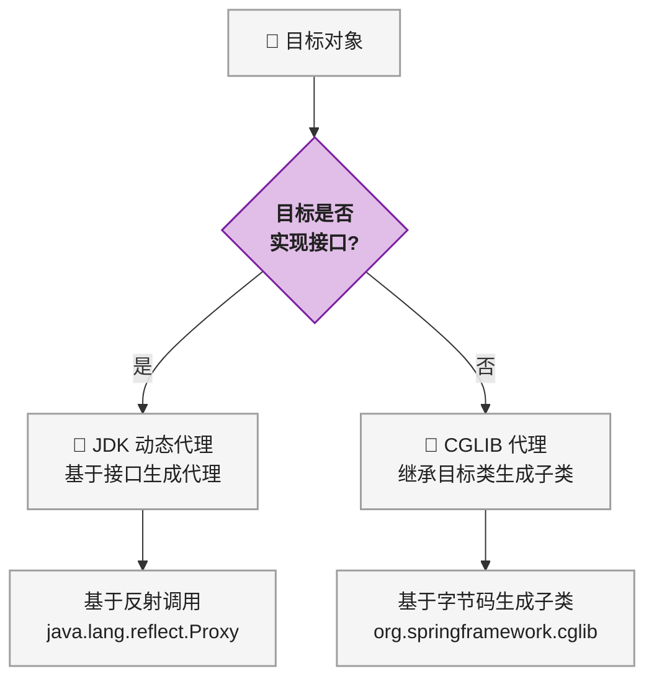
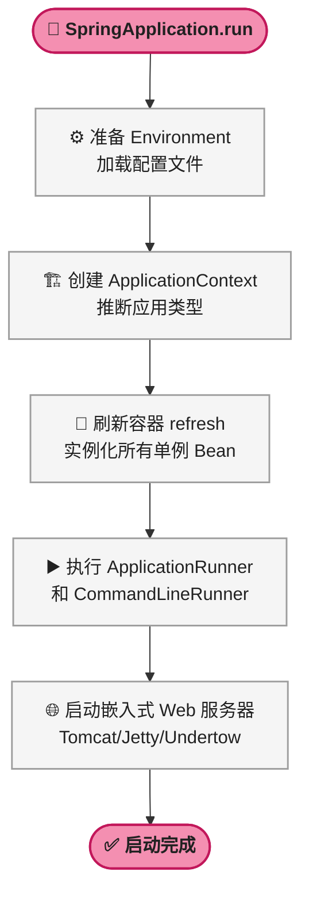

# Spring Boot 面试突击：高频考点全面解析

> 📌 <strong>前置知识</strong>：阅读本文需要具备 Java 基础、Servlet 基础、Spring 基础（IoC / AOP / Bean 容器概念）。本文定位为面试突击速查手册，每个考点都按"面试怎么答"组织，建议配合实际项目经验一起记忆。

---

## 📊 各模块面试频率参考

在开始具体考点之前，先了解各模块的面试出现频率，有助于合理分配背诵时间：

| 模块 | 面试频率 | 重要程度 |
|------|:---:|------|
| 基础概念 | ⭐⭐⭐⭐⭐ | 每场必问，开场热身 |
| 核心注解 | ⭐⭐⭐⭐⭐ | `@SpringBootApplication` 必问 |
| 自动配置原理 | ⭐⭐⭐⭐⭐ | 灵魂考点，区分候选人水平 |
| 配置文件 | ⭐⭐⭐⭐⭐ | 多环境配置高频出现 |
| 事务管理 | ⭐⭐⭐⭐⭐ | 事务失效原因超高频 |
| Bean 生命周期 | ⭐⭐⭐⭐⭐ | 面试官最爱追问 |
| Web/MVC | ⭐⭐⭐⭐ | 结合项目经验考察 |
| AOP | ⭐⭐⭐⭐ | 原理 + 应用场景 |
| Starter | ⭐⭐⭐⭐ | 自定义 Starter 加分项 |
| 高级特性 | ⭐⭐⭐⭐ | 3.x 变化、热部署 |
| Actuator | ⭐⭐⭐ | 生产经验加分 |

<strong>重点背诵</strong>：自动配置原理、事务失效原因、Bean 生命周期、`@SpringBootApplication` 组成、配置加载优先级。

---

## 📖 一、基础概念题

### ❓ 1.1 什么是 Spring Boot？与 Spring、Spring MVC 的关系？

这是最基础的面试开场题，回答需要简洁清晰、一句话点明三者关系。

<strong>Spring</strong>：核心是 IoC（Inversion of Control，控制反转）和 AOP（Aspect Oriented Programming，面向切面编程），负责管理 Bean 的完整生命周期。IoC 容器通过 DI（Dependency Injection，依赖注入）实现对象之间的解耦。

<strong>Spring MVC</strong>：Spring 生态中的 Web 模块，专门处理 HTTP 请求、路由分发、视图渲染。它实现了 MVC（Model-View-Controller）设计模式，核心组件是 `DispatcherServlet`。

<strong>Spring Boot</strong>：不是对 Spring 的替代，而是在 Spring 和 Spring MVC 之上的一层整合简化。它提供自动配置、嵌入式容器、Starter 依赖管理，让开发者无需编写 XML 配置即可快速搭建生产级应用。

三者的层次关系如下：



<strong>一句话总结</strong>：Spring Boot = Spring + Spring MVC + 自动配置 + 嵌入式服务器 + Starter。

> ⚠️ <strong>新手提示</strong>：面试中回答这个问题时，切忌说"Spring Boot 是 Spring 的升级版"或"Spring Boot 替代了 Spring"。正确表述是"Spring Boot 是对 Spring 的整合和简化"。

### ⭐ 1.2 Spring Boot 核心优势？

面试回答时按以下六点依次说明，每条一句话：

1. <strong>简化配置</strong>：消除 XML 配置，全部基于 Java Config 和约定
2. <strong>自动配置</strong>（Auto Configuration）：根据 classpath 中的 jar 依赖自动配置 Bean
3. <strong>嵌入式容器</strong>：内嵌 Tomcat、Jetty 或 Undertow，无需部署 WAR 包
4. <strong>Starter 依赖</strong>：一组预定义依赖集合，实现一键集成（如 `spring-boot-starter-web`）
5. <strong>生产级监控</strong>（Actuator）：提供 `/health`、`/metrics` 等端点用于运维监控
6. <strong>无代码生成、无 XML</strong>：不需要生成代码，也不需要 XML 配置文件

实际场景：某团队从传统 Spring MVC 项目迁移到 Spring Boot 后，配置代码量从几百行 XML 减少到几乎为零，本地开发直接运行 `main` 方法即可启动，不再依赖外部 Tomcat。

### 🤝 1.3 什么是"约定优于配置"？

"约定优于配置"（Convention over Configuration）是 Spring Boot 的核心理念：框架按照内置的默认约定来工作，开发者只需修改与默认约定不同的部分即可。

具体体现：

| 约定 | 默认行为 |
|------|---------|
| 主启动类位置 | 放在根包下，`@ComponentScan` 默认扫描该包及子包 |
| 配置文件位置 | `src/main/resources/application.properties` 或 `.yml` |
| 端口 | 默认 8080 |
| 静态资源 | `src/main/resources/static` 目录 |
| 模板引擎 | `src/main/resources/templates` 目录 |

> ⚠️ <strong>新手提示</strong>："约定"是指框架提前设计好的一套默认规则，并非看不见摸不着的"潜规则"。例如，只要把 `application.properties` 放在 `resources` 目录下，Spring Boot 就会自动读取它，不需要额外配置。

---

## 📝 二、核心注解

### ❓ 2.1 @SpringBootApplication 是什么？由哪三个注解组成？

> 📌 <strong>前置知识</strong>：需要了解 Java 注解基础、`@Configuration`、`@ComponentScan` 的基本含义。

`@SpringBootApplication` 是一个组合注解（元注解），它等价于以下三个注解的叠加：

```java
@SpringBootConfiguration    // 本质是 @Configuration
@EnableAutoConfiguration    // 开启自动配置
@ComponentScan              // 扫描启动类所在包及子包
```

三者关系如下图所示：



面试中常见追问："为什么启动类必须放在根包？"——因为 `@ComponentScan` 默认扫描启动类所在包及其子包，如果放在子包中，父包中的组件将无法被扫描到。

### 📋 2.2 常用注解全分类

下表面试中需要全部记住，按功能分类整理：

| 分类 | 注解 | 作用 | 面试频率 |
|------|------|------|:---:|
| 启动类 | `@SpringBootApplication` | 组合注解，标识启动类 | ⭐⭐⭐⭐⭐ |
| 组件注册 | `@Component` | 通用组件，注册到容器 | ⭐⭐⭐⭐⭐ |
| 组件注册 | `@Service` | 标识 Service 层 | ⭐⭐⭐⭐⭐ |
| 组件注册 | `@Repository` | 标识 DAO 层，含异常转换 | ⭐⭐⭐⭐ |
| 组件注册 | `@Controller` | 标识 Controller（返回视图） | ⭐⭐⭐⭐⭐ |
| 组件注册 | `@RestController` | Controller + ResponseBody | ⭐⭐⭐⭐⭐ |
| 自动配置 | `@EnableAutoConfiguration` | 开启自动配置机制 | ⭐⭐⭐⭐⭐ |
| 配置绑定 | `@ConfigurationProperties` | 批量绑定配置到对象 | ⭐⭐⭐⭐ |
| 单值注入 | `@Value` | 注入单个属性值 | ⭐⭐⭐⭐⭐ |
| 配置类 | `@Configuration` | 定义配置类（Full 模式） | ⭐⭐⭐⭐⭐ |
| Bean 定义 | `@Bean` | 方法返回值注册为 Bean | ⭐⭐⭐⭐⭐ |
| 依赖注入 | `@Autowired` | Spring 自动装配 | ⭐⭐⭐⭐⭐ |
| 依赖注入 | `@Resource` | JSR-250 标准装配 | ⭐⭐⭐⭐ |

### ⚔️ 2.3 @Autowired vs @Resource

| 对比项 | `@Autowired` | `@Resource` |
|------|------|------|
| 来源 | Spring | JSR-250（Java 标准） |
| 注入规则 | 默认按 byType，多个同类型 Bean 时按 byName（结合 `@Qualifier`） | 默认按 byName，找不到时降级为 byType |
| 属性 | `required`（默认 true） | `name`、`type` |
| 支持位置 | 构造器、Setter 方法、字段、方法参数 | 字段、Setter 方法 |

<strong>实际场景</strong>：当项目中存在多个相同类型的 Bean 时（如多个 `DataSource`），`@Autowired` 需要配合 `@Qualifier("beanName")` 使用；而 `@Resource(name="beanName")` 直接指定名称即可。

```java
// @Autowired 多 Bean 场景需要 @Qualifier
@Autowired
@Qualifier("primaryDataSource")
private DataSource dataSource;

// @Resource 直接通过 name 指定
@Resource(name = "primaryDataSource")
private DataSource dataSource;
```

### ⚖️ 2.4 @Component 与 @Configuration 的区别

这是一个区分候选人对 Spring 底层理解深度的题目。

| 对比项 | `@Component`（Lite 模式） | `@Configuration`（Full 模式） |
|------|------|------|
| 代理机制 | 不生成 CGLIB 代理 | 生成 CGLIB 子类代理 |
| `@Bean` 方法多次调用 | 每次调用生成新实例（普通方法） | 多次调用返回同一单例 Bean（代理拦截） |
| 适用场景 | 普通组件定义 | 配置类中定义 Bean 之间的依赖 |

以下 HTML 示意图展示了两种模式在多次调用 `@Bean` 方法时的行为差异：

<div style="display:flex;gap:24px;flex-wrap:wrap;max-width:100%;margin:16px 0;">
  <div style="flex:1;min-width:280px;">
    <div style="background:#E64A19;color:#FFFFFF;padding:4px 12px;font-size:13px;font-weight:bold;text-align:center;">@Component Lite 模式</div>
    <div style="border:2px solid #BDBDBD;padding:12px;">
      <div style="background:#F5F5F5;padding:6px 10px;margin:4px 0;border-radius:3px;">调用 beanA() → <strong style="color:#E64A19;">new A() 首次</strong></div>
      <div style="background:#F5F5F5;padding:6px 10px;margin:4px 0;border-radius:3px;">调用 beanB() → 内部调 beanA()</div>
      <div style="background:#FFCCBC;padding:6px 10px;margin:4px 0;border-radius:3px;">beanB 持有的 A → <strong style="color:#E64A19;">new A() 第二次（不同实例！）</strong></div>
      <div style="background:#FFCDD2;padding:6px 10px;margin:4px 0;border-radius:3px;font-size:12px;">⚠ 两次调用产生两个不同 A 实例</div>
    </div>
  </div>
  <div style="display:flex;align-items:center;font-size:24px;font-weight:bold;color:#388E3C;">→</div>
  <div style="flex:1;min-width:280px;">
    <div style="background:#388E3C;color:#FFFFFF;padding:4px 12px;font-size:13px;font-weight:bold;text-align:center;">@Configuration Full 模式</div>
    <div style="border:2px solid #388E3C;padding:12px;">
      <div style="background:#F5F5F5;padding:6px 10px;margin:4px 0;border-radius:3px;">调用 beanA() → <strong style="color:#388E3C;">new A() 首次</strong></div>
      <div style="background:#F5F5F5;padding:6px 10px;margin:4px 0;border-radius:3px;">调用 beanB() → 内部调 beanA()</div>
      <div style="background:#C8E6C9;padding:6px 10px;margin:4px 0;border-radius:3px;">beanB 持有的 A → <strong style="color:#388E3C;">从容器取单例（同一实例！）</strong></div>
      <div style="background:#C8E6C9;padding:6px 10px;margin:4px 0;border-radius:3px;font-size:12px;">✅ CGLIB 代理拦截，返回容器中的单例</div>
    </div>
  </div>
</div>
<div style="font-size:11px;color:#757575;margin-top:2px;">▲ @Component 与 @Configuration 在 @Bean 方法多次调用时的行为差异</div>

### 🔍 2.5 @Repository 的特殊之处

`@Repository` 除了标识 DAO 层之外，还有一个特殊功能：<strong>将数据库原生异常转换为 Spring 的 `DataAccessException`</strong>。

```java
// MySQL 驱动抛出的原生异常
SQLException → DataAccessException（Spring 统一异常体系）

// 转换前：各数据库异常五花八门
MySQL:     SQLException
Oracle:    SQLException
PostgreSQL: SQLException

// 转换后：Spring 统一封装，便于上层统一处理
DataAccessException
  ├── DataIntegrityViolationException
  ├── DuplicateKeyException
  └── BadSqlGrammarException
```

这个机制通过 `PersistenceExceptionTranslationPostProcessor` 实现，它是一个 `BeanPostProcessor`，专门为标注了 `@Repository` 的 Bean 创建异常转换代理。

---

## ⚙️ 三、自动配置原理

### ⚙️ 3.1 自动配置如何实现？四步回答法

这是 Spring Boot 面试的灵魂考点，掌握以下四步即可应对所有追问。

以下 HTML+CSS 管线图展示了四步流程的完整路径：

<div style="font-family:monospace;font-size:13px;max-width:100%;overflow-x:auto;margin:16px 0;">
  <div style="display:flex;align-items:stretch;border:2px solid #BDBDBD;border-radius:6px;width:fit-content;flex-wrap:wrap;">
    <div style="background:#C8E6C9;border-right:1px solid #9E9E9E;padding:10px 14px;text-align:center;min-width:130px;">
      <div style="font-size:11px;color:#37474F;">🚀 第1步</div>
      <div style="color:#1B5E20;font-weight:bold;">入口触发</div>
      <div style="font-size:11px;color:#212121;margin-top:4px;">@EnableAutoConfiguration<br/>通过 @Import 引入<br/>AutoConfigurationImportSelector</div>
    </div>
    <div style="background:#FFF8E1;border-right:1px solid #9E9E9E;padding:10px 14px;text-align:center;min-width:130px;">
      <div style="font-size:11px;color:#37474F;">📋 第2步</div>
      <div style="color:#F57F17;font-weight:bold;">加载配置列表</div>
      <div style="font-size:11px;color:#212121;margin-top:4px;">读取 META-INF/spring/<br/>AutoConfiguration.imports<br/>(Spring Boot 2.7+)</div>
    </div>
    <div style="background:#E1BEE7;border-right:1px solid #9E9E9E;padding:10px 14px;text-align:center;min-width:130px;">
      <div style="font-size:11px;color:#37474F;">🔍 第3步</div>
      <div style="color:#4A148C;font-weight:bold;">条件过滤</div>
      <div style="font-size:11px;color:#212121;margin-top:4px;">@ConditionalOnClass<br/>@ConditionalOnBean<br/>@ConditionalOnProperty</div>
    </div>
    <div style="background:#FFCCBC;padding:10px 14px;text-align:center;min-width:130px;">
      <div style="font-size:11px;color:#37474F;">✅ 第4步</div>
      <div style="color:#BF360C;font-weight:bold;">注册 Bean</div>
      <div style="font-size:11px;color:#212121;margin-top:4px;">满足条件的配置类中<br/>@Bean 方法执行<br/>@ConditionalOnMissingBean<br/>保证用户优先</div>
    </div>
  </div>
  <div style="font-size:11px;color:#757575;margin-top:4px;">▲ 自动配置四步流程：从入口触发到 Bean 注册的完整路径</div>
</div>

<strong>面试回答模板</strong>：

1. <strong>入口</strong>：`@EnableAutoConfiguration` 通过 `@Import` 引入 `AutoConfigurationImportSelector`
2. <strong>加载</strong>：读取 `META-INF/spring/org.springframework.boot.autoconfigure.AutoConfiguration.imports`（Spring Boot 2.7+）或旧版 `spring.factories` 中定义的所有自动配置类全类名
3. <strong>条件过滤</strong>：使用 `@Conditional` 系列注解（如 `@ConditionalOnClass`、`@ConditionalOnMissingBean`）判断哪些配置类符合生效条件
4. <strong>注册 Bean</strong>：满足条件的配置类中的 `@Bean` 方法被执行，Bean 注册到容器；其中 `@ConditionalOnMissingBean` 保证用户自定义 Bean 优先于默认配置

> ⚠️ <strong>新手提示</strong>：条件过滤这步类似"if 判断"——classpath 里有相关 jar 包（`@ConditionalOnClass`），对应的配置才生效；用户自己定义了 Bean（`@ConditionalOnMissingBean`），默认的就不再生效。

下面用 Mermaid 流程图展示底层调用链：



### 🎛️ 3.2 常用 @Conditional 注解

| 注解 | 条件判断逻辑 | 典型用途 |
|------|------|------|
| `@ConditionalOnClass` | classpath 存在指定类 | 判断是否引入了某依赖（如 HikariCP） |
| `@ConditionalOnMissingClass` | classpath 不存在指定类 | 缺少某依赖时回退到默认配置 |
| `@ConditionalOnBean` | 容器中存在指定 Bean | 依赖其他 Bean 时才创建当前 Bean |
| `@ConditionalOnMissingBean` | 容器中不存在指定 Bean | 用户未定义时才使用默认配置 |
| `@ConditionalOnProperty` | 配置文件中指定属性匹配 | 通过配置开关功能 |
| `@ConditionalOnWebApplication` | 当前是 Web 环境 | Web 项目才加载特定配置 |

### 🌐 3.3 spring-boot-starter-web 自动配置了什么？

当引入 `spring-boot-starter-web` 后，以下组件会被自动配置：

| 自动配置的组件 | 说明 |
|------|------|
| 嵌入式 Tomcat | 默认端口 8080，无需外部 Servlet 容器 |
| `DispatcherServlet` | Spring MVC 核心前端控制器 |
| Jackson JSON 处理器 | 自动处理 JSON 序列化/反序列化 |
| 静态资源处理 | `/static`、`/public`、`/resources`、`/META-INF/resources` |
| 错误处理机制 | `/error` 端点，`BasicErrorController` |

### 🚫 3.4 如何排除自动配置类？

两种方式：

```java
// 方式一：注解属性排除
@SpringBootApplication(exclude = {DataSourceAutoConfiguration.class})
public class Application {
    public static void main(String[] args) {
        SpringApplication.run(Application.class, args);
    }
}
```

```properties
# 方式二：配置文件排除
spring.autoconfigure.exclude=org.springframework.boot.autoconfigure.jdbc.DataSourceAutoConfiguration
```

<strong>实际场景</strong>：当项目不涉及数据库操作，但又引入了包含 `DataSourceAutoConfiguration` 的依赖时，启动会报"无法配置 DataSource"错误，此时需要排除该自动配置类。

---

## 📦 四、Starter 与依赖管理

### 📦 4.1 什么是 Starter？原理？

Starter 是一组预定义的依赖集合（Maven POM 中的依赖描述），它本身不包含任何代码，只是一个"依赖清单"。启动时，Starter 的自动配置模块读取 `META-INF/spring/...AutoConfiguration.imports`，加载对应的自动配置类，条件化注册 Bean。

常见 Starter：

| Starter | 集成能力 |
|------|------|
| `spring-boot-starter-web` | Web 应用（MVC + Tomcat + Jackson） |
| `spring-boot-starter-data-jpa` | JPA + Hibernate |
| `spring-boot-starter-data-redis` | Redis + Lettuce 客户端 |
| `spring-boot-starter-test` | JUnit5 + Mockito + AssertJ |
| `spring-boot-starter-actuator` | 生产监控端点 |

### 🔧 4.2 如何自定义 Starter？

以创建 `myapp-spring-boot-starter` 为例，分以下步骤：

1. <strong>创建 Maven 项目</strong>：添加 `spring-boot-starter`（核心 Starter 依赖）和 `spring-boot-autoconfigure`（自动配置支持）
2. <strong>编写配置属性类</strong>：

```java
@ConfigurationProperties(prefix = "myapp")
public class MyAppProperties {
    private String host = "localhost";  // 默认值
    private int port = 8080;
    // getter / setter
}
```

3. <strong>编写自动配置类</strong>：

```java
@Configuration
@ConditionalOnClass(MyAppService.class)
@EnableConfigurationProperties(MyAppProperties.class)
public class MyAppAutoConfiguration {

    @Bean
    @ConditionalOnMissingBean
    public MyAppService myAppService(MyAppProperties properties) {
        return new MyAppService(properties.getHost(), properties.getPort());
    }
}
```

4. <strong>注册自动配置</strong>：在 `META-INF/spring/org.springframework.boot.autoconfigure.AutoConfiguration.imports` 中写入配置类全类名：

```
com.example.myapp.autoconfigure.MyAppAutoConfiguration
```

5. <strong>打包发布</strong>：`mvn clean install` 发布到 Maven 仓库

---

## 🔧 五、配置文件

### ⚔️ 5.1 properties vs yml

| 特性 | `.properties` | `.yml` |
|------|------|------|
| 语法 | `key=value` | 缩进表示层级关系 |
| 可读性 | 扁平结构，深层配置冗长 | 树状层级清晰，适合多级配置 |
| `@PropertySource` | 支持加载 | 不支持 |
| 优先级（同目录） | `.properties` > `.yml` | — |

```properties
# properties 写法
server.port=8080
spring.datasource.url=jdbc:mysql://localhost:3306/test
spring.datasource.username=root
spring.datasource.password=123456
```

```yaml
# yml 写法（层级清晰）
server:
  port: 8080
spring:
  datasource:
    url: jdbc:mysql://localhost:3306/test
    username: root
    password: 123456
```

### 🌍 5.2 多环境配置

使用 Spring Profile 实现多环境隔离：

```
application.yml            # 公共配置
application-dev.yml        # 开发环境
application-prod.yml       # 生产环境
application-test.yml       # 测试环境
```

激活方式：

```bash
# 方式一：配置文件
spring.profiles.active=dev

# 方式二：启动参数
java -jar app.jar --spring.profiles.active=prod

# 方式三：环境变量
export SPRING_PROFILES_ACTIVE=prod
```

### 📖 5.3 读取配置的方式

| 方式 | 语法 | 适用场景 |
|------|------|------|
| `@Value` | `@Value("${key}")` | 注入单个简单值 |
| `@ConfigurationProperties` | `@ConfigurationProperties(prefix="xxx")` | 批量绑定到对象 |
| `Environment` | 直接注入 `Environment` 调用 `getProperty()` | 编程式获取配置 |
| `@PropertySource` | `@PropertySource("classpath:custom.properties")` | 加载非默认配置文件 |

```java
// 方式一：单个值注入
@Value("${server.port}")
private int port;

// 方式二：批量绑定（推荐）
@ConfigurationProperties(prefix = "spring.datasource")
public class DataSourceProperties {
    private String url;
    private String username;
    private String password;
}

// 方式三：编程式获取
@Autowired
private Environment env;
String port = env.getProperty("server.port");
```

### 📊 5.4 配置加载优先级

从高到低的优先级顺序如下：

<div style="max-width:100%;margin:16px 0;">
  <div style="display:flex;flex-direction:column;gap:4px;max-width:600px;">
    <div style="display:flex;align-items:center;background:#C62828;color:#FFFFFF;padding:8px 14px;border-radius:4px;">
      <span style="min-width:28px;font-weight:bold;">1</span> 命令行参数 --server.port=8081
    </div>
    <div style="display:flex;align-items:center;background:#E64A19;color:#FFFFFF;padding:8px 14px;border-radius:4px;">
      <span style="min-width:28px;font-weight:bold;">2</span> 系统环境变量
    </div>
    <div style="display:flex;align-items:center;background:#F57C00;color:#FFFFFF;padding:8px 14px;border-radius:4px;">
      <span style="min-width:28px;font-weight:bold;">3</span> application-{profile}.properties（外部）
    </div>
    <div style="display:flex;align-items:center;background:#FFB300;color:#5D4037;padding:8px 14px;border-radius:4px;">
      <span style="min-width:28px;font-weight:bold;">4</span> application-{profile}.properties（内部）
    </div>
    <div style="display:flex;align-items:center;background:#F5F5F5;color:#212121;padding:8px 14px;border-radius:4px;border:1px solid #BDBDBD;">
      <span style="min-width:28px;font-weight:bold;">5</span> application.properties（内部）
    </div>
    <div style="display:flex;align-items:center;background:#E0E0E0;color:#37474F;padding:8px 14px;border-radius:4px;">
      <span style="min-width:28px;font-weight:bold;">6</span> application.yml（内部）
    </div>
  </div>
  <div style="font-size:11px;color:#757575;margin-top:4px;">▲ 配置加载优先级从高到低，数字越小优先级越高</div>
</div>

> ⚠️ <strong>新手提示</strong>：命令行参数优先级最高意味着——即使 `application.yml` 中写了 `server.port=8080`，通过 `--server.port=9090` 启动时实际端口仍是 9090。这在 Docker 部署时特别常用。

---

## 🌐 六、Web 与 MVC

### 🔄 6.1 Spring MVC 执行流程

这是面试中经常要求"手绘流程图"的考点。下面先用 HTML+CSS 管线图直观展示核心流程：

<div style="font-family:monospace;font-size:13px;max-width:100%;overflow-x:auto;margin:16px 0;">
  <div style="display:flex;align-items:stretch;border:2px solid #BDBDBD;border-radius:6px;flex-wrap:wrap;">
    <div style="background:#E3F2FD;padding:10px 12px;text-align:center;min-width:100px;border-right:1px solid #BDBDBD;">
      <div style="font-size:11px;color:#37474F;">1. 请求到达</div>
      <div style="color:#1565C0;font-weight:bold;font-size:12px;">HTTP Request</div>
    </div>
    <div style="display:flex;align-items:center;padding:0 6px;font-size:20px;color:#757575;">→</div>
    <div style="background:#C8E6C9;padding:10px 12px;text-align:center;min-width:100px;border-right:1px solid #BDBDBD;">
      <div style="font-size:11px;color:#37474F;">2. 前端控制器</div>
      <div style="color:#1B5E20;font-weight:bold;font-size:12px;">DispatcherServlet</div>
    </div>
    <div style="display:flex;align-items:center;padding:0 6px;font-size:20px;color:#757575;">→</div>
    <div style="background:#FFF8E1;padding:10px 12px;text-align:center;min-width:100px;border-right:1px solid #BDBDBD;">
      <div style="font-size:11px;color:#37474F;">3. 查找处理器</div>
      <div style="color:#F57F17;font-weight:bold;font-size:12px;">HandlerMapping</div>
    </div>
    <div style="display:flex;align-items:center;padding:0 6px;font-size:20px;color:#757575;">→</div>
    <div style="background:#E1BEE7;padding:10px 12px;text-align:center;min-width:100px;border-right:1px solid #BDBDBD;">
      <div style="font-size:11px;color:#37474F;">4. 执行处理器</div>
      <div style="color:#4A148C;font-weight:bold;font-size:12px;">HandlerAdapter</div>
    </div>
    <div style="display:flex;align-items:center;padding:0 6px;font-size:20px;color:#757575;">→</div>
    <div style="background:#F5F5F5;padding:10px 12px;text-align:center;min-width:100px;border-right:1px solid #BDBDBD;">
      <div style="font-size:11px;color:#37474F;">5. 业务处理</div>
      <div style="color:#212121;font-weight:bold;font-size:12px;">Controller</div>
    </div>
    <div style="display:flex;align-items:center;padding:0 6px;font-size:20px;color:#757575;">→</div>
    <div style="background:#FFCCBC;padding:10px 12px;text-align:center;min-width:100px;border-right:1px solid #BDBDBD;">
      <div style="font-size:11px;color:#37474F;">6. 视图解析</div>
      <div style="color:#BF360C;font-weight:bold;font-size:12px;">ViewResolver</div>
    </div>
    <div style="display:flex;align-items:center;padding:0 6px;font-size:20px;color:#757575;">→</div>
    <div style="background:#E3F2FD;padding:10px 12px;text-align:center;min-width:100px;">
      <div style="font-size:11px;color:#37474F;">7. 响应返回</div>
      <div style="color:#1565C0;font-weight:bold;font-size:12px;">HTTP Response</div>
    </div>
  </div>
  <div style="font-size:11px;color:#757575;margin-top:4px;">▲ Spring MVC 请求处理链路：从 HTTP 请求到响应的完整路径</div>
</div>

<strong>面试口述版本</strong>：

1. 用户请求到达 <strong>`DispatcherServlet`</strong>（前端控制器）
2. `DispatcherServlet` 调用 <strong>`HandlerMapping`</strong> 找到处理请求的 `HandlerExecutionChain`（包含 Handler + Interceptors）
3. `DispatcherServlet` 调用 <strong>`HandlerAdapter`</strong> 执行对应的 Controller 方法
4. Controller 调用 Service 层完成业务逻辑，返回 `ModelAndView`
5. `DispatcherServlet` 将逻辑视图名交给 <strong>`ViewResolver`</strong> 解析为物理视图
6. 渲染视图，生成 HTML 响应返回客户端

> 📌 <strong>前置知识</strong>：需要了解 Servlet 规范中的 `doGet`/`doPost` 方法，以及 Filter 和 Servlet 的执行顺序。

### 🚨 6.2 全局异常处理

```java
@RestControllerAdvice  // @ControllerAdvice + @ResponseBody
public class GlobalExceptionHandler {

    @ExceptionHandler(BusinessException.class)
    public Result handleBusinessException(BusinessException e) {
        return Result.error(e.getCode(), e.getMessage());
    }

    @ExceptionHandler(Exception.class)
    public Result handleException(Exception e) {
        log.error("系统异常", e);
        return Result.error(500, "系统繁忙，请稍后再试");
    }
}
```

<strong>实际场景</strong>：某项目的订单接口在生产环境出现空指针异常，由于没有全局异常处理，前端收到的是 Tomcat 默认的 HTML 错误页面而非 JSON 格式的错误信息，导致前端解析失败。加入 `@RestControllerAdvice` 全局异常处理后，所有异常统一返回 JSON 格式。

### 🌐 6.3 跨域解决（CORS）

CORS（Cross-Origin Resource Sharing，跨域资源共享）是浏览器的安全策略。当前后端分离部署在不同域名/端口时，前端请求会被浏览器拦截。

```java
@Configuration
public class CorsConfig implements WebMvcConfigurer {
    @Override
    public void addCorsMappings(CorsRegistry registry) {
        registry.addMapping("/**")        // 允许所有路径
                .allowedOrigins("*")       // 允许所有来源
                .allowedMethods("GET", "POST", "PUT", "DELETE")
                .allowedHeaders("*");
    }
}
```

> ⚠️ <strong>新手提示</strong>：跨域是浏览器行为，不是后端拒绝请求。请求实际上已经到达后端并返回了数据，但浏览器发现响应头中没有正确的 CORS 头，于是拦截了响应。生产环境不允许使用 `*`，应配置具体的域名白名单。

---

## 🔄 七、事务管理

### ⚙️ 7.1 声明式事务实现原理

Spring 声明式事务基于 <strong>AOP 动态代理</strong>实现。核心流程如下：



关键点：
- 启动时扫描 `@Transactional`，为标注的类的 <strong>public 方法</strong>创建代理
- 方法调用前通过 `PlatformTransactionManager` 开启事务
- 默认只对 `RuntimeException` 和 `Error` 回滚（受检异常需显式配置 `rollbackFor`）

### 📡 7.2 事务传播行为

Spring 定义了 7 种传播行为，面试中重点掌握 3 种：

| 传播行为 | 说明 | 典型场景 |
|------|------|------|
| <strong>REQUIRED</strong>（默认） | 有事务则加入，无则新建 | Service 层方法调用，一个操作需在同一事务中 |
| <strong>REQUIRES_NEW</strong> | 总是新建事务，挂起当前事务 | 日志记录、审计——失败不应影响主流程 |
| <strong>NESTED</strong> | 嵌套事务，内层回滚不影响外层 | 子操作失败后可单独回滚 |
| SUPPORTS | 有则加入，无则非事务运行 | 查询方法，事务可选 |
| MANDATORY | 必须在已有事务中，否则抛异常 | 强依赖事务的操作 |
| NOT_SUPPORTED | 非事务运行，挂起当前事务 | 不需要事务的耗时操作 |
| NEVER | 非事务运行，有事务则抛异常 | 明确禁止在事务中运行 |

以下 HTML 示意图展示了三种重点传播行为的区别：

<div style="display:flex;gap:16px;flex-wrap:wrap;max-width:100%;margin:16px 0;">
  <div style="flex:1;min-width:200px;border:2px solid #BDBDBD;border-radius:4px;">
    <div style="background:#388E3C;color:#FFFFFF;padding:4px 10px;font-size:13px;font-weight:bold;text-align:center;">REQUIRED（默认）</div>
    <div style="padding:10px;">
      <div style="background:#F5F5F5;padding:6px;margin:4px 0;border-radius:3px;font-size:12px;">外层: 开启事务 TX1</div>
      <div style="display:flex;align-items:center;font-size:12px;color:#757575;margin:4px 0;">↓ 内层调用</div>
      <div style="background:#C8E6C9;padding:6px;margin:4px 0;border-radius:3px;font-size:12px;">内层: <strong>加入 TX1</strong></div>
      <div style="font-size:11px;color:#E64A19;margin-top:6px;">⚠ 内层回滚 → 整个 TX1 回滚</div>
    </div>
  </div>
  <div style="flex:1;min-width:200px;border:2px solid #BDBDBD;border-radius:4px;">
    <div style="background:#E64A19;color:#FFFFFF;padding:4px 10px;font-size:13px;font-weight:bold;text-align:center;">REQUIRES_NEW</div>
    <div style="padding:10px;">
      <div style="background:#F5F5F5;padding:6px;margin:4px 0;border-radius:3px;font-size:12px;">外层: 开启事务 TX1</div>
      <div style="display:flex;align-items:center;font-size:12px;color:#757575;margin:4px 0;">↓ 内层调用</div>
      <div style="background:#FFF8E1;padding:6px;margin:4px 0;border-radius:3px;font-size:12px;">内层: <strong>挂起 TX1，新建 TX2</strong></div>
      <div style="font-size:11px;color:#388E3C;margin-top:6px;">✅ TX2 回滚 → TX1 不受影响</div>
    </div>
  </div>
  <div style="flex:1;min-width:200px;border:2px solid #BDBDBD;border-radius:4px;">
    <div style="background:#7B1FA2;color:#FFFFFF;padding:4px 10px;font-size:13px;font-weight:bold;text-align:center;">NESTED</div>
    <div style="padding:10px;">
      <div style="background:#F5F5F5;padding:6px;margin:4px 0;border-radius:3px;font-size:12px;">外层: 开启事务 TX1</div>
      <div style="display:flex;align-items:center;font-size:12px;color:#757575;margin:4px 0;">↓ 内层调用</div>
      <div style="background:#E1BEE7;padding:6px;margin:4px 0;border-radius:3px;font-size:12px;">内层: <strong>创建保存点 SP</strong></div>
      <div style="font-size:11px;color:#7B1FA2;margin-top:6px;">⚠ 内层回滚 → 回滚到 SP，TX1 继续</div>
    </div>
  </div>
</div>
<div style="font-size:11px;color:#757575;margin-top:2px;">▲ 三种核心传播行为的事务边界与回滚影响范围对比</div>

### ⚠️ 7.3 事务失效常见原因

<strong>面试超高频考点</strong>——以下列举 7 种常见失效场景：

| 失效原因 | 说明 | 解决方案 |
|------|------|------|
| <strong>数据库引擎不支持事务</strong> | MyISAM 引擎无事务支持 | 使用 InnoDB |
| <strong>方法非 public</strong> | Spring AOP 代理只能拦截 public 方法 | 改为 public |
| <strong>同类内 this 调用</strong> | this.method() 绕过代理对象 | 注入自身或拆分到不同类 |
| <strong>异常被 try-catch 吞掉</strong> | 异常未抛出，代理感知不到 | 在 catch 中手动回滚或重新抛出 |
| <strong>异常类型不匹配</strong> | 受检异常默认不回滚 | 配置 `rollbackFor = Exception.class` |
| <strong>传播行为配置不当</strong> | 如设为 NOT_SUPPORTED | 检查 propagation 配置 |
| <strong>未启用事务管理器</strong> | 缺少 `@EnableTransactionManagement` | 确认配置或使用 Spring Boot 自动配置 |

<strong>this 调用失效的详细说明</strong>：

Spring 事务依赖 AOP 代理：调用 `代理对象.方法()` 时，代理在方法前后织入事务逻辑。但同类内部 `this.method()` 直接调用 `this`（原始对象），绕过了代理，事务因此失效。

```java
@Service
public class OrderService {

    // ❌ 事务失效：this.createOrder() 不经过代理
    public void process() {
        this.createOrder();  // 直接调用，无事务
    }

    @Transactional
    public void createOrder() {
        // ...
    }
}
```

修复方式——注入自身：

```java
@Service
public class OrderService {

    @Autowired
    private OrderService self;  // 注入代理对象

    public void process() {
        self.createOrder();  // ✅ 通过代理调用，事务生效
    }

    @Transactional
    public void createOrder() {
        // ...
    }
}
```

---

## 🔪 八、AOP

### ⚙️ 8.1 Spring AOP 实现原理

Spring AOP 基于 <strong>动态代理</strong>实现，在运行时期将切面逻辑（Advice）织入目标方法。根据目标对象是否实现接口，选择不同的代理方式：



### ⚖️ 8.2 JDK vs CGLIB 对比

| 代理方式 | 触发条件 | 特点 | 性能 |
|------|------|------|:---:|
| <strong>JDK 动态代理</strong> | 目标类实现了接口 | 基于 `java.lang.reflect.Proxy`，生成接口实现类 | 低版本 JDK 较慢，JDK 8+ 已优化 |
| <strong>CGLIB 代理</strong> | 无接口 或 `proxyTargetClass=true` | 通过 ASM 字节码框架生成目标类的子类 | 生成过程稍慢，运行期高效 |

<strong>默认策略</strong>：Spring Boot 2.x 默认 `proxyTargetClass=true`，优先使用 CGLIB。有接口时也可通过显式配置使用 JDK 代理。

> ⚠️ <strong>新手提示</strong>：CGLIB 通过继承实现代理，因此 `final` 修饰的类和方法无法被 CGLIB 代理。Spring Boot 中 Controller 和 Service 默认被代理，这就是为什么 `@Transactional` 不能标注在 `final` 方法上。

---

## 📊 九、Actuator 生产监控

### 📊 9.1 Actuator 概述与常用端点

Spring Boot Actuator 是内置的生产级监控工具，通过 HTTP 端点暴露应用运行状态。

<strong>常用端点</strong>：

| 端点 | 作用 | 是否默认暴露 |
|------|------|:---:|
| `/actuator/health` | 健康检查（磁盘空间、数据库连接等） | 是 |
| `/actuator/info` | 应用自定义信息 | 是 |
| `/actuator/metrics` | 性能指标（JVM 内存、HTTP 请求数等） | 是 |
| `/actuator/beans` | 容器中所有 Bean 列表 | 否 |
| `/actuator/env` | 环境属性（含密码等敏感信息） | 否 |
| `/actuator/mappings` | 所有 @RequestMapping 路径 | 否 |
| `/actuator/shutdown` | 优雅关闭应用 | 否（需手动开启） |

<strong>生产环境安全配置</strong>：

```yaml
management:
  endpoints:
    web:
      exposure:
        include: health,info,metrics  # 仅暴露安全端点
  endpoint:
    health:
      show-details: when-authorized   # 授权后才显示详情
```

> ⚠️ <strong>新手提示</strong>：生产环境绝不能用 `*` 暴露所有端点，尤其 `/env` 和 `/beans` 可能泄露配置密码和内部架构信息。通常只暴露 `health`、`info`、`metrics` 三个端点给监控系统（如 Prometheus）。

---

## 🔄 十、Bean 生命周期

### 🔄 10.1 Spring Bean 生命周期完整流程

这是面试最高频考点之一，需要完整背诵以下 8 个阶段。下面用 HTML+CSS 管线图直观展示：

<div style="font-family:monospace;font-size:13px;max-width:100%;overflow-x:auto;margin:16px 0;">
  <div style="display:flex;flex-direction:column;gap:6px;max-width:660px;">
    <div style="display:flex;align-items:center;background:#C8E6C9;border:1px solid #388E3C;border-radius:4px;padding:10px 14px;">
      <span style="min-width:80px;color:#1B5E20;font-weight:bold;">阶段1 实例化</span>
      <span style="color:#212121;">通过构造器创建 Bean 实例</span>
    </div>
    <div style="display:flex;justify-content:center;font-size:18px;color:#757575;">↓</div>
    <div style="display:flex;align-items:center;background:#FFF8E1;border:1px solid #FFB300;border-radius:4px;padding:10px 14px;">
      <span style="min-width:80px;color:#F57F17;font-weight:bold;">阶段2 属性填充</span>
      <span style="color:#212121;">依赖注入（@Autowired、@Value 等）</span>
    </div>
    <div style="display:flex;justify-content:center;font-size:18px;color:#757575;">↓</div>
    <div style="display:flex;align-items:center;background:#E1BEE7;border:1px solid #7B1FA2;border-radius:4px;padding:10px 14px;">
      <span style="min-width:80px;color:#4A148C;font-weight:bold;">阶段3 Aware回调</span>
      <span style="color:#212121;">BeanNameAware → BeanFactoryAware → ApplicationContextAware</span>
    </div>
    <div style="display:flex;justify-content:center;font-size:18px;color:#757575;">↓</div>
    <div style="display:flex;align-items:center;background:#F5F5F5;border:1px solid #9E9E9E;border-radius:4px;padding:10px 14px;">
      <span style="min-width:80px;color:#212121;font-weight:bold;">阶段4 前置处理</span>
      <span style="color:#212121;">BeanPostProcessor.postProcessBeforeInitialization()</span>
    </div>
    <div style="display:flex;justify-content:center;font-size:18px;color:#757575;">↓</div>
    <div style="display:flex;align-items:center;background:#FFCCBC;border:2px solid #E64A19;border-radius:4px;padding:10px 14px;">
      <span style="min-width:80px;color:#BF360C;font-weight:bold;">阶段5 初始化</span>
      <span style="color:#212121;">@PostConstruct → InitializingBean.afterPropertiesSet() → @Bean(initMethod)</span>
    </div>
    <div style="display:flex;justify-content:center;font-size:18px;color:#757575;">↓</div>
    <div style="display:flex;align-items:center;background:#F5F5F5;border:1px solid #9E9E9E;border-radius:4px;padding:10px 14px;">
      <span style="min-width:80px;color:#212121;font-weight:bold;">阶段6 后置处理</span>
      <span style="color:#212121;">BeanPostProcessor.postProcessAfterInitialization()（<strong style="color:#E64A19;">AOP代理在此生成</strong>）</span>
    </div>
    <div style="display:flex;justify-content:center;font-size:18px;color:#757575;">↓</div>
    <div style="display:flex;align-items:center;background:#E3F2FD;border:1px solid #1565C0;border-radius:4px;padding:10px 14px;">
      <span style="min-width:80px;color:#1565C0;font-weight:bold;">阶段7 使用 Bean</span>
      <span style="color:#212121;">Bean 放入容器，业务代码通过 @Autowired 获取使用</span>
    </div>
    <div style="display:flex;justify-content:center;font-size:18px;color:#757575;">↓</div>
    <div style="display:flex;align-items:center;background:#FFCDD2;border:1px solid #C62828;border-radius:4px;padding:10px 14px;">
      <span style="min-width:80px;color:#B71C1C;font-weight:bold;">阶段8 销毁</span>
      <span style="color:#212121;">@PreDestroy → DisposableBean.destroy() → @Bean(destroyMethod)</span>
    </div>
  </div>
  <div style="font-size:11px;color:#757575;margin-top:4px;">▲ Spring Bean 完整生命周期 8 个阶段（阶段5 初始化有三种回调方式，按顺序依次执行）</div>
</div>

<strong>面试口述版本</strong>（按顺序背诵）：

1. <strong>实例化</strong>：反射调用构造器创建 Bean 实例
2. <strong>属性填充</strong>：为 Bean 注入依赖（`@Autowired`、`@Value` 等）
3. <strong>Aware 接口回调</strong>：依次调用 `BeanNameAware` → `BeanFactoryAware` → `ApplicationContextAware`
4. <strong>BeanPostProcessor 前置处理</strong>：`postProcessBeforeInitialization()`
5. <strong>初始化</strong>：按顺序执行 `@PostConstruct` → `InitializingBean.afterPropertiesSet()` → `@Bean(initMethod)`
6. <strong>BeanPostProcessor 后置处理</strong>：`postProcessAfterInitialization()`——<span style="color:red">AOP 动态代理在此阶段生成</span>
7. <strong>使用 Bean</strong>：放入容器，业务代码通过 `@Autowired` 使用
8. <strong>销毁</strong>：容器关闭时，按顺序执行 `@PreDestroy` → `DisposableBean.destroy()` → `@Bean(destroyMethod)`

面试连问技巧：记住阶段 4 和阶段 6 这两个 `BeanPostProcessor` 回调，阶段 5 的三种初始化方式是有严格先后顺序的——`@PostConstruct` > `afterPropertiesSet()` > `initMethod`。

---

## 🚀 十一、启动流程与高级特性

### 🚀 11.1 Spring Boot 启动流程



<strong>面试口述版本</strong>：

1. 准备 Environment，加载配置属性
2. 根据 classpath 推断应用类型，创建对应的 `ApplicationContext`（如 `AnnotationConfigServletWebServerApplicationContext`）
3. 刷新容器（`refresh()` 方法）——这是最核心的一步，会实例化所有单例 Bean
4. 执行 `ApplicationRunner` 和 `CommandLineRunner` 回调
5. 启动嵌入式 Web 服务器（Tomcat/Jetty/Undertow），监听端口

### 🔄 11.2 Spring Boot 3.x 主要变化（相比 2.x）

| 变化项 | 2.x | 3.x |
|------|------|------|
| JDK 版本 | JDK 8 最低 | JDK 17 最低要求 |
| 命名空间 | `javax.*` | `jakarta.*`（Jakarta EE 9+） |
| 自动配置注册 | `spring.factories` | `AutoConfiguration.imports` |
| 原生镜像 | 不支持 | 支持 GraalVM 原生镜像编译 |
| 编译优化 | — | AOT（Ahead-of-Time）预编译 |
| 观察性 | — | 内置 Micrometer 可观测性 |

### 🔥 11.3 热部署如何实现？

添加 `spring-boot-devtools` 依赖即可实现热部署：

```xml
<dependency>
    <groupId>org.springframework.boot</groupId>
    <artifactId>spring-boot-devtools</artifactId>
    <scope>runtime</scope>
    <optional>true</optional>
</dependency>
```

原理：devtools 使用<strong>双 ClassLoader</strong>机制——第三方 jar 由 base ClassLoader 加载（不会变），项目代码由 restart ClassLoader 加载。代码变更时，restart ClassLoader 销毁并重建，实现快速重启。

### 🐳 11.4 支持的嵌入式容器？如何替换？

| 容器 | Starter |
|------|------|
| Tomcat（默认） | `spring-boot-starter-tomcat`（`spring-boot-starter-web` 中已包含） |
| Jetty | `spring-boot-starter-jetty` |
| Undertow | `spring-boot-starter-undertow` |

替换为 Jetty 的示例：

```xml
<dependency>
    <groupId>org.springframework.boot</groupId>
    <artifactId>spring-boot-starter-web</artifactId>
    <exclusions>
        <exclusion>
            <groupId>org.springframework.boot</groupId>
            <artifactId>spring-boot-starter-tomcat</artifactId>
        </exclusion>
    </exclusions>
</dependency>
<dependency>
    <groupId>org.springframework.boot</groupId>
    <artifactId>spring-boot-starter-jetty</artifactId>
</dependency>
```

---

## 🎯 十二、面试频率总览与背诵策略

### 📊 12.1 模块频率速查表

| 优先级 | 模块 | 必须掌握的内容 |
|:---:|------|------|
| 🔥🔥🔥 | 自动配置原理 | 四步回答法、条件过滤机制、`@ConditionalOnMissingBean` |
| 🔥🔥🔥 | 事务管理 | 失效的 7 种原因、三种传播行为 |
| 🔥🔥🔥 | Bean 生命周期 | 8 个阶段的完整顺序、AOP 代理生成时机 |
| 🔥🔥🔥 | 核心注解 | `@SpringBootApplication` 三大组成、`@Autowired` vs `@Resource` |
| 🔥🔥🔥 | 配置文件 | 加载优先级、多环境 Profile |
| 🔥🔥 | Starter | 原理、自定义步骤 |
| 🔥🔥 | AOP | JDK vs CGLIB 代理区别 |
| 🔥🔥 | Web/MVC | DispatcherServlet 执行链、全局异常处理 |
| 🔥 | Actuator | 常用端点、生产安全配置 |
| 🔥 | 高级特性 | 3.x 变化、热部署、容器替换 |

### 📝 12.2 背诵顺序建议

按照面试提问的<strong>递进逻辑</strong>来组织记忆：

<div style="max-width:100%;margin:16px 0;">
  <div style="display:flex;flex-direction:column;gap:4px;max-width:560px;">
    <div style="background:#E3F2FD;border-left:4px solid #1565C0;padding:8px 14px;border-radius:2px;">
      <strong>1</strong> 先说 Spring / Spring MVC / Spring Boot 三者关系（开场热身，必须流畅）
    </div>
    <div style="background:#C8E6C9;border-left:4px solid #388E3C;padding:8px 14px;border-radius:2px;">
      <strong>2</strong> 背出 @SpringBootApplication 三大组成（注解题，高频必问）
    </div>
    <div style="background:#FFF8E1;border-left:4px solid #FFB300;padding:8px 14px;border-radius:2px;">
      <strong>3</strong> 详细讲自动配置四步流程（灵魂考点，拉开分差）
    </div>
    <div style="background:#E1BEE7;border-left:4px solid #7B1FA2;padding:8px 14px;border-radius:2px;">
      <strong>4</strong> 背诵 Bean 生命周期 8 个阶段 + AOP 代理生成时机（超高频追问）
    </div>
    <div style="background:#FFCCBC;border-left:4px solid #E64A19;padding:8px 14px;border-radius:2px;">
      <strong>5</strong> 说出事务失效 7 种场景 + this 调用原理（实战经验题）
    </div>
    <div style="background:#F5F5F5;border-left:4px solid #9E9E9E;padding:8px 14px;border-radius:2px;">
      <strong>6</strong> 补充配置加载优先级 + 多环境 Profile 激活方式（收官）
    </div>
  </div>
  <div style="font-size:11px;color:#757575;margin-top:4px;">▲ 推荐背诵顺序：从基础概念逐步深入到原理和实战场景</div>
</div>

---

> ⚠️ <strong>给读者的面试提醒</strong>：本文覆盖的 32 个考点是 Spring Boot 面试的高频范围。建议按照第 12 节的背诵顺序，每天攻破 2 ~ 3 个考点，两周内完成全部记忆。面试中回答原理类问题时，一定要先给结论再展开，不要边想边说。如果遇到不会的问题，可以坦诚说明"目前还没有深入了解过这个点"，然后引导面试官到自己熟悉的领域（如自动配置、事务管理等），避免冷场。

---

🖼️ 网络图片占位符标注位置：
- 第 6.1 节 "Spring MVC 执行流程"：DispatcherServlet 完整请求处理架构图，需替换 IMAGE_URL_PLACEHOLDER
- 第 10.1 节 "Bean 生命周期完整流程"：Spring IoC 容器 Bean 生命周期官方示意图，需替换 IMAGE_URL_PLACEHOLDER
