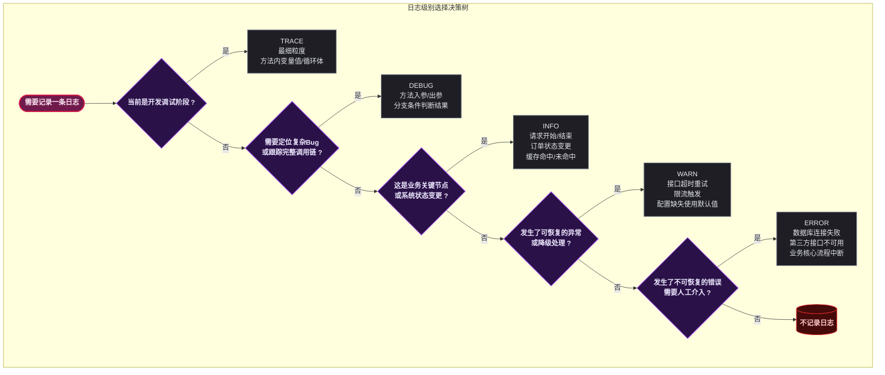
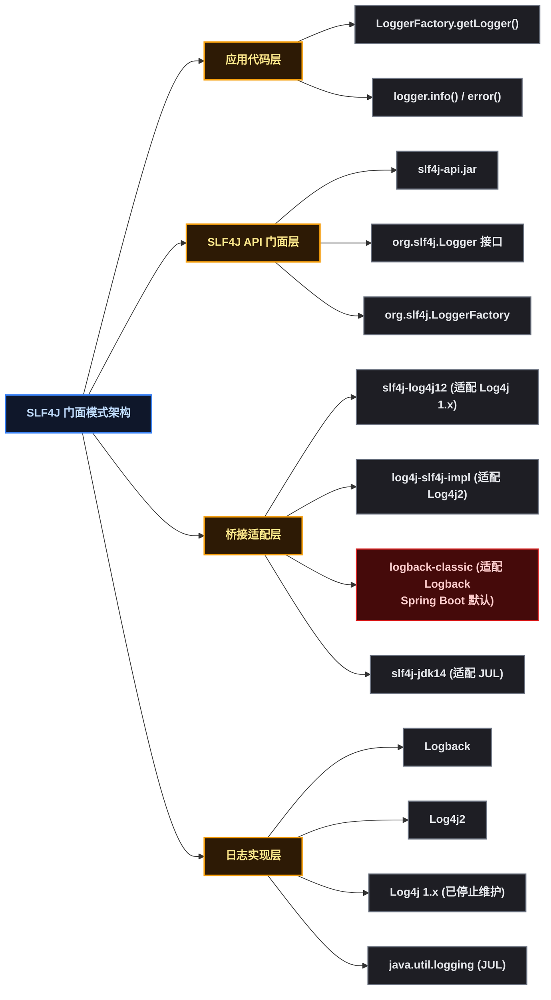
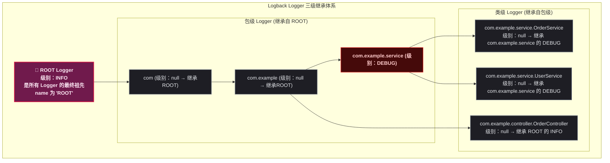
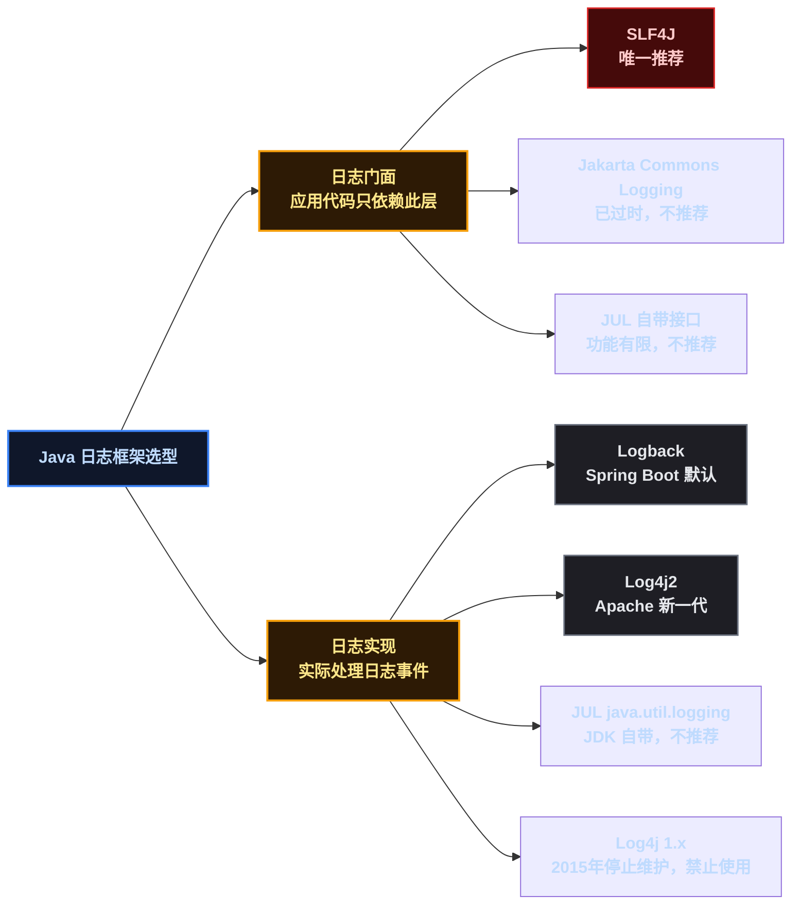
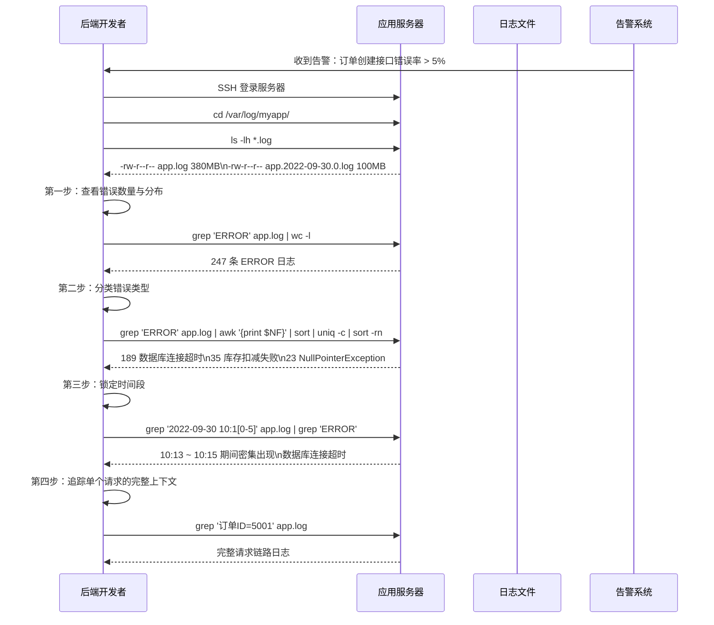
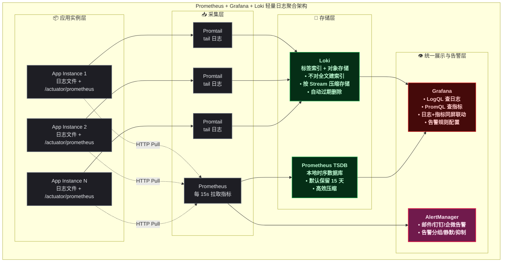
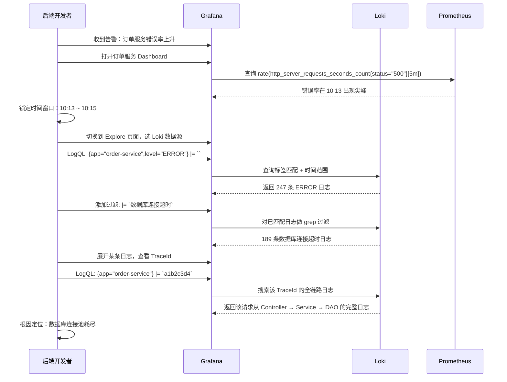
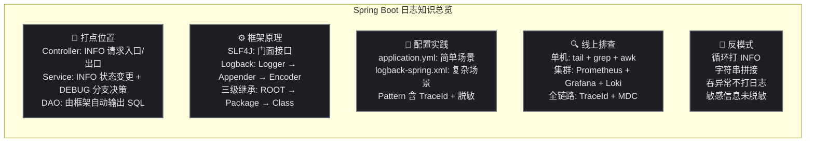

# Spring Boot 日志：打点位置、框架选型与线上排查全解析

## 🐛 问题切入：一段没有日志的代码

下面是一个新手开发者写的 Spring Boot 订单服务：

```java
@RestController
@RequestMapping("/order")
public class OrderController {

    @Autowired
    private OrderService orderService;

    @PostMapping("/create")
    public Result<Order> createOrder(@RequestBody CreateOrderRequest req) {
        Order order = orderService.createOrder(req);
        return Result.success(order);
    }
}

@Service
public class OrderService {

    @Autowired
    private OrderMapper orderMapper;
    @Autowired
    private InventoryService inventoryService;

    @Transactional
    public Order createOrder(CreateOrderRequest req) {
        // 扣减库存
        boolean deducted = inventoryService.deduct(req.getProductId(), req.getQuantity());
        if (!deducted) {
            throw new BusinessException("库存不足");
        }
        // 创建订单
        Order order = new Order();
        order.setUserId(req.getUserId());
        order.setAmount(req.getAmount());
        orderMapper.insert(order);
        return order;
    }
}
```

某天线上出现了一个问题：用户投诉"我付了钱但订单没创建成功"。后端同学打开服务器，面对空荡荡的日志文件（只有 Spring Boot 默认的启动 banner），完全不知道从哪里下手。

这就是典型的"不知道在哪里打日志"问题。本文将从打点位置、框架原理、配置实践到线上排查，全面覆盖 Spring Boot 日志系统的每个环节。

## 📚 日志基础：级别、门面与实现

### 日志级别（Log Level）的定义与语义

日志级别（Log Level）是日志系统中最基础的分类维度，它决定了每条日志消息的 **严重程度** （Severity）和在何种环境下应该被输出。



各级别在生产环境中的典型配置：

| 级别 | 数值 | 生产环境 | 说明 |
|------|:---:|:---:|------|
| `TRACE` | 100 | 关闭 | 最细粒度，通常只在本地开发时临时开启 |
| `DEBUG` | 200 | 关闭 | 调试信息，生产环境默认不输出但可通过动态配置临时开启 |
| `INFO` | 300 | 开启 | 业务关键节点和系统状态变更，生产环境的默认级别 |
| `WARN` | 400 | 开启 | 潜在问题提示，不需要立即处理但需要关注 |
| `ERROR` | 500 | 开启 | 需要人工介入的异常，通常配合告警系统 |
| `FATAL` | 600 | 开启 | 系统级致命错误（Logback 中 `FATAL` 映射到 `ERROR` 的严重度标记） |

每个级别的选择决策必须回答三个问题：

1. **谁会看到这条日志？** —— 开发自测看 TRACE/DEBUG，运维监控看 WARN/ERROR，产品/运营看 INFO
2. **这条日志触发后需要做什么？** —— INFO 记录状态用于回溯，WARN 触发关注，ERROR 触发告警
3. **日志量有多大？** —— DEBUG 级别在高 QPS 下可能每秒产生数万条，必须控制

### 🏗️ 日志门面模式：SLF4J 的设计

SLF4J（Simple Logging Facade for Java，Java 简易日志门面）是 Java 日志世界的"门面模式"（Facade Pattern）典型实现。它只定义接口（ `org.slf4j.Logger` ），不提供具体实现。



门面模式的核心价值在于： **应用代码只依赖 SLF4J 接口，日志实现可以随时切换而不需要修改任何业务代码** 。你在代码里写的永远是 `import org.slf4j.Logger` ，而不是 `import ch.qos.logback.classic.Logger` 。

### Logback 核心组件

Logback 是 Spring Boot 默认的日志实现，由三个模块组成：

| 模块 | 职责 | 核心类 |
|------|------|------|
| `logback-core` | 提供 Appender、Layout、Encoder 等基础组件 | `OutputStreamAppender` 、 `PatternLayout` |
| `logback-classic` | 实现 SLF4J 接口，提供 Logger 和日志级别管理 | `Logger` 、 `LoggerContext` 、 `Level` |
| `logback-access` | 与 Servlet 容器集成，提供 HTTP 访问日志 | `AccessLogger` 、 `AccessEvent` |

Logback 内部的三级继承体系：



Logger 的 **继承规则** ：

1. 每个 Logger 都有一个 **级别** （Level），如果未显式设置则为 `null`
2. 当 Logger 的级别为 `null` 时，沿着层级链向上查找最近的非 `null` 级别的祖先
3. 如果整条链上都没有显式设置级别，最终使用 ROOT Logger 的级别
4. Logger 只处理 **大于等于自己有效级别** 的日志请求

例如上图中： `OrderService` 的有效级别是 `DEBUG` （从 `com.example.service` 继承）， `OrderController` 的有效级别是 `INFO` （从 ROOT 继承）。

## 📝 打点位置：每层代码应该在哪里记录日志

### 🌐 Controller 层：请求的入口与出口

Controller 层是日志最关键的一层——它是请求的入口和响应的出口。这一层的日志目标是： **通过日志就能还原一次完整的 HTTP 请求过程** 。

```java
@RestController
@RequestMapping("/order")
@Slf4j
public class OrderController {

    @PostMapping("/create")
    public Result<Order> createOrder(@RequestBody @Valid CreateOrderRequest req) {
        // ① 请求入口日志：记录谁、做了什么操作
        log.info("创建订单请求 用户ID={} 商品ID={} 数量={} 金额={}",
                req.getUserId(), req.getProductId(),
                req.getQuantity(), req.getAmount());

        long start = System.currentTimeMillis();
        try {
            Order order = orderService.createOrder(req);

            // ② 请求成功出口日志：记录耗时和结果
            log.info("创建订单成功 订单ID={} 耗时={}ms",
                    order.getOrderId(),
                    System.currentTimeMillis() - start);
            return Result.success(order);

        } catch (BusinessException e) {
            // ③ 业务异常日志：WARN 级别，记录业务上下文
            log.warn("创建订单失败 业务异常 用户ID={} 原因={}",
                    req.getUserId(), e.getMessage());
            return Result.fail(e.getMessage());

        } catch (Exception e) {
            // ④ 系统异常日志：ERROR 级别，记录完整堆栈
            log.error("创建订单失败 系统异常 用户ID={}", req.getUserId(), e);
            return Result.fail("系统繁忙，请稍后重试");
        }
    }
}
```

Controller 层打点清单：

| 打点位置 | 级别 | 记录内容 | 目的 |
|---------|:---:|------|------|
| 请求入口（方法开始） | `INFO` | 请求关键参数（脱敏后） | 还原请求现场 |
| 请求出口（成功返回） | `INFO` | 返回值摘要 + 耗时 | 性能监控 + 结果回溯 |
| 业务异常（catch BusinessException） | `WARN` | 业务上下文 + 异常消息 | 排查业务逻辑问题 |
| 系统异常（catch Exception） | `ERROR` | 请求参数 + 完整堆栈 | 触发告警 + 定位 Bug |
| 参数校验失败 | `WARN` | 无效字段 + 错误值 | 发现前端校验漏洞或攻击 |

### 💼 Service 层：业务逻辑的关键节点

Service 层是业务逻辑的核心地带。这一层的日志目标是： **记录关键决策点和状态变更** 。

```java
@Service
@Slf4j
public class OrderService {

    @Transactional
    public Order createOrder(CreateOrderRequest req) {
        // ① 关键操作前：记录即将执行的动作
        log.debug("开始扣减库存 商品ID={} 扣减数量={}",
                req.getProductId(), req.getQuantity());

        boolean deducted = inventoryService.deduct(
                req.getProductId(), req.getQuantity());

        if (!deducted) {
            // ② 分支失败：记录失败原因 + 上下文
            log.warn("库存扣减失败 商品ID={} 请求数量={}",
                    req.getProductId(), req.getQuantity());
            throw new BusinessException("库存不足");
        }
        // ③ 分支成功：INFO 级别，这是业务状态变更
        log.info("库存扣减成功 商品ID={} 扣减后剩余={}",
                req.getProductId(),
                inventoryService.getRemaining(req.getProductId()));

        // ④ 对外部服务的调用
        log.debug("开始调用风控服务 用户ID={} 金额={}",
                req.getUserId(), req.getAmount());
        RiskResult risk = riskService.evaluate(req.getUserId(), req.getAmount());
        log.info("风控评估结果 用户ID={} 风险等级={} 是否通过={}",
                req.getUserId(), risk.getLevel(), risk.isPassed());

        Order order = new Order();
        order.setUserId(req.getUserId());
        order.setAmount(req.getAmount());
        orderMapper.insert(order);

        // ⑤ 关键业务操作完成
        log.info("订单入库成功 订单ID={} 用户ID={} 金额={}",
                order.getOrderId(), req.getUserId(), req.getAmount());

        return order;
    }
}
```

Service 层打点清单：

| 打点位置 | 级别 | 记录内容 |
|---------|:---:|------|
| 调用外部服务前/后 | `INFO` | 服务名、入参摘要、耗时、返回值关键字段 |
| 关键业务状态变更 | `INFO` | 变更前后状态对比 |
| 条件分支判断 | `DEBUG` | 判断条件 + 进入的分支 |
| 复杂计算中间结果 | `DEBUG` | 中间变量值 |
| 事务边界内的操作 | `INFO` | 操作类型 + 受影响数据标识 |

### 🗄️ DAO/Mapper 层：数据访问的监控

DAO 层的日志通常由框架（MyBatis、Hibernate）自动输出 SQL，不需要手动打日志。但在以下情况需要补充：

```java
@Mapper
public interface OrderMapper {

    @Insert("INSERT INTO orders (...) VALUES (...)")
    @Options(useGeneratedKeys = true, keyProperty = "orderId")
    int insert(Order order);
}
```

在 `application.yml` 中配置 MyBatis SQL 日志：

```yaml
mybatis:
  configuration:
    log-impl: org.apache.ibatis.logging.slf4j.Slf4jImpl  # SQL 日志经 SLF4J 输出

logging:
  level:
    com.example.mapper: DEBUG  # 开启 Mapper 的 DEBUG 级别以输出 SQL
```

需要注意的 DAO 层手动打点场景：

| 场景 | 级别 | 说明 |
|------|:---:|------|
| 慢查询超过阈值 | `WARN` | 记录 SQL + 参数 + 耗时 |
| 查询结果为空（业务上不合理） | `WARN` | 记录查询条件 |
| 批量操作的行数 | `INFO` | 记录影响行数 |
| 分库分表路由决策 | `DEBUG` | 记录路由到的数据源/表名 |

### 🔗 一个完整请求的日志串联示意

下面是一个从 Controller → Service → DAO 的完整日志输出样例，注意观察日志如何一步步串联出完整的调用链：

```
2022-09-30 10:15:32.100 [http-nio-8080-exec-1] INFO  c.e.c.OrderController - 创建订单请求 用户ID=1001 商品ID=2001 数量=2 金额=198.00
2022-09-30 10:15:32.101 [http-nio-8080-exec-1] DEBUG c.e.s.OrderService - 开始扣减库存 商品ID=2001 扣减数量=2
2022-09-30 10:15:32.150 [http-nio-8080-exec-1] DEBUG c.e.m.InventoryMapper - ==> UPDATE inventory SET stock = stock - 2 WHERE product_id = 2001 AND stock >= 2
2022-09-30 10:15:32.155 [http-nio-8080-exec-1] DEBUG c.e.m.InventoryMapper - <== Updates: 1
2022-09-30 10:15:32.156 [http-nio-8080-exec-1] INFO  c.e.s.OrderService - 库存扣减成功 商品ID=2001 扣减后剩余=48
2022-09-30 10:15:32.157 [http-nio-8080-exec-1] DEBUG c.e.s.OrderService - 开始调用风控服务 用户ID=1001 金额=198.00
2022-09-30 10:15:32.320 [http-nio-8080-exec-1] INFO  c.e.s.OrderService - 风控评估结果 用户ID=1001 风险等级=LOW 是否通过=true
2022-09-30 10:15:32.321 [http-nio-8080-exec-1] DEBUG c.e.m.OrderMapper - ==> INSERT INTO orders (user_id, product_id, quantity, amount) VALUES (1001, 2001, 2, 198.00)
2022-09-30 10:15:32.330 [http-nio-8080-exec-1] DEBUG c.e.m.OrderMapper - <== Updates: 1
2022-09-30 10:15:32.331 [http-nio-8080-exec-1] INFO  c.e.s.OrderService - 订单入库成功 订单ID=5001 用户ID=1001 金额=198.00
2022-09-30 10:15:32.332 [http-nio-8080-exec-1] INFO  c.e.c.OrderController - 创建订单成功 订单ID=5001 耗时=232ms
```

**关键点** ：同一个请求的所有日志都由同一线程（ `http-nio-8080-exec-1` ）输出，通过线程名可以串联起整个调用过程。在生产环境中，应该用 **TraceId** （分布式链路追踪标识）替代线程名来串联跨服务的日志。

## 🔄 日志输出流程：从 logger.info() 到硬盘文件

### 🔄 日志事件的处理管道

```mermaid
flowchart TD
classDef startEnd fill:#701a4c,stroke:#e11d48,stroke-width:2px,color:#fce7f3,font-weight:bold;
classDef condition fill:#2a1147,stroke:#a855f7,stroke-width:1.5px,color:#ede9fe,font-weight:bold;
classDef process fill:#1e1e24,stroke:#6b7280,stroke-width:1.5px,color:#e5e7eb;
classDef reject fill:#450a0a,stroke:#dc2626,stroke-width:1.5px,color:#fecaca,font-weight:bold;
classDef data fill:#052e16,stroke:#16a34a,stroke-width:1.5px,color:#bbf7d0,font-weight:bold;

    subgraph PIPE ["Logback 日志事件处理管道"]
        START([业务代码调用\nlogger.info]) --> APPENDER_GET["获取 Appender 列表\n从 Logger 继承链收集"]

        APPENDER_GET --> FILTER_LEVEL{"级别过滤\n日志级别 >= Logger 有效级别 ?"}
        FILTER_LEVEL -->|否| DISCARD1[(丢弃)]
        FILTER_LEVEL -->|是| TURBO_FILTER{"TurboFilter\n全局过滤 ?"}

        TURBO_FILTER -->|被拒绝| DISCARD2[(丢弃)]
        TURBO_FILTER -->|通过| CREATE_EVENT["创建 LoggingEvent\n封装：消息、参数、级别\n时间戳、线程名、MDC"]

        CREATE_EVENT --> APPENDER_LOOP["遍历所有 Appender"]

        APPENDER_LOOP --> APP_FILTER{"Appender 级别过滤\nevent级别 >= Appender级别 ?"}
        APP_FILTER -->|否| NEXT_APP["下一个 Appender"]
        APP_FILTER -->|是| APP_CUSTOM_FILTER{"自定义 Filter\n是否接受 ?"}

        APP_CUSTOM_FILTER -->|DENY| NEXT_APP
        APP_CUSTOM_FILTER -->|ACCEPT/NEUTRAL| ENCODE["Encoder 编码\nPatternLayout 将事件\n格式化为字符串"]

        ENCODE --> WRITE["Appender 输出\nConsoleAppender → System.out\nFileAppender → 文件\nRollingFileAppender → 滚动文件"]

        WRITE --> NEXT_APP
        NEXT_APP -->|还有更多 Appender| APP_FILTER
        NEXT_APP -->|全部处理完毕| END([日志输出完成])
    end

    class START,END startEnd;
    class FILTER_LEVEL,TURBO_FILTER,APP_FILTER,APP_CUSTOM_FILTER condition;
    class APPENDER_GET,CREATE_EVENT,APPENDER_LOOP,ENCODE,WRITE,NEXT_APP process;
    class DISCARD1,DISCARD2 reject;
```



关键流程节点说明：

| 节点 | 作用 | 扩展点 |
|------|------|------|
| **级别过滤** | 比较日志事件级别与 Logger 有效级别 | 不可自定义，Logback 内置 |
| **TurboFilter** | 全局过滤器，在所有 Logger 之前执行 | 可实现全局日志采样、应急降级 |
| **LoggingEvent** | 日志事件的统一数据对象 | 通过 MDC 注入额外字段 |
| **Appender 过滤** | 每个 Appender 可独立设置级别阈值 | 实现"ERROR 写文件 + INFO 发 Kafka" |
| **Encoder 编码** | 将事件对象转为输出文本 | 自定义日志格式、JSON 序列化 |
| **Appender 输出** | 将格式化后的字符串写入目标 | 自定义 Appender 输出到任意目标 |

### 📂 Spring Boot 日志文件的生成位置

Spring Boot 默认使用 Logback，日志 **默认只输出到控制台** ，不写文件。要让日志落盘，必须显式配置。

```yaml
# application.yml
logging:
  file:
    path: /var/log/myapp    # 日志文件目录，文件名默认为 spring.log
    # name: /var/log/myapp/app.log  # 或直接指定完整路径 + 文件名
  level:
    root: INFO              # ROOT Logger 级别
    com.example: DEBUG      # 项目包级别
```

或者使用 `logback-spring.xml` 进行更精细的控制：

```xml
<?xml version="1.0" encoding="UTF-8"?>
<configuration>
    <!-- 控制台输出 -->
    <appender name="CONSOLE" class="ch.qos.logback.core.ConsoleAppender">
        <encoder>
            <pattern>%d{yyyy-MM-dd HH:mm:ss.SSS} [%thread] %-5level %logger{36} - %msg%n</pattern>
            <charset>UTF-8</charset>
        </encoder>
    </appender>

    <!-- 滚动文件输出 -->
    <appender name="FILE" class="ch.qos.logback.core.rolling.RollingFileAppender">
        <file>/var/log/myapp/app.log</file>
        <rollingPolicy class="ch.qos.logback.core.rolling.SizeAndTimeBasedRollingPolicy">
            <fileNamePattern>/var/log/myapp/app.%d{yyyy-MM-dd}.%i.log</fileNamePattern>
            <maxFileSize>100MB</maxFileSize>
            <maxHistory>30</maxHistory>
            <totalSizeCap>5GB</totalSizeCap>
        </rollingPolicy>
        <encoder>
            <pattern>%d{yyyy-MM-dd HH:mm:ss.SSS} [%thread] %-5level %logger{36} - %msg%n</pattern>
            <charset>UTF-8</charset>
        </encoder>
    </appender>

    <root level="INFO">
        <appender-ref ref="CONSOLE" />
        <appender-ref ref="FILE" />
    </root>
</configuration>
```

### Pattern 占位符速查

| 占位符 | 含义 | 示例输出 |
|------|------|------|
| `%d{yyyy-MM-dd HH:mm:ss.SSS}` | 时间戳 | `2022-09-30 10:15:32.100` |
| `%thread` | 线程名 | `http-nio-8080-exec-1` |
| `%-5level` | 日志级别（左对齐 5 字符） | `INFO ` |
| `%logger{36}` | Logger 名（最多 36 字符） | `c.e.c.OrderController` |
| `%msg` | 日志消息体 | `创建订单请求 用户ID=1001` |
| `%n` | 换行符 | — |
| `%X{traceId}` | MDC 中 `traceId` 的值 | `a1b2c3d4` |
| `%replace(%msg){'密码=\d+','密码=***'}` | 正则脱敏 | 配合 `%replace` 对敏感字段做脱敏 |

**推荐的生产环境 Pattern** （含 TraceId）：

```
%d{yyyy-MM-dd HH:mm:ss.SSS} [%thread] [%X{traceId}] %-5level %logger{36} - %msg%n
```

## ⚖️ 单体系统日志框架推荐与对比

### 候选框架概览



### ⚖️ Logback vs Log4j2 核心对比

| 维度 | Logback | Log4j2 |
|------|------|------|
| **出身** | SLF4J 作者 Ceki Gülcü 开发 | Apache 基金会维护 |
| **Spring Boot 默认** | 是 | 否（需排除 logback 后引入） |
| **配置文件** | `logback-spring.xml` | `log4j2-spring.xml` |
| **异步日志** | `AsyncAppender` （基于 BlockingQueue） | `AsyncLogger` （基于 Disruptor 无锁队列） |
| **异步性能** | 良好（队列有锁竞争） | 优秀（Disruptor RingBuffer 无锁） |
| **垃圾回收压力** | 中等（分配临时对象较多） | 低（ `GarbageFree` 模式重用对象） |
| **配置热加载** | 支持（ `scan=true` ，每秒扫描） | 支持（ `monitorInterval` ，可配置间隔） |
| **条件配置** | 不支持（Logback 1.3+ 开始支持） | 支持（Spring Profile 条件、环境变量条件） |
| **插件体系** | 较简单 | 完善的 Plugin 机制 |
| **与 Spring Boot 集成** | 原生支持 `springProperty` 、 `springProfile` | 需要额外引入 `spring-boot-starter-log4j2` |
| **维护活跃度** | 稳定维护 | 更活跃，更新频率更高 |

### ⭐ 推荐方案：SLF4J + Logback（Spring Boot 默认）

对于绝大多数单体系统， **直接用 Spring Boot 默认的 SLF4J + Logback 即可** ，理由如下：

1. **零依赖引入** ： `spring-boot-starter-web` 已包含 `spring-boot-starter-logging` ，自动引入 Logback
2. **Spring Boot 深度集成** ： `logback-spring.xml` 中可以直接使用 `<springProperty>` 读取 `application.yml` 的配置值，可以使用 `<springProfile>` 区分环境
3. **配置简洁** ：大部分需求通过 `application.yml` 的 `logging.*` 配置即可满足，不需要额外 XML
4. **团队熟悉度** ：Logback 是 Java 生态中市占率最高的日志实现，团队成员普遍熟悉

### 🚀 何时升级到 Log4j2

以下场景建议考虑 Log4j2：

| 场景 | 原因 |
|------|------|
| **高吞吐异步日志** （单机 QPS > 5000） | Disruptor 无锁队列比 Logback 的 `ArrayBlockingQueue` 吞吐高 10 倍以上 |
| **低延迟系统** | Log4j2 的 `GarbageFree` 模式显著减少 GC 停顿 |
| **复杂日志路由** | Log4j2 的 `Route` + `ScriptFilter` 语法比 Logback 的 `SiftingAppender` 更灵活 |
| **日志审计合规** | Log4j2 内置 JSON 模板和 RFC 5424 Syslog 格式 |

Spring Boot 切换到 Log4j2 的方法：

```xml
<dependency>
    <groupId>org.springframework.boot</groupId>
    <artifactId>spring-boot-starter-web</artifactId>
    <exclusions>
        <exclusion>
            <groupId>org.springframework.boot</groupId>
            <artifactId>spring-boot-starter-logging</artifactId>
        </exclusion>
    </exclusions>
</dependency>
<dependency>
    <groupId>org.springframework.boot</groupId>
    <artifactId>spring-boot-starter-log4j2</artifactId>
</dependency>
```

## 后端程序员如何排查日志

### 单机排查：Linux 命令行工具箱

当系统出现问题时，后端程序员的第一反应通常是 SSH 到服务器，打开日志文件。



#### 常用命令速查

| 命令 | 场景 | 示例 |
|------|------|------|
| `tail -f app.log` | 实时监控日志输出 | 排查正在进行的问题 |
| `tail -n 200 app.log` | 查看最近 200 行 | 快速了解最新日志 |
| `grep 'ERROR' app.log \| tail -50` | 查看最近的错误 | 确认当前是否有异常 |
| `grep '订单ID=5001' app.log` | 追踪某个业务标识 | 还原单个请求的全链路 |
| `grep '2022-09-30 10:1' app.log` | 按时间段过滤 | 锁定问题发生的时间窗口 |
| `grep -c 'ERROR' app.log` | 统计错误总数 | 评估问题严重程度 |
| `grep 'ERROR' app.log \| awk '{print $5}' \| sort \| uniq -c \| sort -rn` | 按错误类型分组统计 | 确定主要异常类型 |
| `less app.log` 然后按 `?ERROR` | 交互式浏览大文件 | 文件太大不适合 grep 全量扫描时 |
| `sed -n '/10:13/,/10:15/p' app.log` | 提取特定时间段的所有日志 | 缩小排查范围 |
| `zgrep 'ERROR' app.2022-09-29.*.gz` | 搜索已压缩的历史日志 | 回溯历史问题 |

#### 日志文件的滚动与检索

日志文件按照 `SizeAndTimeBasedRollingPolicy` 滚动后，文件结构通常是这样：

```
/var/log/myapp/
├── app.log              # 当前活跃日志
├── app.2022-09-30.0.log # 今天第 0 个滚动文件（满 100MB 后滚动）
├── app.2022-09-29.0.log
├── app.2022-09-29.1.log # 昨天第 1 个滚动文件（昨天日志超过 100MB）
├── app.2022-09-28.0.log.gz  # 更早的日志会被压缩
└── ...
```

当问题发生在几小时甚至几天前时，需要搜索已滚动的日志：

```bash
# 搜索今天所有滚动文件中的错误
grep 'ERROR' /var/log/myapp/app.2022-09-30.*.log | head -50

# 搜索最近 3 天所有文件（包括压缩的.gz）
zgrep '订单ID=5001' /var/log/myapp/app.2022-09-{28,29,30}.*.log.gz

# 搜索所有文件中包含某个关键字的行（适合分布式日志未上线时）
find /var/log/myapp -name "app.*.log*" -mtime -7 | xargs zgrep 'NullPointerException'
```

### 📈 多实例/集群排查：Prometheus + Grafana + Loki 日志聚合

当系统部署了多个实例时，单机排查的模式就失效了——你无法确定出错的请求被路由到了哪台机器。这时需要日志聚合系统。

ELK（Elasticsearch + Logstash + Kibana）是传统的日志聚合方案，但它的资源开销极大——Elasticsearch 需要大量内存做全文索引，Logstash 的 JVM 也很吃内存，整套下来至少 4 ~ 8 GB 内存起步。对于中小型项目或个人开发者， **Prometheus + Grafana + Loki** （简称 PGL 栈）是更轻量的选择：

| 组件 | 职责 | 资源占用 | 对比 ELK |
|------|------|:---:|------|
| **Promtail** | 部署在每台应用服务器上，tail 日志文件并推送至 Loki | 极低（Go 编译的单个二进制，约 15MB 内存） | 替代 Filebeat + Logstash |
| **Loki** | 日志存储与查询引擎，只对标签建立索引（不对日志全文建索引），底层用对象存储或本地磁盘 | 低（单实例 200 ~ 500MB 内存即可） | 替代 Elasticsearch |
| **Prometheus** | 从各应用实例的 `/actuator/prometheus` 端点拉取指标（QPS、错误率、响应时间等），存入本地时序数据库 | 中（取决于指标基数，通常 1 ~ 2GB 内存） | ELK 体系无对应组件，这是额外收益 |
| **Grafana** | 统一的 UI 界面，同时查询 Loki 中的日志（LogQL）和 Prometheus 中的指标（PromQL），一站式排查 | 低（约 100MB 内存） | 替代 Kibana，且功能更强 |



#### Loki 的标签式索引 vs Elasticsearch 的全文本索引

Loki 设计上最关键的取舍是： **不对日志内容建立全文索引，只对用户指定的标签建立索引** 。这不是偷懒，而是刻意为之——其设计哲学是"日志的元数据（来源、级别、服务名）远比日志正文更适合做检索入口"。

| 维度 | Loki（标签式索引） | Elasticsearch（全文索引） |
|------|------|------|
| **索引对象** | 只索引标签（如 `app=order-service,level=ERROR` ） | 对日志正文的每个词建立倒排索引 |
| **存储成本** | 日志正文压缩存储，约为原始大小的 40% | 索引大小通常超过原始日志的 100% |
| **查询模型** | LogQL：先用标签缩小范围，再对匹配的日志正文做 grep 式过滤 | 全文 DSL 查询，支持模糊匹配、聚合分析 |
| **写入性能** | 高（不需分词建索引，直接追加压缩） | 中等（建索引消耗 CPU） |
| **适合场景** | "我知道大概是哪个服务，帮我 grep 它的日志" | "不知道哪出了问题，全文搜索找线索" |

**实践中 90% 的排查场景是** ：已经知道时间范围 + 服务名 + 错误级别，只需要搜索那个范围内的日志。这正是 Loki 擅长的——用标签快速缩小范围，再用 LogQL 做最后的过滤。

#### 在 Grafana 中的排查流程

Grafana 作为统一入口，可以在同一个界面中同时看到日志（来自 Loki）和指标曲线（来自 Prometheus），两者互相印证：



Grafana 中常用的 LogQL 查询：

```
# 按标签精确过滤（最快）
{app="order-service", level="ERROR"}

# 标签过滤 + 正文关键字过滤
{app="order-service"} |= "NullPointerException"

# 排除某些关键字
{app="order-service"} != "healthCheck"

# 正则过滤
{app="order-service"} |~ "订单ID=[0-9]+"

# 统计错误数量
sum(count_over_time({app="order-service", level="ERROR"}[5m]))
```

#### Prometheus 指标监控：从事后排查到事前发现

日志本质上是 **事后排查** 工具——问题已经发生了，你需要翻日志找原因。而 Prometheus 的指标监控可以实现 **事前发现** ——在问题刚刚萌芽时就触发告警。

Spring Boot 通过 Actuator + Micrometer 暴露 Prometheus 指标：

```xml
<dependency>
    <groupId>org.springframework.boot</groupId>
    <artifactId>spring-boot-starter-actuator</artifactId>
</dependency>
<dependency>
    <groupId>io.micrometer</groupId>
    <artifactId>micrometer-registry-prometheus</artifactId>
</dependency>
```

```yaml
# application.yml
management:
  endpoints:
    web:
      exposure:
        include: health,info,prometheus
  metrics:
    tags:
      application: order-service  # 全局标签，Prometheus 用它区分服务
```

暴露后，Spring Boot 自动提供以下关键指标：

| Prometheus 指标 | 含义 | 告警用途 |
|------|------|------|
| `http_server_requests_seconds_count` | HTTP 请求总数 | 计算 QPS |
| `http_server_requests_seconds_sum` | HTTP 请求总耗时 | 计算平均响应时间 |
| `jvm_memory_used_bytes` | JVM 已用内存 | 内存泄漏预警 |
| `jvm_gc_pause_seconds` | GC 暂停时间 | GC 频繁告警 |
| `hikaricp_connections_active` | 数据库连接池活跃连接数 | 连接池即将耗尽告警 |
| `logback_events_total` | Logback 日志事件总数（按级别分） | ERROR 突然增多告警 |

在 Grafana 中配置告警规则的示例——当 5 分钟内错误率超过 5% 时触发：

```promql
rate(http_server_requests_seconds_count{status="500", application="order-service"}[5m])
/
rate(http_server_requests_seconds_count{application="order-service"}[5m])
> 0.05
```

告警触发后，AlertManager 可以通过钉钉、企业微信或邮件通知开发者，并把 Grafana Dashboard 链接和 Loki 日志查询链接一起推送过去，开发者点开链接就能直接看到当时的指标曲线和相关日志。

### 🔗 TraceId：串联跨服务日志的关键

在分布式系统中，一个请求可能经过多个微服务。为了串联起整个调用链的日志，需要在请求入口生成一个全局唯一的 **TraceId** （分布式链路追踪标识），并在所有下游调用中透传。

Spring Boot 中实现 TraceId 注入的常用方式——通过 SLF4J 的 **MDC** （Mapped Diagnostic Context，映射诊断上下文）：

```java
@Component
public class TraceIdInterceptor implements HandlerInterceptor {

    @Override
    public boolean preHandle(HttpServletRequest request,
                             HttpServletResponse response,
                             Object handler) {
        // 优先从请求头获取上游传入的 TraceId，否则自己生成
        String traceId = request.getHeader("X-Trace-Id");
        if (traceId == null || traceId.isEmpty()) {
            traceId = UUID.randomUUID().toString().replace("-", "");
        }
        MDC.put("traceId", traceId);
        return true;
    }

    @Override
    public void afterCompletion(HttpServletRequest request,
                                HttpServletResponse response,
                                Object handler, Exception ex) {
        MDC.clear(); // 必须清理，避免线程池复用时的串号问题
    }
}
```

有了 TraceId，在 Grafana 中用 LogQL 搜索 `{app="order-service"} |= "a1b2c3d4"` 就能看到这个请求在所有服务中的完整日志链路。

## ⚠️ 日志实践中的常见反模式

### ⚠️ 反模式 1：在循环中打 INFO 日志

```java
// 错误：批量处理 1000 条数据，产生 1000 条 INFO 日志
for (Order order : orders) {
    orderMapper.insert(order);
    log.info("插入订单 {}", order.getOrderId());
}

// 正确：只在汇总时记录
int count = orderMapper.batchInsert(orders);
log.info("批量插入订单 数量={} 成功={}", orders.size(), count);
```

### ⚠️ 反模式 2：使用字符串拼接而非参数化

```java
// 错误：即使 INFO 级别关闭，字符串拼接仍会执行
log.debug("用户 " + user.getName() + " 登录成功");

// 正确：使用占位符，级别不匹配时不执行字符串拼接
log.debug("用户 {} 登录成功", user.getName());
```

### ⚠️ 反模式 3：吞掉异常不记录

```java
// 错误：静默吞掉异常
try {
    orderService.createOrder(req);
} catch (Exception e) {
    // 什么都不做
}

// 正确：至少记录日志
try {
    orderService.createOrder(req);
} catch (Exception e) {
    log.error("创建订单失败 请求={}", req, e);
    throw e; // 或做降级处理
}
```

### ⚠️ 反模式 4：敏感信息未脱敏

```java
// 错误：日志中暴露密码、手机号、身份证号
log.info("注册成功 手机号={} 密码={}", phone, password);

// 正确：脱敏后记录
log.info("注册成功 手机号={}", phone.replaceAll("(\\d{3})\\d{4}(\\d{4})", "$1****$2"));
// 密码绝对不记录
```

## 总结



本文核心要点总结：

| 维度 | 核心结论 |
|------|------|
| **门面选择** | 只使用 SLF4J 接口，不在代码中直接依赖任何日志实现类 |
| **日志实现** | 单体系统默认用 Spring Boot 自带的 Logback；高吞吐场景升级 Log4j2 |
| **打点原则** | Controller 记录请求入口/出口，Service 记录状态变更和分支决策，DAO 靠框架自动输出 |
| **级别选择** | INFO 为默认生产级别，DEBUG 按需临时开启，WARN/ERROR 配合告警 |
| **配置要点** | 生产环境必须配置文件输出 + 滚动策略；Pattern 中必须包含 TraceId |
| **排查工具链** | 单机用 `tail` + `grep` + `awk` ，集群用 Prometheus + Grafana + Loki，全链路用 TraceId + MDC 串联 |
| **安全底线** | 密码、Token、身份证号等敏感信息绝不记录到日志文件 |
