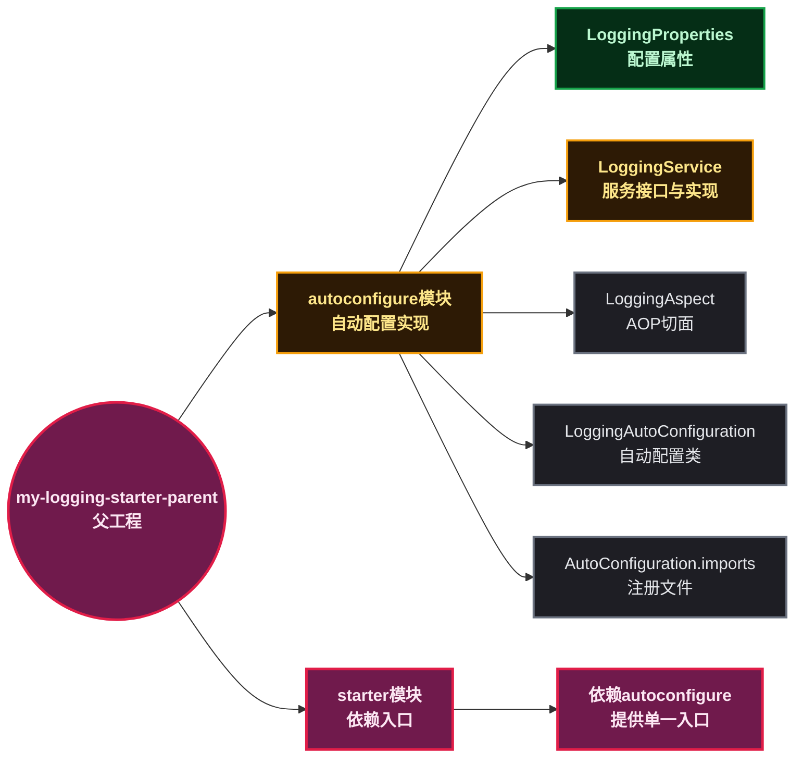
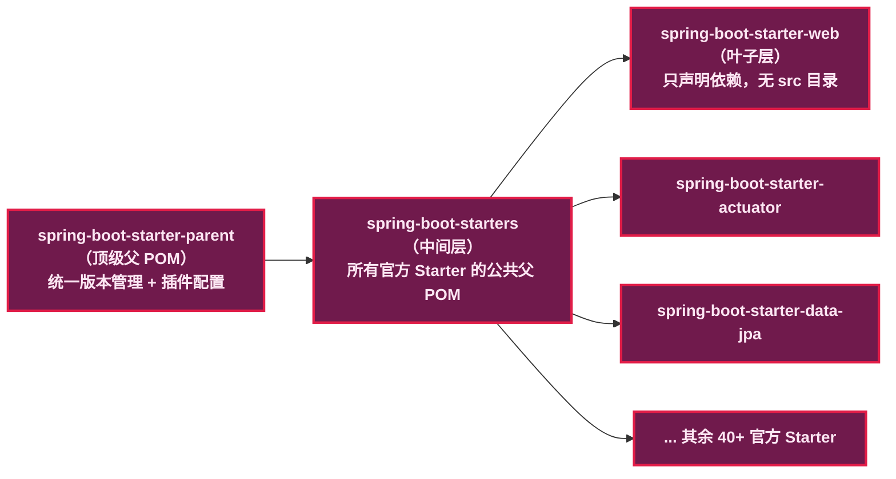
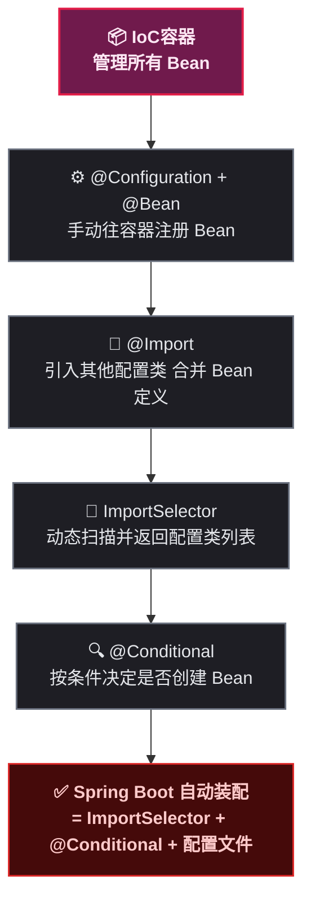
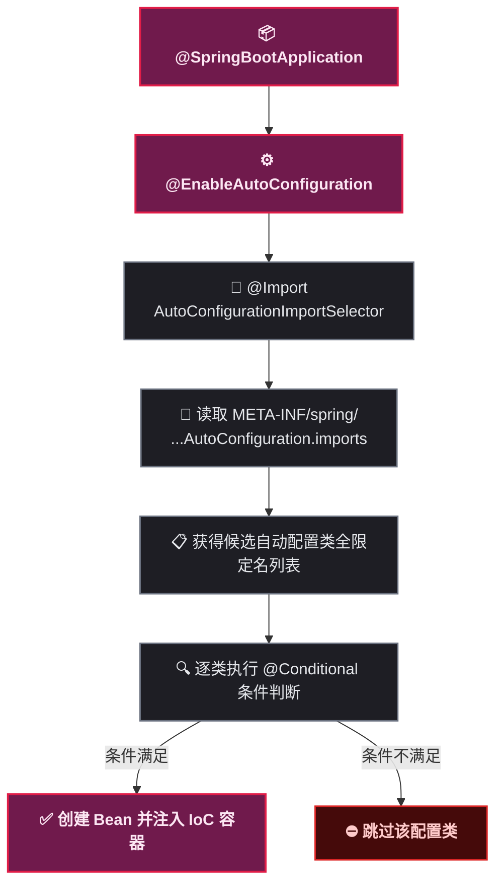
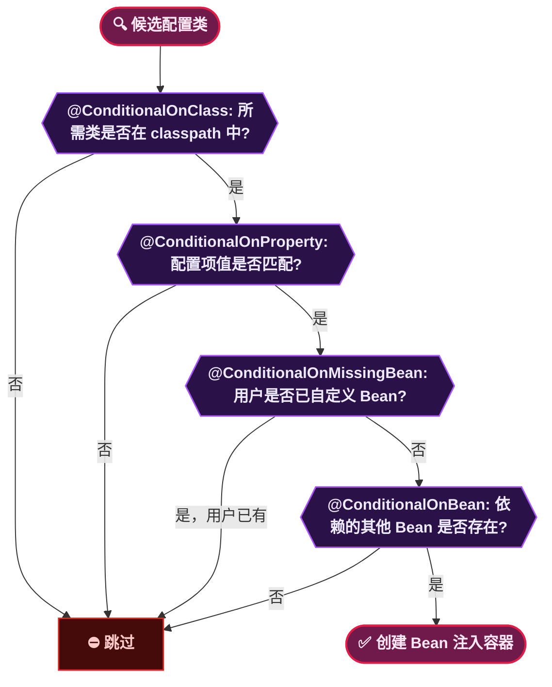
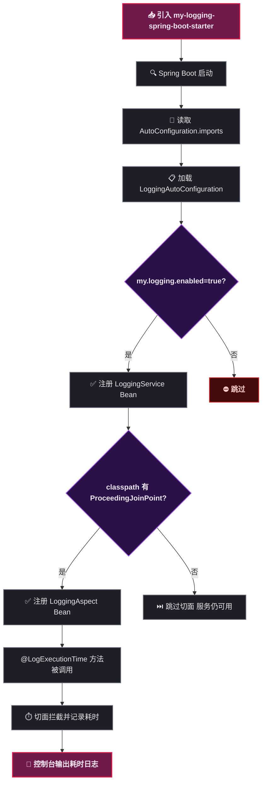

# Spring Boot Starter 封装实践报告：从自动装配原理到手写 Starter

## 🎯 第 1 步：目标说明

某开发者在日常工作中频繁需要为项目集成日志记录、性能监控、消息通知等功能。每次引入新功能时，都要重复编写相似的配置类、注册 Bean、管理依赖——这些步骤机械而繁琐。Spring Boot Starter 正是为解决这一问题而设计的机制：它把<strong>自动配置类</strong>与<strong>依赖管理</strong>打包成一个独立的 Jar 包，引用一个 Starter 依赖就能让某个功能"开箱即用"。

本实践报告的目标如下：

- 理解 Spring Boot 自动装配（Auto Configuration）的核心原理与执行流程
- 动手封装一个名为 `my-logging-spring-boot-starter` 的自定义 Starter，功能是<strong>自动记录标注了特定注解的方法的执行耗时</strong>
- 在测试项目中引用自定义 Starter，验证功能正常工作

> 📌 前置知识：本报告假设读者已经掌握 Java 基础语法、Maven 依赖管理与模块化工程、Spring 的 `@Bean` 与 `@Configuration` 注解、Spring Boot 基本使用方式。

## 📋 第 2 步：前置条件

开始实践前，确保以下软件已正确安装。

| 软件/依赖 | 最低版本 | 说明 |
|-----------|:---:|------|
| JDK | 17 | Spring Boot 3.2.0 要求 Java 17 及以上 |
| Maven | 3.6.3 | 项目构建、依赖管理与打包 |
| IDE | 任意 | IntelliJ IDEA（社区版即可）或 VS Code |

<strong>验证安装：</strong>

```bash
java --version
# 期望输出示例：openjdk 17.0.9 2023-10-17 LTS

mvn --version
# 期望输出示例：Apache Maven 3.9.5
```

> ⚠️ 新手提示：如果 `java --version` 或 `mvn --version` 提示"命令未找到"，说明对应软件没有安装或没有配置环境变量。JDK 需要设置 `JAVA_HOME` 并将 `%JAVA_HOME%\bin` 加入 `PATH`。Maven 需要将 `MAVEN_HOME/bin` 加入 `PATH`。完成配置后<strong>重新打开终端</strong>再执行验证命令。

## 🔧 第 3 步：环境搭建

本节创建实践项目的完整工程结构。一个自定义 Starter 由两个 Maven 模块组成：

- <strong>autoconfigure 模块</strong>：存放自动配置类、配置属性类、核心服务实现、注册文件（`AutoConfiguration.imports`）
- <strong>starter 模块</strong>：一个空模块，只声明对 autoconfigure 模块的依赖，为用户提供唯一的依赖入口



### 📦 3.1 创建父工程

```bash
mkdir my-logging-starter-parent
cd my-logging-starter-parent
```

创建父工程 `pom.xml`：

```xml
<?xml version="1.0" encoding="UTF-8"?>
<project xmlns="http://maven.apache.org/POM/4.0.0"
         xmlns:xsi="http://www.w3.org/2001/XMLSchema-instance"
         xsi:schemaLocation="http://maven.apache.org/POM/4.0.0
         http://maven.apache.org/xsd/maven-4.0.0.xsd">
    <modelVersion>4.0.0</modelVersion>

    <groupId>com.example</groupId>
    <artifactId>my-logging-spring-boot-starter-parent</artifactId>
    <version>1.0.0</version>
    <packaging>pom</packaging>

    <parent>
        <groupId>org.springframework.boot</groupId>
        <artifactId>spring-boot-starter-parent</artifactId>
        <version>3.2.0</version>
        <relativePath/>
    </parent>

    <modules>
        <module>my-logging-spring-boot-autoconfigure</module>
        <module>my-logging-spring-boot-starter</module>
    </modules>

    <properties>
        <java.version>17</java.version>
    </properties>
</project>
```

<strong>关键点说明：</strong>

- `<packaging>pom</packaging>`：父工程不产出 Jar，仅管理子模块
- 继承 `spring-boot-starter-parent`：统一管理 Spring Boot 相关依赖版本，避免版本冲突
- `<relativePath/>`：告诉 Maven 从远程仓库查找父 POM，不从本地相对路径查找

### ⚙️ 3.2 创建 autoconfigure 模块

```bash
mkdir -p my-logging-spring-boot-autoconfigure/src/main/java/com/example/logging
mkdir -p my-logging-spring-boot-autoconfigure/src/main/resources/META-INF/spring
```

创建 `my-logging-spring-boot-autoconfigure/pom.xml`：

```xml
<?xml version="1.0" encoding="UTF-8"?>
<project xmlns="http://maven.apache.org/POM/4.0.0"
         xmlns:xsi="http://www.w3.org/2001/XMLSchema-instance"
         xsi:schemaLocation="http://maven.apache.org/POM/4.0.0
         http://maven.apache.org/xsd/maven-4.0.0.xsd">
    <modelVersion>4.0.0</modelVersion>

    <parent>
        <groupId>com.example</groupId>
        <artifactId>my-logging-spring-boot-starter-parent</artifactId>
        <version>1.0.0</version>
    </parent>

    <artifactId>my-logging-spring-boot-autoconfigure</artifactId>

    <dependencies>
        <dependency>
            <groupId>org.springframework.boot</groupId>
            <artifactId>spring-boot-autoconfigure</artifactId>
        </dependency>
        <dependency>
            <groupId>org.springframework.boot</groupId>
            <artifactId>spring-boot-starter-aop</artifactId>
            <optional>true</optional>
        </dependency>
    </dependencies>
</project>
```

> ⚠️ 新手提示：`<optional>true</optional>` 表示该依赖不会传递给引用本模块的项目。换句话说，用户的 Spring Boot 项目如果希望 AOP 切面生效，需要自行引入 `spring-boot-starter-aop`。这样做的好处是——不希望使用 AOP 功能的用户不会被强制引入不需要的依赖。

### 🚀 3.3 创建 starter 模块

```bash
mkdir -p my-logging-spring-boot-starter
```

创建 `my-logging-spring-boot-starter/pom.xml`：

```xml
<?xml version="1.0" encoding="UTF-8"?>
<project xmlns="http://maven.apache.org/POM/4.0.0"
         xmlns:xsi="http://www.w3.org/2001/XMLSchema-instance"
         xsi:schemaLocation="http://maven.apache.org/POM/4.0.0
         http://maven.apache.org/xsd/maven-4.0.0.xsd">
    <modelVersion>4.0.0</modelVersion>

    <parent>
        <groupId>com.example</groupId>
        <artifactId>my-logging-spring-boot-starter-parent</artifactId>
        <version>1.0.0</version>
    </parent>

    <artifactId>my-logging-spring-boot-starter</artifactId>

    <dependencies>
        <dependency>
            <groupId>com.example</groupId>
            <artifactId>my-logging-spring-boot-autoconfigure</artifactId>
            <version>${project.version}</version>
        </dependency>
    </dependencies>
</project>
```

<strong>Starter 模块不需要 `src` 目录</strong>——它只是一个依赖聚合入口，所有代码都在 autoconfigure 模块中。

最终项目结构：

```
my-logging-starter-parent/
├── pom.xml
├── my-logging-spring-boot-autoconfigure/
│   ├── pom.xml
│   └── src/main/
│       ├── java/com/example/logging/
│       └── resources/META-INF/spring/
└── my-logging-spring-boot-starter/
    └── pom.xml
```

### 🔍 3.4 对照官方 Starter——在 IDEA 中查看 `spring-boot-starter-web` 的 POM

很多初学者会疑惑：为什么我们自己封装的 Starter 要拆成 parent → autoconfigure → starter 三层？其实 Spring Boot 官方的 Starter 也是同样的结构。在 IDEA 中按住 Ctrl 点击任意 Spring Boot 项目 `pom.xml` 中的 `spring-boot-starter-web` 依赖，即可跳转到它的 POM 文件：

```xml
<?xml version="1.0" encoding="UTF-8"?>
<project xsi:schemaLocation="http://maven.apache.org/POM/4.0.0
         http://maven.apache.org/xsd/maven-4.0.0.xsd"
         xmlns="http://maven.apache.org/POM/4.0.0"
         xmlns:xsi="http://www.w3.org/2001/XMLSchema-instance">
    <modelVersion>4.0.0</modelVersion>

    <!-- 注意这里的 parent -->
    <parent>
        <groupId>org.springframework.boot</groupId>
        <artifactId>spring-boot-starters</artifactId>
        <version>3.2.0</version>
    </parent>

    <artifactId>spring-boot-starter-web</artifactId>

    <dependencies>
        <!-- 只声明依赖，没有任何 Java 代码 -->
        <dependency>
            <groupId>org.springframework.boot</groupId>
            <artifactId>spring-boot-starter</artifactId>
        </dependency>
        <dependency>
            <groupId>org.springframework.boot</groupId>
            <artifactId>spring-boot-starter-json</artifactId>
        </dependency>
        <dependency>
            <groupId>org.springframework.boot</groupId>
            <artifactId>spring-boot-starter-tomcat</artifactId>
        </dependency>
        <dependency>
            <groupId>org.springframework.boot</groupId>
            <artifactId>spring-boot-starter-web</artifactId>
        </dependency>
        <!-- ... 其余依赖省略 -->
    </dependencies>
</project>
```

再按住 Ctrl 点击 `<parent>` 中的 `spring-boot-starters`，可以看到它的父 POM 又指向了 `spring-boot-starter-parent`。整理出来的继承链如下：



<strong>对比我们自定义的 Starter 结构：</strong>

| 层级 | 官方 Starter | 我们的自定义 Starter | 作用 |
|------|-------------|---------------------|------|
| 顶级父 POM | `spring-boot-starter-parent` | `my-logging-starter-parent`（继承 `spring-boot-starter-parent`） | 统一管理依赖版本 |
| 中间层 | `spring-boot-starters` | 无（直接合并到 parent） | 官方有 40+ Starter 需要统一父 POM，我们只有 1 个所以省略 |
| Starter 模块 | `spring-boot-starter-web`（纯依赖聚合） | `my-logging-spring-boot-starter`（纯依赖聚合） | 给用户提供单一依赖入口 |
| 实现模块 | `spring-boot-autoconfigure`（官方单独维护） | `my-logging-spring-boot-autoconfigure` | 存放自动配置类与注册文件 |

<strong>一句话总结：</strong> 我们自定义 Starter 的三层结构（parent → autoconfigure → starter）并不是凭空设计的，而是对 Spring Boot 官方 Starter 结构的简化版复刻。官方因为有 40 多个 Starter 需要统一管理，所以多了一层 `spring-boot-starters`；我们只有一个 Starter，parent 直接继承 `spring-boot-starter-parent` 就够了。

> ⚠️ 新手提示：在 IDEA 中查看官方 Starter POM 是学习 Spring Boot 设计模式的最佳途径。遇到不确定的写法时，Ctrl + 左键点进去看看官方是怎么写的，比任何博客都权威。

## 📚 第 4 步：前置知识——理解自动装配需要掌握的基础概念

Spring Boot 的自动装配（Auto Configuration）不是凭空出现的黑魔法，它是 Spring Framework 几个基础机制层层叠加、组合运用的结果。对于新手来说，直接跳到自动装配的源码分析往往会感到困惑——不清楚 `@Import` 是什么、不知道 `ImportSelector` 做了什么、不明白 `@Conditional` 的判断逻辑从哪里来。

本节把这几个前置概念逐一讲清楚，每个概念都配合实际可运行的示例代码。理解了这些基础之后，第 5 步的自动装配流程讲解就会变得顺畅。

> 📌 前置知识：本节假设读者已经了解 Spring 的基本用法（`@Component`、`@Service`、`@Autowired`）。如果对这些注解还不熟悉，建议先阅读 Spring 入门教程。

### 📦 4.1 IoC 容器——Spring 的"大管家"

IoC（Inversion of Control，控制反转）是 Spring 框架的核心理念。在传统 Java 开发中，对象由开发者通过 `new` 关键字主动创建；在 Spring 中，对象的创建和生命周期管理全部交给 IoC 容器（ApplicationContext）。

依赖注入（Dependency Injection，DI）是 IoC 的具体实现方式——容器自动将某个对象所依赖的其他对象"注入"给它，而不是让对象自己去查找或创建依赖。

<strong>一个直观的对比：</strong>

| 方式 | 代码 | 谁在控制 |
|------|------|---------|
| 传统方式 | `UserService service = new UserService(new UserRepository());` | 开发者手动 new |
| Spring DI | `@Autowired private UserService service;` | IoC 容器自动注入 |

> ⚠️ 新手提示：可以把 IoC 容器理解为一个巨大的 `Map<String, Object>`，键是 Bean 的名称，值是 Bean 的实例。Spring 启动时把各种 Bean 创建好放进这个 Map，需要时通过类型或名称取出来。自动装配的本质就是——Spring Boot 根据当前项目环境，<strong>自动决定应该往这个 Map 里放哪些 Bean</strong>。

### ⚙️ 4.2 @Configuration 与 @Bean——往容器中注册 Bean

在 Spring 中，往 IoC 容器注册 Bean 有两种方式。

<strong>方式一：`@Component` 系列注解（类上声明）</strong>

```java
@Component
public class UserService {
    // Spring 会自动扫描并创建 UserService 实例放入容器
}
```

<strong>方式二：`@Configuration` + `@Bean`（方法上声明）</strong>

```java
@Configuration
public class AppConfig {
    @Bean
    public UserService userService() {
        return new UserService(userRepository());
    }

    @Bean
    public UserRepository userRepository() {
        return new UserRepository();
    }
}
```

方式二适合创建第三方类（无法在源码上加 `@Component`）、需要复杂初始化逻辑的 Bean、或者需要条件判断的场景。<strong>Spring Boot 的自动配置类使用的就是方式二。</strong>

<strong>实际示例——模拟一个简单的配置类：</strong>

```java
@Configuration
public class DatabaseConfig {

    @Bean
    public DataSource dataSource() {
        HikariDataSource ds = new HikariDataSource();
        ds.setJdbcUrl("jdbc:mysql://localhost:3306/mydb");
        ds.setUsername("root");
        ds.setPassword("123456");
        ds.setMaximumPoolSize(20);
        return ds;
    }
}
```

Spring 启动时会调用 `dataSource()` 方法，将返回的 `HikariDataSource` 对象放入容器。其他 Bean 可以通过 `@Autowired` 获取这个 `DataSource`，无需关心其复杂的初始化过程。

> ⚠️ 新手提示：`@Configuration` 标注的类本身也会被 Spring 当作一个 Bean 注册到容器中（默认是 CGLIB 代理后的单例）。这意味着 `dataSource()` 方法被多次调用时，Spring 会拦截调用并直接返回容器中已有的实例，而不会重复创建。

### 🔗 4.3 @Import——把多个配置类拼在一起

当一个项目的配置逻辑越来越多时，把所有 `@Bean` 都写在一个 `@Configuration` 类里会变得臃肿。`@Import` 的作用是——在一个配置类中引入另一个配置类，让 Spring 把两者的 Bean 定义合并到一起。

```java
@Configuration
@Import({DatabaseConfig.class, CacheConfig.class, MqConfig.class})
public class AppConfig {
    // AppConfig 自己的 @Bean 定义
}
```

以上写法等价于 Spring 同时读取了 `AppConfig`、`DatabaseConfig`、`CacheConfig`、`MqConfig` 四个配置类。

<strong>Spring Boot 的 `@SpringBootApplication` 内部就用了 `@Import`：</strong>

```java
@SpringBootConfiguration
@EnableAutoConfiguration       // 内部有 @Import(AutoConfigurationImportSelector.class)
@ComponentScan
public @interface SpringBootApplication {
}
```

`@EnableAutoConfiguration` 通过 `@Import` 引入了 `AutoConfigurationImportSelector` 这个关键类——它是自动装配的"调度中心"。

### 🌉 4.4 ImportSelector——批量导入的桥梁

`@Import` 只能一个一个地列出要导入的类名。如果希望<strong>动态决定</strong>要导入哪些配置类（比如根据 classpath 中有哪些 Jar 包来决定），就需要用到 `ImportSelector` 接口。

```java
public interface ImportSelector {
    String[] selectImports(AnnotationMetadata importingClassMetadata);
}
```

`selectImports()` 返回一组类的全限定名，Spring 会把这些类当作配置类去加载。

<strong>手动模拟一个最简单的 ImportSelector：</strong>

```java
public class MyImportSelector implements ImportSelector {
    @Override
    public String[] selectImports(AnnotationMetadata metadata) {
        // 动态决定返回哪些配置类
        return new String[]{
            "com.example.DatabaseConfig",
            "com.example.CacheConfig"
        };
    }
}

// 使用方式
@Configuration
@Import(MyImportSelector.class)
public class AppConfig {
}
```

Spring Boot 的 `AutoConfigurationImportSelector` 就是这个接口的实现——它的 `selectImports()` 方法会读取所有 Jar 包中的 `AutoConfiguration.imports` 文件，汇总出候选配置类列表。这个方法的执行逻辑正是第 5 步要深入讲解的内容。

### 🎛️ 4.5 @Conditional——有条件的 Bean 注册

前面的例子中，所有 `@Bean` 方法都会被无条件执行。但实际场景中，往往需要根据当前环境来决定是否创建某个 Bean。例如：
- classpath 中有某个类才创建
- 配置文件中某个属性的值符合条件才创建
- 容器中已经存在某个 Bean 才创建

Spring 提供了 `@Conditional` 注解来实现条件判断：

```java
@Configuration
public class AppConfig {

    @Bean
    @Conditional(MyCondition.class)  // 只有 MyCondition.matches() 返回 true 才创建
    public AdvancedService advancedService() {
        return new AdvancedService();
    }
}
```

`MyCondition` 需要实现 `Condition` 接口：

```java
public class MyCondition implements Condition {
    @Override
    public boolean matches(ConditionContext context, AnnotatedTypeMetadata metadata) {
        // 检查 classpath 中是否存在 MySQL 驱动类
        try {
            Class.forName("com.mysql.cj.jdbc.Driver");
            return true;   // 有 MySQL 驱动 → 创建 AdvancedService
        } catch (ClassNotFoundException e) {
            return false;  // 没有 → 不创建
        }
    }
}
```

Spring Boot 在这个基础上封装了一系列常用条件注解，省去手写 `Condition` 实现类的麻烦：

| 条件注解 | 等价的手写逻辑 | 典型场景 |
|---------|-------------|---------|
| `@ConditionalOnClass(name = "com.mysql.cj.jdbc.Driver")` | `Class.forName(...)` 成功返回 true | 有 MySQL 驱动才注册对应 Bean |
| `@ConditionalOnMissingBean(UserService.class)` | `context.getBeanFactory().containsBean(...)` 返回 false | 用户没定义自己的 Bean 才使用默认值 |
| `@ConditionalOnProperty(prefix = "my.logging", name = "enabled", havingValue = "true")` | 读取配置文件并比较值 | 用户可通过配置开关功能 |
| `@ConditionalOnBean(DataSource.class)` | 检查容器中是否有 `DataSource` Bean | 依赖其它 Bean 存在才创建 |

> ⚠️ 新手提示：条件注解的本质就是"if 判断"——把 Java 代码中的 `if (xxx) { createBean(); }` 变成了注解 `@ConditionalOnXxx`。Spring Boot 启动时逐一检查这些条件，就像一条流水线上的质检员，不符合条件的配置类被直接跳过。

### 🔪 4.6 AOP 切面基础——拦截方法调用的机制

本实践的 Starter 用 AOP 切面来拦截方法并记录耗时。对于不熟悉 AOP 的读者，这里做简要介绍。

AOP（Aspect Oriented Programming，面向切面编程）的目标是把"横切关注点"（如日志记录、事务管理、权限校验）从业务代码中分离出来，统一管理。

<strong>没有 AOP 时的写法（日志散落在每个方法里）：</strong>

```java
public void serviceMethod1() {
    long start = System.currentTimeMillis();
    // 业务逻辑...
    long time = System.currentTimeMillis() - start;
    log.info("serviceMethod1 耗时: {}ms", time);
}

public void serviceMethod2() {
    long start = System.currentTimeMillis();
    // 业务逻辑...
    long time = System.currentTimeMillis() - start;
    log.info("serviceMethod2 耗时: {}ms", time);
}
```

<strong>使用 AOP 后（日志逻辑集中在一处）：</strong>

```java
@Aspect
public class LoggingAspect {
    @Around("execution(* com.example.service.*.*(..))")
    public Object logTime(ProceedingJoinPoint joinPoint) throws Throwable {
        long start = System.currentTimeMillis();
        try {
            return joinPoint.proceed();  // 执行原始方法
        } finally {
            long time = System.currentTimeMillis() - start;
            log.info("{} 耗时: {}ms", joinPoint.getSignature(), time);
        }
    }
}
// 业务方法中不再有任何日志代码！
```

核心术语速查：

| 术语 | 含义 | 本实践中的对应 |
|------|------|--------------|
| Aspect（切面） | 横切逻辑的类，标注 `@Aspect` | `LoggingAspect` 类 |
| Advice（通知） | 切面中的具体逻辑方法 | `around()` 方法 |
| JoinPoint（连接点） | 被拦截的方法 | 所有标注了 `@LogExecutionTime` 的方法 |
| ProceedingJoinPoint | `@Around` 专用的连接点，可控制原始方法是否执行 | `joinPoint.proceed()` |
| Pointcut（切入点） | 拦截规则，决定拦截哪些方法 | `@annotation(LogExecutionTime)` |


> ⚠️ 新手提示：Spring AOP 默认使用<strong>动态代理</strong>——Spring 不会直接给你原始对象，而是给你一个"代理对象"。当调用代理对象的方法时，代理先执行切面逻辑，再调用原始方法，最后再执行切面的收尾逻辑。这就是 `joinPoint.proceed()` 的原理：`proceed` 的意思是"继续"，即让原始方法继续执行。

### 🔗 4.7 概念串联——从传统 Spring 到自动装配

以下流程图将以上 6 个基础概念串联起来，展示它们如何层层递进，最终形成 Spring Boot 的自动装配机制。



<strong>一句话总结前置知识：</strong> Spring Boot 自动装配 = `@Import` 引入 `ImportSelector` → `selectImports()` 从 `AutoConfiguration.imports` 文件中读取候选配置类列表 → 用 `@Conditional` 逐一过滤 → 满足条件的 `@Configuration` 类中的 `@Bean` 方法被执行，Bean 进入 IoC 容器。

## ⚙️ 第 5 步：理解 Spring Boot 自动装配原理

有了第 4 步的基础概念，本节来看 Spring Boot 是怎样把它们组合起来，做到"引入一个 Jar 包，功能自动生效"的。

### 🔄 5.1 自动装配执行流程

Spring Boot 的自动装配起点是 `@SpringBootApplication` 注解，它的源码内部组合了 `@EnableAutoConfiguration`，而后者通过 `@Import` 引入了 `AutoConfigurationImportSelector`——这是整套自动装配机制的核心入口。



<strong>逐步解释以上流程：</strong>

| 步骤 | 组件/注解 | 作用 |
|------|----------|------|
| 1 | `@SpringBootApplication` | 复合注解（`@SpringBootConfiguration` + `@EnableAutoConfiguration` + `@ComponentScan`），标记主启动类 |
| 2 | `@EnableAutoConfiguration` | 自动装配的总开关，内部通过 `@Import(AutoConfigurationImportSelector.class)` 委托给选择器 |
| 3 | `AutoConfigurationImportSelector` | 实现 `ImportSelector` 接口，核心方法是 `selectImports()`，负责读取所有候选自动配置类的全限定名 |
| 4 | 配置文件读取 | Spring Boot 3.x 从 `META-INF/spring/org.springframework.boot.autoconfigure.AutoConfiguration.imports` 中读取，每个 Starter 的 autoconfigure 模块都包含该文件 |
| 5 | `@Conditional` 条件过滤 | 对候选列表中的每个配置类执行条件判断，只有条件全部满足才会真正创建 Bean |
| 6 | Bean 注入 | 条件满足的配置类中，`@Bean` 方法返回的对象被 Spring IoC 容器管理，应用的其它部分可通过 `@Autowired` 注入使用 |

### 🔗 5.2 条件注解的过滤链

`@Conditional` 系列注解是自动装配"按需生效"的关键。一个自动配置类上通常标注了多个条件注解，它们构成一条过滤链。

> 📌 前置知识——classpath（类路径）：理解条件注解需要先搞清楚 classpath 是什么。classpath 是 JVM 查找 `.class` 文件的路径集合，包括项目 `target/classes/` 目录及所有 Maven 依赖 Jar 包。`@ConditionalOnClass` 判断"classpath 中是否存在某类"的本质是——JVM 的类加载器能否在 classpath 中找到该类的 `.class` 文件。如果不清楚 classpath 与类加载的关系，建议先了解 <strong>JVM 类加载器的双亲委派模型</strong>（重点看 `ClassLoader.getResource()` 的查找逻辑）。



<strong>常用条件注解速查：</strong>

| 条件注解 | 判断逻辑 | 典型场景 |
|---------|---------|---------|
| `@ConditionalOnClass` | classpath 中存在指定类 | AOP 切面仅在存在 `JoinPoint` 时注册 |
| `@ConditionalOnMissingClass` | classpath 中不存在指定类 | 新旧版本兼容 |
| `@ConditionalOnProperty` | 配置文件中某属性有/无或匹配特定值 | 用户可通过 `enabled=false` 关闭整个 Starter |
| `@ConditionalOnMissingBean` | 容器中不存在指定类型的 Bean | 允许用户覆盖 Starter 提供的默认 Bean |
| `@ConditionalOnBean` | 容器中存在指定类型的 Bean | 某个 Bean 依赖另一个 Bean 先被创建 |
| `@ConditionalOnJava` | Java 版本满足范围条件 | 不同 JDK 版本使用不同实现 |

> ⚠️ 新手提示：自动装配的核心思路可以概括为——Spring Boot 启动时扫描所有 Jar 包中的 `AutoConfiguration.imports` 注册文件，得到候选配置类列表；然后逐一检查每个配置类的 `@Conditional` 条件，根据当前项目的实际环境（有哪些类、有哪些配置、有哪些 Bean）决定是否激活该配置。

### 🔄 5.3 Spring Boot 3.x 的配置注册变更

Spring Boot 3.x 与 2.x 在自动配置注册方式上有显著差异，封装 Starter 时务必使用正确的方式：

| 项目 | Spring Boot 2.x | Spring Boot 3.x |
|------|----------------|----------------|
| 配置文件路径 | `META-INF/spring.factories` | `META-INF/spring/org.springframework.boot.autoconfigure.AutoConfiguration.imports` |
| 文件格式 | `org.springframework.boot.autoconfigure.EnableAutoConfiguration=\com.example.XxxAutoConfiguration` | 纯文本，每行一个全限定类名 `com.example.XxxAutoConfiguration` |
| 自动配置类注解 | `@Configuration` | `@AutoConfiguration`（推荐） |
| 条件注解位置 | 类上或方法上 | 类上或方法上（不变） |

本实践使用 Spring Boot 3.2.0，全部采用新版注册方式。

## 💻 第 6 步：分步实践——编写 autoconfigure 模块代码

理论准备就绪，本节开始实际编写自定义 Starter 的全部 Java 代码。每小节包含操作步骤、完整代码、预期结果与常见排错。

### 📝 6.1 定义配置属性类

配置属性类让用户能在 `application.yml` 或 `application.properties` 中通过 `my.logging` 前缀控制 Starter 的行为。

<strong>操作：</strong> 在 `my-logging-spring-boot-autoconfigure/src/main/java/com/example/logging/` 目录下创建 `LoggingProperties.java`：

```java
package com.example.logging;

import org.springframework.boot.context.properties.ConfigurationProperties;

@ConfigurationProperties(prefix = "my.logging")
public class LoggingProperties {

    /** 是否启用日志记录，默认 true */
    private boolean enabled = true;

    /** 日志输出级别，默认 INFO */
    private String level = "INFO";

    /** 日志前缀，默认 [MY-LOG] */
    private String prefix = "[MY-LOG]";

    // ---------- getter / setter ----------
    public boolean isEnabled() {
        return enabled;
    }
    public void setEnabled(boolean enabled) {
        this.enabled = enabled;
    }
    public String getLevel() {
        return level;
    }
    public void setLevel(String level) {
        this.level = level;
    }
    public String getPrefix() {
        return prefix;
    }
    public void setPrefix(String prefix) {
        this.prefix = prefix;
    }
}
```

<strong>关键点说明：</strong>

- `@ConfigurationProperties(prefix = "my.logging")`：Spring Boot 会自动将 `application.yml` 中以 `my.logging` 为前缀的配置项与此类的字段做<strong>松弛绑定</strong>（Relaxed Binding，即 `my.logging.max-retry-count` 会自动映射到 `maxRetryCount` 字段）
- 三个字段均有默认值——即使用户不做任何配置，Starter 也能正常工作，体现了"约定优于配置"的设计理念
- Spring Boot 的 Configuration Processor 在编译时会自动生成 `spring-configuration-metadata.json`，让 IDE 在用户编写 `application.yml` 时提供自动提示

> 📌 前置知识——松弛绑定的底层机制：Spring Boot 通过 `ConfigurationPropertiesBindingPostProcessor`（一个 `BeanPostProcessor` 实现）在 Bean 初始化阶段读取 `application.yml`，递归地将配置值映射到 JavaBean 属性。映射规则是——去掉配置项中的 `-` 或 `_` 并将后续字母大写，匹配 JavaBean 的字段名（驼峰命名）。需要了解的前置知识点：<strong>JavaBean 规范</strong>（getter/setter 命名约定，重点看 `Introspector` 的去首字母大写/小写规则）、<strong>Spring BeanPostProcessor 后置处理机制</strong>（重点看 `postProcessBeforeInitialization` 的执行时机）。

> ⚠️ 新手提示：如果 IDE 中出现"Spring Boot Configuration Annotation Processor not found in classpath"的警告，可在 autoconfigure 模块的 `pom.xml` 中添加以下依赖消除警告（非必须，不影响功能）：
> ```xml
> <dependency>
>     <groupId>org.springframework.boot</groupId>
>     <artifactId>spring-boot-configuration-processor</artifactId>
>     <optional>true</optional>
> </dependency>
> ```

### 📋 6.2 实现日志记录服务

定义服务接口 `LoggingService` 与其默认实现 `DefaultLoggingService`。

<strong>操作：</strong> 在 `my-logging-spring-boot-autoconfigure/src/main/java/com/example/logging/` 目录下创建 `LoggingService.java`：

```java
package com.example.logging;

public interface LoggingService {
    /** 记录一般日志 */
    void log(String message);

    /** 记录方法执行耗时，单位毫秒 */
    void log(String methodName, long executionTimeMs);
}
```

<strong>操作：</strong> 同目录下创建 `DefaultLoggingService.java`：

```java
package com.example.logging;

import org.slf4j.Logger;
import org.slf4j.LoggerFactory;

public class DefaultLoggingService implements LoggingService {

    private static final Logger log =
            LoggerFactory.getLogger(DefaultLoggingService.class);

    private final LoggingProperties properties;

    public DefaultLoggingService(LoggingProperties properties) {
        this.properties = properties;
    }

    @Override
    public void log(String message) {
        if (!properties.isEnabled()) {
            return;
        }
        log.info("{} {}", properties.getPrefix(), message);
    }

    @Override
    public void log(String methodName, long executionTimeMs) {
        if (!properties.isEnabled()) {
            return;
        }
        log.info("{} 方法[{}] 执行耗时: {}ms",
                properties.getPrefix(), methodName, executionTimeMs);
    }
}
```

<strong>关键点说明：</strong>

- 使用 <strong>SLF4J</strong> 作为日志门面，不直接依赖 Logback 或 Log4j2，与 Spring Boot 的日志体系保持一致
- 每次写日志前检查 `properties.isEnabled()`——保证用户设置 `my.logging.enabled=false` 后日志完全静默
- 构造函数注入 `LoggingProperties`，由 Spring IoC 容器自动装配

### 🔪 6.3 实现 AOP 切面（自动拦截方法耗时）

为了让用户只用加一个注解就能记录方法耗时，需要定义一个自定义注解和一个 AOP 切面。

<strong>操作：</strong> 创建 `LogExecutionTime.java` 注解：

```java
package com.example.logging;

import java.lang.annotation.*;

@Target(ElementType.METHOD)
@Retention(RetentionPolicy.RUNTIME)
@Documented
public @interface LogExecutionTime {
    /** 可选的方法别名，不填则使用方法签名 */
    String value() default "";
}
```

> 📌 前置知识——Java 注解元注解与 AspectJ 切入点表达式：
> - <strong>注解的元注解</strong>：`@Target(ElementType.METHOD)` 限定 `@LogExecutionTime` 只能贴在方法上，`@Retention(RetentionPolicy.RUNTIME)` 确保注解在运行时可通过反射读取（这是 AOP 切面能识别它的前提——编译时和字节码级别的注解在运行时无法被反射发现）。需要了解的前置知识点：<strong>Java 反射 API 中 `AnnotatedElement` 接口</strong>（重点看 `getAnnotation()` 和 `isAnnotationPresent()` 方法）、<strong>`@Retention` 三种策略</strong>（SOURCE/CLASS/RUNTIME）的区别。
> - <strong>AspectJ 切入点指示符</strong>：`@Around("@annotation(LogExecutionTime)")` 中的 `@annotation(..)` 是 AspectJ 的切入点指示符（Pointcut Designator），含义是"匹配所有标注了括号内指定注解的方法"。其它常见指示符还包括 `execution(..)`（按方法签名匹配）、`within(..)`（按类范围匹配）、`args(..)`（按参数类型匹配）。这里只需理解 `@annotation` 的语义即可，不需要深入整个 AspectJ 语法体系，但建议知道 <strong>Spring AOP 支持的 9 种切入点指示符</strong>的存在（重点看 `@annotation`、`execution`、`within` 三种最常用的）。

<strong>操作：</strong> 创建 `LoggingAspect.java` 切面：

```java
package com.example.logging;

import org.aspectj.lang.ProceedingJoinPoint;
import org.aspectj.lang.annotation.Around;
import org.aspectj.lang.annotation.Aspect;
import org.springframework.boot.autoconfigure.condition.ConditionalOnClass;

@Aspect
@ConditionalOnClass(ProceedingJoinPoint.class)
public class LoggingAspect {

    private final LoggingService loggingService;

    public LoggingAspect(LoggingService loggingService) {
        this.loggingService = loggingService;
    }

    @Around("@annotation(LogExecutionTime)")
    public Object around(ProceedingJoinPoint joinPoint) throws Throwable {
        long start = System.currentTimeMillis();
        try {
            return joinPoint.proceed();
        } finally {
            long executionTime = System.currentTimeMillis() - start;
            String methodName = joinPoint.getSignature().toShortString();
            loggingService.log(methodName, executionTime);
        }
    }
}
```

<strong>切面代码逐行解读：</strong>

| 代码片段 | 作用 |
|---------|------|
| `@Aspect` | 标识该类为 AspectJ 切面，Spring AOP 会自动识别 |
| `@ConditionalOnClass(ProceedingJoinPoint.class)` | <strong>关键</strong>——只在 classpath 中存在 AOP 类时才创建该切面。如果用户项目没有引入 `spring-boot-starter-aop`，此 Bean 不会被创建，避免 `ClassNotFoundException` |
| `@Around("@annotation(LogExecutionTime)")` | 环绕通知，拦截所有标注了 `@LogExecutionTime` 的方法 |
| `joinPoint.proceed()` | 执行被拦截的原始方法。如果方法抛出异常，异常会在此处向上传播 |
| `finally` 块 | <strong>无论方法正常返回还是抛出异常</strong>，都会记录耗时，确保异常场景下的耗时数据不丢失 |

> ⚠️ 新手提示：AOP 环绕通知的执行顺序是——先执行 `@Around` 方法中 `proceed()` 之前的代码 → 执行原始方法 → 执行 `proceed()` 之后的代码。本切面在 `proceed()` 前后分别记录时间戳，相减得到耗时。如果原始方法抛异常，`proceed()` 会抛出 `Throwable`，此时 `finally` 仍然会执行，保证耗时被记录。

### ⚙️ 6.4 实现自动配置类

这是整个 Starter 的<strong>核心类</strong>——将上面定义的所有组件组装在一起，并设置条件判断。

<strong>操作：</strong> 创建 `LoggingAutoConfiguration.java`：

```java
package com.example.logging;

import org.springframework.boot.autoconfigure.AutoConfiguration;
import org.springframework.boot.autoconfigure.condition.ConditionalOnClass;
import org.springframework.boot.autoconfigure.condition.ConditionalOnMissingBean;
import org.springframework.boot.autoconfigure.condition.ConditionalOnProperty;
import org.springframework.boot.context.properties.EnableConfigurationProperties;
import org.springframework.context.annotation.Bean;

@AutoConfiguration
@EnableConfigurationProperties(LoggingProperties.class)
@ConditionalOnProperty(prefix = "my.logging", name = "enabled",
        havingValue = "true", matchIfMissing = true)
public class LoggingAutoConfiguration {

    @Bean
    @ConditionalOnMissingBean
    public LoggingService loggingService(LoggingProperties properties) {
        return new DefaultLoggingService(properties);
    }

    @Bean
    @ConditionalOnMissingBean
    @ConditionalOnClass(name = "org.aspectj.lang.ProceedingJoinPoint")
    public LoggingAspect loggingAspect(LoggingService loggingService) {
        return new LoggingAspect(loggingService);
    }
}
```

<strong>每个注解的作用解释：</strong>

| 注解 | 所在位置 | 作用 |
|------|---------|------|
| `@AutoConfiguration` | 类 | Spring Boot 3.x 推荐使用，等价于 `@Configuration` 并标记为自动配置来源 |
| `@EnableConfigurationProperties` | 类 | 激活 `LoggingProperties`，使 `@ConfigurationProperties` 绑定生效 |
| `@ConditionalOnProperty` | 类 | 当 `my.logging.enabled=true` 或未配置该属性时，整个自动配置生效 |
| `@ConditionalOnMissingBean` | 方法 | 如果用户项目中已经定义了同类型的 Bean，则优先使用用户定义的，Starter 不覆盖 |
| `@ConditionalOnClass` | 方法 | 只在 classpath 中存在 `ProceedingJoinPoint` 时才注册切面 Bean |

> ⚠️ 新手提示：`matchIfMissing = true` 的含义是——当用户没有在配置文件中写 `my.logging.enabled` 时，视为 `true`。这样用户不做任何配置也能使用 Starter，符合"默认可用"的设计原则。

> 📌 前置知识——`@ConfigurationProperties` 与 `@EnableConfigurationProperties` 的区别：这是新手最常见的困惑点。`@ConfigurationProperties` 标注在 POJO 类上，仅<strong>声明</strong>"这个类的字段可以与配置文件绑定"（相当于标记接口）；`@EnableConfigurationProperties` 标注在 `@Configuration` 类上，<strong>实际激活</strong>绑定过程并将该 POJO 注册为容器中的 Bean。两者必须配合使用——只有 `@ConfigurationProperties` 没有 `@EnableConfigurationProperties`，绑定不会生效。补充知识点：如果 POJO 类同时标注了 `@Component`，则仅需 `@ConfigurationProperties` 即可生效（因为组件扫描会将其注册为 Bean，Spring Boot 自动完成绑定）。在 Starter 场景中，由于 Starter 的包路径不在用户项目 `@ComponentScan` 范围内，必须通过 `@EnableConfigurationProperties` 显式注册。需要了解的前置知识点：<strong>Spring Bean 注册的两种方式</strong>（组件扫描 vs 显式 `@Bean`/`@EnableXxx`）、<strong>`@ComponentScan` 的包扫描范围</strong>（默认只扫描启动类所在的包及其子包）。

### 📝 6.5 注册自动配置类

<strong>操作：</strong> 在 `my-logging-spring-boot-autoconfigure/src/main/resources/META-INF/spring/` 目录下创建文件：

<strong>文件名（必须一字不差）：</strong> `org.springframework.boot.autoconfigure.AutoConfiguration.imports`

<strong>文件内容：</strong>

```text
com.example.logging.LoggingAutoConfiguration
```

> ⚠️ 新手提示：这个文件和路径非常容易出错，以下是最常见的两个错误：
> 1. <strong>文件名写错</strong>——`AutoConfigure` 写成 `AutoConfig`、少写一个字母等。Spring Boot 3.x 的 `AutoConfigurationImportSelector` 会精确查找这个文件名，路径或文件名有误则配置类完全不会被加载
> 2. <strong>目录层级错误</strong>——必须是 `META-INF/spring/` 而非 `META-INF/spring.factories`。Spring Boot 2.x 使用 `META-INF/spring.factories`，3.x 已改用 `META-INF/spring/...AutoConfiguration.imports`

<strong>排错方法：</strong> 如果 Starter 引入后没有生效，第一步就检查这个文件的路径和内容。可以打开生成的 Jar 包确认：

```bash
jar tf my-logging-spring-boot-autoconfigure/target/*.jar | grep AutoConfiguration
# 期望看到：
# META-INF/spring/org.springframework.boot.autoconfigure.AutoConfiguration.imports
```

> 📌 前置知识——SPI 声明式服务发现机制：`AutoConfiguration.imports` 的工作方式借鉴了 Java SPI（Service Provider Interface，服务提供者接口）的设计思想——Jar 包通过在 `META-INF` 目录下放置特定名称的文件来<strong>声明</strong>"自己能提供什么服务"，宿主程序读取这些文件来<strong>发现并加载</strong>这些服务。Spring Boot 启动时，`AutoConfigurationImportSelector` 读取所有 Jar 包中 `META-INF/spring/...AutoConfiguration.imports` 这个文件，汇总出一份配置类清单——这与 Java 标准 SPI 中 `ServiceLoader` 读取 `META-INF/services/` 目录的逻辑是同一套模式。需要了解的前置知识点：<strong>Java SPI 基本概念</strong>（只需理解"接口-实现类-META-INF配置文件"三者的关系即可，重点看 `ServiceLoader.load()` 的查找路径 `META-INF/services/服务接口全限定名`），以及<strong>SPI 与 Spring Factories 的区别</strong>（SPI 是 Java 标准库提供的，Spring Factories 是 Spring Framework 封装的增强版，Spring Boot 3.x 的 `AutoConfiguration.imports` 是对 Spring Factories 的进一步简化）。

### 📂 6.6 完整项目结构检查

在打包之前，确认所有文件已创建完毕。以下是 IDEA 中自定义 Starter 工程的完整文件目录结构：

```
my-logging-starter-parent/                          ← 父工程（pom）
├── pom.xml                                         ← 父 POM，管理子模块与公共依赖版本
├── my-logging-spring-boot-autoconfigure/           ← autoconfigure 模块
│   ├── pom.xml                                     ← 声明 spring-boot-autoconfigure、spring-boot-starter-aop 依赖
│   └── src/
│       └── main/
│           ├── java/
│           │   └── com/
│           │       └── example/
│           │           └── logging/
│           │               ├── LoggingProperties.java          ← 配置属性类（@ConfigurationProperties）
│           │               ├── LoggingService.java             ← 日志服务接口
│           │               ├── DefaultLoggingService.java      ← 默认日志服务实现
│           │               ├── LogExecutionTime.java           ← 自定义注解（标记需要记录耗时的方法）
│           │               ├── LoggingAspect.java              ← AOP 切面（拦截 @LogExecutionTime）
│           │               └── LoggingAutoConfiguration.java   ← 自动配置类（组装所有 Bean）
│           └── resources/
│               └── META-INF/
│                   └── spring/
│                       └── org.springframework.boot.autoconfigure.AutoConfiguration.imports  ← 注册文件
└── my-logging-spring-boot-starter/                 ← starter 模块（依赖入口）
    └── pom.xml                                     ← 仅声明对 autoconfigure 模块的依赖，无 src 目录
```

上图与 IDEA 的 Project 视图中看到的目录结构一致。读者可以逐项核对，确保 6 个 Java 文件、1 个注册文件、3 个 `pom.xml` 全部就位后再执行下一步的打包命令。

### 📦 6.7 打包与本地安装

<strong>操作：</strong> 回到父工程目录，执行 Maven 打包命令：

```bash
cd my-logging-starter-parent
mvn clean install -DskipTests
```

<strong>期望输出：</strong>

```
[INFO] ------------------------------------------------------------------------
[INFO] Reactor Summary for my-logging-spring-boot-starter-parent 1.0.0:
[INFO]
[INFO] my-logging-spring-boot-starter-parent ............... SUCCESS [  0.2s]
[INFO] my-logging-spring-boot-autoconfigure ................ SUCCESS [  1.5s]
[INFO] my-logging-spring-boot-starter ...................... SUCCESS [  0.1s]
[INFO] ------------------------------------------------------------------------
[INFO] BUILD SUCCESS
[INFO] ------------------------------------------------------------------------
```

此时自定义 Starter 已安装到本地 Maven 仓库（`~/.m2/repository/com/example/`），其他项目可以通过 Maven 坐标引用。

<strong>常见排错：</strong>

| 错误信息 | 原因 | 解决方案 |
|---------|------|---------|
| `Could not find artifact ...my-logging-spring-boot-autoconfigure` | 子模块未先安装 | 在父工程目录执行 `mvn clean install`，不要只编译单个模块 |
| `Compilation failure: 程序包xxx不存在` | 缺少 Maven 依赖 | 检查 autoconfigure 的 `pom.xml` 是否添加了 `spring-boot-autoconfigure` 依赖 |
| `Failed to collect dependencies at ...spring-boot-starter-aop` | Maven 无法下载 | 检查网络连接，确保能访问 Maven 中央仓库 |

## 🚀 第 7 步：部署与验证——在 Spring Boot 项目中引用自定义 Starter

本节创建一个独立的 Spring Boot 测试项目，引入刚才封装的自定义 Starter，验证功能是否正常工作。

### 🧪 7.1 创建测试项目

使用 Maven 快速创建 Spring Boot 项目，或者在 IDE 中新建 Spring Boot 项目。以下为 Maven 创建方式：

```bash
mkdir my-logging-test
cd my-logging-test
```

创建 `pom.xml`：

```xml
<?xml version="1.0" encoding="UTF-8"?>
<project xmlns="http://maven.apache.org/POM/4.0.0"
         xmlns:xsi="http://www.w3.org/2001/XMLSchema-instance"
         xsi:schemaLocation="http://maven.apache.org/POM/4.0.0
         http://maven.apache.org/xsd/maven-4.0.0.xsd">
    <modelVersion>4.0.0</modelVersion>

    <parent>
        <groupId>org.springframework.boot</groupId>
        <artifactId>spring-boot-starter-parent</artifactId>
        <version>3.2.0</version>
        <relativePath/>
    </parent>

    <groupId>com.example</groupId>
    <artifactId>my-logging-test</artifactId>
    <version>1.0.0</version>

    <properties>
        <java.version>17</java.version>
    </properties>

    <dependencies>
        <dependency>
            <groupId>org.springframework.boot</groupId>
            <artifactId>spring-boot-starter-web</artifactId>
        </dependency>
        <dependency>
            <groupId>org.springframework.boot</groupId>
            <artifactId>spring-boot-starter-aop</artifactId>
        </dependency>
        <!-- 自定义 Starter -->
        <dependency>
            <groupId>com.example</groupId>
            <artifactId>my-logging-spring-boot-starter</artifactId>
            <version>1.0.0</version>
        </dependency>
    </dependencies>
</project>
```

创建 `src/main/resources/application.yml`：

```yaml
my:
  logging:
    enabled: true
    prefix: "[PERF-LOG]"
    level: INFO
```

创建 `src/main/java/com/example/test/` 目录，然后创建启动类 `Application.java`：

```java
package com.example.test;

import org.springframework.boot.SpringApplication;
import org.springframework.boot.autoconfigure.SpringBootApplication;

@SpringBootApplication
public class Application {
    public static void main(String[] args) {
        SpringApplication.run(Application.class, args);
    }
}
```

创建控制器 `TestController.java`：

```java
package com.example.test;

import com.example.logging.LogExecutionTime;
import org.springframework.web.bind.annotation.GetMapping;
import org.springframework.web.bind.annotation.RestController;

@RestController
public class TestController {

    @LogExecutionTime
    @GetMapping("/hello")
    public String hello() throws InterruptedException {
        // 模拟业务处理耗时 50ms
        Thread.sleep(50);
        return "Hello, Spring Boot Starter!";
    }

    @LogExecutionTime
    @GetMapping("/compute")
    public String compute() throws InterruptedException {
        // 模拟复杂计算耗时 200ms
        Thread.sleep(200);
        return "Computation done.";
    }

    @GetMapping("/ping")
    public String ping() {
        return "pong";
    }
}
```

### ✅ 7.2 启动应用并验证

```bash
cd my-logging-test
mvn spring-boot:run
```

启动后访问测试接口：

```bash
curl http://localhost:8080/hello
curl http://localhost:8080/compute
curl http://localhost:8080/ping
```

<strong>期望控制台输出：</strong>

```
[PERF-LOG] 方法[TestController.hello()] 执行耗时: 52ms
[PERF-LOG] 方法[TestController.compute()] 执行耗时: 203ms
```

观察要点：

- `/hello` 与 `/compute` 标注了 `@LogExecutionTime`，每次调用都会输出耗时日志
- `/ping` <strong>没有</strong>标注 `@LogExecutionTime`，所以没有耗时日志——说明切面精确只拦截了标注该注解的方法
- 控制台日志前缀显示 `[PERF-LOG]`——说明 `application.yml` 中的 `my.logging.prefix` 配置成功覆盖了默认值 `[MY-LOG]`

<strong>功能验证小结：</strong>



## 🎯 第 8 步：总结与下一步

### 📋 8.1 核心知识点回顾

| 知识点 | 关键内容 |
|--------|---------|
| 自动装配原理 | `@SpringBootApplication` → `@EnableAutoConfiguration` → `@Import(AutoConfigurationImportSelector)` → 读取 `...AutoConfiguration.imports` → `@Conditional` 条件过滤 → 注入 Bean |
| 自定义 Starter 结构 | 两个模块：autoconfigure（代码 + 配置） + starter（依赖入口） |
| 注册方式 | Spring Boot 3.x 使用 `META-INF/spring/org.springframework.boot.autoconfigure.AutoConfiguration.imports`，不再使用 `spring.factories` |
| 条件控制 | `@ConditionalOnClass`、`@ConditionalOnProperty`、`@ConditionalOnMissingBean` 组合使用，实现按需生效 |
| 用户覆盖机制 | `@ConditionalOnMissingBean` 允许用户定义同类型 Bean 来覆盖 Starter 中的默认实现 |

### 🧭 8.2 扩展方向

掌握了自定义 Starter 的封装方法后，可以尝试以下进阶场景：

- <strong>封装数据库查询拦截器</strong>——自动记录 SQL 执行耗时，类似本实践中的方法耗时记录
- <strong>封装多个 RestTemplate Bean</strong>——根据 `application.yml` 中的不同配置创建多个已配置好超时、重试策略的 `RestTemplate` 实例
- <strong>封装第三方 SDK 集成</strong>——将某开放平台 SDK 的初始化、认证、配置全部收拢到一个 Starter 中，使用方只需引入依赖 + 配置 AppKey 即可调用
- <strong>发布到 Maven 中央仓库</strong>——通过 Sonatype OSSRH 将 Starter 公开发布，让团队其他成员或社区用户使用

### 💡 8.3 一句总结

Spring Boot Starter 的本质是 <strong>"将 `@AutoConfiguration` + `AutoConfiguration.imports` 注册 + `@Conditional` 条件控制 + Maven 依赖打包"这套模式固化为可复用的模块</strong>。理解了自动装配的执行流程后，封装自定义 Starter 就是按照这套模式组织代码的过程。
