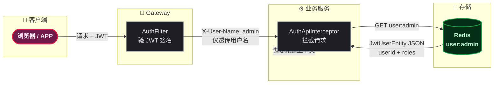
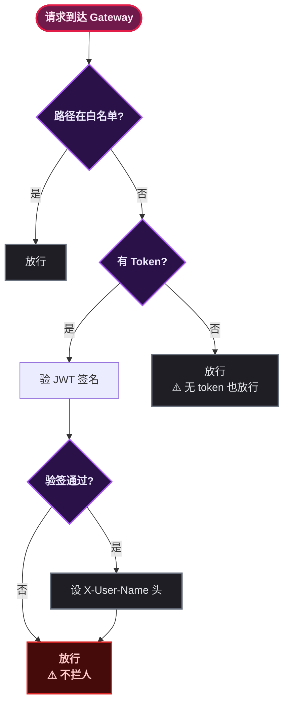
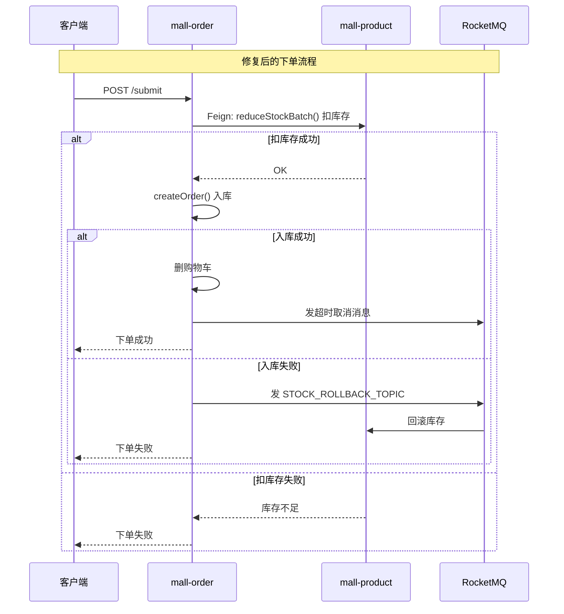
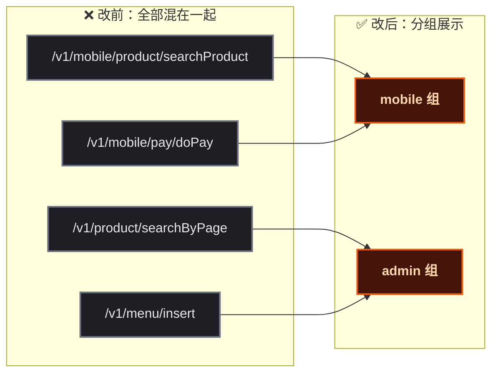

# 接手了一套微服务项目，代码看起来挺像回事，仔细一看全是坑

这套项目表面上看骨架搭得不错——Spring Cloud Alibaba 全家桶、17 个 Maven 模块、9 个微服务、分库分表、ES 双写、SkyWalking 链路追踪，基础中间件能怼的全都怼上去了。

但真的跑起来、改起来、审计起来，才发现业务逻辑有不少问题：鉴权链路缺半截、下单不扣库存、@NoLogin 散落几十个地方、JWT 只存了 username 导致全链路 Redis 查重。基础设施搭得好，不等于项目能经受住实际业务场景的考验。

本文将项目里几个典型问题摆出来，聊聊踩坑过程和修复思路，同时配图说明关键流程的改造前后对比。

## JWT claims：只放 username，剩下的全塞 Redis

第一个让人困惑的设计点在于 JWT 的使用方式。看下 Token 生成代码：

```java
// UserTokenHelper.java — 原实现
public String generateToken(String username, String json) {
    String token = Jwts.builder()
            .setSubject(username)                     // ← 只放了 username
            .setExpiration(generateExpired())
            .signWith(SignatureAlgorithm.HS512, tokenSecret)
            .compact();
    redisUtil.set(getTokenKey(username), token, 3600);   // Redis 存一份
    redisUtil.set(getUserKey(username), json, 3600);     // 用户完整信息也存 Redis
    return token;
}
```

JWT 的 claims 字段本质上设计来承载结构化信息，签名保证不被篡改。但这里把它当成了一个随机字符串来用——JWT 里只放了 `sub: "admin"`，userId、角色、权限全部丢进 Redis。

后果很直接：**每个服务、每次请求都得跑一次 Redis 才能拿到完整用户上下文**。



> ⚠️ 新手提示：JWT 的 claims 是签名的（防篡改），放到里面的数据是可信的。Redis 在此场景下充当了"用户信息缓存"角色，但这个缓存本可以用 JWT claims 替代大部分场景。

为什么作者要这么设计？其实日志里就能看出来——项目自诩支持"踢人下线"功能，也就是管理员把某个用户踢下线后，该用户的 JWT 应该立即失效。这个需求靠纯 JWT 本身搞不定（JWT 是无状态的，签发后没法主动让它失效），所以只能依赖 Redis 做二次验证。

想法没错，但实现跑偏了：**踢人下线应该用黑名单（Redis 存被踢的 tokenId），而不是把全量用户信息存在 Redis 里每次请求都查**。

## Gateway 鉴权：验签不拦人，全部依赖下游

第二个问题是 Gateway 和业务服务的鉴权边界搞错了。看看原版 AuthFilter 的逻辑（简化）：

```java
// AuthFilter.java — 逻辑流程
if (白名单) {
    放行;
    return;
}
if (有 token) {
    验 JWT 签名;
    if (通过) 设 X-User-Name 请求头;
}
// ⚠️ 无论验签成功与否，都放行！
return chain.filter(exchange);
```

Gateway 做的事情仅仅是：验签通过后把 username 塞进请求头，验签失败也照放不误。真正的拦截逻辑全靠下游 `@NoLogin` 注解和 `JwtTokenFilter` 来兜底。

这就导致两个后果：

1. **白名单散落各处** —— `@NoLogin` 注解说白了就是"这个接口不需要登录"，但放在不同服务的 Controller 上，代码里很难一眼看出"到底哪些路径是需要放行的"
2. **Gateway 很吃力但基本是在作秀** —— 看起来有个全局过滤器，实际上啥也不拦



修复思路也直接：**先把所有 @NoLogin 路径收集到 Gateway 配置中统一管理**。不改 Java 代码，纯配置层面的改动——把 38 个 @NoLogin 路径全部集中到 Gateway 的 `application.yml` 里，这样至少一眼能看出"哪些是不需要鉴权的"。

## 下单不扣库存，也没有补偿

这个问题最隐蔽，不仔细读源码很难发现。

订单服务 `OrderService.submit()` 的大致流程是：查购物车 → 算优惠 → 存订单 → 删购物车 → 发延迟消息。整个流程里 **对 `productFeignClient.reduceStockBatch()` 没有任何一次调用的记录**，虽然这个方法本身是写好了的。

```java
// OrderService.submit() — 原实现（简化）
@Transactional(rollbackFor = Exception.class)
public OrderSubmitRespDTO submit(OrderSubmitDTO submitDTO) {
    // 1. 获取购物车商品
    // 2. 计算优惠金额
    // 3. 构建订单实体
    // 4. 保存订单 ← stock 从未被扣减！
    Long orderId = createOrder(orderEntity);
    // 5. 删除购物车
    // 6. 发超时取消延迟消息
    return resp;
}
```

这就意味着库存完全不受约束——谁下单都不扣库存，全靠"信任"。如果订单入库失败（极端情况，比如分库分表的分片算法有问题），也没有任何补偿逻辑把状态拉回来。



修复分两块：mall-order 侧在入库前先扣库存、失败发补偿消息；mall-product 侧监听补偿 Topic 回滚库存。

**mall-order 扣库存 + 补偿：**

```java
// 扣库存（防止超卖）
if (!CollectionUtils.isEmpty(cartItems)) {
    try {
        productFeignClient.reduceStockBatch(cartItems);
    } catch (Exception e) {
        throw new BusinessException("库存不足");
    }
}

Long orderId;
try {
    orderId = createOrder(orderEntity);
} catch (Exception e) {
    // 补偿：库存已扣但订单入库失败，发 MQ 让 product 回滚
    if (!CollectionUtils.isEmpty(cartItems)) {
        mqHelper.send(businessConfig.getStockRollbackTopic(), cartItems);
    }
    throw e;
}
```

**mall-product 监听补偿消息：**

```java
@RocketMQMessageListener(
    topic = "STOCK_ROLLBACK_TOPIC",
    consumerGroup = "stock-rollback-consumer"
)
public class StockRollbackConsumer implements RocketMQListener<String> {
    @Override
    public void onMessage(String message) {
        List<ShoppingCartDTO> items = JSON.parseArray(message, ShoppingCartDTO.class);
        productService.addStockBatch(items);  // 库存加回来
    }
}
```

> 📌 前置知识：这里的补偿走的是**最终一致性**而非强一致——库存回滚允许秒级延迟。如果业务上必须毫秒级一致性，可以考虑 Seata AT/TCC 模式，但引入 Seata 对于中小项目是开销大于收益的。RocketMQ 的 Topic 默认自动创建，不需要额外运维。

补上扣库存和补偿机制后，下单链路才真正进入可用状态。

## API 文档：接口一锅粥，mobile 和 admin 不分家

这项目有管理后台和移动端两套接口，但 Swagger 文档里全部混在一起。有写 `@Tag(name = "移动端商品相关接口")` 的，也有写 `@Tag(name = "商品操作")` 的，命名风格不统一。



切分做法也简单，每个服务加一段 `GroupedOpenApi` 配置，按包路径区分分组：

```java
@Configuration
public class SwaggerConfig {

    // 移动端接口：controller.mobile 包
    @Bean
    public GroupedOpenApi mobileApi() {
        return GroupedOpenApi.builder()
                .group("mobile")
                .displayName("移动端接口")
                .packagesToScan("cn.net.mall.product.controller.mobile")
                .build();
    }

    // 管理后台接口：其余 controller 包
    @Bean
    public GroupedOpenApi adminApi() {
        return GroupedOpenApi.builder()
                .group("admin")
                .displayName("管理后台接口")
                .packagesToScan("cn.net.mall.product.controller")
                .packagesToExclude("cn.net.mall.product.controller.mobile")
                .build();
    }
}
```

8 个有 Controller 的服务各自加一份，每个服务的 Swagger UI 右上角下拉可以切 `mobile` / `admin` 分组。做 API 对接时可以直接从端口表对应着去看：

| 服务 | Swagger 地址 | 分组 |
|------|-------------|------|
| mall-auth | `http://localhost:8021/swagger-ui.html` | mobile / admin |
| mall-product | `http://localhost:8023/swagger-ui.html` | mobile / admin |
| mall-order | `http://localhost:8026/swagger-ui.html` | mobile |
| mall-pay | `http://localhost:8027/swagger-ui.html` | mobile |

## 换个视角：为什么这项目仍然很有价值

虽然上面的吐槽不少，但如果从**学习材料**的角度来看，这个项目有极高的参考价值。客观评价一下它到底好在哪里、对谁有用。

**技术栈清单：**

| 层级 | 技术 | 在项目中的落地 |
|------|------|-------------|
| 基础框架 | Spring Boot 3.3.5 + Spring Cloud Alibaba 2023.0.1.0 | 9 个微服务 |
| 注册/配置 | Nacos | 服务注册发现 + 全量配置托管 |
| 网关 | Spring Cloud Gateway | JWT 验签 + CORS + Sentinel 流控 |
| 安全 | Spring Security + JJWT | 登录认证 + 鉴权拦截 |
| RPC | OpenFeign + LoadBalancer | 跨服务调用 + 自动透传 JWT |
| 数据库 | MySQL 8.x + MyBatis | 5 套独立数据库 |
| 分库分表 | ShardingSphere-JDBC | 订单、消息、推荐各 8 库 |
| 缓存 | Redis + Redisson | Token 存储 + 分布式锁 |
| 消息队列 | Apache RocketMQ | 超时取消 + 浏览记录 + 库存补偿 |
| 搜索 | Elasticsearch | 商品/订单搜索 + 双写 |
| 文档存储 | MongoDB | 文件元数据 |
| 对象存储 | MinIO | 图片/文件上传 |
| 监控 | SkyWalking + Prometheus | 链路追踪 + 指标采集 |
| 容器化 | Docker + Kubernetes | Kind 集群部署 |
| API 文档 | springdoc-openapi (Swagger 3) | mobile/admin 分组 |
| 支付 | 支付宝沙箱 + ZXing | 沙箱支付 + 二维码 |
| 短信 | 阿里云 SMS | 验证码发送 |

一共搭了 **17 个技术组件、9 个独立部署服务、17 个 Maven 模块**，这个规模对于一个个人开发者来说已经是很高的完成度。

**对初学者的价值：**

1. **完整的微服务脚手架**—— 不用自己纠结"Spring Cloud Alibaba 版本怎么跟 Spring Boot 3.x 对齐""Nacos 配置中心怎么设 namespace""ShardingSphere 分片键选哪个字段"，这些问题全都有现成答案可以抄
2. **真实场景的踩坑素材**—— 做微服务最难的不是把单个组件跑通，是搞清楚组件之间的边界和协同关系。这个项目里的鉴权链路、补偿机制、@NoLogin 管理问题，恰恰提供了很好的思考线索："如果我设计，会怎么走？"
3. **学习路径最短**—— 一个项目同时覆盖了注册中心、配置中心、网关、RPC、分库分表、搜索引擎、消息队列、可观测性、容器化部署，比自己从零开始搭环境省掉大量时间

> 📌 建议：别把它当"成品"看，把它当"脚手架"。从它这里学架构、学配置、学中间件集成，然后在此基础上改业务逻辑、补状态机、完善鉴权，逐步把它变成你自己的项目。

从接手到审计到修复，整个过程其实是一个很好的训练场景——看别人代码最容易暴露自己知识盲区，而填坑的过程让你真正理解**微服务不是拆得越细越好，服务间的协同设计才是核心**。

## 日常开发中的常用方法

| 场景 | 方案 | 适用条件 |
|------|------|---------|
| JWT 存储角色/权限 | claims 字段直接携带 | Token 有效期短、角色变更不频繁 |
| 踢人下线 | Redis 黑名单（短 TTL） | QPS 不是极高 |
| 跨服务数据补偿 | RocketMQ 异步消息 | 最终一致性可接受 |
| 分布式事务（强一致） | Seata AT / TCC | 金融级场景、需要回滚日志 |
| API 文档分组 | springdoc GroupedOpenApi | 多端共用一个服务 |
| 本地多服务启动 | deploy 脚本 + 端口错开 | 单机开发测试 |
| @NoLogin 管理 | 统一至 Gateway 配置 | 所有对外 API 走网关 |
