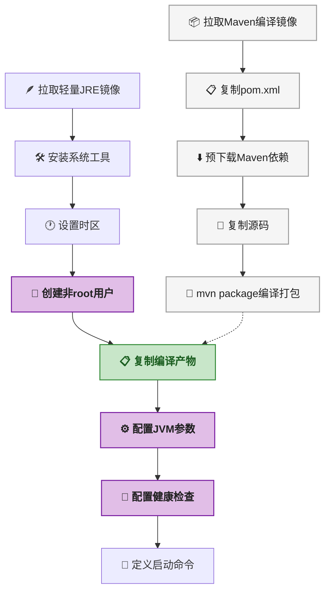
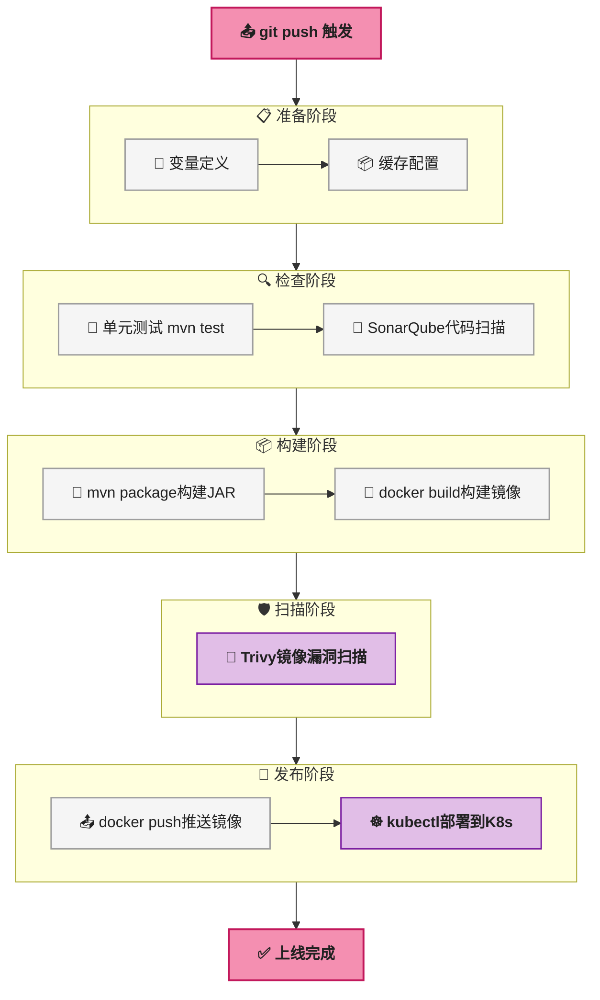
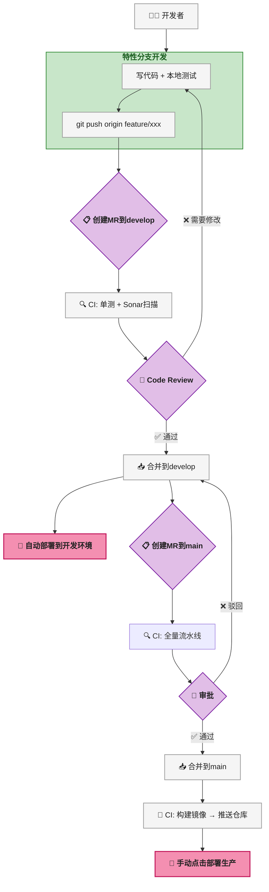

# 从写完代码到上线运行：SpringBoot微服务CI/CD完整链路

## 目标说明

这篇教程要解决一个很实际的问题：写完SpringBoot微服务代码之后，怎么把它弄到线上稳定运行？

很多开发者（尤其是刚入行的）对这块的认知是模糊的——"代码写完了，接下来是不是找个服务器丢上去就行了？" 实际过程远比这个复杂，涉及到测试验证、容器化、CI/CD流水线、配置中心、网关路由等一系列环节。

本教程将以一个典型的SpringBoot微服务项目为例，从代码提交前的本地测试开始，一步步走到Kubernetes集群上的生产环境部署。每个环节都给出完整可复制的脚本和配置文件，<strong>不跳步，不给半截代码</strong>。

> ⚠️ 新手提示：这篇教程假设读者能独立用SpringBoot写CRUD接口，但对DevOps/运维侧的流程不熟悉。如果连SpringBoot项目怎么创建都还不太清楚，建议先去翻翻SpringBoot入门文档再回来看。

## 前置条件

开始之前，先确认本地环境是否满足以下条件。每项后面附了验证命令，直接在终端里跑一下就能确认。

| 序号 | 前置条件 | 最低版本 | 验证命令 | 说明 |
|:---:|------|------|------|------|
| 1 | JDK | 8+ | `java -version` | 编译和运行SpringBoot项目 |
| 2 | Maven | 3.6+ | `mvn -version` | 项目构建和依赖管理 |
| 3 | Docker | 20.10+ | `docker version` | 容器镜像构建 |
| 4 | Git | 2.30+ | `git version` | 版本控制和协作 |
| 5 | SpringBoot项目 | 2.x | `mvn spring-boot:run` | 已有可正常启动的项目 |
| 6 | kubectl | 1.20+ | `kubectl version` | 部署阶段需要（可最后装） |

> 📌 前置知识：Docker的基础概念（镜像、容器、仓库三者的关系）。如果不清楚，可以先跑一遍 `docker run hello-world` 感受一下，然后大致了解 `docker build`、`docker push`、`docker pull` 三条命令的作用。

## 环境搭建

开始实践之前，先把必要的环境准备到位。下面按依赖顺序逐步完成。

### 确认Docker环境

```bash
# 检查Docker是否安装并运行
docker version

# 预期输出（版本号可能不同）：
# Client: Docker Engine - Community
#  Version:           20.10.16
# Server: Docker Engine - Community
#  Engine:
#   Version:          20.10.16

# 如果Docker daemon没启动，先启动它
# Linux: sudo systemctl start docker
# Mac/Windows: 打开Docker Desktop
```

### 安装Docker Compose（用于本地集成测试）

```bash
# 检查是否已安装
docker compose version

# 预期输出：Docker Compose version v2.10.2

# 如果没有，参考官方文档安装：
# https://docs.docker.com/compose/install/
```

### 配置Maven settings.xml

Maven默认从中央仓库拉依赖，在国内网络环境下可能很慢。建议配置国内镜像：

```xml
<!-- ~/.m2/settings.xml -->
<settings>
  <mirrors>
    <mirror>
      <id>aliyun</id>
      <mirrorOf>central</mirrorOf>
      <name>Aliyun Maven Mirror</name>
      <url>https://maven.aliyun.com/repository/public</url>
    </mirror>
  </mirrors>
</settings>
```

### 准备一个用于实践的SpringBoot项目

如果只是为了跟着教程走一遍流程，可以用Spring Initializr快速生成一个：

```bash
# 用Maven命令快速创建（需要网络）
mvn archetype:generate \
  -DgroupId=com.demo \
  -DartifactId=user-service \
  -DarchetypeArtifactId=maven-archetype-quickstart \
  -DinteractiveMode=false

# 然后在pom.xml里加上SpringBoot依赖（后面会用到）
```

> ⚠️ 新手提示：这篇教程不负责教你写SpringBoot业务代码。你需要至少有一个能正常启动的SpringBoot项目（哪怕只有一个 `/hello` 接口），才能走通后续的Docker和CI/CD流程。

## 分步实践

下面是整个CI/CD流程的8个步骤。每一步都有完整的代码、配置和验证方法。<strong>强烈建议按顺序操作</strong>，因为后一步依赖前一步的产出。

---

### 第1步：本地测试 —— 代码写完后的第一道防线

写完代码之后的第一件事不是 `git push`，而是本地测试。这一步如果省了，把问题带到CI流水线上，来回修 + 排队等Runner，时间全浪费了。

#### 1.1 单元测试

```bash
# 执行所有单元测试
mvn test

# 预期输出：
# [INFO] Tests run: 15, Failures: 0, Errors: 0, Skipped: 0
# [INFO] BUILD SUCCESS
```

SpringBoot项目里，单元测试一般放在 `src/test/java` 下，用JUnit + Mockito来写。简单示例：

```java
@ExtendWith(MockitoExtension.class)
class UserServiceTest {

    @Mock
    private UserRepository userRepository;

    @InjectMocks
    private UserService userService;

    @Test
    void shouldReturnUserWhenIdExists() {
        // given
        User mockUser = new User(1L, "张三", "zhangsan@example.com");
        when(userRepository.findById(1L)).thenReturn(Optional.of(mockUser));

        // when
        UserDTO result = userService.getUserById(1L);

        // then
        assertNotNull(result);
        assertEquals("张三", result.getName());
        verify(userRepository, times(1)).findById(1L);
    }
}
```

> 📌 前置知识：JUnit5的 `@ExtendWith`（JUnit5扩展机制）、Mockito的 `@Mock`（创建模拟对象）/ `@InjectMocks`（注入模拟依赖）/ `when-thenReturn`（定义模拟行为）/ `verify`（验证方法调用）。建议先看过至少一个完整的JUnit5+Mockito测试用例再来理解这段。

#### 1.2 集成测试

集成测试要连真实的MySQL和Redis。本地开发时用Docker Compose拉起这些中间件非常方便：

```yaml
# docker-compose.yml（放在项目根目录）
version: '3.8'
services:
  mysql:
    image: mysql:8.0
    container_name: test-mysql
    environment:
      MYSQL_ROOT_PASSWORD: root123
      MYSQL_DATABASE: user_db
    ports:
      - "3306:3306"
    command: --default-authentication-plugin=mysql_native_password

  redis:
    image: redis:7.0-alpine
    container_name: test-redis
    ports:
      - "6379:6379"
```

```bash
# 启动依赖服务
docker compose up -d

# 验证服务已就绪
docker compose ps
# 预期输出：两个服务都是 Up 状态

# 然后执行集成测试
mvn verify -P integration-test
```

集成测试示例（用Testcontainers可以免去手动启动Docker Compose，但学习曲线稍陡，这里先用Docker Compose方案）：

```java
@SpringBootTest
@AutoConfigureMockMvc
class UserControllerIntegrationTest {

    @Autowired
    private MockMvc mockMvc;

    @Autowired
    private UserRepository userRepository;

    @BeforeEach
    void setUp() {
        userRepository.deleteAll();
        userRepository.save(new User(null, "测试用户", "test@example.com"));
    }

    @Test
    void shouldCreateUserAndReturn201() throws Exception {
        String json = """
            {
                "name": "新用户",
                "email": "new@example.com"
            }
            """;

        mockMvc.perform(post("/api/users")
                .contentType(MediaType.APPLICATION_JSON)
                .content(json))
            .andExpect(status().isCreated())
            .andExpect(jsonPath("$.name").value("新用户"));
    }
}
```

> ⚠️ 新手提示：集成测试的执行速度比单元测试慢很多（通常慢5 ~ 10倍），所以不要在每次 `mvn test` 时都跑集成测试。用Maven的profile机制把它们分开是个好习惯。

#### 1.3 接口测试

启动应用后，用curl或Postman验证核心接口：

```bash
# 先启动应用
mvn spring-boot:run &

# 等应用启动后（看日志里出现 Started Application 字样）

# 测试GET接口
curl -s http://localhost:8080/api/users/1 | python -m json.tool

# 预期输出：
# {
#     "id": 1,
#     "name": "测试用户",
#     "email": "test@example.com"
# }

# 测试POST接口
curl -s -X POST http://localhost:8080/api/users \
  -H "Content-Type: application/json" \
  -d '{"name":"新用户","email":"new@example.com"}' | python -m json.tool

# 预期输出：HTTP 201 Created
```

#### 1.4 代码覆盖率

```bash
# 生成覆盖率报告（需要pom.xml里配置了jacoco插件）
mvn jacoco:report

# 报告位置：target/site/jacoco/index.html
# 用浏览器打开这个HTML文件，查看覆盖率数据
```

pom.xml中Jacoco的配置：

```xml
<plugin>
    <groupId>org.jacoco</groupId>
    <artifactId>jacoco-maven-plugin</artifactId>
    <version>0.8.8</version>
    <executions>
        <execution>
            <goals>
                <goal>prepare-agent</goal>
            </goals>
        </execution>
        <execution>
            <id>report</id>
            <phase>test</phase>
            <goals>
                <goal>report</goal>
            </goals>
        </execution>
    </executions>
</plugin>
```

覆盖率通常要求行覆盖率 <strong>80% 以上</strong>，分支覆盖率 <strong>70% 以上</strong>。不过也别为了凑覆盖率去写一堆没有断言、只为跑过代码的测试——那纯属自欺欺人。

> 某开发者吐槽：遇到过某个项目的测试覆盖率90%，进去一看，全是 `assertNotNull` 和 `assertTrue(true)`，没有一条业务断言。这种覆盖率比没测试还危险——它给了人虚假的安全感。

---

### 第2步：编写Dockerfile —— 定义运行环境

Dockerfile是应用容器化的核心文件。写得好，镜像体积小、构建快、运行安全；写不好，光构建就要十分钟，镜像体积1GB+，运维看到想打人。

#### 2.1 Dockerfile的12个关键要素

先通过一张流程图看清Dockerfile的分阶段构建逻辑。



下面对每个要素逐一拆解。

| 序号 | 要素 | 为什么重要 | 常见踩坑 |
|:---:|------|------|------|
| 1 | <strong>基础镜像</strong> | 决定了最终镜像体积的下限 | `openjdk:8-jdk` 比 `openjdk:8-jre-alpine` 大400MB+ |
| 2 | <strong>维护者信息</strong> | 出问题时知道找谁 | 很多团队跳过，导致事故无人认领 |
| 3 | <strong>时区设置</strong> | 日志时间不准，排查问题抓狂 | 容器默认UTC，日志里出现8小时偏差 |
| 4 | <strong>系统工具</strong> | 排查问题时需要curl/top等 | 生产镜像为了安全通常最小化，但至少留curl |
| 5 | <strong>依赖预下载</strong> | 利用Docker层缓存加速构建 | COPY的顺序很关键：先pom.xml再src |
| 6 | <strong>源码编译</strong> | 在容器内完成编译，保证环境一致性 | CI里编译和Docker里编译不要重复做 |
| 7 | <strong>多阶段构建</strong> | 编译工具不打包进运行镜像 | 不用多阶段的话，Maven/Gradle都打进镜像 |
| 8 | <strong>非root用户</strong> | 安全基线要求，防止容器逃逸 | 不设的话默认root运行，安全扫描直接不通过 |
| 9 | <strong>端口暴露</strong> | 声明服务端口，配合K8s的Service使用 | `EXPOSE` 只是声明，不在 `-p` 映射时仍可访问 |
| 10 | <strong>JVM参数</strong> | 容器化后JVM感知的是宿主机内存 | Java 8不加 `UseContainerSupport` 可能OOM |
| 11 | <strong>健康检查</strong> | 让K8s知道Pod是否真正就绪 | 不加的话K8s只能用TCP探活，启动失败不知道 |
| 12 | <strong>启动命令</strong> | 定义容器启动行为 | 用exec格式(`["...", "..."]`)不用shell格式 |

#### 2.2 完整Dockerfile（分阶段构建）

```dockerfile
# ========== 第一阶段：编译阶段 ==========
FROM maven:3.8.6-openjdk-8 AS builder

WORKDIR /build

# 先复制pom文件，预下载依赖（利用Docker层缓存，依赖不变时跳过下载）
COPY pom.xml .
RUN mvn dependency:go-offline -B

# 再复制源码并编译打包（src变化才触发重新编译）
COPY src ./src
RUN mvn clean package -DskipTests -B

# ========== 第二阶段：运行阶段 ==========
FROM openjdk:8-jre-alpine

# 元信息标签（方便运维和排查）
LABEL maintainer="developer@company.com"
LABEL app.name="user-service"
LABEL app.version="1.0.0"

# 安装运行时必要工具（tzdata=时区，curl=健康检查探活）
RUN apk add --no-cache tzdata curl ca-certificates

# 设置时区为北京时间（日志时间对齐）
ENV TZ=Asia/Shanghai
RUN ln -snf /usr/share/zoneinfo/$TZ /etc/localtime && echo $TZ > /etc/timezone

# 创建非root用户和用户组（安全基线要求）
RUN addgroup -S appgroup && adduser -S appuser -G appgroup -u 1000
USER appuser:appgroup

# 从编译阶段只复制jar包（不包含Maven/Gradle等编译工具）
COPY --from=builder --chown=appuser:appgroup /build/target/*.jar /app/app.jar

WORKDIR /app

# 声明监听端口（文档用途，实际映射由编排系统负责）
EXPOSE 8080

# 可被覆盖的环境变量
ENV SPRING_PROFILES_ACTIVE=prod
ENV JAVA_OPTS=""

# 健康检查：每30秒用curl探一次actuator健康端点
# start-period=60s：启动后等60秒再开始检查（给SpringBoot启动预留时间）
HEALTHCHECK --interval=30s --timeout=5s --start-period=60s --retries=3 \
  CMD curl -f http://localhost:8080/actuator/health || exit 1

# 启动命令
# UseContainerSupport: 让JVM感知容器的内存限制而非宿主机
# MaxRAMPercentage=75: JVM堆最大占容器内存的75%
# InitialRAMPercentage=50: JVM堆初始占容器内存的50%
ENTRYPOINT ["sh", "-c", "java $JAVA_OPTS \
  -XX:+UseContainerSupport \
  -XX:MaxRAMPercentage=75.0 \
  -XX:InitialRAMPercentage=50.0 \
  -XX:+HeapDumpOnOutOfMemoryError \
  -XX:HeapDumpPath=/tmp \
  -jar /app/app.jar"]
```

> ⚠️ 新手提示：`UseContainerSupport` 在Java 8u191之前是不存在的。如果用的是更早的版本，容器内存限制不会生效，JVM可能尝试申请超过容器限制的内存然后被OOM Killer杀掉。遇到 `Container killed on request. Exit code 137` 这种错误，先排查JDK版本。

#### 2.3 本地构建和验证

```bash
# 构建镜像
docker build -t user-service:local .

# 预期输出（首次构建可能较慢）：
# Successfully built abc123def456
# Successfully tagged user-service:local

# 查看镜像大小
docker images user-service:local
# 预期：镜像大小应该在150MB ~ 250MB之间（多阶段构建的效果）

# 本地运行验证
docker run -d \
  --name user-service-test \
  -p 8080:8080 \
  -e SPRING_PROFILES_ACTIVE=dev \
  user-service:local

# 查看启动日志
docker logs -f user-service-test
# 预期看到：Started Application in X.XXX seconds

# 验证健康检查
curl http://localhost:8080/actuator/health
# 预期：{"status":"UP"}

# 测试完成后清理
docker rm -f user-service-test
```

---

### 第3步：编写CI/CD流水线 —— 自动化一切

Dockerfile写好了，镜像能本地构建了。下一步是让CI/CD系统自动完成这些操作——开发者只需要 `git push`，剩下的全自动。

> 📌 前置知识：CI/CD的基本概念。CI（Continuous Integration，持续集成）是指代码合入时自动构建测试；CD（Continuous Delivery/Deployment，持续交付/部署）是指自动把构建产物部署到目标环境。GitLab CI通过项目根目录的 `.gitlab-ci.yml` 文件定义流水线行为。

#### 3.1 CI流水线的9个阶段概览



| 阶段 | 做什么 | 失败意味着什么 |
|:---:|------|------|
| 变量定义 | 声明镜像仓库地址、应用名、K8s命名空间等全局参数 | 配置写错了流水线直接跑不起来 |
| 缓存配置 | 缓存 `.m2/repository`（Maven依赖）和 `target/`（构建产物） | 不配缓存的话，每次从头下载依赖，10分钟起步 |
| 单元测试 | 执行 `mvn test` 并生成覆盖率报告 | 有测试挂了，代码有问题 |
| 代码扫描 | SonarQube静态分析，查bug/漏洞/代码异味 | 发现了潜在问题，需要人工评估 |
| 构建JAR | `mvn package -DskipTests`（测试已跑过，不再重复） | 编译失败，代码有语法错误或依赖问题 |
| 构建镜像 | `docker build` 把JAR变成容器镜像 | Dockerfile有问题或基础镜像拉不下来 |
| 镜像扫描 | Trivy扫描镜像中的CVE漏洞 | CRITICAL级别漏洞必须修复 |
| 推送镜像 | `docker push` 推送到镜像仓库 | Habor/Docker Hub连不上或认证失败 |
| 部署 | `kubectl set image` 更新K8s Deployment | K8s集群连不上或资源不足 |

#### 3.2 完整 `.gitlab-ci.yml`

```yaml
# ============================================
# 全局变量定义
# ============================================
variables:
  # 镜像仓库配置（根据实际环境修改）
  REGISTRY: "harbor.company.com"
  REGISTRY_NAMESPACE: "microservices"
  APP_NAME: "user-service"
  APP_PORT: "8080"

  # 镜像标签：用commit短哈希作为版本号，同时打latest
  IMAGE_TAG: "${REGISTRY}/${REGISTRY_NAMESPACE}/${APP_NAME}:${CI_COMMIT_SHORT_SHA}"
  IMAGE_LATEST: "${REGISTRY}/${REGISTRY_NAMESPACE}/${APP_NAME}:latest"

  # Maven本地仓库路径（重定向到项目目录下，配合缓存使用）
  MAVEN_OPTS: "-Dmaven.repo.local=${CI_PROJECT_DIR}/.m2/repository -Dmaven.compiler.source=8 -Dmaven.compiler.target=8"

  # K8s命名空间
  K8S_NAMESPACE: "production"

# ============================================
# 缓存配置
# ============================================
cache:
  paths:
    - .m2/repository/          # 缓存Maven依赖，首次10分钟，后续30秒
    - target/                  # 缓存编译产物
  key: "${CI_COMMIT_REF_SLUG}" # 按分支区分缓存

# ============================================
# 阶段定义
# ============================================
stages:
  - test          # 单元测试
  - scan          # 代码扫描
  - build         # 构建JAR包
  - docker        # 构建和扫描Docker镜像
  - push          # 推送镜像到仓库
  - deploy        # 部署到K8s

# ============================================
# 阶段1：单元测试 + 覆盖率
# ============================================
unit-test:
  stage: test
  image: maven:3.8.6-openjdk-8
  script:
    - mvn test -B
    - mvn jacoco:report -B
  artifacts:
    paths:
      - target/site/jacoco/
    reports:
      junit: target/surefire-reports/TEST-*.xml
  coverage: '/Total.*?([0-9]{1,3})%/'
  only:
    - merge_requests
    - main
    - develop

# ============================================
# 阶段2：SonarQube代码扫描
# ============================================
sonarqube:
  stage: scan
  image: sonarsource/sonar-scanner-cli:latest
  script:
    - sonar-scanner
        -Dsonar.projectKey=${APP_NAME}
        -Dsonar.projectName=${APP_NAME}
        -Dsonar.sources=src/main/java
        -Dsonar.tests=src/test/java
        -Dsonar.java.binaries=target/classes
        -Dsonar.host.url=${SONAR_HOST_URL}
        -Dsonar.login=${SONAR_TOKEN}
        -Dsonar.coverage.jacoco.xmlReportPaths=target/site/jacoco/jacoco.xml
  only:
    - merge_requests
    - main
  allow_failure: true

# ============================================
# 阶段3：构建JAR包
# ============================================
build-jar:
  stage: build
  image: maven:3.8.6-openjdk-8
  script:
    - mvn clean package -DskipTests -B
  artifacts:
    paths:
      - target/*.jar
    expire_in: 1 hour      # 构建产物保留1小时就够了
  only:
    - main
    - develop

# ============================================
# 阶段4：构建Docker镜像
# ============================================
build-docker:
  stage: docker
  image: docker:20.10.16
  services:
    - docker:20.10.16-dind  # Docker-in-Docker，在容器里启动Docker daemon
  variables:
    DOCKER_TLS_CERTDIR: ""  # 关闭TLS，简化配置
  before_script:
    - docker login -u ${REGISTRY_USER} -p ${REGISTRY_PASSWORD} ${REGISTRY}
  script:
    # 同时打commit短哈希和latest两个标签
    - docker build -t ${IMAGE_TAG} -t ${IMAGE_LATEST} .
    # 保存镜像为tar文件，供后续阶段使用
    - docker save ${IMAGE_TAG} > image.tar
  artifacts:
    paths:
      - image.tar
    expire_in: 30 minutes
  only:
    - main
  needs:
    - build-jar

# ============================================
# 阶段5：镜像漏洞扫描
# ============================================
scan-image:
  stage: docker
  image: aquasec/trivy:latest
  script:
    # 只扫描CRITICAL级别漏洞，发现就流水线失败
    - trivy image --severity CRITICAL --exit-code 1 ${IMAGE_TAG}
  only:
    - main
  allow_failure: false    # CRITICAL漏洞不允许放过
  needs:
    - build-docker

# ============================================
# 阶段6：推送镜像到仓库
# ============================================
push-image:
  stage: push
  image: docker:20.10.16
  services:
    - docker:20.10.16-dind
  variables:
    DOCKER_TLS_CERTDIR: ""
  before_script:
    - docker login -u ${REGISTRY_USER} -p ${REGISTRY_PASSWORD} ${REGISTRY}
  script:
    - docker push ${IMAGE_TAG}
    - docker push ${IMAGE_LATEST}
  only:
    - main
  needs:
    - build-docker
    - scan-image

# ============================================
# 阶段7：部署到Kubernetes
# ============================================
deploy:
  stage: deploy
  image: bitnami/kubectl:latest
  script:
    # 更新Deployment的镜像（触发滚动更新）
    - kubectl set image deployment/${APP_NAME}
        ${APP_NAME}=${IMAGE_TAG}
        -n ${K8S_NAMESPACE}
    # 等待滚动更新完成（最多等5分钟）
    - kubectl rollout status deployment/${APP_NAME}
        -n ${K8S_NAMESPACE}
        --timeout=5m
    # 验证Pod状态
    - kubectl get pods -n ${K8S_NAMESPACE} -l app=${APP_NAME}
  environment:
    name: production
    url: https://api.company.com/${APP_NAME}
  only:
    - main
  when: manual      # 生产部署需要手动点击触发
  needs:
    - push-image
```

#### 3.3 各阶段的排错指南

| 失败阶段 | 常见原因 | 排查方法 |
|------|------|------|
| `unit-test` | 测试用例依赖了本地环境变量或文件路径 | 检查测试里有没有硬编码 `/Users/xxx` 之类的路径 |
| `sonarqube` | `SONAR_TOKEN` 未配置或过期 | 到GitLab的 Settings → CI/CD → Variables 里检查 |
| `build-jar` | 缺少某个依赖的版本号（`parent.pom` 没继承到） | 在CI里加一步 `mvn help:effective-pom` 看实际POM |
| `build-docker` | `docker:dind` 没起来 | 看日志里有没有 `Cannot connect to the Docker daemon` |
| `scan-image` | 基础镜像里有CVE漏洞 | 换一个更新的基础镜像版本，或联系安全团队评估风险 |
| `push-image` | Harbor仓库认证失败 | 检查 `REGISTRY_USER` 和 `REGISTRY_PASSWORD` 变量 |
| `deploy` | K8s集群连不上 | 检查 `KUBECONFIG` 变量或Runner的 `~/.kube/config` |

---

### 第4步：Git分支策略 —— 代码怎么合入

CI脚本就绪了，但代码不是随便往哪个分支推都触发完整流水线的。合理的分支策略能保证主分支稳定，同时让多人协作不乱。

#### 4.1 分支定义

| 分支 | 用途 | 保护级别 | 生命周期 | 谁能直接push |
|------|------|:---:|------|:---:|
| `main` | 生产环境代码 | Protected | 永久 | 没有人（只能通过MR合并） |
| `develop` | 开发集成分支 | Protected | 永久 | 没有人（只能通过MR合并） |
| `feature/*` | 新功能开发 | Unprotected | 功能合并后删除 | 开发者 |
| `hotfix/*` | 紧急线上修复 | Unprotected | 修复后删除 | 开发者 |
| `release/*` | 发布前准备 | Unprotected | 发布后删除 | Release Manager |

> ⚠️ 新手提示：`main` 和 `develop` 设置为Protected分支后，GitLab/GitHub会阻止直接push，只能通过Merge Request（GitLab）或Pull Request（GitHub）合入。这个设置要在仓库的 Settings → Repository → Protected Branches 里配。

#### 4.2 完整合并流程

下面的流程图展示了从开发到上线的代码流转路径。



具体命令：

```bash
# 步骤1：从最新的develop创建功能分支
git checkout develop
git pull origin develop
git checkout -b feature/add-user-login

# ... 写代码、本地测试 ...

# 步骤2：提交并推送
git add .
git commit -m "feat(user): 实现用户登录功能

- 添加JWT Token生成和验证工具类
- 实现登录/登出接口
- 添加全局认证异常处理
- 单元测试覆盖率85%"

git push origin feature/add-user-login

# 步骤3：在GitLab网页上创建Merge Request
# 源分支：feature/add-user-login
# 目标分支：develop
# CI自动触发：单元测试 + SonarQube扫描

# 步骤4：Code Review通过后，点击Merge按钮
# 合并后CI自动将新版本部署到开发环境

# 步骤5：开发环境验证没问题后，创建MR从develop到main
# 审批通过 → 合并 → CI构建镜像推送仓库 → 手动触发生产部署
```

#### 4.3 CI自动触发规则

| 触发事件 | 执行哪些CI阶段 | 频率 |
|------|------|------|
| push到 `feature/*` | 单元测试 + 代码扫描 | 每次push |
| push到 `develop` | 全部阶段（不含生产部署） | 每次push |
| 创建MR到 `main` | 全部阶段 + 镜像构建 | 每次MR创建/更新 |
| 合并到 `main` | 全部阶段 + 生产部署（手动触发） | 每次合并 |
| 打tag `v*` | 全部阶段 + 生产部署（自动触发） | 每次打tag |

> 某开发者吐槽：见过一个项目把生产部署也设成了自动触发——合并到main就直接上线。某天有人不小心把一个还在调试的功能合进去了，凌晨两点用户投诉，值班同事一脸茫然。<strong>生产部署建议永远保留一道手动确认的步骤。</strong>

---

### 第5步：Nacos配置中心 —— 配置与代码分离

代码和Docker镜像都有了，接下来要解决配置管理的问题。数据库密码、Redis地址这些配置如果写死在 `application.yml` 里，每次换环境都得重新打镜像——效率极低。Nacos（Dynamic Naming and Configuration Service）是SpringCloud Alibaba生态中的配置中心和服务发现组件，把配置从代码里抽出来，放到Nacos上集中管理。

> 📌 前置知识：服务注册与发现的基本概念——服务提供者启动时把自己的地址注册到注册中心，服务消费者从注册中心拉取可用服务的地址列表并发起调用。配置中心则是把应用配置（数据库地址、开关、阈值等）从代码中剥离，统一在远端管理，支持动态刷新。

#### 5.1 添加Nacos依赖

```xml
<!-- pom.xml -->
<dependency>
    <groupId>com.alibaba.cloud</groupId>
    <artifactId>spring-cloud-starter-alibaba-nacos-config</artifactId>
    <version>2021.0.5.0</version>
</dependency>
<dependency>
    <groupId>com.alibaba.cloud</groupId>
    <artifactId>spring-cloud-starter-alibaba-nacos-discovery</artifactId>
    <version>2021.0.5.0</version>
</dependency>

<!-- 注意：SpringBoot 2.4+ 需要额外引入bootstrap依赖 -->
<dependency>
    <groupId>org.springframework.cloud</groupId>
    <artifactId>spring-cloud-starter-bootstrap</artifactId>
    <version>3.1.5</version>
</dependency>
```

> ⚠️ 新手提示：SpringCloud 2020.0 版本之后默认不再加载 `bootstrap.yml`。如果你的配置写在 `bootstrap.yml` 里发现不生效，检查一下是否引入了 `spring-cloud-starter-bootstrap` 依赖。

#### 5.2 bootstrap.yml 配置

```yaml
# src/main/resources/bootstrap.yml
# 注意：Nacos的地址必须在bootstrap阶段就加载，
# 因为application.yml中的配置可能要从Nacos拉取
spring:
  application:
    name: user-service          # 服务名，同时也是Nacos的data-id前缀
  cloud:
    nacos:
      # 服务发现配置
      discovery:
        server-addr: nacos.company.com:8848
        namespace: production   # 命名空间，用于环境隔离
        group: DEFAULT_GROUP
        enabled: true
      # 配置中心配置
      config:
        server-addr: nacos.company.com:8848
        namespace: production
        file-extension: yaml    # 配置文件格式
        prefix: ${spring.application.name}  # data-id前缀
        group: DEFAULT_GROUP
        refresh-enabled: true   # 启用配置动态刷新
        shared-configs:         # 共享配置（多个服务共用）
          - data-id: common.yaml
            group: DEFAULT_GROUP
            refresh: true
```

#### 5.3 Nacos控制台中的配置内容

登录Nacos控制台（`http://nacos.company.com:8848/nacos`），在 `production` 命名空间下创建配置 `user-service.yaml`：

```yaml
# Nacos配置：data-id=user-service.yaml, group=DEFAULT_GROUP
spring:
  datasource:
    url: jdbc:mysql://mysql-master.production:3306/user_db?useSSL=false&serverTimezone=Asia/Shanghai
    username: ${MYSQL_USER}
    password: ${MYSQL_PASSWORD}
    hikari:
      maximum-pool-size: 20
      minimum-idle: 5
      idle-timeout: 300000
      connection-timeout: 20000
      max-lifetime: 1200000

  redis:
    cluster:
      nodes:
        - redis-node1.production:6379
        - redis-node2.production:6379
        - redis-node3.production:6379
    password: ${REDIS_PASSWORD}
    timeout: 3000ms
    lettuce:
      pool:
        max-active: 16
        max-idle: 8
        min-idle: 4

  rabbitmq:
    addresses: rabbitmq.production:5672
    username: ${RABBITMQ_USER}
    password: ${RABBITMQ_PASSWORD}

# 业务配置（支持 @RefreshScope 动态刷新）
business:
  max-login-attempts: 5           # 最大登录尝试次数
  session-timeout: 3600            # 会话超时时间（秒）
  verification-code-expire: 300    # 验证码过期时间（秒）
  feature-flags:
    new-login-page: true           # 新登录页面灰度开关
    enable-register: true          # 注册功能开关
```

#### 5.4 代码中使用动态配置

```java
@Data
@Component
@ConfigurationProperties(prefix = "business")
@RefreshScope   // 这个注解让配置变化时自动刷新，不需要重启应用
public class BusinessProperties {

    /** 最大登录尝试次数 */
    private Integer maxLoginAttempts;

    /** 会话超时时间（秒） */
    private Integer sessionTimeout;

    /** 验证码过期时间（秒） */
    private Integer verificationCodeExpire;

    /** 功能开关集合 */
    private Map<String, Boolean> featureFlags = new HashMap<>();

    /**
     * 判断某个功能是否开启
     */
    public boolean isFeatureEnabled(String featureName) {
        return featureFlags.getOrDefault(featureName, false);
    }
}
```

```java
@Service
@Slf4j
public class LoginService {

    @Autowired
    private BusinessProperties businessProperties;

    public LoginResult login(String username, String password) {
        // 动态检查功能开关
        if (!businessProperties.isFeatureEnabled("new-login-page")) {
            log.info("新版登录页面未开启，使用旧版逻辑");
            // 回退到旧版逻辑...
        }

        // 使用动态配置的阈值
        int maxAttempts = businessProperties.getMaxLoginAttempts();
        int failedCount = getFailedAttempts(username);

        if (failedCount >= maxAttempts) {
            throw new AccountLockedException(
                "账户已锁定，请" + businessProperties.getSessionTimeout() + "秒后重试");
        }
        // ... 验证逻辑
    }
}
```

> ⚠️ 新手提示：`@RefreshScope` 是Spring Cloud提供的注解，它会在Nacos配置变更时重建Bean。但这有个代价——被注解的Bean每次调用都会走代理，有轻微性能开销。只对需要动态刷新的配置类加这个注解，别到处滥用。

---

### 第6步：Gateway网关 —— 统一入口

微服务架构里，各服务分布在不同的端口甚至不同的机器上。直接暴露每个服务给前端是灾难——前端得记住N个地址，跨域问题满天飞。SpringCloud Gateway作为API网关，统一接收所有外部请求，然后根据路由规则转发到对应的微服务。

#### 6.1 Gateway路由配置

```yaml
# gateway-service/src/main/resources/application.yml
server:
  port: 8080

spring:
  application:
    name: gateway-service
  cloud:
    nacos:
      discovery:
        server-addr: nacos.company.com:8848
        namespace: production
    gateway:
      discovery:
        locator:
          enabled: true           # 自动根据Nacos服务名创建路由
          lower-case-service-id: true
      routes:
        # ========== 用户服务路由 ==========
        - id: user-service-route
          uri: lb://user-service            # lb:// = 负载均衡拉取Nacos实例
          predicates:
            - Path=/api/users/**            # 匹配 /api/users/xxx 的请求
          filters:
            - StripPrefix=1                 # 转发前去掉 /api 前缀
            - name: RequestRateLimiter      # 令牌桶限流
              args:
                key-resolver: "#{@ipKeyResolver}"
                redis-rate-limiter.replenishRate: 100    # 每秒填充100个令牌
                redis-rate-limiter.burstCapacity: 200    # 突发容量200个令牌
            - name: CircuitBreaker          # 熔断器
              args:
                name: userServiceCircuitBreaker
                fallbackUri: forward:/fallback/users

        # ========== 订单服务路由 ==========
        - id: order-service-route
          uri: lb://order-service
          predicates:
            - Path=/api/orders/**
          filters:
            - StripPrefix=1
            - name: RequestRateLimiter
              args:
                key-resolver: "#{@ipKeyResolver}"
                redis-rate-limiter.replenishRate: 80
                redis-rate-limiter.burstCapacity: 150

        # ========== 博客服务路由 ==========
        - id: blog-service-route
          uri: lb://blog-service
          predicates:
            - Path=/api/blogs/**
          filters:
            - StripPrefix=1
            - name: RequestRateLimiter
              args:
                key-resolver: "#{@ipKeyResolver}"
                redis-rate-limiter.replenishRate: 50
                redis-rate-limiter.burstCapacity: 100

      # 全局默认过滤器（对所有路由生效）
      default-filters:
        - AddResponseHeader=X-Response-Source, gateway
        - DedupeResponseHeader=Access-Control-Allow-Origin
```

#### 6.2 全局认证过滤器

```java
@Component
@Slf4j
public class GlobalAuthFilter implements GlobalFilter, Ordered {

    /** 不需要认证的路径前缀 */
    private static final List<String> WHITELIST_PATHS = List.of(
        "/api/users/login",
        "/api/users/register",
        "/api/health",
        "/actuator"
    );

    @Override
    public Mono<Void> filter(ServerWebExchange exchange, GatewayFilterChain chain) {
        ServerHttpRequest request = exchange.getRequest();
        String path = request.getURI().getPath();

        // 1. 检查白名单
        if (isWhitelisted(path)) {
            return chain.filter(exchange);
        }

        // 2. 提取并校验Token
        String authHeader = request.getHeaders().getFirst(HttpHeaders.AUTHORIZATION);
        if (authHeader == null || !authHeader.startsWith("Bearer ")) {
            return unauthorized(exchange, "缺少有效的认证Token");
        }
        String token = authHeader.substring(7);

        // 3. 验证Token有效性
        TokenInfo tokenInfo;
        try {
            tokenInfo = parseAndValidateToken(token);
        } catch (TokenExpiredException e) {
            return unauthorized(exchange, "Token已过期，请重新登录");
        } catch (TokenInvalidException e) {
            return unauthorized(exchange, "Token无效");
        }

        // 4. 将用户信息透传到下游微服务（下游不需要再解析Token）
        ServerHttpRequest mutatedRequest = request.mutate()
            .header("X-User-Id", tokenInfo.getUserId())
            .header("X-User-Name", URLEncoder.encode(tokenInfo.getUsername(), StandardCharsets.UTF_8))
            .header("X-User-Roles", String.join(",", tokenInfo.getRoles()))
            .build();

        return chain.filter(exchange.mutate().request(mutatedRequest).build());
    }

    @Override
    public int getOrder() {
        return -100;  // 优先级最高，确保认证在业务过滤之前
    }

    // ... isWhitelisted, parseAndValidateToken, unauthorized 等方法实现
}
```

#### 6.3 IP限流的KeyResolver

```java
@Configuration
public class RateLimiterConfig {

    /**
     * 基于请求IP的限流Key解析器
     * 同一个IP共享限流配额
     */
    @Bean
    public KeyResolver ipKeyResolver() {
        return exchange -> {
            String ip = exchange.getRequest().getRemoteAddress()
                .getAddress()
                .getHostAddress();
            return Mono.just(ip);
        };
    }
}
```

> 📌 前置知识：网关的三大核心功能——路由转发（把请求从网关转到正确的微服务）、过滤（在转发前后加工请求/响应）、限流熔断（保护下游不被流量冲垮）。其中限流用的是令牌桶算法（Token Bucket）：系统以固定速率往桶里放令牌，请求来了要先拿到令牌才能被处理，桶满了就不再放令牌。

---

### 第7步：提交前检查与最终发布

所有代码和配置都就绪了。在 `git push` 之前，还有一份检查清单需要过一遍。这一步像是飞机的起飞前检查单——每一项都看似琐碎，但漏掉任何一条都可能在空中（线上）出问题。

#### 7.1 提交前检查清单

```bash
# ========== 1. 单元测试全部通过 ==========
mvn clean test
# 预期输出：BUILD SUCCESS, Tests run: XX, Failures: 0

# ========== 2. 代码格式化 ==========
mvn spotless:apply
# 如果没有配spotless，至少确保IDE的格式化已执行

# ========== 3. 静态代码检查 ==========
mvn spotbugs:check
# 或 mvn pmd:check
# 预期输出：BUILD SUCCESS（没有新引入的缺陷）

# ========== 4. 检查配置文件中的敏感信息 ==========
# 搜索可能泄露密钥/密码的模式
grep -r "password\s*:" src/main/resources/ | grep -v "\\$\{"
grep -r "secret\s*:" src/main/resources/ | grep -v "\\$\{"
grep -r "token\s*:" src/main/resources/ | grep -v "\\$\{"
# 预期输出：空（所有敏感值都是 ${xxx} 占位符形式）

# ========== 5. Dockerfile本地构建测试 ==========
docker build -t user-service:check .
# 预期输出：Successfully built xxx

# ========== 6. 本地容器运行测试 ==========
docker run -d --name check -p 8080:8080 user-service:check
sleep 30
curl -s http://localhost:8080/actuator/health
# 预期输出：{"status":"UP"}
docker rm -f check
```

#### 7.2 提交规范

```bash
# 好的提交信息示例（推荐Conventional Commits格式）：
git commit -m "feat(user): 实现JWT登录认证

- 添加JWT Token生成和验证工具类
- 实现登录、登出、刷新Token三个接口
- 添加全局认证异常处理（Token过期/无效/缺失）
- 单元测试覆盖率85%，集成测试覆盖核心流程"

# 提交信息格式说明：
# <type>(<scope>): <subject>
#
# type类型：
#   feat     - 新功能
#   fix      - Bug修复
#   refactor - 重构（不改变功能）
#   docs     - 文档更新
#   test     - 测试相关
#   chore    - 构建/工具链相关
```

#### 7.3 推送和合并后的自动流程

```bash
# 推送功能分支
git push origin feature/user-login

# 之后的事情全自动：
# 1. GitLab检测到push，触发CI流水线
# 2. 单元测试 + SonarQube扫描自动执行
# 3. 开发者在GitLab上创建MR（Merge Request）
# 4. Reviewer审查代码，通过后点击合并
# 5. 合并到develop → CI自动部署到开发环境
# 6. 开发环境验证OK → 创建MR从develop到main
# 7. 审批通过合并 → CI构建镜像、推送到镜像仓库
# 8. 手动点击生产部署 → K8s滚动更新 → 上线完成
```

| 合并目标 | 自动产出 | 触发条件 |
|------|------|------|
| `develop` 分支 | 开发环境自动部署（无需人工干预） | 合并完成即触发 |
| `main` 分支 | 镜像构建 + 推送到Harbor仓库 | 合并完成即触发 |
| `main` 分支 | 生产环境部署请求（需手动确认） | 镜像推送完毕后等待 |
| 打 `v*` tag | 全量流水线 + Helm Chart版本更新 + 自动部署 | 打tag时触发 |

---

## 部署验证

生产部署完成后，需要做一轮快速验证确保一切正常。以下是一个实用的验证清单：

```bash
# ========== 1. 检查Pod状态 ==========
kubectl get pods -n production -l app=user-service
# 期望：所有Pod状态为Running, READY列为1/1

# ========== 2. 查看新Pod的日志 ==========
kubectl logs -n production deployment/user-service --tail=50
# 期望：看到 Started Application in X.XXX seconds，无ERROR级别日志

# ========== 3. 验证Nacos注册 ==========
# 访问Nacos控制台 → 服务管理 → 服务列表
# 期望：user-service的实例列表中出现了新的Pod IP

# ========== 4. 通过Gateway访问接口 ==========
curl -s https://api.company.com/api/users/health | python -m json.tool
# 期望：{"status":"UP"}

# ========== 5. 验证业务接口 ==========
curl -s -X POST https://api.company.com/api/users/login \
  -H "Content-Type: application/json" \
  -d '{"username":"test","password":"test123"}'
# 期望：返回JWT Token，HTTP 200

# ========== 6. 验证滚动更新完成 ==========
kubectl rollout history deployment/user-service -n production
# 期望：新版本的revision出现在列表最上方
```

> ⚠️ 新手提示：刚部署完不要立刻走人。观察5 ~ 10分钟的监控指标（QPS、错误率、延迟P99、JVM GC次数），确认没有异常波动。很多问题（内存泄漏、连接池耗尽）不会在部署后立刻暴露，而是运行一段时间后才浮现。

## 原理简述

前面走完了完整的操作流程，这一节用两张图简要梳理两个核心原理，帮助理解"为什么这么做"。

### CI/CD流水线的工作原理

CI/CD的本质是把软件开发中重复的人工操作（编译、测试、打包、部署）固化为脚本，由机器自动执行。每次代码变更触发流水线，保证每次交付的产物都是经过完整验证的。

流水线由多个Stage组成，每个Stage包含一个或多个Job。Stage之间是串行的（前一个Stage失败，后续Stage不执行），但同一个Stage内的多个Job可以并行。

### 容器化与服务发现的关系

Docker解决了"在我机器上能跑"的问题——把应用和它的运行环境一起打包，在任何装了Docker的机器上行为一致。Kubernetes解决了"管理一群容器"的问题——自动调度、滚动更新、故障自愈。Nacos解决了"容器之间怎么找到彼此"的问题——容器在K8s重启后IP会变，但服务名不变，通过Nacos总能找到最新的可用实例。

## 总结与下一步

这篇教程覆盖了SpringBoot微服务从写完代码到上线运行的完整链路：

1. <strong>本地测试</strong>——单元测试、集成测试、接口测试、覆盖率四项检查，问题留在本地
2. <strong>Dockerfile</strong>——12个要素，多阶段构建，安全基线，JVM容器优化
3. <strong>CI/CD流水线</strong>——9个阶段，从提交代码到生产部署全自动
4. <strong>Git分支策略</strong>——feature → develop → main，每层有保护，合并有审批
5. <strong>Nacos配置中心</strong>——配置与代码分离，动态刷新，环境隔离
6. <strong>Gateway网关</strong>——统一入口，路由转发，认证过滤，限流熔断
7. <strong>提交检查清单</strong>——起飞前检查单，避免低级错误上生产

如果看完这篇之后想继续深入，建议按这个顺序来：

- <strong>Kubernetes深入学习</strong>：了解Deployment/Service/Ingress/ConfigMap的工作机制，以及Helm模板化部署
- <strong>可观测性</strong>：Prometheus + Grafana做监控，ELK/Loki做日志收集，SkyWalking/Jaeger做链路追踪
- <strong>CI/CD进阶</strong>：学习GitLab CI的更多高级特性（子流水线、动态子流水线、环境管理）
- <strong>灰度发布</strong>：从全量滚动更新升级到金丝雀发布/蓝绿部署，配合Istio实现更精细的流量控制

最后多提一句：<strong>CI/CD的脚本也是代码，值得认真维护。</strong> 见过太多项目业务代码写得讲究，CI脚本却是一堆复制粘贴的Shell命令，出了问题半天找不到原因。把CI脚本和业务代码当作同等重要来对待，上线会安稳很多。


