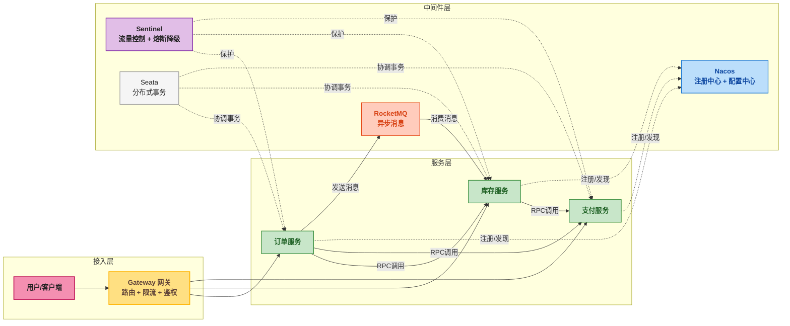
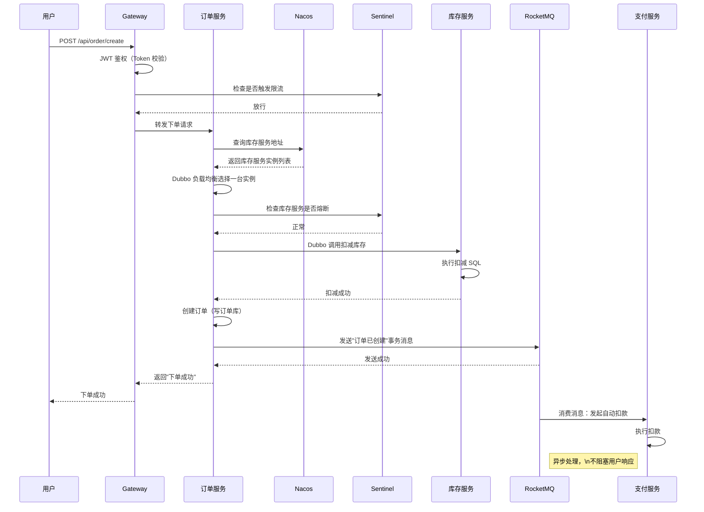
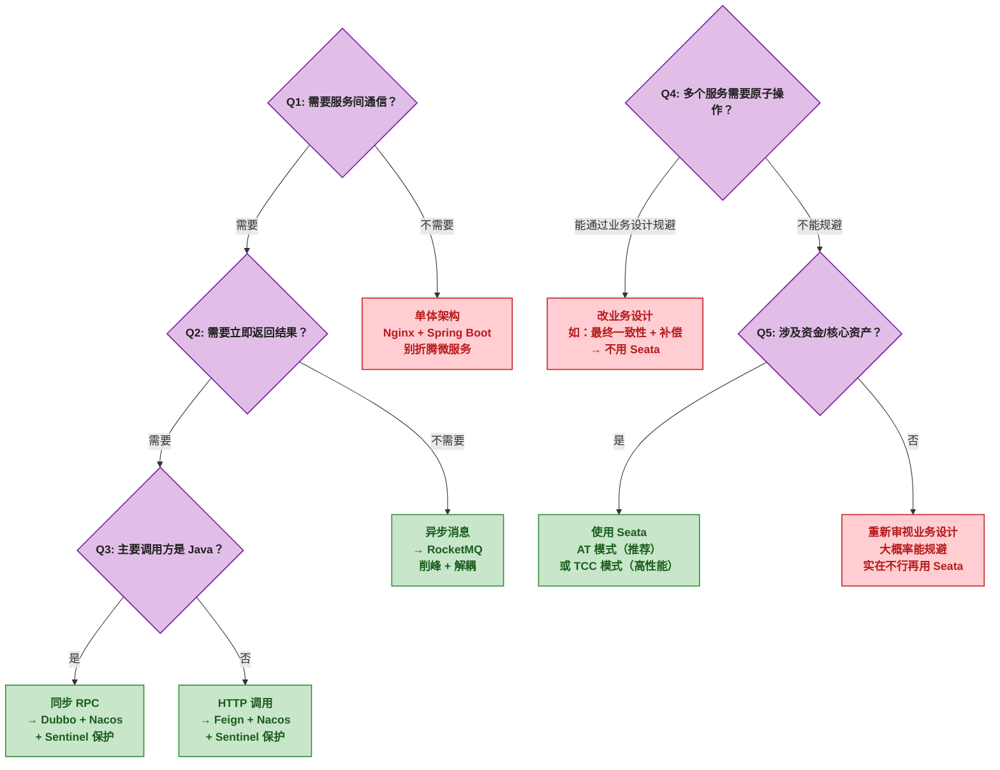

# Spring Cloud Alibaba 微服务中间件体系概念解析：从单体拆分到组件选型的避坑指南

## 📖 一、开篇：一个电商系统的"拆服务"血泪史

某人接手了一个电商项目。最开始就一个 Spring Boot 单体，订单、库存、支付、物流全塞在一起。单机跑得飞快，部署就一个 jar 包，轻松得很。

然后业务起来了。

大促期间，用户疯狂下单，库存扣减开始排队。支付回调偶尔超时，整个服务直接 502。最要命的是改一行订单逻辑，得把整个项目重新部署一遍。**一次发布，全员瑟瑟发抖。**

于是开始拆微服务。

> 📌 前置知识：微服务（Microservice）是一种架构风格，把一个大应用拆成多个独立部署的小服务，每个服务有自己的数据库和业务边界，服务之间通过网络（HTTP/RPC/MQ）通信。

拆完之后，新问题来了——不是技术的，是运维的。**服务之间怎么发现对方？怎么保证不出错？出错了怎么处理？** 以前一个方法调用 `orderService.deduct()` 就行，现在得想：库存服务在哪台机器上？万一它挂了怎么办？万一它响应太慢拖死订单服务怎么办？

这些问题，每一家互联网公司都会遇到。阿里巴巴把自己踩过的坑、写的解决方案打包开源，就是今天的 **Spring Cloud Alibaba**（一套与 Spring Cloud 生态集成的微服务中间件集合，由阿里巴巴开源）。

这篇博客不是教你写代码的。是让你看完之后，能跟同事说清楚：**"网关是用来干什么的？Sentinel 和 Hystrix 选哪个？Nacos 和 Eureka 有什么区别？什么时候该用 Seata，什么时候千万别用？"**

> ⚠️ 新手提示：如果你刚接触微服务，先记住一句话——微服务不是银弹。**如果你系统 QPS（每秒请求数）不到 100，用微服务是给自己找麻烦。** 单体 + Nginx 负载均衡，能解决你 90% 的问题。

---

## 🗺️ 二、总览图：六大组件，一张图看清

先把全景图画出来。一个标准的微服务架构，从上到下由这几个关键组件拼成：

是不是有点懵？没关系，拆开看。每一层就干一件事：

| 层 | 组件 | 一句话职责 |
|---|------|-----------|
| 接入层 | **Gateway** | 所有请求的"大门"，统一鉴权、路由、限流 |
| 保护层 | **Sentinel** | 服务的"保险丝"，流量太大就熔断，不拖死整个系统 |
| 通信层 | **Dubbo / Feign** | 服务间 RPC 调用（Dubbo 走 TCP，Feign 走 HTTP） |
| 注册/配置层 | **Nacos** | 服务注册发现 + 配置统一管理，相当于"服务电话号码本" |
| 消息层 | **RocketMQ** | 异步解耦，不需要立即返回结果的操作用消息队列削峰 |
| 事务层 | **Seata** | 跨服务的分布式事务协调，让多个服务的数据库操作要么全成功，要么全回滚 |

> ⚠️ 新手提示：你不需要同时用上这 6 个组件。创业公司上微服务，**Nacos + Dubbo/Feign + Sentinel** 三件套就够用了。RocketMQ 和 Seata 是高级玩法，QPS 没到 1000 先别碰。

---

## 🔍 三、各组件解析

### 🚪 Gateway —— 所有请求的"大门"

**一句话定位**：API 网关（API Gateway，所有外部请求进入微服务系统的唯一入口）。

**它做什么**：

- **统一路由**：根据请求路径把流量转发到对应的微服务，比如 `/order/**` 转发到订单服务
- **统一鉴权**：在网关层校验 JWT Token（JSON Web Token，一种无状态的用户身份凭证），不合法的请求直接拦掉，不用每个服务都写一遍鉴权代码
- **限流**：控制每秒通过的请求数，防止流量尖峰直接冲到后端服务

**它不做什么**：

- 不做业务逻辑——网关里不应该写订单计算、库存扣减这类代码
- 不做服务间通信——微服务内部互相调用走 Dubbo/Feign，不用经过网关

**常见误区**：

- 误区：网关能做所有事情 → 正确理解：**网关是轻量级的，逻辑越重越容易成为性能瓶颈**。鉴权 + 路由 + 简单限流就够了
- 误区：所有服务都放在网关后面 → 正确理解：纯内部服务（不暴露给外部）不需要经过网关

**什么时候用**：

- 系统有多于 3 个对外暴露 HTTP 接口的服务
- 需要统一的 Token 校验、IP 黑白名单、请求日志

**什么时候别用**：

- 你的系统就两三个服务，还都是内部管理后台——Nginx 反向代理够用了
- 纯 Dubbo 调用（TCP 协议）的内部系统——Gateway 只能代理 HTTP

**类比**：Gateway 就像公司前台。来访的人先到前台登记（鉴权），前台告诉你应该去几楼哪个房间（路由），同时保证一次不能涌进太多人（限流）。

---

### 🛡️ Sentinel —— 服务的"保险丝"

**一句话定位**：流量控制与熔断降级框架（流量控制指的是限制并发请求量，熔断降级指的是下游服务挂了就快速失败，不级联拖垮上游）。

**它做什么**：

- **流量控制**：比如"每秒最多 100 个请求"，超过的直接拒绝，而不是让请求排队等死
- **熔断降级**：当某个下游服务（如库存服务）响应时间过长或错误率过高时，快速返回一个兜底结果（如"库存查询暂时不可用"），而不是让调用方一直等待
- **自适应系统保护**：监控系统的 Load（CPU 负载）、RT（响应时间）、线程数等指标，自动触发保护

> ⚠️ 新手提示：熔断和限流不是一回事。**限流是"我自己扛不住，少来点"；熔断是"下游扛不住，我先不调了"。**

**它不做什么**：

- 不做业务规则的校验——比如"用户余额不能小于 0"这种业务逻辑不是 Sentinel 干的
- 不做服务注册发现——那是 Nacos 的活

**常见误区**：

- 误区：Sentinel 就是 Hystrix 的替代品 → 正确理解：功能上类似，但 Sentinel 的规则更细粒度，支持 QPS 和线程数两种限流模式，并且规则可以动态下发。Hystrix 已停更，**新项目直接 Sentinel**
- 误区：熔断开了就万事大吉 → 正确理解：**熔断是最后一道防线**，你得先搞清楚为什么被熔断，而不是降级了就假装没看见

**什么时候用**：

- 系统有 5 个以上互相调用的微服务
- 大促/活动期间需要降级非核心功能（比如推荐系统挂了，不影响下单主流程）
- 下游服务不稳定（第三方接口超时频繁）

**什么时候别用**：

- 单体应用——没地方熔断，就你自己在跑
- 服务间调用极少——没有调用，就没有熔断的必要

**类比**：Sentinel 就像你家电路的总闸。某一个电器短路了（下游服务挂了），总闸跳掉（熔断），保护整个电路不烧起来。如果你不开总闸，短路的地方继续过热，整栋楼都可能着火（级联故障）。

---

### 📞 Dubbo / Feign —— 服务间"打电话"

**一句话定位**：服务间 RPC 调用框架（RPC 即 Remote Procedure Call，远程过程调用，让跨网络的调用看起来像本地方法调用一样）。

**它做什么**：

- **Dubbo**：基于 TCP 协议的高性能 RPC 调用，支持多种序列化方式（Hessian、Protobuf 等），自带负载均衡和容错机制
- **Feign**：基于 HTTP 协议的声明式调用，写一个接口 + 注解就能调用远程服务，像调本地方法一样

**它不做什么**：

- 不做服务注册——它只管"打电话"，但"电话号码"是从 Nacos 查的
- 不做熔断——调用失败后的处理是 Sentinel 的事

**Dubbo vs Feign 对比**：

| 对比维度 | Dubbo | Feign |
|---------|-------|-------|
| 协议 | TCP（自定义 RPC 协议） | HTTP/HTTPS |
| 性能 | 高（长连接、二进制传输） | 较低（HTTP 文本协议开销大） |
| 跨语言 | 差（Java 原生） | 好（HTTP 通用） |
| 学习成本 | 中等 | 低（Spring Cloud 原生） |
| 适用场景 | 内部高并发服务间调用 | 对外 API 或需要跨语言调用 |

**常见误区**：

- 误区：Dubbo 已死，都用 Feign → 正确理解：**Dubbo 3.0 之后焕发第二春**，在纯 Java 内部调用的高并发场景下，Dubbo 性能碾压 Feign
- 误区：Feign 就是 RESTTemplate 的马甲 → 正确理解：Feign 是声明式的（写接口就行），RESTTemplate 是模板式的（你得手动拼接 URL 和参数），前者开发效率高一个数量级

**什么时候用 Dubbo**：

- 纯 Java 技术栈的内部微服务
- QPS 超过 1000 的高并发场景
- 需要调用链路追踪、服务治理等高级功能

**什么时候用 Feign**：

- 团队不熟悉 Dubbo，但熟悉 Spring Cloud
- 服务需要被非 Java 客户端调用
- 调用频率不高，性能不是第一优先级

**什么时候都别用**：

- 你的"微服务"实际上就部署在一台机器上——直接方法调用不香吗

**类比**：Dubbo 是公司内部座机（内部线路，速度快）；Feign 是手机（谁都能打，跨运营商也行）。如果你只跟公司同事打电话，装座机更好；如果你要接外部客户电话，用手机。

---

### 📒 Nacos —— 服务"电话号码本"

**一句话定位**：注册中心 + 配置中心（注册中心记录所有服务实例的网络地址，配置中心统一管理所有服务的配置文件）。

> 📌 前置知识：如果不理解"注册中心"是什么，可以这样想——以前单体应用里，A 调 B 只需要写 `localhost:8081`。但微服务里，库存服务可能部署在 10 台机器上，IP 是动态分配的（K8s 容器环境尤其如此）。A 怎么知道 B 在哪？这就是注册中心要解决的问题。

**它做什么**：

- **服务注册与发现**：每个服务启动时把自己注册到 Nacos，调用方从 Nacos 查询目标服务的地址列表
- **健康检查**：服务挂掉后，Nacos 自动将其从列表中剔除，调用方拿到的永远是活着的实例
- **配置管理**：把 `application.yml` 里的配置放到 Nacos，修改配置后无需重启服务即可生效

**它不做什么**：

- 不做流量转发——Nacos 只告诉你"对方在哪"，真正的调用是 Dubbo/Feign 干的
- 不做配置加密——敏感信息（数据库密码等）需要配合其他方案

**Nacos vs Eureka vs Consul**：

| 对比维度 | Nacos | Eureka | Consul |
|---------|-------|--------|--------|
| CAP 模型 | AP + CP 可切换 | AP | CP |
| 配置中心 | 有 | 无 | 有 |
| 健康检查 | TCP/HTTP/MySQL 多种 | HTTP | TCP/HTTP |
| 控制台 | 功能齐全 | 简陋 | 中等 |
| 社区活跃度 | 高（阿里维护） | 低（停更，仅维护） | 中 |
| 推荐度 | ⭐⭐⭐⭐⭐ | ⭐⭐ | ⭐⭐⭐ |

**常见误区**：

- 误区：Nacos 就是 Eureka 的替代品 → 正确理解：Nacos 是 **注册中心 + 配置中心** 的二合一，Eureka 只有注册中心功能。如果用了 Eureka，还得再搭一个 Config Server
- 误区：配置中心就是"把配置文件放到远程" → 正确理解：配置中心的真正威力是 **配置热更新**（改完配置，服务不重启就生效），以及**灰度发布**（只对部分实例推送新配置）

**什么时候用**：

- 任何超过 3 个实例的微服务系统
- 需要频繁调整配置（开关功能、调整阈值）的场景

**什么时候别用**：

- 你的服务就一个实例——写死在 `application.yml` 里也没事
- 配置不常变——没必要引入额外的复杂度

**类比**：Nacos 注册功能就像公司内部通讯录（每个员工入职登记，离职删掉）；配置功能就像公司公告栏（政策变了贴张纸，所有人都能看到，不用一个个通知）。

---

### 📬 RocketMQ —— 异步解耦的"快递员"

**一句话定位**：分布式消息队列（消息队列是一种异步通信模型，生产者发送消息到队列，消费者从队列取出消息处理，双方不需要同时在线）。

**它做什么**：

- **削峰填谷**：大促时瞬时 10w 个下单请求，直接打到数据库会死。先把请求扔进 RocketMQ，下游按自己的处理能力慢慢消费
- **解耦**：订单服务创建订单后，需要通知物流系统、发短信、更新用户积分。以前得在一个方法里串行调三个服务，现在发一条消息到 RocketMQ，各自订阅就行
- **事务消息**：RocketMQ 的杀手锏——保证"本地事务"和"消息发送"的原子性

> ⚠️ 新手提示：什么叫"事务消息"？假设下单时你要扣库存 + 发一条"订单已创建"的消息。如果扣库存成功了但消息没发出去？如果消息发出去了但扣库存失败了？RocketMQ 的事务消息就是解决这个问题的——它通过"半消息 + 本地事务检查"机制，保证扣库存和发消息要么都成功，要么都失败。

**它不做什么**：

- 不做业务处理——消息队列只是个"管道"，真正处理逻辑在消费者代码里
- 不做实时同步——消息存在延迟（通常毫秒级），想要同步返回结果请用 Dubbo/Feign

**什么时候用**：

- 业务流程可以异步化的部分——短信通知、日志收集、数据同步
- 大促削峰——秒杀场景第一道防线
- 跨系统数据同步——ERP、CRM 之间的数据互通

**什么时候别用**：

- 需要立即返回结果的业务——用户下单要看到"下单成功"四个字，不能让他等着消息被消费
- 消息量很小——Redis List 都能搞定，不用引入 RocketMQ
- **别把 MQ 当数据库**——MQ 的消息是有保存期限的，不能当作持久化存储

**类比**：RocketMQ 就像快递驿站。商家（生产者）把包裹放到驿站（队列），你不用等快递员上门，快递员（消费者）有空了就去驿站取件配送。如果双十一包裹太多，驿站可以暂时存着（削峰），快递员按自己速度配送，不会爆仓。

---

### 🤝 Seata —— 跨服务的"协调员"

**一句话定位**：分布式事务解决方案（分布式事务指的是一个业务操作涉及多个数据库，需要保证跨库的 ACID 特性）。

> 📌 前置知识：ACID（原子性、一致性、隔离性、持久性）是数据库事务的四个基本特征。在单体应用里，Spring 的 `@Transactional` 注解就能保证。但拆成微服务后，订单表和库存表在不同的数据库实例中，一个 `@Transactional` 管不了跨库操作。

**它做什么**：

- **AT 模式**：自动生成反向 SQL（Undo Log），事务提交失败时自动回滚。对业务代码零侵入
- **TCC 模式**：需要开发者手动实现 Try/Confirm/Cancel 三个方法，性能更好，但代码侵入大
- **Saga 模式**：长事务的正向 + 补偿流程，适合老系统改造

**它不做什么**：

- 不做性能优化——引入分布式事务一定会拖慢系统，这是 CAP 定理决定的
- 不做业务逻辑的自动补偿——TCC 模式的 Confirm 和 Cancel 你得自己写

**常见误区**：

- 误区：微服务就得用 Seata → 正确理解：**绝大多数分布式事务可以通过业务设计避免**。比如"先扣库存，再创建订单"改成"先创建订单，再异步扣库存，扣失败了取消订单"，就不需要分布式事务了
- 误区：Seata AT 模式开箱即用，随便用 → 正确理解：AT 模式依赖数据库的 UNDO 日志，对数据库有性能开销，且代理数据源的方式在某些 ORM 框架下有兼容问题

**什么时候用**：

- 跨服务的资金交易（支付 + 记账必须原子）
- 确实无法通过业务设计规避的分布式一致性场景

**什么时候别用**：

- 能用业务设计规避——**这是首选方案，比任何分布式事务框架都靠谱**
- 性能要求极高的核心链路——分布式事务的锁等待和两阶段提交会降低吞吐量
- 系统 QPS 不到 500——在这个量级，你大概率可以通过改表结构或者合并服务来规避分布式事务

**类比**：Seata 就像婚礼策划师。你要办一场婚礼（分布式事务），涉及酒店（订单服务）、婚庆（库存服务）、车队（支付服务），每个环节都得协调好。如果某个环节出了问题（酒店突然停电），策划师（Seata）得通知所有人：流程取消，各回各家（回滚）。

---

## 🔗 四、组合实战：一个下单请求的完整链路

光看单个组件不直观。来看一个真实的下单场景，六组件全部出场：

逐步骤拆解：

1. **Gateway**：请求入口。先验 Token，不合法直接 401。然后检查限流规则，QPS 超了就返回"系统繁忙"
2. **Nacos**：订单服务不知道库存服务在哪，去 Nacos 问。Nacos 返回活着的库存服务 IP 列表
3. **Sentinel**：订单服务调库存服务之前，先问 Sentinel"这台机器还能调吗？"如果库存服务最近报错太多，Sentinel 直接说"别调了，用兜底逻辑"
4. **Dubbo**：订单服务和库存服务之间的实际通信，TCP 长连接，序列化快
5. **RocketMQ**：订单创建完后，发一条异步消息。支付服务收到消息后做扣款。这一步异步化意味着：**用户下单成功后，支付可能晚几秒才完成，但不影响下单体验**
6. **Seata**：如果库存扣了、订单建了、但消息没发出去——别担心，RocketMQ 的事务消息保证原子性。如果跨多个表的操作（比如下单 + 用优惠券 + 扣积分），才需要 Seata 介入

---

## 🌳 五、决策树：我该用什么？

下次做技术选型时，对着这张图问自己三个问题就够了：

**一句话总结这张图**：

- 不用 RPC？别拆微服务
- 需要 RPC 且全 Java？Dubbo 一把梭
- 需要异步？上 RocketMQ
- 分布式事务？先想能不能改业务设计，别一上来就 Seata

---

## 🎯 六、总结：一张表收工

| 组件 | 一句话定位 | 核心职责 | 最常见误区 |
|------|-----------|---------|-----------|
| **Gateway** | 请求大门 | 鉴权、路由、限流 | 把业务逻辑写网关里 |
| **Sentinel** | 保险丝 | 限流、熔断、降级 | 开了熔断就不管报错原因 |
| **Dubbo/Feign** | 电话线 | 服务间 RPC 调用 | Dubbo 死了 / Feign 只支持 HTTP |
| **Nacos** | 通讯录 + 公告栏 | 注册发现 + 配置管理 | 只当注册中心用，不用配置中心 |
| **RocketMQ** | 快递驿站 | 异步解耦、削峰、事务消息 | 把 MQ 当数据库用 |
| **Seata** | 婚礼策划师 | 分布式事务协调 | 微服务就得用 Seata |

**最后三句话，记住就行**：

1. **微服务不是目的，解决问题才是。** QPS < 100 的系统，单体不丢人
2. **能用业务设计规避的，不要用技术框架硬扛。** 改业务比调参数靠谱
3. **Nacos + Dubbo/Feign + Sentinel** 是微服务最小化可行方案。RocketMQ 和 Seata 是加分项，不是必选项
