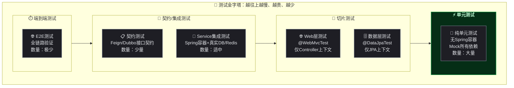
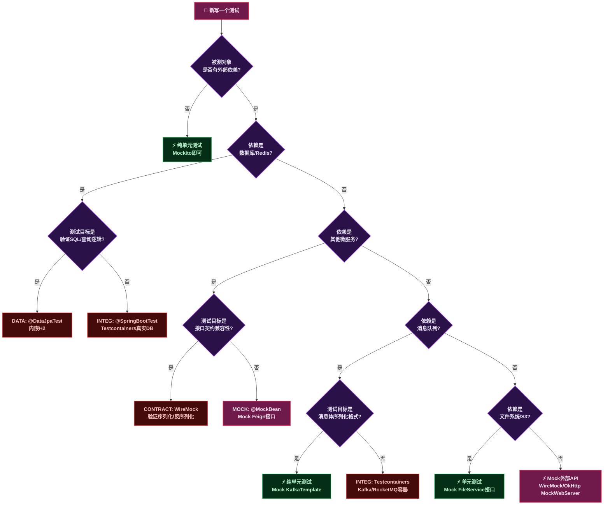
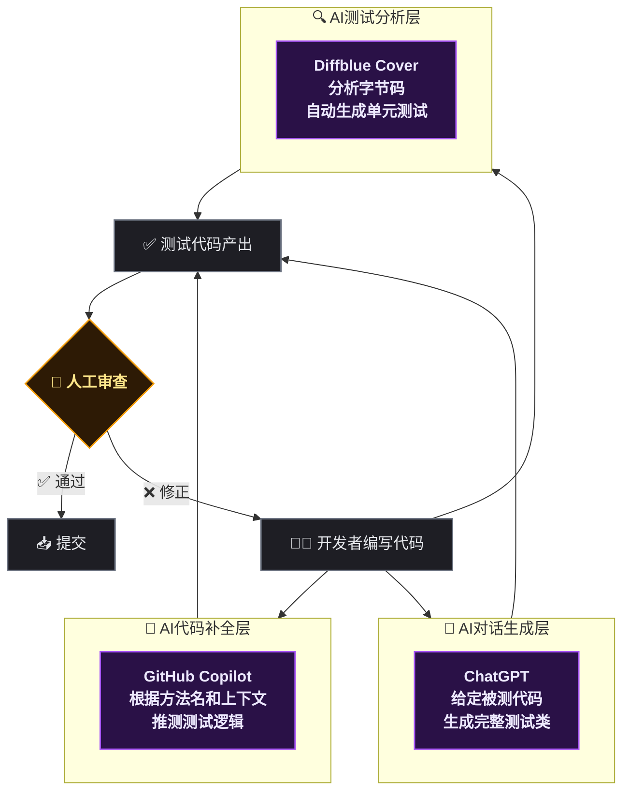

# SpringCloud微服务测试实战：分层策略、完整代码与AI时代的新思路

## 问题切入

写了一万行业务代码，测试用例只有三行——这种事情在微服务项目里尤其常见。不是开发者不想写测试，而是SpringCloud环境下的测试确实比单体应用复杂得多：服务之间通过Feign/Dubbo调用、配置在Nacos远端、消息通过RocketMQ/Kafka传递、数据库还分库分表。随便写个Service都依赖五六个外部组件，怎么测？

先说结论：微服务测试的核心思路是<strong>分层隔离</strong>。不同层级关注不同的验证目标，用不同的策略来隔离外部依赖。每一层有明确的边界和颗粒度，而不是不管三七二十一全部启动Spring容器。



这个金字塔翻译成SpringCloud语境下的操作指南，就是下面这张分层策略表：

| 测试层级 | 启动Spring容器? | 真实依赖 | Mock/Stub | 单个耗时 | 覆盖目标 |
|------|:---:|------|------|:---:|------|
| 纯单元测试 | 否 | 无 | 所有外部依赖 | 毫秒级 | 业务逻辑分支 |
| Web层切片 | 是(仅Controller) | 无 | Service/Mapper | 1 ~ 3秒 | 参数校验/序列化/异常处理 |
| 数据层切片 | 是(仅JPA) | 内嵌数据库(H2) | 无 | 1 ~ 3秒 | SQL映射/查询方法 |
| Service集成测试 | 是(完整) | H2/内嵌Redis | Feign/MQ/外部API | 3 ~ 8秒 | 事务边界/缓存/业务编排 |
| 契约测试 | 是(Consumer端) | 无 | 对Provider的Stub | 2 ~ 5秒 | Feign接口签名一致性 |
| 端到端测试 | 是(全部服务) | 全部 | 无 | 分钟级 | 全链路连通性 |

> ⚠️ 新手提示：这张表建议存下来当速查卡。每次写完代码准备写测试时，先对着表想清楚"这一层该启动什么、该Mock什么"，比盲目写省一半时间。

---

## 测试分层体系展开

### 第一层：纯单元测试 —— 底座最大的一层

纯单元测试不启动Spring容器，只验证单一类的业务逻辑。在SpringCloud项目里，大部分Service、工具类、领域模型的逻辑都适合用纯单元测试覆盖。

<strong>颗粒度</strong>：单个方法或单个类。

<strong>核心原则</strong>：被测对象之外的所有依赖全部Mock。

```java
@ExtendWith(MockitoExtension.class)
class UserDomainServiceTest {

    @Mock
    private UserRepository userRepository;

    @Mock
    private PasswordEncoder passwordEncoder;

    @InjectMocks
    private UserDomainService userDomainService;

    @Test
    void shouldThrowExceptionWhenUsernameAlreadyExists() {
        // 给定：用户名已存在
        when(userRepository.findByUsername("zhangsan"))
            .thenReturn(Optional.of(existingUser()));

        // 当：尝试创建同名用户 → 则：抛出业务异常
        assertThrows(DuplicateUserException.class, () ->
            userDomainService.createUser("zhangsan", "password123"));
    }

    @Test
    void shouldReturnEncodedUserWhenCreateSuccessfully() {
        // 给定：用户名不存在，密码编码器正常工作
        when(userRepository.findByUsername("lisi"))
            .thenReturn(Optional.empty());
        when(passwordEncoder.encode("password123"))
            .thenReturn("$2a$10$encodedPassword");
        when(userRepository.save(any(User.class)))
            .thenAnswer(inv -> inv.getArgument(0));

        // 当：创建用户
        User result = userDomainService.createUser("lisi", "password123");

        // 则：返回已编码的用户对象
        assertNotNull(result);
        assertEquals("lisi", result.getUsername());
        assertEquals("$2a$10$encodedPassword", result.getPassword());
    }

    private User existingUser() {
        User user = new User();
        user.setId(1L);
        user.setUsername("zhangsan");
        return user;
    }
}
```

逐行解释这段测试的结构：
- 第1行 `@ExtendWith(MockitoExtension.class)`：告诉JUnit5使用Mockito的扩展机制，自动初始化 `@Mock` 和 `@InjectMocks` 注解的字段
- `@Mock`：创建一个虚拟的 `UserRepository` 实现，所有方法调用默认返回null/空集合
- `@InjectMocks`：创建一个真实的 `UserDomainService` 实例，并把上面两个 `@Mock` 注入进去
- `when(...).thenReturn(...)`：定义Mock对象在收到特定调用时的返回值，这是Mockito的核心API
- `verify(userRepository, times(1)).findById(1L)`：验证Mock对象的某个方法被调用了几次

> 📌 前置知识：Mockito的存根（Stubbing）和验证（Verification）是两个独立操作。`when-thenReturn` 定义的是存根行为——调用了就返回什么。`verify` 是事后验证——某个方法到底有没有被调用。新手常犯的错误是把 `verify` 当断言用，但 `verify` 只管调用次数，不管返回值。

### 第二层：Web层切片测试 —— 只测Controller那一层

SpringBoot提供了 `@WebMvcTest` 注解，它只加载Controller相关的Bean（`@Controller`、`@ControllerAdvice`、`Filter`、`WebMvcConfigurer` 等），<strong>不加载</strong> `@Service`、`@Repository`、`@Component`。

<strong>颗粒度</strong>：单个Controller + 其Filter/Interceptor链。

<strong>适用场景</strong>：验证参数校验（`@Valid`/`@NotNull`）、响应格式（`@JsonInclude`）、异常处理（`@ExceptionHandler`）、权限拦截（Filter/Interceptor）。

```java
@WebMvcTest(UserController.class)
@Import(SecurityTestConfig.class)  // 导入测试专用的安全配置（跳过真实Token校验）
class UserControllerTest {

    @Autowired
    private MockMvc mockMvc;

    @MockBean
    private UserApplicationService userApplicationService;

    @Test
    void shouldReturn400WhenRequestBodyInvalid() throws Exception {
        // 发送缺少必填字段的JSON
        String invalidJson = """
            {
                "username": "",
                "email": "not-an-email"
            }
            """;

        mockMvc.perform(post("/api/users")
                .contentType(MediaType.APPLICATION_JSON)
                .content(invalidJson))
            .andExpect(status().isBadRequest())
            .andExpect(jsonPath("$.errors.username").exists())
            .andExpect(jsonPath("$.errors.email").exists());
    }

    @Test
    void shouldReturnUserDetailWith200() throws Exception {
        // 给定：Service层返回预定义的用户
        UserDTO mockUser = UserDTO.builder()
            .id(1L)
            .username("zhangsan")
            .email("zhangsan@example.com")
            .build();
        when(userApplicationService.getUserById(1L)).thenReturn(mockUser);

        // 当：请求用户详情 → 则：返回200 + JSON
        mockMvc.perform(get("/api/users/1")
                .header("Authorization", "Bearer test-token"))
            .andExpect(status().isOk())
            .andExpect(jsonPath("$.id").value(1))
            .andExpect(jsonPath("$.username").value("zhangsan"))
            .andExpect(jsonPath("$.email").value("zhangsan@example.com"));
    }

    @Test
    void shouldReturn401WhenTokenMissing() throws Exception {
        mockMvc.perform(get("/api/users/1"))
            .andExpect(status().isUnauthorized())
            .andExpect(jsonPath("$.message").value("缺少有效的认证Token"));
    }
}
```

`MockMvc` 是Spring MVC Test框架的核心类，它模拟HTTP请求但不启动真正的Servlet容器（Tomcat不启动），所以速度快但无法测试Servlet容器级别的行为。

> ⚠️ 新手提示：`@MockBean` 会把Spring容器中同类型的Bean替换为Mockito的Mock对象。如果同一个类型有多个Bean（比如多个 `@Service` 实现），需要用 `@Qualifier` 配合指定。另外，`@MockBean` 会导致Spring容器重建（缓存失效），同一测试类里用时没事，但跨测试类时可能显著拖慢整体速度。

### 第三层：数据层切片测试 —— 只测Repository/MyBatis Mapper

`@DataJpaTest` 只加载JPA相关的Bean（`@Entity`、`@Repository`、`DataSource` 等），默认使用内嵌数据库（H2）。

<strong>颗粒度</strong>：单个Repository/Mapper接口。

<strong>适用场景</strong>：验证JPQL/HQL/SQL查询语句、关联查询、分页排序、唯一约束。

```java
@DataJpaTest
@AutoConfigureTestDatabase(replace = AutoConfigureTestDatabase.Replace.NONE)
// ↑ 如果不想用H2自动替换，可以用这个注解保留真实数据库配置
class UserRepositoryTest {

    @Autowired
    private TestEntityManager entityManager;

    @Autowired
    private UserRepository userRepository;

    @BeforeEach
    void setUp() {
        // 每个测试方法前清理数据，保证用例独立性
        entityManager.getEntityManager()
            .createQuery("DELETE FROM User").executeUpdate();
    }

    @Test
    void shouldFindByUsernameWithExactMatch() {
        // 给定：插入一条用户数据
        User user = new User();
        user.setUsername("zhangsan");
        user.setEmail("zhangsan@example.com");
        user.setStatus(UserStatus.ACTIVE);
        entityManager.persistAndFlush(user);

        // 当：按用户名精确查询
        Optional<User> result = userRepository.findByUsername("zhangsan");

        // 则：找到且字段匹配
        assertTrue(result.isPresent());
        assertEquals("zhangsan@example.com", result.get().getEmail());
    }

    @Test
    void shouldReturnEmptyWhenUsernameNotFound() {
        Optional<User> result = userRepository.findByUsername("nonexistent");
        assertTrue(result.isEmpty());
    }

    @Test
    void shouldFindActiveUsersWithPagination() {
        // 插入20条数据，一半ACTIVE，一半INACTIVE
        for (int i = 0; i < 10; i++) {
            entityManager.persist(createUser("active-" + i, UserStatus.ACTIVE));
            entityManager.persist(createUser("inactive-" + i, UserStatus.INACTIVE));
        }
        entityManager.flush();

        // 分页查询ACTIVE用户，每页5条
        Pageable pageable = PageRequest.of(0, 5, Sort.by("username").ascending());
        Page<User> page = userRepository.findByStatus(UserStatus.ACTIVE, pageable);

        assertEquals(10, page.getTotalElements());
        assertEquals(2, page.getTotalPages());
        assertEquals(5, page.getContent().size());
    }

    private User createUser(String username, UserStatus status) {
        User user = new User();
        user.setUsername(username);
        user.setEmail(username + "@example.com");
        user.setStatus(status);
        return user;
    }
}
```

`TestEntityManager` 是 `@DataJpaTest` 提供的增强版EntityManager——它的 `persistAndFlush` 方法会立即同步到数据库，绕过Hibernate的一级缓存，确保后续查询走真实SQL。

如果用的是MyBatis-Plus而不是JPA，对应的切片测试注解用 `@MybatisPlusTest`（MyBatis-Plus 3.5.2+ 提供），或者手动用 `@SpringBootTest` + `@AutoConfigureTestDatabase` 组合。

### 第四层：Service集成测试 —— 连接真实中间件

这是微服务测试里最需要权衡的一层。Service通常依赖数据库、缓存、消息队列，全Mock的话测不出真实行为，全真实的话又太重。

<strong>颗粒度</strong>：单个Service + 真实DB/Redis + Mock的外部微服务调用。

<strong>策略</strong>：用Testcontainers（Docker化的真实MySQL/Redis）或H2/内嵌Redis替代真实中间件，用 `@MockBean` 或 WireMock 替代对其他微服务的Feign调用。

```java
@SpringBootTest
@TestPropertySource(properties = {
    "spring.cloud.nacos.discovery.enabled=false",
    "spring.cloud.nacos.config.enabled=false",
    "spring.cloud.sentinel.enabled=false"
})
@ActiveProfiles("test")
class UserApplicationServiceIntegrationTest {

    @Autowired
    private UserApplicationService userApplicationService;

    @Autowired
    private UserRepository userRepository;

    @MockBean
    private OrderFeignClient orderFeignClient;    // 对其他微服务的调用全部Mock

    @MockBean
    private SmsGateway smsGateway;                 // 第三方API全部Mock

    @BeforeEach
    void setUp() {
        userRepository.deleteAll();

        // 准备测试数据
        User user = new User();
        user.setUsername("integration-test-user");
        user.setEmail("test@example.com");
        user.setStatus(UserStatus.ACTIVE);
        userRepository.save(user);
    }

    @Test
    void shouldCreateUserAndPublishEvent() {
        // 给定：Mock外部依赖的返回值
        when(smsGateway.sendVerificationCode(anyString(), anyString()))
            .thenReturn(SmsResult.success());

        // 当：调用创建用户的完整应用服务
        CreateUserCommand command = new CreateUserCommand(
            "newuser", "password123", "new@example.com");
        UserDTO result = userApplicationService.createUser(command);

        // 则：用户被持久化 + 外部Mock被正确调用
        assertNotNull(result.getId());
        assertEquals("newuser", result.getUsername());

        // 验证：短信网关被调用了（带正确的参数）
        verify(smsGateway, times(1))
            .sendVerificationCode(eq("new@example.com"), anyString());

        // 验证：因为注册流程不依赖订单服务，所以不应该调它
        verifyNoInteractions(orderFeignClient);
    }

    @Test
    void shouldRollbackTransactionWhenExternalCallFails() {
        // 给定：短信发送会失败
        when(smsGateway.sendVerificationCode(anyString(), anyString()))
            .thenThrow(new SmsSendException("短信服务不可用"));

        CreateUserCommand command = new CreateUserCommand(
            "rollback-user", "password123", "rollback@example.com");

        // 当：创建用户 → 则：抛出异常，数据回滚
        assertThrows(SmsSendException.class, () ->
            userApplicationService.createUser(command));

        // 验证：数据库中没有残留数据
        Optional<User> found = userRepository.findByUsername("rollback-user");
        assertTrue(found.isEmpty());
    }
}
```

<p style="text-align:center; font-size:0.9em; color:#666;">图：Service集成测试的依赖隔离策略（启动完整Spring容器，但Mock外部微服务和第三方API）</p>

这个测试类里有几个关键配置值得展开：

- `TestPropertySource` 关掉了Nacos和Sentinel的自动配置——在测试环境里这些组件不可用，不关会导致启动失败
- `@MockBean` 替换了容器中的 `OrderFeignClient` 和 `SmsGateway`——这样测试就不会真的去调用其他微服务
- `verifyNoInteractions(orderFeignClient)` 验证某个Mock完全没被调用——这种"负向断言"在微服务测试里特别有用，比如验证用户注册流程不应该触发订单逻辑

#### 集成测试环境搭建：Testcontainers方案

上面用的是H2内嵌数据库，好处是不依赖Docker、启动飞快。坏处也很明显——H2和MySQL的SQL方言不完全兼容，有些SQL在H2上跑过了，上MySQL就挂。对于涉及复杂SQL、存储过程、或者需要验证数据库特定行为的场景，建议用Testcontainers拉起真实MySQL/Redis。

> 📌 前置知识：Testcontainers是一个Java库，通过Docker API在测试中启动临时容器。测试结束时自动销毁容器，保证环境干净。它的核心类是 `GenericContainer` 和各种专用Container（如 `MySQLContainer`、`RedisContainer`、`KafkaContainer`）。

<strong>第一步：添加依赖</strong>

```xml
<!-- pom.xml -->
<dependency>
    <groupId>org.testcontainers</groupId>
    <artifactId>testcontainers</artifactId>
    <version>1.18.3</version>
    <scope>test</scope>
</dependency>
<dependency>
    <groupId>org.testcontainers</groupId>
    <artifactId>mysql</artifactId>
    <version>1.18.3</version>
    <scope>test</scope>
</dependency>
<dependency>
    <groupId>org.testcontainers</groupId>
    <artifactId>junit-jupiter</artifactId>
    <version>1.18.3</version>
    <scope>test</scope>
</dependency>
```

<strong>第二步：编写application-test.yml</strong>

```yaml
# src/test/resources/application-test.yml
spring:
  # 测试环境的数据库配置先空着——Testcontainers会动态注入
  datasource:
    driver-class-name: com.mysql.cj.jdbc.Driver

  # 关掉所有SpringCloud组件（测试环境不需要）
  cloud:
    nacos:
      discovery:
        enabled: false
      config:
        enabled: false
    sentinel:
      enabled: false

  # JPA的DDL策略：测试环境每次重新建表
  jpa:
    hibernate:
      ddl-auto: create-drop
    show-sql: false

  # 用内嵌Redis替代（不需要Docker的简化方案）
  redis:
    host: localhost
    port: 6379

# 日志级别：测试时只打印ERROR，减少干扰
logging:
  level:
    root: WARN
    com.example: DEBUG
    org.testcontainers: INFO
    com.github.dockerjava: WARN
```

<strong>第三步：编写Testcontainers集成测试基类</strong>

```java
@SpringBootTest(webEnvironment = SpringBootTest.WebEnvironment.RANDOM_PORT)
@ActiveProfiles("test")
@TestPropertySource(properties = {
    "spring.cloud.nacos.discovery.enabled=false",
    "spring.cloud.nacos.config.enabled=false",
    "spring.cloud.sentinel.enabled=false"
})
@Testcontainers   // 启用Testcontainers的JUnit5扩展
public abstract class BaseIntegrationTest {

    // 使用 singleton 容器模式：同一个JVM内只启动一次，多个测试类共享
    // 否则每个测试类都启动一个MySQL容器，内存和时间都扛不住
    static final MySQLContainer<?> MYSQL = new MySQLContainer<>("mysql:8.0")
        .withDatabaseName("testdb")
        .withUsername("test")
        .withPassword("test")
        .withReuse(true);   // 允许容器复用（需在 ~/.testcontainers.properties 中启用）

    static final GenericContainer<?> REDIS = new GenericContainer<>("redis:7.0-alpine")
        .withExposedPorts(6379)
        .withReuse(true);

    static {
        MYSQL.start();
        REDIS.start();
    }

    @DynamicPropertySource
    static void configureDatasource(DynamicPropertyRegistry registry) {
        // 动态注入Testcontainers的连接信息（端口是随机的）
        registry.add("spring.datasource.url", MYSQL::getJdbcUrl);
        registry.add("spring.datasource.username", MYSQL::getUsername);
        registry.add("spring.datasource.password", MYSQL::getPassword);
        registry.add("spring.redis.host", REDIS::getHost);
        registry.add("spring.redis.port", () -> REDIS.getMappedPort(6379));
    }
}
```

<strong>第四步：编写具体集成测试</strong>

```java
class UserServiceIntegrationTest extends BaseIntegrationTest {

    @Autowired
    private UserRepository userRepository;

    @Autowired
    private UserApplicationService userApplicationService;

    @MockBean
    private OrderFeignClient orderFeignClient;

    @MockBean
    private SmsGateway smsGateway;

    @BeforeEach
    void setUp() {
        // 每个测试方法前清空表，避免测试间相互污染
        userRepository.deleteAll();
    }

    @Test
    void shouldPersistUserToRealMysqlAndCacheToRealRedis() {
        // 当：通过应用服务创建用户
        CreateUserCommand cmd = new CreateUserCommand(
            "testuser", "pass123", "test@example.com");
        when(smsGateway.sendVerificationCode(anyString(), anyString()))
            .thenReturn(SmsResult.success());

        UserDTO result = userApplicationService.createUser(cmd);

        // 则：数据在真实MySQL中可查
        Optional<User> fromDb = userRepository.findByUsername("testuser");
        assertTrue(fromDb.isPresent());
        assertEquals("test@example.com", fromDb.get().getEmail());
        // 注意：Redis缓存的验证需要写额外的集成测试，
        // 这里只验证MySQL持久化链路
    }

    @Test
    void shouldRollbackWhenConstraintViolation() {
        // 先插入一条
        userRepository.save(createUser("existing", "existing@test.com"));

        // 尝试插入同名的 → 应该失败
        CreateUserCommand cmd = new CreateUserCommand(
            "existing", "pass123", "another@test.com");

        assertThrows(DataIntegrityViolationException.class, () ->
            userApplicationService.createUser(cmd));
    }

    private User createUser(String username, String email) {
        User u = new User();
        u.setUsername(username);
        u.setEmail(email);
        u.setStatus(UserStatus.ACTIVE);
        return u;
    }
}
```

<strong>第五步：Maven分离单元测试和集成测试</strong>

```xml
<!-- pom.xml -->
<build>
    <plugins>
        <plugin>
            <groupId>org.apache.maven.plugins</groupId>
            <artifactId>maven-surefire-plugin</artifactId>
            <!-- surefire默认跑单元测试，排除集成测试 -->
            <configuration>
                <excludes>
                    <exclude>**/*IntegrationTest.java</exclude>
                </excludes>
            </configuration>
        </plugin>
        <plugin>
            <groupId>org.apache.maven.plugins</groupId>
            <artifactId>maven-failsafe-plugin</artifactId>
            <!-- failsafe专门跑集成测试（命名约定：*IT.java 或 *IntegrationTest.java） -->
            <executions>
                <execution>
                    <goals>
                        <goal>integration-test</goal>
                        <goal>verify</goal>
                    </goals>
                </execution>
            </executions>
            <configuration>
                <includes>
                    <include>**/*IntegrationTest.java</include>
                </includes>
            </configuration>
        </plugin>
    </plugins>
</build>
```

这样配置之后，执行流程变为：

```bash
# mvn test       → 只跑单元测试（快）
# mvn verify     → 先跑单元测试，再跑集成测试（慢，需要Docker）
```

> ⚠️ 新手提示：`maven-surefire-plugin` 和 `maven-failsafe-plugin` 的分工经常被搞混。简单记：surefire跑 `*Test.java`（单元测试），failsafe跑 `*IT.java` 或 `*IntegrationTest.java`（集成测试）。`mvn test` 只触发surefire，`mvn verify` 先surefire再failsafe。

#### 集成测试常见排错

| 症状 | 根因 | 解决 |
|------|------|------|
| `Caused by: com.github.dockerjava.api.exception.NotFoundException: No such image` | Testcontainers拉镜像失败（网络问题） | 先手动 `docker pull mysql:8.0`，或者配置镜像加速器 |
| 容器启动了但连接被拒绝 | 容器还没完全初始化 | `withStartupTimeout(Duration.ofSeconds(120))` 增大超时 |
| 第二个测试类启动又创建了新容器 | 没启用容器复用 | `withReuse(true)` + 创建 `~/.testcontainers.properties` 写入 `testcontainers.reuse.enable=true` |
| CI上跑不过，本地可以 | CI Runner没有Docker daemon | GitLab CI里用 `docker:dind` service；GitHub Actions里 `runs-on: ubuntu-latest` 自带Docker |
| 多个测试类并行跑时数据冲突 | 共享了数据库但没有清理 | 每个 `@BeforeEach` 中 `deleteAll()`，或每个测试类用独立database |

### 第五层：Feign客户端契约测试

SpringCloud里服务间调用大量使用OpenFeign。Feign接口本质上是一个契约——Consumer定义期望的接口形状，Provider实现它。契约测试验证的是：Consumer端的Feign接口定义与Provider端的Controller实现<strong>保持兼容</strong>。

<strong>颗粒度</strong>：单个Feign接口 + 对应的Controller。

```java
// ==================== Consumer端测试 ====================
@SpringBootTest(classes = FeignTestConfig.class)
@EnableFeignClients(clients = UserFeignClient.class)
class UserFeignClientContractTest {

    // WireMock 模拟 Provider 服务的HTTP响应
    @RegisterExtension
    static WireMockExtension wireMock = WireMockExtension.newInstance()
        .options(WireMockConfiguration.wireMockConfig().dynamicPort())
        .build();

    @DynamicPropertySource
    static void configureFeignUrl(DynamicPropertyRegistry registry) {
        registry.add("app.feign.user-service.url",
            () -> "http://localhost:" + wireMock.getPort());
    }

    @Autowired
    private UserFeignClient userFeignClient;

    @Test
    void shouldDeserializeResponseCorrectly() {
        // 用WireMock模拟Provider的返回
        wireMock.stubFor(get(urlEqualTo("/api/users/1"))
            .willReturn(aResponse()
                .withHeader("Content-Type", "application/json")
                .withBody("""
                    {
                        "id": 1,
                        "username": "zhangsan",
                        "email": "zhangsan@example.com"
                    }
                    """)));

        // 验证Consumer端的反序列化正确
        UserDTO result = userFeignClient.getUserById(1L);
        assertEquals(1L, result.getId());
        assertEquals("zhangsan", result.getUsername());
    }

    @Test
    void shouldHandleProvider5xxGracefully() {
        // 模拟Provider挂了
        wireMock.stubFor(get(urlEqualTo("/api/users/1"))
            .willReturn(aResponse().withStatus(503)));

        // 验证Consumer端的异常处理
        assertThrows(FeignException.ServiceUnavailable.class, () ->
            userFeignClient.getUserById(1L));
    }
}
```

```java
// ==================== Provider端测试 ====================
@WebMvcTest(UserController.class)
class UserControllerContractTest {

    @Autowired
    private MockMvc mockMvc;

    @MockBean
    private UserApplicationService userApplicationService;

    @Test
    void shouldMatchFeignClientContract() throws Exception {
        // Provider的Controller返回的JSON结构
        // 必须与Consumer的Feign接口定义一致
        when(userApplicationService.getUserById(1L))
            .thenReturn(UserDTO.builder()
                .id(1L).username("zhangsan")
                .email("zhangsan@example.com").build());

        String responseBody = mockMvc.perform(get("/api/users/1"))
            .andExpect(status().isOk())
            .andReturn().getResponse().getContentAsString();

        // 用JSON Schema验证响应结构的一致性
        JsonNode json = new ObjectMapper().readTree(responseBody);
        assertTrue(json.has("id"));
        assertTrue(json.has("username"));
        assertTrue(json.has("email"));
        assertEquals(1L, json.get("id").asLong());
    }
}
```

> 📌 前置知识：WireMock是一个HTTP Mock服务器，它在本地启动一个真实的HTTP端口，接收请求并返回预设的响应。Feign客户端以为自己真的在调远程服务，实际上请求发到了本地的WireMock。这种方式比Mock Feign接口本身更接近真实行为——能覆盖到Feign的编解码器、拦截器、超时配置等细节。

---

## 依赖隔离策略全景

上述五层测试的核心差异在于：<strong>哪些依赖保持真实、哪些依赖被Mock</strong>。下面的流程图展示了做这个决策时的判断逻辑。



这个决策树对应三个黄金规则：

1. <strong>纯逻辑不拉容器</strong>：如果被测逻辑不涉及数据库IO、网络IO、文件IO，直接用纯单元测试，毫秒级完成
2. <strong>数据层用切片</strong>：只测SQL/持久化逻辑时，用 `@DataJpaTest` 或 `@MybatisPlusTest`，启H2而非真实MySQL——启动快、可重复、无副作用
3. <strong>跨服务用契约</strong>：Feign/Dubbo调用不只是"调通"，更重要的是接口签名的一致性——用WireMock验证Consumer端的反序列化能力

---

## 消息队列测试

消息队列在微服务测试里经常被忽略——生产者写了，消费者也写了，但从没在本地跑通过一条完整的消息链路。

### 生产端测试

```java
@ExtendWith(MockitoExtension.class)
class OrderMessageProducerTest {

    @Mock
    private KafkaTemplate<String, String> kafkaTemplate;

    @InjectMocks
    private OrderMessageProducer producer;

    @Test
    void shouldSendOrderCreatedEventWithCorrectPayload() throws Exception {
        // 给定：创建订单事件
        OrderCreatedEvent event = new OrderCreatedEvent(
            "ORDER-001", 1L, new BigDecimal("99.90"));

        // 当：发送消息
        producer.sendOrderCreated(event);

        // 则：验证消息以正确的格式发送到了正确的Topic
        ArgumentCaptor<String> topicCaptor = ArgumentCaptor.forClass(String.class);
        ArgumentCaptor<String> payloadCaptor = ArgumentCaptor.forClass(String.class);

        verify(kafkaTemplate).send(topicCaptor.capture(), payloadCaptor.capture());

        assertEquals("order-created-topic", topicCaptor.getValue());

        // 验证消息体的JSON结构
        JsonNode json = new ObjectMapper().readTree(payloadCaptor.getValue());
        assertEquals("ORDER-001", json.get("orderId").asText());
        assertEquals("99.90", json.get("amount").asText());
    }
}
```

### 消费端测试

```java
@ExtendWith(MockitoExtension.class)
class OrderMessageConsumerTest {

    @Mock
    private OrderDomainService orderDomainService;

    @InjectMocks
    private OrderMessageConsumer consumer;

    @Test
    void shouldProcessOrderPaidMessageAndAck() {
        // 给定：模拟Kafka消费记录
        String messageBody = """
            {
                "orderId": "ORDER-001",
                "userId": 1,
                "amount": "99.90"
            }
            """;
        ConsumerRecord<String, String> record =
            new ConsumerRecord<>("order-paid-topic", 0, 0L, "key", messageBody);

        // 当：消费消息
        consumer.handleOrderPaid(record);

        // 则：验证业务逻辑被正确驱动
        verify(orderDomainService, times(1))
            .markOrderAsPaid(eq("ORDER-001"));
    }

    @Test
    void shouldNotThrowWhenDeserializationFails() {
        // 模拟损坏的消息体
        ConsumerRecord<String, String> record =
            new ConsumerRecord<>("order-paid-topic", 0, 0L, "key",
                "{broken json");

        // 不应该抛异常导致消费者卡住
        assertDoesNotThrow(() -> consumer.handleOrderPaid(record));
    }
}
```

> ⚠️ 新手提示：消费端测试里最容易漏掉的是反序列化失败的场景。生产环境里消息体格式可能因上游改动而异常，如果消费者没处理反序列化异常，会导致整个分区消费卡住。建议至少加一条"畸形消息"的测试用例。

---

## 个人全量测试流程

写完各种测试之后，怎么一键跑完所有测试并拿到完整的反馈？以下是推荐的个人本地全量测试流程。

### 第一步：按速度分层执行

```bash
# 最快：纯单元测试（不启动Spring容器）
mvn test -pl . -Dtest="*Test" -DfailIfNoTests=false

# 次快：切片测试（启动轻量Spring上下文）
mvn test -pl . -Dtest="*ControllerTest,*RepositoryTest"

# 较慢：集成测试（需要数据库/Redis就绪）
# 先启动依赖中间件
docker compose -f docker-compose-test.yml up -d mysql redis
# 再跑集成测试
mvn verify -pl . -Dtest="*IntegrationTest"
# 跑完关掉
docker compose -f docker-compose-test.yml down
```

### 第二步：依赖的Docker Compose文件

```yaml
# docker-compose-test.yml
version: '3.8'
services:
  mysql:
    image: mysql:8.0
    container_name: test-mysql
    environment:
      MYSQL_ROOT_PASSWORD: test123
      MYSQL_DATABASE: test_db
    ports:
      - "3307:3306"
    tmpfs:
      - /var/lib/mysql  # 数据全部在内存中，重启即清空

  redis:
    image: redis:7.0-alpine
    container_name: test-redis
    ports:
      - "6380:6379"

  kafka:
    image: confluentinc/cp-kafka:7.4.0
    container_name: test-kafka
    ports:
      - "9093:9093"
    environment:
      KAFKA_LISTENERS: PLAINTEXT://0.0.0.0:9093
      KAFKA_ADVERTISED_LISTENERS: PLAINTEXT://localhost:9093
      KAFKA_OFFSETS_TOPIC_REPLICATION_FACTOR: 1
```

### 第三步：一键全部测试脚本

```bash
#!/bin/bash
# run-all-tests.sh —— 本地全量测试一键脚本

set -e

echo "=== [1/4] 启动测试依赖中间件 ==="
docker compose -f docker-compose-test.yml up -d --wait mysql redis kafka

echo "=== [2/4] 纯单元测试 ==="
mvn test -Dtest="*Test" -DfailIfNoTests=false || {
    echo "❌ 单元测试失败，停止后续步骤"
    docker compose -f docker-compose-test.yml down
    exit 1
}

echo "=== [3/4] 切片测试 ==="
mvn test -Dtest="*ControllerTest,*RepositoryTest" || {
    echo "❌ 切片测试失败"
    docker compose -f docker-compose-test.yml down
    exit 1
}

echo "=== [4/4] Service集成测试 ==="
mvn verify -Dtest="*IntegrationTest" || {
    echo "❌ 集成测试失败"
    docker compose -f docker-compose-test.yml down
    exit 1
}

echo "=== 清理中间件 ==="
docker compose -f docker-compose-test.yml down

echo "✅ 全部测试通过！"
```

> 某开发者吐槽：见过最离谱的项目，跑全量测试要先手动启动4个终端窗口分别启动MySQL、Redis、Kafka、Nacos，然后才能点IDE里的运行按钮。新人第一天入职光搭测试环境就花了两天。花半小时写个 `docker compose` + 一键脚本，省的是之后几百次的重复劳动。

### 第四步：生成覆盖率汇总报告

```bash
# 生成Jacoco聚合报告（多模块项目需要report-aggregate）
mvn clean verify jacoco:report

# 查看报告
# 浏览器打开: target/site/jacoco-aggregate/index.html

# 或者用命令行快速检查覆盖率是否达标
mvn jacoco:check
# 不达标会构建失败（阈值在pom.xml的jacoco-maven-plugin中配置）
```

pom.xml中配置覆盖率阈值：

```xml
<plugin>
    <groupId>org.jacoco</groupId>
    <artifactId>jacoco-maven-plugin</artifactId>
    <version>0.8.10</version>
    <executions>
        <execution>
            <id>check</id>
            <goals><goal>check</goal></goals>
            <configuration>
                <rules>
                    <rule>
                        <element>BUNDLE</element>
                        <limits>
                            <limit>
                                <counter>LINE</counter>
                                <value>COVEREDRATIO</value>
                                <minimum>0.80</minimum>
                            </limit>
                            <limit>
                                <counter>BRANCH</counter>
                                <value>COVEREDRATIO</value>
                                <minimum>0.70</minimum>
                            </limit>
                        </limits>
                    </rule>
                </rules>
            </configuration>
        </execution>
    </executions>
</plugin>
```

---

## 2023年AI辅助测试：从代码补全到测试用例生成

> ⚠️ 这一段是本文中比较特别的内容——它不是讲具体技术，而是整理了一个开发者在2023年初对AI辅助测试的观察和思考。不是预测未来，而是梳理当时已经可以落地的事情。

### 当时AI在测试领域能做的三件事



#### GitHub Copilot：在IDE内实时补全

当时Copilot已经能根据被测方法名和上下文，自动生成JUnit测试骨架。实际体验：

- <strong>擅长</strong>：根据 `shouldXxxWhenYyy` 的测试方法名生成对应的 given-when-then 结构。比如写 `shouldReturnEmptyListWhenNoData`，Copilot会自动生成Mockito的 `when().thenReturn()` + `assertEquals` 断言
- <strong>不擅长</strong>：理解复杂的业务前置条件。比如"订单总额>=100且用户是VIP才免运费"，Copilot经常漏掉其中一个条件
- <strong>实用操作</strong>：先写测试方法名（用 `should_xxx_when_yyy` 或 `shouldXxxWhenYyy` 命名），然后按Tab接受Copilot的生成，再手动修正边界条件。大概能省30% ~ 50%的重复代码编写时间

#### ChatGPT：对话式生成完整测试类

把被测类的源码贴给ChatGPT，然后给出明确的指令：

```text
为以下UserDomainService编写JUnit5 + Mockito测试用例：
- 覆盖正常路径和异常路径
- 每个测试方法使用given-when-then结构
- 使用@ExtendWith(MockitoExtension.class)
- 不要测试null参数（已经在Controller层校验）

[贴入源码]
```

ChatGPT的产出：
- <strong>优点</strong>：能生成完整的测试类骨架，包括所有Mock字段和基本断言
- <strong>缺点</strong>：经常生成"没意义的测试"——比如 `assertNotNull(result)` 这种覆盖了行但不验证行为的用例。这是凑覆盖率的前兆
- <strong>实用操作</strong>：让AI生成骨架，开发者手动补充业务边界条件。把AI当"帮你写重复代码的工具"，而不是"替代你思考的人"

#### Diffblue Cover：基于字节码分析自动生成

Diffblue Cover分析字节码中的分支条件，自动生成覆盖所有路径的单元测试。在当时的体验：

- <strong>优点</strong>：自动发现边缘情况（null输入、空集合、边界值），生成的测试能直接通过编译
- <strong>缺点</strong>：生成的测试方法名是 `testMethodName` 这种无意义的命名，需要人工重命名为业务语义名
- <strong>结论</strong>：适合作为"覆盖率查漏补缺"工具——跑一遍Diffblue，看它覆盖了哪些分支，然后手动补充它遗漏的业务逻辑路径

### AI辅助测试的核心价值的判断

在当时看，AI对测试的最大价值不是"全自动生成，人不用管"，而是做了三件<strong>人做起来很耗时间但机器做起来很快</strong>的事：

1. <strong>生成Mockito样板代码</strong>：`@Mock`、`@InjectMocks`、`when().thenReturn()` 这种机械重复的结构，AI一秒完成
2. <strong>列举边界条件</strong>：null、空字符串、空集合、0、负数、超长字符串——这些人工容易漏掉的边界值，AI能系统性地列出
3. <strong>参数化测试数据</strong>：把多个相似的测试用例合并为一个 `@ParameterizedTest`，AI擅长做这种格式转换

而AI当时做不到的三件事：

1. <strong>理解业务语义</strong>：不知道"VIP用户满100免运费"意味着什么，只能生成覆盖分支但不验证业务正确的测试
2. <strong>设计测试策略</strong>：不知道对于这个Service，应该用纯单元测试还是集成测试，Mock哪些、保留哪些
3. <strong>判断测试质量</strong>：无法区分"有断言的测试"和"只跑代码不做验证的测试"

从根本上讲，当时AI在测试领域做的事情和它在代码生成领域做的一脉相承——能产出大段的、结构正确的代码，但缺乏对业务语义的理解。编写测试用例这件事，最核心的难度恰好在于理解和设计（知道该测什么、该怎么隔离依赖），而非代码编写（把测试写成JUnit方法）。用当时某位同行的话说：<strong>AI能帮你写一个测试方法的given-when-then骨架，但它写不出"为什么这些测试就够了"的理由。</strong>

### 实操建议

对于2023年初的开发者来说，利用AI辅助测试建议遵循一个三步流程：

1. <strong>人设计策略</strong>：决定这个类/方法属于测试金字塔的哪一层，Mock哪些依赖，保留哪些真实依赖
2. <strong>AI生成骨架</strong>：把被测代码和方法名列表丢给Copilot或ChatGPT，生成测试方法的骨架代码
3. <strong>人补充断言</strong>：检查AI生成的断言是否正确（特别是业务相关的断言），补充AI遗漏的边界条件和异常路径

这个流程的实质是：把机械劳动交给AI，把思考和决策留给自己——跟任何其他AI辅助编程场景没有区别。

---

## 总结

文章的核心观点整理成一张速查表：

| 层次 | 启动容器? | 核心注解 | Mock策略 | 单个耗时 | 数量占比 |
|------|:---:|------|------|:---:|:---:|
| 纯单元测试 | 否 | `@ExtendWith(MockitoExtension.class)` | Mock所有依赖 | <100ms | ~60% |
| Web层切片 | Controller | `@WebMvcTest` | `@MockBean` Service | 1 ~ 3s | ~15% |
| 数据层切片 | JPA | `@DataJpaTest` | 内嵌H2 | 1 ~ 3s | ~10% |
| Service集成 | 完整 | `@SpringBootTest` | `@MockBean` Feign/MQ/API | 3 ~ 8s | ~10% |
| 契约测试 | Consumer | `@SpringBootTest` + WireMock | Mock Provider HTTP | 2 ~ 5s | ~3% |
| 端到端 | 全部服务 | Testcontainers / 真实环境 | 无 | 分钟级 | ~2% |

在SpringCloud微服务环境里做测试，建议遵循以下原则：

1. <strong>金字塔底座要大</strong>：纯单元测试占60%以上。不要因为用了SpringCloud就把所有测试都写成 `@SpringBootTest`——Spring上下文启动再快也有开销，积少成多，几百个测试类累积起来就是五六分钟的差异
2. <strong>依赖隔离是核心能力</strong>：Nacos、Sentinel、Feign的自动配置在测试里要主动关闭（`enabled=false`）。对其他微服务的调用用 `@MockBean` 或 WireMock替换。一个测试只测一件事，不要顺带验证上下游
3. <strong>全量测试应该是一条命令</strong>：如果本地跑全量测试需要手工启动一堆中间件再点IDE按钮，那这个流程就有问题。`mvn verify` 加 `docker compose up -d`，一键搞定

从写完代码到测试通过，本质上是一个"验证假设"的过程——开发者假设这段代码能在各种条件下正确工作。测试的价值不在于写了多少行，而在于证伪了多少个可能导致问题的假设。分层测试的本质，是把无限的假设空间压缩到有限、有序的验证步骤里。