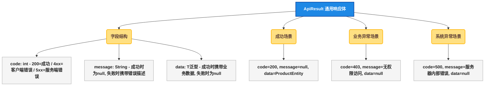
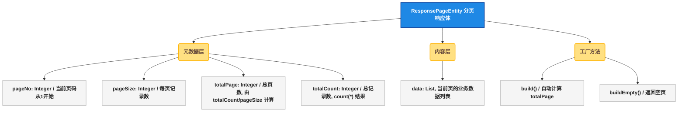
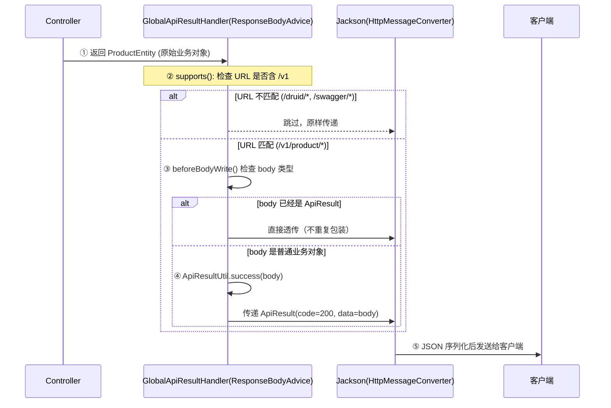
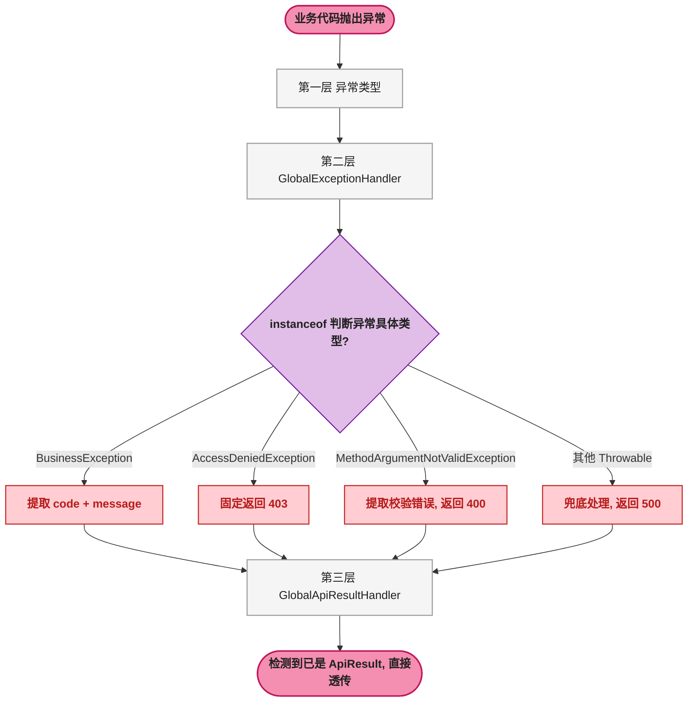
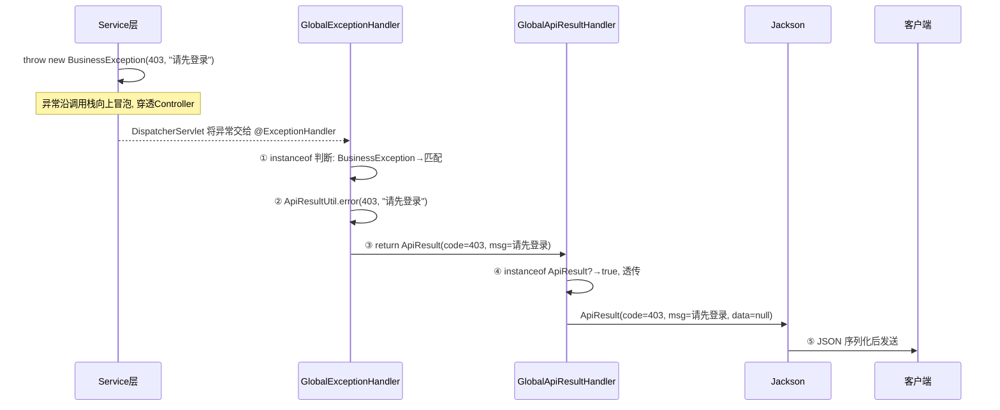
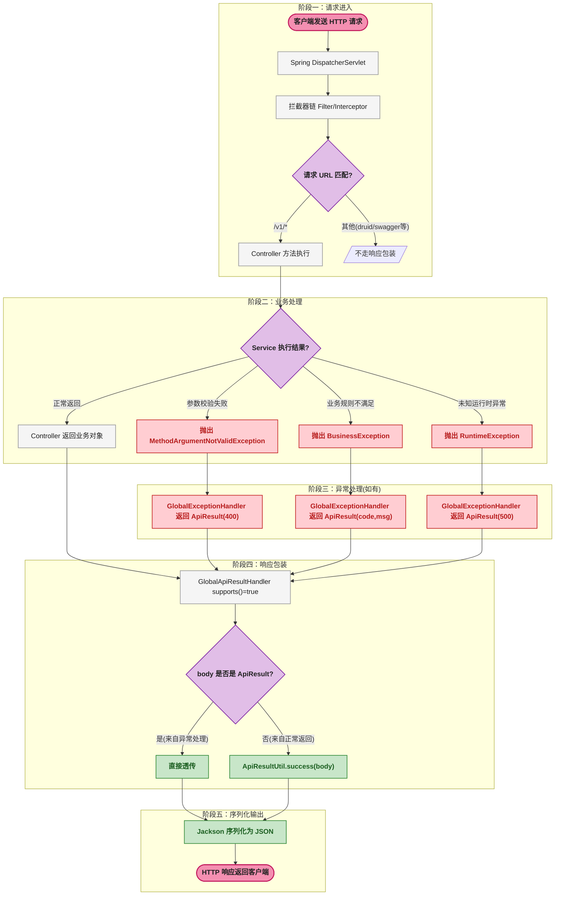

# API 响应封装：统一返回格式、全局自动包装与异常处理全解析

## 🤔 1. 问题切入：一个没有封装的 Controller 是怎样的？

在开始讲解之前，先看一段没有做任何统一封装的 Controller 代码：

```java
@RestController
@RequestMapping("/api/product")
public class ProductController {

    @Autowired
    private ProductService productService;

    @GetMapping("/findById")
    public ProductEntity findById(Long id) {
        ProductEntity product = productService.findById(id);
        if (product == null) {
            // 直接返回 null，前端收到空响应体，不知道发生了什么
            return null;
        }
        return product;
    }

    @PostMapping("/insert")
    public String insert(@RequestBody ProductEntity product) {
        try {
            productService.insert(product);
            return "success";  // 字符串硬编码，前后端契约不统一
        } catch (Exception e) {
            return e.getMessage(); // 把异常栈暴露给前端，安全风险
        }
    }
}
```

这段代码暴露了三个问题：

1. **返回格式不统一** ：查询返回 ProductEntity，新增返回 String，异常时返回错误信息字符串——前端需要针对每个接口写不同的解析逻辑。
2. **错误信息不可控** ：return e.getMessage() 可能将数据库表结构、SQL 语句等敏感信息直接返回给客户端。
3. **状态码混乱** ：成功和失败无法通过统一的字段区分，HTTP 状态码和业务状态码职责不清。

一个成熟的商城项目，其 API 层必须具备 **统一的响应格式** （Uniform Response Format）、 **集中的异常处理** （Centralized Exception Handling）和 **自动的响应包装** （Auto Response Wrapping）。接下来逐层拆解 susan_mall 项目是如何实现这三点的。

## 🏗️ 2. 核心数据结构：整个响应体系的"骨架"

整个响应封装体系由三个核心数据结构构成，分别对应三种响应场景。

### 📦 2.1 ApiResult\<T\>：通用响应体（通用场景）

ApiResult\<T\>（泛型响应实体）是该项目的唯一通用响应格式。所有 API 返回给前端的数据最终都会被包装成这个结构。



**源码佐证** （ApiResult.java）：

```java
@NoArgsConstructor
@AllArgsConstructor
@Data
public class ApiResult<T> {

    /** 请求成功状态码，直接引用 HTTP 200 */
    public static final int OK = HttpStatus.HTTP_OK;  // ① 成功码常量

    private int code;       // ② 接口返回码，200 表示成功
    private String message;  // ③ 接口返回信息，成功时为 null
    private T data;          // ④ 泛型数据载体，失败时为 null
}
```

关键点：
- **① OK = 200** ：将 HTTP 标准状态码作为成功标识，而不是自定义的 0 或 1，这样与 HTTP 协议保持一致，网关层可以直接识别。
- **② 泛型 T** ：data 字段的类型由调用方决定，ApiResult\<ProductEntity\> 和 ApiResult\<List\<MenuTreeDTO\>\> 都是同一个类，编译期类型安全。
- **③ message 成功时为 null** ：减少传输体积（Jackson 默认不序列化 null 值的情况下完全省略该字段）。

### 📄 2.2 ResponsePageEntity\<T\>：分页响应体（列表场景）

当 API 返回列表数据时，仅有 data 字段不够——前端还需要知道当前页码、总页数、总记录数以便渲染分页组件。



**源码佐证** （ResponsePageEntity.java —— 核心计算逻辑）：

```java
public static <T> ResponsePageEntity<T> build(
        RequestPageEntity requestPageEntity,
        Integer totalCount,
        List<T> data) {
    // ① 根据 pageSize 和 totalCount 计算总页数
    Integer totalPage = getTotalPage(
        requestPageEntity.getPageSize(), totalCount);
    return new ResponsePageEntity(
        requestPageEntity.getPageNo(),
        requestPageEntity.getPageSize(),
        totalPage, totalCount, data);
}

private static Integer getTotalPage(Integer pageSize, Integer totalCount) {
    if (Objects.isNull(pageSize) || Objects.isNull(totalCount)) {
        return ZERO;
    }
    if (pageSize <= 0 || totalCount <= 0) {
        return ZERO;                  // ② 参数不合法时返回 0 而非异常
    }
    // ③ 取余计算：能被整除则正好，否则多一页
    return totalCount % pageSize == 0
        ? totalCount / pageSize
        : totalCount / pageSize + 1;
}
```

关键点：
- **① totalPage 由后端计算** ：前端不需要做 Math.ceil(totalCount / pageSize)，直接使用即可，前端只需负责展示。
- **② 防御性编程** ：pageSize \<= 0 时返回 0 而不是抛出异常，防止因前端传参错误导致页面白屏。
- **③ 取余计算** ：totalCount % pageSize == 0 整除判断是分页计算的标准做法。

### 📊 2.3 三个核心结构体的职责对照

| 结构体 | 所在模块 | 职责 | 被谁使用 |
|--------|:---:|------|---------|
| ApiResult\<T\> | mall-common | 通用 API 响应包装，承载单次请求的成败信息 | 所有 Controller 返回值的最终包装形态 |
| ResponsePageEntity\<T\> | mall-common | 分页查询的专用响应，承载页码/页数/总数 | 所有分页接口的 Controller 返回值 |
| RequestPageEntity | mall-common | 分页请求参数基类，承载 pageNo/pageSize/排序 | 所有分页查询接口的入参父类 |

**层级关系** ：一个分页接口的 Controller 返回 ResponsePageEntity\<ProductEntity\> → 经 GlobalApiResultHandler 自动包装 → 最终 HTTP 响应体为 ApiResult\<ResponsePageEntity\<ProductEntity\>\>（嵌套包装）。

## ⚙️ 3. 自动包装机制：Controller 不需要手动调用 success()

这是整个设计中最巧妙的部分——Controller 方法返回什么，框架就自动包什么。

### 🧠 3.1 设计思路：用 AOP 思维消除模板代码

如果每个 Controller 方法都手动写 ApiResultUtil.success(data)，那么项目中会有几百次重复调用。更好的做法是：Controller 只返回业务数据，由统一拦截器在序列化之前自动包装。

Spring MVC 提供了 ResponseBodyAdvice 接口（响应体增强器），它能在 Controller 返回值被 HttpMessageConverter 序列化之前拦截并修改。

### 🔄 3.2 GlobalApiResultHandler 的完整工作流程



### 🔍 3.3 源码逐行解析

```java
@ControllerAdvice  // ① 声明全局拦截
public class GlobalApiResultHandler implements ResponseBodyAdvice<Object> {
    public static final String URL_PREFIX = "/v1";  // ② 只拦截业务 API

    @Override
    public boolean supports(MethodParameter returnType,
            Class<? extends HttpMessageConverter<?>> converterType) {
        // ③ 从请求上下文中获取当前 URL
        ServletRequestAttributes sra = (ServletRequestAttributes)
            RequestContextHolder.getRequestAttributes();
        HttpServletRequest request = sra.getRequest();
        String requestURI = request.getRequestURI();
        return matchUrl(requestURI);  // ④ URL 包含 "/v1" 才生效
    }

    private boolean matchUrl(String uri) {
        if (StringUtils.isBlank(uri)) {
            return false;
        }
        return uri.contains(URL_PREFIX);
    }

    @Override
    public Object beforeBodyWrite(Object body,  // ⑤ Controller 的原始返回值
            MethodParameter returnType, MediaType selectedContentType,
            Class<? extends HttpMessageConverter<?>> selectedConverterType,
            ServerHttpRequest request, ServerHttpResponse response) {
        // ⑥ 如果已经是 ApiResult（如异常处理器返回的），直接透传
        if (body instanceof ApiResult) {
            return (ApiResult) body;
        }
        // ⑦ 否则包装成 ApiResult(code=200, data=body)
        return ApiResultUtil.success(body);
    }
}
```

每一行的设计意图：

| 行号 | 作用 | 设计意图 |
|:---:|------|---------|
| ① | @ControllerAdvice | 声明这是一个全局的 Controller 增强器，对全部 @RestController 生效 |
| ② | URL_PREFIX = "/v1" | 通过 URL 前缀区分业务 API 和框架内置接口（Druid、Swagger），只对业务 API 做包装 |
| ③ | supports() | Spring 在序列化前回调此方法，返回 true 才会进入 beforeBodyWrite() |
| ④ | uri.contains("/v1") | 简单的前缀匹配，该项目的所有业务 Controller 都挂载在 /v1 路径下 |
| ⑤ | body 参数 | Controller 方法的原始返回值——可能是 ProductEntity、List、void、int 等任何类型 |
| ⑥ | instanceof ApiResult | 防止二次包装。如果 GlobalExceptionHandler 已经返回了 ApiResult，这里透传即可 |
| ⑦ | ApiResultUtil.success(body) | 核心包装逻辑：将任意业务返回值放入 ApiResult.data 字段 |

### ⚖️ 3.4 Controller 写法对比

| 场景 | 没有自动包装的写法 | 该项目的写法 |
|------|-------------------|-------------|
| 查询单条 | return ApiResultUtil.success(service.findById(id)); | return service.findById(id); |
| 分页查询 | return ApiResultUtil.success(service.searchByPage(c)); | return service.searchByPage(c); |
| 新增（无返回） | service.insert(e); return ApiResultUtil.success(); | service.insert(e); |
| 删除（返回影响行数） | return ApiResultUtil.success(service.deleteByIds(ids)); | return service.deleteByIds(ids); |

Controller 的代码量减少约 **40%** ，且每个方法只关心自己的业务逻辑，不再混杂响应包装的模板代码。这就是关注点分离（Separation of Concerns）——业务代码写业务逻辑，基础设施代码写横切关注点。

## 🚨 4. 异常处理体系：让错误信息也遵循统一格式

统一响应格式意味着错误也必须用 ApiResult 表达，而不是返回一个栈轨迹字符串。该项目的异常处理体系由三个组件协作完成。

### 🏗️ 4.1 三层协作架构



### 💥 4.2 BusinessException：业务异常只关心两件事

```java
@AllArgsConstructor
@Data
public class BusinessException extends RuntimeException {

    private int code;      // ① 业务状态码（如 403、400、自定义码）
    private String message; // ② 可读的错误描述
    //                  ③ 继承 RuntimeException，不强制 try-catch

    public BusinessException(String message) {
        this.code = HttpStatus.INTERNAL_SERVER_ERROR.value(); // 默认 500
        this.message = message;
    }
}
```

设计要点：
- **① code** ：直接使用 HTTP 标准状态码，而不是自定义 10001 之类的魔法数字。优点是网关和监控系统可以直接识别。
- **② message** ：前端可以直接展示给用户看，所以写的是"无权限访问"而不是"AccessDeniedException at line 47"。
- **③ 非受检异常** ：继承 RuntimeException 使得业务代码不必写 throws 声明，也不用在调用链上逐层 try-catch。

### 🎯 4.3 GlobalExceptionHandler：唯一的异常出口

```java
@Slf4j
@RestControllerAdvice  // ① = @ControllerAdvice + @ResponseBody
public class GlobalExceptionHandler {

    @ExceptionHandler(Throwable.class)  // ② 兜底捕获所有异常
    public ApiResult handleException(Throwable e) {
        if (e instanceof BusinessException) {           // ③ 业务异常——级别 info
            BusinessException be = (BusinessException) e;
            log.info("请求出现业务异常：", e);
            return ApiResultUtil.error(be.getCode(), be.getMessage());
        }
        if (e instanceof AccessDeniedException) {       // ④ 权限异常——级别 info
            log.info("权限异常：", e);
            return ApiResultUtil.error(403, "无权限访问，请联系系统管理员！");
        }
        if (e instanceof MethodArgumentNotValidException) {  // ⑤ 参数校验
            BindingResult br = ((MethodArgumentNotValidException) e).getBindingResult();
            return ApiResultUtil.error(400, br.getFieldError().getDefaultMessage());
        }
        log.error("请求出现系统异常：", e);  // ⑥ 未知异常——级别 error
        return ApiResultUtil.error(500, "服务器内部错误，请联系系统管理员！");
    }
}
```

关键设计决策：
- **② 捕获 Throwable.class** ：连 Error 也兜底。
- **③ ④ 日志级别 = info** ：业务异常和权限异常是预期内的，不需要 error 级别触发告警。
- **⑥ 日志级别 = error** ：未知异常需要运维介入，log.error 会输出完整栈轨迹到日志文件，但不暴露给前端。
- **⑤ getFieldError().getDefaultMessage()** ：校验失败时只返回第一条错误信息。

### 📊 4.4 异常处理流程图（从抛出到 JSON 输出）



## 🛠️ 5. 周边支撑组件

### 🏭 5.1 ApiResultUtil：静态工厂，屏蔽构造细节

```java
public class ApiResultUtil {
    private ApiResultUtil() {}  // ① 工具类禁止实例化

    public static <T> ApiResult<T> success(T data) {
        return new ApiResult<>(ApiResult.OK, null, data);  // ② message 固定为 null
    }

    public static <T> ApiResult<T> success() {
        return success(null);  // ③ 无返回值接口（insert/update/delete）直接用此重载
    }

    public static <T> ApiResult<T> error(int code, String message) {
        return new ApiResult<>(code, message, null);  // ④ data 固定为 null
    }
}
```

这是一个典型的静态工厂方法（Static Factory Method）模式。好处：调用方不需要知道 ApiResult 构造函数几个参数、参数的顺序——只需要表达意图"成功并带数据"或"失败并给出原因"。

### ✅ 5.2 AssertUtil：让参数校验也能抛 BusinessException

```java
public abstract class AssertUtil {
    public static final int ASSERT_ERROR_CODE = 1;

    public static void notNull(Object object, String message) {
        if (object == null) {
            throw new BusinessException(ASSERT_ERROR_CODE, message);
        }
    }

    public static void hasLength(String text, String message) {
        if (!StringUtils.hasLength(text)) {
            throw new BusinessException(ASSERT_ERROR_CODE, message);
        }
    }
    // ... isTrue, notEmpty, doesNotContain 等
}
```

这个工具类的作用：让 Service 层的参数校验也能享受全局异常处理的红利。用法示例：

```java
// Service 层中校验
AssertUtil.notNull(userId, "用户ID不能为空");
AssertUtil.hasLength(userName, "用户名不能为空");
// 如果校验失败，直接抛出 BusinessException，由 GlobalExceptionHandler 统一处理
```

### 📥 5.3 RequestPageEntity：分页请求的标准化入口

```java
@Data
public class RequestPageEntity implements Serializable {
    private static final int DEFAULT_PAGE_SIZE = 10;

    private Integer pageNo = 1;           // 默认第 1 页
    private Integer pageSize = DEFAULT_PAGE_SIZE;  // 默认每页 10 条
    private List<String> sortField;       // 排序字段，格式: "create_time,desc"

    public Integer getPageBegin() {
        // 计算 SQL LIMIT 的起始偏移量: (pageNo - 1) * pageSize
        if (Objects.isNull(this.pageNo) || this.pageNo <= 0) {
            this.pageNo = 1;
        }
        return (this.pageNo - 1) * this.pageSize;
    }
}
```

设计要点：
- **默认值防御** ：pageNo 默认 1，pageSize 默认 10。当前端漏传分页参数时，接口不至于报 NPE 或查询全表。
- **getPageBegin() 自动计算** ：MyBatis Mapper 的 LIMIT #{pageBegin}, #{pageSize} 语法可以直接引用此方法。

## 🔄 6. 完整请求-响应生命周期

将前面所有的组件串联起来，一个完整的 API 请求经过以下路径：



## 💡 7. 这种设计在日常开发中的价值

### 🎨 7.1 前端收到的始终是同一种 JSON 结构

无论调用哪个接口，前端只需要按一种格式解析：

```javascript
// 成功：查询单条
{ "code": 200, "message": null, "data": { "id": 1, "name": "iPhone 15" } }

// 成功：分页列表
{ "code": 200, "message": null, "data": { "pageNo": 1, "totalCount": 128, "data": [...] } }

// 成功：新增/修改/删除（无返回数据）
{ "code": 200, "message": null, "data": null }

// 失败：业务异常
{ "code": 403, "message": "请先登录", "data": null }

// 失败：参数校验
{ "code": 400, "message": "用户名不能为空", "data": null }

// 失败：系统异常
{ "code": 500, "message": "服务器内部错误", "data": null }
```

前端只需要在一处拦截器（如 axios 的 response interceptor）中判断 code === 200 来决定走成功回调还是错误提示。

### 💡 7.2 新人只需要知道"抛异常"就是"返回错误"

对于一个新加入团队的开发者：

- 想返回成功：Controller 方法直接 return 业务对象，框架自动包装。
- 想返回错误：throw new BusinessException(403, "库存不足")，不用写 return ApiResultUtil.error(...)。
- 想校验参数：AssertUtil.notNull(userId, "用户ID不能为空")，不用在每个 Controller 里手写 if 判断。

### 📋 7.3 日志分级对运维友好

| 异常类型 | 日志级别 | 是否会触发告警 | 原因 |
|---------|:---:|:---:|------|
| BusinessException | INFO | 否 | 预期的业务规则不让通过，不需要运维介入 |
| AccessDeniedException | INFO | 否 | 权限框架的正常拦截行为，不是系统故障 |
| MethodArgumentNotValidException | 无单独日志 | 否 | 前端校验就能拦截的，属于数据质量信息 |
| 其他未捕获 Throwable | ERROR | 是 | NullPointerException、SQLException 需要运维排查 |

## 🎯 8. 总结

### 🗺️ 8.1 组件关系总览

| 组件 | 类型 | 职责 | 工作时机 |
|------|------|------|---------|
| ApiResult\<T\> | 数据结构 | 定义统一的 {code, message, data} 格式 | 序列化阶段 |
| ApiResultUtil | 工具类 | 提供 success() / error() 静态工厂方法 | 需要显式创建 ApiResult 时 |
| ResponsePageEntity\<T\> | 数据结构 | 携带分页元数据（页码/总页数/总记录数） | 分页查询接口返回时 |
| GlobalApiResultHandler | ResponseBodyAdvice | 自动将 Controller 返回值包装为 ApiResult | Controller 返回后、序列化前 |
| BusinessException | 异常类 | 携带 code + message 的非受检异常 | 业务规则不满足时抛出 |
| GlobalExceptionHandler | @RestControllerAdvice | 将各种异常转换为 ApiResult.error() | 异常冒泡到 DispatcherServlet 时 |
| AssertUtil | 工具类 | 参数校验不通过时抛出 BusinessException | Service/Controller 参数检查时 |
| RequestPageEntity | 数据结构 | 统一分页请求参数的接收格式 | Controller 接收分页查询请求时 |

### 📏 8.2 设计原则对照

| 原则 | 在该项目中的体现 |
|------|-----------------|
| 单一职责 | Controller 只负责路由，Service 只负责业务，ResponseBodyAdvice 只负责包装 |
| 开闭原则 | 新增一个 API 接口不需要修改响应包装逻辑，框架自动适配 |
| DRY | ApiResultUtil.success() 消除 100+ 处重复代码 |
| 防御性编程 | RequestPageEntity 的 pageNo/pageSize 有默认值，getTotalPage() 对零值输入返回 0 |
| 安全第一 | 异常栈只记录日志，不返回给客户端；错误消息经过审核再暴露 |
| 关注点分离 | 业务代码写业务逻辑，基础设施代码（响应包装、异常处理）放在独立切面中 |

### 📋 8.3 适合复制到其他项目的部分

如果要在自己的项目中实现类似的响应封装，需要的最小文件集合是：

1. ApiResult.java —— 通用响应体（35 行）
2. ApiResultUtil.java —— 静态工厂（35 行）
3. BusinessException.java —— 业务异常（30 行）
4. GlobalExceptionHandler.java —— 全局异常处理（40 行）
5. GlobalApiResultHandler.java —— 自动包装（40 行）
6. ResponsePageEntity.java —— 分页响应（80 行，可选）

总计不到 300 行代码，即可构建一套完整的 API 响应封装体系。
