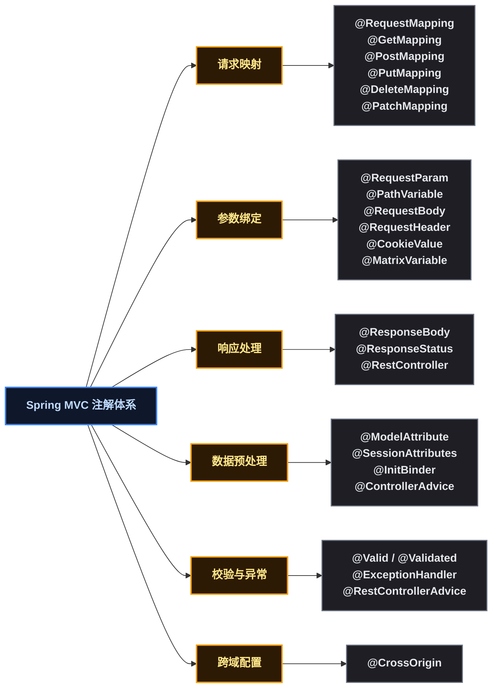
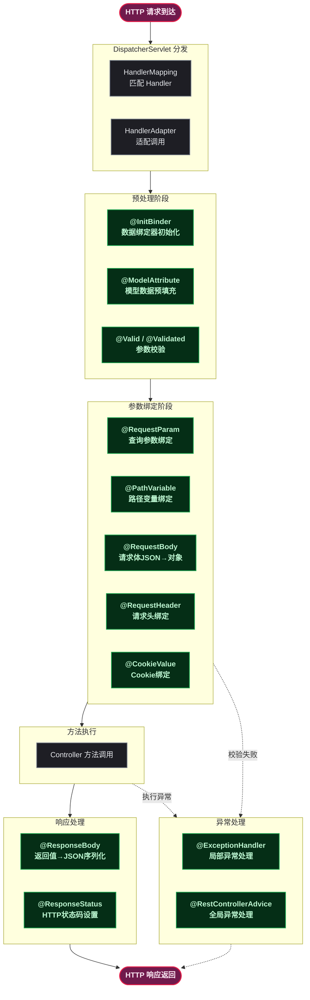

# Spring MVC 常用注解：企业级全场景用法与实战指南

## 🤔 1. 问题切入：一个订单查询接口

假设你在开发一个电商系统的订单查询接口，需要实现以下需求：

- 通过订单 ID 查询订单详情
- 支持按状态、时间范围过滤订单列表
- 接收 JSON 请求体来创建订单
- 处理参数校验失败时的错误返回
- 统一处理各类异常

以下是一个典型的 Spring MVC Controller 初版实现：

```java
@RestController
@RequestMapping("/api/orders")
public class OrderController {

    @GetMapping("/{id}")
    public Result<Order> getOrder(@PathVariable Long id) {
        // 查询订单
    }

    @GetMapping
    public Result<Page<Order>> listOrders(
            @RequestParam(required = false) String status,
            @RequestParam(required = false) @DateTimeFormat(iso = DATE) LocalDate startDate,
            @RequestParam(required = false) @DateTimeFormat(iso = DATE) LocalDate endDate,
            @RequestParam(defaultValue = "1") int page,
            @RequestParam(defaultValue = "20") int size) {
        // 分页查询
    }

    @PostMapping
    @ResponseStatus(HttpStatus.CREATED)
    public Result<Order> createOrder(@Validated @RequestBody CreateOrderRequest request) {
        // 创建订单
    }
}
```

短短几行代码用到了 10+ 个注解。这些注解各自承担什么职责？组合使用时有什么坑？在企业级项目中应该如何规范使用？这篇博客将系统性地回答这些问题。

## 🗺️ 2. Spring MVC 注解分类总览

Spring MVC 的注解按功能可以分为六大类：



### 🔄 2.1 注解与 Spring MVC 处理流程的对应关系



这张图展示了每个注解在请求处理链路中的介入时机。理解各注解在流程中的位置，是正确使用它们的前提。

## 🗺️ 3. 请求映射注解

### 🗺️ 3.1 @RequestMapping

`@RequestMapping` 是最基础的请求映射注解，可以将 HTTP 请求映射到 Controller 方法上。

**属性说明**：

| 属性 | 类型 | 说明 | 默认值 |
|------|------|------|--------|
| `value` / `path` | `String[]` | 映射的 URL 路径，支持 Ant 风格通配符 | 必填 |
| `method` | `RequestMethod[]` | 允许的 HTTP 方法 | 全部方法 |
| `params` | `String[]` | 限定请求参数条件 | 无限制 |
| `headers` | `String[]` | 限定请求头条件 | 无限制 |
| `consumes` | `String[]` | 限定 Content-Type | 无限制 |
| `produces` | `String[]` | 限定 Accept | 无限制 |

**企业级用法**：

```java
// 1. 类级别 + 方法级别组合
@RestController
@RequestMapping("/api/v1/orders")
public class OrderController {

    // 完整路径: /api/v1/orders/{id}
    // 仅匹配 GET 请求,要求请求头 Accept: application/json
    @RequestMapping(
        path = "/{id}",
        method = RequestMethod.GET,
        produces = MediaType.APPLICATION_JSON_VALUE
    )
    public Result<Order> getOrder(@PathVariable Long id) {
        // ...
    }
}

// 2. params 属性实现版本控制
@RequestMapping(
    path = "/{id}",
    method = RequestMethod.GET,
    params = "version=v2"  // 仅匹配携带 ?version=v2 的请求
)
public Result<OrderV2> getOrderV2(@PathVariable Long id) {
    // ...
}

// 3. consumes 限定请求体格式
@RequestMapping(
    path = "/upload",
    method = RequestMethod.POST,
    consumes = MediaType.MULTIPART_FORM_DATA_VALUE
)
public Result<String> uploadFile(@RequestParam MultipartFile file) {
    // ...
}
```

### ⚡ 3.2 快捷映射注解

Spring 4.3 引入了 5 个快捷注解，分别对应不同的 HTTP 方法。在企业项目中，**优先使用快捷注解而非 @RequestMapping**，语义更清晰：

```java
@RestController
@RequestMapping("/api/v1/users")
public class UserController {

    @GetMapping("/{id}")
    public Result<User> getUser(@PathVariable Long id) { }

    @PostMapping
    @ResponseStatus(HttpStatus.CREATED)
    public Result<User> createUser(@Validated @RequestBody CreateUserRequest req) { }

    @PutMapping("/{id}")
    public Result<User> updateUser(@PathVariable Long id, @Validated @RequestBody UpdateUserRequest req) { }

    @DeleteMapping("/{id}")
    @ResponseStatus(HttpStatus.NO_CONTENT)
    public void deleteUser(@PathVariable Long id) { }

    @PatchMapping("/{id}")
    public Result<User> patchUser(@PathVariable Long id, @RequestBody Map<String, Object> fields) { }
}
```

| 快捷注解 | 等价 @RequestMapping | 语义 |
|---------|---------------------|------|
| `@GetMapping` | `method = RequestMethod.GET` | 查询资源 |
| `@PostMapping` | `method = RequestMethod.POST` | 创建资源 |
| `@PutMapping` | `method = RequestMethod.PUT` | 全量更新资源 |
| `@DeleteMapping` | `method = RequestMethod.DELETE` | 删除资源 |
| `@PatchMapping` | `method = RequestMethod.PATCH` | 部分更新资源 |

### 🔍 3.3 路径匹配与通配符

```java
// Ant 风格通配符
@GetMapping("/users/{userId}/orders/{orderId}")  // 精确匹配两个路径变量
@GetMapping("/files/*.pdf")                       // ? 匹配任意单个字符
@GetMapping("/files/**")                          // ** 匹配任意多层路径
@GetMapping("/v{version:\\d+}/users")             // 正则约束(仅匹配数字版本号)
```

## 📥 4. 请求参数绑定注解

### 📥 4.1 @RequestParam

绑定 URL 查询参数或表单参数到方法参数。

```java
@GetMapping("/users")
public Result<Page<User>> listUsers(
        // 必传参数 (默认 required=true)
        @RequestParam Long deptId,

        // 可选参数
        @RequestParam(required = false) String keyword,

        // 带默认值的参数
        @RequestParam(defaultValue = "1") int page,

        // 参数名映射 (前端传 page_size,后端接收 pageSize)
        @RequestParam(name = "page_size", defaultValue = "20") int pageSize,

        // 接收多值参数 (?roleIds=1&roleIds=2&roleIds=3)
        @RequestParam(required = false) List<Long> roleIds
) {
    return userService.listByPage(deptId, keyword, page, pageSize, roleIds);
}
```

### 🔗 4.2 @PathVariable

绑定 URL 路径中的变量到方法参数。

```java
// 基础用法
@GetMapping("/users/{userId}/orders/{orderId}")
public Result<Order> getOrder(@PathVariable Long userId, @PathVariable Long orderId) { }

// 参数名与路径变量名不一致时显式指定
@GetMapping("/users/{id}")
public Result<User> getUser(@PathVariable("id") Long userId) { }

// Optional 包裹(路径变量不存在时为 Optional.empty)
@GetMapping({"/users/{id}", "/users"})
public Object getUser(@PathVariable(required = false) Optional<Long> id) {
    return id.map(userService::getById).orElse(userService.listAll());
}
```

### 📦 4.3 @RequestBody

将 HTTP 请求体（通常是 JSON）反序列化为 Java 对象。**一个 Controller 方法只能有一个 @RequestBody 参数**。

```java
@PostMapping
public Result<User> createUser(@Validated @RequestBody CreateUserRequest request) { }

// 企业级请求体设计
@Data
public class CreateUserRequest {
    @NotBlank(message = "用户名不能为空")
    @Size(min = 2, max = 20, message = "用户名长度 2~20 个字符")
    private String username;

    @NotBlank(message = "密码不能为空")
    @Pattern(regexp = "^(?=.*[a-z])(?=.*[A-Z])(?=.*\\d)[a-zA-Z\\d]{8,32}$",
             message = "密码需包含大小写字母和数字，长度 8~32 位")
    private String password;

    @Email(message = "邮箱格式不正确")
    private String email;

    @NotNull(message = "角色不能为空")
    private Long roleId;
}
```

### 🏷️ 4.4 @RequestHeader 与 @CookieValue

```java
@GetMapping("/info")
public Result<UserInfo> getInfo(
        // 获取单个请求头
        @RequestHeader("Authorization") String authToken,

        // 可选请求头
        @RequestHeader(value = "X-Request-Id", required = false) String requestId,

        // 获取所有请求头
        @RequestHeader Map<String, String> allHeaders,

        // Cookie 值
        @CookieValue(value = "JSESSIONID", required = false) String sessionId
) {
    // 企业常见用法: 解析 JWT Token
    Long userId = jwtUtil.parseUserId(authToken);
    return userService.getInfo(userId);
}
```

### 🔢 4.5 @MatrixVariable

矩阵变量（`;key=value`）用于在 URL 路径段中绑定键值对。默认关闭，需要**显式开启**：

```java
// 配置类中启用
@Configuration
public class WebConfig implements WebMvcConfigurer {
    @Override
    public void configurePathMatch(PathMatchConfigurer configurer) {
        configurer.setUrlPathHelper(new UrlPathHelper() {{
            setRemoveSemicolonContent(false);  // 必须设置
        }});
    }
}

// 使用示例: GET /cars/color=red;year=2023
@GetMapping("/cars/{filters}")
public List<Car> getCars(@MatrixVariable String color,
                         @MatrixVariable int year) {
    // ...
}

// 绑定到指定路径变量
// GET /users/1;dept=dev/orders/2;status=paid
@GetMapping("/users/{uid}/orders/{oid}")
public Result<Order> getOrder(
        @MatrixVariable(pathVar = "uid") String dept,
        @MatrixVariable(pathVar = "oid") String status
) { }
```

## 📤 5. 响应处理注解

### 📤 5.1 @ResponseBody

将 Controller 方法返回值序列化为 JSON/XML 写入 HTTP 响应体。

### 🎯 5.2 @RestController

`@RestController` = `@Controller` + `@ResponseBody`，是 RESTful API 的标准选择。

### 📊 5.3 @ResponseStatus

设置 HTTP 响应的状态码和原因短语：

```java
@PostMapping
@ResponseStatus(HttpStatus.CREATED)  // 201 Created
public Result<User> createUser(@Validated @RequestBody CreateUserRequest req) { }

@DeleteMapping("/{id}")
@ResponseStatus(HttpStatus.NO_CONTENT)  // 204 No Content
public void deleteUser(@PathVariable Long id) { }
```

**企业级实践**：在自定义异常类上结合 `@ResponseStatus` 使用：

```java
@ResponseStatus(HttpStatus.NOT_FOUND)  // 404
public class ResourceNotFoundException extends RuntimeException {
    public ResourceNotFoundException(String message) {
        super(message);
    }
}

@ResponseStatus(HttpStatus.TOO_MANY_REQUESTS)  // 429
public class RateLimitException extends RuntimeException { }
```

## 🔄 6. 数据预处理注解

### 🏗️ 6.1 @ModelAttribute

`@ModelAttribute` 有三种用法：

**用法一**：方法级别 — 在请求处理前向 Model 填充公共数据：

```java
@Controller
@RequestMapping("/admin/users")
public class AdminUserController {

    // 每个请求处理前,都会向 Model 添加 "deptList" 数据
    @ModelAttribute("deptList")
    public List<Dept> populateDepts() {
        return deptService.listAll();
    }

    @GetMapping
    public String listUsers(Model model) {
        // model 中已自动包含 deptList,前端下拉框可直接渲染
        model.addAttribute("users", userService.listAll());
        return "admin/users";
    }
}
```

**用法二**：方法参数级别 — 从 Model 或请求参数中获取对象：

```java
@PostMapping
public String updateUser(@ModelAttribute("user") @Validated User user,
                         BindingResult result) {
    if (result.hasErrors()) {
        return "user/edit";
    }
    userService.update(user);
    return "redirect:/admin/users";
}
```

**用法三**：方法返回值级别 — 自动将返回值添加到 Model：

```java
// 等价于 model.addAttribute("key", value)
@ModelAttribute("currentUser")
public User currentUser(@RequestHeader("Authorization") String token) {
    return userService.getByToken(token);
}
```

### 💾 6.2 @SessionAttributes 与 @SessionAttribute

`@SessionAttributes`（类级别）将 Model 中的数据同步到 HttpSession；`@SessionAttribute`（参数级别）从 Session 中获取属性：

```java
@Controller
@SessionAttributes("currentUser")  // 将 Model 中的 "currentUser" 自动放入 Session
public class OrderController {

    @GetMapping("/checkout")
    public String checkout(@SessionAttribute("currentUser") User user, Model model) {
        model.addAttribute("cart", cartService.getByUser(user.getId()));
        return "checkout";
    }

    // 清除 Session 中的属性
    @GetMapping("/logout")
    public String logout(SessionStatus status) {
        status.setComplete();  // 清除 @SessionAttributes 所有属性
        return "redirect:/login";
    }
}
```

### 🔧 6.3 @InitBinder

`@InitBinder` 用于自定义数据绑定规则。在 Controller 中定义的方法会在每次请求绑定前调用：

```java
@RestController
@RequestMapping("/api/users")
public class UserController {

    // 仅对当前 Controller 生效
    @InitBinder
    public void initBinder(WebDataBinder binder) {
        // 1. 注册自定义属性编辑器(字符串→Date)
        binder.registerCustomEditor(Date.class,
            new CustomDateEditor(new SimpleDateFormat("yyyy-MM-dd HH:mm:ss"), false));

        // 2. 禁止某些字段被绑定(防止 Mass Assignment 攻击)
        binder.setDisallowedFields("id", "createTime", "updateTime");

        // 3. 注册自定义校验器
        binder.addValidators(new UserValidator());
    }
}

// 全局 @InitBinder: 配合 @ControllerAdvice 使用
@ControllerAdvice
public class GlobalBindingInitializer {

    @InitBinder
    public void initBinder(WebDataBinder binder) {
        // 对所有 Controller 生效
        binder.registerCustomEditor(LocalDate.class,
            new PropertyEditorSupport() {
                @Override
                public void setAsText(String text) {
                    setValue(LocalDate.parse(text, DateTimeFormatter.ofPattern("yyyy-MM-dd")));
                }
            });
    }
}
```

## ✅ 7. 参数校验注解

Spring MVC 支持 JSR 380（Bean Validation 2.0）的参数校验。核心注解是 `@Valid`（javax）和 `@Validated`（Spring）。

### ✅ 7.1 基础校验

```java
@RestController
@RequestMapping("/api/users")
public class UserController {

    @PostMapping
    public Result<User> createUser(@Valid @RequestBody CreateUserRequest request) {
        // @Valid 校验失败会抛出 MethodArgumentNotValidException
        userService.create(request);
        return Result.success();
    }
}

// 校验注解一览
@Data
public class CreateUserRequest {

    @NotBlank(message = "用户名不能为空")
    private String username;

    @NotNull(message = "年龄不能为空")
    @Min(value = 0, message = "年龄不能为负数")
    @Max(value = 150, message = "年龄不能超过150")
    private Integer age;

    @Email(message = "邮箱格式不正确")
    private String email;

    @Pattern(regexp = "^1[3-9]\\d{9}$", message = "手机号格式不正确")
    private String phone;

    @NotEmpty(message = "角色列表不能为空")
    private List<Long> roleIds;

    @Positive(message = "金额必须为正数")
    private BigDecimal amount;

    @Future(message = "生效时间必须在未来")
    private LocalDateTime effectiveTime;
}
```

### ⭐ 7.2 分组校验（企业级核心用法）

同一个 DTO 在不同场景下需要校验不同字段。使用**校验分组**：

```java
// 定义校验分组
public interface CreateGroup { }   // 创建时校验
public interface UpdateGroup { }   // 更新时校验

@Data
public class UserRequest {
    @Null(groups = CreateGroup.class, message = "创建时ID必须为空")
    @NotNull(groups = UpdateGroup.class, message = "更新时ID不能为空")
    private Long id;

    @NotBlank(groups = CreateGroup.class, message = "用户名不能为空")
    private String username;

    @NotNull(groups = {CreateGroup.class, UpdateGroup.class}, message = "角色不能为空")
    private Long roleId;
}

// Controller 中使用
@PostMapping
public Result<User> createUser(@Validated(CreateGroup.class) @RequestBody UserRequest req) { }

@PutMapping("/{id}")
public Result<User> updateUser(@PathVariable Long id,
                               @Validated(UpdateGroup.class) @RequestBody UserRequest req) {
    req.setId(id);  // 保证 id 不为 null
    userService.update(req);
    return Result.success();
}
```

### 🔗 7.3 嵌套校验

当 DTO 中包含嵌套对象时，需要使用 `@Valid` 触发级联校验：

```java
@Data
public class CreateOrderRequest {
    @NotNull
    private Long userId;

    @Valid  // ← 关键! 触发嵌套对象的校验
    @NotEmpty
    private List<OrderItemRequest> items;

    @Valid  // ← 触发级联校验
    @NotNull
    private AddressRequest shippingAddress;
}

@Data
public class OrderItemRequest {
    @NotNull
    private Long productId;
    @Min(1)
    private Integer quantity;
}
```

### 🛠️ 7.4 自定义校验注解

当通用校验注解无法满足业务需求时，创建自定义校验器：

```java
// 1. 定义注解
@Target({ElementType.FIELD})
@Retention(RetentionPolicy.RUNTIME)
@Constraint(validatedBy = EnumValueValidator.class)
public @interface EnumValue {
    String message() default "枚举值不正确";
    Class<?>[] groups() default {};
    Class<? extends Payload>[] payload() default {};
    Class<? extends Enum<?>> enumClass();
}

// 2. 实现校验器
public class EnumValueValidator implements ConstraintValidator<EnumValue, Object> {
    private Set<Object> validValues = new HashSet<>();

    @Override
    public void initialize(EnumValue annotation) {
        for (Enum<?> e : annotation.enumClass().getEnumConstants()) {
            validValues.add(e.name());
            validValues.add(e.ordinal());  // 支持数字值
        }
    }

    @Override
    public boolean isValid(Object value, ConstraintValidatorContext context) {
        return value == null || validValues.contains(value);
    }
}

// 3. 使用
@Data
public class OrderRequest {
    @EnumValue(enumClass = OrderStatus.class, message = "订单状态值不正确")
    private String status;
}
```

| 特性 | `@Valid` (javax) | `@Validated` (Spring) |
|------|:---:|:---:|
| 来源 | JSR 380 标准 | Spring 扩展 |
| 分组校验 | 不支持 | 支持 |
| 嵌套校验 | 支持（用于字段） | 支持（用于类 + 方法参数） |
| 方法级别校验 | 不支持 | 支持（类上 @Validated 后校验方法参数） |
| Controller 使用 | 方法参数 | 方法参数 / 类级别 |

## 🚨 8. 异常处理注解

### 🚨 8.1 @ExceptionHandler

在 Controller 内定义局部异常处理方法：

```java
@RestController
@RequestMapping("/api/users")
public class UserController {

    @GetMapping("/{id}")
    public Result<User> getUser(@PathVariable Long id) {
        throw new UserNotFoundException(id);
    }

    // 仅处理当前 Controller 中的 UserNotFoundException
    @ExceptionHandler(UserNotFoundException.class)
    @ResponseStatus(HttpStatus.NOT_FOUND)
    public Result<Void> handleUserNotFound(UserNotFoundException e) {
        return Result.fail(404, e.getMessage());
    }
}
```

### 🛡️ 8.2 @ControllerAdvice 与 @RestControllerAdvice

`@RestControllerAdvice` = `@ControllerAdvice` + `@ResponseBody`，用于全局异常处理：

```java
@RestControllerAdvice
public class GlobalExceptionHandler {

    // 参数校验异常
    @ExceptionHandler(MethodArgumentNotValidException.class)
    @ResponseStatus(HttpStatus.BAD_REQUEST)
    public Result<List<ValidationError>> handleValidation(MethodArgumentNotValidException e) {
        List<ValidationError> errors = e.getBindingResult()
            .getFieldErrors()
            .stream()
            .map(fe -> new ValidationError(fe.getField(), fe.getDefaultMessage()))
            .collect(Collectors.toList());
        return Result.fail(400, "参数校验失败", errors);
    }

    // HTTP 消息不可读(如 JSON 格式错误)
    @ExceptionHandler(HttpMessageNotReadableException.class)
    @ResponseStatus(HttpStatus.BAD_REQUEST)
    public Result<Void> handleNotReadable(HttpMessageNotReadableException e) {
        return Result.fail(400, "请求体格式错误,请检查 JSON 格式");
    }

    // 请求方法不支持
    @ExceptionHandler(HttpRequestMethodNotSupportedException.class)
    @ResponseStatus(HttpStatus.METHOD_NOT_ALLOWED)
    public Result<Void> handleMethodNotSupported(HttpRequestMethodNotSupportedException e) {
        return Result.fail(405, "不支持的请求方法: " + e.getMethod());
    }

    // 自定义业务异常
    @ExceptionHandler(BusinessException.class)
    public ResponseEntity<Result<Void>> handleBusiness(BusinessException e) {
        return ResponseEntity
            .status(e.getHttpStatus())
            .body(Result.fail(e.getCode(), e.getMessage()));
    }

    // 兜底异常(未预料的错误)
    @ExceptionHandler(Exception.class)
    @ResponseStatus(HttpStatus.INTERNAL_SERVER_ERROR)
    public Result<Void> handleUnknown(Exception e) {
        log.error("未知异常", e);
        return Result.fail(500, "服务器内部错误");
    }
}

// 数据类
@Data
@AllArgsConstructor
public class ValidationError {
    private String field;
    private String message;
}
```

### 🎛️ 8.3 @ControllerAdvice 的精细化控制

```java
// 仅对带有 @RestController 注解的 Controller 生效
@ControllerAdvice(annotations = RestController.class)
public class ApiExceptionHandler { }

// 仅对 com.example.order 包下的 Controller 生效
@ControllerAdvice("com.example.order.controller")
public class OrderExceptionHandler { }

// 仅对实现了特定接口的 Controller 生效
@ControllerAdvice(assignableTypes = {BaseController.class})
public class BaseExceptionHandler { }
```

## 🌐 9. 跨域注解 @CrossOrigin

```java
// 方法级别
@CrossOrigin(origins = "https://admin.example.com")
@GetMapping("/api/users")
public Result<List<User>> listUsers() { }

// 类级别(该类所有方法都允许跨域)
@RestController
@RequestMapping("/api/users")
@CrossOrigin(
    origins = {"https://admin.example.com", "https://app.example.com"},
    methods = {RequestMethod.GET, RequestMethod.POST},
    allowedHeaders = {"Authorization", "Content-Type"},
    exposedHeaders = {"X-Total-Count"},
    allowCredentials = "true",
    maxAge = 3600  // 预检请求缓存时间(秒)
)
public class UserController { }

// 全局配置(推荐)
@Configuration
public class CorsConfig implements WebMvcConfigurer {
    @Override
    public void addCorsMappings(CorsRegistry registry) {
        registry.addMapping("/api/**")
                .allowedOrigins("https://admin.example.com")
                .allowedMethods("GET", "POST", "PUT", "DELETE", "OPTIONS")
                .allowedHeaders("*")
                .allowCredentials(true)
                .maxAge(3600);
    }
}
```

## 💼 10. 企业级实战组合场景

### 📦 10.1 统一响应格式

```java
@Data
@AllArgsConstructor
@NoArgsConstructor
public class Result<T> {
    private int code;
    private String message;
    private T data;
    private long timestamp = System.currentTimeMillis();

    public static <T> Result<T> success(T data) {
        return new Result<>(200, "success", data, System.currentTimeMillis());
    }

    public static <T> Result<T> fail(int code, String message) {
        return new Result<>(code, message, null, System.currentTimeMillis());
    }
}
```

### 📋 10.2 RESTful Controller 完整模板

```java
@RestController
@RequestMapping("/api/v1/orders")
@Validated  // 支持方法参数校验
public class OrderController {

    private final OrderService orderService;

    public OrderController(OrderService orderService) {
        this.orderService = orderService;
    }

    @GetMapping("/{id}")
    public Result<Order> getOrder(
            @PathVariable @NotNull(message = "订单ID不能为空") Long id) {
        return Result.success(orderService.getById(id));
    }

    @GetMapping
    public Result<Page<Order>> listOrders(OrderQueryRequest query) {
        // query 参数非 @RequestBody,不支持 @Valid 自动校验
        // 需要手动校验或使用 @Validated 在类级别开启方法校验
        return Result.success(orderService.listByPage(query));
    }

    @PostMapping
    @ResponseStatus(HttpStatus.CREATED)
    public Result<Order> createOrder(
            @Validated(CreateGroup.class) @RequestBody CreateOrderRequest request) {
        return Result.success(orderService.create(request));
    }

    @PutMapping("/{id}")
    public Result<Order> updateOrder(
            @PathVariable @NotNull Long id,
            @Validated(UpdateGroup.class) @RequestBody UpdateOrderRequest request) {
        request.setId(id);
        return Result.success(orderService.update(request));
    }

    @DeleteMapping("/{id}")
    @ResponseStatus(HttpStatus.NO_CONTENT)
    public void cancelOrder(
            @PathVariable @NotNull Long id,
            @RequestHeader("Authorization") String token) {
        Long operatorId = JwtUtil.parseUserId(token);
        orderService.cancel(id, operatorId);
    }

    @PatchMapping("/{id}/status")
    public Result<Order> updateStatus(
            @PathVariable Long id,
            @Valid @RequestBody StatusUpdateRequest request) {
        return Result.success(orderService.updateStatus(id, request.getStatus()));
    }
}
```

### 📅 10.3 全局日期格式统一处理

```java
@Configuration
public class DateTimeConfig {

    // 方案一: 全局 Jackson 配置(适用于 @RequestBody)
    @Bean
    public Jackson2ObjectMapperBuilderCustomizer jsonCustomizer() {
        return builder -> {
            builder.simpleDateFormat("yyyy-MM-dd HH:mm:ss");
            builder.serializers(new LocalDateTimeSerializer(
                DateTimeFormatter.ofPattern("yyyy-MM-dd HH:mm:ss")));
            builder.deserializers(new LocalDateTimeDeserializer(
                DateTimeFormatter.ofPattern("yyyy-MM-dd HH:mm:ss")));
            builder.serializers(new LocalDateSerializer(
                DateTimeFormatter.ofPattern("yyyy-MM-dd")));
            builder.deserializers(new LocalDateDeserializer(
                DateTimeFormatter.ofPattern("yyyy-MM-dd")));
        };
    }

    // 方案二: Spring MVC 参数转换配置(适用于 @RequestParam / @PathVariable)
    @Bean
    public FormattingConversionService mvcConversionService() {
        DefaultFormattingConversionService conversionService =
            new DefaultFormattingConversionService(false);
        DateTimeFormatterRegistrar registrar = new DateTimeFormatterRegistrar();
        registrar.setDateFormatter(DateTimeFormatter.ofPattern("yyyy-MM-dd"));
        registrar.setDateTimeFormatter(DateTimeFormatter.ofPattern("yyyy-MM-dd HH:mm:ss"));
        registrar.registerFormatters(conversionService);
        return conversionService;
    }
}
```

### 📝 10.4 请求参数日志打印（AOP + 注解）

```java
// 自定义注解: 标记需要记录操作日志的方法
@Target(ElementType.METHOD)
@Retention(RetentionPolicy.RUNTIME)
public @interface OperationLog {
    String value();  // 操作描述
}

// 切面实现
@Aspect
@Component
public class OperationLogAspect {

    @Around("@annotation(operationLog)")
    public Object around(ProceedingJoinPoint pjp, OperationLog operationLog) throws Throwable {
        // 获取请求参数
        Object[] args = pjp.getArgs();
        String params = Arrays.stream(args)
            .filter(a -> !(a instanceof HttpServletRequest)
                      && !(a instanceof HttpServletResponse))
            .map(Object::toString)
            .collect(Collectors.joining(", "));

        log.info("[操作日志] {} | 方法: {} | 参数: {}",
            operationLog.value(),
            pjp.getSignature().toShortString(),
            params);

        long start = System.currentTimeMillis();
        Object result = pjp.proceed();
        long elapsed = System.currentTimeMillis() - start;

        log.info("[操作日志] {} | 耗时: {}ms", operationLog.value(), elapsed);
        return result;
    }
}

// 使用
@OperationLog("创建订单")
@PostMapping
public Result<Order> createOrder(@Validated @RequestBody CreateOrderRequest request) { }
```

### 🛡️ 10.5 防重复提交（自定义注解 + 拦截器）

```java
// 自定义防重注解
@Target(ElementType.METHOD)
@Retention(RetentionPolicy.RUNTIME)
public @interface AntiResubmit {
    int expireSeconds() default 3;  // 锁定时间
    String key() default "";        // 自定义 key(EL 表达式)
}

// 拦截器实现
@Component
public class AntiResubmitInterceptor implements HandlerInterceptor {
    private final RedisTemplate<String, String> redisTemplate;

    @Override
    public boolean preHandle(HttpServletRequest request,
                             HttpServletResponse response,
                             Object handler) {
        if (!(handler instanceof HandlerMethod hm)) return true;

        AntiResubmit annotation = hm.getMethodAnnotation(AntiResubmit.class);
        if (annotation == null) return true;

        String key = buildKey(request, annotation);
        Boolean success = redisTemplate.opsForValue()
            .setIfAbsent(key, "1", Duration.ofSeconds(annotation.expireSeconds()));

        if (!Boolean.TRUE.equals(success)) {
            throw new BusinessException(429, "请勿重复提交");
        }
        return true;
    }

    private String buildKey(HttpServletRequest request, AntiResubmit annotation) {
        String userId = JwtUtil.parseUserId(request.getHeader("Authorization"));
        return "anti_resubmit:" + userId + ":" + request.getRequestURI();
    }
}
```

## 📋 11. 注解使用速查表

| 注解 | 用途 | 位置 | 企业使用频率 |
|------|------|------|:---:|
| `@RestController` | RESTful API 控制器 | 类 | 必用 |
| `@RequestMapping` | 请求路径 + 方法映射 | 类/方法 | 高 |
| `@GetMapping` | GET 请求映射 | 方法 | 高 |
| `@PostMapping` | POST 请求映射 | 方法 | 高 |
| `@PutMapping` | PUT 请求映射 | 方法 | 高 |
| `@DeleteMapping` | DELETE 请求映射 | 方法 | 高 |
| `@PatchMapping` | PATCH 请求映射 | 方法 | 中 |
| `@RequestParam` | 查询参数/表单参数绑定 | 参数 | 高 |
| `@PathVariable` | 路径变量绑定 | 参数 | 高 |
| `@RequestBody` | JSON 请求体绑定 | 参数 | 高 |
| `@RequestHeader` | 请求头绑定 | 参数 | 高 |
| `@CookieValue` | Cookie 值绑定 | 参数 | 中 |
| `@ResponseBody` | 返回值序列化 JSON | 方法 | 高(或用 @RestController) |
| `@ResponseStatus` | HTTP 状态码设置 | 方法/异常类 | 高 |
| `@ModelAttribute` | 模型数据预填充 | 方法/参数 | 中 |
| `@SessionAttributes` | Session 数据同步 | 类 | 低 |
| `@SessionAttribute` | Session 取值 | 参数 | 低 |
| `@InitBinder` | 数据绑定器定制 | 方法 | 中 |
| `@Valid` / `@Validated` | 参数校验 | 参数/类 | 高 |
| `@ExceptionHandler` | 局部异常处理 | 方法 | 中 |
| `@ControllerAdvice` | 全局增强 | 类 | 高 |
| `@RestControllerAdvice` | 全局异常+响应体 | 类 | 高 |
| `@CrossOrigin` | 跨域配置 | 类/方法 | 中 |
| `@MatrixVariable` | 矩阵变量绑定 | 参数 | 低 |

## 🎯 12. 总结

### 📏 12.1 企业级使用原则

1. **优先使用快捷注解**：`@GetMapping` 等语义清晰，减少拼写错误
2. **类上统一路径前缀**：类上用 `@RequestMapping("/api/v1/resource")`，方法上只写子路径
3. **校验必须分组**：同一 DTO 用于创建/更新不同场景时，必须用分组校验避免字段窜用
4. **全局异常处理统一返回格式**：用 `@RestControllerAdvice` 兜底，确保前端收到格式一致的错误响应
5. **跨域配置集中管理**：用 `CorsConfig` 全局配置，不推荐每个 Controller 各自加 `@CrossOrigin`
6. **使用构造器注入**：避免 `@Autowired` 字段注入，便于单元测试

### 🚀 12.2 一个可投入生产线的完整 Controller

```java
@RestController
@RequestMapping("/api/v1/orders")
@RequiredArgsConstructor  // Lombok 构造器注入
@Slf4j
public class OrderController {

    private final OrderService orderService;

    @GetMapping("/{id}")
    public Result<OrderVO> getOrder(@PathVariable @NotNull Long id) {
        return Result.success(orderService.getById(id));
    }

    @GetMapping
    public Result<Page<OrderVO>> listOrders(@Validated OrderQuery query) {
        return Result.success(orderService.pageByQuery(query));
    }

    @PostMapping
    @ResponseStatus(HttpStatus.CREATED)
    public Result<Long> createOrder(@Validated(CreateGroup.class)
                                    @RequestBody CreateOrderRequest request) {
        return Result.success(orderService.create(request));
    }

    @DeleteMapping("/{id}")
    @ResponseStatus(HttpStatus.NO_CONTENT)
    public void cancelOrder(@PathVariable @NotNull Long id,
                            @RequestHeader("Authorization") String token) {
        orderService.cancel(id, parseUserId(token));
    }

    private Long parseUserId(String token) {
        return JwtUtil.parseUserId(token.replace("Bearer ", ""));
    }
}
```

这篇博客覆盖了 Spring MVC 在企业级项目中最常用的 25+ 个注解，从请求映射、参数绑定、响应处理到校验异常和跨域配置，每个注解都配有可直接用于生产的代码示例。在实际项目中，将这些注解组合使用即可覆盖 90% 以上的 RESTful API 开发场景。
