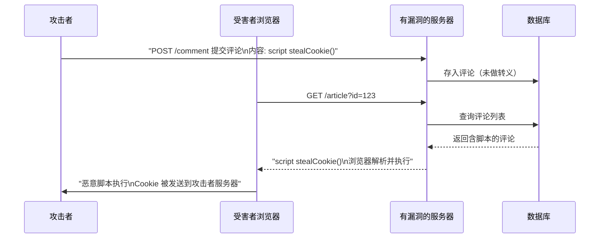
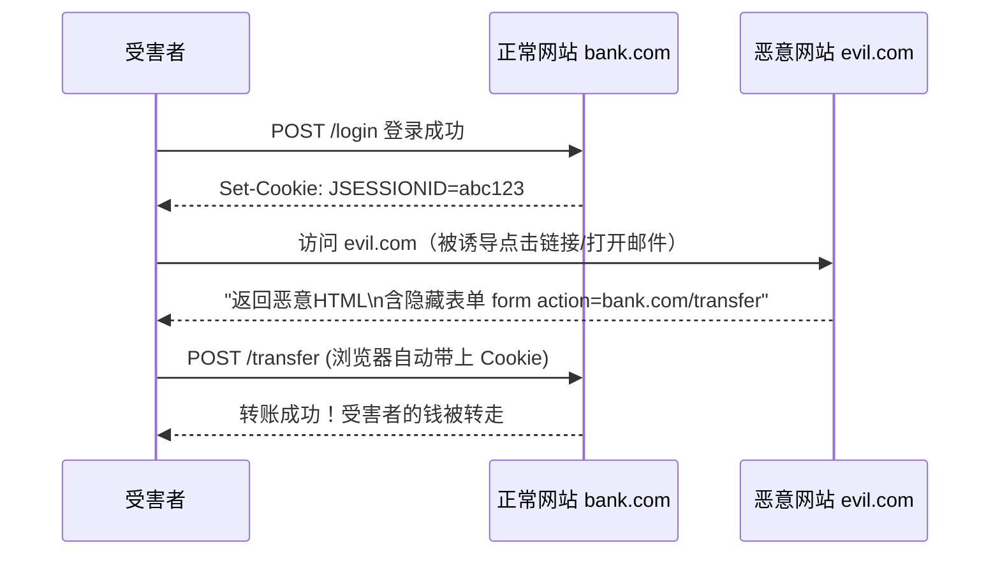
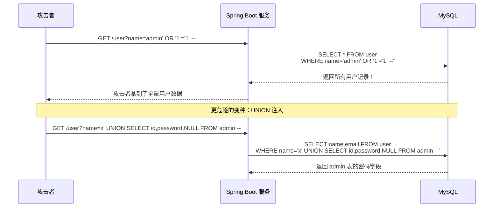
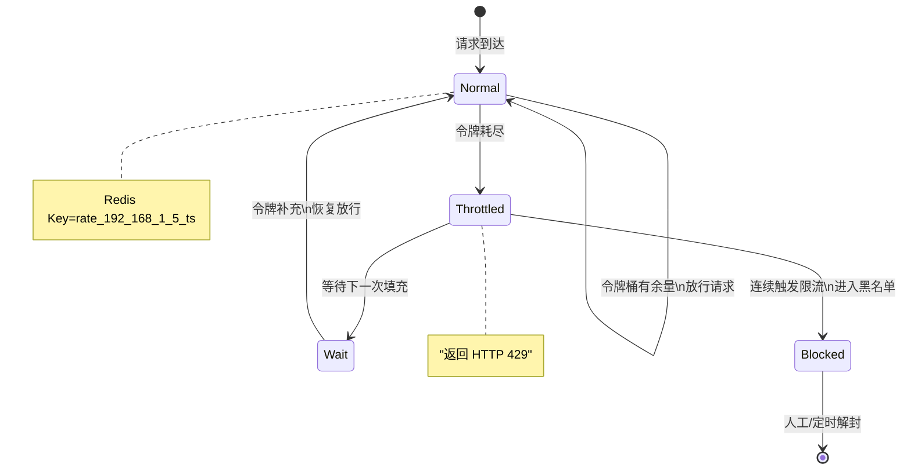
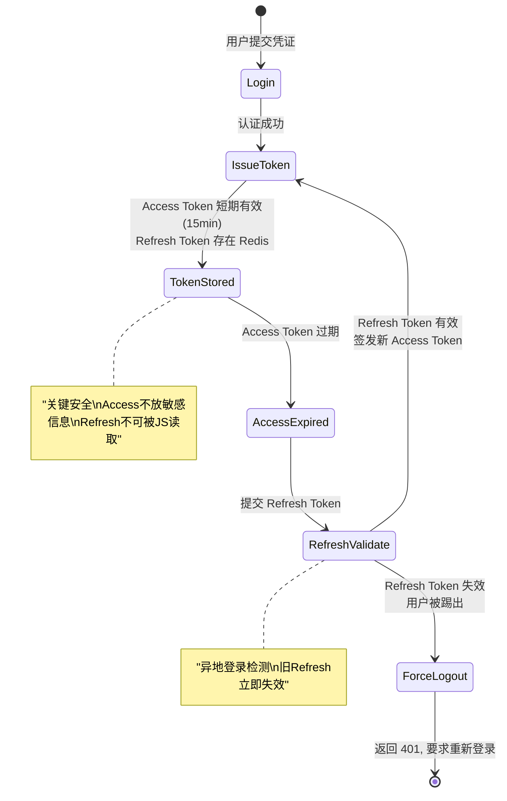

# B/S攻防：五类攻击与Spring体系的应对

> 📌 前置知识：本文假设读者用过 Spring Boot、知道 Cookie/Session/Token 的基本概念。Spring Security 的 Filter Chain 不熟没关系——每段防御代码会说明它在过滤器链中的位置。

---

## XSS：当用户输入变成了可执行脚本

跨站脚本攻击（Cross-Site Scripting）的本质是：攻击者把 JavaScript 塞进用户输入，服务器原样输出到 HTML，浏览器执行了这段恶意脚本。



Spring Boot 的防御分三层：

**① 输出转义——Thymeleaf 默认做**

```java
// Thymeleaf 模板中默认对变量做 HTML 转义
// <div th:text="${comment.content}"> → < 变成 &lt;，脚本失效

// 如果你用 JSP 或手动拼 HTML，务必用 escapeHtml：
String safe = HtmlUtils.htmlEscape(userInput);
```

**② 输入过滤——Spring 全局拦截**

```java
@Component
@Order(1)
public class XssFilter implements Filter {
    @Override
    public void doFilter(ServletRequest req, ServletResponse resp, FilterChain chain)
            throws IOException, ServletException {
        chain.doFilter(new XssRequestWrapper((HttpServletRequest) req), resp);
    }

    static class XssRequestWrapper extends HttpServletRequestWrapper {
        XssRequestWrapper(HttpServletRequest request) { super(request); }

        @Override
        public String getParameter(String name) {
            return HtmlUtils.htmlEscape(super.getParameter(name));
        }

        @Override
        public String[] getParameterValues(String name) {
            String[] values = super.getParameterValues(name);
            if (values == null) return null;
            String[] escaped = new String[values.length];
            for (int i = 0; i < values.length; i++) {
                escaped[i] = HtmlUtils.htmlEscape(values[i]);
            }
            return escaped;
        }
    }
}
```

**③ CSP 头——浏览器层面的最后一道防线**

```java
@Configuration
public class SecurityHeadersConfig {
    @Bean
    public WebMvcConfigurer cspConfigurer() {
        return new WebMvcConfigurer() {
            @Override
            public void addInterceptors(InterceptorRegistry registry) {
                registry.addInterceptor((Interceptor) (request, response, handler) -> {
                    response.setHeader("Content-Security-Policy",
                        "default-src 'self'; script-src 'self'; style-src 'self' 'unsafe-inline'");
                    return true;
                });
            }
        };
    }
}
```

> ⚠️ 新手提示：不要只靠前端 `input.value.replace(/</g, '&lt;')` 防 XSS。攻击者可以绕过浏览器直接发 HTTP 请求，前端过滤形同虚设。防御必须在后端。

---

## CSRF：用你的身份花你的钱

跨站请求伪造（Cross-Site Request Forgery）利用的是浏览器的自动附带 Cookie 机制：你在 A 网站登录后，访问攻击者的 B 网站，B 网站悄悄向 A 网站发一个请求，浏览器自动带上你的 Cookie。



防御：Spring Security 的 CSRF Token——服务器生成一个随机 token，每个表单提交时必须带回来。

```java
@Configuration
@EnableWebSecurity
public class CsrfSecurityConfig {
    @Bean
    public SecurityFilterChain filterChain(HttpSecurity http) throws Exception {
        http
            // 默认开启 CSRF 保护——Spring Security 6.x 起 CookieCsrfTokenRepository
            .csrf(csrf -> csrf
                .csrfTokenRepository(CookieCsrfTokenRepository.withHttpOnlyFalse())
                .csrfTokenRequestHandler(new SpaCsrfTokenRequestHandler())
            )
            .authorizeHttpRequests(auth -> auth
                .requestMatchers("/api/public/**").permitAll()
                .anyRequest().authenticated()
            );
        return http.build();
    }
}
```

> ⚠️ 新手提示：前后端分离项目中，CSRF Token 需要显式从 Cookie 读取并放到请求头 `X-XSRF-TOKEN` 里。 `withHttpOnlyFalse()` 让 JS 能读到 Cookie；但如果你没做 CORS 限制，这本身也有风险——配好 CORS 是前提。

---

## SQL 注入：当你把用户输入直接拼进 SQL

这是最古老的 Web 攻击，也是至今 OWASP Top 10 常驻成员。原理极简单：攻击者在输入框填入 SQL 片段，程序直接拼接到 SQL 语句中执行。



防御就一条：永远不要拼字符串，用参数化查询。

```java
// ❌ 危险写法
String sql = "SELECT * FROM user WHERE name = '" + name + "'";
jdbcTemplate.queryForList(sql);

// ✅ 参数化查询
String sql = "SELECT * FROM user WHERE name = ?";
jdbcTemplate.queryForList(sql, name);
```

> ⚠️ 新手提示：JPA/Hibernate 的参数绑定同样是安全的—— `@Query("SELECT u FROM User u WHERE u.name = :name")` 是参数化的。但 `@Query(nativeQuery = true)` 搭配字符串拼接仍然危险。凡是看到 String 拼接 SQL，下意识改掉。

---

## DDoS 与限流：当攻击者用海量请求淹没你

DDoS（Distributed Denial of Service）攻击不偷数据，只让你的服务不可用。应用层最常见的是 CC 攻击——大量 HTTP 请求耗尽 CPU 或带宽。

防御不在应用代码里，在网关层。Spring Cloud Gateway 配合 Resilience4j 做 IP 级别限流：

```java
@Configuration
public class GatewayRateLimitConfig {

    @Bean
    public KeyResolver ipKeyResolver() {
        return exchange -> Mono.just(
            exchange.getRequest().getRemoteAddress()
                    .getAddress().getHostAddress()
        );
    }

    @Bean
    public RouteLocator routes(RouteLocatorBuilder builder, KeyResolver ipKeyResolver) {
        return builder.routes()
            .route("rate-limited-api", r -> r
                .path("/api/**")
                .filters(f -> f
                    .requestRateLimiter(c -> c
                        .setRateLimiter(redisRateLimiter())
                        .setKeyResolver(ipKeyResolver)
                    )
                )
                .uri("lb://backend-service")
            )
            .build();
    }

    @Bean
    public RedisRateLimiter redisRateLimiter() {
        // 每秒 10 个请求，突发容量 20
        return new RedisRateLimiter(10, 20, 1);
    }
}
```

限流状态在 Redis 中的变迁：



> ⚠️ 新手提示：限流不是"流量到了就全杀掉"——是"让正常用户排队，恶意用户直接拒"。 `RedisRateLimiter(10, 20, 1)` 的意思是每秒补充 10 个令牌，最多囤 20 个（应对突发）。超过 20 的请求返回 429。

---

## JWT 安全：Token 本身就是身份凭证

JWT 的常见风险不是算法被破解，而是实现细节的疏忽：



Spring Security 的 JWT 完整配置：

```java
@Configuration
@EnableWebSecurity
public class JwtSecurityConfig {

    @Bean
    public SecurityFilterChain filterChain(HttpSecurity http) throws Exception {
        http
            .csrf(AbstractHttpConfigurer::disable)  // JWT 场景关闭 CSRF
            .sessionManagement(sm ->
                sm.sessionCreationPolicy(SessionCreationPolicy.STATELESS))
            .authorizeHttpRequests(auth -> auth
                .requestMatchers("/api/auth/login", "/api/auth/refresh").permitAll()
                .requestMatchers("/api/admin/**").hasRole("ADMIN")
                .anyRequest().authenticated()
            )
            .addFilterBefore(jwtAuthFilter(), UsernamePasswordAuthenticationFilter.class);
        return http.build();
    }

    @Bean
    public JwtAuthFilter jwtAuthFilter() {
        return new JwtAuthFilter();
    }
}
```

JWT 校验过滤器的关键安全点：

```java
@Component
public class JwtAuthFilter extends OncePerRequestFilter {

    @Override
    protected void doFilterInternal(HttpServletRequest request,
                                     HttpServletResponse response,
                                     FilterChain chain)
            throws ServletException, IOException {

        String token = extractToken(request);
        if (token == null) { chain.doFilter(request, response); return; }

        try {
            // ① 验证签名：防止篡改
            Claims claims = Jwts.parser()
                    .verifyWith(secretKey())
                    .build()
                    .parseSignedClaims(token)
                    .getPayload();

            // ② 验证时效：exp 过期则抛异常
            // ③ 验证 issuer：防止跨应用冒用
            if (!"my-app".equals(claims.getIssuer())) {
                throw new JwtException("Invalid issuer");
            }

            // ④ 设置 SecurityContext
            SecurityContextHolder.getContext()
                    .setAuthentication(buildAuth(claims));

        } catch (JwtException e) {
            response.setStatus(401);
            response.getWriter().write("{\"error\":\"invalid_token\"}");
            return;
        }

        chain.doFilter(request, response);
    }

    private SecretKey secretKey() {
        byte[] keyBytes = Decoders.BASE64.decode(
            System.getenv("JWT_SECRET")  // 密钥不在代码里！
        );
        return Keys.hmacShaKeyFor(keyBytes);
    }

    private String extractToken(HttpServletRequest request) {
        String header = request.getHeader("Authorization");
        if (header != null && header.startsWith("Bearer ")) {
            return header.substring(7);
        }
        return null;
    }
}
```

> ⚠️ 新手提示：JWT 密钥绝不能写在 `application.yml` 里提交 git。最少用环境变量 `JWT_SECRET` ，生产环境用 Vault 或配置中心。密钥泄露 = 任何人都能签发"合法" Token。

---

## 总结

B/S 应用的五类核心攻击和 Spring 体系的防御对照：

| 攻击 | 原理 | Spring 防御方案 | 关键组件 |
|------|------|----------------|---------|
| **XSS** | 恶意脚本混入 HTML | 输入过滤 + 输出转义 + CSP 头 | `HtmlUtils` + `Filter` + `CSP Header` |
| **CSRF** | 跨站请求冒用 Cookie | CSRF Token 校验 | `CsrfTokenRepository` |
| **SQL 注入** | 字符串拼接 SQL | 参数化查询 | `JdbcTemplate` / `@Query` |
| **DDoS/CC** | 海量请求耗尽资源 | IP 级别令牌桶限流 | `RedisRateLimiter` + Gateway |
| **JWT 劫持** | Token 泄露/篡改 | 短时效 Access + Refresh + 签名校验 | `JwtAuthFilter` + `OncePerRequestFilter` |

记住一件事：**安全不是加一个过滤器就完事，是每一层都做自己该做的事**——前端做输入校验是第一层，后端做转义/过滤是第二层，网关做限流是第三层，JWT 做时效和签名是第四层。攻击者突破一层，后面还有三层拦着。

---

*待替换占位项：无（本文未使用图片/视频）*
