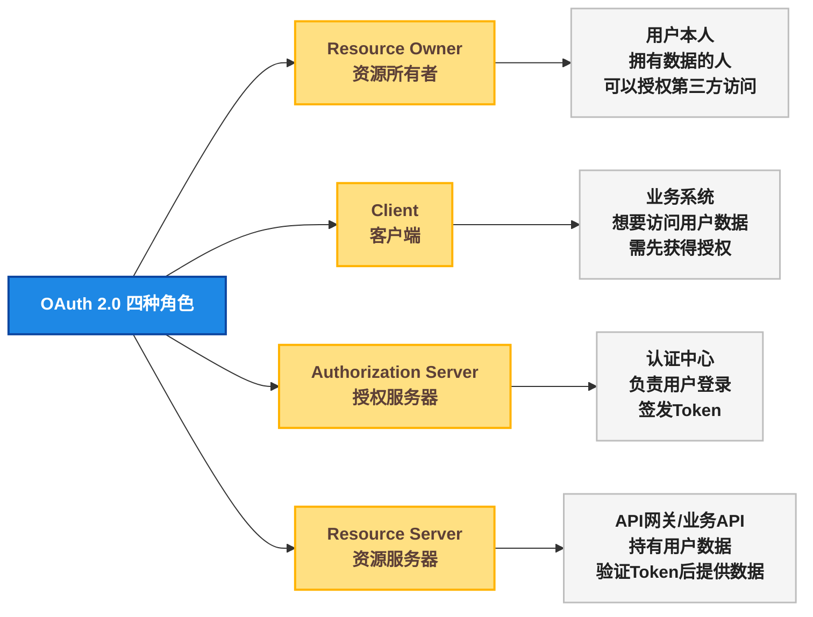
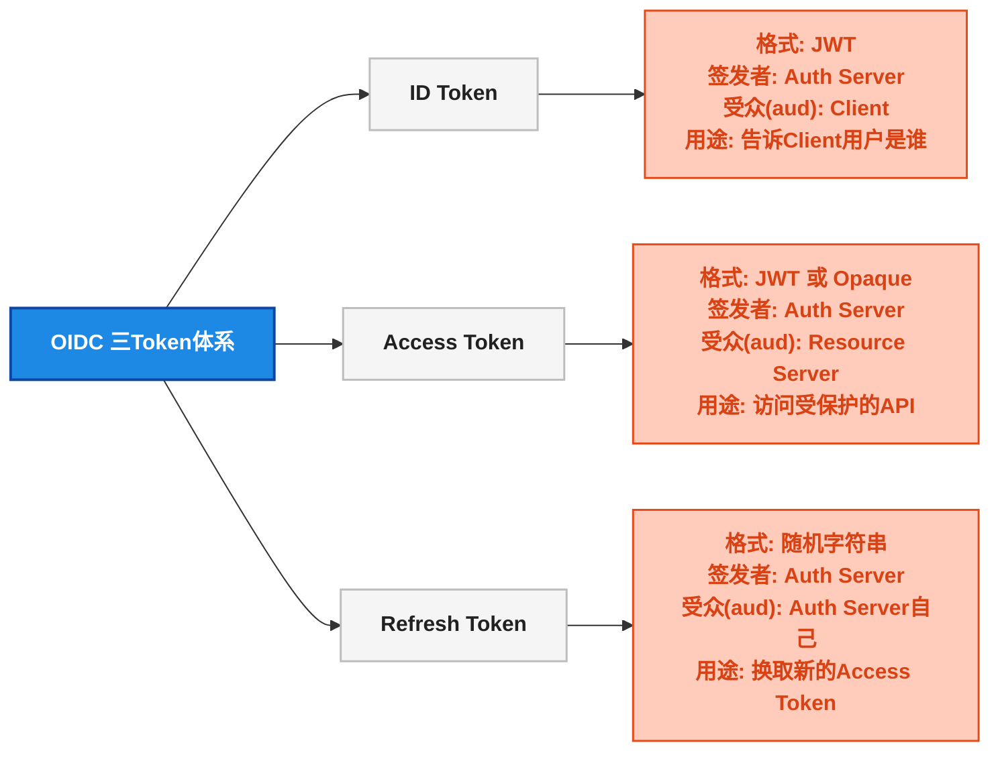
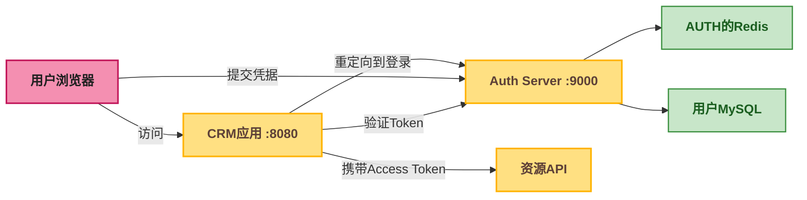
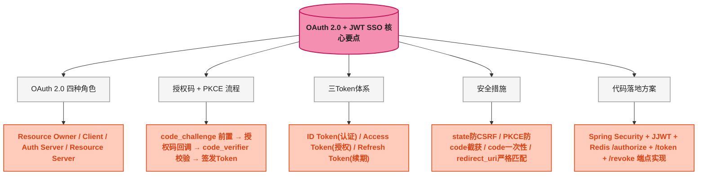

# OAuth 2.0 + JWT 单点登录：授权码模式、PKCE 增强与 Spring Security 完整实战

## 🤔 一、问题切入：为什么需要 OAuth 2.0 做 SSO？

在上一篇文章 [SSO 与 JWT+Redis 的定位差异](../SsoVsJwtRedisAuth) 中，我们厘清了 SSO（单点登录，Single Sign-On）是一种**认证架构模式**——有一个独立的认证中心，所有业务系统委托它做身份验证。但那篇文章只给出了概念层面的三种方案对比（CAS / OAuth 2.0 / JWT 共享密钥），没有深入到具体实现的代码层面。

本篇文章聚焦于 **OAuth 2.0 + OpenID Connect** 这一当下最流行的 SSO 实现方案，从协议原理到完整代码，让你能直接落地。

先看一个真实场景：

> 你所在的电商公司有 3 个系统：商家后台（`merchant.shop.com`）、运营后台（`ops.shop.com`）、数据平台（`data.shop.com`）。你们还接入了微信扫码登录和 GitHub OAuth 登录。现在老板要求：**用户在一个系统登录后，切换到其他系统时不需要重新输入密码；同时支持自建账号和第三方登录。**

这就需要 OAuth 2.0 + OpenID Connect（简称 OIDC）来搭建统一的认证中心。

**OAuth 2.0** 是授权协议（Authorization），**OpenID Connect** 是在 OAuth 2.0 之上叠加的身份认证层（Authentication）。两者组合后，既解决了"用户是谁"（认证），又解决了"用户能访问什么"（授权），是 SSO 的工业级标准实现。

---

## 📖 二、OAuth 2.0 核心概念速览

### 👥 2.1 四种角色

OAuth 2.0 定义了四个参与角色，理解它们是阅读后续流程的前提：



| 角色 | 对应系统中的谁 | 职责 |
|------|------|------|
| **Resource Owner**（资源所有者） | 用户（User） | 拥有数据，可以授权 Client 访问自己的数据 |
| **Client**（客户端） | 商家后台、运营后台 | 请求访问用户数据，必须先拿到 Token |
| **Authorization Server**（授权服务器） | SSO 认证中心（`sso.company.com`） | 验证用户身份，签发 Token |
| **Resource Server**（资源服务器） | API 网关 / 订单服务 / 用户服务 | 持有受保护的数据，验证 Token 后返回数据 |

**关键理解**：Authorization Server 和 Resource Server 可以是同一个服务，也可以是独立部署的服务。在微服务架构中，通常是独立的认证中心 + 独立的 API 网关。

### 📊 2.2 四种授权模式对比

OAuth 2.0 定义了四种授权模式（Grant Type），不同场景用不同模式：

| 授权模式 | Grant Type 值 | 适用场景 | 安全性 | SSO 适用 |
|------|------|------|:---:|:---:|
| **授权码模式（Authorization Code）** | `authorization_code` | 有后端的 Web 应用、SPA + BFF | ⭐⭐⭐⭐⭐ | ✅ 首选 |
| **授权码 + PKCE** | `authorization_code` + PKCE | SPA（纯前端）、移动 App | ⭐⭐⭐⭐⭐ | ✅ 推荐 |
| 隐式模式（Implicit） | `implicit`（OAuth 2.1 已移除） | 纯前端 SPA（历史遗留） | ⭐⭐ | ❌ 已废弃 |
| 密码模式（Resource Owner Password） | `password`（OAuth 2.1 已移除） | 自家前端直接收集密码 | ⭐ | ❌ 已废弃 |
| 客户端凭据模式（Client Credentials） | `client_credentials` | 服务间调用（没有用户参与） | ⭐⭐⭐⭐ | ❌ 无用户身份 |

**为什么授权码模式是 SSO 的首选？**

1. 用户的用户名密码**只提交给授权服务器**，业务系统永远接触不到
2. 授权码（code）是一次性的、短有效期的，且通过浏览器 URL 传递，配合 PKCE 即使被截获也无法使用
3. Token 的换取在后端完成（Server-to-Server），`client_secret` 不出现在浏览器

### 🔗 2.3 OAuth 2.0 / OIDC 核心端点

授权服务器对外暴露以下端点（Endpoint）：

| 端点 | HTTP 方法 | 用途 | 谁调用 |
|------|:---:|------|------|
| `/authorize` | GET | 发起授权请求，返回授权码 | 浏览器（通过重定向） |
| `/token` | POST | 用授权码换 Token / 刷新 Token | Client 后端 |
| `/userinfo` | GET | 获取用户身份信息（OIDC 标准端点） | Client 后端 |
| `/revoke` | POST | 吊销 Token（主动登出） | Client 后端 |
| `/.well-known/openid-configuration` | GET | OIDC 发现端点，返回所有端点地址 | 任何人 |

---

## 🔄 三、核心流程：授权码模式 + PKCE 逐帧拆解

### 🤔 3.1 为什么需要 PKCE？

先看**没有 PKCE 时**的攻击场景：

授权码（code）通过浏览器 URL 的 QueryString 传递：`/callback?code=abc123`。恶意程序如果注册了相同的回调 URL Scheme（在移动端尤其常见），就能截获这个授权码。拿到授权码后，攻击者用它去 `/token` 端点换取真正的 Token——因为授权服务器只校验 `code` + `client_id` + `redirect_uri`，而这些都是公开的（除了 `client_secret`，但移动端和 SPA 无法安全存储 `client_secret`）。

**PKCE（Proof Key for Code Exchange，发音 "pixy"）** 的核心思想：在 `/authorize` 请求时发送 `code_challenge`（code_challenge = SHA256(code_verifier) 的 Base64URL 编码），在 `/token` 请求时发送 `code_verifier` 原始值。授权服务器验证两者的 SHA256 关系——攻击者即使截获了 code，因为没有 `code_verifier`，无法通过 `/token` 的校验。

### 🔄 3.2 授权码 + PKCE 完整流程

以下是 OAuth 2.0 授权码模式 + PKCE 的完整交互流程（17 个步骤），每个 HTTP 请求都标注了方法、URL 和参数：


### 🔍 3.3 每个步骤的技术细节

**步骤 2：生成 PKCE 参数**

PKCE 的 `code_verifier` 和 `code_challenge` 的生成算法：

```java
// 1. 生成 code_verifier：43 ~ 128 字符的高熵随机字符串
//    允许字符集：[A-Z] [a-z] [0-9] - . _ ~
SecureRandom secureRandom = new SecureRandom();
byte[] randomBytes = new byte[32]; // 32 bytes → 43 chars after Base64URL
secureRandom.nextBytes(randomBytes);
String codeVerifier = Base64.getUrlEncoder().withoutPadding().encodeToString(randomBytes);

// 2. 计算 code_challenge：BASE64URL(SHA256(code_verifier))
MessageDigest md = MessageDigest.getInstance("SHA-256");
byte[] digest = md.digest(codeVerifier.getBytes(StandardCharsets.US_ASCII));
String codeChallenge = Base64.getUrlEncoder().withoutPadding().encodeToString(digest);
```

**关键点**：`code_verifier` 使用 `US_ASCII` 编码而非 `UTF-8`，因为字符集限制在 ASCII 可打印字符内。

**步骤 3：GET /authorize 请求参数详解**

| 参数 | 必填 | 说明 |
|------|:---:|------|
| `response_type` | ✅ | 固定值 `code`，表示使用授权码模式 |
| `client_id` | ✅ | Client 在授权服务器注册时获得的 ID |
| `redirect_uri` | ✅ | 授权成功后的回调地址，**必须与注册时一致** |
| `scope` | ✅ | 请求的权限范围，OIDC 必须包含 `openid` |
| `state` | ✅ | 随机字符串，用于防 CSRF（Cross-Site Request Forgery，跨站请求伪造），回调时原样返回 |
| `code_challenge` | ✅ | PKCE 的 challenge 值 |
| `code_challenge_method` | ✅ | 固定值 `S256`，表示使用 SHA-256 |

**步骤 3 中 `state` 的作用**：Client 在发起 `/authorize` 前将 `state` 值存入 Session / Redis，在步骤 10 收到回调时对比 `state` 参数是否一致。如果不一致，说明这是一个 CSRF 攻击（攻击者构造了恶意回调 URL）。

**步骤 8：授权码（code）的安全特性**：

- 一次性使用：同一个 code 只能换一次 Token，防止重放攻击
- 短有效期：通常 30 秒 ~ 60 秒，减少被截获后的风险窗口
- 不暴露用户信息：code 本身只是一个随机字符串，不包含任何用户数据

**步骤 11 ~ 12：PKCE 校验流程**


Client 端只需要生成一次 `code_verifier`，但需要在两个时间点使用它：
- 步骤 2：计算出 `code_challenge`，随 `/authorize` 发送
- 步骤 11：把原始 `code_verifier` 随 `/token` 发送

Authorization Server 端：
- 步骤 4：收到 `code_challenge`，与生成的 code 关联存储
- 步骤 12：收到 `code_verifier`，计算 `SHA256(code_verifier)`，与存储的 `code_challenge` 逐字节比较

**步骤 12：Token 响应结构**：

```json
{
  "access_token": "eyJhbGciOi...",
  "token_type": "Bearer",
  "expires_in": 3600,
  "refresh_token": "dGhpcyBpcyBh...",
  "id_token": "eyJhbGciOi...",
  "scope": "openid profile"
}
```

---

## 🔑 四、JWT 在 OAuth 2.0 中的角色

### 🆚 4.1 ID Token vs Access Token vs Refresh Token

OIDC 在 OAuth 2.0 的基础上新增了 **ID Token**，形成了三 Token 体系。三者职责严格分离：



| 对比维度 | ID Token | Access Token | Refresh Token |
|------|------|------|------|
| **目的** | 认证（Authentication）— 证明"用户是谁" | 授权（Authorization）— 证明"我有权访问这个资源" | 续期 — 在不打扰用户的情况下刷新 Access Token |
| **格式** | JWT | JWT（自包含）或 Opaque Token（引用型） | 随机字符串 |
| **`aud` 字段** | Client 的 `client_id` | Resource Server 的 URL | 无（不是 JWT） |
| **包含用户信息** | 是（sub, name, email, picture...） | 可能包含（不推荐，会导致 Token 过大） | 否 |
| **有效期** | 短（5 ~ 15 分钟） | 短（15 ~ 60 分钟） | 长（7 ~ 30 天） |
| **暴露给谁** | Client 后端 | API 网关 / Resource Server | 仅 Client 后端和 Auth Server |
| **可吊销** | 是（黑名单） | 是（黑名单 / 缩短过期时间） | 是（删除存储） |

**理解 `aud` 字段的关键区别**：JWT 的 `aud`（audience，受众）字段声明"这个 Token 是给谁用的"。ID Token 的 `aud` 必须是 Client 的 `client_id`（因为它的作用是让 Client 知道用户是谁）。Access Token 的 `aud` 是 Resource Server（因为它是给 API 验证的）。如果拿 ID Token 去调用 API，Resource Server 发现 `aud` 不匹配，应该拒绝请求。

### 🔍 4.2 ID Token 的 JWT 结构示例

以下是一个真实的 ID Token 解码示例（Payload 部分）：

```json
{
  "iss": "https://sso.company.com",
  "sub": "10086",
  "aud": "crm_app",
  "exp": 1660123456,
  "iat": 1660123156,
  "auth_time": 1660123150,
  "nonce": "n-0S6_WzA2Mj",
  "name": "Zhang San",
  "email": "zhangsan@company.com",
  "picture": "https://avatar.company.com/10086.jpg",
  "email_verified": true
}
```

| 字段 | 全称 | 说明 |
|------|------|------|
| `iss` | Issuer | 签发者，授权服务器的 URL |
| `sub` | Subject | 用户唯一标识（在授权服务器内的 ID） |
| `aud` | Audience | 受众，**必须是 Client 的 `client_id`** |
| `exp` | Expiration | 过期时间（Unix 秒级时间戳） |
| `iat` | Issued At | 签发时间 |
| `auth_time` | Authentication Time | 用户上次输入密码的时间（OIDC 特有，用于安全敏感操作的重新认证判断） |
| `nonce` | Number used Once | Client 在 `/authorize` 请求中发送的防重放随机数 |

### 📋 4.3 Access Token 的两种格式

| 对比维度 | JWT Access Token（自包含） | Opaque Token（引用型） |
|------|------|------|
| **格式** | 三段式 JWT | 随机字符串（如 UUID） |
| **验证方式** | Resource Server 本地验签即可 | Resource Server 必须调用 `/introspect` 端点 |
| **性能** | 高（无网络调用） | 低（每次验证都要远程调用） |
| **吊销** | 无法即时吊销（需配合黑名单） | 即时吊销（删除存储即可） |
| **Token 大小** | 较大（几百字节到几 KB） | 小（几十字节） |
| **适用场景** | 高并发微服务（网关本地验签） | Token 需要频繁吊销的金融/安全场景 |

**生产环境常见做法**：API 网关使用 JWT Access Token（本地验签，性能高），同时维护一个 Redis 黑名单（定期同步吊销列表）。这是 JWT 和 Opaque Token 的折中方案，兼顾了性能和安全性。

---

## 💻 五、Spring Security 完整实战

### 🏗️ 5.1 项目架构与依赖

实战项目分为两个独立服务：

- **`auth-server`**（授权服务器，端口 9000）：负责用户登录、签发 Token、Token 刷新与吊销
- **`crm-app`**（业务系统 Client，端口 8080）：接入 SSO，受保护资源



**Maven 依赖（auth-server）**：

```xml
<!-- Spring Boot 2.7.x -->
<parent>
    <groupId>org.springframework.boot</groupId>
    <artifactId>spring-boot-starter-parent</artifactId>
    <version>2.7.15</version>
</parent>

<dependencies>
    <!-- Web + Security 基础 -->
    <dependency>
        <groupId>org.springframework.boot</groupId>
        <artifactId>spring-boot-starter-web</artifactId>
    </dependency>
    <dependency>
        <groupId>org.springframework.boot</groupId>
        <artifactId>spring-boot-starter-security</artifactId>
    </dependency>

    <!-- JWT: JJWT -->
    <dependency>
        <groupId>io.jsonwebtoken</groupId>
        <artifactId>jjwt-api</artifactId>
        <version>0.11.5</version>
    </dependency>
    <dependency>
        <groupId>io.jsonwebtoken</groupId>
        <artifactId>jjwt-impl</artifactId>
        <version>0.11.5</version>
        <scope>runtime</scope>
    </dependency>
    <dependency>
        <groupId>io.jsonwebtoken</groupId>
        <artifactId>jjwt-jackson</artifactId>
        <version>0.11.5</version>
        <scope>runtime</scope>
    </dependency>

    <!-- Redis -->
    <dependency>
        <groupId>org.springframework.boot</groupId>
        <artifactId>spring-boot-starter-data-redis</artifactId>
    </dependency>

    <!-- MySQL + MyBatis-Plus -->
    <dependency>
        <groupId>com.baomidou</groupId>
        <artifactId>mybatis-plus-boot-starter</artifactId>
        <version>3.5.3</version>
    </dependency>
    <dependency>
        <groupId>mysql</groupId>
        <artifactId>mysql-connector-java</artifactId>
    </dependency>

    <!-- Lombok -->
    <dependency>
        <groupId>org.projectlombok</groupId>
        <artifactId>lombok</artifactId>
        <optional>true</optional>
    </dependency>
</dependencies>
```

### ⚙️ 5.2 授权服务器核心实现

#### 5.2.1 配置类：OAuth2 端点与客户端注册信息

```java
@Data
@Configuration
@ConfigurationProperties(prefix = "oauth2")
public class OAuth2Config {

    /** 授权服务器自身的签发者 URL */
    private String issuer = "https://sso.company.com";

    /** JWT 签名密钥（生产环境应从 Vault / KMS 读取） */
    private String jwtSecret = "your-256-bit-secret-key-must-be-at-least-256-bits-long";

    /** Access Token 有效期（秒），默认 1 小时 */
    private int accessTokenExpireSec = 3600;

    /** Refresh Token 有效期（秒），默认 7 天 */
    private int refreshTokenExpireSec = 604800;

    /** ID Token 有效期（秒），默认 5 分钟 */
    private int idTokenExpireSec = 300;

    /** 授权码有效期（秒），默认 60 秒 */
    private int authCodeExpireSec = 60;

    /** 注册的客户端列表 */
    private List<ClientRegistration> clients = new ArrayList<>();

    @Data
    public static class ClientRegistration {
        private String clientId;
        private String clientSecret;
        private List<String> redirectUris;
        private List<String> scopes;
        /** 是否需要 PKCE（公开客户端如 SPA 必须开启） */
        private boolean requirePkce = true;
    }
}
```

对应的 `application.yml` 配置：

```yaml
oauth2:
  issuer: https://sso.company.com
  jwt-secret: ${JWT_SECRET:your-256-bit-secret-key-must-be-at-least-256-bits-long}
  access-token-expire-sec: 3600
  refresh-token-expire-sec: 604800
  id-token-expire-sec: 300
  auth-code-expire-sec: 60
  clients:
    - client-id: crm_app
      client-secret: ${CRM_SECRET:abc123}
      redirect-uris:
        - http://crm.company.com/login/oauth2/code/crm
      scopes:
        - openid
        - profile
        - email
      require-pkce: true
    - client-id: merchant_app
      client-secret: ${MERCHANT_SECRET:xyz789}
      redirect-uris:
        - http://merchant.shop.com/login/oauth2/code/merchant
      scopes:
        - openid
        - profile
      require-pkce: true
```

#### 5.2.2 Token 服务：JWT 签发与校验

```java
@Component
@RequiredArgsConstructor
public class JwtTokenService {

    private final OAuth2Config oauth2Config;
    private final StringRedisTemplate redisTemplate;

    private SecretKey getSigningKey() {
        byte[] keyBytes = oauth2Config.getJwtSecret().getBytes(StandardCharsets.UTF_8);
        return Keys.hmacShaKeyFor(keyBytes);
    }

    /**
     * 签发 ID Token
     */
    public String createIdToken(UserDetails user, String clientId, String nonce) {
        long now = System.currentTimeMillis();
        return Jwts.builder()
                .setIssuer(oauth2Config.getIssuer())
                .setSubject(user.getUserId().toString())
                .setAudience(clientId)               // aud = Client 的 client_id
                .claim("name", user.getUsername())
                .claim("email", user.getEmail())
                .claim("nonce", nonce)
                .setIssuedAt(new Date(now))
                .setExpiration(new Date(now + oauth2Config.getIdTokenExpireSec() * 1000L))
                .setId(UUID.randomUUID().toString()) // jti
                .signWith(getSigningKey())
                .compact();
    }

    /**
     * 签发 Access Token
     */
    public String createAccessToken(UserDetails user, String clientId,
                                     List<String> scopes) {
        long now = System.currentTimeMillis();
        String jti = UUID.randomUUID().toString();
        return Jwts.builder()
                .setIssuer(oauth2Config.getIssuer())
                .setSubject(user.getUserId().toString())
                .setAudience("https://api.company.com") // aud = Resource Server
                .claim("client_id", clientId)
                .claim("scope", String.join(" ", scopes))
                .setIssuedAt(new Date(now))
                .setExpiration(new Date(now + oauth2Config.getAccessTokenExpireSec() * 1000L))
                .setId(jti)
                .signWith(getSigningKey())
                .compact();
    }

    /**
     * 创建 Refresh Token（随机字符串，非 JWT）
     */
    public String createRefreshToken(UserDetails user, String clientId) {
        String refreshToken = UUID.randomUUID().toString() + "." +
                              UUID.randomUUID().toString();
        // 存入 Redis，key = refresh_token 值，value = 用户信息
        String redisKey = "oauth2:refresh:" + refreshToken;
        Map<String, String> tokenInfo = new HashMap<>();
        tokenInfo.put("userId", user.getUserId().toString());
        tokenInfo.put("clientId", clientId);
        redisTemplate.opsForHash().putAll(redisKey, tokenInfo);
        redisTemplate.expire(redisKey,
                oauth2Config.getRefreshTokenExpireSec(), TimeUnit.SECONDS);
        return refreshToken;
    }

    /**
     * 验证 JWT 并返回 Claims
     */
    public Claims validateJwt(String token) {
        return Jwts.parserBuilder()
                .setSigningKey(getSigningKey())
                .build()
                .parseClaimsJws(token)
                .getBody();
    }

    /**
     * 吊销 Access Token（加入黑名单）
     */
    public void revokeAccessToken(String jti, long expireAt) {
        long ttl = expireAt - System.currentTimeMillis();
        if (ttl > 0) {
            redisTemplate.opsForValue().set(
                    "oauth2:blacklist:" + jti, "1",
                    ttl, TimeUnit.MILLISECONDS);
        }
    }

    /**
     * 检查 Access Token 是否已被吊销
     */
    public boolean isRevoked(String jti) {
        return Boolean.TRUE.equals(
                redisTemplate.hasKey("oauth2:blacklist:" + jti));
    }
}
```

**关键设计点**：

- **ID Token 的 `aud` 设置为 `client_id`**，Access Token 的 `aud` 设置为 Resource Server 的 URL——这是 OIDC 规范的要求，也是区分二者的核心依据
- **Refresh Token 不是 JWT**，而是随机字符串，存储在 Redis 中。这样吊销时只需要删除 Redis Key，实现即时吊销
- **Access Token 吊销用黑名单模式**：将 `jti` 加入 Redis 黑名单，TTL = Token 剩余有效期。Token 过期后黑名单自动清理，不用额外任务

#### 5.2.3 授权端点：GET /oauth2/authorize

```java
@RestController
@RequestMapping("/oauth2")
@RequiredArgsConstructor
public class AuthorizationController {

    private final OAuth2Config oauth2Config;
    private final StringRedisTemplate redisTemplate;
    private final UserDetailsServiceImpl userDetailsService;

    /**
     * 授权端点 —— 第一步：重定向到登录页
     * GET /oauth2/authorize?response_type=code&client_id=xxx&redirect_uri=xxx&...
     */
    @GetMapping("/authorize")
    public void authorize(HttpServletRequest request, HttpServletResponse response)
            throws IOException {

        // 1. 校验必填参数
        String responseType = request.getParameter("response_type");
        String clientId = request.getParameter("client_id");
        String redirectUri = request.getParameter("redirect_uri");
        String scope = request.getParameter("scope");
        String state = request.getParameter("state");
        String codeChallenge = request.getParameter("code_challenge");
        String codeChallengeMethod = request.getParameter("code_challenge_method");

        if (!"code".equals(responseType)) {
            sendError(response, redirectUri, "unsupported_response_type", state);
            return;
        }

        // 2. 校验 client_id 与 redirect_uri 是否匹配（严格匹配，不能模糊）
        OAuth2Config.ClientRegistration client = findClient(clientId);
        if (client == null || !client.getRedirectUris().contains(redirectUri)) {
            sendError(response, redirectUri, "invalid_client", state);
            return;
        }

        // 3. 校验 PKCE 参数（如果该 Client 要求 PKCE）
        if (client.isRequirePkce()) {
            if (codeChallenge == null || !"S256".equals(codeChallengeMethod)) {
                sendError(response, redirectUri, "invalid_request",
                        "PKCE required: code_challenge and code_challenge_method=S256", state);
                return;
            }
        }

        // 4. 将授权请求参数暂存 Redis（登录成功后使用）
        String sessionId = request.getSession().getId();
        Map<String, String> authRequest = new HashMap<>();
        authRequest.put("clientId", clientId);
        authRequest.put("redirectUri", redirectUri);
        authRequest.put("scope", scope);
        authRequest.put("state", state);
        authRequest.put("codeChallenge", codeChallenge);
        authRequest.put("codeChallengeMethod", codeChallengeMethod);
        redisTemplate.opsForHash().putAll(
                "oauth2:auth_request:" + sessionId, authRequest);
        redisTemplate.expire("oauth2:auth_request:" + sessionId, 5, TimeUnit.MINUTES);

        // 5. 检查用户是否已登录（SSO 的核心：已有 Session 则跳过登录）
        Authentication auth = SecurityContextHolder.getContext().getAuthentication();
        if (auth != null && auth.isAuthenticated()
                && !(auth instanceof AnonymousAuthenticationToken)) {
            // 已登录，直接生成授权码
            issueAuthorizationCode(response, auth, authRequest);
        } else {
            // 未登录，重定向到登录页
            response.sendRedirect("/login?session=" + sessionId);
        }
    }

    /**
     * 生成授权码并重定向回 Client
     */
    private void issueAuthorizationCode(HttpServletResponse response,
                                         Authentication auth,
                                         Map<String, String> authRequest) throws IOException {
        // 生成一次性授权码（UUID + 随机数）
        String code = UUID.randomUUID().toString().replace("-", "");

        // 将授权码与用户信息、PKCE参数关联存入 Redis，TTL 60 秒
        String redisKey = "oauth2:code:" + code;
        Map<String, String> codeInfo = new HashMap<>();
        codeInfo.put("userId", ((UserDetails) auth.getPrincipal()).getUserId().toString());
        codeInfo.put("clientId", authRequest.get("clientId"));
        codeInfo.put("scope", authRequest.get("scope"));
        codeInfo.put("codeChallenge", authRequest.get("codeChallenge"));
        redisTemplate.opsForHash().putAll(redisKey, codeInfo);
        redisTemplate.expire(redisKey, oauth2Config.getAuthCodeExpireSec(),
                TimeUnit.SECONDS);

        // 302 重定向回 Client 的回调地址
        String redirectUri = authRequest.get("redirectUri");
        String state = authRequest.get("state");
        String location = String.format("%s?code=%s&state=%s", redirectUri, code, state);
        response.sendRedirect(location);
    }

    private void sendError(HttpServletResponse response, String redirectUri,
                           String error, String state) throws IOException {
        String location = String.format("%s?error=%s&state=%s", redirectUri, error, state);
        response.sendRedirect(location);
    }

    private void sendError(HttpServletResponse response, String redirectUri,
                           String error, String description, String state) throws IOException {
        String location = String.format("%s?error=%s&error_description=%s&state=%s",
                redirectUri, error, URLEncoder.encode(description, "UTF-8"), state);
        response.sendRedirect(location);
    }

    private OAuth2Config.ClientRegistration findClient(String clientId) {
        return oauth2Config.getClients().stream()
                .filter(c -> c.getClientId().equals(clientId))
                .findFirst().orElse(null);
    }
}
```

**关键设计点**：

- 步骤 4 中，如果用户已经在授权服务器登录过（有有效 Session），**跳过登录页直接生成授权码**——这就是 SSO 的"一次登录，处处可用"在代码层面的体现
- `redirect_uri` 必须**严格精确匹配**（包括路径、端口），不允许模糊匹配。这是防止授权码被重定向到恶意地址的关键安全措施
- 所有错误都通过 `redirect_uri` 返回（OAuth 2.0 规范要求），而不是直接返回 HTTP 错误。错误参数格式：`?error=xxx&error_description=xxx&state=xxx`

#### 5.2.4 Token 端点：POST /oauth2/token

```java
@PostMapping("/token")
public Map<String, Object> token(@RequestParam("grant_type") String grantType,
                                  @RequestParam("code") String code,
                                  @RequestParam("code_verifier") String codeVerifier,
                                  @RequestParam("client_id") String clientId,
                                  @RequestParam("client_secret") String clientSecret,
                                  @RequestParam("redirect_uri") String redirectUri) {

    // 1. 校验 client_id + client_secret
    OAuth2Config.ClientRegistration client = findClient(clientId);
    if (client == null || !client.getClientSecret().equals(clientSecret)) {
        throw new InvalidClientException("Invalid client credentials");
    }

    // 2. 仅支持 authorization_code 模式
    if (!"authorization_code".equals(grantType)) {
        throw new UnsupportedGrantTypeException("Only authorization_code is supported");
    }

    // 3. 从 Redis 取出授权码信息（读后即删，保证一次性使用）
    String codeKey = "oauth2:code:" + code;
    Map<Object, Object> codeInfo = redisTemplate.opsForHash().entries(codeKey);
    if (codeInfo.isEmpty()) {
        throw new InvalidGrantException("Invalid or expired authorization code");
    }
    redisTemplate.delete(codeKey); // 立即删除，防止重用

    // 4. 校验 redirect_uri 必须与 /authorize 时一致
    if (!redirectUri.equals(client.getRedirectUris().get(0))) {
        throw new InvalidGrantException("redirect_uri mismatch");
    }

    // 5. PKCE 校验：SHA256(code_verifier) == code_challenge ?
    String storedChallenge = (String) codeInfo.get("codeChallenge");
    if (client.isRequirePkce() && storedChallenge != null) {
        String computedChallenge = computeS256Challenge(codeVerifier);
        if (!storedChallenge.equals(computedChallenge)) {
            throw new InvalidGrantException("PKCE verification failed");
        }
    }

    // 6. 签发 Token 三元组
    String userId = (String) codeInfo.get("userId");
    String scopeStr = (String) codeInfo.get("scope");
    List<String> scopes = Arrays.asList(scopeStr.split(" "));
    UserDetails user = userDetailsService.loadUserByUserId(userId);

    String idToken = jwtTokenService.createIdToken(user, clientId, null);
    String accessToken = jwtTokenService.createAccessToken(user, clientId, scopes);
    String refreshToken = jwtTokenService.createRefreshToken(user, clientId);

    Map<String, Object> result = new LinkedHashMap<>();
    result.put("access_token", accessToken);
    result.put("token_type", "Bearer");
    result.put("expires_in", oauth2Config.getAccessTokenExpireSec());
    result.put("refresh_token", refreshToken);
    result.put("id_token", idToken);
    result.put("scope", scopeStr);
    return result;
}

/**
 * 计算 S256 PKCE challenge
 */
private String computeS256Challenge(String codeVerifier) {
    try {
        MessageDigest md = MessageDigest.getInstance("SHA-256");
        byte[] digest = md.digest(codeVerifier.getBytes(StandardCharsets.US_ASCII));
        return Base64.getUrlEncoder().withoutPadding().encodeToString(digest);
    } catch (NoSuchAlgorithmException e) {
        throw new RuntimeException("SHA-256 not available", e);
    }
}
```

**关键设计点**：

- 步骤 3：从 Redis 读取授权码后**立即删除**（`redisTemplate.delete(codeKey)`），保证授权码只能使用一次
- 步骤 4：`redirect_uri` 在 `/token` 端点中**再次校验**——即使授权码已被截获，攻击者没有原始 `redirect_uri` 也无法使用（除非攻击者也截获了 `redirect_uri` 参数，但那意味着整个请求都被截获了）
- 步骤 5：PKCE 校验使用 `US_ASCII` 编码计算 `code_verifier` 的 SHA-256，与 Client 端保持一致。如果使用 `UTF-8` 编码，可能因为字符集差异导致校验失败

### 🔌 5.3 业务系统（CRM）接入代码

业务系统作为 OAuth 2.0 Client，需要处理两件事：**发起授权流程**和**验证 Access Token**。

#### 5.3.1 Spring Security 配置

```java
@Configuration
@EnableWebSecurity
public class SecurityConfig {

    @Bean
    public SecurityFilterChain filterChain(HttpSecurity http) throws Exception {
        http
            .authorizeRequests(auth -> auth
                .antMatchers("/login", "/login/oauth2/**", "/error").permitAll()
                .anyRequest().authenticated()
            )
            .sessionManagement(session -> session
                .sessionCreationPolicy(SessionCreationPolicy.STATELESS)
            )
            .csrf().disable()
            // 注册自定义的 Bearer Token 过滤器
            .addFilterBefore(
                new BearerTokenAuthenticationFilter(authServerClient),
                UsernamePasswordAuthenticationFilter.class
            );
        return http.build();
    }
}
```

#### 5.3.2 发起授权（重定向到授权服务器）

```java
@Controller
public class LoginController {

    @Value("${oauth2.auth-server.base-url}")
    private String authServerBaseUrl;

    @Value("${oauth2.client.client-id}")
    private String clientId;

    @Value("${oauth2.client.redirect-uri}")
    private String redirectUri;

    @Value("${oauth2.client.scope}")
    private String scope;

    /**
     * 发起 OAuth 2.0 授权 —— 重定向到授权服务器
     * GET /login → 302 → https://sso.company.com/oauth2/authorize?...
     */
    @GetMapping("/login")
    public void login(HttpServletRequest request, HttpServletResponse response)
            throws IOException {

        // 1. 生成 PKCE 参数
        String codeVerifier = PkceUtil.generateCodeVerifier();
        String codeChallenge = PkceUtil.generateCodeChallenge(codeVerifier);

        // 2. 生成 state 防 CSRF
        String state = UUID.randomUUID().toString();

        // 3. 将 code_verifier 和 state 暂存 Session/Redis（回调时需要）
        HttpSession session = request.getSession(true);
        session.setAttribute("code_verifier", codeVerifier);
        session.setAttribute("oauth_state", state);

        // 4. 构建 /authorize URL
        String authorizeUrl = UriComponentsBuilder
                .fromHttpUrl(authServerBaseUrl + "/oauth2/authorize")
                .queryParam("response_type", "code")
                .queryParam("client_id", clientId)
                .queryParam("redirect_uri", redirectUri)
                .queryParam("scope", scope)
                .queryParam("state", state)
                .queryParam("code_challenge", codeChallenge)
                .queryParam("code_challenge_method", "S256")
                .toUriString();

        response.sendRedirect(authorizeUrl);
    }
}
```

**PKCE 工具类**（Client 端和 Auth Server 端共享同样的算法）：

```java
public class PkceUtil {

    public static String generateCodeVerifier() {
        SecureRandom secureRandom = new SecureRandom();
        byte[] randomBytes = new byte[32]; // 32 bytes → 43 chars
        secureRandom.nextBytes(randomBytes);
        return Base64.getUrlEncoder().withoutPadding().encodeToString(randomBytes);
    }

    public static String generateCodeChallenge(String codeVerifier) {
        try {
            MessageDigest md = MessageDigest.getInstance("SHA-256");
            byte[] digest = md.digest(codeVerifier.getBytes(StandardCharsets.US_ASCII));
            return Base64.getUrlEncoder().withoutPadding().encodeToString(digest);
        } catch (NoSuchAlgorithmException e) {
            throw new RuntimeException(e);
        }
    }
}
```

#### 5.3.3 回调处理（接收授权码 + 换取 Token）

```java
/**
 * 授权服务器回调 —— 接收授权码，换取 Token
 * GET /login/oauth2/code/crm?code=xxx&state=yyy
 */
@GetMapping("/login/oauth2/code/crm")
public String callback(@RequestParam("code") String code,
                       @RequestParam("state") String state,
                       HttpServletRequest request) throws IOException {

    // 1. 校验 state，防 CSRF
    HttpSession session = request.getSession(false);
    if (session == null) {
        throw new SecurityException("No session found");
    }
    String savedState = (String) session.getAttribute("oauth_state");
    if (!state.equals(savedState)) {
        throw new SecurityException("State mismatch - possible CSRF attack");
    }

    // 2. 取出之前暂存的 code_verifier
    String codeVerifier = (String) session.getAttribute("code_verifier");
    session.removeAttribute("code_verifier");
    session.removeAttribute("oauth_state");

    // 3. 后端用授权码换取 Token（Server-to-Server，浏览器不可见）
    Map<String, String> tokenResponse = exchangeCodeForToken(code, codeVerifier);

    // 4. 解析 ID Token 获取用户信息
    String idToken = tokenResponse.get("id_token");
    Map<String, Object> userInfo = parseIdToken(idToken);

    // 5. 创建本地会话，存储 Access Token + Refresh Token
    session.setAttribute("user", userInfo);
    session.setAttribute("access_token", tokenResponse.get("access_token"));
    session.setAttribute("refresh_token", tokenResponse.get("refresh_token"));

    return "redirect:/home";
}

/**
 * 后端调用 /token 端点换取 Token
 */
private Map<String, String> exchangeCodeForToken(String code, String codeVerifier) {
    RestTemplate restTemplate = new RestTemplate();

    HttpHeaders headers = new HttpHeaders();
    headers.setContentType(MediaType.APPLICATION_FORM_URLENCODED);

    MultiValueMap<String, String> body = new LinkedMultiValueMap<>();
    body.add("grant_type", "authorization_code");
    body.add("code", code);
    body.add("code_verifier", codeVerifier);
    body.add("client_id", clientId);
    body.add("client_secret", clientSecret);
    body.add("redirect_uri", redirectUri);

    HttpEntity<MultiValueMap<String, String>> request =
            new HttpEntity<>(body, headers);

    ResponseEntity<Map> response = restTemplate.postForEntity(
            authServerBaseUrl + "/oauth2/token", request, Map.class);

    Map<String, Object> body2 = response.getBody();
    Map<String, String> result = new LinkedHashMap<>();
    result.put("access_token", (String) body2.get("access_token"));
    result.put("refresh_token", (String) body2.get("refresh_token"));
    result.put("id_token", (String) body2.get("id_token"));
    return result;
}

/**
 * 解析 ID Token（JWT）获取用户身份
 */
private Map<String, Object> parseIdToken(String idToken) {
    // 注意：生产环境应该验证签名，这里只展示解码 Payload
    String[] parts = idToken.split("\\.");
    String payload = new String(Base64.getUrlDecoder().decode(parts[1]));
    return new ObjectMapper().readValue(payload, Map.class);
}
```

#### 5.3.4 验证 Access Token 并访问受保护资源

```java
/**
 * Bearer Token 过滤器 —— 从请求头提取 Access Token 并校验
 */
public class BearerTokenAuthenticationFilter extends OncePerRequestFilter {

    private final AuthServerClient authServerClient;

    @Override
    protected void doFilterInternal(HttpServletRequest request,
                                     HttpServletResponse response,
                                     FilterChain chain)
            throws ServletException, IOException {

        String authHeader = request.getHeader("Authorization");
        if (authHeader != null && authHeader.startsWith("Bearer ")) {
            String accessToken = authHeader.substring(7);

            // 方式1: 如果 Access Token 是 JWT，本地验签即可
            Claims claims = authServerClient.validateAccessTokenLocally(accessToken);

            // 方式2: 如果 Access Token 是 Opaque，调用 /introspect
            // Map<String, Object> introspect = authServerClient.introspectToken(accessToken);

            // 构建认证对象，注入 SecurityContext
            List<SimpleGrantedAuthority> authorities = extractAuthorities(claims);
            JwtAuthenticationToken auth = new JwtAuthenticationToken(
                    claims.getSubject(), claims, authorities);
            SecurityContextHolder.getContext().setAuthentication(auth);
        }

        chain.doFilter(request, response);
    }
}
```

### 🔄 5.4 Token 刷新与吊销

**Token 刷新端点**（在 Client 的 Controller 中）：

```java
@PostMapping("/auth/refresh")
@ResponseBody
public Map<String, String> refreshAccessToken(HttpSession session) {
    String refreshToken = (String) session.getAttribute("refresh_token");
    if (refreshToken == null) {
        throw new UnauthorizedException("No refresh token in session");
    }

    // 调用授权服务器的 /token 端点，grant_type=refresh_token
    RestTemplate restTemplate = new RestTemplate();
    MultiValueMap<String, String> body = new LinkedMultiValueMap<>();
    body.add("grant_type", "refresh_token");
    body.add("refresh_token", refreshToken);
    body.add("client_id", clientId);
    body.add("client_secret", clientSecret);

    HttpHeaders headers = new HttpHeaders();
    headers.setContentType(MediaType.APPLICATION_FORM_URLENCODED);
    HttpEntity<MultiValueMap<String, String>> request = new HttpEntity<>(body, headers);

    ResponseEntity<Map> response = restTemplate.postForEntity(
            authServerBaseUrl + "/oauth2/token", request, Map.class);

    Map<String, String> newTokens = new LinkedHashMap<>();
    newTokens.put("access_token", (String) response.getBody().get("access_token"));
    newTokens.put("refresh_token", (String) response.getBody().get("refresh_token"));

    // 更新 Session 中的 Token
    session.setAttribute("access_token", newTokens.get("access_token"));
    session.setAttribute("refresh_token", newTokens.get("refresh_token"));

    return newTokens;
}
```

**全局登出（吊销所有 Token）**——在授权服务器中实现：

```java
@PostMapping("/oauth2/revoke")
public void revoke(@RequestParam("token") String token,
                   @RequestParam("token_type_hint") String tokenTypeHint,
                   Authentication auth) {
    if ("refresh_token".equals(tokenTypeHint)) {
        // 吊销 Refresh Token：直接删除 Redis Key
        redisTemplate.delete("oauth2:refresh:" + token);
    } else if ("access_token".equals(tokenTypeHint)) {
        // 吊销 Access Token：将 jti 加入黑名单
        try {
            Claims claims = jwtTokenService.validateJwt(token);
            jwtTokenService.revokeAccessToken(
                    claims.getId(),
                    claims.getExpiration().getTime());
        } catch (JwtException e) {
            // Token 已过期或无效，无需处理
        }
    }
}
```

**吊销用户所有 Token**（用于强制登出所有设备）：

```java
/**
 * 管理员操作：吊销指定用户的所有活跃 Token
 */
@PostMapping("/admin/revoke-user/{userId}")
public void revokeAllUserTokens(@PathVariable String userId) {
    // 查询该用户的所有 Refresh Token 并删除
    Set<String> keys = redisTemplate.keys("oauth2:refresh:*");
    for (String key : keys) {
        String storedUserId = (String) redisTemplate.opsForHash().get(key, "userId");
        if (userId.equals(storedUserId)) {
            redisTemplate.delete(key);
        }
    }
    // 注意：已发出的 JWT Access Token 在过期前仍然有效，
    // 严格场景下还需将受影响的 jti 加入黑名单（或降低 Access Token 过期时间）
}
```

---

## 🎯 六、总结



**关键要点回顾**：

| 层次 | 核心内容 | 一句话 |
|------|------|------|
| **协议层** | OAuth 2.0 授权码模式 + OIDC | 用户凭据只给认证中心，业务系统通过授权码间接获取用户身份 |
| **安全层** | PKCE + state + redirect_uri 严格匹配 | PKCE 防授权码截获重放，state 防 CSRF，redirect_uri 防重定向劫持 |
| **Token 层** | ID Token + Access Token + Refresh Token 三元组 | ID Token 给 Client 看用户是谁，Access Token 给 API 验证权限，Refresh Token 用于无感续期 |
| **代码层** | `/authorize` → `/token` → 验签/吊销 | 授权码一次性使用（读后即删），Refresh Token 存在 Redis（可即时吊销），Access Token JWT 本地验签（高性能） |

**OAuth 2.0 + JWT 在三种 SSO 方案中的定位**（对比上篇文章）：

| 对比维度 | CAS（票据模式） | JWT 共享密钥 | **OAuth 2.0 + OIDC（本文）** |
|------|------|------|------|
| 现代性 | 2000 年代初设计 | 2015 年后流行 | 2012 年发布，OIDC 2014 年发布，**当前行业标准** |
| 生态 | Java 为主 | 自建 | Keycloak / Auth0 / Okta / Azure AD / Spring Authorization Server |
| 移动端 / SPA | 差 | 中 | **优**（PKCE 专为移动端设计） |
| 第三方登录 | 不支持 | 不支持 | **原生支持**（社交登录、企业联邦） |
| 学习曲线 | 中 | 低 | 高（但生态工具降低门槛） |

选择 OAuth 2.0 + OIDC 作为 SSO 方案，意味着选择了**最广泛的工业标准、最活跃的开源生态和最完整的安全模型**。虽然学习和部署成本比 CAS 或共享 JWT 高，但这套方案能支撑从 10 人团队到千万级用户的全部阶段。
