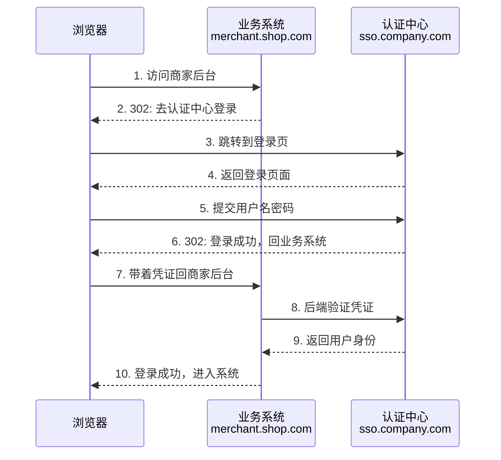
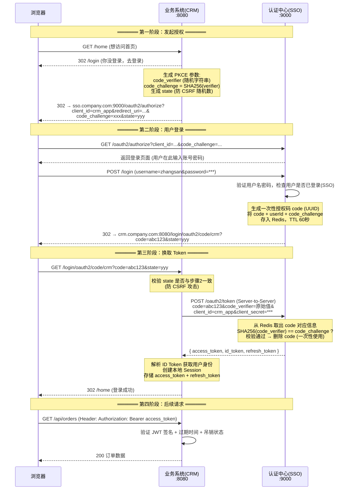
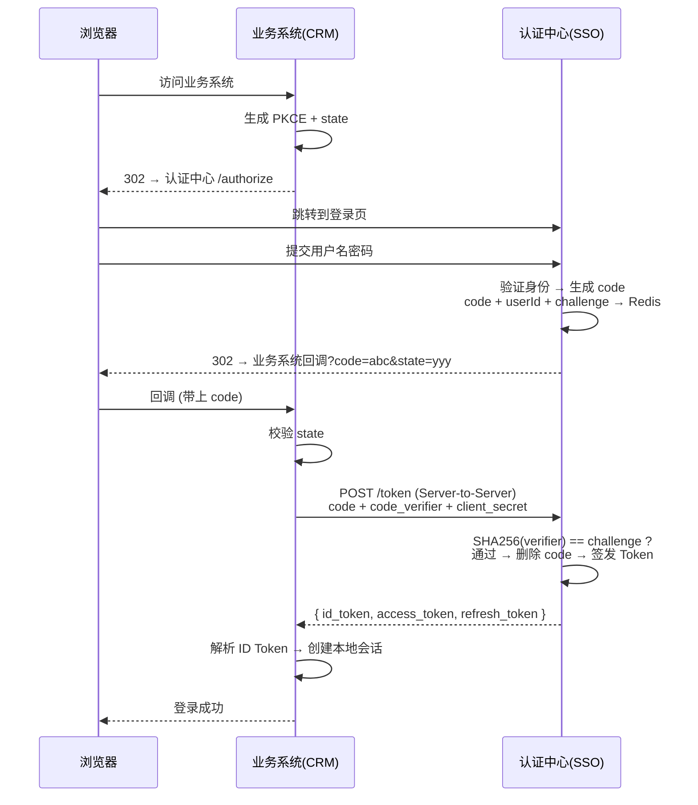

# OAuth 2.0 + JWT 单点登录实战

## 一、从一个登录按钮说起

你在商家后台（`merchant.shop.com`）点了"登录"，页面跳转到了一个统一的登录页，你输入账号密码，然后又跳回了商家后台——你已经在系统里了。然后你打开运营后台（`ops.shop.com`），不用再输密码，直接进去了。

这就是单点登录（SSO）。背后有三个角色在协作：



这里面有两个关键问题：

1. <strong>第 5 步中，用户的密码交给了谁？</strong> 答案：只交给了认证中心。业务系统从头到尾都没见过用户的密码。
2. <strong>第 7 步中，浏览器带回的"凭证"是什么？</strong> 答案：是一个一次性的授权码（code），不是用户名密码，也不是最终的身份令牌。

这就是 OAuth 2.0 授权码模式的核心思路：<strong>用户密码只给认证中心，业务系统通过一个间接的"授权码"来确认用户身份</strong>。

---

## 二、逐帧拆解：一次登录的完整交互

下面以一个真实场景走一遍完整流程。三个参与者：

| 参与者 | 对应系统 | 职责 |
|--------|----------|------|
| <strong>浏览器</strong> | 用户正在用的 Chrome / Edge | 用户操作的入口，负责跳转和提交凭据 |
| <strong>业务系统</strong> | CRM 应用（`crm.company.com:8080`） | 用户真正想用的系统，需要确认"你是谁" |
| <strong>认证中心</strong> | SSO 服务器（`sso.company.com:9000`） | 唯一能验证用户名密码的地方，签发身份令牌 |

下面是完整的交互流程——<strong>请重点关注每个角色在每一步做了什么</strong>：



把这个流程拆成四个阶段来看：

### 第一阶段：发起授权（业务系统在做什么）

用户访问 `crm.company.com/home`，业务系统发现用户没登录。此时<strong>业务系统做了三件事</strong>：

1. 生成一个随机字符串叫 `code_verifier`，然后计算它的 SHA256 哈希叫 `code_challenge`
2. 生成另一个随机字符串叫 `state`
3. 把用户浏览器重定向到认证中心的 `/authorize` 地址

这里 `code_challenge` 和 `state` 有什么用在后面会看到。现在只需要知道：<strong>业务系统生成了两个随机数，把其中一个（challenge）传给认证中心，另一个（verifier）自己留着</strong>。

### 第二阶段：用户登录（认证中心在做什么）

浏览器跳到了认证中心的页面。认证中心检查了两件事：

1. `client_id=crm_app` 是不是一个已注册的合法业务系统
2. `redirect_uri` 是不是和注册时填的一模一样（<strong>必须精确匹配，包括端口号</strong>——防止授权码被重定向到攻击者的地址）

校验通过后，认证中心返回登录页面。用户输入账号密码，认证中心验证身份，然后：

1. 生成一个一次性授权码 `code`（本质是一个 UUID，30~60 秒过期）
2. 把 `code` + 用户ID + 之前收到的 `code_challenge` <strong>一起存到 Redis</strong>
3. 把浏览器重定向回业务系统的回调地址，URL 后面带上 `?code=abc123&state=yyy`

<strong>关键安全机制</strong>：授权码 `code` 通过浏览器 URL 传递（明文出现在地址栏），所以它必须是一次性的、短有效期的。即使被截获，攻击者也只能在 60 秒内使用一次——后面会看到为什么即使截获了也用不了。

### 第三阶段：换取 Token（双方后端在通信）

浏览器带着 `code` 回到业务系统。业务系统做了三件事：

1. <strong>校验 state</strong>：对比 URL 中的 `state` 和第一阶段自己生成的是否一致。不一致 = 有人伪造了回调请求（CSRF 攻击），直接拒绝。
2. <strong>后端调用认证中心</strong>：用 `RestTemplate` 发一个 POST 请求到 `/oauth2/token`，带上 `code` + `code_verifier`（第一阶段自己保留的那个原始随机数）+ `client_id` + `client_secret`。这个请求是 <strong>Server-to-Server</strong>，浏览器完全看不到。
3. <strong>创建本地会话</strong>：拿到认证中心返回的 Token 后，解析用户身份，创建本地 Session。

认证中心在 `/token` 端点做了什么：

1. 从 Redis 取出 `code` 对应的信息（userId + code_challenge）
2. 计算 `SHA256(code_verifier)`，和存储的 `code_challenge` 逐字节比较
3. <strong>立即删除 Redis 中的 code</strong>（保证同一个 code 不能换两次 Token）
4. 签发三个 Token 返回给业务系统

<strong>这就是 PKCE 发挥作用的地方</strong>：假设攻击者在第二阶段截获了 URL 中的 `code=abc123`，他来到第三阶段想用这个 code 换 Token。但他没有 `code_verifier`——这个值从未在网络上传输过，只在第一阶段的业务系统内存中。没有 `code_verifier`，就通不过 SHA256 校验，code 就是废的。

### 第四阶段：后续请求（Token 怎么用）

用户已经登录，现在每次访问 `crm.company.com/api/orders` 时：

1. 浏览器在请求头带上 `Authorization: Bearer <access_token>`
2. 业务系统本地验证 JWT 的签名（不需要每次调认证中心）
3. 同时检查 Token 是否在 Redis 黑名单里（已被吊销的 Token 拒绝访问）

### state 和 PKCE 各自防什么？

这两个容易搞混，一句话区分：

| 机制 | 防什么 | 攻击场景 |
|------|--------|----------|
| <strong>state</strong> | 防 CSRF（跨站请求伪造） | 攻击者在自己网站嵌入 ``，诱导用户点击后，用户浏览器带着攻击者的 state 去授权。回调时 state 不匹配，拒绝。 |
| <strong>PKCE</strong> | 防授权码截获 | 恶意 App 注册了相同的回调 URL Scheme，截获了浏览器 URL 中的 `code`。但没有 `code_verifier`，无法通过 `/token` 的 SHA256 校验。 |

---

## 三、三种 Token 的分工

第二阶段认证中心签发了三个 Token，它们各自有不同的用途：

| Token | 格式 | 给谁看 | 用途 | 有效期 |
|-------|------|--------|------|--------|
| <strong>ID Token</strong> | JWT | 业务系统 | 告诉业务系统"用户是谁"（name, email, sub） | 5~15 分钟 |
| <strong>Access Token</strong> | JWT | API / 资源服务器 | 证明"我有权访问这个 API" | 15~60 分钟 |
| <strong>Refresh Token</strong> | 随机字符串 | 认证中心自己 | 在 Access Token 过期后换一个新的，用户无需重新登录 | 7~30 天 |

用一个具体的例子来理解三者的区别：

> ID Token 像<strong>身份证</strong>——上面写着你的名字和照片，你给前台看一眼证明你是谁，前台不会拿走它。
> Access Token 像<strong>工牌</strong>——刷卡进办公室，门禁系统只关心你有没有权限，不关心你叫什么。
> Refresh Token 像<strong>人事部的续签表</strong>——工牌过期了，拿着续签表去换一张新工牌，不用重新面试。

实际数据长这样：

<strong>ID Token</strong> 的 JWT Payload：

```json
{
  "iss": "https://sso.company.com",
  "sub": "10086",
  "aud": "crm_app",
  "exp": 1660123456,
  "iat": 1660123156,
  "name": "Zhang San",
  "email": "zhangsan@company.com"
}
```

重点看 `aud`（audience，受众）字段——它是 `crm_app`（业务系统的 client_id）。这意味着<strong>这个 Token 是给 CRM 系统看的</strong>，用来让它知道用户是谁。

<strong>Access Token</strong> 的 JWT Payload：

```json
{
  "iss": "https://sso.company.com",
  "sub": "10086",
  "aud": "https://api.company.com",
  "exp": 1660126756,
  "client_id": "crm_app",
  "scope": "openid profile"
}
```

注意这里的 `aud` 变成了 `https://api.company.com`——<strong>这个 Token 是给 API 服务器验证的</strong>。如果拿 ID Token 去调 API，API 服务器发现 `aud` 不是自己，应该直接拒绝。

---

## 四、授权服务器实现

架构说明：实战项目分为两个独立服务：

- <strong>auth-server</strong>（认证中心，端口 9000）：负责用户登录、签发 Token、刷新与吊销
- <strong>crm-app</strong>（业务系统，端口 8080）：接入 SSO，保护业务资源

### 4.1 依赖

```xml
<!-- Spring Boot 2.7.x -->
<parent>
    <groupId>org.springframework.boot</groupId>
    <artifactId>spring-boot-starter-parent</artifactId>
    <version>2.7.15</version>
</parent>

<dependencies>
    <dependency>
        <groupId>org.springframework.boot</groupId>
        <artifactId>spring-boot-starter-web</artifactId>
    </dependency>
    <dependency>
        <groupId>org.springframework.boot</groupId>
        <artifactId>spring-boot-starter-security</artifactId>
    </dependency>

    <!-- JWT: JJWT 0.11.5 -->
    <dependency>
        <groupId>io.jsonwebtoken</groupId>
        <artifactId>jjwt-api</artifactId>
        <version>0.11.5</version>
    </dependency>
    <dependency>
        <groupId>io.jsonwebtoken</groupId>
        <artifactId>jjwt-impl</artifactId>
        <version>0.11.5</version>
        <scope>runtime</scope>
    </dependency>
    <dependency>
        <groupId>io.jsonwebtoken</groupId>
        <artifactId>jjwt-jackson</artifactId>
        <version>0.11.5</version>
        <scope>runtime</scope>
    </dependency>

    <dependency>
        <groupId>org.springframework.boot</groupId>
        <artifactId>spring-boot-starter-data-redis</artifactId>
    </dependency>
    <dependency>
        <groupId>com.baomidou</groupId>
        <artifactId>mybatis-plus-boot-starter</artifactId>
        <version>3.5.3</version>
    </dependency>
    <dependency>
        <groupId>mysql</groupId>
        <artifactId>mysql-connector-java</artifactId>
    </dependency>
    <dependency>
        <groupId>org.projectlombok</groupId>
        <artifactId>lombok</artifactId>
        <optional>true</optional>
    </dependency>
</dependencies>
```

### 4.2 配置：注册哪些业务系统可以接入

```yaml
oauth2:
  issuer: https://sso.company.com
  jwt-secret: ${JWT_SECRET:your-256-bit-secret-key-must-be-at-least-256-bits-long}
  access-token-expire-sec: 3600
  refresh-token-expire-sec: 604800
  id-token-expire-sec: 300
  auth-code-expire-sec: 60
  clients:
    - client-id: crm_app
      client-secret: ${CRM_SECRET:abc123}
      redirect-uris:
        - http://crm.company.com/login/oauth2/code/crm
      scopes:
        - openid
        - profile
        - email
      require-pkce: true
    - client-id: merchant_app
      client-secret: ${MERCHANT_SECRET:xyz789}
      redirect-uris:
        - http://merchant.shop.com/login/oauth2/code/merchant
      scopes:
        - openid
        - profile
      require-pkce: true
```

对应的配置类：

```java
@Data
@Configuration
@ConfigurationProperties(prefix = "oauth2")
public class OAuth2Config {

    private String issuer = "https://sso.company.com";
    private String jwtSecret;
    private int accessTokenExpireSec = 3600;
    private int refreshTokenExpireSec = 604800;
    private int idTokenExpireSec = 300;
    private int authCodeExpireSec = 60;
    private List<ClientRegistration> clients = new ArrayList<>();

    @Data
    public static class ClientRegistration {
        private String clientId;
        private String clientSecret;
        private List<String> redirectUris;
        private List<String> scopes;
        private boolean requirePkce = true;
    }
}
```

<strong>每个业务系统在认证中心注册时，要提供</strong>：`client_id`（系统标识）、`client_secret`（用于 `/token` 端点的后端认证）、`redirect_uris`（允许回调到哪些地址——必须精确匹配，这是安全关键）、`require_pkce`（SPA 或移动端必须开启）。

### 4.3 JWT Token 服务：签发与校验

这是认证中心最核心的组件，负责三件事：<strong>签发 Token、验证 Token、吊销 Token</strong>。

```java
@Component
@RequiredArgsConstructor
public class JwtTokenService {

    private final OAuth2Config oauth2Config;
    private final StringRedisTemplate redisTemplate;

    private SecretKey getSigningKey() {
        byte[] keyBytes = oauth2Config.getJwtSecret().getBytes(StandardCharsets.UTF_8);
        return Keys.hmacShaKeyFor(keyBytes);
    }

    /**
     * 签发 ID Token —— 告诉 Client "用户是谁"
     * aud 必须是 Client 的 client_id
     */
    public String createIdToken(UserDetails user, String clientId, String nonce) {
        long now = System.currentTimeMillis();
        return Jwts.builder()
                .setIssuer(oauth2Config.getIssuer())
                .setSubject(user.getUserId().toString())
                .setAudience(clientId)
                .claim("name", user.getUsername())
                .claim("email", user.getEmail())
                .claim("nonce", nonce)
                .setIssuedAt(new Date(now))
                .setExpiration(new Date(now + oauth2Config.getIdTokenExpireSec() * 1000L))
                .setId(UUID.randomUUID().toString())
                .signWith(getSigningKey())
                .compact();
    }

    /**
     * 签发 Access Token —— 给 API 验证权限用
     * aud 必须是 Resource Server 的 URL
     */
    public String createAccessToken(UserDetails user, String clientId,
                                     List<String> scopes) {
        long now = System.currentTimeMillis();
        String jti = UUID.randomUUID().toString();
        return Jwts.builder()
                .setIssuer(oauth2Config.getIssuer())
                .setSubject(user.getUserId().toString())
                .setAudience("https://api.company.com")
                .claim("client_id", clientId)
                .claim("scope", String.join(" ", scopes))
                .setIssuedAt(new Date(now))
                .setExpiration(new Date(now + oauth2Config.getAccessTokenExpireSec() * 1000L))
                .setId(jti)
                .signWith(getSigningKey())
                .compact();
    }

    /**
     * 创建 Refresh Token —— 随机字符串，存 Redis
     * 不是 JWT！这样吊销时直接删 Redis Key 即可
     */
    public String createRefreshToken(UserDetails user, String clientId) {
        String refreshToken = UUID.randomUUID().toString() + "." +
                              UUID.randomUUID().toString();
        String redisKey = "oauth2:refresh:" + refreshToken;
        Map<String, String> tokenInfo = new HashMap<>();
        tokenInfo.put("userId", user.getUserId().toString());
        tokenInfo.put("clientId", clientId);
        redisTemplate.opsForHash().putAll(redisKey, tokenInfo);
        redisTemplate.expire(redisKey,
                oauth2Config.getRefreshTokenExpireSec(), TimeUnit.SECONDS);
        return refreshToken;
    }

    /**
     * 验证 JWT 签名 + 过期时间
     */
    public Claims validateJwt(String token) {
        return Jwts.parserBuilder()
                .setSigningKey(getSigningKey())
                .build()
                .parseClaimsJws(token)
                .getBody();
    }

    /**
     * 吊销 Access Token：将 jti 加入 Redis 黑名单
     * TTL = Token 剩余有效期，过期自动清理
     */
    public void revokeAccessToken(String jti, long expireAt) {
        long ttl = expireAt - System.currentTimeMillis();
        if (ttl > 0) {
            redisTemplate.opsForValue().set(
                    "oauth2:blacklist:" + jti, "1",
                    ttl, TimeUnit.MILLISECONDS);
        }
    }

    public boolean isRevoked(String jti) {
        return Boolean.TRUE.equals(
                redisTemplate.hasKey("oauth2:blacklist:" + jti));
    }
}
```

<strong>三个设计决策</strong>：

- <strong>ID Token 的 aud = client_id，Access Token 的 aud = API 地址</strong>——这是 OIDC 规范的要求。如果拿 ID Token 去调 API，API 校验 aud 不匹配直接拒绝。
- <strong>Refresh Token 不是 JWT，是随机字符串存 Redis</strong>——吊销时直接 `redisTemplate.delete(key)`，即时生效。如果 Refresh Token 也是 JWT，吊销就麻烦多了（需要维护黑名单）。
- <strong>Access Token 吊销用黑名单</strong>——把 `jti`（JWT ID）加入 Redis，TTL = Token 剩余过期时间。Token 自然过期后黑名单自动清理，无需额外定时任务。

### 4.4 授权端点：GET /oauth2/authorize

这是流程图中<strong>第一阶段和第二阶段的认证中心侧实现</strong>——接收业务系统的授权请求，引导用户登录，生成授权码。

```java
@RestController
@RequestMapping("/oauth2")
@RequiredArgsConstructor
public class AuthorizationController {

    private final OAuth2Config oauth2Config;
    private final StringRedisTemplate redisTemplate;
    private final UserDetailsServiceImpl userDetailsService;

    /**
     * GET /oauth2/authorize?response_type=code&client_id=xxx&redirect_uri=xxx&...
     *
     * 这个端点做了五件事：
     * 1. 校验 client_id 和 redirect_uri 是否合法
     * 2. 校验 PKCE 参数（code_challenge 必须存在，method 必须是 S256）
     * 3. 将授权请求参数暂存 Redis（登录完成后用）
     * 4. 检查用户是否已在认证中心登录 → SSO 的关键：已登录就跳过登录页
     * 5. 未登录 → 重定向到登录页
     */
    @GetMapping("/authorize")
    public void authorize(HttpServletRequest request, HttpServletResponse response)
            throws IOException {

        // 1. 校验必填参数
        String responseType = request.getParameter("response_type");
        String clientId = request.getParameter("client_id");
        String redirectUri = request.getParameter("redirect_uri");
        String scope = request.getParameter("scope");
        String state = request.getParameter("state");
        String codeChallenge = request.getParameter("code_challenge");
        String codeChallengeMethod = request.getParameter("code_challenge_method");

        if (!"code".equals(responseType)) {
            sendError(response, redirectUri, "unsupported_response_type", state);
            return;
        }

        // 2. 校验 client_id 与 redirect_uri（严格精确匹配）
        OAuth2Config.ClientRegistration client = findClient(clientId);
        if (client == null || !client.getRedirectUris().contains(redirectUri)) {
            sendError(response, redirectUri, "invalid_client", state);
            return;
        }

        // 3. 校验 PKCE 参数
        if (client.isRequirePkce()) {
            if (codeChallenge == null || !"S256".equals(codeChallengeMethod)) {
                sendError(response, redirectUri, "invalid_request",
                        "PKCE required", state);
                return;
            }
        }

        // 4. 将授权请求参数暂存 Redis（登录成功后使用）
        String sessionId = request.getSession().getId();
        Map<String, String> authRequest = new HashMap<>();
        authRequest.put("clientId", clientId);
        authRequest.put("redirectUri", redirectUri);
        authRequest.put("scope", scope);
        authRequest.put("state", state);
        authRequest.put("codeChallenge", codeChallenge);
        authRequest.put("codeChallengeMethod", codeChallengeMethod);
        redisTemplate.opsForHash().putAll(
                "oauth2:auth_request:" + sessionId, authRequest);
        redisTemplate.expire("oauth2:auth_request:" + sessionId, 5, TimeUnit.MINUTES);

        // 5. 检查用户是否已登录 —— SSO 的核心逻辑
        Authentication auth = SecurityContextHolder.getContext().getAuthentication();
        if (auth != null && auth.isAuthenticated()
                && !(auth instanceof AnonymousAuthenticationToken)) {
            // 已登录 → 跳过登录页，直接生成授权码
            issueAuthorizationCode(response, auth, authRequest);
        } else {
            // 未登录 → 重定向到登录页
            response.sendRedirect("/login?session=" + sessionId);
        }
    }

    /**
     * 生成授权码并重定向回业务系统
     */
    private void issueAuthorizationCode(HttpServletResponse response,
                                         Authentication auth,
                                         Map<String, String> authRequest) throws IOException {
        String code = UUID.randomUUID().toString().replace("-", "");

        // 授权码 + 用户信息 + PKCE challenge → Redis（TTL 60秒）
        String redisKey = "oauth2:code:" + code;
        Map<String, String> codeInfo = new HashMap<>();
        codeInfo.put("userId", ((UserDetails) auth.getPrincipal()).getUserId().toString());
        codeInfo.put("clientId", authRequest.get("clientId"));
        codeInfo.put("scope", authRequest.get("scope"));
        codeInfo.put("codeChallenge", authRequest.get("codeChallenge"));
        redisTemplate.opsForHash().putAll(redisKey, codeInfo);
        redisTemplate.expire(redisKey, oauth2Config.getAuthCodeExpireSec(),
                TimeUnit.SECONDS);

        // 302 重定向回业务系统的回调地址
        String redirectUri = authRequest.get("redirectUri");
        String state = authRequest.get("state");
        String location = String.format("%s?code=%s&state=%s", redirectUri, code, state);
        response.sendRedirect(location);
    }
}
```

<strong>第 5 步是 SSO "一次登录，处处可用"的代码体现</strong>：用户已经在认证中心登录过（浏览器有 Session），再次访问 `/authorize` 时直接生成授权码，不需要重新输入密码。用户无感。

### 4.5 Token 端点：POST /oauth2/token

这是流程图中<strong>第三阶段的认证中心侧实现</strong>——业务系统后端拿 code 来换 Token。

```java
/**
 * POST /oauth2/token
 *
 * 这个端点做了六件事：
 * 1. 校验 client_id + client_secret（确认调用方是合法业务系统）
 * 2. 从 Redis 取出授权码信息（读后即删，保证一次性）
 * 3. 校验 redirect_uri 与 /authorize 时一致
 * 4. PKCE 校验：SHA256(code_verifier) == code_challenge ?
 * 5. 签发三 Token（ID Token + Access Token + Refresh Token）
 */
@PostMapping("/token")
public Map<String, Object> token(@RequestParam("grant_type") String grantType,
                                  @RequestParam("code") String code,
                                  @RequestParam("code_verifier") String codeVerifier,
                                  @RequestParam("client_id") String clientId,
                                  @RequestParam("client_secret") String clientSecret,
                                  @RequestParam("redirect_uri") String redirectUri) {

    // 1. 校验 client 凭据
    OAuth2Config.ClientRegistration client = findClient(clientId);
    if (client == null || !client.getClientSecret().equals(clientSecret)) {
        throw new InvalidClientException("Invalid client credentials");
    }

    if (!"authorization_code".equals(grantType)) {
        throw new UnsupportedGrantTypeException("Only authorization_code is supported");
    }

    // 2. 从 Redis 取出授权码信息 —— 读后即删
    String codeKey = "oauth2:code:" + code;
    Map<Object, Object> codeInfo = redisTemplate.opsForHash().entries(codeKey);
    if (codeInfo.isEmpty()) {
        throw new InvalidGrantException("Invalid or expired authorization code");
    }
    redisTemplate.delete(codeKey);  // 立即删除，同一个 code 不能换两次

    // 3. 校验 redirect_uri
    if (!redirectUri.equals(client.getRedirectUris().get(0))) {
        throw new InvalidGrantException("redirect_uri mismatch");
    }

    // 4. PKCE 校验
    String storedChallenge = (String) codeInfo.get("codeChallenge");
    if (client.isRequirePkce() && storedChallenge != null) {
        String computedChallenge = computeS256Challenge(codeVerifier);
        if (!storedChallenge.equals(computedChallenge)) {
            throw new InvalidGrantException("PKCE verification failed");
        }
    }

    // 5. 签发 Token
    String userId = (String) codeInfo.get("userId");
    String scopeStr = (String) codeInfo.get("scope");
    List<String> scopes = Arrays.asList(scopeStr.split(" "));
    UserDetails user = userDetailsService.loadUserByUserId(userId);

    String idToken = jwtTokenService.createIdToken(user, clientId, null);
    String accessToken = jwtTokenService.createAccessToken(user, clientId, scopes);
    String refreshToken = jwtTokenService.createRefreshToken(user, clientId);

    Map<String, Object> result = new LinkedHashMap<>();
    result.put("access_token", accessToken);
    result.put("token_type", "Bearer");
    result.put("expires_in", oauth2Config.getAccessTokenExpireSec());
    result.put("refresh_token", refreshToken);
    result.put("id_token", idToken);
    result.put("scope", scopeStr);
    return result;
}

private String computeS256Challenge(String codeVerifier) {
    try {
        MessageDigest md = MessageDigest.getInstance("SHA-256");
        byte[] digest = md.digest(codeVerifier.getBytes(StandardCharsets.US_ASCII));
        return Base64.getUrlEncoder().withoutPadding().encodeToString(digest);
    } catch (NoSuchAlgorithmException e) {
        throw new RuntimeException("SHA-256 not available", e);
    }
}
```

<strong>这里三个安全措施是串联的</strong>：code 从 Redis 读后立即删除（一次性使用）→ redirect_uri 必须与 /authorize 时一致（即使 code 被截获，攻击者也不知道原始 redirect_uri）→ PKCE 校验（即使攻击者同时截获了 code 和 redirect_uri，也没有 code_verifier）。

---

## 五、业务系统接入

上面是认证中心的实现。对于业务系统（CRM），需要做三件事：<strong>发起授权、处理回调、验证 Token</strong>。

### 5.1 发起授权：重定向到认证中心

对应流程图的<strong>第一阶段</strong>。用户访问业务系统，发现没登录，生成 PKCE 参数后重定向到认证中心。

```java
@Controller
public class LoginController {

    @Value("${oauth2.auth-server.base-url}")
    private String authServerBaseUrl;
    @Value("${oauth2.client.client-id}")
    private String clientId;
    @Value("${oauth2.client.redirect-uri}")
    private String redirectUri;
    @Value("${oauth2.client.scope}")
    private String scope;

    /**
     * 发起授权 —— 重定向到认证中心
     * GET /login → 302 → sso.company.com:9000/oauth2/authorize?...
     *
     * 业务系统在这一步做了四件事：
     * 1. 生成 PKCE 参数（code_verifier + code_challenge）
     * 2. 生成 state 防 CSRF
     * 3. 把 code_verifier 和 state 暂存 Session
     * 4. 构建 /authorize URL 并 302 重定向
     */
    @GetMapping("/login")
    public void login(HttpServletRequest request, HttpServletResponse response)
            throws IOException {

        // 1. 生成 PKCE 参数
        String codeVerifier = PkceUtil.generateCodeVerifier();
        String codeChallenge = PkceUtil.generateCodeChallenge(codeVerifier);

        // 2. 生成 state 防 CSRF
        String state = UUID.randomUUID().toString();

        // 3. 存入 Session（回调时需要取出校验）
        HttpSession session = request.getSession(true);
        session.setAttribute("code_verifier", codeVerifier);
        session.setAttribute("oauth_state", state);

        // 4. 构建 /authorize URL 并重定向
        String authorizeUrl = UriComponentsBuilder
                .fromHttpUrl(authServerBaseUrl + "/oauth2/authorize")
                .queryParam("response_type", "code")
                .queryParam("client_id", clientId)
                .queryParam("redirect_uri", redirectUri)
                .queryParam("scope", scope)
                .queryParam("state", state)
                .queryParam("code_challenge", codeChallenge)
                .queryParam("code_challenge_method", "S256")
                .toUriString();

        response.sendRedirect(authorizeUrl);
    }
}
```

PKCE 工具类（<strong>业务系统和认证中心必须用同样的算法</strong>）：

```java
public class PkceUtil {

    public static String generateCodeVerifier() {
        SecureRandom secureRandom = new SecureRandom();
        byte[] randomBytes = new byte[32];
        secureRandom.nextBytes(randomBytes);
        return Base64.getUrlEncoder().withoutPadding().encodeToString(randomBytes);
    }

    public static String generateCodeChallenge(String codeVerifier) {
        try {
            MessageDigest md = MessageDigest.getInstance("SHA-256");
            byte[] digest = md.digest(codeVerifier.getBytes(StandardCharsets.US_ASCII));
            return Base64.getUrlEncoder().withoutPadding().encodeToString(digest);
        } catch (NoSuchAlgorithmException e) {
            throw new RuntimeException(e);
        }
    }
}
```

<strong>注意 `US_ASCII` 编码</strong>——PKCE 规范要求 code_verifier 的字符集限制在 `[A-Z][a-z][0-9]-._~`，即 ASCII 可打印字符。如果用 `UTF-8` 编码计算 SHA256，可能因为字符集差异导致校验失败。

### 5.2 处理回调：用授权码换 Token

对应流程图的<strong>第三阶段</strong>。认证中心带着授权码重定向回业务系统。

```java
/**
 * 认证中心回调 —— 接收授权码，换取 Token
 * GET /login/oauth2/code/crm?code=xxx&state=yyy
 *
 * 业务系统在这一步做了五件事：
 * 1. 校验 state（防 CSRF）
 * 2. 取出之前暂存的 code_verifier
 * 3. 后端调用认证中心 /token（Server-to-Server，浏览器不可见）
 * 4. 解析 ID Token 获取用户身份
 * 5. 创建本地会话
 */
@GetMapping("/login/oauth2/code/crm")
public String callback(@RequestParam("code") String code,
                       @RequestParam("state") String state,
                       HttpServletRequest request) throws IOException {

    // 1. 校验 state，防 CSRF
    HttpSession session = request.getSession(false);
    if (session == null) {
        throw new SecurityException("No session found");
    }
    String savedState = (String) session.getAttribute("oauth_state");
    if (!state.equals(savedState)) {
        throw new SecurityException("State mismatch - possible CSRF attack");
    }

    // 2. 取出 code_verifier
    String codeVerifier = (String) session.getAttribute("code_verifier");
    session.removeAttribute("code_verifier");
    session.removeAttribute("oauth_state");

    // 3. 后端用授权码换 Token（Server-to-Server）
    Map<String, String> tokenResponse = exchangeCodeForToken(code, codeVerifier);

    // 4. 解析 ID Token 获取用户信息
    String idToken = tokenResponse.get("id_token");
    Map<String, Object> userInfo = parseIdToken(idToken);

    // 5. 创建本地会话
    session.setAttribute("user", userInfo);
    session.setAttribute("access_token", tokenResponse.get("access_token"));
    session.setAttribute("refresh_token", tokenResponse.get("refresh_token"));

    return "redirect:/home";
}

/**
 * 后端调用认证中心 /token 端点
 * 这个请求浏览器完全看不到 —— client_secret 不会泄露
 */
private Map<String, String> exchangeCodeForToken(String code, String codeVerifier) {
    RestTemplate restTemplate = new RestTemplate();

    HttpHeaders headers = new HttpHeaders();
    headers.setContentType(MediaType.APPLICATION_FORM_URLENCODED);

    MultiValueMap<String, String> body = new LinkedMultiValueMap<>();
    body.add("grant_type", "authorization_code");
    body.add("code", code);
    body.add("code_verifier", codeVerifier);
    body.add("client_id", clientId);
    body.add("client_secret", clientSecret);
    body.add("redirect_uri", redirectUri);

    HttpEntity<MultiValueMap<String, String>> request =
            new HttpEntity<>(body, headers);

    ResponseEntity<Map> response = restTemplate.postForEntity(
            authServerBaseUrl + "/oauth2/token", request, Map.class);

    Map<String, Object> body2 = response.getBody();
    Map<String, String> result = new LinkedHashMap<>();
    result.put("access_token", (String) body2.get("access_token"));
    result.put("refresh_token", (String) body2.get("refresh_token"));
    result.put("id_token", (String) body2.get("id_token"));
    return result;
}
```

### 5.3 验证 Token：每个请求都要做的事

对应流程图的<strong>第四阶段</strong>。用户登录后访问业务 API，业务系统需要验证每个请求带的 Access Token。

```java
/**
 * Bearer Token 过滤器 —— 从请求头提取 Access Token 并校验
 * 每个请求都要经过这个过滤器
 */
public class BearerTokenAuthenticationFilter extends OncePerRequestFilter {

    private final AuthServerClient authServerClient;

    @Override
    protected void doFilterInternal(HttpServletRequest request,
                                     HttpServletResponse response,
                                     FilterChain chain)
            throws ServletException, IOException {

        String authHeader = request.getHeader("Authorization");
        if (authHeader != null && authHeader.startsWith("Bearer ")) {
            String accessToken = authHeader.substring(7);

            // Access Token 是 JWT → 本地验签（不需要每次调认证中心）
            Claims claims = authServerClient.validateAccessTokenLocally(accessToken);

            // 构建认证对象，注入 SecurityContext
            List<SimpleGrantedAuthority> authorities = extractAuthorities(claims);
            JwtAuthenticationToken auth = new JwtAuthenticationToken(
                    claims.getSubject(), claims, authorities);
            SecurityContextHolder.getContext().setAuthentication(auth);
        }

        chain.doFilter(request, response);
    }
}
```

对应的 Spring Security 配置：

```java
@Configuration
@EnableWebSecurity
public class SecurityConfig {

    @Bean
    public SecurityFilterChain filterChain(HttpSecurity http) throws Exception {
        http
            .authorizeRequests(auth -> auth
                .antMatchers("/login", "/login/oauth2/**", "/error").permitAll()
                .anyRequest().authenticated()
            )
            .sessionManagement(session -> session
                .sessionCreationPolicy(SessionCreationPolicy.STATELESS)
            )
            .csrf().disable()
            .addFilterBefore(
                new BearerTokenAuthenticationFilter(authServerClient),
                UsernamePasswordAuthenticationFilter.class
            );
        return http.build();
    }
}
```

---

## 六、Token 生命周期管理

### 6.1 刷新 Access Token

Access Token 有效期短（15~60 分钟），过期后用 Refresh Token 换新的，用户无需重新登录：

```java
@PostMapping("/auth/refresh")
@ResponseBody
public Map<String, String> refreshAccessToken(HttpSession session) {
    String refreshToken = (String) session.getAttribute("refresh_token");
    if (refreshToken == null) {
        throw new UnauthorizedException("No refresh token in session");
    }

    // 调用认证中心的 /token 端点，grant_type=refresh_token
    RestTemplate restTemplate = new RestTemplate();
    MultiValueMap<String, String> body = new LinkedMultiValueMap<>();
    body.add("grant_type", "refresh_token");
    body.add("refresh_token", refreshToken);
    body.add("client_id", clientId);
    body.add("client_secret", clientSecret);

    HttpHeaders headers = new HttpHeaders();
    headers.setContentType(MediaType.APPLICATION_FORM_URLENCODED);
    HttpEntity<MultiValueMap<String, String>> request = new HttpEntity<>(body, headers);

    ResponseEntity<Map> response = restTemplate.postForEntity(
            authServerBaseUrl + "/oauth2/token", request, Map.class);

    // 更新 Session 中的 Token
    Map<String, String> newTokens = new LinkedHashMap<>();
    newTokens.put("access_token", (String) response.getBody().get("access_token"));
    newTokens.put("refresh_token", (String) response.getBody().get("refresh_token"));
    session.setAttribute("access_token", newTokens.get("access_token"));
    session.setAttribute("refresh_token", newTokens.get("refresh_token"));

    return newTokens;
}
```

### 6.2 吊销 Token（全局登出）

在认证中心实现：

```java
/**
 * POST /oauth2/revoke —— 吊销指定 Token
 */
@PostMapping("/oauth2/revoke")
public void revoke(@RequestParam("token") String token,
                   @RequestParam("token_type_hint") String tokenTypeHint) {
    if ("refresh_token".equals(tokenTypeHint)) {
        // Refresh Token 存在 Redis → 直接删 Key
        redisTemplate.delete("oauth2:refresh:" + token);
    } else if ("access_token".equals(tokenTypeHint)) {
        // Access Token 是 JWT → 将 jti 加入黑名单
        try {
            Claims claims = jwtTokenService.validateJwt(token);
            jwtTokenService.revokeAccessToken(
                    claims.getId(),
                    claims.getExpiration().getTime());
        } catch (JwtException e) {
            // Token 已过期或无效，无需处理
        }
    }
}

/**
 * 管理员操作：强制登出指定用户的所有设备
 */
@PostMapping("/admin/revoke-user/{userId}")
public void revokeAllUserTokens(@PathVariable String userId) {
    Set<String> keys = redisTemplate.keys("oauth2:refresh:*");
    for (String key : keys) {
        String storedUserId = (String) redisTemplate.opsForHash().get(key, "userId");
        if (userId.equals(storedUserId)) {
            redisTemplate.delete(key);
        }
    }
}
```

<strong>Refresh Token 的吊销是即时的</strong>（删 Redis Key），<strong>Access Token 的吊销是近实时的</strong>（加入黑名单，TTL 为剩余有效期）。已发出的 JWT Access Token 在加入黑名单前有短暂窗口——降低 Access Token 有效期（如 15 分钟）可以缩小这个窗口。

---

## 七、总结

用一张图回顾全文的核心流程：



<strong>三个角色各自的职责一句话总结</strong>：

| 角色 | 职责 |
|------|------|
| <strong>浏览器</strong> | 负责跳转和提交凭据，<strong>只知道 code，不知道 Token</strong> |
| <strong>业务系统</strong> | 发起授权（生成 PKCE + state），用 code 换 Token（后端完成），验证 Token（本地验签）。<strong>从没见过用户密码</strong> |
| <strong>认证中心</strong> | 唯一拥有用户密码的地方。验证身份 → 签发 code → 校验 PKCE → 签发 Token → 管理 Token 生命周期 |

<strong>五个安全措施环环相扣</strong>：

| 措施 | 防什么 | 怎么做到的 |
|------|--------|-----------|
| <strong>redirect_uri 严格匹配</strong> | 授权码被重定向到攻击者地址 | 注册时固定回调地址，/authorize 和 /token 两次校验 |
| <strong>state 参数</strong> | CSRF（攻击者伪造回调请求） | 业务系统生成随机数 → 回调时对比 |
| <strong>PKCE</strong> | 授权码在传输中被截获 | code_verifier 从未上过网络，只有 code_challenge 的哈希在 URL 中 |
| <strong>code 一次性使用</strong> | 授权码被重放 | Redis 读后即删，同一个 code 只能换一次 Token |
| <strong>client_secret 不出浏览器</strong> | 凭据泄露 | /token 调用是 Server-to-Server，浏览器不可见 |

这篇文章覆盖了 OAuth 2.0 授权码 + PKCE 从浏览器到后端的完整实现。如果你在接入微信/Google/GitHub 登录，它们的流程和本文完全一致——只是 `/authorize` 和 `/token` 的地址换成了第三方认证中心。
