# SSO 与 JWT+Redis 的定位差异：Token格式、管理策略、认证架构三个层次

## 🤔 一、一个常见的学习困惑

很多开发者在学习鉴权体系时会遇到这样的困惑：

-  已经理解了 JWT 的三段式结构，知道它是无状态的 Token 格式
-  也理解了 JWT + Redis 混合方案，知道它能解决 Token 主动撤销的问题
-  然后听到"微服务用 SSO（单点登录）"，去查资料后发现 SSO 也用 JWT

于是产生疑问：**JWT + Redis 方案和 SSO 是什么关系？是不是同一个东西的不同叫法？如果不是，区别在哪？**

这三个概念确实容易混淆，因为它们都围绕"鉴权"这个话题，但**它们解决问题的层次完全不同**。下面用三个明确的定义开篇：

| 概念 | 本质 | 解决什么问题 |
|------|------|------|
| **JWT** | Token **数据格式** | Token 如何编码用户信息、如何防篡改 |
| **JWT + Redis** | Token **管理策略**（单服务内部） | 单个服务如何签发、验证、撤销 Token |
| **SSO（单点登录）** | 认证**架构模式**（跨服务） | 多个服务之间如何共享登录状态 |

---

## 💼 二、从一个具体的业务场景理解差异

假设你所在的公司有三个系统：

-  **OA 办公系统**（`oa.company.com`）—— 审批、考勤
-  **CRM 客户系统**（`crm.company.com`）—— 客户管理
-  **BI 报表系统**（`bi.company.com`）—— 数据分析

### 🏝️ 2.1 没有 SSO 时：每个系统各自鉴权

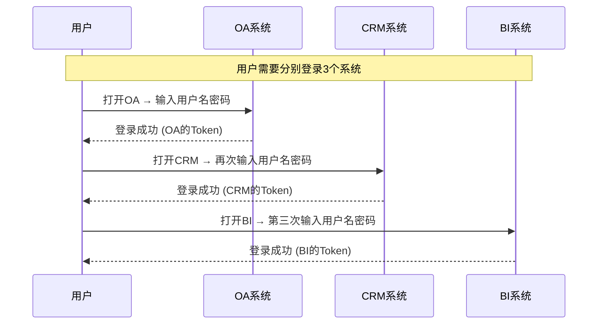

每个系统都有自己独立的用户表、独立的登录接口、独立签发 Token。用户需要在三个系统之间**各登录一次**。这里的每个系统内部，可能各自使用了 JWT + Redis 管理自己的 Token——但这和"用户只需登录一次"是两个不同的问题。

### 🌐 2.2 引入 SSO 后：一处登录，处处可用

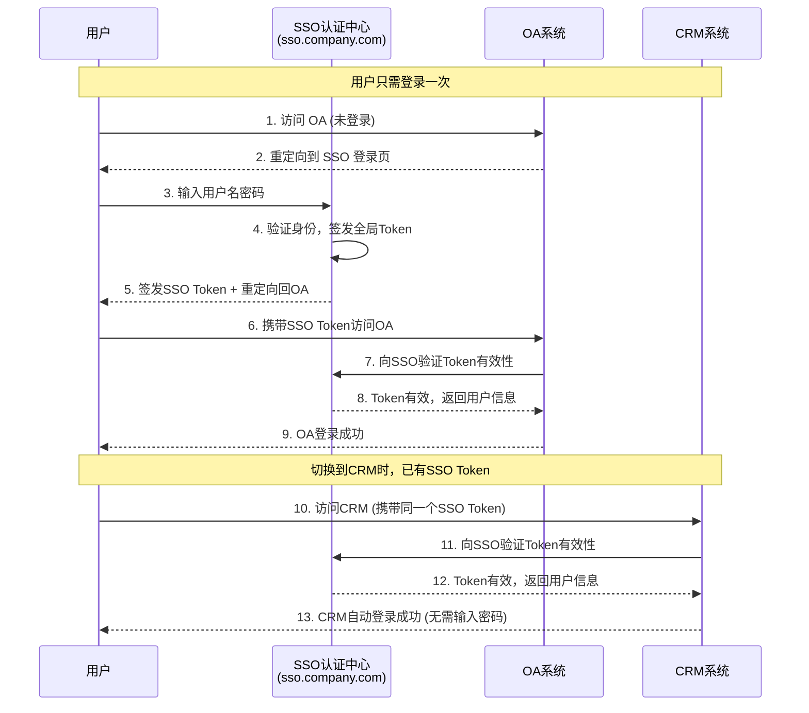

**SSO 的核心**：有一个独立的**认证中心**（也叫 IDP，Identity Provider），所有业务系统把"验证用户身份"这件事委托给它。用户在认证中心登录一次后，访问任何业务系统时，业务系统都去认证中心验证"这个人确实登录过了"。

---

## 📊 三、三者定位的精确对比

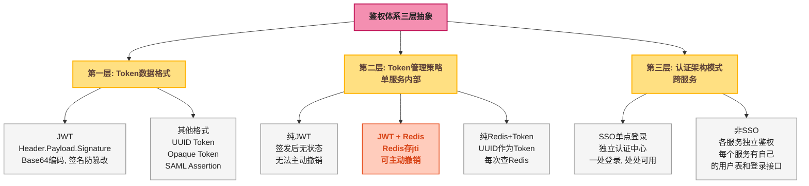

### 📄 3.1 第一层——Token 数据格式：JWT 只是其中一种

**这一层关心的是**：Token 字符串长什么样？怎么把用户信息放进去？怎么防止被篡改？

| 格式 | 用户信息在哪 | 防篡改机制 | 服务端是否需要存储 |
|------|------|------|:---:|
| **JWT** | 在 Payload 中（Base64 编码，可读） | 签名（HMAC-SHA256 / RSA） | 不需要 |
| **UUID Token** | 不在 Token 中，Token 只是随机字符串 | 无（随机字符串无法篡改，只能猜测） | 需要（Redis / DB） |
| **Opaque Token**（不透明令牌） | 不在 Token 中 | 服务端签发并存储 | 需要 |

**关键认知**：SSO 可以用 JWT 作为 Token 格式，也可以用其他格式。JWT 的"无状态"特性让它在 SSO 中特别受欢迎（业务系统验证 JWT 签名即可，不必每次都回调认证中心），但 **JWT 不是 SSO 的必需品**，SSO 也不是 JWT 的唯一用途。

### 🗄️ 3.2 第二层——Token 管理策略：JWT + Redis 只解决单服务内部的事

**这一层关心的是**：Token 如何签发？如何验证？如何撤销？

以 OA 系统为例，它的 Token 管理策略可能是：

- **方案A（纯 JWT）**：签发 JWT，每次验证签名 + 过期时间。Token 过期前无法撤销。
- **方案B（JWT + Redis）**：签发 JWT（含 `jti`），Redis 中存储 `auth:token:{jti}`。每次请求查 Redis 确认 Token 未被撤销。登出时删除 Redis Key。
- **方案C（纯 Redis + UUID）**：生成 UUID 作为 Token，Redis 中存 `uuid → 用户信息`。每次请求都从 Redis 读用户信息。

这三种方案都只涉及 **OA 系统自己** 如何管理 Token。CRM 系统和 BI 系统各自也有自己的选择，相互独立。

### 🌐 3.3 第三层——认证架构模式：SSO 解决跨服务的登录共享

**这一层关心的是**：用户在 OA 系统登录后，访问 CRM 时还要不要重新登录？

SSO 引入了一个**独立的认证中心**，它的职责是：

1. 提供统一的登录页面
2. 验证用户名密码
3. 签发全局 Token（通常是 JWT）
4. 提供 Token 验证接口给所有业务系统调用

业务系统的职责变为：

1. 不再有自己的登录页面
2. 不再自己验证用户名密码
3. 收到请求时，重定向到认证中心，或向认证中心验证 Token

---

## ⚖️ 四、JWT + Redis 和 SSO 的具体差异

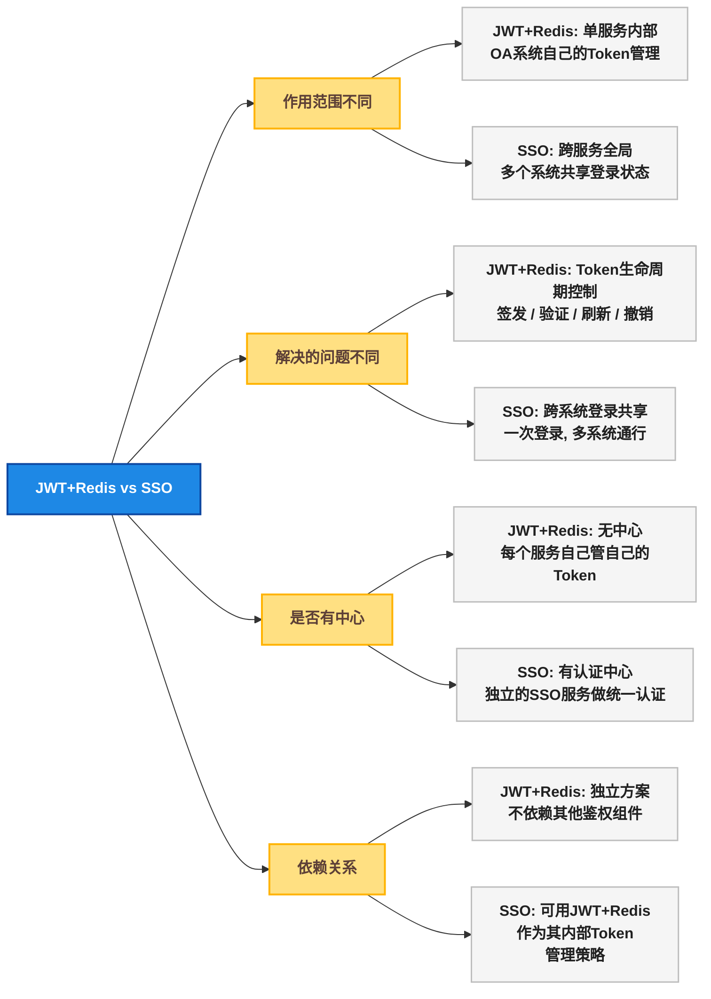

### 📋 4.1 差异逐项对照

| 对比维度 | JWT + Redis 方案 | SSO（单点登录） |
|------|------|------|
| **解决的问题** | 单个服务如何签发、验证、撤销 Token | 多个服务之间如何共享登录状态 |
| **作用范围** | 一个服务内部 | 跨多个服务（跨域、跨系统） |
| **是否引入新服务** | 不需要（只需要 Redis，它是数据库不是认证服务） | **需要**：独立部署的 SSO 认证中心 |
| **用户看到的** | 对用户透明，不影响登录体验 | 用户只需登录一次，在不同系统间跳转无需重复输入密码 |
| **Token 归属** | 每个服务签发的 Token 只能访问自己 | SSO 签发的 Token 可以被所有接入的业务系统识别 |
| **用户存储** | 每个服务有自己的用户表 | 用户信息统一存储在认证中心（或共享的用户服务） |
| **与 JWT 的关系** | JWT 是此方案的可选项（也可选 UUID） | JWT 是 SSO 中常用的 Token 格式，但不是必须的 |
| **实现复杂度** | 中（单服务内部的 Token 管理） | 高（需要对接协议如 OAuth2.0 / CAS / SAML） |

### 💡 4.2 关键误解澄清

**误解一："JWT 本身就是 SSO"**

错误。JWT 只是一个 Token 格式。你和同事各自写了一个独立服务，都用 JWT 做鉴权——这不叫 SSO，因为你们的密钥不同、签发者不同、Token 互不认识。SSO 要求有一个**统一的认证中心**，所有服务共用同一个 Token 签发源。

**误解二："JWT + Redis 和 SSO 是互斥的"**

错误。它们是不同层次的东西，可以组合使用。SSO 认证中心内部签发 Token 时，可以用 JWT 作为格式，也可以用 Redis 管理 Token 生命周期。业务系统自己也可以再加一层 JWT + Redis 做本地会话管理。

**误解三："微服务架构必须用 SSO"**

不完全对。如果你的微服务都在同一个产品下、共享同一个用户体系（例如电商平台的订单服务、商品服务、用户服务），它们通常共享同一个认证网关（API Gateway），不需要独立的 SSO。SSO 主要解决的是"多个独立产品或系统之间"的登录共享问题。

---

## 🏗️ 五、实际架构：三者如何组合

在真实的大型互联网项目中，这三层往往同时存在、层层叠加：

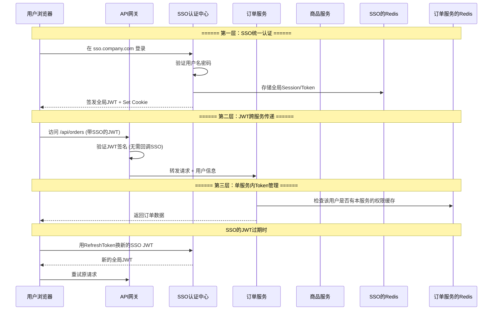

在这个架构中：

| 层次 | 谁负责 | 用什么 |
|------|------|------|
| **统一认证**（SSO） | SSO 认证中心 | JWT（全局 Token）+ Redis（管理全局会话） |
| **Token 传递** | API 网关 | 验证全局 JWT 签名，解析用户身份 |
| **单服务权限** | 订单服务 / 商品服务 | 各自内部可以用 JWT + Redis 管理自己的资源级权限 |

---

## 🗺️ 六、三种常见架构图

### 🏢 6.1 单体应用：JWT + Redis

适合：1 个后端服务 + 1 个前端

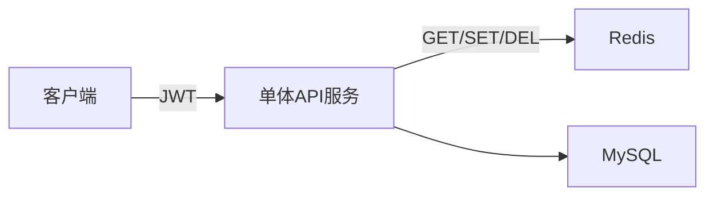

### 🔗 6.2 同产品微服务：JWT + API 网关 + 共享认证

适合：电商 / SaaS 等单一产品内部的多个微服务

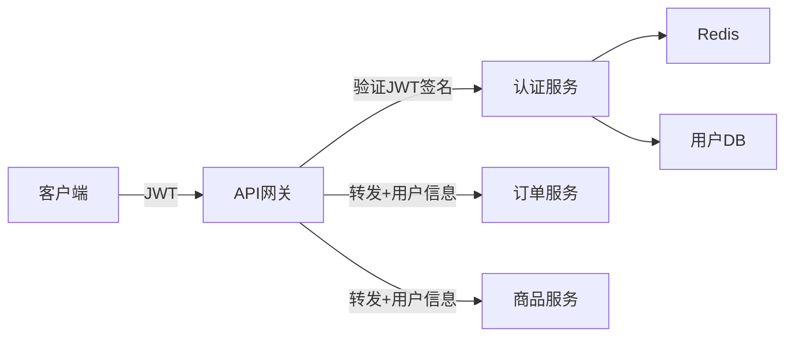

特点：只有一套用户体系，一个登录入口。网关负责验证，微服务自己不关心"这是谁"。**这不是 SSO，而是集中式网关认证。**

### 🌐 6.3 多产品 / 多系统：真正的 SSO

适合：集团公司，OA / CRM / ERP / BI 等多个独立系统

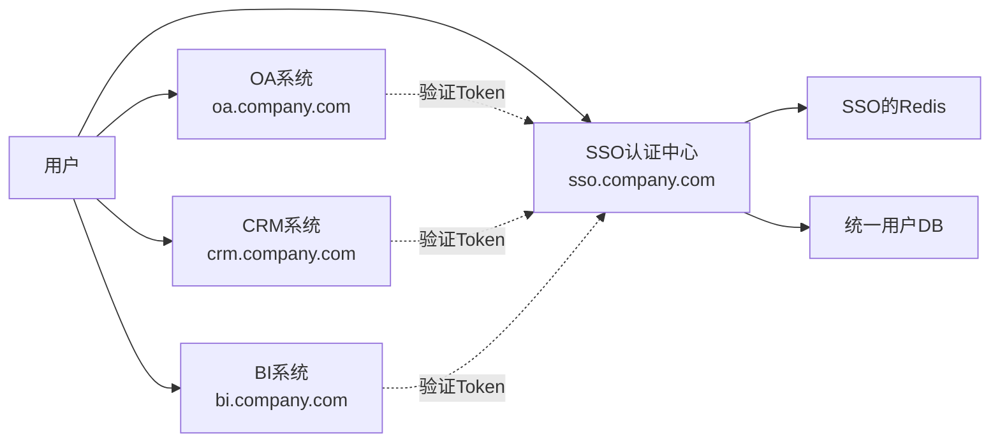

特点：多个独立系统，各有各的域名，各有各的业务数据库。SSO 认证中心独立部署，有统一的登录页面。用户登录一次后，访问任何系统都不需要再输入密码。**这才是 SSO。**

---

## 🔐 七、SSO 的三种主流实现方案

前文一直在讲"SSO 是什么"，但没有深入"SSO 怎么实现"。实际上，SSO 只是一种**架构思想**（有一个认证中心，所有业务系统委托它做认证），具体落地时有多种不同的**实现协议**。下面介绍三种最主流的方案。

### 🎫 7.1 CAS（Central Authentication Service）— 票据模式

CAS 是最早的 SSO 协议之一，由耶鲁大学发起，目前由 Apereo 基金会维护。它的核心思想是**票据（Ticket）**：认证中心签发一次性票据，业务系统凭票据去认证中心换取用户信息。

**核心角色**：

| 角色 | 说明 |
|------|------|
| **CAS Server**（认证中心） | 独立部署的认证服务，负责验证用户身份、签发 TGT 和 ST |
| **CAS Client**（业务系统） | 接入 CAS 的业务应用，每个应用都是一个 Client |
| **TGT（Ticket Granting Ticket）** | 用户登录成功后 CAS Server 签发的"登录凭证"，存在浏览器 Cookie 中（`CASTGC`），代表"该用户在 CAS 已登录" |
| **ST（Service Ticket）** | 一次性票据，业务系统拿到 ST 后去 CAS Server 验证，换取用户信息。ST 用一次即失效 |

**CAS 认证流程**：

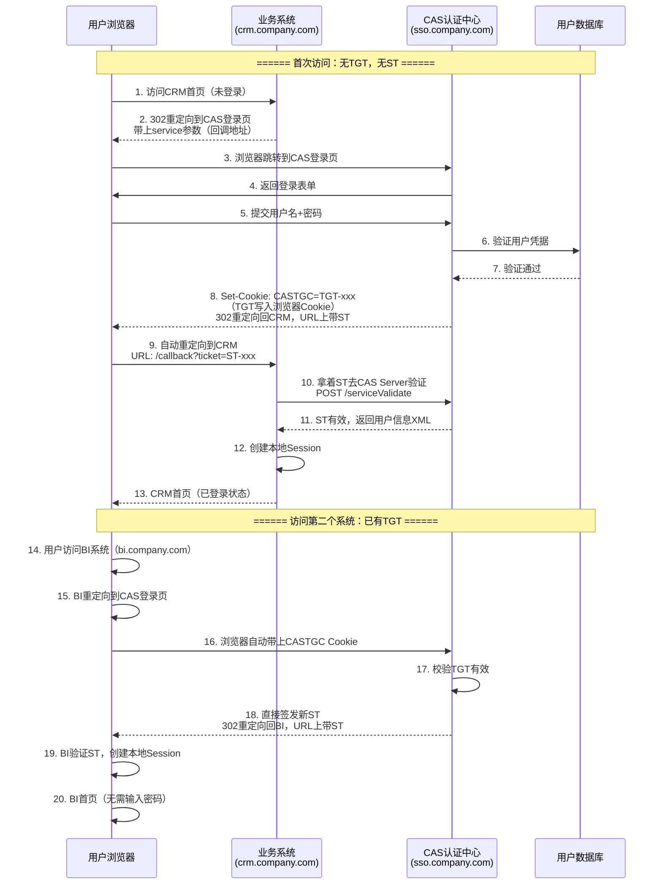

**关键点**：

- **TGT 存在浏览器 Cookie 中**，域名是 SSO 认证中心的域名（`sso.company.com`）。业务系统无法读取这个 Cookie（跨域隔离），只有重定向到 SSO 时浏览器才会自动携带
- **ST 是一次性的**，用后即焚——防止 ST 被截获后重用
- **ST 通过 URL QueryString 传递**（`?ticket=ST-xxx`），因此 CAS 协议本身不要求业务系统和认证中心在同一个域名下
- CAS 协议有完善的 Java 生态支持：**Apereo CAS**（服务端）、**spring-cas-client**（客户端），Spring Security 也内置了 CAS 集成

**适用场景**：传统 Web 应用（服务端渲染为主），企业内部系统（OA、ERP、CRM），对安全性要求较高的政府/金融项目。

### 🔐 7.2 OAuth 2.0 + OpenID Connect — 授权码模式

OAuth 2.0 本身是**授权协议**（Authorization），不是认证协议（Authentication）——它回答"我能把某某权限授权给这个第三方吗？"，而不是"这个用户是谁？"。**OpenID Connect**（简称 OIDC）是在 OAuth 2.0 之上增加了一层**身份认证层**，补全了"用户是谁"这个信息。实际项目中说的"OAuth 2.0 做 SSO"，通常指的是 OAuth 2.0 + OIDC。

**核心角色**：

| 角色 | 说明 |
|------|------|
| **Authorization Server**（授权服务器） | 认证中心，负责用户登录和签发 Token |
| **Client**（客户端） | 业务系统（SPA / 后端服务 / 移动 App） |
| **Resource Owner**（资源所有者） | 用户本人 |
| **Authorization Code**（授权码） | 一次性临时凭证，浏览器回调时通过 URL 传递，Client 用它去授权服务器换取 Token |
| **ID Token**（身份令牌） | JWT 格式，包含用户身份信息（sub、name、email 等），由授权服务器签发 |
| **Access Token**（访问令牌） | Client 用来调用 Resource Server（如 API 网关）的 Token，通常也是 JWT |

**OIDC 授权码流程（Authorization Code + PKCE）**：

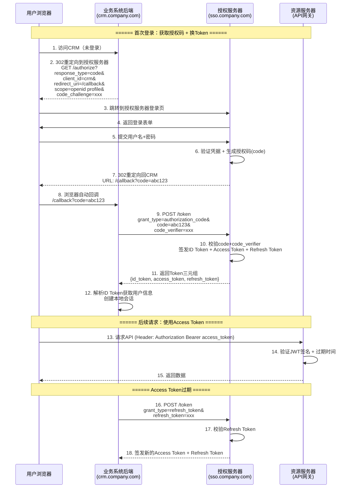

**关键点**：

- **授权码（code）前置**：用户凭据只在授权服务器的登录页提交，业务系统永远不接触用户名密码。业务系统拿到的是授权码，然后用授权码 + `client_secret` 去**后端**（非浏览器通道）换 Token，这样即使授权码在 URL 中短暂暴露，没有 `client_secret` 也无法使用
- **PKCE（Proof Key for Code Exchange）**：额外增加 `code_challenge` / `code_verifier` 校验，防止授权码被中间人截获后使用。SPA 和移动端因为无法安全存储 `client_secret`，PKCE 是必选项
- **ID Token 和 Access Token 职责分离**：ID Token 只用于告诉业务系统"用户是谁"，Access Token 用于访问资源服务器。两者格式都是 JWT，但 `aud`（audience）字段不同
- **生态极广**：Keycloak、Spring Authorization Server、Auth0、Okta、Azure AD、Google Identity 都是 OIDC 实现

**适用场景**：现代 Web/移动应用，SPA + 后端分离架构，第三方登录（社交登录），需要同时支持 Web 和 App 的产品。

### 🔑 7.3 JWT 共享密钥 SSO — 无状态验证模式

这是最轻量的 SSO 实现方式——没有票据、没有授权码、没有回调验证。核心思想极其简单：**所有业务系统和 SSO 认证中心共享同一把 JWT 签名密钥**。认证中心签发 JWT，各业务系统用共享密钥自行验证 JWT 签名即可，不需要每次都回调认证中心。

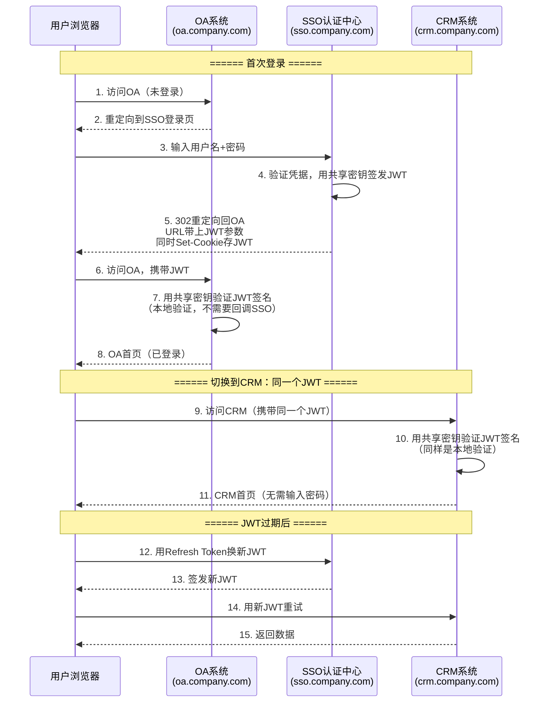

**关键点**：

- **无回调验证**：各业务系统本地验证 JWT 签名，不像 CAS 需要拿着 ST 去认证中心验证，也不像 OAuth 2.0 需要用授权码换 Token
- **共享密钥是核心**：所有业务系统持有同一把 HMAC-SHA256 密钥（或 RSA 公钥），才能互相认可对方的 JWT。这意味着密钥分发和管理是关键运维问题，建议通过配置中心（如 Nacos / Consul / Vault）统一管理
- **JWT 吊销延迟**：纯 JWT 的天然弱点——用户被禁用或登出后，已发出的 JWT 在过期前仍然有效。解决办法通常是额外引入 Redis 黑名单（即 JWT + Redis 模式），变成 7.2 和当前方案的变体
- **最简单也最脆弱**：适合内部微服务之间做身份传递，不太适合对外暴露的 SSO（安全性不如 OIDC / CAS）

**适用场景**：同一产品内部的微服务网关认证，内部管理系统（用户量不大、安全性要求适中），快速搭建 MVP 或原型。

### 📊 7.4 三种方案对比

| 对比维度 | CAS（票据模式） | OAuth 2.0 + OIDC（授权码模式） | JWT 共享密钥（无状态） |
|------|------|------|------|
| **核心机制** | TGT（长期票据）+ ST（一次性票据） | Authorization Code → 换 Token | 共享密钥签发 JWT，本地验签 |
| **是否需要回调认证中心** | 是（每次 ST 验证都要回调） | 是（授权码换 Token 要回调） | 否（本地验证签名） |
| **Token 格式** | XML（CAS 协议标准返回格式） | JWT（ID Token、Access Token） | JWT |
| **无状态** | 否（CAS Server 维护 TGT → 用户映射） | 否（授权服务器维护授权码和 Token） | 是（JWT 自包含用户信息） |
| **吊销支持** | 好（删除 TGT 即可，新 ST 无法签发） | 好（吊销 Refresh Token + Access Token 黑名单） | 依赖 JWT 过期时间，实时吊销需额外引入 Redis 黑名单 |
| **移动端/SPA 支持** | 差（协议设计于 2000 年初，主要面向传统 Web） | 优（PKCE 专为移动端/SPA 设计） | 中（SPA 可存储 JWT，移动端也可） |
| **实现复杂度** | 中（Java 生态有现成支持） | 高（需理解多种 grant type 和 OIDC 协议栈） | 低（逻辑简单，代码少） |
| **生态成熟度** | 成熟（Apereo CAS、Spring Security CAS） | 极成熟（Keycloak、Auth0、Spring Authorization Server、各种 SDK） | 自己实现 |
| **第三方登录** | 不支持 | 原生支持（社交登录、企业联合身份） | 需自己对接 |
| **典型用户** | 高校、政府、传统企业 Web 系统 | 互联网产品、SaaS、开放平台 | 内部微服务网关、小型内部系统 |

---

## 🤔 八、什么时候选什么方案

### 🗺️ 8.1 场景到方案的映射

| 你的场景 | 推荐的 SSO 方案 | 原因 |
|------|------|------|
| 传统企业 Web 系统（服务端渲染），内部使用，有 Java 技术栈积累 | **CAS** | CAS 在 Java 生态最成熟，Spring Security 内置支持，部署简单 |
| 现代 Web 产品（SPA + 后端 API），需要同时支持 App、H5、第三方登录 | **OAuth 2.0 + OIDC** | OIDC 是当前行业标准，生态最强，多端兼容最好 |
| 同一产品内的微服务（订单/商品/用户），都有同一个网关做认证 | **JWT 共享密钥 + API 网关** | 不需要独立 SSO 认证中心，网关统一验证即可，这是"共享认证"，不叫 SSO |
| 快速原型或内部小工具，没有严格的吊销需求 | **JWT 共享密钥 SSO** | 实现最简单，2 小时就能跑通 |
| 集团公司，OA / CRM / ERP / BI 多个独立系统跨域共享登录 | **OAuth 2.0 + OIDC** 或 **CAS** | 需要独立认证中心，具体选哪个看系统形态（老系统用 CAS，新系统用 OIDC） |

### 🏗️ 8.2 从技术方案到架构选择

将 SSO 方案的选择放到更大的架构决策框架中：

| 你的场景 | 推荐架构 | 说明 |
|------|------|------|
| 只做一个后端服务 | 纯 JWT 或 JWT + Redis | 没有跨服务需求，简单即可 |
| 同一个产品的多个微服务 | API 网关 + JWT | 网关统一验证，微服务无感。不需要独立的 SSO 认证中心 |
| 公司有多个独立系统，用户希望一次登录到处使用 | **SSO + OIDC** 或 **SSO + CAS** | 部署独立的认证中心，所有系统对接 |
| SSO 认证中心内部的 Token 管理 | JWT + Redis | SSO 认证中心自己也需要管理 Token 生命周期 |
| 需要在同一产品中实现"踢人"、"多设备管理" | JWT + Redis | SSO 是跨系统的，Token 管理是单系统的，两者组合使用 |

---

## 🎯 九、总结

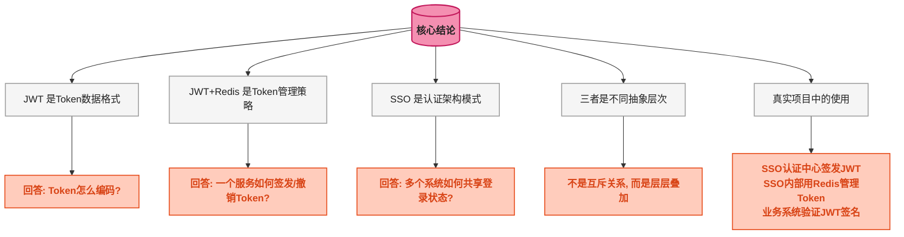

**一句话总结**：

-  **JWT** 告诉你 Token **长什么样**（三段式，Base64 + 签名）
-  **JWT + Redis** 告诉你一个服务**怎么管理**自己的 Token（签发、验证、撤销）
-  **SSO** 告诉你**怎么让用户登录一次就能访问所有系统**（统一认证中心）

三者不是竞争关系，而是**不同抽象层次的互补关系**。一个使用了 SSO 的大型项目，其 SSO 认证中心内部很可能就在用 JWT + Redis 管理全局 Token。
