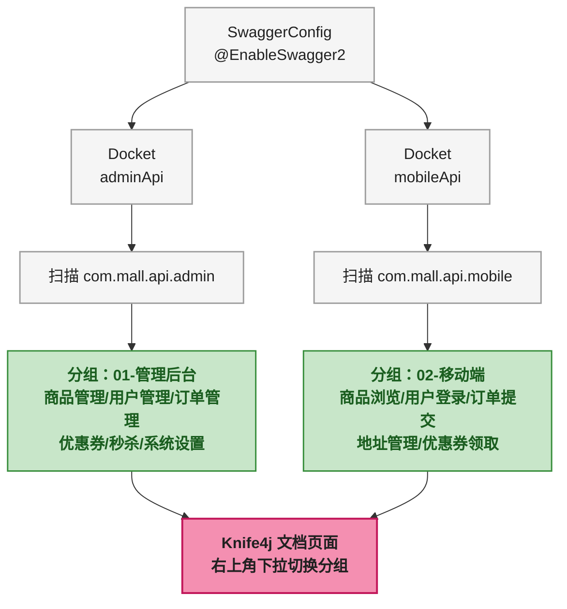
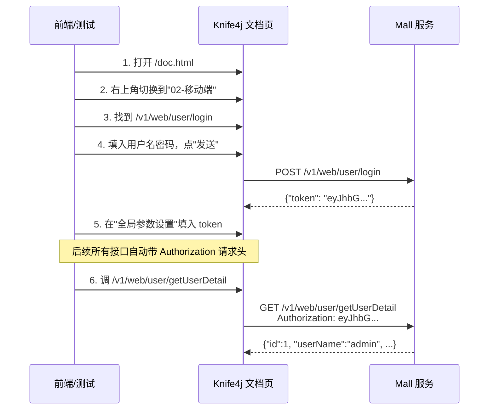
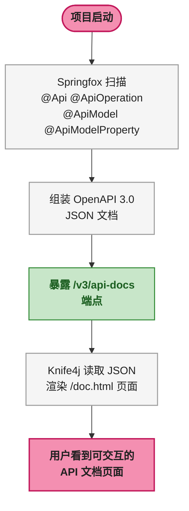

# Knife4j 接口文档从配置到上线

## 第1步：目标说明 — 打造可交互的 API 文档

后端写完接口，前端过来问"这个参数什么意思""返回字段有哪些""能不能让我直接调一下看看效果"——这种场景写过的都懂。

Swagger 就是来解决这个问题的。它能根据代码里的注解自动生成接口文档页面，前端直接在页面上看字段说明、调接口、看返回，不用再追着后端问。而 Knife4j 是 Swagger 的增强 UI，比原生 Swagger UI 好看得多，还支持离线文档导出、全局参数设置、接口排序等实用功能。

本教程基于 Mall 商城项目的真实配置，从零开始搭建一套 Knife4j + Swagger 接口文档，目标是让读者看完就能在自己的项目里用起来。

最终效果：访问 Knife4j 页面，能看到按模块分组的接口列表，点开任意接口能看到请求参数、响应示例，还能直接在页面上填入 Authorization 请求头，在线调试接口。

## 第2步：前置条件

开始之前，先确认项目环境满足以下条件。

| 条件 | 要求 | 验证命令 |
|------|------|----------|
| JDK | 1.8+ | `java -version` |
| Maven | 3.6+ | `mvn -v` |
| Spring Boot | 2.x | 查看 `pom.xml` 中 `spring-boot-starter-parent` 版本 |
| 现有 Spring Boot Web 项目 | 已有 Controller | 项目中存在 `@RestController` 类 |

> ⚠️ 新手提示：Knife4j 3.0.2 基于 Springfox 3.0.0，兼容 Spring Boot 2.x。如果是 Spring Boot 3.x 项目，需要使用 `knife4j-openapi3-spring-boot-starter` 4.x 版本，注解包名也从 `io.swagger.annotations` 变为 `io.swagger.v3.oas.annotations`，差异较大，本教程不涉及。

## 第3步：环境搭建

### 添加 Knife4j 依赖

在 `mall-api` 模块的 `pom.xml` 中加入 Knife4j starter：

```xml
<dependency>
    <groupId>com.github.xiaoymin</groupId>
    <artifactId>knife4j-spring-boot-starter</artifactId>
    <version>3.0.2</version>
</dependency>
```

`knife4j-spring-boot-starter` 自带 Springfox 和 Swagger UI，不需要额外引入 `springfox-swagger2` 或 `springfox-swagger-ui`，否则反而会版本冲突。

### 编写 SwaggerConfig 配置类

这是整个接入的核心。Mall 项目把接口按"管理后台"和"移动端"分成两个接口组，各自对应不同的包路径，方便前后端各看各的。

```java
@Configuration
@EnableSwagger2
public class SwaggerConfig {

    private static final String BASE_PACKAGE = "com.mall.api";

    @Bean
    public Docket adminApi() {
        return new Docket(DocumentationType.OAS_30)  // ① OAS 3.0 规范
                .apiInfo(apiInfo())                   // ② 文档基本信息
                .groupName("01-管理后台")              // ③ 接口分组名
                .select()
                .apis(RequestHandlerSelectors
                    .basePackage(BASE_PACKAGE + ".admin"))  // ④ 扫描 admin 包
                .paths(PathSelectors.any())           // ⑤ 所有路径都收录
                .build()
                .globalRequestParameters(
                    getGlobalRequestParameters());     // ⑥ 全局参数
    }

    @Bean
    public Docket mobileApi() {
        return new Docket(DocumentationType.OAS_30)
                .apiInfo(apiInfo())
                .groupName("02-移动端")
                .select()
                .apis(RequestHandlerSelectors
                    .basePackage(BASE_PACKAGE + ".mobile"))
                .paths(PathSelectors.any())
                .build()
                .globalRequestParameters(
                    getGlobalRequestParameters());
    }
}
```

逐行解释：

| 行 | 做什么 | 为什么这样写 |
|----|--------|-------------|
| ① | `DocumentationType.OAS_30` | 生成 OpenAPI 3.0 格式的文档，JSON 结构更规范，部分网关工具导入 API 时要求 3.0 格式 |
| ② | `apiInfo()` | 统一设置文档标题、描述、版本号，两个分组共用一份 |
| ③ | `groupName` | Knife4j 右上角下拉切换分组，前缀 `01-` `02-` 控制排序，数字比中文更可靠 |
| ④ | `basePackage` | 按包名区分前后台接口，admin 包和 mobile 包各自独立，物理隔离不会串 |
| ⑤ | `paths(PathSelectors.any())` | 收录所有路径。如果想只收录 `/v1/` 开头的，可用 `paths(PathSelectors.ant("/v1/**"))` |
| ⑥ | `globalRequestParameters` | 所有接口统一带上 Authorization 请求头参数，前端在 Knife4j "全局参数设置"里填一次 token，所有接口调试时自动携带 |

### 全局 Authorization 参数

Mall 项目几乎所有接口都需要认证，所以在 SwaggerConfig 里加了全局请求头参数，前端不用每个接口手动填 token：

```java
private List<RequestParameter> getGlobalRequestParameters() {
    List<RequestParameter> parameters = new ArrayList<>();
    parameters.add(new RequestParameterBuilder()
            .name("Authorization")         // 请求头名称
            .description("认证Token")       // 在文档中的说明文字
            .in(ParameterType.HEADER)      // 参数位置：请求头
            .query(q -> q.model(m -> m.scalarModel(ScalarType.STRING))
                    .defaultValue(""))     // 默认值留空
            .required(false)               // 非必填（登录等接口不需要）
            .build());
    return parameters;
}
```

### 文档基本信息

```java
@Bean
public ApiInfo apiInfo() {
    return new ApiInfoBuilder()
            .title("Mall 商城 API 文档")
            .description("管理后台 & 移动端接口说明")
            .version("1.0.0")
            .build();
}
```

这部分比较简单，但有个易踩坑点：`ApiInfo` 和 `Docket` 的关联是通过 `new Docket(...).apiInfo(apiInfo())` 完成的，如果忘了调用 `.apiInfo()`，Knife4j 页面标题会显示默认值。

### 项目结构总览

项目按 Controller 的包路径天然分成两组，Knife4j 的分组与之对应：



## 第4步：分步实践

### 第1步实操：给 Controller 类加 @Api

每个 Controller 类上加 `@Api` 注解，`tags` 属性在 Knife4j 里作为接口分类标签展示：

```java
@Api(tags = "后台-商品管理", description = "商品接口")
@RestController
@RequestMapping("/v1/product")
public class ProductController {
    // ...
}
```

`tags` 的值会出现在 Knife4j 左侧菜单中，同一个 `tags` 值的接口会归到同一组。管理后台的命名约定是 `后台-模块名`，移动端是 `移动端-模块名`，一眼能看出来哪个是后台接口哪个是前端接口。

> ⚠️ 新手提示：`@Api` 的 `tags` 和 SwaggerConfig 里的 `groupName` 是两个层级的概念。`groupName` 决定右上角的下拉分组（admin vs mobile），`tags` 决定左侧菜单的分类（商品管理、用户管理等）。别搞混。

**预期效果**：启动项目后访问 Knife4j 页面，左侧菜单出现"后台-商品管理"分类。

**排错**：如果左侧菜单没出现，检查 Controller 是否在 SwaggerConfig 配置的 `basePackage` 扫描路径下。com.mall.api.admin 包下的 Controller 才会被 adminApi 的 Docket 收录。

### 第2步实操：给接口方法加 @ApiOperation

每个接口方法上加 `@ApiOperation`：

```java
@ApiOperation(notes = "通过id查询商品信息", value = "通过id查询商品信息")
@GetMapping("/findById")
public ProductEntity findById(Long id) {
    return productService.findById(id);
}
```

`notes` 和 `value` 都写了——虽然大部分情况下只写 `value` 就够，但 `notes` 在一些旧版 Swagger UI 中会作为详细描述展示，两者都写兼容性最好。

完整 Controller 示例：

```java
@Api(tags = "后台-用户管理", description = "用户接口")
@RestController
@RequestMapping("/v1/user")
public class UserController {

    @Autowired
    private UserService userService;

    @ApiOperation(notes = "通过id查询用户信息", value = "通过id查询用户信息")
    @GetMapping("/findById")
    public UserEntity findById(Long id) {
        return userService.findById(id);
    }

    @ApiOperation(notes = "根据条件查询用户列表", value = "根据条件查询用户列表")
    @PostMapping("/searchByPage")
    public ResponsePageEntity<UserEntity> searchByPage(
            @RequestBody UserQuery userQuery) {
        return userService.searchByPage(userQuery);
    }

    @ApiOperation(notes = "添加用户", value = "添加用户")
    @PostMapping("/insert")
    public void insert(@RequestBody UserEntity userEntity) {
        userService.insert(userEntity);
    }

    @ApiOperation(notes = "修改用户", value = "修改用户")
    @PostMapping("/update")
    public int update(@RequestBody UserEntity userEntity) {
        return userService.update(userEntity);
    }

    @ApiOperation(notes = "批量删除用户", value = "批量删除用户")
    @PostMapping("/deleteByIds")
    public int deleteById(@RequestBody @NotNull List<Long> ids) {
        return userService.deleteByIds(ids);
    }
}
```

这几个方法覆盖了 CRUD 的典型场景：单条查询、分页查询、新增、修改、批量删除。

**预期效果**：展开左侧菜单分类后，能看到每个接口的简要描述，点进去能看到请求参数和返回值类型。

**排错**：如果方法列表里某接口的 `value` 显示为空，检查是否拼错了注解——`@ApiOperation` 的正确包名是 `io.swagger.annotations.ApiOperation`，不是 `io.swagger.annotations.Api`。

### 第3步实操：给实体类加 @ApiModel 和 @ApiModelProperty

接口文档光有方法说明还不够，前端还得知道每个字段的含义。在实体类上标注 `@ApiModel` 和 `@ApiModelProperty`：

```java
@ApiModel("用户实体")
@Data
public class UserEntity extends BaseEntity {

    @ApiModelProperty("头像")
    private Long avatarId;

    @NotEmpty(message = "邮箱不能为空")
    @ApiModelProperty("邮箱")
    private String email;

    @ApiModelProperty("密码")
    private String password;

    @NotEmpty(message = "用户名不能为空")
    @ApiModelProperty("用户名")
    private String userName;

    @ApiModelProperty("部门ID")
    private Long deptId;

    @ApiModelProperty("部门")
    private DeptEntity dept;

    @ApiModelProperty("手机号码")
    private String phone;

    @ApiModelProperty("性别 1：男 2：女")
    private Integer sex;

    @ApiModelProperty("有效状态 1:有效 0:无效")
    private Boolean validStatus;

    @ApiModelProperty("角色列表")
    private List<RoleEntity> roles;

    @ApiModelProperty("最后登录城市")
    private String lastLoginCity;

    @ApiModelProperty("最后登录时间")
    private Date lastLoginTime;
}
```

关键点：

| 注解 | 位置 | 作用 |
|------|------|------|
| `@ApiModel("用户实体")` | 类上 | 在文档中给这个 Model 起个中文名 |
| `@ApiModelProperty("邮箱")` | 字段上 | 在文档中给字段加中文说明 |
| 结合 `@NotEmpty` | 字段上 | 校验注解的信息也会被 Swagger 识别，展示在文档中 |

**预期效果**：在 Knife4j 的"参数"或"返回响应"区域展开实体类时，每个字段后面都有中文说明，枚举值字段（比如性别）的描述文字直接标明了 `1：男 2：女`。

**排错**：如果某个字段在文档中显示字段名但没显示说明，多半是忘了加 `@ApiModelProperty`。另外注意 `@ApiModelProperty` 的导入路径是 `io.swagger.annotations.ApiModelProperty`，别导成 swagger3 的包。

### 第4步实操：访问 Knife4j 文档页面

启动项目后，访问 Knife4j 默认地址：

```
http://localhost:8080/doc.html
```

> ⚠️ 新手提示：Knife4j 的页面路径是 `/doc.html`，不是 Swagger 原生的 `/swagger-ui.html`。虽然 Knife4j 也兼容 `/swagger-ui.html`，但 `/doc.html` 的功能更多（全局参数设置、离线文档导出、接口排序等）。

页面结构：

1. **右上角下拉框**：切换"01-管理后台"和"02-移动端"两个分组
2. **左侧菜单树**：按 `@Api(tags)` 分组的接口列表
3. **中间文档区**：接口详情、参数说明、在线调试
4. **全局参数设置**（Knife4j 特有）：填入 Authorization token 后所有接口自动携带

在线调试流程：

1. 先调用移动端的 `/v1/web/user/login` 登录接口，拿到 token
2. 打开 Knife4j 的"全局参数设置"，填入 `Authorization` 的值
3. 之后调任何需要认证的接口，Knife4j 会自动带上这个请求头



## 第5步：部署验证

### 验证清单

| 验证项 | 预期结果 |
|--------|----------|
| 访问 `/doc.html` | 显示 Knife4j 文档页面，非 404 |
| 右上角分组切换 | 能看到"01-管理后台"和"02-移动端"两个分组 |
| 左侧菜单 | 每个分组下按 `@Api(tags)` 显示接口分类 |
| 接口方法展示 | 展开分类后能看到每个接口的 `@ApiOperation` 描述 |
| 参数说明 | 点开接口，请求参数每个字段有 `@ApiModelProperty` 的中文说明 |
| 在线调试 | 填入参数点"发送"，能收到响应 JSON |
| 全局 Authorization | 在全局参数设置中填入 token，其他接口自动携带 |

### 常见问题

**Q1：访问 `/doc.html` 返回 404？**

检查是否有配置类拦截了静态资源。Knife4j 的 HTML 页面是通过 Spring MVC 的静态资源映射提供的。如果项目自定义了 `WebMvcConfigurer` 并覆盖了 `addResourceHandlers`，需要确保放行 Knife4j 的资源路径：

```java
@Override
public void addResourceHandlers(ResourceHandlerRegistry registry) {
    registry.addResourceHandler("doc.html")
            .addResourceLocations("classpath:/META-INF/resources/");
    registry.addResourceHandler("/webjars/**")
            .addResourceLocations("classpath:/META-INF/resources/webjars/");
}
```

**Q2：Knife4j 页面上看不到某个 Controller 的接口？**

按顺序排查：
1. Controller 是否在 SwaggerConfig 配置的 `basePackage` 路径下
2. Controller 类上是否加了 `@Api` 注解（不加也能扫描到，但没注解的话部分版本可能不展示）
3. 方法上是否加了 `@ApiOperation`（不加的话 Knife4j 可能不展示该方法）
4. 项目是否配置了 `springfox.documentation.enabled=false`

**Q3：Swagger 注解太多，老项目逐个加工作量太大？**

真实教训：Mall 项目的 `CouponController`（优惠券管理）就没加任何 Swagger 注解——接口照常能用，但在 Knife4j 页面上看不到。新 Controller 建议从一开始就加好，老 Controller 可以分批补。不必一口气全补完，按模块迭代加更现实。

## 第6步：原理简述

### Swagger 文档是怎么生成的

一句话概括：Springfox 在项目启动时扫描带有 Swagger 注解的 Controller 和实体类，根据注解信息拼装成 OpenAPI 规范的 JSON 文档，Knife4j 再把这个 JSON 渲染成带交互功能的 HTML 页面。



Springfox 的核心是 `DocumentationPluginsBootstrapper`，它会在 Spring 容器启动后遍历所有 `Docket` Bean：

1. 拿到每个 `Docket` 的 `basePackage`，去对应包下找带 Spring MVC 注解的类
2. 读 `@Api`、`@ApiOperation` 等 Swagger 注解，提取描述信息
3. 读方法的参数和返回值类型，结合 `@ApiModel`、`@ApiModelProperty` 生成参数/响应结构
4. 把以上信息组装成 OpenAPI 3.0 格式的 Model 对象
5. 通过 `/v3/api-docs`（OAS 3.0 路径）暴露为 JSON 端点
6. Knife4j 的 `/doc.html` 页面通过 AJAX 请求 `/v3/api-docs` 拿到 JSON，然后用 Vue.js 渲染成界面

> ⚠️ 新手提示：`/v3/api-docs` 返回的是原始 JSON 文档，可以直接浏览器访问看看长什么样。这个端点在 Knife4j 3.x 中路径是 `/v3/api-docs`，在 Swagger 2 中路径是 `/v2/api-docs`，取决于 `DocumentationType`。

### 为什么要分成两个 Docket

Mall 项目把管理后台和移动端的接口放在两个 `Docket` 中，而不是一个 `Docket` 扫描整个 `com.mall.api` 包。简单说就是**各看各的，互不干扰**。

| 维度 | 单 Docket | 双 Docket（Mall 实际方案） |
|------|-----------|--------------------------|
| 接口数量 | 50+ 个接口混在一起 | 管理后台 ~30 个，移动端 ~20 个，清爽很多 |
| 权限区分 | 前后台接口不分，容易误调 | 前台看不到后台接口，反之亦然 |
| 团队协作 | 前端在 50 个接口里找自己需要的 | 移动端开发只看"02-移动端"分组 |
| 全局参数 | Authorization 对所有接口生效 | 可以给不同分组设不同全局参数 |

> 📌 前置知识：Docket 的分组不是通过注解控制的，而是通过 `groupName` + `basePackage` 的组合。一个 `Docket` Bean 对应 Knife4j 右上角下拉框里的一个选项。

## 第7步：总结与下一步

### 核心要点回顾

1. **依赖**：`knife4j-spring-boot-starter` 一个就够了，别额外引 springfox
2. **配置**：`Docket` 决定扫哪个包、生成什么文档、分到哪个组
3. **Controller 注解**：`@Api` 定分类，`@ApiOperation` 定接口描述
4. **Model 注解**：`@ApiModel` 定实体名，`@ApiModelProperty` 定字段说明
5. **访问地址**：`/doc.html` 是 Knife4j 专属页面，比 `/swagger-ui.html` 好用
6. **全局参数**：`globalRequestParameters` 让所有接口统一带 Authorization，不用每个接口手动填
7. **分组策略**：按前后台（admin / mobile）分成两个 Docket，各看各的

### 关于注解缺漏

Mall 项目的 `CouponController`（优惠券管理模块）没有加 Swagger 注解——这在真实项目中很常见：开发时赶进度，想着"以后补"，然后就一直没补。建议新模块从一开始就加好注解，老模块在迭代中分批补上。全部补完可能需要半天，但分模块补的话每次改代码时顺手加两行，成本几乎为零。

### 下一步学习方向

- **Knife4j 离线文档导出**：`/doc.html` 页面上方的"文档管理" → "离线文档"，可以导出 Markdown / Word / HTML 格式的接口文档，发给第三方对接方时特别有用
- **Spring Boot 3.x 适配**：如果升级到 Spring Boot 3.x，Knife4j 需要升级到 4.x 版本，注解包名也会变化，提前了解迁移路径
- **接口权限控制**：生产环境建议通过 Spring Security 配置，限制 `/doc.html` 和 `/v3/api-docs` 只在内网或特定角色可访问，避免接口文档对外暴露
- **结合 @Valid 校验**：Swagger 会自动识别 `@NotEmpty`、`@NotNull` 等校验注解，在文档中标注"必填"，无需额外配置
