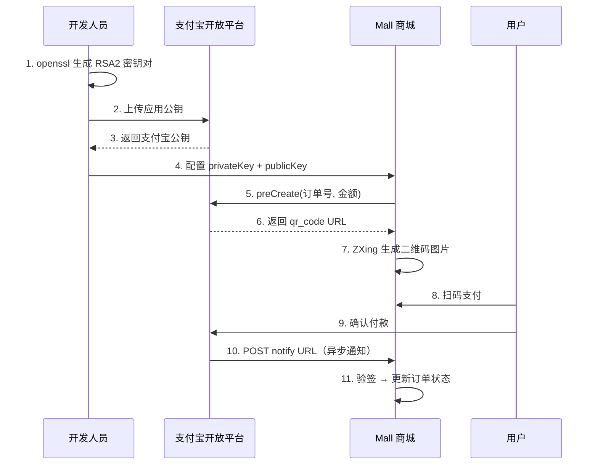

# 支付宝支付接入：沙箱调试 + EasySDK + QR 码支付实战

## 第1步：目标说明 — 支付接入最怕的是什么

不是代码复杂，而是"没法在本地调"——每次测试都要真的扫码付钱，退款、对账、异常场景根本模拟不了。

支付宝提供了沙箱环境（sandbox），完全模拟生产接口的行为，但用的是虚拟账户和虚拟资金。开发人员在沙箱里可以反复测试支付、退款、异常场景，不花一分钱。

Mall 项目对接的是支付宝"当面付"（FaceToFace），生成二维码让用户扫码支付。本教程覆盖：沙箱环境申请 → RSA2 密钥配置 → EasySDK 集成 → QR 码生成 → MockPay 开发模式 → 生产切换。

## 第2步：前置条件

| 条件 | 要求 | 获取方式 |
|------|------|----------|
| 支付宝开放平台账号 | 已注册并实名 | [open.alipay.com](https://open.alipay.com) |
| 沙箱环境 | 已开通（免费） | 开放平台 → 控制台 → 沙箱环境 |
| 沙箱应用 | 自动创建 | 沙箱环境会自动生成一个测试应用 |
| RSA2 密钥对 | 2048 位 | 支付宝密钥生成工具 或 `openssl genrsa` |

> ⚠️ 新手提示：沙箱环境和正式环境是两套完全独立的系统——沙箱的 APPID、网关地址、密钥、支付宝公钥都和正式环境不同。Sandbox 网关是 `openapi-sandbox.dl.alipaydev.com`，生产网关是 `openapi.alipay.com`。切换环境不是改一两个配置项，而是整套凭证都得换。

## 第3步：环境搭建

### 添加 Maven 依赖

```xml
<dependency>
    <groupId>com.alipay.sdk</groupId>
    <artifactId>alipay-easysdk</artifactId>
    <version>2.2.0</version>
</dependency>
```

EasySDK 是支付宝官方封装的"开箱即用"SDK。老版 SDK `alipay-sdk-java` 需要手动构造请求参数、手动验签，代码量是 EasySDK 的 3 ~ 5 倍。EasySDK 一个 `Factory.Payment.FaceToFace().preCreate()` 就完成预下单。

> 📌 前置知识：当面付（FaceToFace）是支付宝的线下支付产品。消费者扫商家的二维码付款。这里说的"预下单"（preCreate）就是商家系统向支付宝请求生成一个二维码，支付宝返回二维码的 URL，商家把这个 URL 转成二维码图片展示给消费者扫。

### 配置属性类

```java
@Data
public class AliPayProperties {
    private String protocol;       // https
    private String gatewayHost;    // 沙箱：openapi-sandbox.dl.alipaydev.com
    private String signType;       // RSA2
    private String appId;          // 支付宝应用 ID
    private String privateKey;     // 应用私钥
    private String publicKey;      // 支付宝公钥（注意：不是应用公钥！）
    private String notifyUrl;      // 支付异步通知地址
}
```

### 创建 EasySDK Config Bean

```java
@Configuration
public class AliPayConfig {

    @Autowired
    private BusinessConfig businessConfig;

    @Bean
    public Config config() {
        AliPayProperties ali = businessConfig.getAliPayConfig();
        Config config = new Config();
        config.protocol = ali.getProtocol();
        config.gatewayHost = ali.getGatewayHost();
        config.signType = ali.getSignType();
        config.appId = ali.getAppId();
        config.merchantPrivateKey = ali.getPrivateKey();
        config.alipayPublicKey = ali.getPublicKey();
        config.notifyUrl = ali.getNotifyUrl();
        return config;
    }
}
```

> ⚠️ 新手提示：`alipayPublicKey` 是**支付宝的公钥**，不是你自己生成的那个应用公钥。在支付宝开放平台 → 应用详情 → 接口加签方式里，上传你的应用公钥后，支付宝会生成一个"支付宝公钥"，把那个复制下来。很多人第一次对接在这里翻车——上传了自己的公钥然后填了自己的公钥，验签直接失败。

### application.yml 配置

开发环境（沙箱）：

```yaml
mall:
  mgt:
    aliPayConfig:
      protocol: https
      gatewayHost: openapi-sandbox.dl.alipaydev.com   # 沙箱网关
      signType: RSA2
      appId: 9021000138607290                          # 沙箱 APPID
      privateKey: 你的应用私钥
      publicKey: MIIBIjANBgkqhkiG9w0BAQ...            # 支付宝公钥（沙箱）
      notifyUrl: http://你的域名/notify                 # 回调地址（沙箱要求公网可达）
```

生产环境：

```yaml
mall:
  mgt:
    aliPayConfig:
      protocol: https
      gatewayHost: openapi.alipay.com                  # 生产网关
      signType: RSA2
      appId: ${ALIPAY_APP_ID}                          # 环境变量注入
      privateKey: ${ALIPAY_PRIVATE_KEY}
      publicKey: ${ALIPAY_PUBLIC_KEY}
      notifyUrl: ${ALIPAY_NOTIFY_URL}
```

关键差异只有两处：`gatewayHost` 和生产凭证用环境变量。沙箱环境的 APPID 和支付宝公钥是写死的（测试用，不敏感），生产环境的全部走环境变量。

## 第4步：分步实践

### 第1步实操：实现支付集成类

```java
@Component
public class AliPayIntegration {
    @Autowired
    private Config config;

    public String pay(TradeEntity tradeEntity) throws Exception {
        // ① 设置全局配置（只调一次即可，EasySDK 内部是静态持有）
        Factory.setOptions(config);

        // ② 调用当面付预下单接口
        AlipayTradePrecreateResponse payResponse = Factory.Payment
                .FaceToFace()
                .preCreate(
                    "yaomingye商城",                      // 商品标题（显示在支付宝收银台）
                    tradeEntity.getCode(),                // 商户订单号
                    tradeEntity.getPaymentAmount().toString() // 支付金额（元）
                );

        // ③ 从响应中解析出二维码 URL
        String httpBodyStr = payResponse.getHttpBody();
        JSONObject jsonObject = JSONObject.parseObject(httpBodyStr);
        return jsonObject
                .getJSONObject("alipay_trade_precreate_response")
                .get("qr_code").toString();               // 二维码链接
    }
}
```

三步就完成预下单，返回的是二维码 URL。EasySDK 把签名、请求体构造、HTTP 调用、响应解析全封装了。

> ⚠️ 新手提示：`preCreate()` 的三个参数——商品标题、订单号、金额——订单号必须是唯一的，支付宝用它做幂等。如果同一个订单号调两次`preCreate()`，支付宝返回的是第一次的二维码，不会重新生成。

### 第2步实操：将二维码 URL 转成图片返回给前端

```java
@RestController
@RequestMapping("/v1/web/pay")
public class WebPayController {

    @PostMapping("/createPayQrCode")
    public void createPayQrCode(
            @RequestBody TradeEntity tradeEntity,
            HttpServletResponse response) throws Exception {

        String qrUrl = aliPayIntegration.pay(tradeEntity);
        // Hutool 的 QrCodeUtil 底层用 ZXing
        QrCodeUtil.generate(qrUrl, 300, 300, "png",
                response.getOutputStream());
    }
}
```

`QrCodeUtil.generate()` 四个参数：二维码内容（URL）、宽、高、格式、输出流。直接把 PNG 图片流写进 `HttpServletResponse`，前端 `` 就能展示。

### 第3步实操：MockPay — 开发环境跳过真支付

不是所有开发调试都需要走支付宝。比如前端在调支付结果页的 UI，每次都要扫码太浪费时间。Mall 项目加了一个 `/mockPay` 端点：

```java
@PostMapping("/mockPay")
public void mockPay(@RequestBody TradeEntity tradeEntity) {
    payService.mockPay(tradeEntity);
    // mockPay 方法直接标记订单为"已支付"，不调支付宝
}
```

MockPay 不生成二维码、不调支付宝 API，直接在数据库里把支付状态改掉。前端联调支付成功后的页面流程时用这个，不用反复扫码。

**预期效果**：沙箱环境下，`/createPayQrCode` 返回的二维码用支付宝 App（沙箱版）扫码，会跳转到沙箱收银台，用沙箱买家账户支付，支付后支付宝回调 `/notify` 地址。

**排错**：沙箱回调不到本地开发机器。支付宝的 notify URL 必须支付宝服务器能访问到。本地开发用内网穿透工具把 `localhost:8080` 映射到公网域名，然后把 `notifyUrl` 设为那个公网地址。

### 第4步实操：生成 RSA2 密钥对

```bash
# 生成 2048 位私钥
openssl genrsa -out private_key.pem 2048

# 从私钥提取公钥
openssl rsa -in private_key.pem -pubout -out public_key.pem

# 转成 PKCS8 格式（Java 代码里用的是这个）
openssl pkcs8 -topk8 -inform PEM -in private_key.pem \
    -outform PEM -nocrypt -out private_key_pkcs8.pem
```

把 PKCS8 格式的私钥内容填到 `privateKey` 字段，把原始公钥上传到支付宝开放平台的"接口加签方式"，支付宝会生成对应的"支付宝公钥"，把那个填到 `publicKey` 字段。



## 第5步：部署验证

### 验证清单

| 验证项 | 沙箱环境 | 生产环境 |
|--------|----------|----------|
| 预下单返回 qrCode | 调用沙箱网关 | 调用生产网关 |
| 二维码生成 | ZXing 生成 PNG | 同左 |
| 扫码支付 | 沙箱版支付宝 App + 沙箱买家 | 正式支付宝 App |
| 异步通知 | 沙箱回调开发机器（需内网穿透） | 生产回调 |
| 验签 | RSA2 + 支付宝公钥 | 同左 |
| MockPay | 跳过真支付，直接改库 | 生产环境禁用 |

### 常见问题

**Q1：preCreate 返回 "sub_code:ACQ.INVALID_PARAMETER"？**

检查三个东西：① `gatewayHost` 是否和环境匹配（沙箱用 sandbox 后缀）② `appId` 是否和 `gatewayHost` 对应的环境一致 ③ `notifyUrl` 是否是合法的 HTTP/HTTPS 地址。

**Q2：支付宝异步通知收不到？**

先确认 `notifyUrl` 公网可达。沙箱环境在支付宝开放平台 → 沙箱应用 → 异步通知地址里设一次，代码里的 `notifyUrl` 优先级高于平台设置。另外支付宝的 `notify` 是 POST 请求，确保接口是 `@PostMapping` 而非 `@GetMapping`。

**Q3：生产环境和沙箱环境怎么快速切换？**

用 Spring Profile。`application-dev.yml` 里配沙箱参数，`application-prod.yml` 里配生产参数。切换时改 `spring.profiles.active` 就行。敏感凭证（密钥、APPID）一律用环境变量。

## 第6步：原理简述

### 当面付预下单的工作流程

`Factory.Payment.FaceToFace().preCreate()` 背后做了这几件事：

1. 把请求参数（订单号、金额、标题、notifyUrl）拼成 JSON
2. 用应用私钥对请求体做 RSA2 签名
3. 通过 HTTPS POST 发给支付宝网关
4. 支付宝验证签名 → 创建预下单记录 → 返回签过名的响应
5. SDK 自动用支付宝公钥验签 → 解析响应体

验签失败的话 EasySDK 直接抛异常，不会返回数据，所以代码里不需要手动判断"响应是否被篡改"。

### 沙箱和生产的全量差异

| 配置项 | 沙箱 | 生产 |
|--------|------|------|
| gatewayHost | `openapi-sandbox.dl.alipaydev.com` | `openapi.alipay.com` |
| appId | 沙箱固定值（如 `9021000138607290`） | 正式应用 ID |
| 应用私钥 | 测试密钥 | 正式密钥 |
| 支付宝公钥 | 沙箱公钥 | 正式公钥 |
| notifyUrl | 内网穿透地址 | 生产域名 |
| 买家账号 | 沙箱虚拟买家 | 真实支付宝用户 |
| 资金 | 虚拟资金 | 真实人民币 |

全部不同——所以"把沙箱参数直接改成生产参数就能上线"是不存在的。正确的做法是两套 yml，启动时选 Profile。

## 第7步：总结与下一步

### 核心要点

1. **沙箱环境零成本调试**：网关、APPID、密钥、买家账号全独立，虚拟资金随便测
2. **EasySDK 三行代码**：`Factory.setOptions()` → `preCreate()` → 解析 qrCode
3. **RSA2 密钥要搞清楚三个钥匙**：应用私钥（你生成）、应用公钥（上传给支付宝）、支付宝公钥（支付宝给你，用来验签）
4. **MockPay 开发加速**：本地联调不扫码，直接标记支付成功
5. **环境切换**：`application-dev.yml` + `application-prod.yml`，凭证走环境变量
6. **异步通知**：支付宝 POST 回调，本地开发需要内网穿透

### 下一步学习方向

- **支付回调验签**：支付宝异步通知到达时，用支付宝公钥验证签名，防止伪造回调
- **退款接口**：`Factory.Payment.FaceToFace().refund()`，沙箱同样支持
- **支付查询**：`Factory.Payment.FaceToFace().query()`，按订单号查支付状态
- **对账单下载**：`Factory.Bill().download()`，日终对账用
