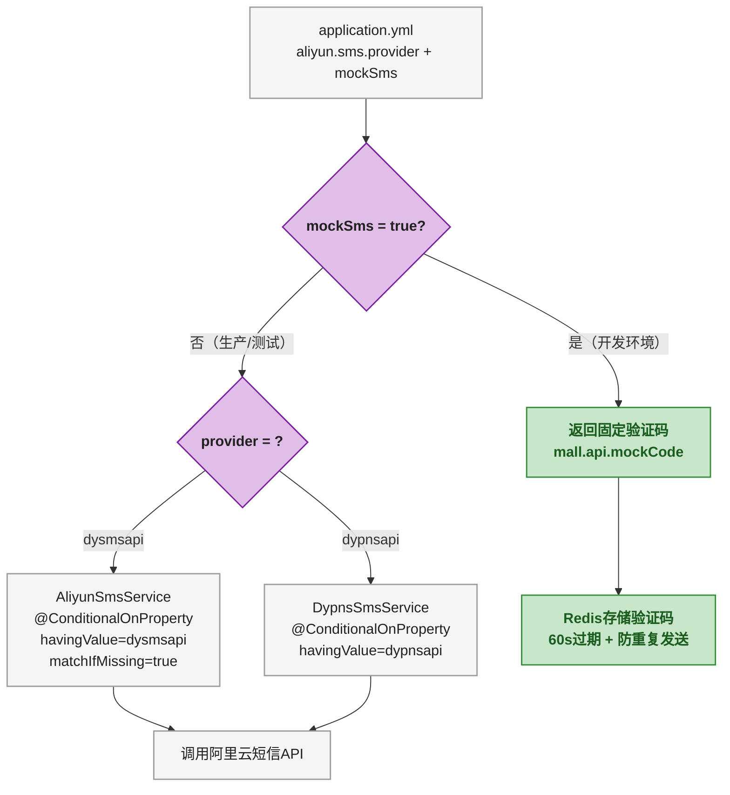
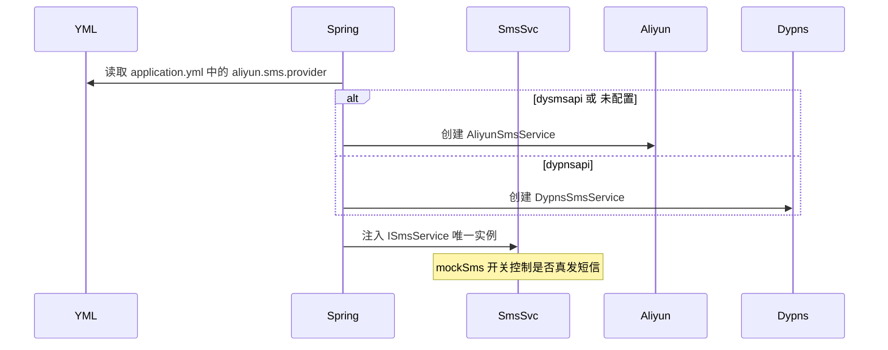

# 阿里云短信接入：双 Provider + Mock 验证码实战

## 第1步：目标说明 — 别在生产环境调试短信

发送短信验证码是登录/注册流程的核心环节。但对接阿里云短信服务时有两个现实问题：

1. **2024 年后个人资质基本申请不到官方短信签名和模板**，审核周期长还不一定过
2. **开发调试时不可能真发短信**，每条几分钱不说，频繁发送会被运营商拦截

Mall 项目从这两个痛点出发，设计了一套"双 Provider + Mock 开关"的短信架构：

- **生产环境**：用 dysmsapi（阿里云官方短信 SDK），需要企业资质
- **个人测试**：用 dypnsapi（阿里云号码验证服务），个人账号可申请
- **本地开发**：Mock 模式跳过真发，固定验证码 `123456`

目标是把这套架构讲清楚，读者照着做能在 30 分钟内完成短信接入。

## 第2步：前置条件

| 条件 | 要求 | 验证/获取方式 |
|------|------|-------------|
| 阿里云账号 | 已实名认证 | [aliyun.com](https://www.aliyun.com) 注册 |
| AccessKey | 已创建 RAM 用户，获取 AK/SK | 阿里云控制台 → RAM 访问控制 → 创建 AccessKey |
| 签名和模板（dysmsapi） | 企业资质，审核通过 | 阿里云短信服务控制台（个人很难申请） |
| 号码验证服务（dypnsapi） | 个人账号可开通 | 阿里云号码验证服务控制台 |

> ⚠️ 新手提示：dysmsapi 和 dypnsapi 是阿里云的两个不同产品。dysmsapi 是传统短信服务，需要申请签名和模板；dypnsapi 是号码验证服务，提供预置的短信模板（验证码、通知等），个人资质就能用。本教程两种都讲，读者根据自己的资质选一种即可。

## 第3步：环境搭建

### 添加 Maven 依赖

```xml
<!-- 方案1：官方短信 SDK -->
<dependency>
    <groupId>com.aliyun</groupId>
    <artifactId>alibabacloud-dysmsapi20170525</artifactId>
    <version>3.0.0</version>
</dependency>

<!-- 方案2：号码验证服务 SDK（个人可用） -->
<dependency>
    <groupId>com.aliyun</groupId>
    <artifactId>alibabacloud-dypnsapi20170525</artifactId>
    <version>1.0.8</version>
</dependency>
```

两个依赖都加也没问题，项目通过 `@ConditionalOnProperty` 在运行时选一个生效，不会冲突。

### 配置属性类

```java
@Configuration
@ConfigurationProperties(prefix = "aliyun.sms")
@Data
public class AliyunSmsConfig {
    private String host;              // API 端点，默认 dysmsapi.aliyuncs.com
    private String signName;          // 短信签名
    private String accessKeyId;       // 阿里云 AK
    private String accessKeySecret;   // 阿里云 SK
    private String registerTemplateCode;  // 注册验证码模板编码
    private String loginTemplateCode;     // 登录验证码模板编码
    private String codeExpireMinute = "5"; // 验证码有效期（分钟），dypnsapi 用
}
```

`@ConfigurationProperties(prefix = "aliyun.sms")` 使得 YAML 中的 `aliyun.sms.xxx` 自动绑定到这个类的字段，不需要手动 `@Value`。

### application.yml 配置

开发环境（Mock 模式 + 个人 dypnsapi）：

```yaml
aliyun:
  sms:
    host: dypnsapi.aliyuncs.com
    provider: dypnsapi              # 切换 Provider：dysmsapi / dypnsapi
    signName: 你的签名
    accessKeyId: ${ALIYUN_AK}
    accessKeySecret: ${ALIYUN_SK}
    registerTemplateCode: SMS_471350295
    loginTemplateCode: SMS_471510035
    codeExpireMinute: 5

mall:
  api:
    mockSms: true                    # true = Mock 模式，不真发
    mockCode: 123456                 # Mock 模式下的固定验证码
    registerSmsCodeExpireSecond: 60  # 验证码 Redis 有效期（秒）
```

生产环境：

```yaml
aliyun:
  sms:
    host: dysmsapi.aliyuncs.com
    provider: dysmsapi
    signName: ${ALIYUN_SMS_SIGN_NAME}
    accessKeyId: ${ALIYUN_AK}
    accessKeySecret: ${ALIYUN_SK}
    registerTemplateCode: ${ALIYUN_REGISTER_TEMPLATE}
    loginTemplateCode: ${ALIYUN_LOGIN_TEMPLATE}

mall:
  api:
    mockSms: false                   # 关掉 Mock，真发短信
```

关键点：

- AK/SK 用环境变量 `${ALIYUN_AK}` 注入，不硬编码到配置文件里（连 Git 一起提交会泄漏，阿里云会告警）
- `mockSms` 是 Mock 开关，开发环境 `true`，生产环境 `false`
- `provider` 决定启用 `AliyunSmsService` 还是 `DypnsSmsService`



## 第4步：分步实践

### 第1步实操：定义短信发送接口

```java
public interface ISmsService {
    boolean sendCode(String phone, String code, SmsTypeEnum smsTypeEnum);
}
```

接口只有一个方法：给定手机号、验证码、短信类型，返回是否发送成功。为什么用接口而不是直接写实现类？因为后面有两个 Provider 都要实现它，加上 `SmsService` 上层通过 `@Autowired private ISmsService iSmsService` 注入，运行时只有一个 Bean 生效。

### 第2步实操：实现 dysmsapi Provider（企业版）

```java
@Slf4j
@Component
@ConditionalOnProperty(name = "aliyun.sms.provider",
    havingValue = "dysmsapi", matchIfMissing = true)
public class AliyunSmsService implements ISmsService {
    private static final String SEND_SMS_SUCCESS = "OK";

    @Autowired
    private AliyunSmsConfig aliyunSmsConfig;

    public boolean send(String phone, String templateCode, String code) {
        StaticCredentialProvider provider = StaticCredentialProvider.create(
            Credential.builder()
                .accessKeyId(aliyunSmsConfig.getAccessKeyId())
                .accessKeySecret(aliyunSmsConfig.getAccessKeySecret())
                .build());

        AsyncClient client = AsyncClient.builder()
                .credentialsProvider(provider)
                .overrideConfiguration(
                    ClientOverrideConfiguration.create()
                        .setEndpointOverride(aliyunSmsConfig.getHost())
                        .setConnectTimeout(Duration.ofSeconds(30)))
                .build();

        SendSmsRequest request = SendSmsRequest.builder()
                .phoneNumbers(phone)
                .signName(aliyunSmsConfig.getSignName())
                .templateCode(templateCode)
                .templateParam("{\"code\":\"" + code + "\"}")
                .build();

        CompletableFuture<SendSmsResponse> response = client.sendSms(request);
        SendSmsResponse resp = response.get();
        return SEND_SMS_SUCCESS.equals(resp.getBody().getCode());
    }

    @Override
    public boolean sendCode(String phone, String code, SmsTypeEnum type) {
        String templateCode = type == SmsTypeEnum.REGISTER
            ? aliyunSmsConfig.getRegisterTemplateCode()
            : aliyunSmsConfig.getLoginTemplateCode();
        return send(phone, templateCode, code);
    }
}
```

逐行解释：

| 行 | 做什么 |
|----|--------|
| `@ConditionalOnProperty` | 只有 `aliyun.sms.provider=dysmsapi` 时才创建这个 Bean；`matchIfMissing=true` 表示没配这个属性时默认创建（兼容旧配置） |
| `StaticCredentialProvider` | 用 AK/SK 构建认证凭证，新版 SDK 的认证方式 |
| `AsyncClient` | 异步 HTTP 客户端，需要手动 close，否则连接泄漏 |
| `SendSmsRequest.builder()` | 构建短信发送请求：手机号、签名、模板编码、模板参数 |
| `templateParam` | 阿里云短信模板中的变量，格式 `{"code":"123456"}`，对应模板中 `${code}` |

### 第3步实操：实现 dypnsapi Provider（个人测试版）

```java
@Slf4j
@Component
@ConditionalOnProperty(name = "aliyun.sms.provider",
    havingValue = "dypnsapi")
public class DypnsSmsService implements ISmsService {

    @Autowired
    private AliyunSmsConfig aliyunSmsConfig;

    public boolean send(String phone, String templateCode, String code) {
        StaticCredentialProvider provider = StaticCredentialProvider.create(
            Credential.builder()
                .accessKeyId(aliyunSmsConfig.getAccessKeyId())
                .accessKeySecret(aliyunSmsConfig.getAccessKeySecret())
                .build());

        try (AsyncClient client = AsyncClient.builder()
                .credentialsProvider(provider)
                .overrideConfiguration(
                    ClientOverrideConfiguration.create()
                        .setEndpointOverride(aliyunSmsConfig.getHost())
                        .setConnectTimeout(Duration.ofSeconds(30)))
                .build()) {

            SendSmsVerifyCodeRequest request = SendSmsVerifyCodeRequest.builder()
                    .phoneNumber(phone)
                    .signName(aliyunSmsConfig.getSignName())
                    .templateCode(templateCode)
                    .templateParam(String.format(
                        "{\"code\":\"%s\",\"min\":\"%s\"}",
                        code, aliyunSmsConfig.getCodeExpireMinute()))
                    .build();

            CompletableFuture<SendSmsVerifyCodeResponse> response =
                client.sendSmsVerifyCode(request);
            SendSmsVerifyCodeResponse resp = response.get();
            return "OK".equals(resp.getBody().getCode());
        }
    }
}
```

dypnsapi 版本的关键差异：

| 差异点 | dysmsapi | dypnsapi |
|--------|----------|----------|
| API 方法 | `client.sendSms(...)` | `client.sendSmsVerifyCode(...)` |
| 连接管理 | 手动 `client.close()` | `try-with-resources` 自动关闭 |
| 模板参数 | `{"code":"123456"}` | `{"code":"123456","min":"5"}` 多一个有效期参数 |
| 适用场景 | 企业资质，自定义签名模板 | 个人资质，预置模板 |

> ⚠️ 新手提示：`@ConditionalOnProperty` 使得 `AliyunSmsService` 和 `DypnsSmsService` 互斥——同一时间只有一个 Bean 被创建。Spring 容器启动时根据 `aliyun.sms.provider` 的值决定创建哪一个。

### 第4步实操：编写 SmsService 业务层（Mock 开关 + 防刷）

```java
@Service
public class SmsService {

    @Autowired
    private ISmsService iSmsService;  // Spring 自动注入当前激活的 Provider
    @Autowired
    private RedisUtil redisUtil;

    @Value("${mall.api.mockSms:false}")
    private Boolean mockSms;
    @Value("${mall.api.mockCode:123456}")
    private String mockCode;
    @Value("${mall.api.registerSmsCodeExpireSecond:60}")
    private long registerSmsCodeExpireSecond;

    private boolean sendSmsCode(String phone, SmsTypeEnum type) {
        // ① 防重复发送：同一手机号+同一类型，60 秒内只能发一次
        String key = getSmsCodePrefixKey(phone, type);
        if (StringUtils.hasLength(redisUtil.get(key))) {
            throw new BusinessException("当前请求太频繁了，请稍后重试");
        }

        // ② Mock 开关：开发环境直接返回固定验证码
        String code;
        if (BooleanUtil.isTrue(mockSms)) {
            code = mockCode;
        } else {
            code = RandomUtil.getSixBitRandom();
            iSmsService.sendCode(phone, code, type);
        }

        // ③ 存入 Redis（60s 过期），供登录接口校验
        redisUtil.set(key, code, registerSmsCodeExpireSecond);
        return true;
    }
}
```

这段代码的逻辑链路：

1. 先查 Redis 里这个手机号 + 类型是否已有验证码，有就拒绝（防刷）
2. Mock 模式直接返回固定验证码，不调阿里云 API
3. 非 Mock 模式生成 6 位随机码，调 `iSmsService.sendCode()` 真发短信
4. 验证码存 Redis，设 60s 过期

**预期效果**：开发环境设 `mockSms: true`，无论怎么调发送接口，都是 `123456` 这 6 位数，不走阿里云 API，不收钱。

**排错**：Mock 模式下发现验证码不是 `123456`，检查 `mall.api.mockCode` 是不是被改过。

## 第5步：部署验证

### 验证清单

| 验证项 | Mock 模式 | 真发模式 |
|--------|-----------|----------|
| 发送短信接口返回成功 | 直接返回，验证码固定 `123456` | 调用阿里云 API |
| 手机收到短信 | 收不到（Mock 模式不真发） | 阿里云后台有发送记录 |
| Redis 验证码校验 | `123456` 能通过 | 6 位随机码能通过 |
| 60 秒内重复发送 | 报"请求太频繁" | 报"请求太频繁" |
| 切换 Provider | 改 yml 中 `provider` 值，重启生效 | 同左 |
| AK/SK 错误 | Mock 模式不报错（不调 API） | 启动时不报错，调接口时报错 |

### 常见问题

**Q1：dysmsapi 审核不通过怎么办？**

切到 dypnsapi：把 `aliyun.sms.provider` 改为 `dypnsapi`，`aliyun.sms.host` 改为 `dypnsapi.aliyuncs.com`，重启即可。代码零改动——`@ConditionalOnProperty` 自动切换 Bean。

**Q2：本地开发想临时真发一次短信怎么弄？**

把 `mockSms: true` 改成 `mockSms: false`，重启项目。调一下发送接口，手机会收到真实短信。调完记得改回来。

**Q3：模板参数 `{"code":"123456"}` 格式怎么确定？**

在阿里云短信控制台 → 模板管理 → 查看模板详情。如果模板内容是 `您的验证码为${code}`，那 templateParam 就是 `{"code":"123456"}`。键名必须和模板中的变量名一致。

## 第6步：原理简述

### 为什么用 @ConditionalOnProperty 而不是 if-else

一句话版：**编译时写死 if-else 切换 Provider，改代码要重新打包发布；`@ConditionalOnProperty` 改 yml 配置重启就行**。



### Mock 模式的双层保护

| 层级 | 机制 | 作用 |
|------|------|------|
| YAML 配置层 | `mall.api.mockSms` | 控制是否真发短信，开发环境 `true` |
| Redis 频率层 | `smsCodePrefixKey` 60s 过期 | 同一手机号防止短时间内重复发送，Mock 和真发都生效 |

两层保护互相独立：即使 Mock 模式关掉，Redis 防刷照样工作；即使 Redis 关了，Mock 模式也不会真发短信。

## 第7步：总结与下一步

### 核心要点

1. **双 Provider**：dysmsapi（企业）+ dypnsapi（个人），通过 `@ConditionalOnProperty` 运行时切换
2. **Mock 开关**：`mall.api.mockSms`，开发环境 `true`，验证码固定 `123456`
3. **凭证管理**：AK/SK 用环境变量注入，不写死在 yml 里
4. **防刷机制**：Redis 存储验证码，60s 内同手机号不允许重复发送
5. **模板参数**：dysmsapi 传 `{"code":"xxx"}`，dypnsapi 多传一个 `min` 表示有效期

### 关于审核

阿里云短信签名和模板的审核，企业资质正常情况下 1 ~ 3 个工作日通过。个人资质 2024 年后基本不通过——这就是 Mall 项目同时接入 dypnsapi 的原因。如果只是想个人项目跑通，直接用 dypnsapi；如果是公司项目，拿企业资质走 dysmsapi 正式通道。

### 下一步学习方向

- **短信发送记录入库**：每次发送成功后记录到 `common_sms_record` 表，便于对账
- **图形验证码前置**：发送短信前先校验图形验证码，防止脚本刷短信
- **发送失败重试**：阿里云 API 调用失败时，通过 RocketMQ 延迟消息重试
