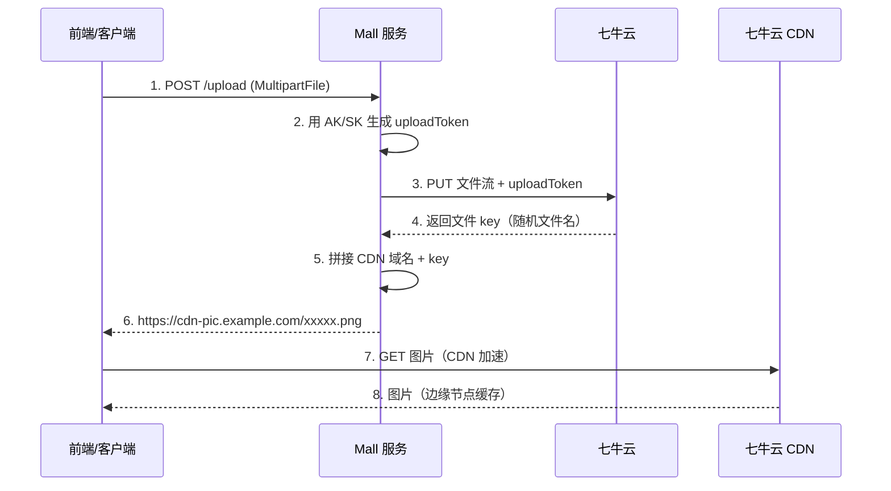

# 七牛云 OSS + SMTP 邮件：两个轻量级第三方接入实战

## 第1步：目标说明 — 图片上传和发邮件，每个项目的标配

电商项目两个常见的外部依赖：图片存储和邮件通知。商品图、用户头像得有个地方存，登录异常告警、注册欢迎得有个通道发。

Mall 项目用七牛云 OSS 存图片和文件（CDN 加速），用 SMTP 发邮件（Freemarker 模板渲染 HTML 正文），两个接入都不复杂，加起来不超过 200 行代码。本教程从申请凭证到代码封装，两套接入一次讲完。

## 第2步：前置条件

| 条件 | 七牛云 OSS | SMTP 邮件 |
|------|-----------|-----------|
| 账号 | [qiniu.com](https://www.qiniu.com) 注册，实名认证 | 任意邮箱服务（163、QQ邮箱、企业邮箱） |
| 凭证 | AccessKey / SecretKey | 邮箱地址 + SMTP 授权码 |
| 存储空间 | 在七牛云控制台创建 Bucket | 无需 |
| 域名 | Bucket 绑定 CDN 加速域名 | 无需 |

> ⚠️ 新手提示：七牛云 OSS 和阿里云 OSS 是竞品，功能几乎一样。Mall 项目选了七牛云，如果公司已经在用阿里云 OSS，代码结构完全能用，换 SDK 即可。接入模式是通用的。

## 第3步：环境搭建 — 七牛云 OSS

### 添加 Maven 依赖

```xml
<dependency>
    <groupId>com.qiniu</groupId>
    <artifactId>qiniu-java-sdk</artifactId>
    <version>7.4.0</version>
</dependency>
```

### 配置属性类

```java
@Component
@ConfigurationProperties(prefix = "oss.qiniu")
@Data
public class QiNiuConfig {
    private String accessKey;        // 七牛云 AK
    private String secretKey;        // 七牛云 SK
    private String bucketPictureName; // 图片 Bucket 名称
    private String domainPicture;     // 图片 CDN 域名
    private String bucketFileName;    // 文件 Bucket 名称
    private String domainFile;        // 文件 CDN 域名
}
```

图片和文件分两个 Bucket——图片需要 CDN 加速 + 图片处理（裁剪、加水印），文件的访问频率低但需要支持大文件下载，分开管理方便设置不同的生命周期策略。

### application.yml 配置

```yaml
oss:
  qiniu:
    accessKey: ${QINIU_ACCESS_KEY}
    secretKey: ${QINIU_SECRET_KEY}
    bucketPictureName: mall-picture
    domainPicture: https://cdn-pic.example.com
    bucketFileName: mall-file
    domainFile: https://cdn-file.example.com
```

## 第4步：分步实践 — 七牛云 OSS

### 第1步实操：封装上传工具类

```java
@Component
public class QiNiuUtil {
    public static final String IMAGE = "image";
    public static final String FILE = "file";

    @Autowired
    private QiNiuConfig qiNiuConfig;

    public String upload(InputStream file, String fileType,
                         String fileContextType) throws Exception {
        // ① 创建上传管理器
        Configuration cfg = new Configuration(Region.region2());
        UploadManager uploadManager = new UploadManager(cfg);

        // ② 生成上传凭证
        Auth auth = Auth.create(
            qiNiuConfig.getAccessKey(),
            qiNiuConfig.getSecretKey());

        // ③ 根据文件类型选 Bucket
        String bucket = IMAGE.equals(fileType)
            ? qiNiuConfig.getBucketPictureName()
            : qiNiuConfig.getBucketFileName();
        String upToken = auth.uploadToken(bucket);

        // ④ 执行上传
        Response response = uploadManager.put(
            file, null, upToken, null, fileContextType);

        // ⑤ 解析响应，返回完整 CDN URL
        DefaultPutRet putRet = new Gson()
            .fromJson(response.bodyString(), DefaultPutRet.class);
        String domain = IMAGE.equals(fileType)
            ? qiNiuConfig.getDomainPicture()
            : qiNiuConfig.getDomainFile();
        return domain + putRet.key;
    }
}
```

逐行解释：

| 步骤 | 代码 | 说明 |
|------|------|------|
| ① | `new UploadManager(cfg)` | 七牛云上传管理器，复用即可，线程安全 |
| ② | `Auth.create(AK, SK)` | 用 AK/SK 生成认证对象 |
| ③ | `auth.uploadToken(bucket)` | 为指定 Bucket 生成上传凭证，有效期默认 1 小时 |
| ④ | `uploadManager.put(file, null, upToken, null, mimeType)` | `put(InputStream, key, token, params, mime)`，key=null 时七牛云自动生成文件名 |
| ⑤ | `domain + putRet.key` | 七牛云返回的 key 是文件名，拼上 CDN 域名就是最终的外链 URL |

> ⚠️ 新手提示：`uploadToken` 有过期时间（默认 3600 秒）。生产环境不要每次上传都生成新的 Auth 对象——把 `Auth` 定义为 Spring Bean 复用。但 `uploadToken` 每次上传都需要重新生成，因为它包含了上传策略（覆盖、回调等），这些策略写在 token 里。

### 第2步实操：Controller 层调用

```java
@PostMapping("/upload")
public String upload(@RequestParam("file") MultipartFile file,
                     @RequestParam("type") String type) throws Exception {
    return qiNiuUtil.upload(
        file.getInputStream(),
        type,                        // "image" 或 "file"
        file.getContentType()        // "image/png" 等 MIME 类型
    );
}
```

**预期效果**：POST 一个文件到 `/upload?type=image`，返回 `https://cdn-pic.example.com/xxxxx.png`，浏览器直接访问这个 URL 能看到图片。

**排错**：上传返回 401，检查 AK/SK 是否正确。上传返回 403，检查 Bucket 名称是否正确，以及 Bucket 是否是公开的（私有 Bucket 需要生成带签名的访问 URL）。

## 第3步：环境搭建 — SMTP 邮件

### 添加 Maven 依赖

```xml
<dependency>
    <groupId>org.springframework.boot</groupId>
    <artifactId>spring-boot-starter-mail</artifactId>
</dependency>
<dependency>
    <groupId>org.springframework.boot</groupId>
    <artifactId>spring-boot-starter-freemarker</artifactId>
</dependency>
```

`spring-boot-starter-mail` 提供 `JavaMailSender`，`freemarker` 用来渲染 HTML 邮件模板。

### application.yml 配置

```yaml
spring:
  mail:
    protocol: smtp
    host: smtp.163.com                    # SMTP 服务器地址
    port: 465                             # 25 / 465(SSL) / 587(TLS)
    username: your-email@163.com          # 发件人邮箱
    password: ${MAIL_PASSWORD}            # SMTP 授权码，不是登录密码！
    default-encoding: UTF-8

mall:
  mgt:
    sendEmailOff: true                    # 开发环境关掉真发
```

> ⚠️ 新手提示：`spring.mail.password` 填的是 SMTP 授权码，不是邮箱登录密码。以 163 邮箱为例：设置 → POP3/SMTP/IMAP → 开启 SMTP 服务 → 获取授权码。QQ 邮箱同理。直接用登录密码会认证失败。

## 第4步：分步实践 — SMTP 邮件

### 第1步实操：封装邮件服务

```java
@Component
public class EmailService implements IEmailService {

    @Autowired
    private JavaMailSender javaMailSender;
    @Value("${spring.mail.username}")
    private String fromEmail;

    /** 发送纯文本邮件 */
    public void sendEmail(String to, String subject, String content) {
        SimpleMailMessage message = new SimpleMailMessage();
        message.setFrom(fromEmail);
        message.setTo(to);
        message.setSubject(subject);
        message.setText(content);
        javaMailSender.send(message);
    }

    /** 发送 HTML 邮件 */
    public void sendHtmlEmail(String to, String subject,
                              String htmlContent) throws MessagingException {
        MimeMessage message = javaMailSender.createMimeMessage();
        MimeMessageHelper helper = new MimeMessageHelper(message, true);
        helper.setFrom(fromEmail);
        helper.setTo(to);
        helper.setSubject(subject);
        helper.setText(htmlContent, true);      // true = HTML 格式
        javaMailSender.send(message);
    }

    /** 发送带附件的邮件 */
    public void sendAttachmentsEmail(String to, String subject,
            String content, List<String> filePaths) throws MessagingException {
        MimeMessage message = javaMailSender.createMimeMessage();
        MimeMessageHelper helper = new MimeMessageHelper(message, true);
        helper.setFrom(fromEmail);
        helper.setTo(to);
        helper.setSubject(subject);
        helper.setText(content, true);
        for (String path : filePaths) {
            FileSystemResource file = new FileSystemResource(new File(path));
            helper.addAttachment(file.getFilename(), file);
        }
        javaMailSender.send(message);
    }
}
```

三种邮件类型覆盖了常见场景：纯文本（简单通知）、HTML（模板渲染的富文本邮件）、带附件（Excel 报表导出后邮件发送）。

### 第2步实操：Freemarker HTML 模板 + 异步发送开关

Mall 项目用 Freemarker 渲染"异地登录告警邮件"，模板示例：

```html
<!-- remote-login-email.ftl -->
<html>
<body>
    <h2>异地登录告警</h2>
    <p>您的账号于 <strong>${loginTime}</strong> 在 <strong>${city}</strong> 登录。</p>
    <p>IP 地址：${ip}</p>
    <p>如果这不是您的操作，请立即修改密码。</p>
</body>
</html>
```

发送时的开关控制（关键设计）：

```java
@Service
public class SendEmailTask implements IAsyncTask {

    @Value("${mall.mgt.sendEmailOff:true}")
    private Boolean sendEmailOff;         // 默认 true = 关掉

    @Override
    public void doTask(CommonTaskEntity task) {
        if (BooleanUtil.isTrue(sendEmailOff)) {
            return;                       // 开发环境直接返回，不真发
        }
        // 渲染模板 → 调 EmailService → 真发邮件
    }
}
```

`sendEmailOff` 默认 `true`——新项目配置没写对邮件不发，不会因为配错了而启动报错。生产环境显式改为 `false`。

**预期效果**：开发环境 `sendEmailOff: true`，调发送接口什么都不发生。生产环境设为 `false`，调发送接口，收件箱收到渲染好的 HTML 邮件。

**排错**：`JavaMailSender` 发送报认证失败，检查 `spring.mail.password` 是不是授权码而不是登录密码。端口 25 被云服务商封锁，换成 465（SSL）或 587（TLS）。

## 第5步：部署验证

### 七牛云 OSS 验证清单

| 验证项 | 预期结果 |
|--------|----------|
| 图片上传 | 返回 CDN URL，浏览器可访问 |
| 文件上传 | 返回 CDN URL，浏览器触发下载 |
| AK/SK 错误 | 上传报 401 |
| Bucket 私有 | 直接访问 URL 报 403（需要签名 URL） |

### SMTP 邮件验证清单

| 验证项 | 预期结果 |
|--------|----------|
| sendEmailOff=true | 不发送邮件，控制台无异常 |
| sendEmailOff=false + 正确配置 | 收件箱收到邮件 |
| HTML 邮件 | 收件箱渲染出富文本格式 |
| 附件邮件 | 收件箱可以下载附件 |

## 第6步：原理简述

### 七牛云 OSS 上传流程



两个关键设计：

1. **直传服务端中转**（Mall 的方案）：客户端 → Mall 服务 → 七牛云。优点是 AK/SK 不暴露给前端，可以在上传前做校验（文件大小、格式）。缺点是文件流经过服务端，多一层带宽消耗。
2. **客户端直传七牛云**：前端直接拿 uploadToken 上传。优点是减轻服务端带宽压力，缺点是 token 和 AK 可能泄露到前端。生产环境建议用 Mall 项目的中转方案。

### 邮件发送开关为什么默认关

默认 `sendEmailOff: true` 是一个防御性设计。SMTP 配置没写好不会导致启动失败，也不会在本地开发时疯狂发邮件。生产环境部署时显式设 `false`，是一个有意识的动作——必须有人确认过 SMTP 配置正确才能开启。

类似的防御性默认值也在短信接入中用：`mockSms: true`。原则是"涉及花钱和外部调用的功能，默认关闭，生产显式开启"。

## 第7步：总结与下一步

### 七牛云 OSS 核心要点

1. **两个 Bucket**：图片（CDN 加速 + 图片处理）和文件分开管理
2. **上传三步**：生成 Auth → 生成 uploadToken → uploadManager.put()
3. **返回值拼接**：CDN 域名 + 七牛云返回的文件 key = 最终外链
4. **AK/SK 走环境变量**，不写死在代码里

### SMTP 邮件核心要点

1. **Spring Boot 自动配置**：`spring-boot-starter-mail` 自动创建 `JavaMailSender` Bean
2. **授权码不是登录密码**：去邮箱设置里单独获取
3. **端口选择**：本地开发用 25，云服务器用 465（SSL）或 587（TLS）
4. **sendEmailOff 默认 true**：防御性设计，生产环境显式开启
5. **Freemarker 渲染 HTML**：模板文件放 `resources/templates/`，`TemplateEngine.process()` 渲染

### 下一步学习方向

- **七牛云图片处理**：URL 后拼接 `?imageView2/1/w/200/h/200` 参数，七牛云实时裁剪/缩放，不需要提前生成缩略图
- **私有 Bucket 签名 URL**：`auth.privateDownloadUrl(baseUrl, expireSeconds)` 生成带签名的临时访问链接
- **邮件异步队列**：发邮件放 RocketMQ 消息队列异步执行，不阻塞主线程
- **邮件发送记录**：记录每次发送的时间、收件人、主题、成功/失败状态，方便排查"没收到邮件"的客诉
