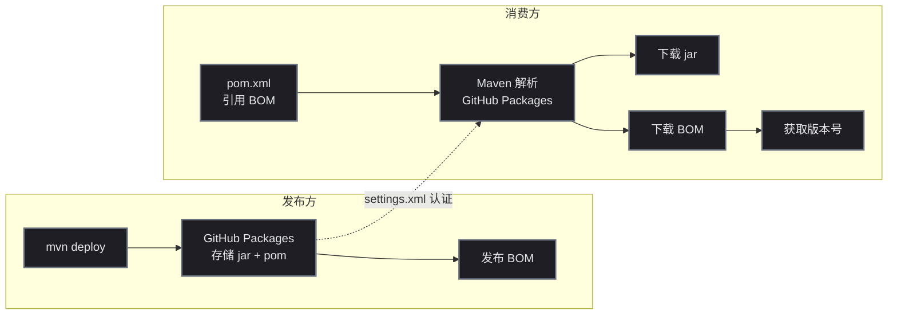

# GitHub Packages 发布 Maven 库：从 Token 配置到 BOM 管理

## 目标

把一个多模块 Maven 项目发布到 GitHub Packages，并让其他项目通过 BOM 统一引用。全程使用 GitHub 免费额度，不搭私有 Nexus。

## 前置条件

| 条件 | 说明 |
|------|------|
| GitHub 账号 | 一个，免费套餐即可 |
| Personal Access Token | `write:packages` + `read:packages` 权限 |
| Maven 3.6+ | 构建工具 |
| Java 17+ | 运行时 |

## 环境搭建

### 第 1 步：生成 GitHub Token

GitHub 右上角头像 → Settings → Developer settings → Personal access tokens → Tokens (classic) → Generate new token

勾选权限范围：

```
✅ write:packages  （发布包）
✅ read:packages   （下载包）
✅ repo            （访问仓库，write:packages 自动依赖）
```

> Token 创建后只会显示一次，复制保存好。有效期的建议：如果用于本地开发，设 30 ~ 90 天；如果用于 CI/CD，设成永不过期并定期轮换。

### 第 2 步：配置 Maven settings.xml

在 `~/.m2/settings.xml` 中添加 GitHub Packages 认证：

```xml
<settings>
    <servers>
        <server>
            <id>github</id>
            <username>your-github-username</username>
            <password>你的_GITHUB_TOKEN</password>
        </server>
    </servers>
</settings>
```

⚠️ 注意：`<id>` 必须和 POM 中 `<repository>` / `<distributionManagement>` 的 `id` 一致。Maven 通过 id 匹配认证信息。

### 第 3 步：配置项目的 POM

在根 POM 中配置发布地址和下载仓库：

```xml
<distributionManagement>
    <repository>
        <id>github</id>
        <name>GitHub Packages</name>
        <url>https://maven.pkg.github.com/你的用户名/仓库名</url>
    </repository>
</distributionManagement>

<repositories>
    <repository>
        <id>github</id>
        <name>GitHub Packages</name>
        <url>https://maven.pkg.github.com/你的用户名/仓库名</url>
    </repository>
</repositories>
```

这里的 `<id>github</id>` 必须和 settings.xml 中的 `<id>` 一致。

## 分步实践

### 1. 首次发布——mvn deploy

```bash
mvn deploy -DskipTests
```

预期输出：

```
Uploaded to github: .../mall-common-core/1.0.0/mall-common-core-1.0.0.jar
Uploaded to github: .../mall-common-core/maven-metadata.xml
[INFO] BUILD SUCCESS
```

验证方式：打开 GitHub 仓库页面 → 右侧 "Packages" 标签 → 应该能看到刚刚发布的包。

### 2. 版本冲突——409 错误

踩坑记录：**同一个版本号无法覆盖发布。**

```text
[ERROR] Failed to deploy artifacts: Could not transfer artifact ...
  status code: 409, reason phrase: Conflict (409)
```

GitHub Packages 不允许覆盖已存在的版本。这是设计理念——发布的版本就不可变，保证依赖方的构建可复现。

解法：**每次发布必须递增版本号。**

```bash
# 不可以
mvn deploy  # 1.0.0 → 409

# 可以
# 改 pom.xml 中版本为 1.0.1 → 发布成功
```

如果频繁发版，版本号会涨得很快。下面是某开发者在一天内踩出来的版本序列：

```
1.0.0 → 1.0.1 → 1.0.2 → 1.0.3 → 1.0.5 → 1.0.6 → 2.0.0 → 2.0.1 → 2.0.2 → 2.0.3 → 2.1.0
```

> 中间空缺的版本号（如 1.0.4）是因为 deploy 到一半部分模块上传成功，部分失败，导致版本冲突，只能跳号。

建议：用 `mvn versions:set -DnewVersion=xxx` 统一改版本，不要手动改多个 pom.xml。

### 3. 多模块发布——parent POM 的坑

多模块项目发布时，Maven 会按模块顺序逐个上传。先传父 POM，再传子模块。

```xml
<!-- 根 pom.xml -->
<groupId>cn.net.mall</groupId>
<artifactId>mall-spring-boot-starters</artifactId>
<version>1.0.0</version>
<packaging>pom</packaging>

<modules>
    <module>mall-cloud-bom</module>
    <module>mall-common-core</module>
    <module>mall-redis-spring-boot-starter</module>
</modules>
```

每个子模块的 POM 中引用父 POM：

```xml
<parent>
    <groupId>cn.net.mall</groupId>
    <artifactId>mall-spring-boot-starters</artifactId>
    <version>1.0.0</version>
</parent>
```

这里隐藏了一个问题：**子模块的 POM 中定义了父 POM 引用，但父 POM 本身也是一个需要发布的包。** 当消费者项目引入子模块时，Maven 不仅要下载子模块的 jar，还要下载父 POM 来解析版本。所以父 POM 也必须 publish。

### 4. BOM 式依赖管理

为了让消费者项目不需要在每个依赖上写版本号，可以发布一个 BOM 模块：

```xml
<!-- mall-cloud-bom/pom.xml -->
<artifactId>mall-cloud-bom</artifactId>
<packaging>pom</packaging>

<dependencyManagement>
    <dependencies>
        <dependency>
            <groupId>cn.net.mall</groupId>
            <artifactId>mall-common-core</artifactId>
            <version>${project.version}</version>
        </dependency>
        <dependency>
            <groupId>cn.net.mall</groupId>
            <artifactId>mall-redis-spring-boot-starter</artifactId>
            <version>${project.version}</version>
        </dependency>
    </dependencies>
</dependencyManagement>
```

消费者只需要引入 BOM，子模块就不需要写版本了：

```xml
<dependencyManagement>
    <dependencies>
        <dependency>
            <groupId>cn.net.mall</groupId>
            <artifactId>mall-cloud-bom</artifactId>
            <version>2.0.0</version>
            <type>pom</type>
            <scope>import</scope>
        </dependency>
    </dependencies>
</dependencyManagement>

<dependencies>
    <dependency>
        <groupId>cn.net.mall</groupId>
        <artifactId>mall-common-core</artifactId>
        <!-- 版本由 BOM 提供，不需要写 -->
    </dependency>
</dependencies>
```

### 5. BOM 不生效的排查

踩坑：BOM 配置正确，Maven 也能下载 BOM 的 POM，但版本就是不生效。

排查步骤：

```bash
# 检查 BOM 是否在有效 POM 中
mvn help:effective-pom | grep mall-cloud-bom

# 如果输出为空，说明 BOM import 没生效
# 原因：BOM 自己的 parent POM 下载失败导致整个 import 被跳过
```

根本原因是：**BOM 模块的 POM 中声明了 parent，consumer 下载 BOM 时会尝试解析 parent 的 POM。如果 parent 也需要从同一个 GitHub Packages 仓库下载，但 maven-metadata 没有正确同步，import 就会静默失败。**

解法：确保 BOM 的 parent POM 也发布在同一仓库中，并且版本号可被解析。

## 部署验证

### 验证包已发布

```bash
# 通过 curl 验证包可下载
curl -u "用户名:TOKEN" \
  "https://maven.pkg.github.com/用户名/仓库名/cn/net/mall/mall-common-core/1.0.0/mall-common-core-1.0.0.pom" \
  -o /dev/null -w "%{http_code}"
# 返回 302 表示可下载
```

### 验证消费者可正常引用

在消费者项目中运行：

```bash
mvn dependency:tree -Dincludes="cn.net.mall"
```

预期输出包含正确版本号：

```
[INFO] +- cn.net.mall:mall-common-core:jar:2.0.0:compile
```

如果版本号显示为 1.0.0（而不是 2.0.0），说明 BOM import 没正确解析，consumer 拿到的缓存的旧版本。

## 原理简述



GitHub Packages 本质上是一个兼容 Maven 协议的存储服务，和 Nexus 的区别：

| 特性 | Nexus | GitHub Packages |
|------|-------|---------------|
| 覆盖发布 | 允许 | **禁止**（409 Conflict） |
| 免费额度 | 自建 | 公共仓库免费 |
| 认证方式 | 独立账号 | GitHub Token |
| BOM 支持 | 标准 | 标准 |
| 多模块支持 | 标准 | 标准 |

## 总结与下一步

几个关键经验：

1. **Token 权限**： `write:packages` + `read:packages` 都要勾
2. **版本号不可覆盖**：每次发布必须递增，规划好版本策略
3. **parent POM 也必须发布**：BOM 不生效经常是因为 parent POM 下载失败
4. **多模块版本要统一**：用 `mvn versions:set` 批量改，不要手动一个个改
5. **BOM 先行**：先发布 BOM，再发布消费者

下一步可以做的：

- 配置 GitHub Actions 自动发布（ `.github/workflows/release.yml` ）
- 用 `maven-release-plugin` 管理版本号
- 配置 Maven 元数据用 SemVer 规范
